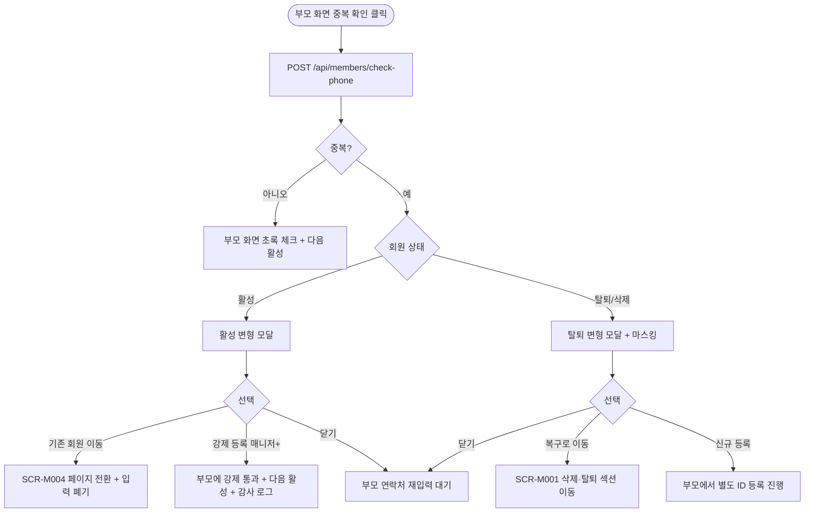

# DLG-M006 전화번호 중복 안내 다이얼로그

## 1. 다이얼로그 메타 정보

| 항목 | 값 |
|---|---|
| 작성일 | 2026-05-22 |
| 버전 | v1.0 |
| 상태 | 정합화 완료 |
| 도메인 | D02 회원관리 |
| 다이얼로그 ID | DLG-M006 |
| 다이얼로그명 | 전화번호 중복 안내 |
| 다이얼로그 유형 | 안내·분기형 모달 |
| 호출 화면 | SCR-M002 회원 등록, SCR-M003 회원 수정 |
| 우선순위 | P0 |
| 기능코드 | MBR-02, MBR-03 |
| 계약코드 | MBR-02, MBR-03 |

## 2. 다이얼로그 목적

전화번호 중복 안내 다이얼로그는 회원 등록 또는 정보 수정 시 이미 다른 회원에게 등록된 전화번호를 입력했을 때 중복 사실을 안내하고 운영자에게 다음 행동을 선택하게 하는 모달입니다. 동일 번호로 복수 회원이 생성되는 것을 방지하면서, 동시에 무기명 법인 같은 정당한 케이스에는 강제 등록을 허용하는 분기 처리를 제공합니다.

이 모달은 단순 차단형이 아니라 분기형입니다. 활성 회원과 중복인 경우, 탈퇴·삭제 회원과 중복인 경우 두 가지 변형이 있으며 각 변형마다 다른 선택지가 제공됩니다.

## 3. 부모 화면 호출 맥락

회원 등록(SCR-M002) 또는 회원 수정(SCR-M003)에서 연락처 입력 후 "중복 확인" 버튼을 눌렀을 때 백엔드 응답이 "이미 등록됨"으로 돌아오면 자동 호출됩니다.

회원 수정에서는 연락처가 새 번호로 변경된 경우에만 호출되며, 기존 번호와 동일하게 다시 입력한 경우에는 본인과의 중복이므로 호출되지 않습니다(본인 ID는 검색에서 제외).

이 모달을 닫고 부모 화면으로 복귀하면 운영자가 선택한 결과에 따라 다음 동작이 결정됩니다. "기존 회원으로 이동"은 부모 화면을 떠나 회원 상세로 이동, "강제 등록"은 부모 화면에서 중복 확인 상태가 "강제 통과"로 전환, "복구로 이동"은 회원 목록 삭제·탈퇴 섹션으로 이동, "닫기"는 부모 화면에서 연락처 재입력 대기 상태입니다.

## 4. 모달 구성요소

### 활성 회원 중복 변형

모달 상단에는 "이미 등록된 전화번호입니다"라는 제목이 표시됩니다.

본문에는 중복 발견된 기존 회원의 카드가 표시되며 회원명·이용권 상태·등록일·소속 지점 정보가 포함됩니다. 이미 탈퇴되지 않은 활성 회원이면 정상 카드로 표시됩니다.

하단에는 세 개의 버튼이 있습니다. "기존 회원으로 이동"은 회원 상세로 이동, "강제 등록"은 매니저+ 권한자에게만 활성(무기명 법인 같은 케이스), "닫기"는 변경 없이 모달 닫기입니다.

### 탈퇴·삭제 회원 중복 변형

같은 제목이지만 본문에는 탈퇴·삭제 회원의 카드가 마스킹된 상태(90일 경과 시)로 표시됩니다. 우선순위가 바뀌어 "복구로 이동" 버튼이 상단에 강조 표시되고 그 아래에 "신규 등록(별도 회원 ID 부여)"과 "닫기"가 표시됩니다.

복구로 이동을 선택하면 회원 목록(SCR-M001)의 삭제·탈퇴 회원 섹션으로 이동해 해당 회원을 복구할 수 있습니다.

## 5. 동작 흐름

부모 화면에서 중복 확인 → 백엔드 `POST /api/members/check-phone` → 응답이 "중복" → 이 모달 자동 호출 → 운영자 선택에 따라 분기.

기존 회원으로 이동: 모달 닫고 SCR-M004 회원 상세로 페이지 전환. 부모 화면의 입력값은 폐기됩니다.

강제 등록(매니저+): 모달 닫고 부모 화면의 중복 확인 상태를 "강제 통과"로 변경. 부모 화면의 [다음] 또는 [저장]이 활성화됩니다. 강제 등록 이벤트는 SCR-097 감사 로그에 기록됩니다.

복구로 이동: 모달 닫고 SCR-M001 회원 목록의 삭제·탈퇴 보기 토글 켜진 상태로 이동.

신규 등록(탈퇴·삭제 회원 중복 시): 모달 닫고 부모 화면에서 별도 회원 ID로 등록 계속 진행. 백엔드는 동일 연락처지만 다른 회원 ID로 INSERT를 허용합니다.

닫기 / ESC / 배경 클릭: 모달 닫고 부모 화면에서 연락처 재입력 대기. 입력값은 보존됩니다.

## 6. 권한별 처리

기존 회원으로 이동·복구로 이동·신규 등록·닫기는 모든 권한에서 가능합니다.

강제 등록은 매니저(manager) 이상 권한자에게만 노출됩니다. 스태프·FC·트레이너에게는 강제 등록 버튼이 hidden 처리되며 활성 회원 중복 시 "기존 회원으로 이동" 또는 "닫기"만 선택 가능합니다.

## 7. 화면 상태

| 상태 | 설명 |
|---|---|
| 활성 중복 변형 | 기존 회원 카드 + 이동/강제/닫기 |
| 탈퇴·삭제 중복 변형 | 마스킹된 카드 + 복구/신규/닫기 |
| 권한 부족 | 강제 등록 버튼 hidden |

## 8. 데이터 흐름

부모 화면의 `POST /api/members/check-phone` 응답에 중복 회원 정보(`isDuplicate=true`, `status`, `maskedProfile`, `memberId`)가 포함되어 이 모달에 전달됩니다. 모달 자체는 백엔드 호출을 별도로 하지 않고 부모 응답을 표시만 합니다.

강제 등록 선택 시 부모 화면 저장 시점에 `POST /api/members` 요청에 `forceRegisterFlag=true`가 추가되어 백엔드가 중복 검증을 우회합니다. 이 플래그는 매니저+ 권한 검증과 함께 처리됩니다.

강제 등록은 SCR-097 감사 로그에 별도 INSERT됩니다.

## 9. 예외 처리

권한 부족 사용자가 직접 API로 forceRegisterFlag를 보내면 백엔드가 403으로 거부 + 감사 로그 INSERT입니다.

탈퇴·삭제 회원의 90일 경과 PII 마스킹은 모달 본문에서 마스킹된 형태로 표시됩니다.

복구로 이동 후 동일 연락처 신규 회원이 별도로 또 존재하면 회원 병합 진입 권유가 추가로 표시됩니다.

## 10. 운영 정책

활성 회원 중복 정책은 강제 등록 권한자(매니저+) 외 차단입니다. 동일 연락처로 복수 활성 회원이 만들어지면 운영상 큰 혼란을 일으키기 때문입니다.

무기명 법인 강제 등록 허용 정책은 동일 회사 번호로 여러 회원 등록이 필요한 정당한 사례를 위한 예외입니다.

탈퇴·삭제 회원 중복 시 복구 우선 안내 정책은 회원이 이전에 가입했다가 탈퇴한 케이스를 신규 등록으로 처리하면 과거 이력이 단절되기 때문입니다.

90일 경과 PII 마스킹 정책은 X11 정책에 따라 마스킹된 상태로만 노출됩니다.

강제 등록 이벤트는 모두 감사 로그에 기록되어 사후에 권한 우회 시도와 강제 등록 사유를 추적할 수 있게 합니다.

## 11. 흐름 다이어그램

