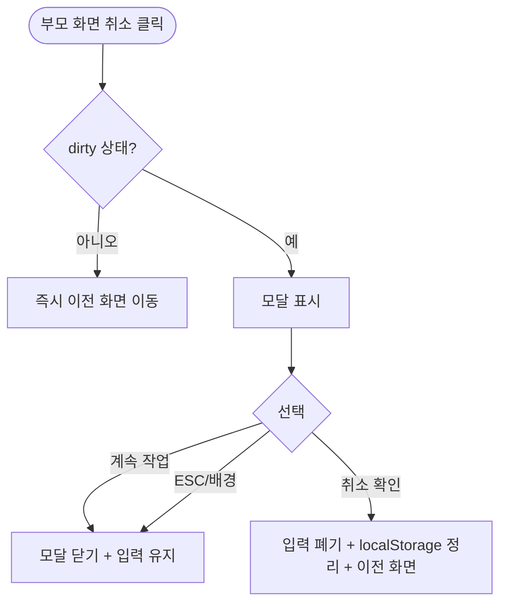

# DLG-M007 작업 취소 확인 다이얼로그

## 1. 다이얼로그 메타 정보

| 항목 | 값 |
|---|---|
| 작성일 | 2026-05-22 |
| 버전 | v1.0 |
| 상태 | 정합화 완료 |
| 도메인 | D02 회원관리 |
| 다이얼로그 ID | DLG-M007 |
| 다이얼로그명 | 작업 취소 확인 |
| 다이얼로그 유형 | 변경 손실 방지 확인형 모달 |
| 호출 화면 | SCR-M002 회원 등록, SCR-M003 회원 수정 |
| 우선순위 | P0 |
| 기능코드 | MBR-02, MBR-03 |
| 계약코드 | MBR-02, MBR-03 |

## 2. 다이얼로그 목적

작업 취소 확인 다이얼로그는 회원 등록 또는 수정 작업 중 운영자가 "취소" 버튼을 눌렀을 때 입력된 내용이 저장되지 않고 사라질 수 있음을 안내하여 실수로 인한 데이터 손실을 방지하는 모달입니다. 변경 사항이 있는 상태에서만 호출되며, 변경 사항이 전혀 없으면 모달 없이 즉시 이전 화면으로 이동합니다.

이 모달은 단순 안내가 아니라 사용자의 의사를 명확히 확인하는 단계입니다. 운영자가 카운터에서 신규 회원을 등록하다가 다른 일이 끼어들어 "취소"를 누르면, 그동안 입력한 30~40개 필드가 사라지는 사고를 막기 위해 한 번 더 묻습니다.

## 3. 부모 화면 호출 맥락

회원 등록(SCR-M002)의 하단 액션 바 "취소" 버튼, 회원 수정(SCR-M003)의 "취소" 버튼으로 호출됩니다.

호출 조건은 입력값이 한 건 이상 변경된 dirty 상태입니다. 변경 사항이 없는 경우(빈 폼 상태) 또는 회원 수정에서 원본과 동일한 상태에서는 이 모달이 호출되지 않고 즉시 이전 화면으로 이동합니다.

또한 브라우저 새로고침이나 탭 닫기, ESC 키, 배경 클릭 같은 다른 종류의 이탈 시도에도 이 모달이 호출될 수 있습니다(테넌트 설정에 따라). 브라우저 새로고침은 OS 기본 경고와 함께 처리됩니다.

확인 시 부모 화면이 떠나고 호출 직전 화면(회원 목록 또는 회원 상세)으로 돌아갑니다. 취소 시 모달만 닫히고 부모 화면의 입력값은 그대로 유지됩니다.

## 4. 모달 구성요소

모달 상단에는 "작업을 취소하시겠습니까?"라는 제목이 표시됩니다.

본문 안내 메시지는 "입력하신 내용이 저장되지 않습니다"가 명시되며, 회원 수정 모드에서는 "수정 사항이 사라지고 원래 값으로 돌아갑니다"로 변형 표시됩니다.

선택적으로 변경된 필드 요약(예: "3개 항목 변경됨")이 표시되어 운영자가 어느 정도 변경을 잃게 되는지 인식할 수 있습니다.

하단에는 두 개의 버튼이 있습니다. "계속 작업" 버튼은 모달만 닫고 부모 화면에서 작업을 계속할 수 있게 하며, "취소 확인" 버튼은 입력값을 폐기하고 이전 화면으로 돌아갑니다.

## 5. 동작 흐름

부모 화면에서 "취소" 클릭 → dirty 상태 확인 → 변경 있음 → 이 모달 호출 → 운영자 선택.

"계속 작업" 클릭: 모달 닫기 + 부모 화면 입력 상태 유지.

"취소 확인" 클릭: 모달 닫기 + 부모 화면 입력값 폐기 + 호출 직전 화면(회원 목록 SCR-M001 또는 회원 상세 SCR-M004)으로 라우팅.

ESC 키 또는 배경 클릭: 모달 닫기(계속 작업과 동일 효과).

회원 등록 모드에서 입력값이 localStorage 임시 저장 정책 대상이라면, "취소 확인" 시 localStorage가 함께 정리됩니다.

## 6. 권한별 처리

이 모달은 부모 화면(SCR-M002 회원 등록, SCR-M003 회원 수정)에 진입할 수 있는 모든 권한자에게 동일하게 동작합니다. 9개 역할(슈퍼관리자 `superAdmin`, 본사 최고관리자 `primary`, Owner(지점장) `owner`, 매니저 `manager`, FC `fc`, 트레이너 `trainer`, 스태프 `staff`, 프런트 `front`, 읽기 전용 `readonly`) 중 부모 화면 진입 권한이 있는 슈퍼관리자·본사 최고관리자·Owner(지점장)·매니저·스태프는 동일한 모달을 보며, 진입 권한이 없는 FC·트레이너·프런트·readonly는 이 모달을 만나지 않습니다. 권한별 노출·옵션 차이는 없습니다.

## 7. 화면 상태

| 상태 | 설명 |
|---|---|
| 기본 표시 | 안내 메시지 + 두 버튼 표시 |
| 회원 수정 모드 | "원래 값으로 돌아갑니다" 메시지 변형 |
| 변경 필드 요약 | 옵션: 변경 개수 표시 |

## 8. 데이터 흐름

이 모달은 백엔드를 호출하지 않습니다. 부모 화면의 dirty 상태만 확인하고 사용자 선택에 따라 부모 화면의 상태를 변경합니다.

"취소 확인" 선택 시 localStorage에 임시 저장된 드래프트가 있으면 함께 정리됩니다(회원 등록 30분 TTL 드래프트 정책).

감사 로그에는 별도 INSERT 없습니다(저장되지 않은 변경은 추적 대상이 아닙니다).

## 9. 예외 처리

브라우저 새로고침이나 탭 닫기 시 브라우저 기본 경고와 함께 이 모달이 호출되지 않을 수 있습니다(브라우저 보안 정책상). 이 경우 localStorage 드래프트 정책이 보완 역할을 합니다.

부모 화면이 저장 처리 도중일 때는 "취소" 버튼이 자동 비활성되어 이 모달이 호출되지 않습니다.

## 10. 운영 정책

변경 손실 방지 정책은 운영자가 카운터에서 신규 회원을 등록하다가 30~40개 필드 입력 후 무심코 취소를 눌러 모든 작업을 잃는 사고를 막기 위한 것입니다.

dirty 상태 검증 정책은 변경 사항이 한 건도 없으면 이 모달을 호출하지 않고 즉시 이전 화면으로 돌아가는 것입니다. 빈 폼에서 취소까지 모달을 거치게 하면 사용성이 떨어지기 때문입니다.

localStorage 임시 저장 30분 TTL 정책은 회원 등록 부모 화면에서 "취소 확인" 시 localStorage가 정리되고, 부모 화면이 강제 종료(브라우저 닫기·새로고침)된 경우에는 30분 동안 보존되어 재진입 시 복원 모달이 표시되는 것입니다.

회원 수정 모드 메시지 변형 정책은 회원 등록과 수정의 의미 차이를 명확히 전달하기 위한 것입니다. 등록은 "사라집니다", 수정은 "원래 값으로 돌아갑니다"로 표현됩니다.

## 11. 흐름 다이어그램

