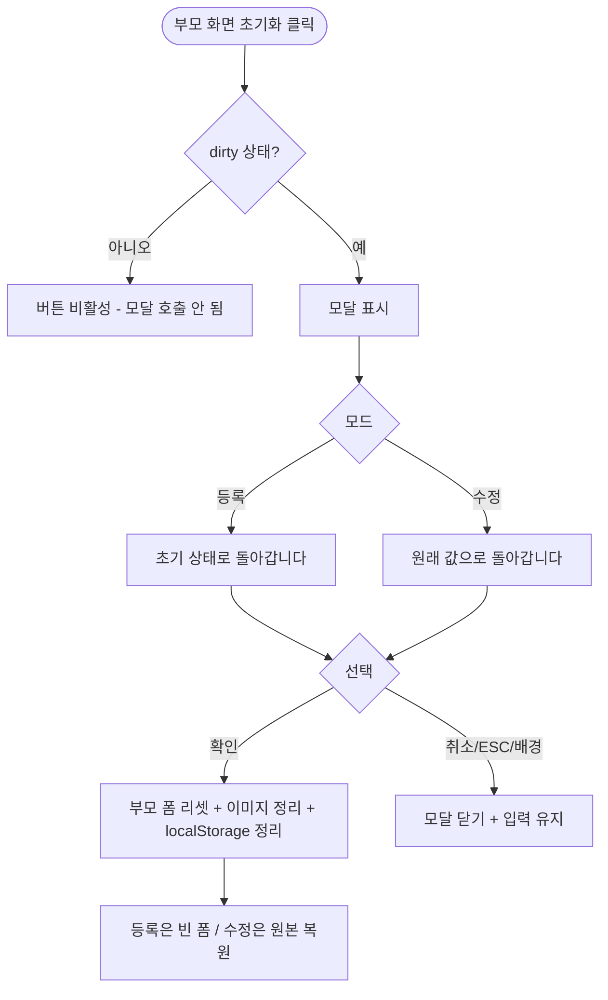

# DLG-M008 입력 폼 초기화 확인 다이얼로그

## 1. 다이얼로그 메타 정보

| 항목 | 값 |
|---|---|
| 작성일 | 2026-05-22 |
| 버전 | v1.0 |
| 상태 | 정합화 완료 |
| 도메인 | D02 회원관리 |
| 다이얼로그 ID | DLG-M008 |
| 다이얼로그명 | 입력 폼 초기화 확인 |
| 다이얼로그 유형 | 변경 손실 방지 확인형 모달 |
| 호출 화면 | SCR-M002 회원 등록, SCR-M003 회원 수정 |
| 우선순위 | P0 |
| 기능코드 | MBR-02, MBR-03 |
| 계약코드 | MBR-02, MBR-03 |

## 2. 다이얼로그 목적

입력 폼 초기화 확인 다이얼로그는 회원 등록 또는 수정 화면에서 입력 폼을 초기화하기 전 지금까지 입력한 내용이 모두 지워짐을 안내하고 의사를 확인하는 모달입니다. 회원 등록에서는 빈 폼 상태로 리셋, 회원 수정에서는 원본 데이터로 복원하는 동작이 다릅니다.

이 모달은 DLG-M007 작업 취소 확인과 유사하지만 동작이 다릅니다. DLG-M007은 부모 화면을 떠나는 동작, DLG-M008은 부모 화면에 머무르면서 입력값만 리셋하는 동작입니다.

## 3. 부모 화면 호출 맥락

회원 등록(SCR-M002) 또는 회원 수정(SCR-M003) 화면 헤더 우측의 "초기화" 버튼으로 호출됩니다.

호출 조건은 입력값이 한 건 이상 변경된 dirty 상태입니다. 빈 폼 상태(회원 등록 진입 직후 또는 회원 수정에서 원본과 동일한 상태)에서는 초기화 버튼 자체가 비활성화되어 모달이 호출되지 않습니다.

확인 시 부모 화면 폼이 리셋되어 회원 등록은 빈 폼 + Step 1로 돌아가고, 회원 수정은 원본 데이터가 다시 채워진 상태로 돌아갑니다. 부모 화면은 떠나지 않고 같은 페이지에 머무릅니다.

## 4. 모달 구성요소

모달 상단에는 "입력 내용을 초기화하시겠습니까?"라는 제목이 표시됩니다.

본문 안내 메시지는 회원 등록 모드에서 "입력하신 모든 내용이 초기 상태로 돌아갑니다"가 표시되고, 회원 수정 모드에서는 "수정 사항이 원래 값으로 돌아갑니다"로 변형 표시됩니다.

선택적으로 변경된 필드 요약(예: "5개 항목 변경됨")이 표시될 수 있습니다.

하단에는 두 개의 버튼이 있습니다. "확인" 버튼은 폼 초기화를 실행하고, "취소" 버튼은 모달만 닫고 부모 화면의 입력값을 유지합니다.

## 5. 동작 흐름

부모 화면에서 "초기화" 클릭 → dirty 상태 확인 → 변경 있음 → 이 모달 호출 → 운영자 선택.

"확인" 클릭: 모달 닫기 + 부모 화면 폼 리셋(회원 등록: 빈 폼 + Step 1, 회원 수정: 원본 데이터 복원). 프로필 이미지도 함께 리셋됩니다.

"취소" 클릭 또는 ESC 또는 배경 클릭: 모달 닫기 + 부모 화면 입력 유지.

회원 등록 모드에서 localStorage 임시 저장 드래프트도 함께 정리됩니다.

## 6. 권한별 처리

이 모달은 부모 화면(SCR-M002 회원 등록, SCR-M003 회원 수정)에 진입할 수 있는 모든 권한자에게 동일하게 동작합니다. 9개 역할(슈퍼관리자 `superAdmin`, primary `primary`, Owner(지점장) `owner`, 매니저 `manager`, FC `fc`, 트레이너 `trainer`, 스태프 `staff`, 프런트 `front`, 읽기 전용 `readonly`) 중 부모 화면 진입 권한이 있는 superAdmin·primary·Owner(지점장)·매니저·스태프는 동일한 모달을 보며, 진입 권한이 없는 FC·트레이너·프런트·readonly는 이 모달을 만나지 않습니다. 권한별 노출·옵션 차이는 없습니다.

## 7. 화면 상태

| 상태 | 설명 |
|---|---|
| 기본 표시 (등록 모드) | "초기 상태로 돌아갑니다" |
| 기본 표시 (수정 모드) | "원래 값으로 돌아갑니다" |
| 변경 필드 요약 | 옵션: 변경 개수 표시 |

## 8. 데이터 흐름

이 모달은 백엔드를 호출하지 않습니다. 부모 화면의 입력 상태만 리셋합니다.

회원 수정 모드에서 "확인" 선택 시 부모 화면에 캐시된 원본 데이터로 복원하며, 별도의 GET 호출은 일반적으로 발생하지 않습니다.

감사 로그에는 별도 INSERT 없습니다.

## 9. 예외 처리

부모 화면이 저장 처리 도중일 때는 "초기화" 버튼이 자동 비활성되어 이 모달이 호출되지 않습니다.

이미지 업로드 도중에는 초기화 시 진행 중 업로드가 취소되고 임시 S3 객체가 자동 정리됩니다.

## 10. 운영 정책

dirty 상태 검증 정책은 변경 사항이 한 건도 없으면 초기화 버튼이 비활성되어 모달이 호출되지 않는 것입니다.

회원 등록 vs 수정 동작 차이 정책은 등록은 빈 폼 리셋, 수정은 원본 데이터 복원입니다. 두 동작의 의미 차이를 명확히 전달하기 위해 모달 메시지도 다르게 표시됩니다.

localStorage 정리 정책은 회원 등록 모드에서 "확인" 선택 시 임시 저장 드래프트도 함께 정리되는 것입니다.

이미지 업로드 도중 취소 정책은 진행 중 업로드를 취소하고 임시 S3 객체를 자동 정리하는 것입니다.

## 11. 흐름 다이어그램

