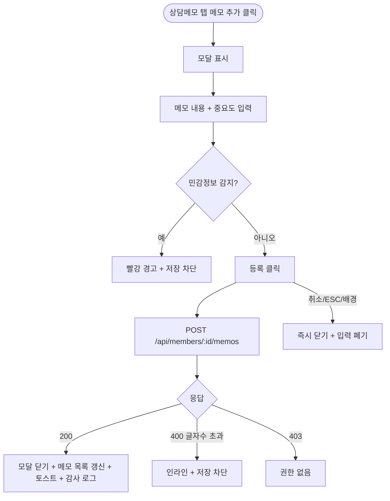

# DLG-M009 메모 추가 다이얼로그

## 1. 다이얼로그 메타 정보

| 항목 | 값 |
|---|---|
| 작성일 | 2026-05-22 |
| 버전 | v1.0 |
| 상태 | 정합화 완료 |
| 도메인 | D02 회원관리 |
| 다이얼로그 ID | DLG-M009 |
| 다이얼로그명 | 메모 추가 |
| 다이얼로그 유형 | 입력형 모달 |
| 호출 화면 | SCR-M004 회원 상세 (상담메모 탭) |
| 우선순위 | P1 |
| 기능코드 | MBR-02 |
| 계약코드 | MBR-02 |

## 2. 다이얼로그 목적

메모 추가 다이얼로그는 회원에 대한 상담 내용·특이사항·관리자 전달사항 등을 메모로 기록하는 모달입니다. 중요도(일반/중요)를 표시하여 우선순위 높은 메모를 시각적으로 구분할 수 있습니다.

운영 현장에서 FC·매니저·트레이너가 회원과의 상담 후 다음 운영자에게 인계할 정보를 메모로 남길 때 사용합니다. 메모는 회원 상세의 상담메모 탭에 카테고리별로 누적되며 시간 역순으로 표시됩니다.

## 3. 부모 화면 호출 맥락

회원 상세(SCR-M004) 상담메모 탭의 "메모 추가" 버튼으로 호출됩니다.

확인 성공 후 부모 화면의 메모 목록이 즉시 갱신되며 새 메모가 가장 위에 표시됩니다.

## 4. 모달 구성요소

모달 상단에는 "메모 추가"라는 제목이 표시됩니다.

메모 내용 입력 텍스트 영역이 있으며 최대 글자 수(예: 1000자)가 우측 하단에 실시간 표시됩니다. 메모에 주민번호 패턴 같은 민감정보 입력 시 정규식 검출 + 저장 차단 + 경고 표시됩니다(PII 최소수집 정책).

중요도 선택 토글 또는 라디오 버튼이 있어 일반과 중요 중 선택할 수 있습니다. 중요 메모는 부모 화면에서 빨강 또는 강조 색상으로 표시됩니다.

선택적으로 카테고리 선택 드롭다운(상담·체험·재등록·기타)이 제공될 수 있습니다.

[등록] 버튼과 [취소] 버튼이 하단에 있습니다.

## 5. 동작 흐름

[등록] 클릭 시 `POST /api/members/:id/memos`가 호출됩니다. 요청 본문에는 메모 내용·중요도·카테고리(옵션)·작성자가 포함됩니다.

성공 시 모달이 닫히고 부모 화면의 메모 목록이 즉시 갱신되며 "메모가 추가되었어요" 토스트가 표시됩니다.

실패 시 에러 메시지가 표시되고 모달은 닫히지 않으며 입력값이 유지됩니다.

[취소] 또는 ESC 또는 배경 클릭은 모달을 즉시 닫고 입력값을 폐기합니다.

## 6. 권한별 처리

owner·manager·fc·trainer·staff가 메모 추가 가능합니다. readonly와 권한 없는 계정은 부모 화면의 "메모 추가" 버튼이 hidden 처리됩니다.

작성된 메모는 작성자 본인 + 상위 권한자만 수정·삭제할 수 있습니다.

## 7. 화면 상태

| 상태 | 설명 |
|---|---|
| 기본 표시 | 빈 텍스트 영역 + 일반/중요 토글 |
| 입력 중 | 글자 수 실시간 표시 |
| 민감정보 감지 | 빨강 경고 + 저장 차단 |
| 처리 중 | 버튼 비활성 + 로딩 |
| 완료 | 모달 닫기 + 부모 갱신 + 토스트 |

## 8. 데이터 흐름

`POST /api/members/:id/memos` 호출 → 메모 INSERT → SCR-097 감사 로그 INSERT.

부모 화면의 상담메모 탭은 새 메모를 시간 역순으로 즉시 표시합니다.

## 9. 예외 처리

메모 본문 글자 수 초과 시 인라인 안내 + 저장 차단입니다.

주민번호 패턴 검출 시 빨강 경고 + 저장 차단 + 입력값 부분 마스킹입니다.

권한 부족·동시 편집 충돌·네트워크 끊김은 일반 정책과 동일합니다.

## 10. 운영 정책

PII 민감정보 차단 정책은 메모에 주민번호 같은 민감정보가 들어가면 PII 마스킹 정책(X11)의 통제를 벗어나기 때문에 입력 시점에 정규식으로 검출해 저장을 막는 것입니다.

작성자 권한 정책은 작성자 본인 + 상위 권한자만 수정·삭제 가능한 것입니다. FC가 작성한 메모는 매니저 이상만 수정 가능합니다.

중요 메모 시각화 정책은 부모 화면에서 빨강 또는 강조 색상으로 표시되어 운영자가 즉시 인지할 수 있게 하는 것입니다.

감사 로그 정책은 메모 추가·수정·삭제를 SCR-097에 기록합니다.

## 11. 흐름 다이어그램

