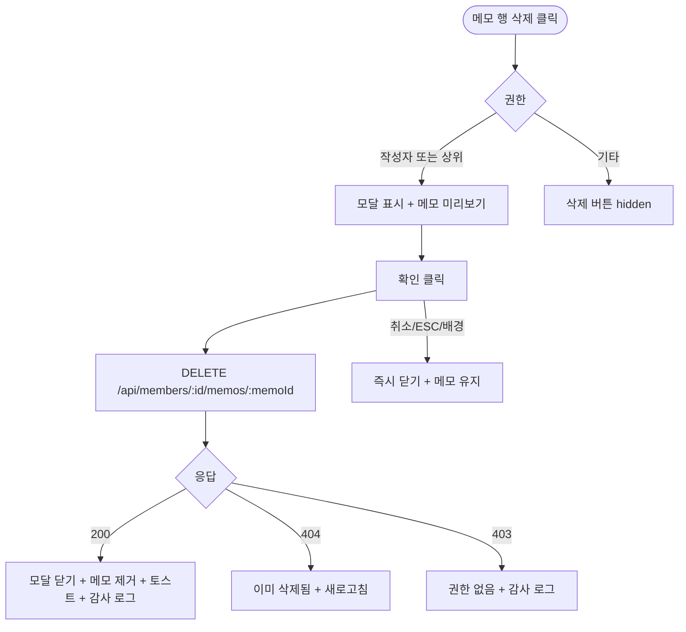

# DLG-M010 메모 삭제 확인 다이얼로그

## 1. 다이얼로그 메타 정보

| 항목 | 값 |
|---|---|
| 작성일 | 2026-05-22 |
| 버전 | v1.0 |
| 상태 | 정합화 완료 |
| 도메인 | D02 회원관리 |
| 다이얼로그 ID | DLG-M010 |
| 다이얼로그명 | 메모 삭제 확인 |
| 다이얼로그 유형 | 확인형 모달 |
| 호출 화면 | SCR-M004 회원 상세 (상담메모 탭) |
| 우선순위 | P1 |
| 기능코드 | MBR-02 |
| 계약코드 | MBR-02 |

## 2. 다이얼로그 목적

메모 삭제 확인 다이얼로그는 작성된 메모를 삭제하기 전 복구가 불가능함을 안내하고 최종 확인을 받는 모달입니다. 메모는 회원 운영의 인계 정보로 중요하므로 잘못된 삭제를 막는 안전장치 역할을 합니다.

## 3. 부모 화면 호출 맥락

회원 상세(SCR-M004) 상담메모 탭의 특정 메모 행 우측에 있는 "삭제" 버튼으로 호출됩니다.

작성자 본인 + 상위 권한자에게만 삭제 버튼이 노출되며 그 외 사용자에게는 hidden 처리됩니다.

확인 성공 후 부모 화면의 메모 목록에서 해당 메모가 즉시 제거됩니다.

## 4. 모달 구성요소

모달 상단에는 "메모를 삭제하시겠습니까?"라는 제목과 함께 "삭제된 메모는 복구할 수 없습니다"라는 경고 메시지가 표시됩니다.

삭제 대상 메모의 일부 텍스트(앞 100자 정도)가 미리보기로 표시되어 운영자가 어떤 메모인지 확인할 수 있게 합니다. 메모 작성일과 작성자도 함께 표시됩니다.

[확인] 버튼과 [취소] 버튼이 하단에 있습니다.

## 5. 동작 흐름

[확인] 클릭 시 `DELETE /api/members/:id/memos/:memoId`가 호출됩니다.

성공 시 모달이 닫히고 부모 화면의 메모 목록에서 해당 행이 즉시 제거되며 "메모가 삭제되었어요" 토스트가 표시됩니다.

실패 시 에러 메시지가 표시되고 모달은 닫히지 않습니다.

[취소] 또는 ESC 또는 배경 클릭은 모달을 즉시 닫고 메모를 유지합니다.

## 6. 권한별 처리

작성자 본인 + 상위 권한자만 삭제 가능합니다. FC(`fc`)가 작성한 메모는 FC 본인과 매니저(`manager`) 이상이 삭제할 수 있습니다.

9개 역할별 동작은 다음과 같습니다. 슈퍼관리자(`superAdmin`)와 본사 최고관리자(`primary`)는 작성자와 무관하게 모든 메모를 삭제할 수 있습니다. 센터장(`owner`)·매니저(`manager`)는 자기 지점 회원의 모든 메모를 삭제할 수 있습니다. FC(`fc`)·트레이너(`trainer`)·스태프(`staff`)는 본인이 작성한 메모만 삭제할 수 있고 타인 작성분에서는 삭제 버튼이 hidden 처리됩니다. 프런트(`front`)는 메모 영역 자체에 접근하지 못하므로 이 모달을 만나지 않습니다. 읽기 전용(`readonly`)은 어떤 메모도 삭제할 수 없으며 삭제 버튼이 hidden 처리됩니다.

권한이 없으면 부모 화면의 삭제 버튼이 hidden 처리됩니다.

## 7. 화면 상태

| 상태 | 설명 |
|---|---|
| 기본 표시 | 메모 미리보기 + 확인/취소 |
| 처리 중 | 버튼 비활성 + 로딩 |
| 완료 | 모달 닫기 + 메모 제거 + 토스트 |

## 8. 데이터 흐름

`DELETE /api/members/:id/memos/:memoId` 호출 → 메모 hard delete → SCR-097 감사 로그 INSERT.

## 9. 예외 처리

권한 부족(403)은 부모 화면에서 이미 차단되지만 직접 API 호출 시 백엔드 403 + 감사 로그 INSERT입니다.

동시 편집(이미 삭제됨)은 404 + 부모 화면 새로고침 안내입니다.

## 10. 운영 정책

작성자 권한 정책은 작성자 본인 + 상위 권한자만 삭제 가능한 것입니다.

hard delete 정책은 메모는 복구 의미가 없는 데이터이므로 즉시 hard delete되며 감사 로그에만 삭제 이력이 남는 것입니다.

감사 로그 정책은 메모 삭제 이벤트를 SCR-097에 actor·memo_id·timestamp로 기록합니다.

## 11. 흐름 다이어그램

