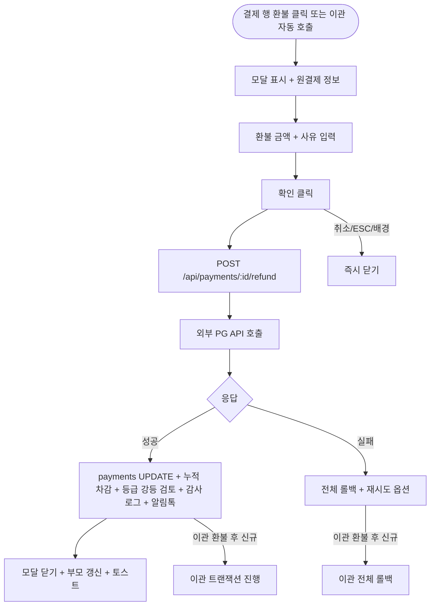

# DLG-M013 환불 처리 다이얼로그

## 1. 다이얼로그 메타 정보

| 항목 | 값 |
|---|---|
| 작성일 | 2026-05-22 |
| 버전 | v1.0 |
| 상태 | 정합화 완료 |
| 도메인 | D02 회원관리 |
| 다이얼로그 ID | DLG-M013 |
| 다이얼로그명 | 환불 처리 |
| 다이얼로그 유형 | 입력형·외부 결제 연동 모달 |
| 호출 화면 | SCR-M004 회원 상세 (결제이력 탭, 결제내역 탭), SCR-M005 회원 이관 (환불 후 신규 유형) |
| 우선순위 | P0 |
| 기능코드 | MBR-02 |
| 계약코드 | MBR-02 |

## 2. 다이얼로그 목적

환불 처리 다이얼로그는 특정 결제 건에 대해 환불을 처리할 때 환불 금액과 사유를 입력하고 외부 결제사 API 호출을 통해 환불을 실행하는 모달입니다. 전체 환불과 부분 환불을 모두 지원하며, 환불 실행 시 외부 PG API 호출 + DB 업데이트 + 누적 결제 차감(MBR-EXT-03 등급 강등 검토) + 감사 로그가 단일 트랜잭션으로 처리됩니다.

회원 이관의 "환불 후 신규" 유형에서는 이 모달이 자동 호출되며 환불 완료가 이관 진행의 전제 조건이 됩니다. 환불 실패 시 이관 전체가 롤백됩니다.

## 3. 부모 화면 호출 맥락

회원 상세(SCR-M004) 결제이력 탭의 결제 건 행에서 "환불" 버튼으로 호출됩니다. 이미 환불 처리된 건은 환불 버튼이 비활성 처리됩니다.

회원 이관(SCR-M005)에서 "환불 후 신규" 유형 선택 후 이관 실행 시 자동 호출됩니다.

확인 성공 후 부모 화면의 결제 건 상태가 "환불 완료"로 갱신되고 결제내역 탭의 누적 환불 합계가 갱신됩니다.

## 4. 모달 구성요소

모달 상단에는 "환불 처리"라는 제목이 표시됩니다.

원결제 정보 카드에는 결제일·결제 금액·결제 수단(카드/현금/계좌이체)·결제경로(POS/결제링크/수기)·이용권명이 표시됩니다.

환불 금액 입력란은 기본값으로 원결제 금액이 채워져 있으며 부분 환불 시 직접 입력합니다. 원결제 금액을 초과하는 입력은 차단됩니다.

환불 사유 드롭다운 + 직접 입력란이 제공되며 본인 요청 / 서비스 불만 / 운영 오류 / 기타 같은 사전 정의 사유와 자유 입력이 함께 제공됩니다.

환불 후 잔액 미리보기(부분 환불 시)가 표시되어 남은 결제 금액을 운영자가 확인할 수 있습니다.

[확인] 버튼과 [취소] 버튼이 하단에 있습니다.

## 5. 동작 흐름

[확인] 클릭 시 `POST /api/payments/:id/refund`가 호출됩니다. 백엔드는 단일 트랜잭션 안에서 외부 결제사 API 환불 호출 + payments 테이블 UPDATE + 회원 누적 결제 차감 + 등급 강등 검토 트리거 + SCR-097 감사 로그 INSERT를 처리합니다.

외부 결제사 API 실패 시 전체 트랜잭션이 롤백되어 "결제사 API 응답이 없어요" 에러 메시지가 표시되고 재시도 옵션이 제공됩니다.

성공 시 모달이 닫히고 부모 화면이 갱신되며 토스트가 표시됩니다. 회원에게 카카오 알림톡 환불 완료 안내가 발송됩니다.

## 6. 권한별 처리

매니저(manager) 이상이 환불 처리 가능합니다. FC·트레이너·스태프·프런트·readonly는 환불 버튼이 부모 화면에서 hidden 처리됩니다.

부분 환불은 권한자에 따라 허용 범위가 다를 수 있습니다(테넌트 정책).

## 7. 화면 상태

| 상태 | 설명 |
|---|---|
| 기본 표시 | 원결제 정보 + 환불 금액 자동 + 사유 입력 |
| 부분 환불 입력 중 | 환불 후 잔액 미리보기 |
| 처리 중 | 버튼 비활성 + 로딩 (외부 PG 호출 대기) |
| 완료 | 모달 닫기 + 부모 갱신 + 토스트 + 알림톡 |
| 외부 API 실패 | 전체 롤백 + 재시도 옵션 |

## 8. 데이터 흐름

`POST /api/payments/:id/refund` → 단일 트랜잭션(외부 PG 환불 + payments UPDATE + 누적 차감 + 등급 강등 검토 + 감사 로그 + 알림톡 발송).

MBR-EXT-03 등급 갱신은 환불 시점에 누적 차감 후 강등 검토가 발동되며, 누적 차감 후 음수가 되면 0으로 보정됩니다.

NFR-19 알림 센터로 회원·운영자 양방향 알림이 발송됩니다.

## 9. 예외 처리

이미 환불된 건은 부모 화면에서 환불 버튼 비활성이지만 직접 API 호출 시 422 + "이미 환불된 결제" 안내입니다.

외부 결제사 API 응답 지연(5초 timeout) 또는 실패 시 전체 트랜잭션 롤백 + 재시도 옵션 + 운영자 알림입니다.

환불 금액이 원결제 금액 초과는 422 + 인라인 안내입니다.

권한 부족·동시 편집·네트워크 끊김은 일반 정책과 동일합니다.

## 10. 운영 정책

환불 트랜잭션 원자성 정책은 외부 PG 환불 호출 + DB UPDATE + 누적 차감 + 알림 발송이 단일 트랜잭션이며 1개 실패 시 전체 롤백되는 것입니다.

회원 이관 환불 후 신규 정책은 환불 완료가 이관 진행의 전제 조건이며 환불 실패 시 이관 전체가 롤백되는 것입니다.

부분 환불 정책은 권한자에 따라 허용 범위가 다를 수 있습니다.

등급 강등 검토 정책은 환불 시점에 누적 차감 후 강등이 자동 검토되며 음수가 되면 0으로 보정됩니다.

알림톡 정책은 환불 완료 시 회원에게 자동 발송이며 실패 시 SMS 폴백됩니다.

감사 로그 정책은 환불 이벤트를 SCR-097에 actor·payment_id·amount·reason·before·after로 INSERT합니다.

## 11. 흐름 다이어그램

