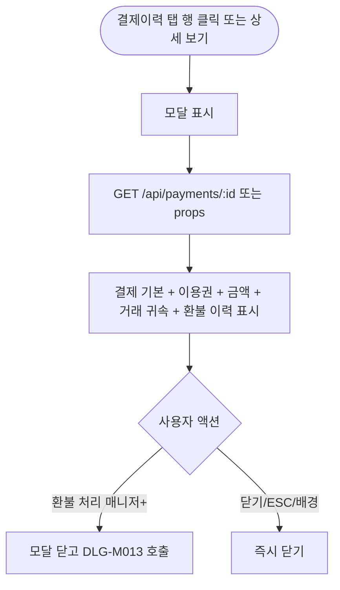

# DLG-M014 결제 상세 조회 다이얼로그

## 1. 다이얼로그 메타 정보

| 항목 | 값 |
|---|---|
| 작성일 | 2026-05-22 |
| 버전 | v1.0 |
| 상태 | 정합화 완료 |
| 도메인 | D02 회원관리 |
| 다이얼로그 ID | DLG-M014 |
| 다이얼로그명 | 결제 상세 조회 |
| 다이얼로그 유형 | 조회·읽기 전용 모달 |
| 호출 화면 | SCR-M004 회원 상세 (결제이력 탭) |
| 우선순위 | P1 |
| 기능코드 | MBR-02 |
| 계약코드 | MBR-02 |

## 2. 다이얼로그 목적

결제 상세 조회 다이얼로그는 결제 목록에서 특정 결제 건의 상세 정보를 팝업으로 확인하는 모달입니다. 결제 수단·이용권 내용·할인 내역·결제경로·결제지점·매출 귀속 지점·정산 지점·인센티브 귀속자·판매 담당자·승인번호 같은 거래 시점 귀속 정보를 한눈에 조회합니다.

조회 전용 모달이지만 권한자에게는 [환불 처리(DLG-M013)] 진입 버튼이 함께 표시되어 결제 상세 확인 후 즉시 환불 액션으로 이어질 수 있습니다.

## 3. 부모 화면 호출 맥락

회원 상세(SCR-M004) 결제이력 탭의 결제 건 행 또는 행의 "상세 보기" 버튼으로 호출됩니다. 행 클릭 자체로도 호출 가능합니다(설정에 따라).

## 4. 모달 구성요소

모달 상단에는 "결제 상세" 제목이 표시됩니다.

결제 기본 정보 카드에는 결제일·결제 번호·결제 상태(정상/환불/부분환불/링크대기)가 표시됩니다.

이용권 정보 카드에는 이용권명·기간·횟수가 표시됩니다.

금액 정보 카드에는 정가·할인 금액·실결제 금액이 표시되고 부분 환불 건의 경우 환불 금액도 함께 표시됩니다.

결제 수단 표시는 카드·현금·계좌이체·결제링크 중 어느 채널로 결제되었는지를 명시합니다. 카드 결제의 경우 승인번호와 카드사·할부 정보가 추가됩니다.

거래 귀속 정보 카드에는 결제지점·이용지점·매출 귀속 지점·정산 지점·인센티브 귀속자·판매 담당자가 표시됩니다. 회원의 기본 귀속과 다를 수 있음을 운영자가 즉시 인식할 수 있습니다.

환불 이력이 있는 경우 환불 일자·금액·사유가 별도 섹션으로 표시됩니다.

[환불 처리] 버튼은 권한자(매니저+)에게만 노출되며 [닫기] 버튼은 항상 표시됩니다.

## 5. 동작 흐름

모달 진입 시 `GET /api/payments/:id`가 호출되어 결제 상세가 로드됩니다(부모 화면에서 props로 전달하거나 추가 fetch).

[환불 처리] 클릭 시 이 모달이 닫히고 DLG-M013 환불 처리 다이얼로그가 열립니다.

[닫기] 또는 ESC 또는 배경 클릭은 모달을 즉시 닫고 부모 화면으로 복귀합니다.

## 6. 권한별 처리

조회는 결제이력 탭에 접근 가능한 모든 권한자(매니저·FC·readonly 등)가 가능합니다. 스태프는 결제내역 탭은 hidden이지만 결제이력 탭은 접근 가능합니다.

[환불 처리] 버튼은 매니저 이상에게만 노출됩니다.

## 7. 화면 상태

| 상태 | 설명 |
|---|---|
| 로딩 | GET 도중 스켈레톤 |
| 기본 표시 | 모든 정보 표시 |
| 환불 진행됨 | 환불 이력 섹션 추가 |
| 환불 진입 | 모달 닫고 DLG-M013 호출 |

## 8. 데이터 흐름

`GET /api/payments/:id` 호출 또는 부모 화면 props로 결제 상세 수신. 백엔드는 결제 row와 환불 이력, 거래 시점 귀속 정보를 함께 응답합니다.

조회 자체는 감사 로그 INSERT를 발생시키지 않습니다(읽기 작업이므로). 다만 [환불 처리] 진입 후 환불 실행 시 감사 로그가 발생합니다.

## 9. 예외 처리

권한 부족 시 결제 상세 일부 정보가 마스킹되거나 hidden 처리됩니다(예: 매출 귀속 지점은 본사 권한자만).

데이터 로드 실패는 모달 본문에 에러 + 재시도 버튼이 표시됩니다.

## 10. 운영 정책

거래 귀속 우선 표시 정책은 결제지점·매출 귀속 지점·정산 지점·인센티브 귀속자가 거래 시점 값으로 보존되어 표시되는 것입니다. 회원 기본 귀속과 다를 수 있음이 운영자에게 명확해야 합니다.

권한별 가시성 정책은 거래 귀속 일부 정보(매출 귀속·정산 지점)는 본사 권한자에게만 노출되는 옵션입니다.

[환불 처리] 진입 정책은 매니저 이상만 노출되며 환불 자체는 DLG-M013에서 처리됩니다.

## 11. 흐름 다이어그램

