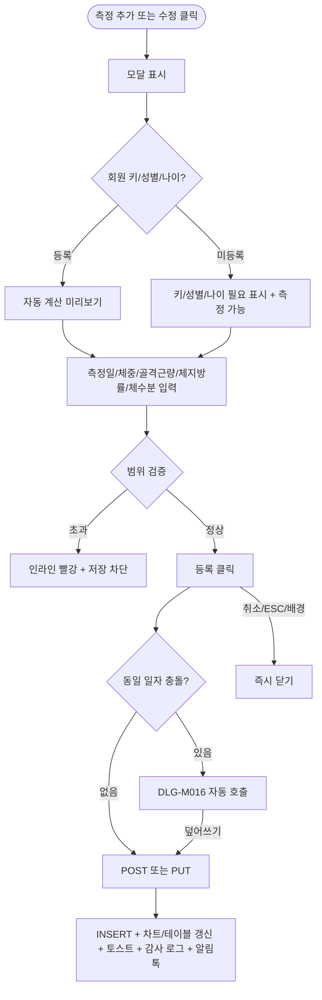

# DLG-M015 체성분 등록 다이얼로그

## 1. 다이얼로그 메타 정보

| 항목 | 값 |
|---|---|
| 작성일 | 2026-05-22 |
| 버전 | v1.0 |
| 상태 | 정합화 완료 |
| 도메인 | D02 회원관리 |
| 다이얼로그 ID | DLG-M015 |
| 다이얼로그명 | 체성분 등록 |
| 다이얼로그 유형 | 입력형 모달 (자동 계산 포함) |
| 호출 화면 | SCR-M004 회원 상세 (체성분 탭), SCR-M006 체성분 관리 |
| 우선순위 | P1 |
| 기능코드 | MBR-02, MBR-ADV-03 |
| 계약코드 | MBR-02, MBR-ADV-03 |

## 2. 다이얼로그 목적

체성분 등록 다이얼로그는 체성분 측정 기기와 연동되지 않는 환경에서 관리자가 회원의 체성분 측정값을 수동으로 입력하는 모달입니다. 측정일·체중·골격근량·체지방률·체수분을 입력하면 BMI·체지방량·기초대사량이 자동 계산됩니다. 같은 날 이미 등록된 데이터가 있는 경우 DLG-M016(체성분 덮어쓰기) 다이얼로그로 분기됩니다.

회원 상세 체성분 탭과 SCR-M006 체성분 관리 화면이 동일 데이터 소스(`body_composition`)를 공유하므로 어디서 등록해도 양쪽에 즉시 반영됩니다.

## 3. 부모 화면 호출 맥락

회원 상세(SCR-M004) 체성분 탭의 "측정 추가" 버튼 또는 체성분 관리(SCR-M006) 화면의 "측정 추가" 버튼, 그리고 측정 기록 테이블의 수정 버튼(수정 모드)으로 호출됩니다.

확인 성공 후 부모 화면의 차트·테이블·요약 카드가 즉시 갱신됩니다.

## 4. 모달 구성요소

모달 상단에는 "체성분 등록" 제목이 표시됩니다.

측정일 선택 캘린더(기본값 오늘, 미래 차단)가 있습니다. 과거 90일 이전 입력은 매니저+ 사유 입력 시 가능합니다.

체중 입력란(kg, 20~300 범위), 골격근량 입력란(kg, 5~80 범위), 체지방률 입력란(%, 3~60 범위), 체수분 입력란(%, 선택)이 있습니다. 범위 외 입력 시 인라인 빨강 + 저장 차단됩니다.

BMI 자동 계산 표시(체중·키 기반)는 회원의 키가 등록되어 있을 때만 계산되며 미등록 시 "키 정보 필요" 표시 + MBR-03 진입 링크가 제공됩니다.

체지방량 자동 계산(체중 × 체지방률 / 100), 기초대사량 자동 계산(Mifflin-St Jeor 공식, 회원의 키·나이·성별 기반)도 함께 표시됩니다. 성별·나이 미등록 시 BMR 계산 불가 + "성별/나이 정보 필요" 표시입니다.

[등록] 버튼과 [취소] 버튼이 하단에 있습니다.

## 5. 동작 흐름

[등록] 클릭 시 동일 일자에 이미 측정값이 있는지 확인합니다. 있으면 DLG-M016 덮어쓰기 다이얼로그가 자동 호출됩니다. 없으면 `POST /api/body-composition`이 호출되어 INSERT됩니다.

성공 시 모달이 닫히고 부모 화면의 차트·테이블·요약 카드가 즉시 갱신되며 토스트가 표시됩니다.

수정 모드에서는 `PUT /api/body-composition/:id`가 호출되며 변경된 필드만 PATCH로 전송됩니다.

[취소] 또는 ESC 또는 배경 클릭은 모달을 즉시 닫습니다.

## 6. 권한별 처리

owner·manager·fc·trainer가 측정 추가 가능합니다. FC·트레이너는 본인 등록 24시간 이내만 수정 가능하며 매니저+는 시간 제한 없이 수정 가능합니다. 스태프·프런트는 접근 차단입니다.

InBody 장비 자동 수집 측정값은 `source=device` 라벨이 자동 부여됩니다. 회원 본인 자가 입력은 `source=self` 라벨이 부여됩니다. 운영자 수동 입력은 `source=manual`입니다.

## 7. 화면 상태

| 상태 | 설명 |
|---|---|
| 기본 표시 (등록) | 빈 폼 + 자동 계산 미리보기 |
| 기본 표시 (수정) | 기존 값 자동 채움 |
| 범위 초과 | 인라인 빨강 + 저장 차단 |
| 키 미등록 | "키 정보 필요" 표시 + MBR-03 링크 |
| 성별/나이 미등록 | "성별/나이 필요" 표시 |
| 동일 일자 충돌 | DLG-M016 자동 호출 |
| 처리 중 | 버튼 비활성 + 로딩 |
| 완료 | 모달 닫기 + 부모 갱신 + 토스트 |

## 8. 데이터 흐름

`POST /api/body-composition` 또는 `PUT /api/body-composition/:id` → 동일 일자 검증 후 INSERT/UPDATE → SCR-097 감사 로그 INSERT(actor·source·before/after) → 회원 동의 시 카카오 알림톡 결과 카드 발송.

회원 상세 체성분 탭과 SCR-M006 체성분 관리 화면이 동일 데이터 소스 공유 정책에 따라 즉시 동기화됩니다.

InBody 장비 외부 API는 `POST /api/inbody/sync`로 들어오며 회원 카드 매칭 후 자동 INSERT됩니다. 매칭 실패 시 수동 매칭 큐에 적재됩니다.

## 9. 예외 처리

측정값 범위 초과(체중 < 20 또는 > 300, 골격근량 < 5 또는 > 80, 체지방률 < 3 또는 > 60)는 인라인 빨강 + 저장 차단입니다.

측정일 미래 날짜는 캘린더 비활성 + 직접 입력 시 422 차단입니다.

동일 일자 충돌은 DLG-M016 호출입니다.

회원 키 미등록은 BMI 계산 불가 + "키 정보 필요" 안내(측정 자체는 가능)입니다.

권한 부족(FC/트레이너 24시간 초과 수정 시도)은 "본인 등록 24시간 이내만 수정 가능" 안내입니다.

동시 측정 추가 충돌(409)은 덮어쓰기 안내 + 새로고침 후 재시도입니다.

## 10. 운영 정책

측정값 범위 정책은 체중 20~300kg, 골격근량 5~80kg, 체지방률 3~60%로 비정상 데이터를 차단합니다.

자동 계산 정책은 BMI = 체중/(키)², 체지방량 = 체중 × 체지방률/100, BMR = Mifflin-St Jeor 공식입니다.

데이터 출처 구분 정책은 manual(운영자) / device(InBody 장비) / self(회원 자가 입력)로 구분되어 표시됩니다.

수정 권한·시간 제한 정책은 FC/트레이너 본인 등록 24시간 이내, 매니저+ 시간 제한 없음입니다.

목표 overlay 정책은 활성 목표가 있으면 그래프에 시작점·목표점 직선 + 진행률이 overlay 표시됩니다.

## 11. 흐름 다이어그램

