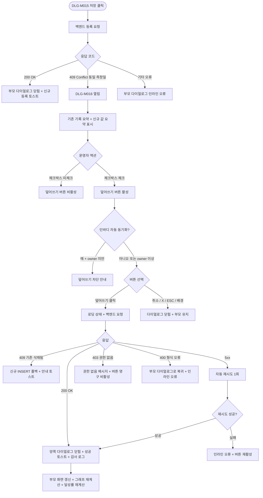

# DLG-M016 체성분 덮어쓰기 다이얼로그

## 1. 다이얼로그 메타 정보

이 문서는 체성분 덮어쓰기 다이얼로그에 대한 자기완결형 요구사항 정의서입니다. 다른 문서를 함께 보지 않아도 이 한 장만으로 다이얼로그의 호출 트리거, 화면 구성, 입력과 검증, 확인 후 동작, 권한별 처리, 예외 흐름, 그리고 체성분 관리 운영 정책까지 모두 이해하고 구현할 수 있도록 작성합니다.

| 항목 | 값 |
|---|---|
| 작성일 | 2026-05-22 |
| 버전 | v1.0 |
| 상태 | 최신 통합본 반영 (정합화 완료) |
| 도메인 | D02 회원관리 |
| 다이얼로그 ID | DLG-M016 |
| 다이얼로그명 | 체성분 덮어쓰기 |
| 다이얼로그 유형 | 확인형 차단 다이얼로그 (Confirm Modal) |
| 우선순위 | P1 (출시 필수) |
| 기능코드 | MBR-02 (회원 상세), MBR-ADV-03 (체성분 관리) |
| 계약코드 | MBR-02, MBR-ADV-03 |
| 부모 화면 | SCR-M004 회원 상세 페이지, SCR-M006 체성분 관리 페이지 |
| 호출 트리거 | DLG-M015 체성분 등록 다이얼로그에서 저장 시도 시 동일 측정일 기록 충돌 감지 |
| 후속 다이얼로그 | 없음 (성공 시 부모 다이얼로그 닫힘과 함께 종료) |

## 2. 다이얼로그 목적

체성분 덮어쓰기 다이얼로그는 같은 회원의 같은 측정일에 이미 등록된 체성분 기록이 있을 때, 운영자가 새 측정값으로 기존 기록을 덮어쓰려는 의도를 다시 한 번 확인하는 안전 장치입니다. 체성분 기록은 회원의 운동 진행 상황을 추적하는 핵심 지표이고, 한 번 덮어 씌우면 이전 값을 복구할 방법이 없기 때문에, 운영자가 무심코 저장 버튼을 다시 누르거나 인바디 데이터가 자동 동기화되는 순간에 기존 기록이 사라지는 사고를 막아야 합니다. 이 다이얼로그는 그 사고를 막기 위한 단 하나의 게이트입니다.

운영 현장에서 이 다이얼로그는 다음 상황에서 자주 보입니다. 첫째, 회원이 오전과 오후에 두 번 인바디를 측정해 운영자가 그날의 가장 최근 값을 저장하려는 경우입니다. 둘째, 인바디 기기의 자동 동기화 후 운영자가 수기로 보정값을 다시 저장하려는 경우입니다. 셋째, 회원의 측정값을 잘못 입력해 같은 날짜로 다시 저장하려는 경우입니다. 어떤 경우든 운영자는 "기존 값이 사라진다"는 사실을 명확히 인지하고 확인 버튼을 눌러야 합니다.

## 3. 호출 트리거와 진입 경로

이 다이얼로그는 단독으로 열리지 않습니다. 반드시 DLG-M015 체성분 등록 다이얼로그에서 저장을 시도한 직후, 백엔드가 동일 측정일 충돌을 응답으로 알려준 시점에 부모 다이얼로그 위에 겹쳐서 열립니다. 호출 흐름은 다음과 같습니다. 운영자가 회원 상세의 체성분 탭 또는 체성분 관리 페이지에서 체성분 등록 버튼을 누르면 DLG-M015가 열립니다. 운영자가 측정일과 체중, 체지방률, 골격근량 등을 입력하고 저장 버튼을 누르면 백엔드에 등록 요청이 전송됩니다. 백엔드는 해당 회원의 같은 측정일에 이미 기록이 존재하는지 확인하고, 존재하면 409 Conflict 응답과 함께 기존 기록의 요약 정보를 내려줍니다. DLG-M015는 이 응답을 받아 DLG-M016을 열고, 자기는 뒤로 한 단계 어둡게 처리됩니다.

진입 경로는 두 가지뿐입니다. 첫 번째는 회원 상세 페이지의 체성분 탭에서 체성분 등록 다이얼로그를 거쳐 진입하는 경로이고, 두 번째는 체성분 관리 페이지에서 신규 등록 버튼을 거쳐 진입하는 경로입니다. 두 경로 모두 부모 다이얼로그(DLG-M015)가 먼저 열린 상태여야 하며, 부모 다이얼로그 없이 이 다이얼로그가 단독으로 열리는 일은 없습니다.

## 4. UI 구성과 영역별 동작

다이얼로그는 화면 중앙에 고정 크기(가로 480px 내외, 모바일은 가로 폭의 92%)로 표시되며, 배경은 반투명 검정 오버레이로 덮입니다. 부모 다이얼로그(DLG-M015)는 이 다이얼로그 뒤에서 살짝 보이지만 상호작용이 차단됩니다.

상단에는 다이얼로그 헤더가 있습니다. 헤더 좌측에는 "체성분 덮어쓰기"라는 제목이 표시되고, 제목 좌측에 주의 아이콘(노란색 삼각형 안 느낌표)이 함께 배치되어 이 다이얼로그가 단순 확인이 아니라 데이터 변경을 동반한다는 사실을 시각적으로 알립니다. 헤더 우측에는 X 버튼이 있고, X를 누르면 취소와 동일한 동작이 일어납니다.

헤더 아래에는 안내 메시지 영역이 있습니다. 메시지는 "[YYYY-MM-DD]에 이미 등록된 체성분 기록이 있습니다. 새로 입력한 값으로 덮어쓰시겠습니까?"라는 문장으로 표시되며, 날짜 부분은 실제 측정일이 자동으로 치환되어 표시됩니다. 메시지 아래에는 추가 경고가 작은 글씨로 "덮어쓰면 기존 기록은 복구할 수 없습니다"라고 표시됩니다.

그 아래에는 기존 기록 요약 카드가 있습니다. 카드 안에는 기존 기록의 핵심 수치가 라벨과 값의 쌍으로 표시됩니다. 표시되는 항목은 측정일, 체중(kg), 체지방률(%), 골격근량(kg), 측정 출처(수기 입력 / 인바디 자동 동기화), 등록자명, 등록 시각입니다. 측정 출처가 인바디 자동 동기화인 경우 카드 우상단에 작은 배지로 "인바디 동기화"가 표시되어, 운영자가 자동 동기화 데이터를 수동으로 덮어 씌우려 한다는 사실을 인지하게 합니다.

요약 카드 아래에는 새로 입력한 값의 요약이 같은 형식으로 한 번 더 표시됩니다. 라벨은 "새로 입력한 값"으로 표기되고, 카드는 기존 기록 카드와 색상 톤이 구분되어(기존은 회색, 신규는 파랑 또는 녹색 계열) 시각적으로 두 값이 다른 데이터임을 즉시 알 수 있도록 합니다. 두 카드 사이에는 화살표 아이콘이 표시되어 "기존 → 신규"의 변경 방향을 직관적으로 보여줍니다.

다이얼로그 하단에는 액션 버튼 두 개가 우측 정렬로 배치됩니다. 좌측에 취소 버튼(보조 스타일), 우측에 "덮어쓰기" 버튼(주의 스타일, 빨강 또는 주황 계열)이 놓입니다. 덮어쓰기 버튼은 처음 다이얼로그가 열리는 순간에는 비활성화되어 있고, 운영자가 기존 기록 요약 카드 위의 체크박스("기존 기록이 사라진다는 사실을 확인했습니다")를 직접 체크해야 활성화됩니다. 이 체크박스는 단일 클릭으로 토글되며, 체크하지 않으면 덮어쓰기 버튼이 끝까지 비활성화 상태로 남아 있어 운영자가 확인 절차를 건너뛸 수 없습니다.

## 5. 입력 필드와 검증

이 다이얼로그 자체에는 새로 입력하는 필드가 없습니다. 모든 측정값은 부모 다이얼로그(DLG-M015)에서 이미 입력되어 전달된 상태이며, 이 다이얼로그는 그 값을 표시만 합니다. 다만 확인 절차를 위한 체크박스가 하나 있고, 이 체크박스의 체크 여부가 덮어쓰기 버튼의 활성/비활성을 결정합니다.

검증은 다음 시점에서 일어납니다. 다이얼로그가 열리는 시점에는 부모 다이얼로그에서 전달된 측정값의 무결성을 한 번 더 확인합니다. 측정일이 미래 날짜가 아닌지, 체중 값이 0보다 큰지, 체지방률이 0~100 범위 안인지, 골격근량이 음수가 아닌지 같은 기본 검증이 다시 통과되어야 다이얼로그가 정상 표시됩니다. 무결성 검증에 실패하면 다이얼로그는 열리지 않고 부모 다이얼로그에 인라인 오류 메시지("측정값에 오류가 있어 확인을 진행할 수 없습니다")가 표시됩니다.

덮어쓰기 버튼 클릭 시점에는 다시 한 번 서버 측에서 동일 측정일의 기록이 여전히 존재하는지를 검증합니다. 그 사이에 다른 운영자가 기존 기록을 삭제한 경우에는 덮어쓰기 대신 일반 신규 등록으로 자동 폴백되며, 토스트로 "기존 기록이 삭제되어 새 기록으로 저장되었습니다"라고 안내됩니다.

## 6. 확인/취소 후 동작

운영자가 확인 체크박스를 체크한 후 덮어쓰기 버튼을 누르면, 다음 흐름이 일어납니다. 첫째, 다이얼로그가 즉시 로딩 상태로 전환되어 두 버튼이 모두 비활성화되고 덮어쓰기 버튼 안에 스피너가 표시됩니다. 둘째, 백엔드에 덮어쓰기 요청이 전송되며 요청 본문에는 회원 ID, 측정일, 새 측정값, 그리고 기존 기록 ID와 운영자 ID가 함께 포함됩니다. 셋째, 백엔드는 트랜잭션으로 기존 기록의 상태를 OVERWRITTEN으로 표시하면서 새 기록을 INSERT하고, 감사 로그에 actor_id, member_id, target_date, before, after, action=OVERWRITE_BODY_COMPOSITION, timestamp를 기록합니다. 넷째, 200 OK 응답을 받으면 이 다이얼로그가 닫히고, 부모 다이얼로그(DLG-M015)도 함께 닫힙니다. 다섯째, 부모 화면(SCR-M004의 체성분 탭 또는 SCR-M006)의 체성분 이력 목록이 자동 갱신되어 새 기록이 가장 위에 표시되고, 우측 상단에 "체성분 기록을 덮어썼어요"라는 성공 토스트가 5초 동안 표시됩니다.

취소 버튼이나 X 버튼을 누르면, 또는 ESC 키를 누르거나 배경 오버레이를 클릭하면 이 다이얼로그가 즉시 닫히고 부모 다이얼로그(DLG-M015)로 포커스가 돌아갑니다. 부모 다이얼로그의 입력값은 그대로 유지되어 운영자가 측정일을 다른 날짜로 바꾸거나 입력을 수정할 수 있습니다. 백엔드에는 어떤 요청도 전송되지 않고, 기존 체성분 기록은 변경 없이 그대로 남습니다.

ESC 키와 배경 클릭은 별도의 추가 확인 없이 즉시 취소로 동작합니다. 이 다이얼로그에서는 운영자가 새로 입력하는 값이 없기 때문에, "변경 사항이 사라집니다" 같은 보조 확인은 표시하지 않습니다.

## 7. 부모 화면 갱신과 후속 처리

확인 성공 시 부모 화면의 갱신 범위는 다음과 같습니다. 회원 상세(SCR-M004)의 체성분 탭에서 다이얼로그가 호출된 경우에는 체성분 이력 목록의 첫 번째 행이 새 기록으로 교체되고, 상단 요약 카드(최근 측정값)의 수치가 새 값으로 갱신됩니다. 체성분 변화 그래프가 표시되는 영역이 있다면 해당 측정일의 데이터 포인트가 새 값으로 다시 그려집니다. 체성분 관리 페이지(SCR-M006)에서 호출된 경우에도 동일하게 목록과 그래프가 갱신됩니다.

목표 설정 다이얼로그(DLG-M017)로 등록된 목표 수치가 있는 경우, 새 측정값과 목표 수치 사이의 달성률이 자동 재계산되어 표시됩니다. 달성률 계산은 클라이언트 측에서 즉시 수행되며, 별도 API 호출은 일어나지 않습니다.

감사 로그(SCR-097)에 비동기로 덮어쓰기 이벤트가 기록되며, 5초 안에 감사 로그 화면에서 조회 가능해야 합니다. 기록되는 필드는 actor_id, member_id, target_date, before(기존 측정값 전체), after(새 측정값 전체), action=OVERWRITE_BODY_COMPOSITION, timestamp입니다.

## 8. 권한별 처리

체성분 덮어쓰기는 체성분 등록 권한과 같은 권한 정책을 따릅니다. 즉 부모 다이얼로그(DLG-M015)를 열 수 있는 권한자만 이 다이얼로그까지 도달할 수 있습니다.

슈퍼관리자(superAdmin), 본사 최고관리자(primary), Owner(지점장), 매니저(manager), 트레이너(trainer)는 모두 덮어쓰기를 수행할 수 있습니다. 트레이너는 자신이 담당하는 회원의 체성분에 한해서만 덮어쓰기가 가능하며, 다른 회원의 체성분은 DLG-M015 자체에 진입할 수 없으므로 이 다이얼로그도 보이지 않습니다.

FC(fc), 스태프(staff), 프런트(front), 읽기 전용(readonly)은 체성분 등록 권한 자체가 없어 부모 다이얼로그를 호출할 수 없습니다. 따라서 이 다이얼로그도 보이지 않습니다. 만약 권한이 부족한 계정이 직접 API를 호출해 덮어쓰기를 시도하면 백엔드가 403을 반환하고, 다이얼로그 안에 "권한이 없어요" 메시지가 표시되며 변경은 일어나지 않습니다.

인바디 자동 동기화 데이터를 수동으로 덮어 씌우는 경우, 추가로 owner 이상 권한이 필요합니다. 트레이너와 매니저가 인바디 동기화 데이터를 덮어 씌우려고 하면 덮어쓰기 버튼 위에 "인바디 자동 동기화 데이터는 Owner(지점장) 이상 권한만 덮어 씌울 수 있습니다"라는 안내가 표시되고 버튼이 비활성화됩니다. 이 정책은 외부 연동 데이터의 원본성을 보호하기 위한 운영 정책의 결과입니다.

## 9. 토스트와 알림

확인 성공 시 우측 상단에 녹색 계열 성공 토스트가 5초 동안 표시됩니다. 문구는 "체성분 기록을 덮어썼어요"이며, 토스트를 클릭하면 해당 회원의 체성분 이력 페이지로 이동합니다.

확인 실패 시 빨강 계열 실패 토스트가 표시됩니다. 사유에 따라 문구가 달라지며, "다른 운영자가 이미 수정했어요"(409), "권한이 없어요"(403), "네트워크 오류가 발생했어요. 다시 시도해 주세요"(5xx), "측정값이 유효하지 않아요"(400) 같은 형태로 안내됩니다. 자동 재시도가 가능한 5xx 오류는 백그라운드에서 1회 자동 재시도된 후 사용자 액션을 기다립니다.

체성분 등록 시 회원 상세의 운영 포커스 알림(예: 최근 측정값과 목표 달성률 표시 영역)에도 새 값이 반영되어, 운영자가 다이얼로그를 닫은 뒤에도 새 값이 바로 보입니다.

## 10. 예외 처리

다음 예외 케이스에 대한 처리 방식이 정해져 있습니다.

네트워크 오류(5xx 또는 timeout)가 발생하면 다이얼로그 안에 인라인 오류 메시지("저장에 실패했어요. 잠시 후 다시 시도해 주세요")가 표시되고 덮어쓰기 버튼이 다시 활성화됩니다. 자동 재시도 1회 후에도 실패하면 사용자가 수동으로 다시 시도해야 합니다.

동시 편집 충돌(409 optimistic lock)이 발생하면 "다른 운영자가 이미 같은 기록을 수정했어요. 다이얼로그를 닫고 다시 시도해 주세요"라는 메시지가 표시됩니다. 운영자는 다이얼로그를 닫은 후 체성분 탭을 새로고침해 최신 데이터를 확인하고 다시 시도해야 합니다.

기존 기록이 사라진 경우(다른 운영자가 그 사이에 기존 기록을 삭제) 백엔드는 덮어쓰기 대신 신규 INSERT로 폴백하고, 다이얼로그는 정상적으로 닫히면서 "기존 기록이 삭제되어 새 기록으로 저장되었습니다"라는 안내 토스트가 표시됩니다.

측정값 형식 오류(400)는 부모 다이얼로그에서 이미 검증되어 차단되어야 정상이지만, 만약 백엔드 검증에서 형식 오류가 다시 발견되면 이 다이얼로그가 닫히고 부모 다이얼로그에 인라인 오류가 표시되어 운영자가 입력을 수정할 수 있게 합니다.

권한 부족(401·403)이 응답되면 다이얼로그 안에 "이 작업에 대한 권한이 없어요"라는 메시지가 표시되고 덮어쓰기 버튼이 영구적으로 비활성화됩니다. 운영자는 취소 버튼으로 다이얼로그를 닫아야 합니다.

회원이 그 사이에 탈퇴·삭제 처리된 경우에는 "회원 정보가 변경되었어요. 회원 상세를 새로고침해 주세요"라는 메시지가 표시되고, 부모 화면을 새로고침하도록 안내됩니다.

ESC 키와 배경 클릭에 의한 닫힘은 부모 다이얼로그가 모달 안에 모달이 있는 구조이므로, 이 다이얼로그만 닫히고 부모 다이얼로그는 그대로 유지됩니다. 부모 다이얼로그까지 닫으려면 부모 다이얼로그에서 다시 취소 또는 X를 눌러야 합니다.

## 11. 다이얼로그 생명주기

## 12. 관련 운영 정책

체성분 기록은 회원의 운동 진행 상황을 추적하는 핵심 지표이며, 한 번 덮어쓰기가 일어나면 이전 값은 운영자에게 노출되지 않습니다. 백엔드 내부 감사 로그에는 before·after 전체가 보존되지만, 운영자가 회원 상세에서 조회 가능한 값은 가장 최근에 저장된 값뿐입니다. 이는 회원의 측정 이력 가독성을 유지하기 위한 정책이며, 과거 측정값의 변경 이력을 추적해야 하는 경우에는 감사 로그(SCR-097)에서 확인할 수 있습니다.

동일 측정일 충돌 정책은 운영 실수 방지와 데이터 일관성을 동시에 보장하기 위해 도입되었습니다. 같은 날짜에 두 번 이상 측정한 회원의 경우, 운영자는 어떤 값이 그 날의 대표 값인지 명시적으로 결정해야 하며, 자동 평균 같은 처리는 일어나지 않습니다. 이는 인바디 데이터의 의미가 측정 시점에 따라 크게 달라지기 때문이며, 시스템이 임의로 평균을 내면 회원에게 잘못된 신호를 줄 수 있기 때문입니다.

인바디 자동 동기화 데이터의 수동 덮어쓰기는 owner 이상 권한자에게만 허용됩니다. 자동 동기화 데이터는 외부 기기의 원본 데이터이며, 이를 수기 값으로 덮어 씌우면 외부 시스템과의 데이터 정합성이 깨질 수 있기 때문입니다. 매니저와 트레이너는 자동 동기화 데이터가 잘못되었다고 판단되면 owner에게 보고하여 덮어 씌우거나, 다른 측정일로 새 기록을 추가해야 합니다.

목표 설정(DLG-M017)으로 등록된 목표 수치는 측정값이 변경되어도 그대로 유지됩니다. 측정값 변경 시 목표 달성률만 자동 재계산되며, 목표 자체가 영향을 받지는 않습니다. 이는 목표가 운영자와 회원 사이의 약속이므로 측정값 변경으로 자동 갱신되지 않도록 분리한 결과입니다.

체성분 등록·덮어쓰기·삭제는 모두 감사 로그에 비동기로 기록되며, 5초 안에 감사 로그 화면에서 조회 가능해야 합니다. 이는 운영 행위의 추적성을 보장하기 위한 정책이며, 권한 우회 시도나 의도하지 않은 데이터 변경 사고를 사후에 감지할 수 있게 합니다.

체성분 측정 주기는 운영 정책상 회원당 월 1회 이상을 권장하며, 측정일이 90일 이상 비어 있는 회원은 회원 상세의 운영 포커스 영역에 "측정 권장" 알림이 표시됩니다. 이 알림은 덮어쓰기 다이얼로그의 책임 범위는 아니지만, 덮어쓰기 후 회원의 측정 이력이 갱신되면 알림이 자동으로 사라지거나 다음 권장 시점으로 갱신됩니다.
