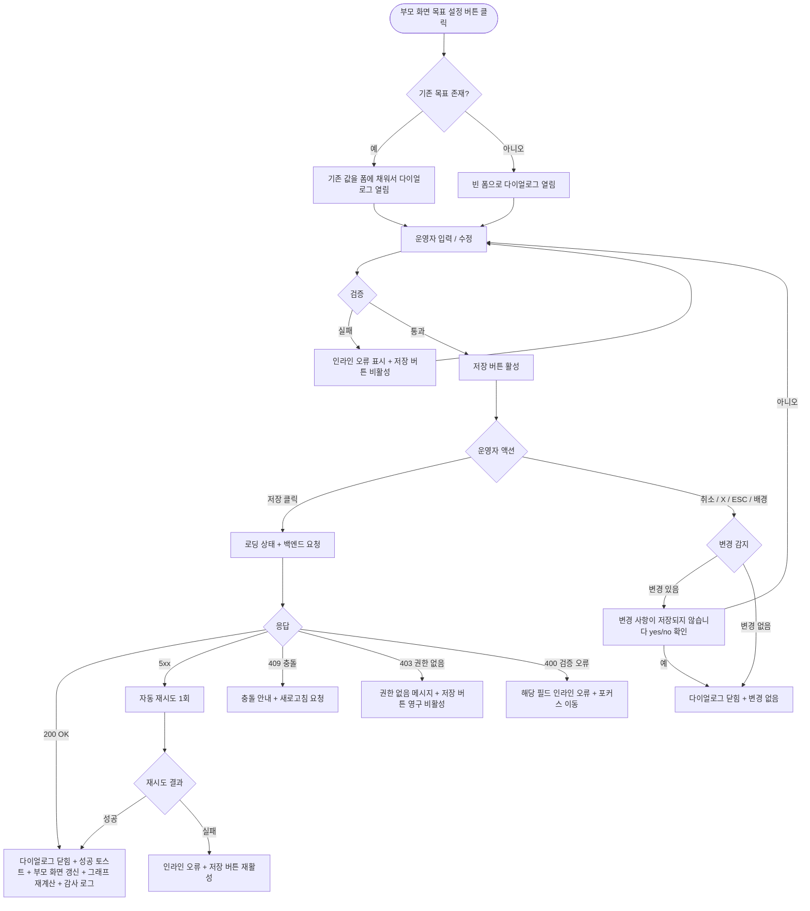

# DLG-M017 목표 설정 다이얼로그

## 1. 다이얼로그 메타 정보

이 문서는 목표 설정 다이얼로그에 대한 자기완결형 요구사항 정의서입니다. 다른 문서를 함께 보지 않아도 이 한 장만으로 다이얼로그의 호출 트리거, 화면 구성, 입력과 검증, 저장 후 동작, 권한별 처리, 예외 흐름, 그리고 회원의 운동 목표 관리 운영 정책까지 모두 이해하고 구현할 수 있도록 작성합니다.

| 항목 | 값 |
|---|---|
| 작성일 | 2026-05-22 |
| 버전 | v1.0 |
| 상태 | 최신 통합본 반영 (정합화 완료) |
| 도메인 | D02 회원관리 |
| 다이얼로그 ID | DLG-M017 |
| 다이얼로그명 | 목표 설정 |
| 다이얼로그 유형 | 입력형 폼 다이얼로그 (Form Modal) |
| 우선순위 | P1 (출시 필수) |
| 기능코드 | MBR-02 (회원 상세), MBR-ADV-03 (체성분 관리) |
| 계약코드 | MBR-02, MBR-ADV-03 |
| 부모 화면 | SCR-M004 회원 상세 페이지, SCR-M006 체성분 관리 페이지 |
| 호출 트리거 | 회원 상세의 체성분 탭에서 목표 설정 버튼 클릭 |
| 후속 다이얼로그 | 없음 |

## 2. 다이얼로그 목적

목표 설정 다이얼로그는 회원이 도달하고자 하는 신체 수치(목표 체중, 목표 체지방률, 목표 골격근량)와 달성 시점, 그리고 트레이너가 함께 적어두는 메모를 한 번에 입력하거나 수정하는 입력형 다이얼로그입니다. 회원 운영에서 목표는 단순 수치가 아니라 회원과 트레이너 사이의 약속이며, 이후 측정값 변화 그래프 위에 목표선이 함께 표시되어 달성 여부를 한눈에 추적할 수 있게 합니다. 목표가 설정되어 있는 회원은 회원 상세의 운영 포커스 영역에 달성률이 자동 계산되어 노출되며, 트레이너는 이를 근거로 다음 운동 계획을 조정합니다.

운영 현장에서 이 다이얼로그는 다음 상황에서 사용됩니다. 첫째, 신규 회원의 초기 인바디 측정 후 트레이너와 회원이 함께 첫 목표를 잡는 상황입니다. 둘째, 기존 목표를 이미 달성했거나 미달성으로 만료되어 새로운 목표를 다시 잡는 상황입니다. 셋째, 운동 계획 변경(예: 근력 위주에서 다이어트 위주로 전환)에 따라 목표 항목과 수치를 재조정해야 하는 상황입니다. 어떤 경우든 운영자는 이 다이얼로그 안에서 목표를 한 번에 입력·수정·저장하며, 별도 화면 이동 없이 회원 상세 안에서 흐름이 끝납니다.

## 3. 호출 트리거와 진입 경로

이 다이얼로그는 회원 상세 페이지(SCR-M004)의 체성분 탭에 있는 "목표 설정" 버튼이나, 체성분 관리 페이지(SCR-M006)의 회원별 목표 영역에 있는 "목표 설정" / "목표 수정" 버튼을 누를 때 열립니다. 두 경로 모두 동일한 다이얼로그를 호출하며, 어느 부모 화면에서 호출되었는지에 따라 닫힘 후 갱신 범위만 달라집니다.

기존 목표가 이미 등록되어 있는 회원의 경우 다이얼로그가 열릴 때 모든 입력 필드에 기존 값이 미리 채워진 상태로 표시됩니다. 운영자는 일부 값만 수정해 저장하거나 전체를 새 값으로 덮어 씌울 수 있습니다. 기존 목표가 없는 회원의 경우 모든 필드가 비어 있는 신규 입력 상태로 열립니다.

## 4. UI 구성과 영역별 동작

다이얼로그는 화면 중앙에 표시되며, 데스크톱에서 가로 520px 내외, 모바일에서는 가로 폭의 92%로 표시됩니다. 배경은 반투명 검정 오버레이로 덮여 부모 화면 상호작용이 차단됩니다.

헤더에는 좌측에 "목표 설정"이라는 제목과, 신규 등록인지 수정인지를 알려주는 작은 보조 라벨이 함께 표시됩니다. 보조 라벨은 신규 등록 시 "처음으로 목표를 설정합니다", 수정 시 "기존 목표를 수정합니다"로 자동 표시됩니다. 헤더 우측에는 X 버튼이 있고, X를 누르면 취소와 동일하게 동작합니다.

본문 영역에는 목표 입력 폼이 위에서 아래로 배치됩니다. 첫 번째 필드는 목표 체중으로, 숫자 입력 필드와 단위 라벨(kg)로 구성되며 소수점 첫째 자리까지 입력할 수 있습니다. 두 번째 필드는 목표 체지방률로 % 단위와 함께 소수점 첫째 자리까지 입력합니다. 세 번째 필드는 목표 골격근량으로 kg 단위와 함께 소수점 첫째 자리까지 입력하며, 이 필드는 선택 입력입니다. 세 필드 우측에는 회원의 최근 측정값이 작은 보조 텍스트로 표시되어, 운영자가 "현재 75kg에서 목표 70kg" 같은 차이를 한눈에 파악할 수 있게 합니다.

그 아래에는 목표 달성 기간 영역이 있습니다. 두 가지 입력 방식 중 하나를 라디오로 고를 수 있는데, 첫 번째 옵션은 날짜 직접 선택(목표일 캘린더 피커)이고 두 번째 옵션은 개월 수 입력(예: 3개월)입니다. 개월 수를 선택한 경우에는 오늘 날짜를 기준으로 자동 계산된 목표일이 보조 텍스트로 표시되며, 날짜 선택을 직접 한 경우에는 오늘로부터 며칠 후인지가 보조 텍스트로 표시됩니다. 목표 달성 기간은 선택 입력이며, 입력하지 않으면 목표는 "달성 기한 없음"으로 저장됩니다.

다음 필드는 메모 영역으로, 자유 텍스트 영역(최대 500자)이 배치됩니다. 트레이너가 회원과 합의한 운동 계획, 식단 가이드, 주의 사항 등을 자유롭게 적을 수 있고, 입력하지 않아도 됩니다. 우측 하단에 글자 수 카운터가 작게 표시됩니다.

가장 아래에는 액션 버튼이 우측 정렬로 배치됩니다. 좌측에 취소 버튼(보조 스타일), 우측에 저장 버튼(주요 스타일)이 놓입니다. 저장 버튼은 입력값이 검증을 통과한 경우에만 활성화됩니다. 검증 실패가 있으면 해당 필드 아래에 인라인 오류 메시지가 표시되고 저장 버튼은 비활성화됩니다.

## 5. 입력 필드와 검증

목표 체중은 필수 입력이며, 0보다 크고 300kg 이하여야 합니다. 입력값이 회원의 최근 측정 체중과 비교해 너무 큰 차이(50kg 초과)가 나면 인라인 경고("최근 측정값과 차이가 매우 큽니다. 다시 확인해 주세요")가 노란색 톤으로 표시되지만, 저장은 막지 않습니다.

목표 체지방률은 필수 입력이며, 0보다 크고 80% 이하여야 합니다. 동일하게 최근 측정값과의 차이가 30%p를 초과하면 경고가 표시됩니다.

목표 골격근량은 선택 입력이며, 입력하는 경우 0보다 크고 100kg 이하여야 합니다.

목표 달성 기간은 선택 입력입니다. 날짜 직접 선택을 사용하는 경우, 선택한 날짜는 오늘 이후여야 하며 오늘로부터 5년 이내여야 합니다. 개월 수 입력을 사용하는 경우, 1개월 이상 60개월 이하의 정수만 허용됩니다.

메모는 선택 입력이며, 최대 500자까지 입력할 수 있습니다. 500자를 초과하면 입력이 차단되고 카운터가 빨간색으로 표시됩니다.

모든 필수 필드가 통과 상태일 때만 저장 버튼이 활성화되며, 한 필드라도 검증에 실패하면 저장 버튼이 비활성화되고 첫 실패 필드로 포커스가 자동 이동합니다.

## 6. 저장/취소 후 동작

저장 버튼을 누르면 다이얼로그가 즉시 로딩 상태로 전환되어 두 버튼이 비활성화되고 저장 버튼 안에 스피너가 표시됩니다. 백엔드에는 회원 ID, 목표 체중, 목표 체지방률, 목표 골격근량(선택), 목표 달성일(선택), 메모(선택), 운영자 ID가 포함된 요청이 전송됩니다. 백엔드는 기존 목표가 있으면 UPDATE, 없으면 INSERT로 처리하며, 감사 로그에 actor_id, member_id, before, after, action=SET_BODY_GOAL, timestamp를 기록합니다.

200 OK 응답을 받으면 다이얼로그가 닫히고, 부모 화면의 체성분 탭에 표시된 목표 영역이 새 값으로 즉시 갱신됩니다. 우측 상단에 "목표를 저장했어요"라는 성공 토스트가 5초 동안 표시됩니다. 체성분 변화 그래프가 있는 경우 그래프 위에 표시되는 목표선이 새 값으로 다시 그려지고, 달성률 표시 영역의 수치도 자동 재계산되어 표시됩니다.

취소 버튼이나 X 버튼을 누르면, 또는 ESC 키를 누르거나 배경 오버레이를 클릭하면 다이얼로그가 닫힙니다. 단, 입력값이 기존 값과 달라진 상태에서 닫으려고 하면 "변경 사항이 저장되지 않습니다. 닫으시겠습니까?"라는 yes/no 확인 모달이 한 번 표시되며, 운영자가 예를 선택해야 다이얼로그가 실제로 닫힙니다. 아니오를 선택하면 다이얼로그는 그대로 유지되고 입력값도 보존됩니다.

신규 입력 시점에는 모든 필드가 비어 있으므로 변경 감지가 일어나지 않고, 추가 확인 없이 즉시 닫힙니다.

## 7. 부모 화면 갱신과 후속 처리

회원 상세(SCR-M004)의 체성분 탭에서 호출된 경우, 탭 상단의 "현재 목표" 카드가 새 값으로 즉시 갱신되며, 달성률 표시 영역(예: "체중 목표 60% 달성")이 자동으로 다시 계산되어 표시됩니다. 체성분 변화 그래프가 있다면 목표선이 새 위치로 그려집니다. 회원 상세 상단의 빠른 액션 영역에 표시되는 목표 요약 배지도 새 값으로 교체됩니다.

체성분 관리 페이지(SCR-M006)에서 호출된 경우에는 해당 회원 행의 목표 컬럼이 새 값으로 갱신되고, 목표 미설정에서 설정으로 전환된 회원의 경우 목표 미설정 필터에서 자동으로 제외됩니다.

감사 로그(SCR-097)에 비동기로 목표 설정·수정 이벤트가 기록됩니다. 기록되는 필드는 actor_id, member_id, before(기존 목표 전체 또는 null), after(새 목표 전체), action=SET_BODY_GOAL, timestamp입니다.

목표가 새로 설정되거나 수정되면 회원 앱(있는 경우)에 푸시 알림을 보낼지 여부는 부모 화면의 설정에 따라 결정되며, 이 다이얼로그의 책임 범위는 아닙니다. 다이얼로그는 저장 성공 후 부모 화면이 알림 발송 여부를 결정하도록 트리거만 전달합니다.

## 8. 권한별 처리

목표 설정은 회원의 운동 계획에 직접 영향을 주는 작업이므로 운영자 권한에 따라 가능 여부가 달라집니다.

슈퍼관리자(superAdmin), 본사 최고관리자(primary), Owner(지점장), 매니저(manager)는 모든 회원의 목표를 설정·수정·삭제할 수 있습니다.

트레이너(trainer)는 본인이 담당하는 회원에 한해서만 목표를 설정·수정할 수 있습니다. 다른 트레이너가 담당하는 회원의 체성분 탭에서는 목표 설정 버튼이 보이지 않거나, 보이더라도 클릭 시 "본인 담당 회원만 목표를 설정할 수 있어요"라는 안내가 표시되며 다이얼로그가 열리지 않습니다.

FC(fc), 스태프(staff), 프런트(front), 읽기 전용(readonly)은 목표 설정 권한이 없어 부모 화면의 목표 설정 버튼이 아예 보이지 않습니다. 직접 API 호출 시도 시 백엔드가 403을 반환하며 변경은 일어나지 않습니다.

목표 삭제는 별도 정책으로 분리되어, 목표 설정 다이얼로그 안에서 직접 삭제는 지원하지 않습니다. 목표를 없애려면 모든 수치를 0이 아닌 빈 상태로 비울 수는 없으므로, 별도의 "목표 해제" 버튼이 부모 화면에 제공됩니다. 이 다이얼로그는 신규 입력 또는 기존 값 수정만 담당합니다.

## 9. 토스트와 알림

저장 성공 시 우측 상단에 녹색 토스트("목표를 저장했어요")가 5초 표시됩니다. 토스트 클릭 시 부모 화면의 체성분 탭으로 이동(이미 그 위치에 있는 경우 무시)합니다.

저장 실패 시 사유별 빨강 토스트가 표시됩니다. "다른 운영자가 동시에 수정했어요"(409), "권한이 없어요"(403), "네트워크 오류가 발생했어요"(5xx), "입력값이 유효하지 않아요"(400) 같은 형태입니다.

검증 실패는 토스트가 아닌 인라인 메시지로 처리되어, 운영자가 어느 필드를 수정해야 하는지 즉시 파악할 수 있게 합니다.

## 10. 예외 처리

네트워크 오류(5xx, timeout) 발생 시 다이얼로그 안에 인라인 오류("저장에 실패했어요. 다시 시도해 주세요")가 표시되고 저장 버튼이 다시 활성화됩니다. 자동 재시도 1회 후에도 실패하면 운영자가 수동으로 다시 시도해야 합니다.

동시 편집 충돌(409)이 발생하면 "다른 운영자가 같은 회원의 목표를 수정했어요. 최신 데이터를 확인하고 다시 시도해 주세요"라는 메시지가 표시되며, 다이얼로그를 닫고 부모 화면을 새로고침한 뒤 다시 진입해야 합니다.

권한 부족(401·403)이 응답되면 다이얼로그 안에 권한 없음 메시지가 표시되고 저장 버튼이 영구 비활성화됩니다.

회원이 그 사이에 탈퇴·삭제·홀딩 처리된 경우 "회원 정보가 변경되었어요. 회원 상세를 새로고침해 주세요"라는 메시지가 표시되며, 저장이 차단됩니다. 홀딩 상태인 회원에게는 목표 설정 자체가 가능하지만, 목표 달성 기간 계산은 홀딩 해제 후 다시 시작되도록 백엔드에서 처리됩니다.

회원의 최근 측정값과 목표 수치의 차이가 비현실적으로 큰 경우에는 인라인 경고가 표시되지만 저장은 막지 않습니다. 트레이너가 회원과 합의한 목표는 시스템이 임의로 거부하지 않아야 한다는 운영 정책의 결과입니다.

## 11. 다이얼로그 생명주기

## 12. 관련 운영 정책

회원의 운동 목표는 트레이너와 회원 사이의 약속이며, 시스템은 그 약속을 기록하고 측정값 변화와 비교해 달성률을 계산하는 역할만 합니다. 따라서 목표 수치는 회원의 현실적 달성 가능성과 무관하게 운영자가 자유롭게 입력할 수 있으며, 시스템은 입력값 형식 검증과 비현실적 차이에 대한 경고만 표시할 뿐 저장을 차단하지 않습니다.

목표 달성률 계산 기준은 다음과 같습니다. 체중 감량 목표의 경우 (시작 체중 - 현재 체중) / (시작 체중 - 목표 체중)으로 계산되며, 체지방률·골격근량도 동일한 공식으로 계산됩니다. 음수 결과는 0%, 100%를 초과하는 결과는 100%(초과 달성)로 표시됩니다. 시작 체중은 목표 설정 시점의 최근 측정값이 자동으로 저장되어 사용되며, 목표를 수정해도 시작 체중은 그대로 유지됩니다.

목표 달성 기간이 지난 회원은 목표 만료 상태가 되며, 회원 상세의 운영 포커스 영역에 "목표 기간 만료 - 재설정 권장" 알림이 표시됩니다. 만료된 목표를 자동으로 삭제하지는 않고, 운영자가 재설정 또는 해제를 명시적으로 결정해야 합니다.

홀딩 상태 회원의 목표 달성 기간은 홀딩 기간만큼 자동 연장됩니다. 이는 회원이 이용 정지된 기간 동안 운동을 못한 만큼 목표 기한도 그만큼 미뤄야 한다는 운영 정책의 결과이며, A04 홀딩 자동 처리 배치(매일 새벽 2시)가 홀딩 해제 시점에 함께 처리합니다.

목표 설정 권한이 트레이너에게는 본인 담당 회원으로 제한되는 것은, 회원과 트레이너 사이의 운동 계획 책임 구조를 흐트러뜨리지 않기 위해서입니다. 매니저와 Owner(지점장)은 운영 차원에서 모든 회원의 목표를 조정할 수 있지만, 일반적으로는 담당 트레이너와 협의 후 수정하는 것이 운영 가이드입니다.

목표 설정·수정·해제는 모두 감사 로그에 비동기로 기록되며, 5초 안에 감사 로그 화면에서 조회 가능해야 합니다. 이는 회원과의 약속이 운영자 변경이나 시간 경과에 따라 어떻게 조정되었는지 추적할 수 있게 하기 위한 정책입니다.

목표 수치는 회원 앱(있는 경우)에서도 조회 가능하며, 회원이 직접 자신의 달성률을 확인할 수 있게 노출됩니다. 다만 목표 수정과 해제는 운영자만 수행할 수 있고, 회원이 직접 자신의 목표를 변경하지는 못합니다.
