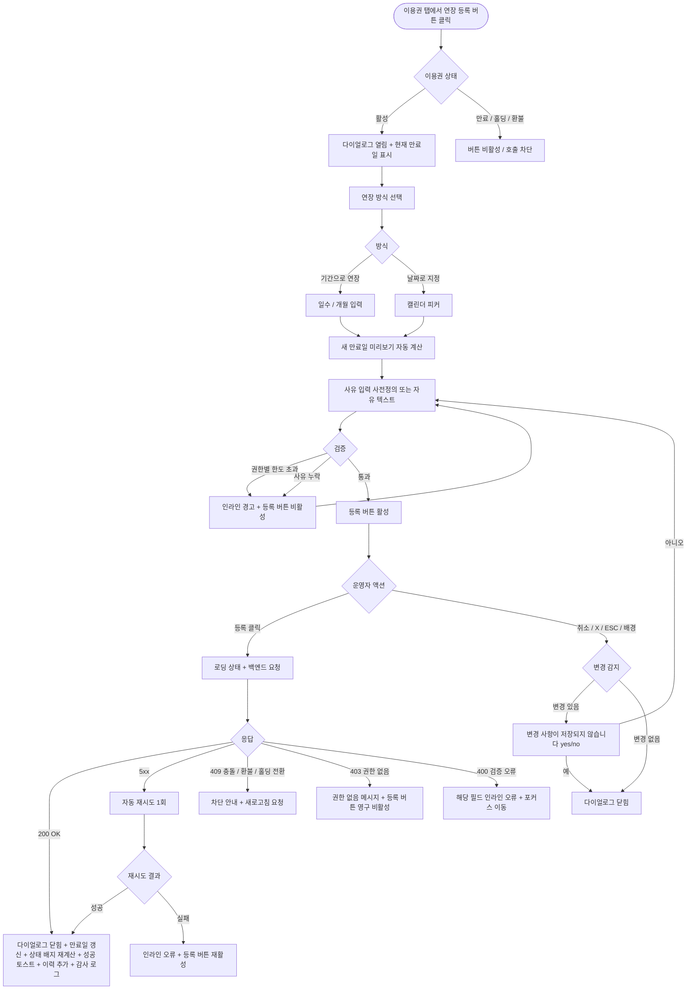

# DLG-M018 연장 등록 다이얼로그

## 1. 다이얼로그 메타 정보

이 문서는 연장 등록 다이얼로그에 대한 자기완결형 요구사항 정의서입니다. 다른 문서를 함께 보지 않아도 이 한 장만으로 다이얼로그의 호출 트리거, 화면 구성, 입력과 검증, 등록 후 동작, 권한별 처리, 예외 흐름, 그리고 이용권 만료일 연장 운영 정책까지 모두 이해하고 구현할 수 있도록 작성합니다.

| 항목 | 값 |
|---|---|
| 작성일 | 2026-05-22 |
| 버전 | v1.0 |
| 상태 | 최신 통합본 반영 (정합화 완료) |
| 도메인 | D02 회원관리 |
| 다이얼로그 ID | DLG-M018 |
| 다이얼로그명 | 연장 등록 |
| 다이얼로그 유형 | 입력형 폼 다이얼로그 (Form Modal) |
| 우선순위 | P0 (출시 필수) |
| 기능코드 | MBR-02 (회원 상세) |
| 계약코드 | MBR-02 |
| 부모 화면 | SCR-M004 회원 상세 페이지 |
| 호출 트리거 | 회원 상세의 이용권 탭에서 활성 이용권 행의 "연장 등록" 버튼 클릭 |
| 후속 다이얼로그 | 없음 |

## 2. 다이얼로그 목적

연장 등록 다이얼로그는 회원이 보유한 활성 이용권의 만료일을 결제 없이 운영자가 직접 늘려주는 작업을 입력받는 다이얼로그입니다. 기간권의 종료일을 며칠/몇 개월 미루거나, 특정 날짜로 직접 지정하여 이용 가능 기간을 늘립니다. 이 작업은 결제·환불과 무관한 운영 보정이며, 센터 운영자의 재량으로 회원에게 추가 이용 기간을 제공하는 모든 케이스를 처리합니다.

운영 현장에서 이 다이얼로그는 다음 상황에서 자주 사용됩니다. 첫째, 시설 공사·기기 고장·강사 휴직 등 센터 측 사유로 회원이 일정 기간 정상 이용을 못한 경우 보상 차원에서 그만큼 만료일을 미루는 경우입니다. 둘째, 회원이 특별한 사정(중요 업무, 출장, 출산)으로 잠시 못 나왔지만 홀딩 등록 절차를 거치지 않은 채 사후 보정이 필요한 경우입니다. 셋째, 본사 프로모션이나 이벤트로 모든 활성 회원에게 며칠을 무료로 추가 제공하는 경우입니다. 어떤 경우든 운영자는 연장 일수·개월 수 또는 새 만료일과 함께 사유를 명확히 남겨야 합니다.

## 3. 호출 트리거와 진입 경로

이 다이얼로그는 회원 상세 페이지(SCR-M004)의 이용권 탭에서 활성 상태인 이용권 행 우측의 "연장 등록" 버튼을 누를 때 열립니다. 이용권이 만료·홀딩·환불 중 상태인 행에서는 이 버튼이 보이지 않거나 비활성화 상태로 표시됩니다. 만료된 이용권의 만료일을 다시 늘리려면 연장이 아니라 재등록 또는 재구매 흐름을 사용해야 하며, 이 다이얼로그는 활성 이용권에 한정해서만 사용됩니다.

진입 경로는 단일하며, 이용권 탭이 아닌 다른 탭이나 다른 화면에서는 이 다이얼로그가 호출되지 않습니다. 회원이 여러 개의 활성 이용권을 동시에 보유한 경우, 각 이용권 행마다 별도의 연장 등록 버튼이 있고, 어느 버튼을 눌렀는지에 따라 다이얼로그가 대상으로 가져가는 이용권 ID가 달라집니다.

## 4. UI 구성과 영역별 동작

다이얼로그는 화면 중앙에 가로 520px 내외(모바일 92%)로 표시됩니다. 배경은 반투명 검정 오버레이로 덮이고 부모 화면 상호작용이 차단됩니다.

헤더 좌측에는 "연장 등록" 제목과 함께 보조 라벨로 대상 이용권명(예: "3개월 헬스 정기권")이 작은 글씨로 함께 표시되어 운영자가 어떤 이용권을 연장하는지 즉시 인지하게 합니다. 우측에는 X 버튼이 배치됩니다.

본문 상단에는 현재 만료일 카드가 배치됩니다. 카드 안에는 현재 만료일(YYYY-MM-DD)이 크게 표시되고, 그 아래에 "오늘로부터 D-N일"이라는 보조 텍스트가 표시됩니다. 이 카드는 읽기 전용이며 수정할 수 없습니다.

그 아래에는 연장 방식 선택 영역이 있습니다. 두 가지 옵션을 라디오로 고를 수 있는데, 첫 번째 옵션은 "기간으로 연장"이고 두 번째 옵션은 "날짜로 지정"입니다. 기본값은 "기간으로 연장"입니다.

"기간으로 연장"을 선택하면 그 아래에 두 개의 작은 입력 영역이 활성화됩니다. 좌측에는 숫자 입력 필드(연장 일수 또는 개월 수), 우측에는 단위 선택 드롭다운(일 / 개월)이 있습니다. 운영자는 예를 들어 "7일" 또는 "1개월"을 입력합니다. 입력하는 즉시 그 아래에 "연장 후 새 만료일: YYYY-MM-DD"라는 미리보기가 자동 계산되어 표시됩니다. 개월 단위 입력 시 새 만료일은 단순히 해당 월수를 더한 후 같은 일자로 계산하며, 해당 일자가 없는 월(예: 1월 31일에 1개월 연장하면 2월 28일 또는 29일)은 해당 월의 마지막 날로 보정됩니다.

"날짜로 지정"을 선택하면 입력 영역이 캘린더 피커로 전환됩니다. 운영자는 새 만료일을 직접 선택할 수 있고, 현재 만료일보다 이전 날짜는 선택할 수 없도록 비활성화되어 있습니다. 선택 즉시 "현재 대비 +N일 연장"이라는 미리보기가 표시됩니다.

연장 미리보기 아래에는 연장 사유 입력 영역이 있습니다. 사유는 필수 입력이며, 두 가지 입력 방식을 탭으로 전환할 수 있습니다. 첫 번째 탭은 사전 정의된 사유 목록 선택(센터 사정 보상, 본사 프로모션, 회원 요청, 시설 점검 보상, 기기 고장 보상, 강사 휴직 보상, 기타)이고, 두 번째 탭은 자유 텍스트 입력(최대 200자)입니다. 사전 정의 사유에서 "기타"를 선택한 경우에는 자유 텍스트 입력란이 함께 노출되어 추가 설명을 적도록 강제됩니다.

다이얼로그 하단에는 액션 버튼이 우측 정렬로 배치됩니다. 좌측 취소 버튼(보조 스타일), 우측 "등록" 버튼(주요 스타일)입니다. 등록 버튼은 모든 필수 입력(연장 기간 또는 날짜, 사유)이 통과 상태일 때만 활성화됩니다.

## 5. 입력 필드와 검증

연장 일수 입력은 1일 이상 365일 이하의 정수만 허용됩니다. 0일·음수·소수점은 입력 단계에서 차단됩니다.

연장 개월 수 입력은 1개월 이상 12개월 이하의 정수만 허용됩니다.

날짜 직접 지정은 현재 만료일보다 이후이고 오늘로부터 최대 5년 이내여야 합니다. 5년 이상 미래로 연장하려면 슈퍼관리자 승인이 필요하며, 그 경우 등록 버튼 위에 "5년 초과 연장은 슈퍼관리자 승인이 필요합니다" 안내가 표시되고 등록 버튼이 비활성화됩니다.

연장 사유는 필수 입력입니다. 사전 정의 목록 또는 자유 텍스트 중 하나가 반드시 채워져야 하며, 자유 텍스트 입력은 최소 5자 이상이어야 합니다. "기타"를 선택한 경우 자유 텍스트가 함께 채워져야 합니다.

매니저 권한자는 1회 연장에 30일 이내로만 가능하며, 30일을 초과하는 연장은 owner 이상 권한자만 수행할 수 있습니다. 이 검증은 입력값 변경 즉시 확인되어, 매니저가 30일을 초과한 값을 입력하면 인라인 경고와 함께 등록 버튼이 비활성화됩니다.

회원이 이미 이번 달에 연장을 등록받은 적이 있는 경우, 같은 달에 두 번째 연장은 권한과 무관하게 사유에 "중복 연장 - 사유"를 명시적으로 입력해야 통과됩니다. 이는 운영 실수와 회원 간 형평성 문제를 사전에 인지시키는 정책입니다.

## 6. 등록/취소 후 동작

등록 버튼을 누르면 다이얼로그가 로딩 상태로 전환되어 두 버튼이 비활성화되고 등록 버튼 안에 스피너가 표시됩니다. 백엔드에는 회원 ID, 이용권 ID, 연장 방식, 연장 일수 또는 새 만료일, 사유, 운영자 ID가 포함된 요청이 전송됩니다.

백엔드는 트랜잭션으로 이용권의 만료일을 새 값으로 UPDATE하고, 이용권 이력 테이블에 연장 이벤트(action=EXTEND, before_expiry, after_expiry, days_added, reason, actor_id, timestamp)를 INSERT하며, 감사 로그에도 동일 이벤트를 비동기로 기록합니다.

200 OK 응답을 받으면 다이얼로그가 닫히고, 부모 화면(이용권 탭)의 해당 이용권 행의 만료일이 새 값으로 즉시 갱신됩니다. 행 우측에 "+N일 연장됨" 배지가 임시로 표시되며 약 10초 후 자동으로 사라집니다. 우측 상단에 "이용권을 N일 연장했어요" 성공 토스트가 5초 동안 표시됩니다.

이용권 이력 영역(같은 탭 안의 하위 영역)이 있다면 새 연장 이력이 가장 위에 추가되어 운영자가 직전 이력을 즉시 확인할 수 있습니다. 회원의 만료 상태 배지(만료예정·만료임박)는 새 만료일을 기준으로 자동 재계산됩니다.

취소 버튼이나 X 버튼을 누르면, 또는 ESC 키나 배경 클릭으로 닫으면 입력값이 일부라도 있는 경우 "변경 사항이 저장되지 않습니다. 닫으시겠습니까?" yes/no 확인이 한 번 표시됩니다. 예 선택 시 다이얼로그가 닫히고 변경은 일어나지 않습니다. 아니오 선택 시 다이얼로그가 유지됩니다.

## 7. 부모 화면 갱신과 후속 처리

이용권 탭의 해당 행만 갱신되고 다른 행은 영향을 받지 않습니다. 회원 상세 상단의 대표 이용권 카드(가장 가까운 만료일을 가진 이용권)도 새 만료일로 갱신됩니다. 회원 상태 배지가 만료임박이었다가 연장으로 활성으로 돌아가는 경우, 상태 배지가 즉시 활성으로 다시 그려집니다.

회원 상태가 만료에서 활성으로 전환되는 경우(만료된 이용권을 미래 날짜로 연장한 경우는 정상 흐름이 아니므로 차단되지만, 활성에서 만료임박이 활성으로 전환되는 경우)에는 회원 상태 배지가 자동 활성으로 변경되고, 회원 목록 화면의 상태 필터에도 다음 새로고침 시점에 반영됩니다.

감사 로그(SCR-097)에는 actor_id, member_id, ticket_id, before_expiry, after_expiry, days_added, reason, action=EXTEND_TICKET, timestamp가 비동기로 기록되며, 5초 안에 감사 로그 화면에서 조회 가능합니다.

회원 앱이 있는 경우 연장 사실을 회원에게 푸시로 알릴지 여부는 부모 화면의 정책 또는 별도 알림 설정에서 결정하며, 이 다이얼로그는 알림 발송 트리거만 백엔드로 전달합니다.

## 8. 권한별 처리

연장 등록은 운영 비용이 발생하는 결정이므로 권한별로 단계적 제한이 있습니다.

슈퍼관리자(superAdmin), 본사 최고관리자(primary)는 모든 회원의 모든 이용권을 무제한 연장할 수 있습니다. 5년 초과 연장도 가능합니다. 본사 통합 모드에서 일괄 연장(여러 회원에게 동일 일수 연장)도 슈퍼관리자만 사용할 수 있지만, 이 일괄 연장은 별도 화면(본사 운영 도구)에서 처리되며 이 다이얼로그의 책임 범위는 아닙니다.

센터장(owner)은 자기 지점 회원의 이용권을 무제한 연장할 수 있고, 1회 최대 1년까지 연장 가능합니다. 1년을 초과하는 연장은 슈퍼관리자 승인이 필요합니다.

매니저(manager)는 자기 지점 회원의 이용권을 1회 최대 30일까지 연장할 수 있습니다. 30일을 초과하는 연장 입력 시 등록 버튼이 비활성화되며 안내가 표시됩니다. 같은 회원에 대한 누적 연장은 별도 한도가 없지만, 같은 달 두 번째 연장 시 사유 명시 정책이 적용됩니다.

FC(fc), 트레이너(trainer), 스태프(staff), 프런트(front), 읽기 전용(readonly)은 연장 등록 권한이 없어 부모 화면의 연장 등록 버튼이 보이지 않습니다. 직접 API 호출 시도 시 백엔드가 403을 반환하며 변경은 일어나지 않습니다.

권한 부족 시 발생하는 이벤트는 모두 감사 로그에 기록되어, 권한 우회 시도가 사후에 추적 가능합니다.

## 9. 토스트와 알림

등록 성공 시 우측 상단에 녹색 토스트("이용권을 N일 연장했어요")가 5초 표시됩니다. 토스트 클릭 시 이용권 이력 영역으로 페이지 내부 앵커 스크롤이 일어납니다.

등록 실패 시 사유별 빨강 토스트가 표시됩니다. "권한이 없어요"(403), "다른 운영자가 동시에 수정했어요"(409), "네트워크 오류가 발생했어요"(5xx), "입력값이 유효하지 않아요"(400) 형태입니다.

같은 회원에 대한 같은 달 두 번째 연장 시점에 사유 입력이 명시적이지 않으면 "같은 달 두 번째 연장입니다. 사유를 더 자세히 입력해 주세요"라는 인라인 경고가 표시됩니다.

## 10. 예외 처리

네트워크 오류(5xx, timeout) 발생 시 다이얼로그 안에 인라인 오류가 표시되고 등록 버튼이 다시 활성화됩니다. 자동 재시도 1회 후에도 실패하면 운영자가 수동 재시도해야 합니다.

동시 편집 충돌(409)이 발생하면 "다른 운영자가 같은 이용권을 수정했어요"라는 메시지가 표시되며, 다이얼로그를 닫고 부모 화면을 새로고침한 뒤 다시 진입해야 합니다. 이미 만료 상태로 전환된 이용권을 연장하려고 하면 동일 메시지와 함께 차단됩니다.

대상 이용권이 그 사이에 환불 처리된 경우 "환불 처리된 이용권은 연장할 수 없어요. 새로고침해 주세요"라는 메시지가 표시됩니다.

대상 이용권이 홀딩 상태로 전환된 경우 "홀딩 상태 이용권은 연장할 수 없어요. 홀딩을 먼저 해제해 주세요"라는 메시지가 표시되며, 등록이 차단됩니다.

회원이 그 사이에 탈퇴·삭제 처리된 경우 "회원 정보가 변경되었어요. 회원 상세를 새로고침해 주세요" 메시지가 표시됩니다.

권한 부족(401·403) 응답 시 권한 없음 메시지가 표시되고 등록 버튼이 영구 비활성화됩니다.

연장 후 새 만료일이 오늘 이전이 되는 비정상 케이스는 입력 검증에서 차단되며, 만약 우회되어 백엔드까지 도달하면 400으로 차단됩니다.

## 11. 다이얼로그 생명주기

## 12. 관련 운영 정책

이용권 연장은 결제·환불과 분리된 운영 보정 행위이며, 회원에게 추가 이용 기간을 제공하지만 결제 이력이나 매출 통계에는 영향을 주지 않습니다. 다만 이용권 이력 테이블에는 연장 이벤트가 명확히 기록되어, 사후에 어떤 운영자가 어떤 사유로 며칠을 연장했는지 추적 가능합니다.

권한별 1회 연장 한도(매니저 30일, 센터장 1년, 슈퍼관리자 무제한)는 운영 실수와 형평성 위험을 단계적으로 제어하기 위한 정책입니다. 매니저가 회원 한 명에게 일방적으로 큰 혜택을 줄 수 없도록 30일로 제한되며, 더 큰 연장은 센터장의 승인이 필요하다는 운영 구조를 그대로 시스템에 반영합니다.

같은 회원에 대한 같은 달 두 번째 연장 시 사유 명시 정책은 운영자가 무심코 같은 회원에게 반복 혜택을 주는 사고를 막기 위함입니다. 시스템이 두 번째 연장 자체를 막지는 않지만, 사유를 더 명확히 입력하도록 강제해 사후 감사가 용이하도록 합니다.

홀딩 상태 이용권은 연장 불가입니다. 홀딩은 그 자체로 만료일 연장 효과를 가지므로(홀딩 해제 시 만료일이 홀딩 기간만큼 자동 연장됨), 홀딩과 연장이 중복되면 정책상 의미가 불분명해집니다. 운영자는 홀딩을 먼저 해제하고 연장을 등록하거나, 연장 대신 홀딩을 유지해야 합니다.

환불 처리된 이용권은 연장 불가입니다. 환불은 이용권의 종료를 의미하므로, 종료된 이용권을 다시 살릴 수는 없습니다. 환불 후 추가 이용을 원하는 회원에게는 새 이용권 등록(결제)으로 안내해야 합니다.

만료된 이용권의 만료일을 미래로 다시 늘리는 행위는 이 다이얼로그에서 차단됩니다. 만료된 이용권은 재등록 또는 재구매 흐름으로 처리해야 하며, 이는 결제 도메인에서 다룹니다. 만료가 임박했지만 아직 만료되지 않은 이용권은 자유롭게 연장 가능합니다.

연장 이벤트는 감사 로그에 비동기로 5초 안에 기록되며, 운영 실수 또는 권한 우회 시도를 사후 감지할 수 있게 합니다. 본사 권한자는 감사 로그를 통해 지점별 연장 빈도와 사유 분포를 모니터링할 수 있고, 비정상적으로 잦은 연장이 발생하는 지점에는 별도 가이드를 제공할 수 있습니다.

홀딩 자동 처리(A04 배치, 매일 새벽 2시)와 만료 알림 배치(NFR-05, 매일 새벽 3시)는 연장 직후의 만료일 변화를 다음 배치 실행 시점에 반영합니다. 즉, 연장 직후 회원의 만료 알림 일정이 새 만료일 기준으로 자동 재계산되어 D-30·D-7·D-Day 알림이 새로 잡힙니다.
