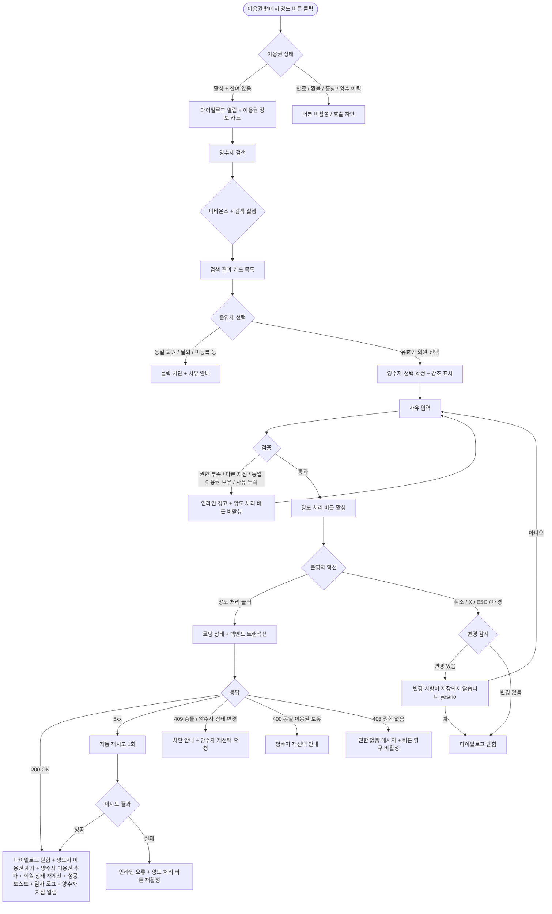

# DLG-M019 양도 처리 다이얼로그

## 1. 다이얼로그 메타 정보

이 문서는 양도 처리 다이얼로그에 대한 자기완결형 요구사항 정의서입니다. 다른 문서를 함께 보지 않아도 이 한 장만으로 다이얼로그의 호출 트리거, 화면 구성, 입력과 검증, 처리 후 동작, 권한별 처리, 예외 흐름, 그리고 이용권 양도 운영 정책까지 모두 이해하고 구현할 수 있도록 작성합니다.

| 항목 | 값 |
|---|---|
| 작성일 | 2026-05-22 |
| 버전 | v1.0 |
| 상태 | 최신 통합본 반영 (정합화 완료) |
| 도메인 | D02 회원관리 |
| 다이얼로그 ID | DLG-M019 |
| 다이얼로그명 | 양도 처리 |
| 다이얼로그 유형 | 검색·선택형 다이얼로그 (Search + Confirm Modal) |
| 우선순위 | P1 (출시 필수) |
| 기능코드 | MBR-02 (회원 상세) |
| 계약코드 | MBR-02 |
| 부모 화면 | SCR-M004 회원 상세 페이지 |
| 호출 트리거 | 회원 상세의 이용권 탭에서 활성 이용권의 "양도" 버튼 클릭 |
| 후속 다이얼로그 | 없음 (다이얼로그 내 검색 결과로 대상 회원 선택 후 동일 다이얼로그에서 처리 확정) |

## 2. 다이얼로그 목적

양도 처리 다이얼로그는 현재 회원이 보유한 이용권을 다른 회원에게 넘기는 작업을 한 다이얼로그 안에서 처리하기 위한 입력·검색·확인 통합 다이얼로그입니다. 회원의 개인 사정으로 더 이상 이용권을 쓸 수 없게 되었을 때, 환불 대신 가족·지인 등 다른 회원에게 잔여 기간이나 잔여 횟수를 그대로 넘겨주는 처리를 합니다. 양도는 결제 흐름과 무관한 운영 행위이며, 양도 후 양도자(원 소유 회원)는 해당 이용권을 잃고 양수자(새 소유 회원)가 그 이용권의 모든 잔여 권리를 그대로 가져갑니다.

운영 현장에서 이 다이얼로그는 다음 상황에서 사용됩니다. 첫째, 회원이 이사·전직·해외 출국 등 장기적 사유로 더 이상 센터를 이용할 수 없게 되어 가족이나 지인에게 이용권을 넘기는 경우입니다. 둘째, 결혼·상속·증여 같은 가족 관계 이벤트로 회원권을 가족 구성원에게 이전하는 경우입니다. 셋째, 회원 본인의 요청으로 같은 센터를 이용하는 친구에게 잔여 이용권을 넘기는 경우입니다. 어떤 경우든 운영자는 양도 대상 회원을 명확히 검색·선택하고 사유를 입력해 양도를 확정해야 합니다.

## 3. 호출 트리거와 진입 경로

이 다이얼로그는 회원 상세 페이지(SCR-M004)의 이용권 탭에서 활성 상태이고 잔여 기간 또는 잔여 횟수가 남아 있는 이용권 행 우측의 "양도" 버튼을 누를 때 열립니다. 만료된 이용권, 환불된 이용권, 홀딩 중인 이용권, 이미 양도 이력이 있어 현재 회원이 양수자인 이용권은 양도 버튼이 보이지 않거나 비활성화 상태로 표시됩니다.

진입 경로는 단일하며 이용권 탭 외 다른 위치에서 호출되지 않습니다. 회원이 여러 활성 이용권을 보유한 경우, 각 행마다 별도의 양도 버튼이 있고 어느 버튼을 눌렀는지에 따라 다이얼로그 안에 표시되는 대상 이용권 정보가 달라집니다.

## 4. UI 구성과 영역별 동작

다이얼로그는 화면 중앙에 가로 640px 내외(모바일 92%)로 표시되며, 일반적인 입력형 다이얼로그보다 약간 더 넓어 검색 결과 목록이 편하게 보이도록 합니다. 배경은 반투명 검정 오버레이로 덮입니다.

헤더에는 "양도 처리" 제목과 우측 X 버튼이 있고, 보조 라벨로 양도자 회원명이 함께 표시됩니다(예: "양도 처리 - 김길동 회원"). 본문은 위에서 아래로 세 개의 큰 섹션으로 나뉩니다.

첫 번째 섹션은 "양도할 이용권" 정보 카드입니다. 카드 안에는 이용권명(예: "3개월 헬스 정기권 + PT 10회"), 이용권 유형(기간권·횟수권·복합권), 잔여 기간(예: "2025-06-30까지, 38일 남음"), 잔여 횟수(횟수권인 경우만, 예: "PT 7/10회 남음"), 원 결제 금액, 원 결제일이 라벨과 값의 쌍으로 표시됩니다. 이 카드는 읽기 전용이며 수정할 수 없습니다.

두 번째 섹션은 "양도 대상 회원 검색" 영역입니다. 상단에 검색 입력 필드가 있고, 회원 이름 또는 전화번호로 검색할 수 있습니다. 검색은 입력 후 300ms 디바운스로 자동 실행되며, 최소 2자 이상 입력해야 검색이 시작됩니다. 검색 결과는 입력 필드 아래에 카드 목록 형태로 표시되며, 한 행에는 회원 사진(없으면 이니셜), 회원명, 회원번호, 마스킹된 연락처(예: 010-****-5678), 현재 상태 배지가 표시됩니다.

검색 결과 목록에서 한 명을 클릭하면 그 회원이 양수자로 선택되며, 검색 결과 영역이 접히고 그 위치에 선택된 회원 정보 카드가 강조되어 표시됩니다. 선택된 회원 카드 우측 상단에 "선택 해제" 버튼이 있어, 누르면 검색 영역이 다시 펼쳐지고 다른 회원을 선택할 수 있습니다.

검색 결과 회원 카드 안에는 양수 가능 여부 표시가 함께 노출됩니다. 양도 불가 사유(예: 탈퇴·삭제 회원, 같은 회원에게는 양도 불가, 이미 동일 이용권 보유 회원, 미등록 상태 회원)가 있는 회원 카드는 회색 톤으로 표시되고 클릭 시 사유가 안내됩니다. 가족 회원(DLG-M029로 연결된)이 검색 결과에 우선 노출되어 운영자가 가족 양도를 쉽게 선택할 수 있도록 합니다.

세 번째 섹션은 "양도 사유" 입력 영역으로, 선택형 사유 드롭다운(이사·이직·해외 출국, 결혼·상속·증여, 회원 본인 요청, 가족 양도, 기타)과 자유 텍스트 입력(최대 200자)이 함께 배치됩니다. "기타" 선택 시 자유 텍스트 입력이 필수로 강제됩니다. 사유 입력은 양도자·양수자 양쪽의 동의를 운영자가 확인했다는 운영 기록이므로 필수입니다.

다이얼로그 하단에는 액션 버튼이 우측 정렬로 배치됩니다. 좌측 취소 버튼, 우측 "양도 처리" 버튼(주요·주의 혼합 스타일, 빨강 톤은 아닌 진한 파랑)이 놓입니다. 양도 처리 버튼은 양수자 선택과 사유 입력이 모두 완료된 상태일 때만 활성화됩니다.

## 5. 입력 필드와 검증

검색어는 최소 2자 이상, 최대 50자까지 입력 가능합니다. 디바운스 300ms 후 자동 검색되며, 한글·영문·숫자만 허용됩니다. 전화번호 입력 시 하이픈 유무에 상관없이 부분 일치로 검색됩니다.

양수자 선택은 필수입니다. 검색 결과에서 한 명을 선택하지 않으면 양도 처리 버튼이 활성화되지 않습니다. 한 번에 한 명만 선택 가능하며 다중 선택은 지원하지 않습니다.

양수자 검증 규칙은 다음과 같습니다. 첫째, 양수자는 양도자와 다른 회원이어야 합니다. 같은 회원을 양수자로 선택하면 클릭이 차단됩니다. 둘째, 양수자는 활성·만료예정·만료·홀딩 중 하나의 상태여야 합니다. 탈퇴·삭제·미등록 상태 회원은 양수자가 될 수 없습니다. 셋째, 양수자가 양도 대상 이용권과 동일한 이용권을 이미 보유 중인 경우 양도는 차단됩니다. 단, 횟수권의 경우 잔여 횟수 합산이 가능한 정책이라면 양도 가능하며, 이 정책은 센터별 설정에 따라 달라집니다(기본값: 합산 불가). 넷째, 양도자와 양수자가 다른 지점 소속인 경우 본사 권한자만 양도를 처리할 수 있습니다(Owner(지점장)은 자기 지점 내 양도만 가능).

양도 사유는 필수 입력이며 5자 이상이어야 합니다. "기타" 선택 시 자유 텍스트가 5자 이상이어야 합니다.

## 6. 처리/취소 후 동작

양도 처리 버튼을 누르면 다이얼로그가 로딩 상태로 전환되어 두 버튼이 비활성화되고 처리 버튼 안에 스피너가 표시됩니다. 백엔드에는 이용권 ID, 양도자 회원 ID, 양수자 회원 ID, 사유, 운영자 ID가 포함된 요청이 전송됩니다.

백엔드는 트랜잭션으로 이용권의 소유자 ID를 양도자에서 양수자로 UPDATE하고, 이용권 이력 테이블에 양도 이벤트(action=TRANSFER, from_member, to_member, reason, actor_id, timestamp)를 INSERT합니다. 양도자 회원의 이용권 탭에서 해당 이용권은 즉시 사라지고, 양수자 회원의 이용권 탭에 즉시 추가됩니다. 양도 후에도 결제 이력은 양도자 계정에 남으며, 매출 통계 귀속도 양도자 기준으로 유지됩니다(양도는 결제·매출 관점이 아니라 이용 권리 관점의 이동임).

200 OK 응답을 받으면 다이얼로그가 닫히고, 부모 화면(양도자의 이용권 탭)이 즉시 갱신되어 양도된 이용권 행이 사라지거나 "양도됨 - YYYY-MM-DD" 비활성 행으로 표시됩니다(센터 설정에 따라 표시 방식 다름). 우측 상단에 "이용권을 [양수자 회원명]에게 양도했어요" 성공 토스트가 5초 표시됩니다.

회원 상세 상단의 대표 이용권 카드는 양도된 이용권이 가장 가까운 만료일을 가진 이용권이었던 경우 다른 활성 이용권 기준으로 자동 갱신됩니다. 양도자에게 다른 활성 이용권이 없으면 회원 상태가 만료 또는 미등록으로 자동 전환될 수 있습니다.

취소 버튼이나 X, ESC, 배경 클릭으로 닫으려고 할 때 양수자 선택 또는 사유 입력이 일부라도 있는 경우 "변경 사항이 저장되지 않습니다. 닫으시겠습니까?" yes/no 확인이 표시됩니다.

## 7. 부모 화면 갱신과 후속 처리

양도자 회원 상세에서 양도된 이용권 행이 즉시 사라지거나 "양도됨" 상태 행으로 변경됩니다. 회원 상태 배지·세그먼트 라벨·만료일 카운터가 양도 후 잔여 이용권을 기준으로 재계산됩니다.

양수자 회원 상세를 운영자가 직접 열어보면 양도받은 이용권이 즉시 표시됩니다. 양수자에게 푸시 알림(앱 있는 경우)이 발송될지 여부는 부모 화면 설정에 따르며, 다이얼로그는 트리거만 전달합니다.

감사 로그(SCR-097)에는 actor_id, from_member_id, to_member_id, ticket_id, reason, action=TRANSFER_TICKET, timestamp가 비동기로 기록되어 5초 안에 조회 가능합니다.

본사 통합 모드에서 다른 지점으로의 양도가 처리된 경우, 양수자 지점에는 "회원 [양수자명]에게 [양도자명]의 이용권이 양도되었습니다" 알림이 알림 센터(SCR-104)로 발송되어, 양수자 지점 운영자가 즉시 인지할 수 있게 합니다.

회원의 마일리지·쿠폰·체성분 이력 등 다른 데이터는 양도되지 않습니다. 양도는 이용권 한 건의 권리 이전만 처리하며, 양도자의 다른 모든 운영 데이터(상담 이력·메모·체성분·운동 이력)는 그대로 양도자 계정에 남아 있습니다.

## 8. 권한별 처리

양도는 회원 간 자산 이동이므로 권한별 가능 범위가 명확히 분리됩니다.

superAdmin, primary는 모든 지점의 모든 회원 간 양도를 처리할 수 있습니다. 본사 통합 모드에서 다른 지점 회원으로의 양도도 가능합니다.

Owner(지점장), 매니저(manager)는 자기 지점 회원 간 양도만 처리할 수 있습니다. 다른 지점 회원이 검색 결과에 표시되지 않거나, 표시되더라도 선택 시 "다른 지점 회원으로의 양도는 본사 권한자만 처리할 수 있어요" 안내가 표시됩니다.

FC(fc), 트레이너(trainer), 스태프(staff), 프런트(front), 읽기 전용(readonly)은 양도 처리 권한이 없어 부모 화면의 양도 버튼이 보이지 않습니다. 직접 API 호출 시도 시 백엔드가 403을 반환하며 변경은 일어나지 않습니다.

고가 이용권(원 결제 금액 100만원 이상)의 양도는 매니저 권한자라도 owner 이상 승인이 필요하며, 매니저가 시도 시 양도 처리 버튼 위에 "100만원 이상 이용권 양도는 Owner(지점장) 승인이 필요합니다" 안내가 표시되고 버튼이 비활성화됩니다.

권한 부족 이벤트는 모두 감사 로그에 기록되어, 권한 우회 시도가 추적 가능합니다.

## 9. 토스트와 알림

양도 성공 시 우측 상단에 녹색 토스트("이용권을 [양수자명]에게 양도했어요")가 5초 표시됩니다. 토스트 클릭 시 양수자의 회원 상세 페이지로 이동합니다.

양도 실패 시 사유별 빨강 토스트가 표시됩니다. "권한이 없어요"(403), "다른 운영자가 동시에 처리했어요"(409), "양수자가 이미 같은 이용권을 보유 중이에요"(400), "네트워크 오류가 발생했어요"(5xx) 형태입니다.

검색 결과가 0건일 때 검색 결과 영역에 "검색 결과가 없어요. 이름 또는 전화번호를 정확히 입력해 주세요" 안내가 표시됩니다.

## 10. 예외 처리

네트워크 오류(5xx, timeout) 발생 시 다이얼로그 안에 인라인 오류가 표시되고 양도 처리 버튼이 다시 활성화됩니다. 자동 재시도 1회 후에도 실패하면 운영자가 수동 재시도해야 합니다.

동시 편집 충돌(409)이 발생하면 "다른 운영자가 같은 이용권을 처리했어요"라는 메시지가 표시됩니다. 이미 환불·만료·양도 처리된 이용권을 다시 양도하려고 하면 동일 메시지와 함께 차단됩니다.

양수자가 양도 도중 탈퇴·삭제 처리된 경우 "양수자 회원 정보가 변경되었어요. 다시 선택해 주세요" 메시지가 표시되며, 양수자 선택이 자동 해제되고 검색 영역으로 돌아갑니다.

양수자가 양도 도중 같은 이용권을 별도 구매한 경우(중복 보유 차단 정책 위반) "양수자가 이미 동일 이용권을 보유 중이에요. 다른 양수자를 선택하거나 양도를 취소해 주세요" 메시지가 표시됩니다.

권한 부족(401·403) 응답 시 권한 없음 메시지가 표시되고 양도 처리 버튼이 영구 비활성화됩니다.

PT 횟수권의 경우 양도 시 트레이너 배정이 어떻게 처리될지가 정책 분기점입니다. 기본값은 양도와 동시에 트레이너 배정이 해제되어 양수자가 새로 트레이너를 배정받아야 하며, 센터 설정에 따라 동일 트레이너 유지 옵션이 있을 수 있습니다. 이 정책 결과는 양도 처리 직전에 다이얼로그 안에 안내 메시지로 표시됩니다.

## 11. 다이얼로그 생명주기

## 12. 관련 운영 정책

양도는 결제·매출과 무관한 운영 행위입니다. 양도자가 결제한 매출 귀속은 그대로 양도자 계정에 남고, 양수자에게는 결제 이력이 생기지 않습니다. 이는 양도가 환불·재결제가 아니라 단순 권리 이전임을 명확히 하는 정책이며, 매출 통계의 신뢰성을 유지합니다. 사후 매출 분석 시 양수자가 실제 이용한 매출을 양도자 매출로 그대로 두는 것이 운영 정합성에 부합한다고 판단된 결과입니다.

다른 지점 회원으로의 양도는 본사 권한자만 처리할 수 있습니다. 이는 지점 간 회원 자산 이동을 본사가 통제해야 한다는 운영 정책의 결과이며, Owner(지점장) 권한자가 임의로 다른 지점으로 이용권을 양도해 매출 귀속·운영 통계가 왜곡되는 사고를 막습니다. 다른 지점 양도가 필요한 경우 본사에 요청을 보내거나 회원 이관(SCR-M005)을 먼저 처리한 뒤 양도하는 흐름이 권장됩니다.

고가 이용권(원 결제 금액 100만원 이상)의 양도는 owner 이상 권한이 필요합니다. 매니저가 큰 금액의 이용권을 임의로 다른 회원에게 넘기는 사고를 막기 위함이며, 운영 책임 단계를 한 단계 높여 신중한 처리를 강제합니다.

양수자의 중복 보유 차단은 기본 정책이지만, 횟수권에 한해 잔여 횟수 합산을 허용하는 센터 설정이 별도로 있습니다. 합산을 허용하는 센터에서는 양도 후 양수자의 잔여 횟수가 (기존 잔여 + 양도 잔여)로 자동 합산되고, 만료일은 더 늦은 쪽으로 자동 선택됩니다. 합산 미허용 센터에서는 동일 이용권 양수가 차단됩니다.

가족 회원 간 양도는 우선 노출 정책으로 검색 결과 상단에 표시되어 운영자가 쉽게 선택할 수 있게 합니다. 가족 양도는 운영 현장에서 가장 빈번한 양도 사유이며, 검색 시 가족 회원이 먼저 보이면 운영자가 사유와 대상 선택을 직관적으로 수행할 수 있습니다.

PT 횟수권의 트레이너 배정 처리는 센터 설정에 따라 분기됩니다. 기본값은 양도와 동시에 배정 해제이며, 동일 트레이너 유지 옵션을 켠 센터에서는 트레이너가 그대로 양수자에게 인계됩니다. 어느 정책이든 트레이너에게 알림 센터(SCR-104)로 양도 사실이 통지되어 트레이너가 새 회원을 인지할 수 있게 합니다.

탈퇴·삭제 회원이 양도자인 경우 양도 처리는 불가능합니다. 탈퇴는 회원과 센터의 관계 종료이며, 이미 종료된 관계에서 이용권을 다른 회원에게 넘기는 것은 운영 정합성에 어긋납니다. 탈퇴 전 양도가 필요한 경우 탈퇴 처리 다이얼로그(DLG-M005)에서 차단 사유로 표시되어 운영자가 양도를 먼저 처리한 뒤 탈퇴를 진행하도록 가이드합니다.

양도 이벤트는 감사 로그에 비동기로 5초 안에 기록되며, 양도자·양수자·운영자·사유·이용권 정보가 모두 보존되어 사후 추적이 가능합니다. 본사는 감사 로그를 통해 양도 빈도와 사유 분포를 모니터링하며, 양도가 비정상적으로 잦은 지점에는 별도 가이드를 제공할 수 있습니다.

회원 앱(있는 경우)에서는 양도자에게 "이용권이 [양수자명]에게 양도되었습니다", 양수자에게 "[양도자명]의 이용권을 양도받았습니다" 푸시 알림이 발송됩니다. 알림 발송 여부는 센터 설정으로 조정 가능하며, 알림 미발송 정책을 운영하는 센터는 운영자에게 직접 회원에게 양도 사실을 알리도록 가이드됩니다.
