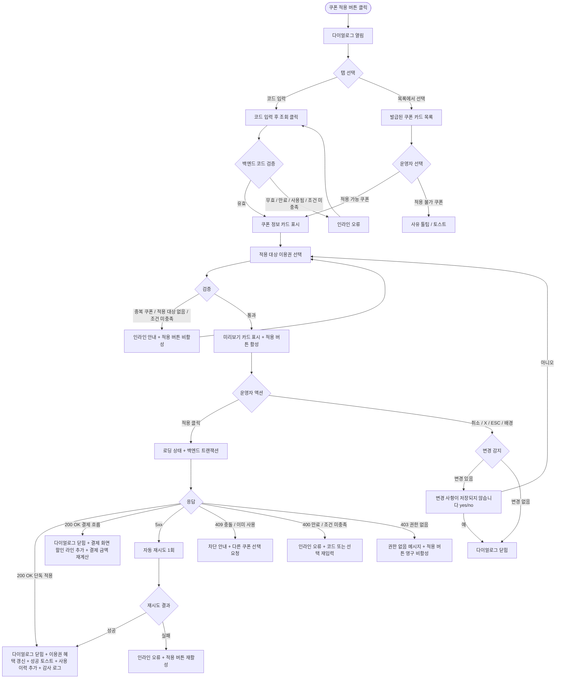

# DLG-M020 쿠폰 적용 다이얼로그

## 1. 다이얼로그 메타 정보

이 문서는 쿠폰 적용 다이얼로그에 대한 자기완결형 요구사항 정의서입니다. 다른 문서를 함께 보지 않아도 이 한 장만으로 다이얼로그의 호출 트리거, 화면 구성, 입력과 검증, 적용 후 동작, 권한별 처리, 예외 흐름, 그리고 쿠폰 발급·적용 운영 정책까지 모두 이해하고 구현할 수 있도록 작성합니다.

| 항목 | 값 |
|---|---|
| 작성일 | 2026-05-22 |
| 버전 | v1.0 |
| 상태 | 최신 통합본 반영 (정합화 완료) |
| 도메인 | D02 회원관리 |
| 다이얼로그 ID | DLG-M020 |
| 다이얼로그명 | 쿠폰 적용 |
| 다이얼로그 유형 | 입력·선택 통합 다이얼로그 (Form + Pick Modal) |
| 우선순위 | P1 (출시 필수) |
| 기능코드 | MBR-02 (회원 상세) |
| 계약코드 | MBR-02 |
| 부모 화면 | SCR-M004 회원 상세 페이지 (이용권 탭, 결제 탭) |
| 호출 트리거 | 이용권 탭 또는 결제 탭의 "쿠폰 적용" 버튼 클릭, 또는 결제 진행 중 쿠폰 적용 단계 |
| 후속 다이얼로그 | 없음 |

## 2. 다이얼로그 목적

쿠폰 적용 다이얼로그는 회원에게 발급되었거나 외부에서 받은 쿠폰을 회원 계정에 수동으로 등록하고 즉시 사용 가능한 상태로 만드는 작업을 처리합니다. 회원이 이벤트·프로모션·VIP 혜택 등으로 받은 쿠폰을 운영자가 직접 계정에 연동하거나, 결제 진행 중에 적용 가능한 쿠폰을 선택해 할인을 반영하는 두 가지 운영 흐름을 모두 지원합니다. 쿠폰은 할인율·할인액·무료 추가 기간·무료 추가 횟수 같은 다양한 혜택 유형이 있고, 각 유형에 따라 적용 후 회원의 이용권 또는 결제 금액에 미치는 영향이 달라집니다.

운영 현장에서 이 다이얼로그는 다음 상황에서 사용됩니다. 첫째, 회원이 종이 쿠폰이나 SMS·이메일로 받은 쿠폰 코드를 운영자에게 보여주며 적용을 요청하는 경우입니다. 둘째, 본사 프로모션으로 일괄 발급된 쿠폰 중 회원에게 적용 가능한 쿠폰을 운영자가 목록에서 선택해 적용하는 경우입니다. 셋째, 결제 진행 중에 회원이 보유한 쿠폰을 선택해 결제 금액을 할인하는 경우입니다. 어떤 경우든 운영자는 적용 가능 여부와 혜택 내용을 명확히 확인한 후 적용을 확정해야 합니다.

## 3. 호출 트리거와 진입 경로

이 다이얼로그는 회원 상세 페이지(SCR-M004)의 이용권 탭 또는 결제 탭에 있는 "쿠폰 적용" 버튼을 누를 때, 또는 결제 등록 흐름의 쿠폰 적용 단계에서 호출됩니다. 결제 흐름에서 호출된 경우 다이얼로그는 결제 진행 화면 위에 모달로 겹쳐 표시되며, 적용 결과가 결제 금액 계산에 즉시 반영됩니다.

진입 경로는 두 가지이며, 어느 경로로 진입했는지에 따라 다이얼로그 안의 일부 영역이 달라집니다. 첫 번째 경로(이용권/결제 탭의 쿠폰 적용 버튼)는 회원 계정에 쿠폰을 등록하기만 하고 즉시 결제에 반영하지는 않는 흐름이며, 두 번째 경로(결제 흐름 중 쿠폰 적용 단계)는 등록과 동시에 현재 진행 중인 결제에 할인을 반영하는 흐름입니다. 두 흐름은 같은 다이얼로그를 사용하지만, 두 번째 흐름에서는 "이 결제에 즉시 적용" 체크박스가 기본 체크되어 있고 적용 가능한 이용권 선택 영역이 자동으로 현재 결제 대상 이용권으로 고정됩니다.

## 4. UI 구성과 영역별 동작

다이얼로그는 화면 중앙에 가로 600px 내외(모바일 92%)로 표시됩니다. 배경은 반투명 검정 오버레이로 덮입니다.

헤더에는 "쿠폰 적용" 제목과 우측 X 버튼, 그리고 보조 라벨로 대상 회원명이 함께 표시됩니다. 본문 상단에는 적용 방식 탭이 가로로 배치됩니다. 두 가지 탭이 있고 좌측은 "코드 입력", 우측은 "목록에서 선택"입니다. 기본 활성 탭은 "코드 입력"이며, 운영자가 탭을 클릭해 전환할 수 있습니다. 두 탭 간 전환 시 입력값과 선택값은 각자 독립적으로 유지됩니다.

"코드 입력" 탭에는 가로 폭이 넓은 텍스트 입력 필드(쿠폰 코드)와 우측 "조회" 버튼이 한 줄로 배치됩니다. 운영자가 종이 쿠폰이나 SMS로 받은 코드를 입력한 뒤 조회 버튼을 누르면 백엔드에서 코드 유효성을 검증하고, 유효한 경우 그 아래에 쿠폰 정보 카드가 자동 표시됩니다. 무효한 코드의 경우 입력 필드 아래에 인라인 오류("유효하지 않은 쿠폰 코드입니다", "이미 사용된 쿠폰입니다", "만료된 쿠폰입니다", "이 회원에게 적용할 수 없는 쿠폰입니다" 등)가 표시됩니다.

"목록에서 선택" 탭에는 해당 회원에게 발급되었거나 적용 가능한 쿠폰의 카드 목록이 세로로 배치됩니다. 각 카드에는 쿠폰명, 혜택 요약(예: "10% 할인", "20,000원 할인", "1개월 무료 연장"), 유효기간(YYYY-MM-DD까지), 사용 조건(최소 결제 금액·적용 가능 이용권 종류), 발급일이 표시됩니다. 카드 우측에는 라디오 또는 체크 아이콘이 있어 한 번에 하나의 쿠폰만 선택할 수 있습니다. 적용 불가 쿠폰(만료·이미 사용·조건 미충족)은 회색 톤으로 비활성 표시되고 마우스 오버 시 사유 툴팁이 나타납니다.

선택된 쿠폰의 정보 카드는 두 탭 공통으로 본문 중앙에 강조 표시됩니다. 카드 안에는 쿠폰명, 할인 유형(정률·정액·기간·횟수 추가), 할인 값(예: 15%, 30,000원, 30일, 5회), 적용 가능 이용권 종류 또는 결제 범위, 사용 조건, 유효기간이 라벨과 값의 쌍으로 표시됩니다.

쿠폰 카드 아래에는 "적용 대상 이용권 선택" 영역이 있습니다. 회원이 활성 이용권을 두 개 이상 보유하고 있고, 쿠폰의 적용 범위가 특정 이용권에 한정된 경우 운영자는 어느 이용권에 적용할지 직접 선택해야 합니다. 활성 이용권이 하나뿐이거나, 결제 흐름에서 호출되어 결제 대상 이용권이 이미 정해진 경우에는 이 영역이 자동으로 그 이용권으로 고정되어 표시됩니다. 적용 대상이 없는 쿠폰(예: 회원 단위 쿠폰)에서는 이 영역이 숨겨집니다.

가장 아래에는 적용 미리보기 카드가 있어, 쿠폰 적용 전과 후의 효과 차이를 보여줍니다. 결제 흐름에서 호출된 경우 결제 금액 변화(예: "60,000원 → 51,000원, 9,000원 할인")가 표시되고, 이용권 등록 흐름에서 호출된 경우 적용 효과(예: "현재 이용권에 30일 추가됩니다")가 표시됩니다.

다이얼로그 하단에는 액션 버튼이 우측 정렬로 배치됩니다. 좌측 취소 버튼, 우측 "적용" 버튼이 놓이며, 적용 버튼은 쿠폰이 선택되고 적용 대상이 확정된 경우에만 활성화됩니다.

## 5. 입력 필드와 검증

쿠폰 코드 입력은 영문 대소문자·숫자·하이픈만 허용하며, 8자 이상 24자 이하의 길이여야 합니다. 코드는 대소문자 무관하게 처리되며, 입력 시 자동으로 대문자로 변환되어 표시됩니다.

쿠폰 코드 조회 시 백엔드는 다음을 검증합니다. 첫째, 코드가 발급 테이블에 존재하는가. 둘째, 발급된 쿠폰이 만료되지 않았는가. 셋째, 이미 사용된 쿠폰이 아닌가. 넷째, 회원 단위 쿠폰의 경우 발급 대상 회원이 현재 회원과 일치하는가. 다섯째, 사용 조건(최소 결제 금액·적용 가능 이용권·일정 회원 등급 이상 등)을 충족하는가. 한 가지라도 실패하면 인라인 오류가 표시되며 적용이 차단됩니다.

목록에서 선택하는 경우에도 동일한 검증이 클라이언트 측에서 미리 표시되어, 적용 불가 쿠폰은 비활성 카드로 노출됩니다. 운영자가 비활성 카드를 클릭하면 사유 안내가 토스트로 표시되고 선택은 일어나지 않습니다.

적용 대상 이용권 선택은 쿠폰의 적용 범위가 특정 이용권에 한정된 경우 필수입니다. 회원이 적용 가능한 활성 이용권을 보유하지 않은 경우 "이 쿠폰을 적용할 수 있는 이용권이 없어요. 새 이용권을 구매하거나 다른 쿠폰을 선택해 주세요" 안내가 표시되고 적용 버튼이 비활성화됩니다.

같은 결제·이용권에 대한 쿠폰 중복 적용은 기본 금지되며, 이미 다른 쿠폰이 적용된 이용권을 적용 대상으로 선택하면 "이미 다른 쿠폰이 적용되어 있어요. 기존 쿠폰을 먼저 해제해 주세요"라는 안내가 표시되고 적용이 차단됩니다.

## 6. 적용/취소 후 동작

적용 버튼을 누르면 다이얼로그가 로딩 상태로 전환되어 두 버튼이 비활성화되고 적용 버튼 안에 스피너가 표시됩니다. 백엔드에는 쿠폰 코드 또는 ID, 회원 ID, 적용 대상 이용권 ID(있는 경우), 결제 컨텍스트(결제 흐름인 경우 결제 세션 ID), 운영자 ID가 포함된 요청이 전송됩니다.

백엔드는 트랜잭션으로 쿠폰의 상태를 USED로 UPDATE하고, 회원의 쿠폰 사용 이력 테이블에 사용 이벤트(action=USE_COUPON, coupon_id, member_id, ticket_id, applied_amount, actor_id, timestamp)를 INSERT합니다. 결제 흐름에서 호출된 경우에는 결제 세션의 할인 항목에도 쿠폰 적용 결과가 추가되어, 결제 화면의 금액 계산이 즉시 갱신됩니다.

200 OK 응답을 받으면 다이얼로그가 닫히고, 호출 경로에 따라 다음과 같이 동작합니다. 이용권 탭에서 호출된 경우, 적용 대상 이용권 행의 만료일 또는 잔여 횟수가 쿠폰 혜택만큼 즉시 갱신됩니다(기간·횟수 추가 쿠폰). 결제 탭에서 호출된 경우, 쿠폰 사용 이력 영역에 새 기록이 추가됩니다. 결제 흐름에서 호출된 경우, 결제 화면의 할인 항목 라인에 쿠폰 정보와 할인액이 표시되고 총 결제 금액이 재계산됩니다.

성공 토스트는 "쿠폰을 적용했어요"이며 5초 동안 표시됩니다.

취소 버튼·X·ESC·배경 클릭으로 닫을 때 쿠폰 선택 또는 코드 입력이 있는 경우 "변경 사항이 저장되지 않습니다. 닫으시겠습니까?" yes/no 확인이 표시됩니다. 결제 흐름에서 닫는 경우에는 쿠폰 미적용으로 결제 화면으로 돌아가며, 결제 금액은 쿠폰 할인 전 값을 유지합니다.

## 7. 부모 화면 갱신과 후속 처리

이용권 탭에서 적용한 경우, 해당 이용권 행에 쿠폰 적용 배지가 표시되고 만료일·잔여 횟수가 갱신됩니다. 기간 추가 쿠폰의 경우 만료일이 늘어나고, 횟수 추가 쿠폰의 경우 잔여 횟수가 늘어납니다.

결제 탭에서 적용한 경우, 쿠폰 사용 이력 목록에 새 기록이 추가됩니다.

결제 흐름에서 적용한 경우, 결제 화면의 할인 라인에 쿠폰 정보(쿠폰명, 할인액)가 추가되고 총 결제 금액이 재계산됩니다. 결제 완료 시점에 쿠폰 사용이 최종 확정되며, 결제가 취소·실패하면 쿠폰의 USED 상태가 자동으로 ISSUED로 복귀되어 다시 사용 가능 상태가 됩니다.

회원 상세 상단의 운영 포커스 영역에 회원이 보유한 쿠폰 수가 표시되는 경우, 그 카운트가 자동으로 차감됩니다.

감사 로그(SCR-097)에 actor_id, member_id, coupon_id, ticket_id(있는 경우), applied_amount, action=USE_COUPON, timestamp가 비동기로 기록되어 5초 안에 조회 가능합니다.

본사 통합 모드에서 본사 발급 쿠폰을 적용한 경우, 본사 쿠폰 사용 통계 화면에도 다음 배치 시점에 사용 이력이 반영됩니다.

## 8. 권한별 처리

쿠폰 적용은 회원에게 혜택을 제공하는 운영 행위이므로 권한별 가능 범위가 분리됩니다.

superAdmin, primary, Owner(지점장), 매니저(manager)는 모든 종류의 쿠폰을 자기 권한 범위 회원에게 적용할 수 있습니다.

FC(fc), 스태프(staff), 프런트(front)는 결제 흐름에서의 쿠폰 적용만 가능합니다. 결제 외 단독 적용(이용권 탭의 쿠폰 적용 버튼)은 보이지 않거나 비활성 표시됩니다. 이는 쿠폰을 결제와 무관하게 임의 적용하는 권한을 일반 운영자에게는 허용하지 않는 정책의 결과입니다.

트레이너(trainer), 읽기 전용(readonly)은 쿠폰 적용 권한이 없어 부모 화면의 쿠폰 적용 버튼이 보이지 않습니다.

본사 발급 쿠폰 중 고할인 쿠폰(50% 이상 또는 50만원 이상)의 적용은 owner 이상 권한자만 처리할 수 있으며, 매니저가 시도 시 적용 버튼 위에 "고할인 쿠폰 적용은 Owner(지점장) 승인이 필요합니다" 안내가 표시되고 버튼이 비활성화됩니다.

직접 API 호출 시도 시 백엔드가 403을 반환하며 변경은 일어나지 않습니다. 권한 부족 이벤트는 모두 감사 로그에 기록됩니다.

## 9. 토스트와 알림

적용 성공 시 우측 상단에 녹색 토스트("쿠폰을 적용했어요")가 5초 표시됩니다. 토스트 클릭 시 쿠폰 사용 이력 영역으로 페이지 내부 앵커 스크롤이 일어납니다.

적용 실패 시 사유별 빨강 토스트가 표시됩니다. "유효하지 않은 쿠폰이에요"(400), "이미 사용된 쿠폰이에요"(409), "만료된 쿠폰이에요"(400), "권한이 없어요"(403), "네트워크 오류가 발생했어요"(5xx) 형태입니다.

쿠폰 코드 조회 결과가 무효일 때 입력 필드 아래에 인라인 오류가 표시되고 조회 버튼만 다시 활성화됩니다.

## 10. 예외 처리

네트워크 오류(5xx, timeout) 발생 시 다이얼로그 안에 인라인 오류가 표시되고 적용 버튼이 다시 활성화됩니다. 자동 재시도 1회 후에도 실패하면 운영자가 수동 재시도해야 합니다.

동시 사용 충돌(409)이 발생하면 "다른 운영자가 같은 쿠폰을 이미 적용했어요"라는 메시지가 표시됩니다. 같은 쿠폰을 동시에 두 번 적용하려고 하면 후행 요청이 차단됩니다.

쿠폰이 그 사이에 만료된 경우 "쿠폰이 만료되었어요. 다른 쿠폰을 선택해 주세요" 메시지가 표시되며, 코드 입력 또는 목록 선택을 다시 해야 합니다.

쿠폰 적용 조건이 그 사이에 무효해진 경우(예: 적용 대상 이용권이 환불 처리됨) "적용 대상 이용권이 변경되었어요. 다른 이용권을 선택하거나 다이얼로그를 새로고침해 주세요" 메시지가 표시됩니다.

회원이 그 사이에 탈퇴·삭제 처리된 경우 "회원 정보가 변경되었어요. 회원 상세를 새로고침해 주세요" 메시지가 표시됩니다.

권한 부족(401·403) 응답 시 권한 없음 메시지가 표시되고 적용 버튼이 영구 비활성화됩니다.

결제 흐름에서 적용했지만 결제가 최종 실패한 경우, 쿠폰 사용 상태는 자동으로 ISSUED로 복귀되어 다시 사용 가능합니다. 이 복귀는 결제 도메인에서 트리거하며, 다이얼로그 자체는 결제 결과를 직접 알지 못합니다.

## 11. 다이얼로그 생명주기

## 12. 관련 운영 정책

쿠폰은 발급 시점에 코드 또는 ID가 생성되어 회원 단위 또는 다회용으로 운영됩니다. 회원 단위 쿠폰은 발급 대상 회원에게만 적용 가능하며, 다회용 쿠폰은 정해진 사용 횟수 안에서 누구든 코드를 입력해 사용할 수 있습니다. 어느 유형이든 사용 이력은 회원·운영자·쿠폰별로 모두 기록됩니다.

쿠폰 중복 적용 금지는 기본 정책입니다. 같은 이용권 또는 같은 결제에 두 개 이상의 쿠폰을 동시에 적용하면 할인 효과의 누적 계산이 복잡해지고 회원 간 형평성 문제가 생기기 때문에, 한 번에 하나의 쿠폰만 적용되도록 시스템 차원에서 차단됩니다. 운영자가 다른 쿠폰을 적용하려면 기존 쿠폰을 먼저 해제해야 하며, 해제 흐름은 별도 화면(쿠폰 이력에서 취소 액션)에서 처리됩니다.

고할인 쿠폰(50% 이상 또는 50만원 이상)의 적용은 owner 이상 권한자만 처리할 수 있습니다. 매니저가 큰 할인을 임의로 적용해 매출 손실이 발생하는 사고를 막기 위한 정책이며, 운영 책임 단계를 한 단계 높여 신중한 처리를 강제합니다.

결제 흐름에서 적용된 쿠폰은 결제 완료 시점에 최종 확정되며, 결제가 취소·실패하면 자동으로 ISSUED 상태로 복귀됩니다. 이는 결제 실패로 쿠폰만 소진되는 회원 피해를 막기 위한 정책이며, 결제 도메인이 트리거를 보내 쿠폰 도메인에서 복귀를 처리합니다. 복귀 처리는 결제 실패 응답 후 30초 이내에 보장됩니다.

본사 발급 쿠폰은 본사 통합 사용 통계로 집계되며, 각 지점의 쿠폰 사용 빈도와 할인 규모를 본사가 모니터링합니다. 비정상적으로 잦은 고할인 적용이 일어나는 지점에는 본사가 별도 가이드를 제공하거나 권한 정책을 강화할 수 있습니다.

기간 추가·횟수 추가 쿠폰은 현재 보유 이용권의 만료일·잔여 횟수에 직접 가산되며, 가산 후 만료일은 자동으로 만료 알림 배치(NFR-05)의 갱신 대상으로 등록됩니다. 즉, 쿠폰 적용 후 다음 새벽 3시 만료 알림 배치가 새 만료일 기준으로 D-30·D-7·D-Day 알림 일정을 다시 잡습니다.

쿠폰 적용 이벤트는 모두 감사 로그에 비동기로 5초 안에 기록되며, 쿠폰 도용·권한 우회·중복 적용 시도 등을 사후 감지할 수 있게 합니다.

회원 앱(있는 경우)에서는 회원이 직접 자신의 쿠폰 목록을 보고 결제 시 적용할 수 있습니다. 그러나 외부에서 받은 종이 쿠폰이나 SMS 쿠폰 코드 등록은 운영자만 처리할 수 있으며, 회원이 직접 코드를 입력해 자신의 계정에 등록하는 흐름은 별도 정책(회원 셀프 등록 허용 여부)에 따라 결정됩니다. 이 다이얼로그는 운영자 측 적용만 다룹니다.

쿠폰 발급·만료·사용 정책의 세부 비즈니스 규칙(발급 한도·사용 횟수·유효기간 정책)은 결제·프로모션 도메인에서 정의되며, 이 다이얼로그는 그 정책을 그대로 따릅니다. 쿠폰 정책 변경 시 이 다이얼로그의 검증 로직과 안내 문구도 함께 갱신되어야 합니다.
