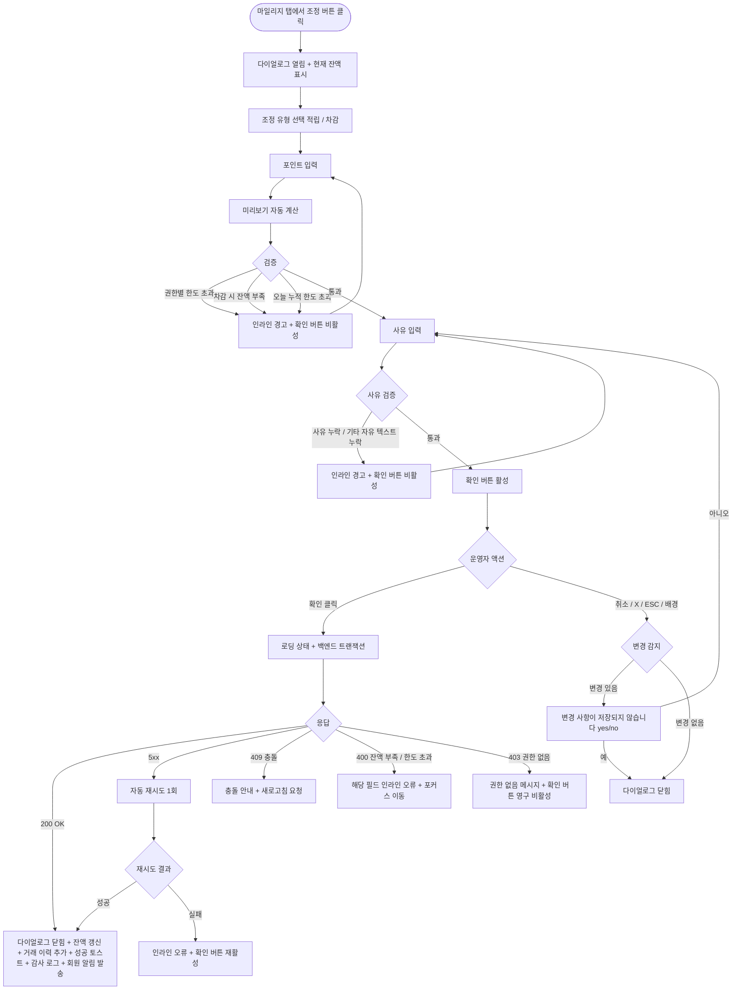

# DLG-M021 마일리지 조정 다이얼로그

## 1. 다이얼로그 메타 정보

이 문서는 마일리지 조정 다이얼로그에 대한 자기완결형 요구사항 정의서입니다. 다른 문서를 함께 보지 않아도 이 한 장만으로 다이얼로그의 호출 트리거, 화면 구성, 입력과 검증, 조정 후 동작, 권한별 처리, 예외 흐름, 그리고 마일리지 운영 정책까지 모두 이해하고 구현할 수 있도록 작성합니다.

| 항목 | 값 |
|---|---|
| 작성일 | 2026-05-22 |
| 버전 | v1.0 |
| 상태 | 최신 통합본 반영 (정합화 완료) |
| 도메인 | D02 회원관리 |
| 다이얼로그 ID | DLG-M021 |
| 다이얼로그명 | 마일리지 조정 |
| 다이얼로그 유형 | 입력형 폼 다이얼로그 (Form Modal) |
| 우선순위 | P1 (출시 필수) |
| 기능코드 | MBR-02 (회원 상세) |
| 계약코드 | MBR-02 |
| 부모 화면 | SCR-M004 회원 상세 페이지 (마일리지 탭) |
| 호출 트리거 | 회원 상세의 마일리지 탭에서 "마일리지 조정" 버튼 클릭 |
| 후속 다이얼로그 | 없음 |

## 2. 다이얼로그 목적

마일리지 조정 다이얼로그는 회원의 마일리지 잔액을 운영자가 수동으로 늘리거나 줄이는 작업을 처리합니다. 자동 적립·차감 흐름(결제 적립, 환불 차감, 출석 보너스 등)으로 처리되지 않는 예외 케이스를 수동으로 보정하기 위한 운영 도구이며, 시스템 오류로 인한 잘못된 적립을 되돌리거나, 이벤트·프로모션 보상을 직접 지급하거나, 회원 클레임에 대한 보상을 처리하는 등 다양한 상황에서 사용됩니다.

운영 현장에서 이 다이얼로그는 다음 상황에서 자주 사용됩니다. 첫째, 결제 시스템 오류로 마일리지가 적립되지 않은 회원에게 사후 보정 적립을 하는 경우입니다. 둘째, 시설 점검·강사 휴직 등 센터 사정으로 회원에게 보상 마일리지를 지급하는 경우입니다. 셋째, 회원의 클레임이나 불만에 대한 보상으로 매니저가 마일리지를 지급하는 경우입니다. 넷째, 잘못 적립된 마일리지를 차감하거나, 부정 사용이 의심되는 마일리지를 회수하는 경우입니다. 어떤 경우든 운영자는 조정 유형·포인트·사유를 명확히 입력해야 하며, 모든 조정은 감사 로그에 기록되어 사후 추적이 가능합니다.

## 3. 호출 트리거와 진입 경로

이 다이얼로그는 회원 상세 페이지(SCR-M004)의 마일리지 탭에서 "마일리지 조정" 버튼을 누를 때 열립니다. 마일리지 탭이 존재하지 않거나 비활성화된 회원(미등록·탈퇴·삭제)에서는 이 버튼이 보이지 않거나 클릭이 차단됩니다.

진입 경로는 단일하며, 다른 화면이나 다른 탭에서는 이 다이얼로그가 호출되지 않습니다. 마일리지 적립·차감의 자동 흐름(결제·출석)은 이 다이얼로그를 거치지 않고 백엔드 이벤트로 처리되며, 이 다이얼로그는 오직 수동 조정만을 위한 입구입니다.

## 4. UI 구성과 영역별 동작

다이얼로그는 화면 중앙에 가로 480px 내외(모바일 92%)로 표시됩니다. 배경은 반투명 검정 오버레이로 덮입니다.

헤더에는 "마일리지 조정" 제목과 우측 X 버튼이 있고, 보조 라벨로 대상 회원명이 함께 표시됩니다(예: "마일리지 조정 - 김길동 회원").

본문 상단에는 현재 마일리지 잔액 카드가 배치됩니다. 카드 안에는 잔액(예: "12,500P")이 크게 표시되고, 그 아래에 최근 변동(예: "최근 적립: 2026-05-20 +500P")이 작은 글씨로 함께 표시됩니다. 이 카드는 읽기 전용입니다.

그 아래에는 조정 유형 선택 영역이 있습니다. 두 가지 옵션을 라디오로 고를 수 있고, 좌측은 "적립", 우측은 "차감"입니다. 적립은 잔액을 늘리는 방향, 차감은 줄이는 방향이며 시각적으로 좌측은 녹색 톤, 우측은 빨강 톤으로 구분되어 운영자가 잘못된 방향을 선택하지 않도록 합니다.

다음으로 조정 포인트 입력 필드가 있습니다. 숫자 입력 필드와 단위 라벨(P)이 한 줄로 배치되며, 양의 정수만 입력할 수 있습니다. 입력값에 따라 그 아래에 미리보기가 자동 계산되어 표시됩니다. 적립 선택 시 "조정 후 예상 잔액: 13,000P (현재 12,500P + 500P)" 형태로, 차감 선택 시 "조정 후 예상 잔액: 12,000P (현재 12,500P - 500P)" 형태로 표시됩니다.

차감 시 잔액 부족으로 음수가 되는 경우 미리보기 라인이 빨강으로 표시되고 "마일리지 잔액이 부족합니다. 차감 가능 최대치: 12,500P" 안내가 함께 표시됩니다. 음수 잔액은 정책상 허용되지 않으므로 입력값을 줄이거나, 잔액 0으로 만드는 선까지만 차감 가능합니다.

미리보기 아래에는 조정 사유 입력 영역이 있습니다. 사유는 필수 입력이며, 두 가지 입력 방식을 탭으로 전환할 수 있습니다. 첫 번째 탭은 사전 정의된 사유 목록 선택(시스템 오류 보정 적립, 시스템 오류 보정 차감, 이벤트 보상, 클레임 보상, 부정 사용 회수, 본사 정책 일괄 지급, 기타)이고, 두 번째 탭은 자유 텍스트 입력(최대 200자)입니다. "기타" 선택 시 자유 텍스트 입력이 필수로 강제됩니다.

다이얼로그 하단에는 액션 버튼이 우측 정렬로 배치됩니다. 좌측 취소 버튼, 우측 "확인" 버튼이 놓이고, 확인 버튼은 모든 필수 입력(조정 유형, 포인트, 사유)이 통과 상태일 때만 활성화됩니다. 적립인지 차감인지에 따라 확인 버튼의 색상이 녹색·빨강 톤으로 자동 변경되어 운영자가 적용 직전에도 방향성을 인지할 수 있게 합니다.

## 5. 입력 필드와 검증

조정 유형은 필수 선택이며, 적립과 차감 중 정확히 하나를 골라야 합니다.

조정 포인트는 필수 입력이며, 1 이상의 양의 정수만 허용됩니다. 0·음수·소수점은 입력 단계에서 차단됩니다. 1회 조정 최대값은 운영자 권한에 따라 다르며, 매니저는 1만P 이내, Owner(지점장)은 10만P 이내, 슈퍼관리자는 무제한입니다. 권한별 한도를 초과하는 값 입력 시 입력 필드 아래에 인라인 경고와 함께 확인 버튼이 비활성화됩니다.

차감 시 조정 포인트는 현재 잔액을 초과할 수 없습니다. 초과 입력 시 미리보기에 음수 잔액이 표시되고 "잔액 부족" 인라인 오류와 함께 확인 버튼이 비활성화됩니다.

조정 사유는 필수 입력입니다. 사전 정의 사유 선택 또는 자유 텍스트 입력 중 하나가 반드시 채워져야 하며, 자유 텍스트는 5자 이상이어야 합니다. "기타" 선택 시 자유 텍스트가 필수입니다.

같은 회원에 대한 같은 날 두 번째 조정은 권한과 무관하게 사유에 "중복 조정 - 사유" 명시적 입력이 강제됩니다. 이는 운영 실수로 같은 회원에게 중복 보상을 지급하는 사고를 사전 차단하기 위한 정책입니다.

부정 사용 회수 사유로 차감할 때는 차감 직후 회원에게 알림 발송 여부 체크박스가 추가로 노출되어, 운영자가 회수 사실을 회원에게 알릴지 결정할 수 있습니다.

## 6. 조정/취소 후 동작

확인 버튼을 누르면 다이얼로그가 로딩 상태로 전환되어 두 버튼이 비활성화되고 확인 버튼 안에 스피너가 표시됩니다. 백엔드에는 회원 ID, 조정 유형(적립/차감), 포인트, 사유, 운영자 ID, 알림 발송 여부가 포함된 요청이 전송됩니다.

백엔드는 트랜잭션으로 회원 마일리지 잔액을 UPDATE하고, 마일리지 거래 이력 테이블에 거래 이벤트(action=ADJUST_MILEAGE, type=earn/deduct, amount, before_balance, after_balance, reason, actor_id, timestamp)를 INSERT하며, 감사 로그에도 동일 이벤트를 비동기로 기록합니다.

200 OK 응답을 받으면 다이얼로그가 닫히고, 부모 화면(마일리지 탭)의 잔액 표시가 새 값으로 즉시 갱신됩니다. 거래 이력 목록의 첫 번째 행에 새 조정 기록이 추가됩니다. 우측 상단에 "마일리지를 [조정 유형] 처리했어요. 현재 잔액: N P" 형태의 성공 토스트가 5초 표시됩니다. 토스트 색상은 적립이면 녹색, 차감이면 주황 톤입니다.

회원에게 알림 발송이 체크된 경우, 회원 앱(있는 경우)에 푸시 알림이 발송되어 회원이 조정 사실을 즉시 인지할 수 있습니다.

취소 버튼·X·ESC·배경 클릭으로 닫을 때 입력값이 일부라도 있는 경우 "변경 사항이 저장되지 않습니다. 닫으시겠습니까?" yes/no 확인이 표시됩니다. 예 선택 시 다이얼로그가 닫히고 변경은 일어나지 않습니다.

## 7. 부모 화면 갱신과 후속 처리

마일리지 탭의 잔액 카드가 새 값으로 즉시 갱신되고, 거래 이력 목록의 가장 위에 새 조정 기록이 추가됩니다. 거래 이력 행에는 운영자명, 조정 유형, 포인트, 사유, 시각이 표시되어 다른 운영자가 조회 시에도 누가 어떤 사유로 조정했는지 즉시 확인 가능합니다.

회원 상세 상단의 운영 포커스 영역에 마일리지 잔액이 요약 표시되는 경우, 그 숫자도 새 값으로 갱신됩니다.

감사 로그(SCR-097)에 actor_id, member_id, type, amount, before_balance, after_balance, reason, action=ADJUST_MILEAGE, timestamp가 비동기로 기록되어 5초 안에 조회 가능합니다.

본사 통합 모드에서는 본사 마일리지 통계 화면에 다음 배치 시점에 조정 이벤트가 반영됩니다. 본사는 지점별 마일리지 조정 빈도와 사유 분포를 모니터링하며, 비정상적으로 잦은 조정이 일어나는 지점에 별도 가이드를 제공할 수 있습니다.

## 8. 권한별 처리

마일리지 조정은 회원 자산에 직접 영향을 주므로 권한별 한도가 분리됩니다.

superAdmin, primary는 모든 지점 회원의 마일리지를 무제한 조정할 수 있습니다. 본사 통합 모드에서 일괄 조정도 가능하지만 별도 화면(본사 운영 도구)에서 처리되며 이 다이얼로그의 책임 범위는 아닙니다.

Owner(지점장)은 자기 지점 회원의 마일리지를 1회 최대 10만P까지 조정할 수 있습니다. 10만P 초과는 슈퍼관리자 승인이 필요합니다.

매니저(manager)는 자기 지점 회원의 마일리지를 1회 최대 1만P까지 조정할 수 있습니다. 1만P 초과 입력 시 확인 버튼이 비활성화됩니다.

FC(fc), 트레이너(trainer), 스태프(staff), 프런트(front), 읽기 전용(readonly)은 마일리지 조정 권한이 없어 부모 화면의 마일리지 조정 버튼이 보이지 않습니다. 직접 API 호출 시도 시 백엔드가 403을 반환하며 변경은 일어나지 않습니다.

같은 회원에 대한 같은 날 누적 조정 한도는 권한과 무관하게 매일 자정에 리셋되며, 누적 한도는 매니저 3만P, Owner(지점장) 30만P로 설정되어 있습니다. 한도 초과 시 확인 버튼이 비활성화되고 "오늘 누적 조정 한도를 초과했어요. 내일 다시 시도하거나 상위 권한자에게 요청해 주세요" 안내가 표시됩니다.

권한 부족 이벤트는 모두 감사 로그에 기록되어, 권한 우회 시도가 사후 추적 가능합니다.

## 9. 토스트와 알림

조정 성공 시 우측 상단에 성공 토스트가 5초 표시됩니다. 적립의 경우 녹색 톤으로 "마일리지를 N P 적립했어요. 현재 잔액: N P", 차감의 경우 주황 톤으로 "마일리지를 N P 차감했어요. 현재 잔액: N P" 문구입니다. 토스트 클릭 시 거래 이력 영역으로 페이지 내부 앵커 스크롤이 일어납니다.

조정 실패 시 사유별 빨강 토스트가 표시됩니다. "권한이 없어요"(403), "잔액 부족이에요"(400), "다른 운영자가 동시에 처리했어요"(409), "네트워크 오류가 발생했어요"(5xx) 형태입니다.

회원 알림 발송 체크 시 알림 발송 결과(성공·실패)는 별도 토스트로 안내되지 않고, 발송 결과는 회원 알림 이력에서 확인할 수 있습니다.

## 10. 예외 처리

네트워크 오류(5xx, timeout) 발생 시 다이얼로그 안에 인라인 오류가 표시되고 확인 버튼이 다시 활성화됩니다. 자동 재시도 1회 후에도 실패하면 운영자가 수동 재시도해야 합니다.

동시 편집 충돌(409)이 발생하면 "다른 운영자가 같은 회원의 마일리지를 동시에 조정했어요. 다이얼로그를 닫고 다시 시도해 주세요" 메시지가 표시됩니다. 잔액 변경이 있는 동안 후행 요청은 자동 차단됩니다.

잔액 부족(400)이 응답되면 "차감 가능 잔액을 초과했어요. 입력값을 줄이거나 조정 유형을 다시 확인해 주세요" 메시지가 표시되고 운영자는 입력을 수정해야 합니다.

회원이 그 사이에 탈퇴·삭제 처리된 경우 "회원 정보가 변경되었어요. 회원 상세를 새로고침해 주세요" 메시지가 표시됩니다.

권한 부족(401·403) 응답 시 권한 없음 메시지가 표시되고 확인 버튼이 영구 비활성화됩니다.

오늘 누적 조정 한도 초과(권한별 누적 한도) 시 백엔드가 400 또는 429로 응답하며, "오늘 누적 한도를 초과했어요" 안내가 표시되고 변경이 차단됩니다.

마일리지 운영 정책 자체가 비활성화된 센터(마일리지 미사용)의 회원에 대한 조정 시도는 부모 화면에서 버튼이 보이지 않아 다이얼로그가 호출되지 않습니다. 다만 직접 URL 또는 API 시도 시 백엔드가 400으로 차단합니다.

## 11. 다이얼로그 생명주기

## 12. 관련 운영 정책

마일리지는 회원의 자산이며, 운영자가 임의로 조정하면 회원과의 신뢰 관계에 직접 영향을 줍니다. 따라서 모든 조정은 사유가 필수이고, 모든 조정 이벤트는 감사 로그에 5초 안에 기록되어 사후 추적이 가능합니다. 조정 이력은 회원 상세의 거래 이력 영역에서도 운영자 누구나 조회할 수 있어, 다른 운영자가 어떤 결정으로 조정을 했는지 투명하게 공유됩니다.

권한별 1회 조정 한도(매니저 1만P, Owner(지점장) 10만P, 슈퍼관리자 무제한)와 같은 날 누적 한도(매니저 3만P, Owner(지점장) 30만P)는 운영 실수와 부정 지급 위험을 단계적으로 제어하기 위한 정책입니다. 매니저가 회원 한 명에게 일방적으로 큰 마일리지를 지급할 수 없도록 한도가 분리되며, 더 큰 조정은 상위 권한자의 명시적 결정이 필요하다는 운영 구조를 시스템에 반영합니다.

음수 잔액 금지는 마일리지 운영의 기본 정책입니다. 차감 후 잔액이 음수가 되는 처리는 차단되며, 부정 사용 회수 등의 사유로 큰 차감이 필요한 경우 잔액 0까지만 차감되고 추가 차감이 필요하면 별도 처리(예: 결제 환불 또는 다른 방식)로 대체됩니다.

같은 날 두 번째 조정 시 사유 명시 정책은 운영자가 실수로 같은 회원에게 같은 보상을 두 번 지급하는 사고를 막기 위함입니다. 시스템이 두 번째 조정 자체를 막지는 않지만, 사유를 더 명확히 입력하도록 강제해 사후 감사가 용이하도록 합니다.

자동 적립·차감(결제 적립, 환불 차감, 출석 보너스)은 이 다이얼로그를 거치지 않고 백엔드 이벤트로 처리됩니다. 이는 자동 흐름이 인간 개입 없이 정확히 처리되어야 한다는 정책의 결과이며, 운영자가 자동 흐름을 사후 수정해야 할 경우에만 이 다이얼로그를 통해 수동 보정합니다.

본사 통합 모드에서는 본사가 모든 지점의 마일리지 조정 빈도와 사유 분포를 모니터링합니다. 비정상적으로 잦은 조정(예: 같은 사유로 한 지점에서 같은 주에 100건 이상)이 발생하는 경우 본사가 해당 지점에 가이드를 제공하거나 권한 정책을 강화할 수 있습니다.

회원 앱(있는 경우)에서는 회원이 자신의 마일리지 잔액과 거래 이력을 직접 조회할 수 있으며, 운영자의 수동 조정도 거래 이력에 표시됩니다. 단 사유는 운영자만 볼 수 있는 사유와 회원에게도 노출되는 사유가 구분되며, 회원에게는 "운영자 조정"이라는 일반 라벨만 표시되고 구체적 사유는 노출되지 않을 수 있습니다(센터 정책에 따라).

마일리지 만료 정책(예: 적립 후 1년 미사용 시 자동 소멸)이 운영되는 센터에서는 수동 조정 마일리지도 동일한 만료 정책을 따릅니다. 이 다이얼로그는 만료 처리에는 관여하지 않으며, 만료 처리는 별도 배치(매일 새벽 또는 매월 1일)에서 자동 수행됩니다.

부정 사용 회수 차감의 경우 회수 사유와 회수 포인트가 회원 상세의 메모 영역에도 자동으로 기록되어, 다른 운영자가 회원 정보를 조회할 때 회수 이력을 즉시 인지할 수 있게 합니다. 이는 같은 회원에 대한 반복 부정 사용을 사전 차단하기 위한 정책의 결과입니다.
