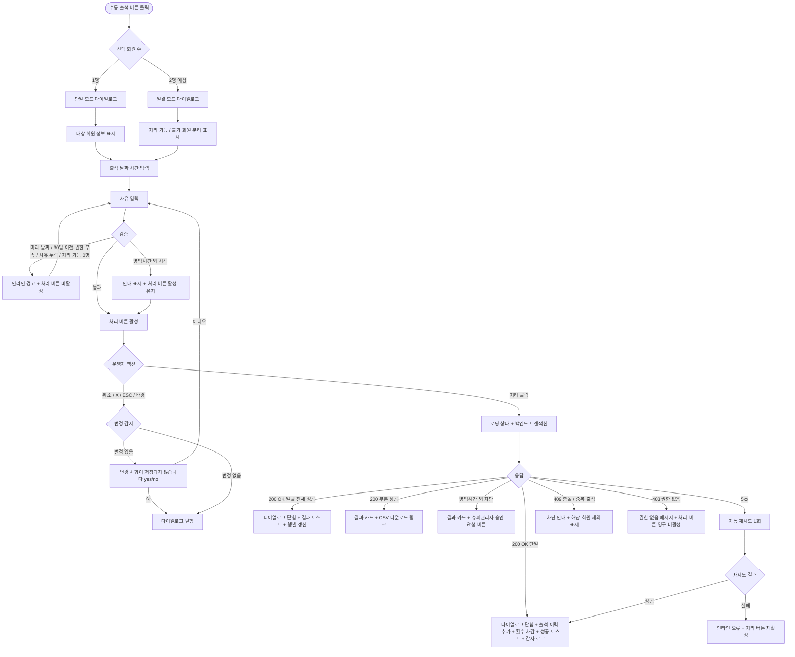

# DLG-M022 수동 출석 다이얼로그

## 1. 다이얼로그 메타 정보

이 문서는 수동 출석 다이얼로그에 대한 자기완결형 요구사항 정의서입니다. 다른 문서를 함께 보지 않아도 이 한 장만으로 다이얼로그의 호출 트리거, 화면 구성, 입력과 검증, 처리 후 동작, 권한별 처리, 예외 흐름, 그리고 출석 운영 정책까지 모두 이해하고 구현할 수 있도록 작성합니다.

| 항목 | 값 |
|---|---|
| 작성일 | 2026-05-22 |
| 버전 | v1.0 |
| 상태 | 최신 통합본 반영 (정합화 완료) |
| 도메인 | D02 회원관리 |
| 다이얼로그 ID | DLG-M022 |
| 다이얼로그명 | 수동 출석 |
| 다이얼로그 유형 | 입력형 폼 다이얼로그 (Form Modal) - 단일/일괄 동시 지원 |
| 우선순위 | P0 (출시 필수) |
| 기능코드 | MBR-01 (회원 목록), MBR-02 (회원 상세) |
| 계약코드 | MBR-01, MBR-02 |
| 부모 화면 | SCR-M001 회원 목록, SCR-M004 회원 상세 (출석 탭) |
| 호출 트리거 | 회원 목록 액션 큐/일괄 작업 바의 출석 처리, 회원 상세 출석 탭의 수동 출석 버튼 |
| 후속 다이얼로그 | 없음 |

## 2. 다이얼로그 목적

수동 출석 다이얼로그는 키오스크나 QR 체크인 같은 자동 출석 흐름이 동작하지 않는 상황에서 운영자가 직접 회원의 출석을 기록하는 모달입니다. 출석은 회원의 이용 횟수 차감과 운영 통계(방문일·재방문 주기·이탈 위험 판정)의 기반이므로, 자동 흐름이 실패해도 운영자가 즉시 수동으로 보정할 수 있어야 합니다. 단일 회원의 출석을 처리하는 단일 모드와, 회원 목록에서 여러 명을 선택해 한 번에 출석을 처리하는 일괄 모드를 모두 지원합니다.

운영 현장에서 이 다이얼로그는 다음 상황에서 자주 사용됩니다. 첫째, 키오스크나 QR 체크인 기기가 오류·고장·네트워크 장애로 작동하지 않는 시점에 회원이 정상 방문한 사실을 운영자가 직접 기록하는 경우입니다. 둘째, 회원이 출석을 잊고 그냥 운동한 뒤 다음 방문 시 운영자에게 사후 출석 처리를 요청하는 경우입니다. 셋째, PT 수업이 정상 진행되었지만 트레이너가 횟수 차감을 잊었거나 시스템에 기록되지 않은 경우 PT 횟수 차감을 위해 출석 처리하는 경우입니다. 넷째, 운영 캠페인이나 이벤트로 단체 출석을 일괄 처리하는 경우입니다. 어떤 경우든 운영자는 출석 날짜·시간·사유를 명확히 입력해야 합니다.

## 3. 호출 트리거와 진입 경로

이 다이얼로그는 두 가지 부모 화면에서 호출됩니다. 첫 번째는 회원 목록 페이지(SCR-M001)이며, 운영 포커스 바의 액션 큐 "수동 출석 실행" 버튼, 또는 일괄 작업 바의 "출석 처리" 버튼을 누르면 호출됩니다. 한 명만 선택한 상태에서 호출하면 단일 모드, 두 명 이상 선택한 상태에서 호출하면 일괄 모드로 다이얼로그가 열립니다. 두 번째는 회원 상세 페이지(SCR-M004)의 출석 탭에서 "수동 출석" 버튼을 누르는 경우이며, 항상 단일 모드로 열립니다.

본사 통합 모드에서 호출된 일괄 출석은 회원들의 실제 소속 지점이 분산되어 있을 수 있으므로, 처리 시 각 회원의 `branchId` 기준으로 출석 기록이 분산 저장됩니다. 이 지점 분산은 다이얼로그가 직접 처리하는 것이 아니라 백엔드가 처리하고, 다이얼로그는 결과 요약에서 지점별 그루핑 결과를 표시합니다.

## 4. UI 구성과 영역별 동작

다이얼로그는 화면 중앙에 가로 520px 내외(모바일 92%)로 표시됩니다. 일괄 모드에서는 회원 목록 영역 때문에 세로가 더 길어질 수 있으며 최대 높이는 화면의 80%까지 늘어나고 내부 스크롤이 활성화됩니다.

헤더에는 "수동 출석 처리" 제목과 우측 X 버튼이 있습니다. 단일 모드에서는 보조 라벨로 대상 회원명이 표시되고(예: "수동 출석 - 김길동 회원"), 일괄 모드에서는 "N명 일괄 처리"가 표시됩니다.

본문 상단에는 대상 회원 정보 카드가 표시됩니다. 단일 모드에서는 회원명·회원번호·현재 활성 이용권명·이용권 잔여(기간 또는 횟수)가 한 줄로 표시됩니다. 일괄 모드에서는 "N명 선택됨"이라는 요약과 함께 처리 가능 회원의 이름이 앞쪽 3~5명까지 표시되고 그 뒤에 "외 N명" 표기가 붙습니다. 일괄 모드에서 처리 불가 회원이 섞여 있는 경우(탈퇴·삭제·미등록·이용권 만료·홀딩 중), 처리 가능 회원과 처리 불가 회원이 분리되어 표시되고 처리 불가 회원은 사유(예: "탈퇴 회원", "이용권 만료")와 함께 나열됩니다.

그 아래에는 출석 날짜 선택 필드가 있습니다. 기본값은 오늘이며 캘린더 피커로 과거 날짜도 선택 가능합니다. 미래 날짜는 선택할 수 없습니다. 일괄 모드에서도 출석 날짜는 모든 회원에게 동일하게 적용됩니다.

날짜 아래에는 출석 시간 입력 필드가 있습니다. 기본값은 현재 시각이며 시·분 단위로 직접 입력하거나 위·아래 화살표로 조정할 수 있습니다. 영업시간(센터 운영시간) 외 시각을 입력하면 입력 필드 아래에 "영업시간 외 시각입니다. 처리 시 본사 정책으로 차단될 수 있어요" 안내가 표시되지만, 입력 자체는 가능합니다.

다음으로 처리 사유 입력 영역이 있습니다. 사유는 필수 입력이며, 두 가지 입력 방식을 탭으로 전환할 수 있습니다. 첫 번째 탭은 사전 정의된 사유 목록(키오스크 오류, 기기 고장, 회원 요청 사후 처리, 본사 정책 예외, 단체 이벤트, 기타)이고, 두 번째 탭은 자유 텍스트(최대 200자)입니다. "기타" 선택 시 자유 텍스트가 필수로 강제됩니다.

일괄 모드에는 추가로 결과 요약 미리보기 영역이 있어, 처리 시 발생할 횟수 차감의 총합(예: "PT 횟수 차감 총 7회"), 차감되지 않을 회원 수(기간권 회원), 영업시간 외 처리가 필요한 회원 수가 사전 표시됩니다.

다이얼로그 하단에는 액션 버튼이 우측 정렬로 배치됩니다. 좌측 취소 버튼, 우측 "처리" 버튼이 놓이고, 처리 버튼은 모든 필수 입력(날짜·시간·사유)이 통과 상태일 때 활성화됩니다. 일괄 모드에서 처리 가능 회원이 0명인 경우 처리 버튼이 비활성화됩니다.

## 5. 입력 필드와 검증

출석 날짜는 오늘 또는 과거 날짜만 선택 가능하며, 최대 30일 이전까지 선택할 수 있습니다. 30일 이전 날짜는 슈퍼관리자만 선택할 수 있고, 다른 권한자는 캘린더 피커에서 30일 이전 날짜가 비활성화 상태로 표시됩니다.

출석 시간은 00:00~23:59 범위의 유효한 시각이어야 합니다. 영업시간(센터 운영시간 설정에 따름) 외 시각은 인라인 경고가 표시되지만 입력 자체는 가능하며, 처리 시점에 본사 정책 차단이 발생할 수 있습니다.

처리 사유는 필수 입력이며 5자 이상이어야 합니다. 사전 정의 목록 또는 자유 텍스트 중 하나가 채워져야 하며, "기타" 선택 시 자유 텍스트가 5자 이상이어야 합니다.

단일 모드에서는 대상 회원이 다음 조건을 만족해야 처리 가능합니다. 회원 상태가 활성·만료예정·만료임박 중 하나여야 하고, 유효한 활성 이용권을 보유해야 합니다. 만료·홀딩·정지·탈퇴·삭제·미등록 회원은 처리 불가이며, 다이얼로그 호출 시점에 이미 차단되어 처리 버튼이 비활성화됩니다.

일괄 모드에서는 처리 가능 회원만 자동 필터링되어 처리되고, 처리 불가 회원은 변경 없이 그대로 남습니다. 처리 가능 회원이 한 명도 없는 경우 처리 버튼이 비활성화되고 "처리 가능한 회원이 없어요. 선택을 다시 확인해 주세요" 안내가 표시됩니다.

같은 회원에 대한 같은 날짜의 중복 출석은 차단되어, 이미 그 날짜에 출석 기록이 있는 회원을 다시 처리하려고 하면 "이미 출석 기록이 있어요. 같은 날짜에 중복 처리는 차단됩니다" 안내가 표시되고 그 회원은 처리에서 제외됩니다. 일괄 모드에서도 동일하게 적용됩니다.

## 6. 처리/취소 후 동작

처리 버튼을 누르면 다이얼로그가 로딩 상태로 전환되어 두 버튼이 비활성화되고 처리 버튼 안에 스피너가 표시됩니다. 백엔드에는 회원 ID 또는 회원 ID 배열, 출석 날짜, 출석 시간, 사유, 운영자 ID가 포함된 요청이 전송됩니다.

백엔드는 트랜잭션으로 출석 기록 테이블에 INSERT하고, 횟수권 회원의 경우 이용권의 잔여 횟수를 자동으로 1회 차감합니다(PT 수업이나 횟수 기반 이용권인 경우). 본사 통합 모드 일괄 처리의 경우 각 회원의 실제 `branchId` 기준으로 출석 기록이 분산 저장되어, 회원이 다른 지점 소속이라도 그 지점의 출석 통계에 정확히 반영됩니다. 감사 로그에도 동일 이벤트(action=MANUAL_CHECKIN, member_ids, target_date, target_time, reason, actor_id, timestamp)가 비동기로 기록됩니다.

200 OK 응답을 받으면 다이얼로그가 닫히고, 단일 모드에서는 부모 화면의 출석 탭(또는 회원 목록 행의 최근 방문일 컬럼)이 새 출석으로 즉시 갱신됩니다. 일괄 모드에서는 결과 카드("성공 N건 / 실패 M건")가 화면 중앙 하단에 머무르며, 실패 회원이 있는 경우 실패 사유와 실패 회원 목록 CSV 다운로드 링크가 함께 제공됩니다. 성공 토스트는 단일 모드에서는 "출석을 처리했어요", 일괄 모드에서는 "N명의 출석을 처리했어요" 형태입니다.

영업시간 외 처리가 본사 정책으로 차단된 경우, 처리 결과 카드에 "영업시간 외 처리는 본사 정책으로 차단되었습니다. 슈퍼관리자 승인 요청을 보내시겠습니까?" 안내와 함께 "승인 요청" 버튼이 표시됩니다. 운영자가 승인 요청을 보내면 슈퍼관리자에게 알림이 발송되고, 슈퍼관리자가 승인하면 강제 처리가 수행됩니다.

취소 버튼·X·ESC·배경 클릭으로 닫을 때 입력값이 일부라도 있는 경우 "변경 사항이 저장되지 않습니다. 닫으시겠습니까?" yes/no 확인이 표시됩니다.

## 7. 부모 화면 갱신과 후속 처리

회원 목록(SCR-M001)에서 호출된 경우, 처리된 회원 행의 "최근 방문일" 컬럼이 새 출석 날짜로 즉시 갱신됩니다. 일괄 모드에서는 처리 성공 회원 행 모두가 갱신되며, 선택된 체크박스는 자동 해제됩니다. 만료임박 상태였던 회원이 출석으로 이탈위험에서 벗어나는 경우, 세그먼트 라벨은 다음 D+1 배치(MBR-EXT-04, 매일 새벽 4시) 시점에 재계산되어 갱신됩니다(실시간 라벨 변경은 아님).

회원 상세(SCR-M004)에서 호출된 경우, 출석 탭의 출석 이력 목록 상단에 새 기록이 추가되고, 회원 상세 상단의 "최근 방문일" 영역도 갱신됩니다. 활성 이용권이 횟수권인 경우 잔여 횟수가 1 감소한 값으로 표시됩니다.

본사 통합 모드 일괄 처리의 경우 결과 카드에 지점별 그루핑이 표시되어, 어느 지점에 몇 명의 출석이 분산 저장되었는지 운영자가 즉시 파악할 수 있습니다.

감사 로그(SCR-097)에 actor_id, member_ids, target_date, target_time, reason, action=MANUAL_CHECKIN, timestamp가 비동기로 기록되어 5초 안에 조회 가능합니다.

회원의 출석 패턴 통계(주간 방문 횟수·평균 방문 간격 등)는 다음 배치 시점에 재계산되어 회원 상세의 통계 영역에 반영됩니다.

## 8. 권한별 처리

수동 출석은 상대적으로 자주 발생하는 운영 작업이므로 일반 운영자도 가능하지만, 일부 권한 제한이 있습니다.

슈퍼관리자(superAdmin), 본사 최고관리자(primary), 센터장(owner), 매니저(manager), FC(fc), 스태프(staff), 프런트(front)는 모두 자기 권한 범위 회원의 수동 출석을 처리할 수 있습니다.

트레이너(trainer)는 본인이 담당하는 회원만 처리 가능하며, 다른 회원의 출석 처리 권한은 없습니다.

읽기 전용(readonly)은 수동 출석 권한이 없어 부모 화면의 수동 출석 버튼이 보이지 않습니다.

30일 이전 날짜의 출석 처리는 슈퍼관리자만 가능합니다. 다른 권한자가 30일 이전 날짜를 선택하려고 하면 캘린더 피커에서 그 날짜가 비활성화됩니다.

영업시간 외 처리는 슈퍼관리자만 직접 처리할 수 있고, 다른 권한자는 영업시간 외 처리 시도 시 슈퍼관리자 승인 요청을 거쳐야 강제 처리됩니다. 이 정책은 출석 통계의 신뢰성과 운영 시간 관리를 위한 결과입니다.

일괄 모드에서 100명을 초과하는 일괄 처리는 매니저 이상 권한자만 가능하며, FC·스태프·프런트는 1회 50명 이내로 제한됩니다.

권한 부족 이벤트는 모두 감사 로그에 기록됩니다.

## 9. 토스트와 알림

처리 성공 시 우측 상단에 녹색 토스트가 5초 표시됩니다. 단일 모드에서는 "출석을 처리했어요", 일괄 모드에서는 "N명의 출석을 처리했어요" 문구입니다.

일괄 모드 부분 실패 시 결과 카드 형태로 화면 중앙 하단에 머무르며, "성공 N건 / 실패 M건" 표시와 실패 사유별 분류, 실패 회원 목록 CSV 다운로드 링크가 함께 제공됩니다. 결과 카드는 사용자가 닫기 버튼을 누를 때까지 사라지지 않습니다.

처리 실패 시 사유별 빨강 토스트가 표시됩니다. "권한이 없어요"(403), "이미 출석 기록이 있어요"(409), "영업시간 외 처리는 본사 정책으로 차단되었어요"(403/400), "네트워크 오류가 발생했어요"(5xx) 형태입니다.

영업시간 외 처리 차단 시 결과 카드 안에 "승인 요청" 버튼이 노출되어, 운영자가 슈퍼관리자에게 즉시 요청을 보낼 수 있습니다.

## 10. 예외 처리

네트워크 오류(5xx, timeout) 발생 시 다이얼로그 안에 인라인 오류가 표시되고 처리 버튼이 다시 활성화됩니다. 자동 재시도 1회 후에도 실패하면 운영자가 수동 재시도해야 합니다.

동시 처리 충돌(409)이 발생하면 "다른 운영자가 같은 회원의 출석을 처리했어요"라는 메시지가 표시됩니다. 같은 회원에 대한 같은 날짜의 중복 출석은 차단됩니다.

영업시간 외 처리는 본사 정책으로 차단되며, 슈퍼관리자 승인 후 강제 처리가 가능합니다. 승인 요청 버튼을 누르면 슈퍼관리자 알림 센터에 즉시 알림이 발송되고, 승인 후 운영자가 다이얼로그를 다시 열어 처리합니다.

회원이 그 사이에 탈퇴·삭제·홀딩 처리된 경우 일괄 모드에서는 해당 회원만 처리에서 제외되어 실패 목록에 포함되고, 다른 회원은 정상 처리됩니다. 단일 모드에서는 "회원 정보가 변경되었어요. 회원 상세를 새로고침해 주세요" 메시지가 표시되고 처리가 차단됩니다.

이용권이 그 사이에 만료된 회원은 일괄 처리에서 자동 제외되며 실패 사유에 "이용권 만료"로 표시됩니다.

권한 부족(401·403) 응답 시 권한 없음 메시지가 표시되고 처리 버튼이 영구 비활성화됩니다.

본사 통합 모드에서 RLS 위반이 감지되면 해당 회원은 일괄 처리에서 자동 제외되고, 슈퍼관리자에게 디버그 로그를 통해 누락 사실이 전달됩니다.

## 11. 다이얼로그 생명주기

## 12. 관련 운영 정책

수동 출석은 자동 출석 흐름의 실패나 예외 상황을 보정하기 위한 안전망입니다. 따라서 일반 운영자도 가능하지만 모든 처리는 감사 로그에 기록되고, 처리 사유가 필수로 남도록 강제됩니다. 사후에 운영 행위의 적절성을 추적할 수 있어야 한다는 정책의 결과입니다.

영업시간 외 처리는 본사 정책으로 기본 차단되며, 슈퍼관리자 승인 후 강제 처리가 가능합니다. 이는 영업시간 외에 회원이 실제로 운동했을 가능성이 낮으며, 운영자가 임의로 출석 통계를 부풀리는 사고를 막기 위한 정책입니다. 영업시간 외 처리가 필요한 정당한 사유(예: 특별 이벤트, 시설 점검 후 보상 출석)가 있는 경우에만 슈퍼관리자 승인이 부여됩니다.

30일 이전 날짜 출석 처리는 슈퍼관리자만 가능합니다. 매우 오래된 출석을 사후에 추가하는 행위는 운영 통계와 회원 이력의 신뢰성에 영향을 주므로, 본사 차원의 검토가 필요합니다. 일반적으로는 30일 이내의 출석만 수동 처리되며, 그 이전은 별도 협의가 필요합니다.

같은 날짜 중복 출석은 차단됩니다. 출석은 회원당 하루 한 건만 인정되며, 같은 날에 두 번 입장한 경우에도 출석 기록은 하나만 남깁니다. 횟수권의 경우에도 같은 날에는 1회 차감만 인정되며, PT 수업이 하루에 두 번 진행된 경우(드문 케이스)에는 별도 처리(예: 트레이너가 PT 횟수 차감을 별도 액션으로 수행)로 다룹니다.

본사 통합 모드 일괄 출석 처리 시 회원의 실제 `branchId` 기준으로 출석이 분산 저장되는 정책은 출석 통계의 지점별 정합성을 보장합니다. 회원이 다른 지점 소속인데 본사 통합 모드에서 일괄 처리되었더라도, 그 출석은 회원의 실제 지점에 귀속되어야 한다는 원칙입니다.

횟수권 회원의 출석 시 자동 횟수 차감 정책은 운영자가 별도로 차감 액션을 수행하지 않아도 출석이 곧 횟수 차감이 되도록 합니다. 기간권 회원은 출석으로 인한 차감이 없으며, 출석은 단지 운영 통계에만 영향을 줍니다. 횟수권과 기간권이 혼합된 복합 이용권의 경우 정책에 따라 횟수가 차감되는 항목과 차감되지 않는 항목이 구분됩니다.

세그먼트 라벨(이탈위험·만료임박 등)은 D+1 배치(매일 새벽 4시)로 재계산되므로, 출석 처리 직후 회원의 세그먼트가 즉시 변경되지는 않습니다. 운영자는 다음 날 아침에 세그먼트 변경을 확인할 수 있습니다. 단, 회원 상세 페이지에서는 실시간 재판정 결과가 표시되므로 즉시 최신 세그먼트를 확인할 수 있습니다.

만료 알림 배치(NFR-05, 매일 새벽 3시)는 출석 직후의 회원 상태를 다음 배치 시점에 반영합니다. 활성에서 만료임박으로 가까워진 회원이 출석으로 활성 상태를 유지하더라도, D-7·D-Day 알림은 만료일 기준으로 계속 발송됩니다.

모든 수동 출석은 감사 로그에 비동기로 5초 안에 기록되며, 권한 우회나 부정 처리 사고를 사후 추적할 수 있게 합니다. 본사는 감사 로그를 통해 지점별 수동 출석 빈도와 사유 분포를 모니터링하며, 비정상적으로 잦은 영업시간 외 승인 요청이나 30일 이전 처리가 발생하는 지점에는 별도 가이드를 제공합니다.

회원 앱(있는 경우)에서는 회원이 자신의 출석 이력을 직접 조회할 수 있으며, 운영자의 수동 출석도 출석 이력에 표시됩니다. 회원 입장에서는 출석 처리 주체가 자동인지 수동인지 구분 없이 동일하게 표시되어 운영의 내부 흐름이 회원에게 노출되지 않습니다.
