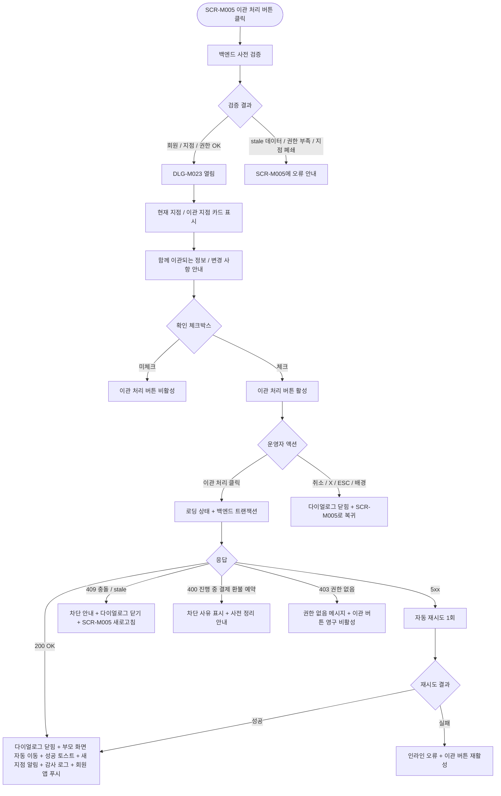

# DLG-M023 이관 확인 다이얼로그

## 1. 다이얼로그 메타 정보

이 문서는 이관 확인 다이얼로그에 대한 자기완결형 요구사항 정의서입니다. 다른 문서를 함께 보지 않아도 이 한 장만으로 다이얼로그의 호출 트리거, 화면 구성, 입력과 검증, 확인 후 동작, 권한별 처리, 예외 흐름, 그리고 회원 이관 운영 정책까지 모두 이해하고 구현할 수 있도록 작성합니다.

| 항목 | 값 |
|---|---|
| 작성일 | 2026-05-22 |
| 버전 | v1.0 |
| 상태 | 최신 통합본 반영 (정합화 완료) |
| 도메인 | D02 회원관리 |
| 다이얼로그 ID | DLG-M023 |
| 다이얼로그명 | 이관 확인 |
| 다이얼로그 유형 | 확인형 차단 다이얼로그 (Confirm Modal) |
| 우선순위 | P0 (출시 필수) |
| 기능코드 | MBR-01 (회원 목록), MBR-02 (회원 상세), MBR-ADV-02 (회원 이관) |
| 계약코드 | MBR-01, MBR-02, MBR-ADV-02 |
| 부모 화면 | SCR-M005 회원 이관 페이지 |
| 호출 트리거 | SCR-M005 회원 이관 페이지에서 이관 대상 지점 선택을 마치고 "이관 처리" 버튼 클릭 |
| 후속 다이얼로그 | 없음 (성공 시 부모 화면이 회원 목록 또는 회원 상세로 자동 이동) |

## 2. 다이얼로그 목적

이관 확인 다이얼로그는 회원을 현재 지점에서 다른 지점으로 옮기기 직전에 운영자의 최종 의사를 다시 한 번 확인받는 안전 장치입니다. 회원 이관은 단순한 정보 이전이 아니라, 회원의 소속·매출 귀속·관리 권한·세그먼트·통계 모두가 새 지점으로 옮겨지는 큰 운영 행위이며, 한 번 처리되면 원 지점은 더 이상 그 회원을 자기 지점 회원 목록에서 볼 수 없게 됩니다. 따라서 운영자가 이관 대상 지점을 선택한 직후, 실제 처리가 시작되기 직전에 함께 옮겨지는 정보와 변경되는 사항을 다시 한 번 명확히 보여주고 확인을 받는 단계가 필요합니다.

운영 현장에서 이 다이얼로그는 다음 상황에서 호출됩니다. 첫째, 회원의 이사로 다른 지점으로 옮겨야 하는 경우입니다. 둘째, 본사가 지점 간 회원 재배치를 결정해 운영자가 그 결정을 시스템에 반영하는 경우입니다. 셋째, 한 회원이 여러 지점을 자주 이용해 주 이용 지점을 공식 소속 지점으로 재지정하는 경우입니다. 어떤 경우든 운영자는 이 다이얼로그에서 확인 버튼을 누르기 전에 함께 옮겨지는 정보(이용권·출석 이력·체성분·결제 이력 등)와 이관 후 변경 사항(원 지점에서 더 이상 관리 불가·이관 지점에 알림 발송 등)을 다시 한 번 검토해야 합니다.

## 3. 호출 트리거와 진입 경로

이 다이얼로그는 회원 이관 페이지(SCR-M005)에서 운영자가 이관 대상 지점을 선택한 후 "이관 처리" 버튼을 누르는 시점에 호출됩니다. 회원 이관 페이지는 회원 목록(SCR-M001)의 행 이관 버튼 또는 일괄 작업 바의 지점이관 버튼, 또는 회원 상세(SCR-M004) 기본정보 탭의 지점 이관 버튼을 거쳐 진입한 화면이며, 이 다이얼로그는 그 화면의 최종 확정 단계에서만 열립니다.

이 다이얼로그가 회원 목록이나 회원 상세에서 직접 단독으로 열리는 일은 없습니다. 회원 목록의 이관 버튼은 우선 SCR-M005로 페이지 이동을 일으키고, 그 화면에서 운영자가 대상 지점을 선택한 다음에야 이 다이얼로그가 호출됩니다. 이 분리는 이관 대상 지점 선택과 최종 확정을 시각적·심리적으로 분리해 운영자가 한 번 더 신중하게 결정하도록 유도하는 의도입니다.

## 4. UI 구성과 영역별 동작

다이얼로그는 화면 중앙에 가로 560px 내외(모바일 92%)로 표시됩니다. 배경은 반투명 검정 오버레이로 덮입니다.

헤더 좌측에는 "지점 이관 확인" 제목과 주의 아이콘이 함께 배치됩니다. 우측에는 X 버튼이 있고 X를 누르면 취소와 동일하게 동작합니다.

본문 상단에는 이관 대상 정보 카드가 배치됩니다. 카드는 두 부분으로 나뉘어 좌측에는 "현재 지점", 우측에는 "이관 지점"이 표시됩니다. 좌측 카드에는 현재 소속 지점명, 지점 코드, 그 지점에서의 등록일이 표시되고, 우측 카드에는 새 지점명과 지점 코드가 표시됩니다. 두 카드 사이에는 큰 화살표 아이콘이 표시되어 이관 방향을 직관적으로 보여줍니다.

지점 카드 아래에는 회원 정보 요약 카드가 있습니다. 카드 안에는 회원명, 회원번호, 연락처(마스킹된 형태), 현재 회원 상태 배지가 표시됩니다.

그 아래에는 "이관 시 함께 이전되는 정보" 영역이 체크리스트 형태로 표시됩니다. 항목은 활성 이용권(개수와 가장 가까운 만료일), 출석 이력(총 건수), 체성분 기록(총 건수), 결제 이력(총 건수), 마일리지 잔액, 상담·메모, 운동 프로그램·평가 이력입니다. 각 항목 우측에는 체크 아이콘이 표시되며, 모든 항목이 자동으로 함께 이관됨을 운영자에게 명확히 알립니다. 이관에서 제외되는 데이터(예: 가족 회원 연결, 별도 운영 라벨)가 있는 경우 별도 섹션 "이관에서 제외되는 정보"에 X 아이콘과 함께 표시됩니다.

다음 섹션은 "이관 후 변경 사항" 안내입니다. 운영자가 인지해야 할 변경 사항이 텍스트 목록으로 나열되며, "원 지점에서 더 이상 이 회원을 회원 목록에서 볼 수 없게 됩니다", "이관 지점 매니저에게 이관 알림이 자동 발송됩니다", "회원 앱(있는 경우)에 지점 변경 알림이 발송될 수 있습니다", "매출 귀속과 통계는 이관 시점 이후로 새 지점에 귀속됩니다", "이용권의 만료일과 잔여 횟수는 그대로 유지됩니다" 같은 항목이 표시됩니다.

가장 아래에는 확인 절차 체크박스("위 변경 사항을 확인했습니다")가 있고, 운영자가 체크해야만 하단의 "이관 처리" 버튼이 활성화됩니다. 이 체크박스는 단일 클릭 토글이며 체크하지 않으면 끝까지 비활성화 상태로 남습니다.

다이얼로그 하단에는 액션 버튼이 우측 정렬로 배치됩니다. 좌측 취소 버튼(보조 스타일), 우측 "이관 처리" 버튼(주요 스타일, 진한 파랑)이 놓입니다.

## 5. 입력 필드와 검증

이 다이얼로그 자체에는 새로 입력하는 필드가 없습니다. 모든 이관 정보(대상 회원, 이관 대상 지점, 이관 사유)는 부모 화면 SCR-M005에서 이미 입력되어 전달된 상태이며, 이 다이얼로그는 그 정보를 표시하고 확인 절차만 진행합니다.

다이얼로그가 열리는 시점에 백엔드는 다음 사전 검증을 수행하고, 결과를 이 다이얼로그에 반영합니다. 첫째, 이관 대상 회원이 여전히 활성·만료예정·만료임박·만료·홀딩 상태인지(탈퇴·삭제 회원은 이관 불가). 둘째, 대상 지점이 존재하고 동일 브랜드 안에 있는지(다른 브랜드 지점으로의 이관은 별도 정책으로 처리). 셋째, 회원이 이관 도중에 다른 운영자에 의해 동시 편집되고 있지 않은지(optimistic lock). 사전 검증에 실패하면 다이얼로그가 열리지 않고 부모 화면 SCR-M005에 "회원 정보가 변경되었습니다. 새로고침해 주세요"라는 stale 데이터 경고가 표시됩니다.

확인 체크박스는 다이얼로그의 유일한 입력이며, 체크하지 않으면 이관 처리 버튼이 비활성화됩니다. 이 체크박스는 운영자가 변경 사항을 명시적으로 인지했다는 운영 절차의 증거이며, 사후 감사 로그에서도 체크 여부가 기록됩니다.

## 6. 확인/취소 후 동작

이관 처리 버튼을 누르면 다이얼로그가 로딩 상태로 전환되어 두 버튼이 비활성화되고 처리 버튼 안에 스피너가 표시됩니다. 백엔드에는 회원 ID, 원 지점 ID, 이관 지점 ID, 이관 사유, 운영자 ID, 확인 체크박스 체크 여부가 포함된 요청이 전송됩니다.

백엔드는 트랜잭션으로 회원의 `branchId`를 새 지점으로 UPDATE하고, 회원에 연결된 모든 자산(이용권·출석 이력·체성분·결제 이력·마일리지·상담·메모·운동 프로그램·평가)의 소속 지점 정보를 새 지점으로 함께 이전합니다. 이관 이력 테이블에는 이관 이벤트(action=TRANSFER_BRANCH, member_id, from_branch, to_branch, reason, actor_id, timestamp)가 INSERT되고, 감사 로그에도 동일 이벤트가 비동기 기록됩니다. 새 지점의 알림 센터(SCR-104)에 "회원 [이관자명]이 [원 지점명]에서 이관되었습니다" 알림이 발송됩니다.

200 OK 응답을 받으면 다이얼로그가 닫히고, 부모 화면 SCR-M005가 회원 목록 또는 회원 상세로 자동 이동합니다(SCR-M005 진입 경로에 따라). 자동 이동된 화면에는 우측 상단에 녹색 토스트("[회원명]을 [지점명]으로 이관했어요")가 5초 동안 표시됩니다.

회원 목록에서 진입한 운영자의 경우 회원 목록의 해당 회원 행이 즉시 사라지거나(자기 지점 뷰), 본사 통합 모드에서는 소속 지점 컬럼이 새 지점으로 갱신됩니다. 회원 상세에서 진입한 운영자의 경우 자기 권한 범위 밖이 되어 회원 목록으로 자동 리다이렉트되며, 본사 권한자는 회원 상세를 계속 볼 수 있습니다.

취소 버튼·X·ESC·배경 클릭으로 닫으면 다이얼로그가 즉시 닫히고 SCR-M005로 돌아갑니다. 이관은 수행되지 않으며 회원의 소속 지점은 변경되지 않습니다. SCR-M005의 이관 대상 지점 선택과 사유 입력 상태는 그대로 유지되어 운영자가 다시 검토할 수 있습니다.

## 7. 부모 화면 갱신과 후속 처리

부모 화면 SCR-M005는 이관 처리 성공 후 자동 닫히면서 진입 경로의 부모 화면(회원 목록 또는 회원 상세)으로 돌아갑니다. 회원 목록에서 진입한 경우 회원 목록으로, 회원 상세에서 진입한 경우 권한에 따라 회원 상세 또는 회원 목록으로 이동합니다.

회원 목록에서는 이관된 회원 행이 즉시 사라지거나 갱신되며, 본사 통합 모드에서는 소속 지점 컬럼이 새 지점으로 표시됩니다. 일괄 이관의 경우(이 다이얼로그는 기본 단일 이관 확인이지만, 일괄 이관 호출 시에는 결과 카드가 표시됨) 결과 카드에 "성공 N건 / 실패 M건"이 표시됩니다.

회원 상세에서 진입한 경우 자기 권한 범위 밖 회원의 상세는 자동으로 닫히고, 운영자에게 "회원이 다른 지점으로 이관되었습니다" 안내와 함께 회원 목록으로 리다이렉트됩니다.

새 지점의 알림 센터(SCR-104)에 이관 알림이 발송되어, 이관 지점 매니저가 즉시 새 회원 도착을 인지하고 환영 메시지나 첫 방문 준비를 할 수 있게 합니다.

감사 로그(SCR-097)에 actor_id, member_id, from_branch, to_branch, reason, action=TRANSFER_BRANCH, timestamp, confirmed_at(체크박스 체크 시각)이 비동기로 기록되어 5초 안에 조회 가능합니다.

회원 앱(있는 경우)에는 회원에게 "소속 지점이 [새 지점명]으로 변경되었습니다" 푸시 알림이 발송되며, 알림 발송 여부는 센터 정책에 따라 결정됩니다. 회원이 새 지점의 출석 시스템에 다음 방문 시 정상적으로 인식되도록 키오스크·QR 시스템의 회원 데이터가 자동 동기화됩니다.

## 8. 권한별 처리

회원 이관은 회원의 소속과 매출 귀속에 영향을 주는 중요한 운영 행위이므로, 권한별 가능 범위가 분리됩니다.

슈퍼관리자(superAdmin), 본사 최고관리자(primary)는 모든 회원의 이관을 처리할 수 있습니다. 본사 통합 모드에서 다른 지점으로의 이관, 일괄 이관, 다른 브랜드로의 이관(별도 정책)이 모두 가능합니다.

Owner(지점장)은 자기 지점 회원을 다른 지점으로 이관할 수 있습니다. 단, 같은 브랜드 내 지점으로만 이관 가능하며 다른 브랜드 지점으로의 이관은 본사 권한자만 처리할 수 있습니다.

매니저(manager)는 자기 지점 회원을 같은 브랜드 내 다른 지점으로 이관할 수 있지만, 1회 1명까지의 단일 이관만 가능합니다. 일괄 이관은 owner 이상 권한이 필요합니다.

FC(fc), 트레이너(trainer), 스태프(staff), 프런트(front), 읽기 전용(readonly)은 회원 이관 권한이 없어 부모 화면에서 이관 버튼이 보이지 않고, 이 다이얼로그도 호출되지 않습니다.

이관 대상 지점의 운영자(매니저 이상)에게는 알림 센터로 새 회원 도착 알림이 발송되어, 이관 자체는 원 지점 운영자가 처리하지만 새 지점도 즉시 인지할 수 있게 합니다.

권한 부족 이벤트는 모두 감사 로그에 기록됩니다.

## 9. 토스트와 알림

확인 성공 시 우측 상단에 녹색 토스트("[회원명]을 [지점명]으로 이관했어요")가 5초 표시됩니다. 토스트 클릭 시 본사 권한자는 새 지점의 회원 목록으로, 일반 운영자는 자기 지점 회원 목록으로 이동합니다.

확인 실패 시 사유별 빨강 토스트가 표시됩니다. "권한이 없어요"(403), "다른 운영자가 동시에 처리했어요"(409), "회원 정보가 변경되었어요"(stale 데이터), "네트워크 오류가 발생했어요"(5xx) 형태입니다.

이관 지점 매니저에게는 알림 센터를 통해 푸시 알림이 발송됩니다. 회원에게도 회원 앱이 있는 경우 푸시 알림이 발송됩니다.

## 10. 예외 처리

네트워크 오류(5xx, timeout) 발생 시 다이얼로그 안에 인라인 오류가 표시되고 이관 처리 버튼이 다시 활성화됩니다. 자동 재시도 1회 후에도 실패하면 운영자가 수동 재시도해야 합니다.

동시 편집 충돌(409)이 발생하면 "다른 운영자가 같은 회원을 동시에 처리했어요. 다이얼로그를 닫고 다시 시도해 주세요" 메시지가 표시됩니다. 회원 정보가 그 사이에 변경된 stale 데이터는 사전 검증 단계에서 차단됩니다.

회원이 그 사이에 탈퇴·삭제·홀딩 처리된 경우 "회원 정보가 변경되었어요. 새로고침해 주세요" 메시지가 표시되며, 다이얼로그를 닫고 SCR-M005로 돌아갑니다.

대상 지점이 그 사이에 폐쇄·정지 처리된 경우 "이관 대상 지점이 더 이상 운영되지 않아요. 다른 지점을 선택해 주세요" 메시지가 표시되며, SCR-M005로 돌아가 운영자가 다른 지점을 선택해야 합니다.

권한 부족(401·403) 응답 시 권한 없음 메시지가 표시되고 이관 처리 버튼이 영구 비활성화됩니다.

본사 통합 모드에서 RLS 위반이 감지되면 빈 응답이 반환되고, 슈퍼관리자에게만 디버그 로그로 누락 사실이 전달됩니다.

회원이 진행 중인 예약·결제·환불을 가지고 있는 경우, 일부 정책 분기점이 발생합니다. 진행 중 결제가 있는 회원은 결제 완료 후 이관 가능, 진행 중 환불이 있는 회원은 환불 완료 후 이관 가능, 예약된 PT 수업이 있는 회원은 트레이너 동의 후 이관 가능 등의 정책이 적용되며, 차단 사유가 다이얼로그 상단에 표시됩니다.

## 11. 다이얼로그 생명주기

## 12. 관련 운영 정책

회원 이관은 회원의 소속·매출 귀속·관리 권한이 모두 새 지점으로 옮겨지는 큰 운영 행위입니다. 이관 시점 이후의 매출과 운영 통계는 새 지점에 귀속되고, 이관 이전의 이력은 원 지점 계정에 그대로 보존되지만 회원의 현재 위치는 새 지점에서만 추적됩니다. 이는 매출 통계의 시점별 정합성과 회원 관리의 단일 소유 원칙을 유지하기 위한 정책입니다.

지점 이관은 매니저 이상 승인 흐름을 둡니다(운영기획서 7항). 매니저는 자기 지점 회원을 같은 브랜드 내 다른 지점으로 이관할 수 있지만, 다른 브랜드 지점이나 일괄 이관은 owner 또는 본사 권한자가 처리합니다. 이는 회원 자산이 운영자 한 명의 결정으로 임의로 옮겨지지 않도록 운영 구조를 시스템에 반영한 결과입니다.

이관 시 함께 이전되는 데이터는 회원의 모든 운영 데이터(이용권·출석·체성분·결제·마일리지·상담·메모·운동 프로그램·평가)이며, 이는 회원의 운영 이력 연속성을 보장하기 위함입니다. 가족 회원 연결 같은 일부 데이터는 이관 정책에 따라 제외될 수 있고, 제외 항목은 다이얼로그에서 명확히 안내됩니다.

이관 후 원 지점에서는 더 이상 회원을 자기 지점 회원 목록에서 볼 수 없습니다. 이는 회원의 단일 소속을 명확히 하기 위한 정책이며, 본사 통합 모드에서는 본사 권한자만 이관 전후의 양쪽 지점에서 회원을 조회할 수 있습니다.

진행 중 결제·환불·예약이 있는 회원의 이관은 정책 분기점이 됩니다. 진행 중 결제·환불이 있는 회원은 정산 완료 후 이관 가능하며, 예약된 PT 수업이 있는 회원은 트레이너 동의 후 이관 가능합니다. 이는 진행 중인 거래나 약속의 매출 귀속이 불분명해지는 것을 방지하기 위한 정책입니다.

이관 알림은 새 지점 매니저에게 알림 센터를 통해 즉시 발송되며, 새 지점이 즉시 환영 메시지 발송이나 첫 방문 준비를 할 수 있도록 운영 흐름이 이어집니다. 회원 앱(있는 경우)에도 푸시 알림이 발송되어 회원이 자기 소속 지점 변경을 인지할 수 있게 합니다. 알림 발송 여부는 센터 정책으로 조정 가능합니다.

이관 이벤트는 감사 로그에 비동기로 5초 안에 기록되며, 확인 체크박스 체크 시각도 함께 기록됩니다. 이는 운영자가 변경 사항을 명시적으로 인지하고 이관을 진행했다는 사후 증거이며, 분쟁 시 운영 행위의 적절성을 추적하는 근거가 됩니다.

본사 통합 모드 일괄 이관은 owner 이상 권한자만 가능하며, 일괄 이관 시 결과 카드에 지점별 그루핑이 표시되어 어느 지점으로 몇 명이 이관되었는지 운영자가 즉시 파악할 수 있습니다. 일괄 이관에서 부분 실패가 발생한 경우 실패 회원 목록 CSV가 제공되어 사후 보완이 가능합니다.

이관과 회원 병합(DLG-M028)은 다른 운영 행위입니다. 이관은 회원의 소속만 옮기고 회원 ID는 그대로이며, 병합은 두 회원 계정을 하나로 합치고 한 쪽 계정을 삭제합니다. 운영자가 두 행위를 혼동하지 않도록 다이얼로그 안내에서 명확히 구분되어 표시됩니다.

세그먼트 라벨과 만료 알림 일정은 이관 후에도 회원 단위로 유지되며, 다음 D+1 배치(매일 새벽 4시)에서 새 지점 기준으로 재계산됩니다. 만료 알림 배치(NFR-05, 매일 새벽 3시)는 이관 후에도 회원의 만료일을 기준으로 정상 동작합니다.
