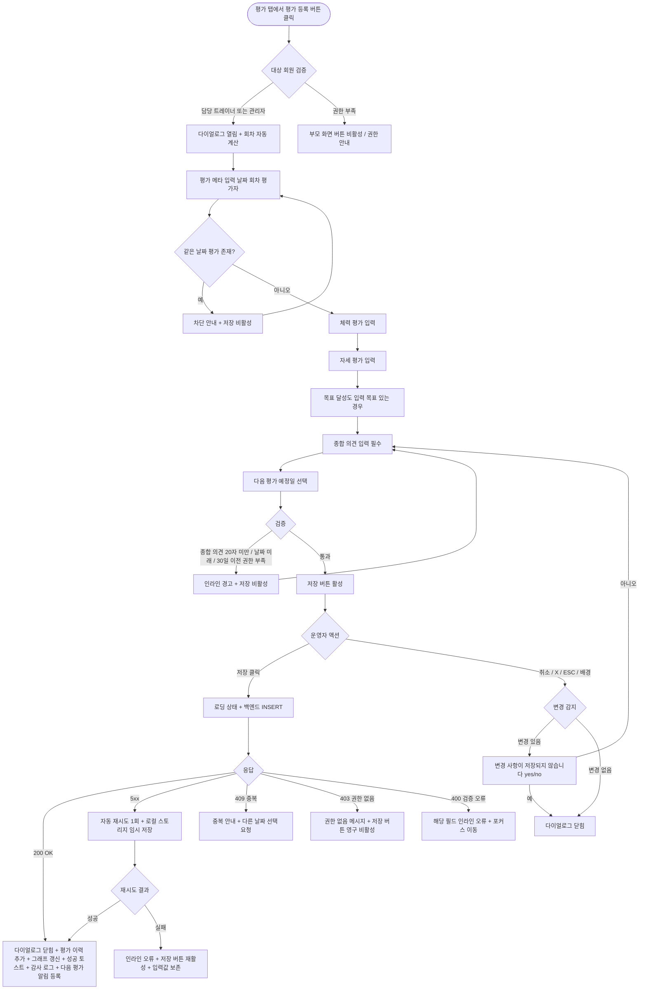

# DLG-M024 종합 평가 등록 다이얼로그

## 1. 다이얼로그 메타 정보

이 문서는 종합 평가 등록 다이얼로그에 대한 자기완결형 요구사항 정의서입니다. 다른 문서를 함께 보지 않아도 이 한 장만으로 다이얼로그의 호출 트리거, 화면 구성, 입력과 검증, 저장 후 동작, 권한별 처리, 예외 흐름, 그리고 회원 평가 운영 정책까지 모두 이해하고 구현할 수 있도록 작성합니다.

| 항목 | 값 |
|---|---|
| 작성일 | 2026-05-22 |
| 버전 | v1.0 |
| 상태 | 최신 통합본 반영 (정합화 완료) |
| 도메인 | D02 회원관리 |
| 다이얼로그 ID | DLG-M024 |
| 다이얼로그명 | 종합 평가 등록 |
| 다이얼로그 유형 | 입력형 폼 다이얼로그 (Form Modal) - 다항목 |
| 우선순위 | P2 (확장 탭, 출시 후 활성화 가능) |
| 기능코드 | MBR-02 (회원 상세) |
| 계약코드 | MBR-02 |
| 부모 화면 | SCR-M004 회원 상세 페이지 (평가 탭) |
| 호출 트리거 | 회원 상세의 평가 탭에서 "평가 등록" 버튼 클릭 |
| 후속 다이얼로그 | 없음 |

## 2. 다이얼로그 목적

종합 평가 등록 다이얼로그는 트레이너가 정기적으로 회원의 체력 수준·자세·목표 달성도를 평가해 기록하는 다이얼로그입니다. 평가는 단순 메모와 다르게 항목별 정량 지표(점수·등급)와 정성 의견(자유 텍스트)이 결합된 구조이며, 시간 경과에 따른 평가 이력을 비교해 회원의 운동 성장 곡선을 추적할 수 있게 합니다. 회원과 트레이너 간 PT 운영의 핵심 산출물 중 하나이며, 회원 재계약과 운동 프로그램 조정의 의사결정 근거가 됩니다.

운영 현장에서 이 다이얼로그는 다음 상황에서 사용됩니다. 첫째, 신규 회원의 초기 평가(베이스라인 측정)를 기록하는 경우입니다. 둘째, 일정 기간(예: 4주·8주·12주)마다 정기 평가를 수행해 진행 상황을 추적하는 경우입니다. 셋째, 회원의 운동 목표를 재조정해야 할 때 현재 상태를 종합 평가로 정리하는 경우입니다. 넷째, 트레이너 변경 시 인계 자료로 종합 평가를 새로 작성하는 경우입니다. 어떤 경우든 트레이너는 각 평가 항목을 진지하게 입력하고 종합 의견을 함께 남깁니다.

## 3. 호출 트리거와 진입 경로

이 다이얼로그는 회원 상세 페이지(SCR-M004)의 평가 탭에서 "평가 등록" 버튼을 누를 때 열립니다. 평가 탭은 회원 상세의 확장 탭 영역에 위치하며, 트레이너·매니저·센터장·슈퍼관리자에게만 보입니다. FC·스태프·프런트·readonly에게는 평가 탭 자체가 보이지 않거나, 보이더라도 평가 등록 버튼이 비활성 상태로 표시됩니다.

진입 경로는 단일하며, 다른 화면에서는 이 다이얼로그가 호출되지 않습니다. 한 회원에 대해 동시에 여러 평가를 등록하는 일괄 모드는 지원하지 않습니다.

## 4. UI 구성과 영역별 동작

다이얼로그는 화면 중앙에 가로 720px 내외(모바일 92%)로 표시됩니다. 평가 항목이 많아 세로가 길어지므로 최대 높이는 화면의 85%까지 늘어나며 내부 스크롤이 활성화됩니다.

헤더에는 "종합 평가 등록" 제목과 우측 X 버튼이 있고, 보조 라벨로 대상 회원명과 평가 회차(예: "김길동 회원 - 3회차 평가")가 함께 표시됩니다.

본문 상단에는 평가 메타 영역이 있습니다. 평가 날짜 선택 필드(기본값 오늘, 캘린더 피커, 미래 날짜 불가), 평가 회차 자동 표시(이전 평가가 있으면 자동 증가, 첫 평가면 1회차), 평가자(현재 로그인한 트레이너명, 읽기 전용)가 한 줄에 배치됩니다.

그 아래에는 체력 평가 섹션이 있습니다. 섹션 안에 평가 항목들이 카드 형태로 나열되며, 각 항목 카드 안에는 항목명, 등급 선택(5단계: 매우 미흡·미흡·보통·우수·매우 우수)과 점수 입력(0~100 정수 중 하나, 선택)이 함께 배치됩니다. 등급과 점수 둘 다 입력하거나 하나만 입력해도 되며, 두 값이 모순될 경우(예: "매우 우수"와 30점) 인라인 경고가 표시되지만 저장은 가능합니다. 기본 항목은 근력, 유연성, 심폐지구력, 코어 안정성, 균형감각이며, 센터 설정에 따라 추가 항목이 노출될 수 있습니다.

자세 평가 섹션도 동일한 카드 구조로 구성되며, 항목은 척추 정렬, 골반 균형, 어깨 균형, 무릎 정렬, 발목 가동성입니다. 각 항목에 정상·경증·중등·중증 4단계 등급을 선택하고 자유 메모를 입력할 수 있습니다.

목표 달성도 섹션은 회원의 목표(DLG-M017에서 설정된 목표가 있으면 그 목표가 자동 표시)를 기준으로 현재 달성 수준을 입력합니다. 항목은 목표 체중 달성률(%), 목표 체지방률 달성률(%), 목표 골격근량 달성률(%), 종합 달성 등급(미달·진행 중·달성 임박·달성·초과 달성)이며, 달성률은 0~150% 범위로 입력하고 목표가 설정되지 않은 회원은 이 섹션이 자동 숨김 처리됩니다.

종합 의견 섹션은 자유 텍스트 입력(최대 2000자)이며, 운동 진행 상황·다음 단계 가이드·회원 동기부여 메시지 등을 자유롭게 작성합니다. 우측 하단에 글자 수 카운터가 표시됩니다.

마지막 섹션은 다음 평가 예정일이며, 캘린더 피커로 선택합니다. 기본값은 오늘로부터 4주 후이며 선택 입력입니다. 지정한 날짜가 오면 회원 상세의 운영 포커스 영역에 "다음 평가 권장" 알림이 표시됩니다.

다이얼로그 하단에는 액션 버튼이 우측 정렬로 배치됩니다. 좌측 취소 버튼, 우측 "저장" 버튼이 놓이고, 저장 버튼은 평가 날짜와 종합 의견이 입력된 경우에만 활성화됩니다(체력·자세·목표 달성도 항목은 일부 비워도 됨, 종합 의견은 필수).

## 5. 입력 필드와 검증

평가 날짜는 필수 입력이며, 오늘 또는 과거 30일 이내여야 합니다. 30일 이전 날짜는 슈퍼관리자만 선택 가능합니다. 미래 날짜는 선택 불가입니다.

체력 평가 항목은 각 항목 단위로 선택 입력이며, 등급과 점수 둘 다 비워도 됩니다. 단 한 항목이라도 입력했다면 그 항목의 등급 또는 점수 중 하나는 채워져야 합니다. 점수 입력 시 0~100 정수만 허용됩니다.

자세 평가 항목은 등급(정상·경증·중등·중증) 선택과 메모(자유 텍스트, 최대 200자)가 모두 선택 입력이며, 입력 안 한 항목은 저장 시 NULL로 처리됩니다.

목표 달성도는 회원에게 목표가 설정된 경우에만 노출되며, 노출된 경우 모든 항목이 선택 입력입니다. 달성률 입력 범위는 0~150% 정수입니다.

종합 의견은 필수 입력이며 최소 20자 이상이어야 합니다. 의견이 비어 있거나 너무 짧으면 저장 버튼이 비활성화됩니다. 이는 평가가 단순 수치 기록이 아니라 트레이너의 종합 판단을 함께 남기는 운영 산출물임을 보장하기 위한 정책입니다.

다음 평가 예정일은 선택 입력이며, 오늘 이후 1년 이내여야 합니다.

같은 회원에 대한 같은 날짜의 중복 평가는 차단됩니다. 이미 그 날짜에 평가 기록이 있는 경우 다이얼로그가 열릴 때 "오늘 이미 평가 기록이 있어요. 기존 기록을 수정하거나 다른 날짜를 선택해 주세요" 안내가 표시되고 저장 버튼이 비활성화됩니다.

## 6. 저장/취소 후 동작

저장 버튼을 누르면 다이얼로그가 로딩 상태로 전환되어 두 버튼이 비활성화되고 저장 버튼 안에 스피너가 표시됩니다. 백엔드에는 회원 ID, 평가 날짜, 평가 회차, 평가자 ID, 체력 평가 항목 배열, 자세 평가 항목 배열, 목표 달성도 항목, 종합 의견, 다음 평가 예정일이 포함된 요청이 전송됩니다.

백엔드는 트랜잭션으로 평가 기록 테이블에 INSERT하고, 회원의 평가 이력 카운터를 1 증가시킵니다. 감사 로그에 actor_id, member_id, evaluation_id, evaluation_date, action=CREATE_EVALUATION, timestamp가 비동기 기록됩니다.

200 OK 응답을 받으면 다이얼로그가 닫히고, 부모 화면의 평가 탭에 새 평가 기록이 가장 위에 추가됩니다. 평가 이력 그래프(있는 경우)가 새 데이터로 다시 그려지고, 회원 상세 상단의 평가 요약 영역도 새 평가 기준으로 갱신됩니다. 우측 상단에 녹색 토스트("평가를 등록했어요")가 5초 동안 표시됩니다.

다음 평가 예정일이 설정된 경우 운영 포커스 영역에 "다음 평가: YYYY-MM-DD" 안내가 추가되고, 그 날짜가 도래하면 자동으로 "평가 권장" 알림으로 전환됩니다.

취소 버튼·X·ESC·배경 클릭으로 닫을 때 입력값이 일부라도 있는 경우 "변경 사항이 저장되지 않습니다. 닫으시겠습니까?" yes/no 확인이 표시됩니다. 평가 항목은 입력 분량이 많으므로 운영자가 실수로 닫아 입력을 잃는 사고를 막기 위해 이 확인은 매우 신중하게 표시되어야 합니다.

## 7. 부모 화면 갱신과 후속 처리

평가 탭의 평가 이력 목록 가장 위에 새 기록이 추가되어, 평가 회차·평가 날짜·평가자·종합 의견 요약이 한 줄로 표시됩니다. 운영자가 행을 누르면 평가 상세 영역이 펼쳐져 모든 항목의 입력값을 조회할 수 있습니다.

평가 이력 그래프(체력·자세·달성도 추이)가 있다면 새 데이터 포인트가 추가되어 다시 그려집니다.

회원 상세 상단의 평가 요약 영역에는 최근 평가 회차·날짜·종합 등급이 갱신되어 표시됩니다. 운영 포커스 영역에 "최근 평가: N회차 - YYYY-MM-DD"가 표시되고, 다음 평가 예정일이 도래하기 전까지 유지됩니다.

감사 로그(SCR-097)에 비동기로 5초 안에 기록됩니다.

회원 앱(있는 경우)에는 평가 결과가 자동 공개될지 여부가 센터 정책으로 결정됩니다. 자동 공개 정책이면 회원이 자신의 평가를 앱에서 조회할 수 있고, 비공개 정책이면 트레이너가 별도로 회원에게 평가 결과를 공유해야 합니다.

## 8. 권한별 처리

종합 평가 등록은 트레이너의 전문 영역이며, 권한별 가능 범위가 분리됩니다.

슈퍼관리자(superAdmin), 본사 최고관리자(primary), 센터장(owner), 매니저(manager), 트레이너(trainer)는 평가 등록 권한이 있습니다.

트레이너는 본인이 담당하는 회원만 평가 등록이 가능하며, 다른 회원의 평가 탭에는 등록 버튼이 보이지 않거나 클릭 시 권한 안내가 토스트로 표시됩니다.

매니저·센터장은 자기 지점 모든 회원의 평가를 등록할 수 있지만, 일반적으로는 담당 트레이너가 평가를 작성하는 것이 운영 가이드입니다. 트레이너 부재 또는 인수인계 상황에서 매니저·센터장이 대신 작성할 수 있습니다.

FC(fc), 스태프(staff), 프런트(front), 읽기 전용(readonly)은 평가 등록 권한이 없어 부모 화면의 평가 탭이 보이지 않거나, 보이더라도 평가 등록 버튼이 비활성 상태입니다.

30일 이전 날짜의 평가 등록은 슈퍼관리자만 가능합니다. 매우 오래된 평가를 사후에 추가하는 행위는 평가 이력의 신뢰성에 영향을 주므로 권한이 제한됩니다.

권한 부족 이벤트는 모두 감사 로그에 기록됩니다.

## 9. 토스트와 알림

저장 성공 시 우측 상단에 녹색 토스트("평가를 등록했어요")가 5초 표시됩니다. 토스트 클릭 시 평가 탭 상단으로 페이지 내부 앵커 스크롤이 일어납니다.

저장 실패 시 사유별 빨강 토스트가 표시됩니다. "권한이 없어요"(403), "이미 같은 날짜의 평가가 있어요"(409), "네트워크 오류가 발생했어요"(5xx), "입력값이 유효하지 않아요"(400) 형태입니다.

다음 평가 예정일이 도래하면 회원 상세의 운영 포커스 영역에 "평가 권장" 알림이 자동 표시되고, 트레이너에게 알림 센터로 푸시됩니다.

## 10. 예외 처리

네트워크 오류(5xx, timeout) 발생 시 다이얼로그 안에 인라인 오류가 표시되고 저장 버튼이 다시 활성화됩니다. 자동 재시도 1회 후에도 실패하면 운영자가 수동 재시도해야 합니다. 입력 분량이 많은 다이얼로그이므로 입력값이 유실되지 않도록 클라이언트 측에서 임시 저장(로컬 스토리지)이 수행됩니다.

동시 편집 충돌(409)이 발생하면 "이미 같은 날짜의 평가가 있어요" 메시지가 표시되며, 운영자는 다른 날짜를 선택하거나 다이얼로그를 닫고 기존 평가를 수정해야 합니다.

회원이 그 사이에 탈퇴·삭제·이관 처리된 경우 "회원 정보가 변경되었어요. 회원 상세를 새로고침해 주세요" 메시지가 표시되며, 저장이 차단됩니다.

권한 부족(401·403) 응답 시 권한 없음 메시지가 표시되고 저장 버튼이 영구 비활성화됩니다.

목표 달성도 섹션에서 회원의 목표가 그 사이에 해제된 경우 섹션이 자동 숨김 처리되고, 입력했던 달성도 값은 무시됩니다.

다이얼로그 입력 도중 세션이 만료된 경우 임시 저장된 입력값은 로컬 스토리지에 보존되어, 운영자가 재로그인 후 다이얼로그를 다시 열면 입력값이 복원됩니다.

## 11. 다이얼로그 생명주기

## 12. 관련 운영 정책

종합 평가는 회원과 트레이너 간 PT 운영의 핵심 산출물이며, 단순 수치가 아닌 트레이너의 종합 판단이 함께 남는 정성·정량 결합 데이터입니다. 따라서 종합 의견은 필수이고 최소 20자 이상이어야 한다는 정책은 평가가 "체크리스트만 채운 형식적 기록"이 되지 않도록 보장합니다.

평가 등록 권한은 기본적으로 담당 트레이너에게만 부여됩니다. 매니저·센터장이 등록할 수 있지만 일반적인 운영 가이드는 담당 트레이너가 작성하는 것이며, 트레이너 부재나 인수인계 상황에서만 매니저가 대신 작성합니다. 이는 평가가 트레이너의 전문 판단을 반영해야 한다는 운영 철학의 결과입니다.

평가 회차 자동 증가 정책은 평가 이력의 연속성을 보장합니다. 회원의 첫 평가는 1회차, 두 번째는 2회차로 자동 부여되며, 평가가 삭제되어도 회차는 재부여되지 않고 결번이 남습니다. 이는 회차 번호의 안정성과 사후 추적 가능성을 위한 정책입니다.

같은 날짜 중복 평가는 차단됩니다. 평가는 한 날짜에 한 건만 인정되며, 같은 날에 두 번 평가가 필요한 경우는 매우 드물고 운영 정책상 의미가 불분명합니다. 같은 날에 다시 평가하려면 기존 평가를 먼저 수정하거나 삭제해야 합니다.

다음 평가 예정일은 운영자가 명시적으로 설정하지 않으면 평가는 일회성 기록이 되며, 다음 평가 권장 알림도 생성되지 않습니다. 정기 평가 운영을 원하는 센터에서는 예정일 설정을 표준 프로세스로 권장합니다.

30일 이전 날짜의 평가 등록은 슈퍼관리자 권한이 필요합니다. 매우 오래된 평가를 사후 추가하는 행위는 평가 이력의 신뢰성에 영향을 주며, 본사 차원의 검토가 필요합니다.

평가 결과의 회원 앱 공개 여부는 센터 정책으로 결정됩니다. 자동 공개 정책에서는 회원이 자신의 모든 평가 이력을 앱에서 조회할 수 있고, 비공개 정책에서는 트레이너가 별도 채널(상담·문서·구두)로 회원에게 결과를 공유합니다. 일부 항목(예: 자세 평가의 중증 진단)은 회원에게 노출 시 오해의 소지가 있어 비공개로 운영되는 경우도 있습니다.

평가 이력 삭제는 트레이너 본인 또는 매니저 이상 권한자만 가능하며, 별도 삭제 다이얼로그(이 다이얼로그의 범위 밖)에서 처리됩니다. 삭제된 평가는 즉시 회원 앱에서도 숨김 처리되며, 감사 로그에는 삭제 이벤트가 기록됩니다.

평가 데이터는 회원의 운동 성장 곡선을 보여주는 핵심 자료이며, 회원 재계약 시점이나 트레이너 변경 시점에 중요한 의사결정 근거가 됩니다. 따라서 평가는 정기적으로(4주·8주 등) 수행되는 것이 운영상 권장되며, 평가 미수행 회원은 운영 포커스 영역에 "평가 미실시" 라벨이 표시되어 트레이너의 후속 조치를 유도합니다.

감사 로그에 모든 평가 등록·수정·삭제가 비동기로 5초 안에 기록되며, 본사는 지점별 평가 빈도와 항목 분포를 모니터링합니다. 평가가 지나치게 형식적이거나 빈도가 부족한 지점에는 본사가 별도 가이드를 제공할 수 있습니다.
