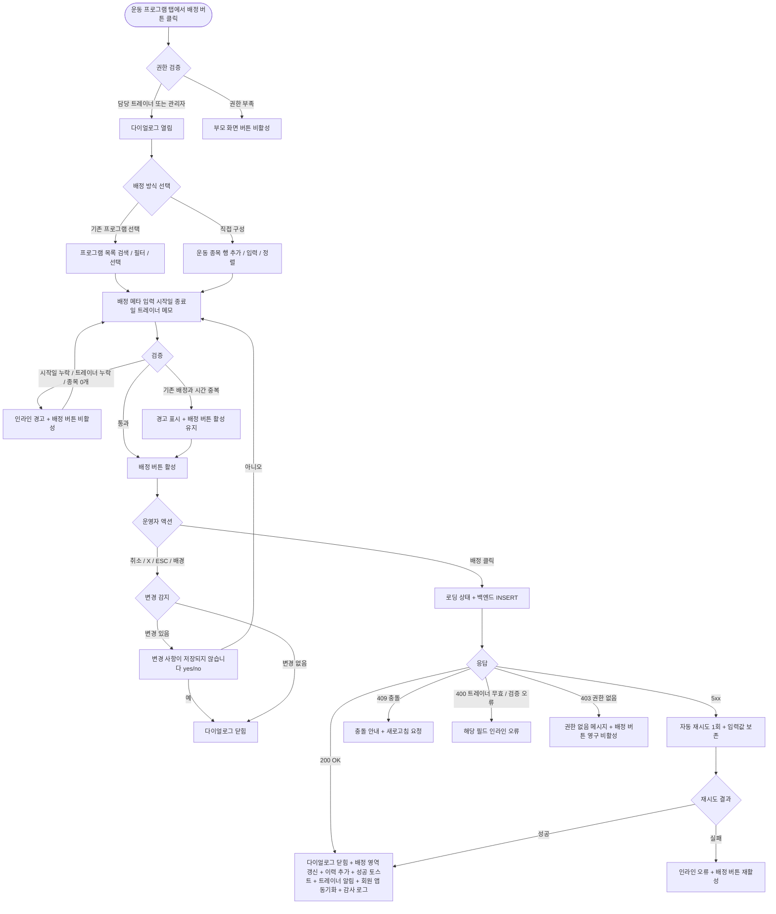

# DLG-M025 운동 프로그램 배정 다이얼로그

## 1. 다이얼로그 메타 정보

이 문서는 운동 프로그램 배정 다이얼로그에 대한 자기완결형 요구사항 정의서입니다. 다른 문서를 함께 보지 않아도 이 한 장만으로 다이얼로그의 호출 트리거, 화면 구성, 입력과 검증, 배정 후 동작, 권한별 처리, 예외 흐름, 그리고 운동 프로그램 운영 정책까지 모두 이해하고 구현할 수 있도록 작성합니다.

| 항목 | 값 |
|---|---|
| 작성일 | 2026-05-22 |
| 버전 | v1.0 |
| 상태 | 최신 통합본 반영 (정합화 완료) |
| 도메인 | D02 회원관리 |
| 다이얼로그 ID | DLG-M025 |
| 다이얼로그명 | 운동 프로그램 배정 |
| 다이얼로그 유형 | 입력형 폼 다이얼로그 (Form + Pick Modal) |
| 우선순위 | P2 (확장 탭, 출시 후 활성화 가능) |
| 기능코드 | MBR-02 (회원 상세) |
| 계약코드 | MBR-02 |
| 부모 화면 | SCR-M004 회원 상세 페이지 (운동 프로그램 탭) |
| 호출 트리거 | 회원 상세의 운동 프로그램 탭에서 "프로그램 배정" 버튼 클릭 |
| 후속 다이얼로그 | 없음 |

## 2. 다이얼로그 목적

운동 프로그램 배정 다이얼로그는 트레이너가 회원에게 맞춤형 운동 계획을 부여하는 작업을 처리합니다. 센터에 사전 등록된 표준 프로그램 중 하나를 선택해 적용하거나, 운동 종목·세트·반복 수·무게를 직접 구성해 개별 프로그램을 만들 수 있습니다. 배정된 프로그램은 회원이 운동할 때 가이드 역할을 하며, 회원 앱(있는 경우)에서 회원이 직접 조회하고 따라할 수 있습니다.

운영 현장에서 이 다이얼로그는 다음 상황에서 사용됩니다. 첫째, 신규 PT 회원의 초기 평가(DLG-M024) 후 트레이너가 회원의 목표와 체력에 맞는 프로그램을 처음 배정하는 경우입니다. 둘째, 일정 기간 동안 같은 프로그램을 수행한 회원에게 새로운 단계의 프로그램을 배정하는 경우입니다. 셋째, 회원의 운동 목적(체중 감량·근력 증가·재활)에 따라 프로그램을 전환하는 경우입니다. 넷째, 트레이너 변경 시 새 트레이너가 회원에게 자신의 프로그램을 배정하는 경우입니다.

## 3. 호출 트리거와 진입 경로

이 다이얼로그는 회원 상세 페이지(SCR-M004)의 운동 프로그램 탭에서 "프로그램 배정" 버튼을 누를 때 열립니다. 운동 프로그램 탭은 확장 탭 영역에 위치하며, 트레이너·매니저·센터장·슈퍼관리자에게만 보입니다.

진입 경로는 단일하며, 다른 화면에서는 호출되지 않습니다. 한 회원에게 여러 프로그램을 동시에 배정하는 경우(예: 상체·하체 분리 프로그램)는 다이얼로그를 여러 번 호출해 각각 배정하는 방식으로 처리합니다.

## 4. UI 구성과 영역별 동작

다이얼로그는 화면 중앙에 가로 720px 내외(모바일 92%)로 표시됩니다. 직접 구성 모드에서 운동 종목이 많이 추가될 수 있으므로 최대 높이는 화면의 85%까지 늘어나고 내부 스크롤이 활성화됩니다.

헤더에는 "운동 프로그램 배정" 제목과 우측 X 버튼이 있고, 보조 라벨로 대상 회원명이 표시됩니다.

본문 상단에는 배정 방식 탭이 가로로 배치됩니다. 좌측 "기존 프로그램 선택", 우측 "직접 구성"이며 기본값은 "기존 프로그램 선택"입니다.

"기존 프로그램 선택" 탭에서는 센터에 사전 등록된 프로그램 목록이 카드 형태로 표시됩니다. 각 카드에는 프로그램명, 운동 목적(체중 감량·근력 증가·재활·체력 향상·자세 교정 등), 권장 기간(예: 4주, 8주), 운동 종목 수, 난이도(초급·중급·고급), 담당 트레이너(프로그램 작성자)가 표시됩니다. 검색 필드와 필터(목적·난이도·기간)가 상단에 있어 운영자가 원하는 프로그램을 쉽게 찾을 수 있습니다. 카드를 클릭하면 그 프로그램이 선택되고 카드 우측 상단에 체크 표시가 나타납니다. 선택된 프로그램의 상세 운동 종목 목록이 카드 아래 펼침 영역에 표시되어 운영자가 내용을 미리 확인할 수 있습니다.

"직접 구성" 탭에서는 운동 종목을 한 줄씩 추가하는 입력 테이블이 표시됩니다. 각 행에는 운동명 입력 또는 선택(센터 등록 운동 종목 목록에서 검색), 세트 수 입력, 반복 수 입력, 무게 입력(kg, 선택), 휴식 시간 입력(초, 선택), 메모 입력(선택)이 있습니다. 우측 끝에는 "행 삭제" 아이콘이 있고, 표 하단에 "+ 운동 추가" 버튼이 있어 행을 무제한 추가할 수 있습니다. 행 순서는 드래그 앤 드롭으로 변경 가능합니다.

선택 또는 구성이 완료되면 그 아래에 배정 메타 영역이 표시됩니다. 배정 시작일(필수, 캘린더 피커, 기본 오늘), 배정 종료일(선택, 캘린더 피커), 담당 트레이너 지정(드롭다운, 기본 현재 로그인한 트레이너), 배정 메모(자유 텍스트, 최대 500자) 필드가 있습니다.

다이얼로그 하단에는 액션 버튼이 우측 정렬로 배치됩니다. 좌측 취소 버튼, 우측 "배정" 버튼이 놓이고, 배정 버튼은 프로그램 선택 또는 직접 구성이 완료되고 배정 시작일이 입력된 경우 활성화됩니다.

## 5. 입력 필드와 검증

기존 프로그램 선택 모드에서는 한 번에 하나의 프로그램만 선택 가능합니다.

직접 구성 모드에서는 최소 1개 이상의 운동 종목이 입력되어야 합니다. 각 행의 운동명은 필수이고, 세트 수와 반복 수도 필수입니다(둘 다 1 이상의 정수). 무게·휴식 시간·메모는 선택 입력입니다. 운동 종목 수는 최대 30개로 제한됩니다.

배정 시작일은 필수이며, 오늘 또는 이후 30일 이내여야 합니다. 과거 날짜와 30일 초과 미래는 선택 불가입니다.

배정 종료일은 선택 입력이며, 입력하는 경우 시작일 이후이고 시작일로부터 최대 1년 이내여야 합니다. 종료일을 입력하지 않으면 무기한 배정으로 저장됩니다.

담당 트레이너는 필수이며, 자기 지점 활성 트레이너 목록에서 선택해야 합니다. 기본값은 현재 로그인한 트레이너이며, 매니저·센터장이 다이얼로그를 호출하는 경우에는 명시적으로 트레이너를 지정해야 합니다.

배정 메모는 선택 입력이며 최대 500자입니다.

같은 회원에 대한 동일 시간대 중복 배정은 경고가 표시되지만 차단되지는 않습니다. 운영자가 의도적으로 상체·하체 분리 프로그램을 같은 기간에 배정할 수 있기 때문입니다.

## 6. 배정/취소 후 동작

배정 버튼을 누르면 다이얼로그가 로딩 상태로 전환되어 두 버튼이 비활성화되고 배정 버튼 안에 스피너가 표시됩니다. 백엔드에는 회원 ID, 배정 방식(기존/직접), 프로그램 ID 또는 운동 종목 배열, 배정 시작일·종료일, 담당 트레이너 ID, 배정 메모, 운영자 ID가 포함된 요청이 전송됩니다.

백엔드는 트랜잭션으로 운동 프로그램 배정 테이블에 INSERT하고, 직접 구성 모드의 경우 운동 종목 배열을 함께 INSERT합니다. 감사 로그에 actor_id, member_id, program_id 또는 custom_routine_id, action=ASSIGN_PROGRAM, timestamp가 비동기 기록됩니다.

200 OK 응답을 받으면 다이얼로그가 닫히고, 부모 화면(운동 프로그램 탭)의 현재 배정 영역에 새 프로그램이 즉시 표시됩니다. 우측 상단에 녹색 토스트("운동 프로그램을 배정했어요")가 5초 표시됩니다.

회원 앱(있는 경우)에는 배정된 프로그램이 즉시 동기화되어 회원이 다음 운동 시점에 자신의 프로그램을 확인할 수 있게 됩니다. 회원에게 푸시 알림이 발송될지 여부는 센터 정책으로 결정됩니다.

취소 버튼·X·ESC·배경 클릭으로 닫을 때 입력값이 일부라도 있는 경우 "변경 사항이 저장되지 않습니다. 닫으시겠습니까?" yes/no 확인이 표시됩니다.

## 7. 부모 화면 갱신과 후속 처리

운동 프로그램 탭의 현재 배정 영역에 새 프로그램이 즉시 추가됩니다. 이전 배정이 있던 경우, 새 배정이 기존 배정을 교체할지 병행할지가 정책 분기점입니다. 기본값은 병행이며, 운영자가 다이얼로그 입력 도중 "기존 배정 해제 후 새로 배정" 체크박스를 선택하면 기존 배정이 종료 처리됩니다.

배정 이력 영역에 새 기록이 추가되어 운영자가 회원의 프로그램 변천을 추적할 수 있습니다.

회원 상세 상단의 운영 포커스 영역에 "현재 운동 프로그램" 요약이 표시되는 경우, 새 프로그램명으로 갱신됩니다.

감사 로그(SCR-097)에 비동기로 5초 안에 기록됩니다.

배정된 트레이너에게 알림 센터를 통해 "회원 [회원명]에게 프로그램이 배정되었습니다" 알림이 발송됩니다. 본인이 직접 배정한 경우 알림은 생략됩니다.

## 8. 권한별 처리

운동 프로그램 배정은 트레이너 전문 영역이며, 권한별 가능 범위가 분리됩니다.

슈퍼관리자(superAdmin), 본사 최고관리자(primary), 센터장(owner), 매니저(manager), 트레이너(trainer)는 프로그램 배정 권한이 있습니다.

트레이너는 본인이 담당하는 회원에 대해서만 배정 가능하며, 다른 트레이너 담당 회원의 운동 프로그램 탭에서는 배정 버튼이 보이지 않거나 클릭 시 권한 안내가 표시됩니다.

매니저·센터장은 자기 지점 모든 회원에게 배정 가능하지만, 일반적으로는 담당 트레이너가 배정하는 것이 운영 가이드입니다. 트레이너 부재나 인수인계 상황에서 매니저·센터장이 대신 처리할 수 있습니다.

FC(fc), 스태프(staff), 프런트(front), 읽기 전용(readonly)은 배정 권한이 없어 부모 화면의 운동 프로그램 탭이 보이지 않거나, 보이더라도 배정 버튼이 비활성 상태입니다.

권한 부족 이벤트는 모두 감사 로그에 기록됩니다.

## 9. 토스트와 알림

배정 성공 시 우측 상단에 녹색 토스트("운동 프로그램을 배정했어요")가 5초 표시됩니다. 토스트 클릭 시 운동 프로그램 탭의 현재 배정 영역으로 스크롤됩니다.

배정 실패 시 사유별 빨강 토스트가 표시됩니다. "권한이 없어요"(403), "다른 운영자가 동시에 배정했어요"(409), "네트워크 오류가 발생했어요"(5xx), "입력값이 유효하지 않아요"(400) 형태입니다.

배정된 트레이너에게 알림 센터 푸시가 발송됩니다.

## 10. 예외 처리

네트워크 오류(5xx, timeout) 발생 시 다이얼로그 안에 인라인 오류가 표시되고 배정 버튼이 다시 활성화됩니다. 자동 재시도 1회 후에도 실패하면 운영자가 수동 재시도해야 합니다. 직접 구성 모드의 입력값은 클라이언트 임시 저장(로컬 스토리지)으로 보존됩니다.

동시 편집 충돌(409)이 발생하면 "다른 운영자가 같은 회원에게 동시에 프로그램을 배정했어요" 메시지가 표시됩니다. 운영자는 다이얼로그를 닫고 부모 화면을 새로고침해 현재 배정 상태를 확인한 후 다시 시도해야 합니다.

회원이 그 사이에 탈퇴·삭제·이관 처리된 경우 "회원 정보가 변경되었어요. 회원 상세를 새로고침해 주세요" 메시지가 표시됩니다.

지정한 담당 트레이너가 그 사이에 퇴사·이관된 경우 "선택한 트레이너가 더 이상 이 지점에 소속되어 있지 않아요. 다른 트레이너를 선택해 주세요" 메시지가 표시됩니다.

권한 부족(401·403) 응답 시 권한 없음 메시지가 표시되고 배정 버튼이 영구 비활성화됩니다.

기존 배정이 활성 상태인 회원에게 새 배정을 시도할 때, 충돌 정책에 따라 동작이 분기됩니다. 기본은 병행 가능이며, 충돌 차단 정책을 운영하는 센터에서는 기존 배정 해제가 강제됩니다.

## 11. 다이얼로그 생명주기

## 12. 관련 운영 정책

운동 프로그램 배정은 트레이너와 회원 간 PT 운영의 실행 도구입니다. 표준 프로그램과 직접 구성 두 가지 방식을 모두 지원하는 것은 운영 현장의 다양성을 반영한 결과이며, 일관된 품질이 필요한 경우 표준 프로그램을, 개별 회원 맞춤이 필요한 경우 직접 구성을 선택할 수 있게 합니다.

담당 트레이너 우선 정책은 회원 운동 책임 구조를 분명히 합니다. 매니저·센터장이 배정 권한을 가지지만 일반적으로는 담당 트레이너가 배정하는 것이 가이드이며, 트레이너 부재 시에만 매니저가 대신 처리합니다. 이는 회원의 운동 계획이 한 명의 트레이너 책임 하에 일관되게 운영되어야 한다는 운영 철학의 결과입니다.

기존 배정과의 병행 또는 교체 정책은 센터별로 분기됩니다. 기본은 병행 가능이며, 한 회원이 상체·하체 분리 프로그램이나 주중·주말 다른 프로그램을 동시에 가질 수 있습니다. 충돌 차단 정책을 운영하는 센터에서는 새 배정 시 기존 배정이 자동 종료됩니다.

표준 프로그램은 센터 매니저 또는 본사가 사전 등록하는 자산이며, 트레이너가 임의로 만들거나 수정할 수 없습니다. 표준 프로그램의 등록·수정은 별도 화면(센터 설정 또는 본사 운영 도구)에서 처리되며, 이 다이얼로그는 등록된 프로그램의 선택과 적용만 담당합니다.

직접 구성 모드에서 입력된 운동 종목은 회원 단위로 저장되며, 다른 회원에게 그대로 복사하려면 별도 화면에서 "프로그램 템플릿화" 기능을 사용해 표준 프로그램으로 등록해야 합니다.

배정된 프로그램은 회원 앱(있는 경우)에 즉시 동기화되며, 회원이 다음 운동 시점에 자신의 프로그램을 앱에서 확인할 수 있습니다. 알림 발송 여부는 센터 정책으로 결정되며, 일부 센터는 회원이 직접 트레이너로부터 안내를 받아야 한다는 정책으로 알림을 비활성화합니다.

배정 종료일이 도래한 프로그램은 자동으로 종료 상태로 전환되며, 회원 앱과 부모 화면에서 "이전 프로그램" 영역으로 이동합니다. 종료 후 재배정이 필요한 회원은 운영 포커스 영역에 "프로그램 재배정 권장" 알림이 표시됩니다.

배정·수정·해제 이벤트는 감사 로그에 비동기로 5초 안에 기록되며, 본사는 지점별 배정 빈도와 프로그램 분포를 모니터링합니다. 트레이너의 운동 프로그램 운영이 표준에서 크게 벗어난 지점에는 본사가 별도 가이드를 제공할 수 있습니다.

운동 프로그램은 평가(DLG-M024)와 연결됩니다. 평가 결과를 기반으로 프로그램이 배정되고, 일정 기간 후 다시 평가해 효과를 측정한 후 새 프로그램을 배정하는 운영 사이클이 권장됩니다. 시스템이 이 사이클을 강제하지는 않지만, 평가와 프로그램의 시간적 연관 관계는 회원 상세에서 시각적으로 확인 가능합니다.

트레이너 변경 시 운동 프로그램 처리는 운영 정책 분기점입니다. 기본은 기존 프로그램을 그대로 유지하면서 담당 트레이너만 변경되는 흐름이며, 새 트레이너가 자신의 프로그램으로 교체하려면 이 다이얼로그를 다시 호출해 새 배정을 등록해야 합니다.
