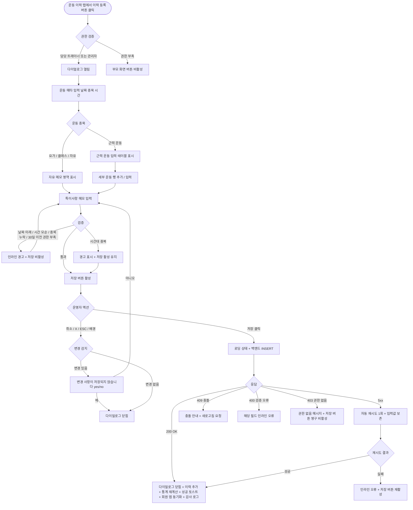

# DLG-M026 운동 이력 등록 다이얼로그

## 1. 다이얼로그 메타 정보

이 문서는 운동 이력 등록 다이얼로그에 대한 자기완결형 요구사항 정의서입니다. 다른 문서를 함께 보지 않아도 이 한 장만으로 다이얼로그의 호출 트리거, 화면 구성, 입력과 검증, 저장 후 동작, 권한별 처리, 예외 흐름, 그리고 운동 이력 운영 정책까지 모두 이해하고 구현할 수 있도록 작성합니다.

| 항목 | 값 |
|---|---|
| 작성일 | 2026-05-22 |
| 버전 | v1.0 |
| 상태 | 최신 통합본 반영 (정합화 완료) |
| 도메인 | D02 회원관리 |
| 다이얼로그 ID | DLG-M026 |
| 다이얼로그명 | 운동 이력 등록 |
| 다이얼로그 유형 | 입력형 폼 다이얼로그 (Form + Table Modal) |
| 우선순위 | P2 (확장 탭) |
| 기능코드 | MBR-02 (회원 상세) |
| 계약코드 | MBR-02 |
| 부모 화면 | SCR-M004 회원 상세 페이지 (운동 이력 탭) |
| 호출 트리거 | 회원 상세의 운동 이력 탭에서 "이력 등록" 버튼 클릭 |
| 후속 다이얼로그 | 없음 |

## 2. 다이얼로그 목적

운동 이력 등록 다이얼로그는 회원이 실제로 수행한 운동 내역을 운영자(주로 트레이너)가 사후 기록하기 위한 다이얼로그입니다. 회원 앱이나 운동 기기를 통해 자동 기록되지 않은 운동 세션을 수기로 보완하며, 회원의 운동 활동 누적 데이터를 완성합니다. 운동 이력은 회원의 활동 패턴 분석, 트레이너의 진행 보고, 회원과의 운동 결과 공유 자료로 활용됩니다.

운영 현장에서 이 다이얼로그는 다음 상황에서 사용됩니다. 첫째, PT 수업 종료 후 트레이너가 회원이 수행한 세트·반복·무게를 정리해 기록하는 경우입니다. 둘째, 회원 앱이나 기기 동기화가 실패한 시점의 운동을 수기로 보완하는 경우입니다. 셋째, 그룹 운동 클래스 참여자의 운동 이력을 강사가 일괄 기록하는 경우(이 다이얼로그는 단일 회원 기준, 일괄은 별도 화면)입니다. 넷째, 회원이 자유 운동(open gym)으로 수행한 내용을 트레이너에게 공유해 사후 기록을 요청하는 경우입니다.

## 3. 호출 트리거와 진입 경로

이 다이얼로그는 회원 상세 페이지(SCR-M004)의 운동 이력 탭에서 "이력 등록" 버튼을 누를 때 열립니다. 운동 이력 탭은 확장 탭 영역에 위치하며, 트레이너·매니저·Owner(지점장)·슈퍼관리자에게 보입니다.

진입 경로는 단일하며, 일괄 등록 기능은 이 다이얼로그에서 지원하지 않습니다. 한 회원에 대한 한 세션의 운동 이력만 한 번에 등록 가능합니다.

## 4. UI 구성과 영역별 동작

다이얼로그는 화면 중앙에 가로 720px 내외(모바일 92%)로 표시됩니다. 운동 종목 행이 추가될 수 있으므로 최대 높이는 화면 85%까지 늘어나고 내부 스크롤이 활성화됩니다.

헤더에는 "운동 이력 등록" 제목과 우측 X 버튼이 있고, 보조 라벨로 대상 회원명이 표시됩니다.

본문 상단에는 운동 메타 영역이 있습니다. 운동 날짜(필수, 캘린더 피커, 기본 오늘, 미래 불가), 운동 종목(필수, 드롭다운에서 선택 또는 자유 텍스트 입력 — 헬스, 요가, 필라테스, PT, 그룹 클래스, 자유 운동, 기타), 시작 시간(선택, HH:MM), 종료 시간(선택, HH:MM), 총 운동 시간(선택, 분 단위 직접 입력 — 시작·종료 시간이 입력되면 자동 계산되고 수정 가능)이 한 영역에 배치됩니다.

그 아래에는 세부 운동 내역 영역이 표시됩니다. 헬스·PT 같은 근력 운동 종목인 경우 운동명·세트·반복·무게·휴식 시간을 입력하는 행이 추가될 수 있는 입력 테이블이 보이며, 요가·필라테스·그룹 클래스 같은 종목인 경우 별도의 자유 메모 영역(클래스 강도·주요 동작 등)이 표시됩니다. 운영자가 운동 종목을 변경하면 세부 입력 영역이 그 종목에 맞게 자동 전환됩니다.

근력 운동 입력 테이블의 각 행에는 운동명 검색·선택 또는 직접 입력, 세트 수, 반복 수, 무게(kg), 휴식 시간(초), 운동 메모(선택)가 있으며, 우측에 "행 삭제" 아이콘이 있습니다. 하단에 "+ 운동 추가" 버튼이 있고, 행 순서는 드래그 앤 드롭으로 변경 가능합니다. 운동 종목은 최대 20개까지 추가 가능합니다.

가장 아래에는 특이사항 메모 영역(자유 텍스트, 최대 500자)이 있어 회원의 컨디션·통증·성취·다음 세션 주의사항 등을 자유롭게 기록할 수 있습니다.

다이얼로그 하단에는 액션 버튼이 우측 정렬로 배치됩니다. 좌측 취소 버튼, 우측 "저장" 버튼이 놓이고, 저장 버튼은 운동 날짜와 운동 종목이 입력된 경우 활성화됩니다.

## 5. 입력 필드와 검증

운동 날짜는 필수이며, 오늘 또는 과거 30일 이내여야 합니다. 30일 이전 날짜는 슈퍼관리자만 선택 가능합니다. 미래 날짜는 선택 불가입니다.

운동 종목은 필수이며, 드롭다운 선택 또는 자유 텍스트 중 하나가 채워져야 합니다. 자유 텍스트는 최대 30자입니다.

시작·종료 시간과 총 운동 시간은 모두 선택 입력입니다. 시작·종료 시간을 모두 입력하면 총 운동 시간이 자동 계산되며, 종료 시간이 시작 시간보다 빠르면 인라인 오류가 표시됩니다. 총 운동 시간은 1분 이상 600분 이하의 정수만 허용됩니다.

근력 운동 입력의 각 행에서 운동명은 필수, 세트 수와 반복 수는 1 이상의 정수가 필수입니다. 무게·휴식 시간·메모는 선택 입력입니다. 한 행이라도 입력하면 그 행의 필수 필드는 채워져야 합니다.

요가·그룹 클래스 같은 종목에서 세부 운동 내역 입력은 모두 선택이며, 자유 메모만 채워도 저장 가능합니다.

특이사항 메모는 선택 입력이며 최대 500자입니다.

같은 회원에 대한 같은 날짜의 중복 운동 이력은 허용됩니다(하루에 여러 세션 운동 가능). 단 같은 시간대에 두 세션이 겹치는 경우 인라인 경고가 표시되지만 저장은 가능합니다.

## 6. 저장/취소 후 동작

저장 버튼을 누르면 다이얼로그가 로딩 상태로 전환되어 두 버튼이 비활성화되고 저장 버튼 안에 스피너가 표시됩니다. 백엔드에는 회원 ID, 운동 날짜·시간, 운동 종목, 세부 운동 내역 배열, 특이사항 메모, 운영자 ID가 포함된 요청이 전송됩니다.

백엔드는 트랜잭션으로 운동 이력 테이블에 INSERT하고, 세부 운동 내역이 있는 경우 운동 종목 배열도 함께 INSERT합니다. 감사 로그에 actor_id, member_id, exercise_id, exercise_date, action=CREATE_EXERCISE_LOG, timestamp가 비동기 기록됩니다.

200 OK 응답을 받으면 다이얼로그가 닫히고, 부모 화면(운동 이력 탭)의 이력 목록 가장 위에 새 기록이 추가됩니다. 운동 통계 영역(주간 운동 횟수·총 운동 시간·종목 분포)이 새 데이터로 다시 계산됩니다. 우측 상단에 녹색 토스트("운동 이력을 등록했어요")가 5초 표시됩니다.

회원 앱(있는 경우)에는 이력이 즉시 동기화되어 회원이 자신의 운동 이력에서 새 기록을 확인할 수 있게 됩니다.

취소 버튼·X·ESC·배경 클릭으로 닫을 때 입력값이 일부라도 있는 경우 "변경 사항이 저장되지 않습니다. 닫으시겠습니까?" yes/no 확인이 표시됩니다.

## 7. 부모 화면 갱신과 후속 처리

운동 이력 탭의 이력 목록 가장 위에 새 기록이 추가되고, 한 줄에 운동 날짜·종목·총 시간·등록자가 표시됩니다. 행을 누르면 세부 운동 내역과 특이사항이 펼침 영역에 표시됩니다.

운동 통계 영역(있는 경우)은 새 데이터로 즉시 재계산됩니다. 주간·월간 운동 횟수, 총 운동 시간, 종목별 분포가 갱신됩니다.

회원 상세 상단의 운영 포커스 영역에 "최근 운동: YYYY-MM-DD - 종목"이 표시되는 경우, 새 값으로 갱신됩니다.

감사 로그(SCR-097)에 비동기로 5초 안에 기록됩니다.

운동 이력은 운동 프로그램(DLG-M025) 배정과 연결되어, 배정된 프로그램의 운동 종목이 실제로 수행되었는지 사후 검증할 수 있는 데이터를 제공합니다.

## 8. 권한별 처리

운동 이력 등록은 PT 운영의 보완 도구이며, 권한별 가능 범위가 분리됩니다.

superAdmin, primary, Owner(지점장), 매니저(manager), 트레이너(trainer)는 이력 등록 권한이 있습니다.

트레이너는 본인이 담당하는 회원만 등록 가능하며, 다른 회원의 운동 이력 탭에서는 등록 버튼이 보이지 않습니다.

매니저·Owner(지점장)은 자기 지점 모든 회원에게 등록 가능하지만, 일반적으로는 담당 트레이너가 등록하는 것이 운영 가이드입니다.

FC(fc), 스태프(staff), 프런트(front), 읽기 전용(readonly)은 등록 권한이 없어 부모 화면의 운동 이력 탭이 보이지 않거나, 보이더라도 등록 버튼이 비활성 상태입니다.

30일 이전 날짜 등록은 슈퍼관리자만 가능합니다.

권한 부족 이벤트는 모두 감사 로그에 기록됩니다.

## 9. 토스트와 알림

저장 성공 시 우측 상단에 녹색 토스트("운동 이력을 등록했어요")가 5초 표시됩니다. 토스트 클릭 시 운동 이력 탭의 이력 목록 상단으로 스크롤됩니다.

저장 실패 시 사유별 빨강 토스트가 표시됩니다. "권한이 없어요"(403), "다른 운영자가 동시에 등록했어요"(409), "네트워크 오류가 발생했어요"(5xx), "입력값이 유효하지 않아요"(400) 형태입니다.

## 10. 예외 처리

네트워크 오류(5xx, timeout) 발생 시 다이얼로그 안에 인라인 오류가 표시되고 저장 버튼이 다시 활성화됩니다. 입력 분량이 많을 수 있어 클라이언트 임시 저장(로컬 스토리지)으로 입력값을 보존하며, 운영자가 재로그인 후 다이얼로그를 다시 열면 입력값이 복원됩니다.

회원이 그 사이에 탈퇴·삭제·이관 처리된 경우 "회원 정보가 변경되었어요. 회원 상세를 새로고침해 주세요" 메시지가 표시됩니다.

같은 시간대에 다른 운동 이력이 이미 등록되어 있는 경우 인라인 경고가 표시되지만 저장은 가능합니다.

권한 부족(401·403) 응답 시 권한 없음 메시지가 표시되고 저장 버튼이 영구 비활성화됩니다.

운동 종목이 센터에서 정의되지 않은 임의 종목인 경우 자유 텍스트 입력으로 자동 처리되며, 별도 차단은 없습니다.

## 11. 다이얼로그 생명주기

## 12. 관련 운영 정책

운동 이력은 회원의 운동 활동을 누적 기록하는 데이터이며, 자동(앱·기기 동기화)과 수동(이 다이얼로그) 두 가지 경로로 입력됩니다. 두 경로의 데이터는 동일한 테이블에 저장되지만, 입력 출처(automatic/manual)가 구분되어 분석 시 신뢰도 차이를 평가할 수 있습니다.

담당 트레이너 우선 정책은 운동 이력 등록에도 적용됩니다. 매니저·Owner(지점장)이 등록 가능하지만 일반적으로는 담당 트레이너가 등록하며, 트레이너 부재 시에만 매니저가 대신 처리합니다.

같은 시간대 중복 이력 허용은 회원이 하루에 여러 운동을 수행할 수 있다는 운영 현실을 반영합니다. 예를 들어 오전 PT 후 오후 자유 운동, 또는 헬스 후 요가 클래스 같은 다중 세션이 가능합니다. 시스템이 시간 겹침을 차단하지 않고 경고만 표시하는 것은 운영자가 의도적으로 입력했을 가능성을 존중하기 위함입니다.

운동 종목의 자유 텍스트 입력 허용은 센터의 운동 종목 정의가 완벽하지 않을 수 있다는 현실을 반영합니다. 새로운 운동 종목이 등장하거나 임시 클래스가 진행된 경우 운영자가 자유 텍스트로 입력할 수 있으며, 자주 입력되는 자유 텍스트는 사후에 정식 종목 목록에 추가되는 것이 권장됩니다.

세부 운동 내역 입력은 근력 운동에 한해 권장되며, 유산소·요가·클래스 같은 종목에서는 자유 메모로 충분합니다. 이는 운동 종목별 데이터 특성을 반영한 결과이며, 모든 종목에 같은 입력을 강제하지 않습니다.

30일 이전 날짜 등록은 슈퍼관리자만 가능합니다. 매우 오래된 운동을 사후 추가하는 행위는 통계와 이력의 신뢰성에 영향을 주므로 권한이 제한됩니다.

운동 이력은 회원 앱(있는 경우)에 즉시 동기화되며, 회원이 자신의 운동 이력을 직접 조회할 수 있습니다. 알림 발송 여부는 센터 정책으로 결정되며, 일부 센터는 별도 알림 없이 회원이 앱에서 자율 확인하는 방식을 운영합니다.

운동 이력과 운동 프로그램(DLG-M025) 배정의 연결은 사후 분석의 기반이 됩니다. 배정된 프로그램의 운동 종목이 실제 이력에 등장하는 비율, 회원의 프로그램 이행률 같은 지표가 산출되어 트레이너의 운영 의사결정에 활용됩니다.

운동 이력 등록·수정·삭제는 모두 감사 로그에 비동기로 5초 안에 기록되며, 사후 데이터 위·변조나 부정 입력을 추적할 수 있게 합니다.

이력 수정과 삭제는 별도 흐름(이 다이얼로그의 범위 밖)으로 처리되며, 이 다이얼로그는 신규 입력만 담당합니다. 잘못 입력한 이력의 수정·삭제는 운동 이력 탭의 행 액션 메뉴에서 수행할 수 있습니다.

본사 통합 모드에서는 본사가 지점별 운동 이력 등록 빈도와 종목 분포를 모니터링합니다. 트레이너의 이력 등록이 지나치게 부족하거나 형식적으로 일률적인 지점에는 본사가 별도 가이드를 제공할 수 있습니다.
