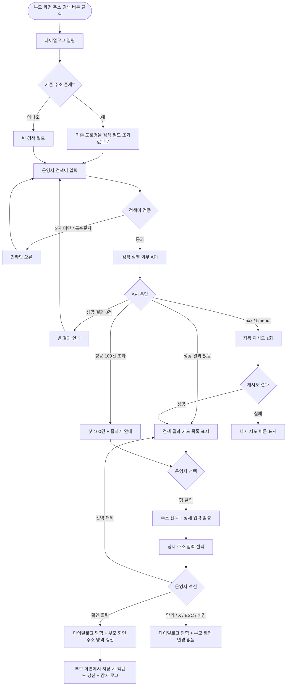

# DLG-M027 주소 검색 다이얼로그

## 1. 다이얼로그 메타 정보

이 문서는 주소 검색 다이얼로그에 대한 자기완결형 요구사항 정의서입니다. 다른 문서를 함께 보지 않아도 이 한 장만으로 다이얼로그의 호출 트리거, 화면 구성, 입력과 검증, 확인 후 동작, 권한별 처리, 예외 흐름, 그리고 주소 검색·저장 운영 정책까지 모두 이해하고 구현할 수 있도록 작성합니다.

| 항목 | 값 |
|---|---|
| 작성일 | 2026-05-22 |
| 버전 | v1.0 |
| 상태 | 최신 통합본 반영 (정합화 완료) |
| 도메인 | D02 회원관리 |
| 다이얼로그 ID | DLG-M027 |
| 다이얼로그명 | 주소 검색 |
| 다이얼로그 유형 | 검색·선택형 다이얼로그 (Search + Pick Modal) |
| 우선순위 | P1 (출시 필수) |
| 기능코드 | MBR-02 (회원 상세), MBR-03 (회원 등록/수정) |
| 계약코드 | MBR-02, MBR-03 |
| 부모 화면 | SCR-M002 회원 등록, SCR-M003 회원 수정 (그 외 주소 입력이 있는 모든 화면) |
| 호출 트리거 | 주소 입력 영역의 "주소 검색" 버튼 클릭 |
| 후속 다이얼로그 | 없음 |

## 2. 다이얼로그 목적

주소 검색 다이얼로그는 회원의 주소 정보를 정확하고 일관된 형식으로 입력하기 위한 도구입니다. 외부 우편번호 검색 API와 연동되어 도로명·지번·건물명으로 검색하고, 검색 결과에서 정확한 주소를 선택한 뒤 동·호수 같은 상세 주소를 추가 입력하는 흐름을 한 다이얼로그 안에서 처리합니다. 직접 텍스트로 주소를 입력하면 오타·표기 차이·도로명 미반영 등으로 데이터 품질이 떨어지므로, 운영자가 반드시 이 다이얼로그를 통해 표준화된 주소를 저장하도록 합니다.

운영 현장에서 이 다이얼로그는 다음 상황에서 사용됩니다. 첫째, 회원 등록 단계에서 신규 회원의 주소를 입력하는 경우입니다. 둘째, 회원 정보 수정 화면에서 기존 주소를 변경하는 경우입니다. 셋째, 결제 시 영수증 발급용 주소나 배송지 주소를 입력하는 경우입니다. 어떤 경우든 운영자는 검색 → 선택 → 상세 입력의 3단계를 거쳐 표준화된 주소를 회원 정보에 반영합니다.

## 3. 호출 트리거와 진입 경로

이 다이얼로그는 주소 입력 영역이 있는 모든 화면에서 "주소 검색" 버튼을 누를 때 호출됩니다. 대표적 호출 화면은 회원 등록(SCR-M002)과 회원 수정(SCR-M003)이며, 그 외 결제 영수증 발급 화면이나 가족 회원 등록 화면 등에서도 동일하게 호출될 수 있습니다.

호출 화면에 따라 다이얼로그 닫힘 후 갱신되는 부모 화면의 영역만 달라지고, 다이얼로그 자체의 UI와 동작은 동일합니다. 기존 주소가 입력된 상태에서 다이얼로그를 다시 호출하면 기존 주소의 도로명 부분이 검색 필드의 초기값으로 채워져 운영자가 빠르게 재검색을 시작할 수 있습니다.

## 4. UI 구성과 영역별 동작

다이얼로그는 화면 중앙에 가로 560px 내외(모바일 92%)로 표시됩니다. 검색 결과가 많을 수 있으므로 최대 높이는 화면의 80%까지 늘어나며 내부 스크롤이 활성화됩니다.

헤더에는 "주소 검색" 제목과 우측 X 버튼이 배치됩니다.

본문 상단에는 검색 입력 영역이 있습니다. 가로 폭이 넓은 텍스트 입력 필드와 우측 "검색" 버튼이 한 줄로 배치되며, 입력 필드 아래에 작은 가이드 텍스트("도로명, 지번, 건물명으로 검색할 수 있어요. 예: 강남대로 123, 역삼동 123-45")가 표시됩니다. 검색은 입력 후 엔터 키 또는 검색 버튼 클릭으로 실행되며, 자동 디바운스 검색은 적용하지 않습니다(외부 API 호출 비용 절감 목적).

검색 입력 영역 아래에는 검색 결과 목록이 표시됩니다. 검색을 아직 실행하지 않았을 때는 빈 상태 안내("검색어를 입력하고 검색 버튼을 눌러주세요")가 표시되며, 검색 결과가 0건일 때는 "검색 결과가 없어요. 다른 검색어로 다시 시도해 주세요" 안내가 표시됩니다. 결과가 있을 때는 카드 형태의 행으로 한 줄에 한 주소씩 표시됩니다. 각 행에는 우편번호(5자리), 도로명 주소 전체, 지번 주소 전체가 함께 표시되며, 행을 클릭하면 그 주소가 선택됩니다.

검색 결과 목록 위에는 검색 결과 건수 표시("검색 결과: N건")가 표시되어 운영자가 결과 분량을 즉시 인지할 수 있습니다. 결과가 100건을 초과하면 첫 100건만 표시되고 "더 자세한 검색어를 입력해 결과를 좁혀주세요" 안내가 함께 표시됩니다.

운영자가 한 행을 클릭하면 그 주소가 선택되고, 본문 하단에 선택된 주소 정보 카드가 강조 표시됩니다. 카드에는 우편번호·도로명 주소·지번 주소가 표시되며 카드 우측에 "선택 해제" 버튼이 있어 다시 검색 결과로 돌아갈 수 있습니다.

선택된 주소 카드 아래에는 상세 주소 입력 필드가 활성화됩니다. 주소가 선택되기 전까지는 이 필드가 비활성 상태이며, 선택과 동시에 활성화되어 운영자가 동·호수·층 같은 상세 주소를 입력할 수 있습니다. 상세 주소는 선택 입력이며 최대 100자까지 입력 가능합니다.

다이얼로그 하단에는 액션 버튼이 우측 정렬로 배치됩니다. 좌측 "닫기" 버튼, 우측 "확인" 버튼이 놓이고, 확인 버튼은 주소가 선택된 경우(상세 주소 입력 여부와 무관하게)에 활성화됩니다.

## 5. 입력 필드와 검증

검색어는 최소 2자 이상 50자 이하의 한글·영문·숫자·공백·하이픈만 허용됩니다. 특수문자 입력은 차단됩니다. 검색어가 2자 미만인 상태에서 검색 버튼을 누르면 입력 필드 아래에 인라인 오류("검색어를 2자 이상 입력해 주세요")가 표시되고 검색은 실행되지 않습니다.

주소 선택은 필수입니다. 검색 결과에서 한 행을 클릭하지 않으면 확인 버튼이 비활성화됩니다. 한 번에 한 주소만 선택 가능하며 다중 선택은 지원하지 않습니다.

상세 주소는 선택 입력이며, 입력하는 경우 최대 100자까지 허용됩니다. 한글·영문·숫자·공백·하이픈·괄호만 허용되고 특수문자는 차단됩니다. 상세 주소는 회원의 운영 식별이나 영수증 발급에 사용되므로, 입력 시 일반적인 표기 관례(예: "101동 1502호")를 따르도록 가이드 텍스트가 입력 필드 아래에 표시됩니다.

외부 우편번호 검색 API의 응답 형식이 변경되거나 일부 필드가 누락된 경우에도 다이얼로그는 가능한 정보만 표시하고 나머지는 빈 상태로 두며, 운영자가 선택해 저장할 수 있도록 한다(완전성보다 가용성 우선).

## 6. 확인/닫기 후 동작

확인 버튼을 누르면 다이얼로그가 즉시 닫히고, 부모 화면의 주소 입력 영역에 선택된 주소가 자동 입력됩니다. 부모 화면의 우편번호·도로명 주소·지번 주소·상세 주소 필드에 각 값이 채워지며, 운영자는 이 다이얼로그를 닫은 후에도 부모 화면에서 상세 주소를 추가로 수정할 수 있습니다.

이 다이얼로그 자체는 백엔드에 별도 요청을 보내지 않습니다. 주소 데이터는 부모 화면의 클라이언트 상태로만 전달되며, 회원 정보의 실제 저장은 부모 화면의 저장 버튼을 누를 때 일어납니다. 따라서 다이얼로그 확인 시점에는 감사 로그 기록이나 회원 정보 갱신이 일어나지 않습니다.

닫기 버튼·X·ESC·배경 클릭으로 닫으면 다이얼로그가 즉시 닫히고, 부모 화면의 주소는 변경되지 않습니다. 검색 입력이나 선택이 있던 상태에서 닫는 경우에도 추가 확인 없이 즉시 닫힙니다(이 다이얼로그는 입력 영속화가 아니므로 변경 사항이 사라진다는 안내는 표시하지 않음).

선택된 주소를 다시 검색하려면 운영자가 "선택 해제" 버튼을 눌러 검색 결과로 돌아가거나, 다이얼로그를 닫고 다시 호출해야 합니다.

## 7. 부모 화면 갱신과 후속 처리

부모 화면의 주소 입력 영역이 갱신됩니다. 갱신되는 필드는 우편번호(5자리), 도로명 주소, 지번 주소, 상세 주소이며, 각 필드는 부모 화면의 회원 정보 구조에 맞게 매핑되어 표시됩니다.

부모 화면이 SCR-M002 회원 등록인 경우 새 회원의 주소 정보로 사용되며, SCR-M003 회원 수정인 경우 기존 주소가 새 값으로 교체됩니다. 결제 영수증 발급 화면이나 배송지 입력 화면에서는 해당 화면의 주소 컨텍스트에 맞게 반영됩니다.

회원 정보가 실제로 저장되는 시점은 부모 화면의 저장 버튼을 누를 때이며, 그 시점에 부모 화면이 백엔드 요청을 보내고 감사 로그를 기록합니다. 이 다이얼로그는 주소 데이터를 부모 화면 상태로 전달하는 역할만 합니다.

부모 화면에서 주소 변경이 일어났다는 사실은 부모 화면의 변경 감지 로직에 의해 추적되며, 사용자가 부모 화면을 저장 없이 떠나려고 하면 부모 화면의 "변경 사항이 저장되지 않습니다" 확인이 표시됩니다.

## 8. 권한별 처리

주소 검색 자체에는 별도의 권한 제한이 없습니다. 회원 등록·수정 권한을 가진 모든 사용자가 이 다이얼로그를 호출할 수 있으며, 다이얼로그 내부의 검색·선택·상세 입력은 부모 화면의 권한 정책에 따라 동작합니다.

슈퍼관리자(superAdmin), 본사 최고관리자(primary), 센터장(owner), 매니저(manager), 스태프(staff), 프런트(front)는 회원 등록·수정 권한이 있으므로 이 다이얼로그를 호출할 수 있습니다.

FC(fc), 트레이너(trainer)는 일부 부모 화면(회원 등록)에 진입할 수 없으므로 그 화면에서는 이 다이얼로그가 호출되지 않습니다. 회원 수정에서 호출 가능 여부는 부모 화면의 권한 정책에 따릅니다.

읽기 전용(readonly)은 회원 등록·수정 자체가 불가능하므로 이 다이얼로그가 호출되지 않습니다.

다이얼로그 자체는 외부 우편번호 검색 API를 호출하는 비용이 있으므로, 1회 검색에 대한 사용량 제한이 있을 수 있습니다. 사용량 초과 시 일시적으로 검색이 차단되고 "검색 사용량이 일시적으로 초과되었어요. 잠시 후 다시 시도해 주세요" 안내가 표시됩니다.

권한 부족 이벤트는 부모 화면 수준에서 감사 로그에 기록되며, 이 다이얼로그 자체는 별도 감사 로그를 기록하지 않습니다.

## 9. 토스트와 알림

다이얼로그 확인 시점에는 별도의 토스트가 표시되지 않습니다. 주소가 부모 화면에 반영된 후 부모 화면이 저장 성공 토스트를 표시하면, 그 안에 주소 변경 사실이 포함됩니다.

검색 실패(외부 API 오류) 시 검색 결과 영역에 "주소 검색에 실패했어요. 잠시 후 다시 시도해 주세요" 메시지가 표시되며, 일시적인 오류는 자동 재시도 1회 후에도 실패하면 운영자가 수동 재시도합니다.

검색 사용량 초과 시 "검색 사용량이 일시적으로 초과되었어요" 인라인 안내가 표시되고 검색 버튼이 일정 시간(예: 1분) 동안 비활성화됩니다.

## 10. 예외 처리

외부 우편번호 검색 API 호출 실패(5xx, timeout) 시 검색 결과 영역에 인라인 오류가 표시되고 "다시 시도" 버튼이 표시됩니다. 자동 재시도 1회 후에도 실패하면 운영자가 수동으로 다시 시도하거나, 부모 화면으로 돌아가 직접 텍스트 입력을 사용해야 합니다(직접 입력은 비표준 주소이므로 가급적 피해야 함).

검색 결과 0건일 때 운영자에게 다른 검색어 입력을 안내합니다. 검색어가 너무 일반적이거나 도로명이 정확하지 않은 경우 자주 발생합니다.

검색 결과가 너무 많은 경우(100건 초과) 첫 100건만 표시되고 결과 좁히기 안내가 표시됩니다. 운영자는 검색어를 더 구체적으로 입력해 결과를 좁혀야 합니다.

다이얼로그 외부 의존성(우편번호 검색 API)이 장애 중인 경우 검색이 불가능하며, 부모 화면에서 임시로 직접 텍스트 입력을 허용하는 대체 흐름이 동작할 수 있습니다. 임시 직접 입력 주소는 사후 정식 검색으로 보정해야 한다는 운영 정책이 부모 화면에 가이드됩니다.

상세 주소 입력 도중 다이얼로그를 닫는 경우 별도 확인 없이 즉시 닫힙니다. 이 다이얼로그는 입력 영속화가 아니라 부모 화면으로 데이터 전달이므로, 닫기 시점에 변경 사항 안내는 표시되지 않습니다.

브라우저 또는 클라이언트의 네트워크가 차단된 경우 외부 API 호출이 실패하며, 검색 결과 영역에 "네트워크 연결을 확인해 주세요" 안내가 표시됩니다.

## 11. 다이얼로그 생명주기

## 12. 관련 운영 정책

주소 데이터의 표준화는 회원 정보 품질 관리의 핵심 정책입니다. 직접 텍스트 입력은 오타·표기 차이·도로명 미반영 등으로 데이터 품질이 떨어지므로, 운영자가 가급적 이 다이얼로그를 통해 외부 우편번호 검색 API의 결과를 사용하도록 가이드합니다. 외부 API 장애 시에만 임시로 직접 입력이 허용되며, 사후에 정식 검색으로 보정해야 합니다.

상세 주소(동·호수·층)는 표준화된 형식이 없는 자유 입력이므로, 가이드 텍스트로 일반적 표기 관례를 안내합니다. "101동 1502호" 형식이 권장되며, "101-1502", "B동 502", "지하1층 5호" 같은 다양한 변형도 허용됩니다.

검색 사용량 제한은 외부 API의 비용·정책에 따라 운영됩니다. 1일 검색 횟수 한도가 설정되어 있고, 한도 초과 시 일시적으로 검색이 차단됩니다. 이 한도는 본사가 외부 API와의 계약에 따라 관리하며, 운영자에게는 한도 초과 시 안내만 표시됩니다.

기존 주소의 도로명 부분을 검색 필드 초기값으로 채우는 정책은 회원 정보 수정 시 재검색의 효율성을 위한 결과입니다. 운영자는 기존 도로명을 그대로 검색하거나, 일부만 수정해 새 주소를 찾을 수 있습니다.

다이얼로그 자체에서 백엔드 저장이 일어나지 않는 정책은 책임 분리를 위한 결과입니다. 이 다이얼로그는 주소 검색과 표준화만 담당하고, 실제 저장은 부모 화면이 회원 정보 전체 컨텍스트에서 수행합니다. 이로써 주소만 변경되는 사고나 부모 화면 컨텍스트와 동기화되지 않은 저장이 방지됩니다.

검색 결과 표시 제한(100건)은 외부 API 응답 크기와 운영자 인지 부담 사이의 균형점입니다. 100건이 넘는 결과는 운영자가 일일이 확인하기 어렵고, 검색어가 너무 일반적임을 의미하므로 좁히기를 유도하는 것이 운영 효율에 부합합니다.

상세 주소의 최대 100자 제한은 일반적 한국 주소 표기에서 충분히 여유 있는 길이입니다. 그 이상의 입력이 필요한 경우(예: 매우 긴 추가 설명)는 회원 메모(DLG-M009)에 별도로 기록하는 것이 권장됩니다.

다이얼로그 호출 권한이 부모 화면의 권한 정책에 종속되는 정책은 시스템 일관성을 위한 결과입니다. 이 다이얼로그 자체에 별도 권한 검사가 없는 것은, 다이얼로그가 부모 화면의 일부로 동작하며 부모 화면 진입이 곧 다이얼로그 호출 권한을 의미하기 때문입니다.

외부 우편번호 검색 API의 응답 형식이 변경되거나 일부 필드가 누락되어도 다이얼로그는 가능한 정보만 표시하는 정책(완전성보다 가용성 우선)을 따릅니다. 이는 외부 API 변경으로 인한 운영 중단을 막기 위한 결과이며, 누락된 필드는 운영자가 부모 화면에서 직접 보완할 수 있습니다.

주소 정보는 회원의 영수증 발급, 배송, 마케팅 캠페인 등에 사용되므로 정확한 표준화가 운영 효율에 직접 영향을 줍니다. 본사는 지점별 주소 입력 품질을 모니터링하며, 비표준 주소가 과도하게 많은 지점에는 가이드를 제공할 수 있습니다.

회원 앱(있는 경우)에서는 회원이 자신의 주소를 직접 수정할 수 있으며, 회원 수정 흐름에서도 이 다이얼로그와 동일한 검색 API가 사용됩니다. 이는 운영자 입력 주소와 회원 자가 입력 주소가 동일한 표준 형식을 따르도록 보장합니다.
