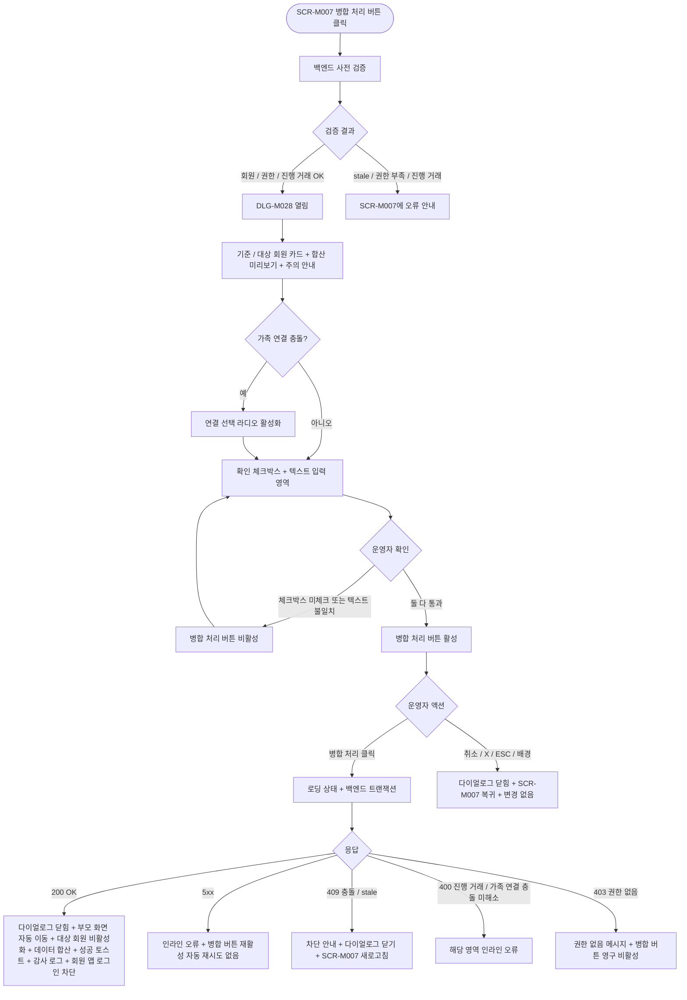

# DLG-M028 회원 병합 확인 다이얼로그

## 1. 다이얼로그 메타 정보

이 문서는 회원 병합 확인 다이얼로그에 대한 자기완결형 요구사항 정의서입니다. 다른 문서를 함께 보지 않아도 이 한 장만으로 다이얼로그의 호출 트리거, 화면 구성, 입력과 검증, 확인 후 동작, 권한별 처리, 예외 흐름, 그리고 회원 병합 운영 정책까지 모두 이해하고 구현할 수 있도록 작성합니다.

| 항목 | 값 |
|---|---|
| 작성일 | 2026-05-22 |
| 버전 | v1.0 |
| 상태 | 최신 통합본 반영 (정합화 완료) |
| 도메인 | D02 회원관리 |
| 다이얼로그 ID | DLG-M028 |
| 다이얼로그명 | 회원 병합 확인 |
| 다이얼로그 유형 | 확인형 차단 다이얼로그 (Confirm Modal) - 회복 불가 작업 |
| 우선순위 | P2 (고급 기능, 출시 후 활성화 가능) |
| 기능코드 | MBR-02 (회원 상세), MBR-EXT-01 (회원 병합) |
| 계약코드 | MBR-02, MBR-EXT-01 |
| 부모 화면 | SCR-M007 회원 병합 페이지 |
| 호출 트리거 | SCR-M007에서 기준 회원과 대상 회원 선택을 완료하고 "병합 처리" 버튼 클릭 |
| 후속 다이얼로그 | 없음 |

## 2. 다이얼로그 목적

회원 병합 확인 다이얼로그는 중복 생성된 회원 계정을 하나의 계정으로 통합하기 직전에 운영자의 최종 의사를 다시 한 번 확인받는 안전 장치입니다. 병합은 두 회원 계정 중 한 쪽(대상 회원)을 삭제하면서 그 데이터(이용권·출석·결제·체성분 등)를 다른 쪽(기준 회원)에 합치는 작업이며, 한 번 처리되면 대상 계정은 영구 비활성화되어 복구할 수 없습니다. 따라서 운영자가 합산 미리보기를 통해 병합 결과를 명확히 확인한 후 확정해야 합니다.

운영 현장에서 이 다이얼로그는 다음 상황에서 호출됩니다. 첫째, 같은 회원이 실수로 두 번 등록된 경우(서로 다른 연락처 변형이나 입력 차이로) 그 두 계정을 합치는 경우입니다. 둘째, 가족 등록 과정에서 잘못 분리된 계정을 정리하는 경우입니다. 셋째, 본사 통합 후 지점 간 동일 회원이 별도 계정으로 존재하는 경우 정리하는 경우입니다. 어떤 경우든 병합은 회복 불가능한 작업이며, 운영자는 합산 미리보기와 주의 안내를 반드시 검토해야 합니다.

## 3. 호출 트리거와 진입 경로

이 다이얼로그는 회원 병합 페이지(SCR-M007)에서 운영자가 기준 회원(병합 후 유지될 계정)과 대상 회원(병합 후 삭제될 계정)을 선택한 뒤 "병합 처리" 버튼을 누르는 시점에 호출됩니다. SCR-M007 자체는 회원 목록(SCR-M001)이나 회원 상세(SCR-M004)에서 병합 진입점을 통해 들어가는 화면이며, 이 다이얼로그는 그 화면의 최종 확정 단계에서만 열립니다.

이 다이얼로그가 회원 목록이나 회원 상세에서 직접 단독으로 열리는 일은 없습니다. 두 회원 선택과 최종 확정을 시각적·심리적으로 분리해 운영자가 신중하게 결정하도록 유도하는 의도입니다.

## 4. UI 구성과 영역별 동작

다이얼로그는 화면 중앙에 가로 640px 내외(모바일 92%)로 표시됩니다. 병합 결과 미리보기 영역 때문에 세로가 길어질 수 있으며 최대 높이는 화면 85%까지 늘어나고 내부 스크롤이 활성화됩니다.

헤더 좌측에는 "회원 병합 확인" 제목과 주의 아이콘(빨강 삼각형 안 느낌표)이 함께 배치되어 회복 불가 작업임을 강조합니다. 우측에는 X 버튼이 있습니다.

본문 상단에는 두 회원 정보 카드가 좌우로 배치됩니다. 좌측은 "기준 회원(유지)" 카드로 녹색 톤이며, 회원명·회원번호·가입일·소속 지점·연락처(마스킹)·현재 상태가 표시됩니다. 우측은 "대상 회원(삭제)" 카드로 빨강 톤이며 동일 항목이 표시됩니다. 두 카드 사이에는 큰 화살표 아이콘이 표시되어 데이터 흐름 방향(대상 → 기준)을 직관적으로 보여줍니다.

회원 카드 아래에는 "병합 후 데이터 합산 미리보기" 영역이 표시됩니다. 항목별로 좌측에 기준 회원의 기존 값, 우측에 병합 후 새 값(기준 + 대상)이 나란히 표시됩니다. 표시되는 항목은 다음과 같습니다.

활성 이용권 항목은 기준 회원의 이용권 목록과 대상 회원의 이용권 목록이 모두 통합되어 표시되며, 동일 이용권 종류가 양쪽에 있는 경우 합산 규칙(잔여 기간은 더 늦은 만료일, 잔여 횟수는 합산)이 함께 안내됩니다.

출석 이력 항목은 두 회원의 총 출석 건수가 합산되어 표시됩니다. 같은 날짜의 중복 출석은 자동으로 1건으로 병합됩니다.

마일리지 항목은 기준 잔액과 대상 잔액이 합산된 새 잔액이 표시됩니다.

결제 이력 항목은 두 회원의 총 결제 건수와 총 결제 금액이 합산되어 표시됩니다. 결제 이력은 각 결제 시점의 원 회원 정보가 보존되어 사후 추적이 가능합니다.

체성분·평가·운동 프로그램·운동 이력·상담·메모 항목도 모두 합산 건수가 표시됩니다.

가족 회원 연결은 정책 분기점으로 표시됩니다. 두 회원 모두 가족 연결을 가지고 있는 경우 운영자가 어느 쪽 연결을 유지할지 또는 모두 유지할지 결정해야 한다는 안내가 표시되며, 별도의 선택 영역이 추가됩니다.

회원 등급은 두 회원 중 더 높은 등급이 기준 회원의 새 등급으로 적용된다는 안내가 표시됩니다.

미리보기 아래에는 큰 주의 안내가 빨강 배경의 카드로 표시됩니다. 안내 문구는 "병합 후 대상 계정([대상 회원명])은 영구 비활성화되며 복구할 수 없습니다. 모든 데이터는 기준 계정([기준 회원명])에 통합됩니다." 이 안내는 다이얼로그의 핵심 메시지이며, 시각적으로 가장 강조됩니다.

가장 아래에는 확인 절차 영역이 있습니다. 운영자가 두 가지 확인을 모두 통과해야 병합 처리 버튼이 활성화됩니다. 첫째, "위 합산 결과를 확인했습니다" 체크박스를 체크해야 합니다. 둘째, 텍스트 입력 필드에 "병합 처리"라는 단어를 정확히 입력해야 합니다(대소문자·공백 정확히 일치). 이 두 확인은 운영자의 명시적이고 의도적인 결정을 보장하기 위한 절차입니다.

다이얼로그 하단에는 액션 버튼이 우측 정렬로 배치됩니다. 좌측 취소 버튼(보조 스타일), 우측 "병합 처리" 버튼(주의 스타일, 빨강 톤)이 놓입니다.

## 5. 입력 필드와 검증

이 다이얼로그 자체에는 새로 입력하는 회원 정보가 없습니다. 모든 회원 선택과 병합 의도는 부모 화면 SCR-M007에서 이미 결정되어 전달된 상태이며, 이 다이얼로그는 합산 미리보기와 확인 절차만 진행합니다.

다이얼로그가 열리는 시점에 백엔드는 사전 검증을 수행합니다. 첫째, 두 회원이 여전히 존재하고 활성·만료예정·만료임박·만료·홀딩 중 하나의 상태인가. 둘째, 두 회원이 서로 다른 회원인가(같은 ID는 차단). 셋째, 두 회원이 동일 브랜드 안에 있는가(다른 브랜드 회원 병합은 본사 권한자만 가능). 사전 검증에 실패하면 다이얼로그가 열리지 않고 SCR-M007에 오류가 표시됩니다.

가족 연결 충돌이 있는 경우 미리보기 영역에 어떤 연결을 유지할지 선택하는 라디오가 활성화되며, 선택을 완료해야 병합 처리 버튼이 활성화됩니다.

확인 체크박스와 텍스트 입력 두 가지가 모두 통과한 상태에서만 병합 처리 버튼이 활성화됩니다. 텍스트 입력은 "병합 처리"라는 단어가 정확히 입력되어야 하며, 부분 일치나 유사 단어는 허용되지 않습니다.

## 6. 확인/취소 후 동작

병합 처리 버튼을 누르면 다이얼로그가 로딩 상태로 전환되어 두 버튼이 비활성화되고 처리 버튼 안에 스피너가 표시됩니다. 백엔드에는 기준 회원 ID, 대상 회원 ID, 가족 연결 충돌 선택 결과(있는 경우), 운영자 ID, 확인 체크박스 체크 시각, 확인 텍스트 입력 시각이 포함된 요청이 전송됩니다.

백엔드는 트랜잭션으로 대상 회원의 모든 데이터(이용권·출석·결제·체성분·평가·운동 프로그램·운동 이력·상담·메모·마일리지)를 기준 회원의 ID로 UPDATE 또는 적절히 변환하고, 대상 회원의 상태를 MERGED_DELETED로 변경하며 PII를 즉시 마스킹합니다. 결제 이력은 원 회원 정보(merged_from 필드)가 보존되어 사후 추적이 가능합니다. 가족 회원 연결, 회원 등급, 세그먼트 라벨은 합산 규칙에 따라 기준 회원에 적용됩니다.

병합 이벤트는 별도 테이블에 INSERT됩니다(action=MERGE_MEMBER, base_member, target_member, merged_data_summary, actor_id, confirmation_text, timestamp). 감사 로그에도 동일 이벤트가 비동기 기록됩니다.

200 OK 응답을 받으면 다이얼로그가 닫히고, 부모 화면 SCR-M007이 자동 닫히면서 진입 경로의 화면(주로 회원 목록)으로 이동합니다. 자동 이동된 화면 우측 상단에 녹색 토스트("두 회원 계정을 병합했어요. 기준 계정: [기준 회원명]")가 5초 표시됩니다.

대상 회원은 회원 목록에서 즉시 사라지며(MERGED_DELETED 상태로 필터링됨), 기준 회원의 정보가 합산된 새 값으로 갱신됩니다.

취소 버튼·X·ESC·배경 클릭으로 닫으면 다이얼로그가 즉시 닫히고 SCR-M007로 돌아갑니다. 병합은 수행되지 않으며 두 회원은 그대로 분리된 상태로 남습니다. SCR-M007의 기준·대상 선택은 그대로 유지됩니다.

## 7. 부모 화면 갱신과 후속 처리

부모 화면 SCR-M007은 병합 성공 후 자동 닫히면서 진입 경로의 부모 화면(주로 회원 목록 또는 기준 회원의 회원 상세)으로 이동합니다.

회원 목록에서는 대상 회원 행이 즉시 사라지고, 기준 회원 행의 정보가 합산된 값으로 갱신됩니다(이용권 수, 마일리지 등).

기준 회원의 회원 상세에서는 모든 탭의 데이터가 합산된 새 값으로 표시됩니다. 이용권 탭에 대상 회원의 이용권이 추가되어 나타나고, 출석·결제·체성분 이력도 합쳐서 표시됩니다.

대상 회원에 대한 회원 상세 직접 접근은 차단되며, "이 회원은 [기준 회원명]에 병합되었습니다. 기준 계정으로 이동하시겠습니까?" 안내와 함께 기준 회원 상세로의 리다이렉트 링크가 제공됩니다.

감사 로그(SCR-097)에 actor_id, base_member, target_member, merged_data_summary, action=MERGE_MEMBER, confirmation_text, timestamp가 비동기로 기록되어 5초 안에 조회 가능합니다.

회원 앱(있는 경우)에서 대상 회원 계정으로 로그인을 시도하면 "이 계정은 [기준 회원명] 계정에 통합되었습니다. 통합 계정으로 로그인해 주세요" 안내가 표시되며 로그인이 차단됩니다.

본사 통합 모드에서는 본사 통합 통계에 병합 이벤트가 다음 배치 시점에 반영됩니다. 본사는 지점별 병합 빈도를 모니터링하며, 비정상적으로 잦은 병합이 발생하는 지점에는 등록 단계의 중복 검증 강화를 권고할 수 있습니다.

## 8. 권한별 처리

회원 병합은 회복 불가능한 작업이므로 권한별 가능 범위가 매우 제한됩니다.

superAdmin, primary는 모든 회원 병합을 처리할 수 있습니다. 동일 브랜드 내 어느 지점 회원도 가능하며, 다른 브랜드 간 병합도 본사 권한으로 처리 가능합니다.

Owner(지점장)은 자기 지점 회원끼리의 병합만 처리할 수 있습니다. 다른 지점 회원이 대상에 포함된 경우 본사 권한자에게 요청해야 합니다.

매니저(manager)는 회원 병합 권한이 없습니다. 일부 운영에서는 매니저가 병합 요청을 본사·Owner(지점장)에 전달하는 흐름이 운영됩니다.

FC(fc), 트레이너(trainer), 스태프(staff), 프런트(front), 읽기 전용(readonly)은 병합 권한이 없어 부모 화면 SCR-M007 진입 자체가 차단됩니다.

권한 부족 이벤트는 모두 감사 로그에 기록됩니다.

병합 권한이 owner 이상으로 제한되는 것은 회원 자산 손실 위험과 회원 식별 사고 가능성 때문이며, 운영 책임 단계를 최상위로 끌어올려 신중한 처리를 강제합니다.

## 9. 토스트와 알림

확인 성공 시 우측 상단에 녹색 토스트("두 회원 계정을 병합했어요. 기준 계정: [기준 회원명]")가 5초 표시됩니다. 토스트 클릭 시 기준 회원의 회원 상세로 이동합니다.

확인 실패 시 사유별 빨강 토스트가 표시됩니다. "권한이 없어요"(403), "다른 운영자가 동시에 처리했어요"(409), "회원 정보가 변경되었어요"(stale), "네트워크 오류가 발생했어요"(5xx) 형태입니다.

병합 후 회원 앱 로그인 차단은 회원이 다음 로그인 시 인지하며, 별도 푸시 알림은 정책에 따라 발송 여부가 결정됩니다(기본값은 푸시 발송).

## 10. 예외 처리

네트워크 오류(5xx, timeout) 발생 시 다이얼로그 안에 인라인 오류가 표시되고 병합 처리 버튼이 다시 활성화됩니다. 회복 불가 작업이므로 자동 재시도는 수행하지 않으며, 운영자가 명시적으로 다시 시도해야 합니다.

동시 편집 충돌(409)이 발생하면 "다른 운영자가 같은 회원을 동시에 처리하고 있어요. 다이얼로그를 닫고 다시 시도해 주세요" 메시지가 표시됩니다. 회원 정보가 그 사이에 변경된 stale 데이터는 사전 검증 단계에서 차단됩니다.

기준 회원 또는 대상 회원이 그 사이에 탈퇴·삭제 처리된 경우 "회원 정보가 변경되었어요. 새로고침해 주세요" 메시지가 표시되며 다이얼로그를 닫고 SCR-M007로 돌아갑니다.

진행 중 결제·환불·예약이 있는 회원의 병합은 차단됩니다. 진행 중 거래가 있는 경우 거래 완료 후 병합 가능하다는 안내가 표시됩니다. 이는 진행 중 거래의 매출 귀속이 불분명해지는 사고를 막기 위한 정책입니다.

가족 회원 연결 충돌은 미리보기에서 선택을 통해 해소되어야 합니다. 선택이 누락된 상태에서 병합 처리를 시도하면 인라인 오류가 표시되고 병합 처리 버튼이 비활성화됩니다.

확인 텍스트 입력이 정확히 일치하지 않은 상태에서 병합 처리를 시도하면 텍스트 필드 아래에 "'병합 처리'를 정확히 입력해 주세요" 안내가 표시됩니다.

권한 부족(401·403) 응답 시 권한 없음 메시지가 표시되고 병합 처리 버튼이 영구 비활성화됩니다.

본사 통합 모드에서 RLS 위반이 감지되면 빈 응답이 반환되고, 슈퍼관리자에게만 디버그 로그로 누락 사실이 전달됩니다.

## 11. 다이얼로그 생명주기

## 12. 관련 운영 정책

회원 병합은 중복 회원 정리용 고급 기능이며, 운영 1차 핵심 흐름에서는 분리되어 있습니다(운영기획서 7항). 일상적인 운영 작업은 아니며, 중복 회원이 발견될 때만 사용됩니다. 이를 위해 권한이 owner 이상으로 제한되고 확인 절차도 두 단계(체크박스 + 텍스트 입력)로 강화됩니다.

병합은 회복 불가능한 작업입니다. 한 번 처리되면 대상 계정은 영구 비활성화되어 복구할 수 없으며, 사후에 잘못된 병합이 발견되어도 데이터를 원상 복구할 방법이 없습니다. 따라서 다이얼로그의 합산 미리보기와 주의 안내는 매우 명확하게 표시되어야 하며, 운영자는 모든 항목을 검토한 후 확인 절차를 통과해야 합니다.

합산 규칙은 기본적으로 "두 회원의 합산이 회원에게 유리한 방향"으로 설계됩니다. 이용권 잔여 기간은 더 늦은 만료일, 잔여 횟수는 합산, 마일리지는 합산, 회원 등급은 더 높은 쪽으로 적용됩니다. 출석 이력의 같은 날 중복은 1건으로 정리되어 통계 왜곡을 막습니다.

결제 이력은 원 회원 정보(merged_from 필드)가 보존되어 매출 귀속의 신뢰성이 유지됩니다. 즉, 병합 시점 이전의 매출은 원 회원 계정에 귀속된 채로 기록되고, 병합 이후에는 기준 회원으로 통합 표시됩니다. 이는 매출 통계의 시점별 정합성을 위한 정책입니다.

PII 마스킹은 병합 즉시 적용됩니다. 대상 회원의 이름·연락처·이메일·주소가 즉시 마스킹되며, 회원 목록의 삭제·탈퇴 보기 토글에서도 마스킹된 상태로만 표시됩니다. 본사 권한자가 사유를 입력하면 일시 해제할 수 있습니다.

확인 텍스트 입력("병합 처리") 정책은 운영자의 명시적 의도를 강제하는 안전 장치입니다. 텍스트 입력은 단순 체크보다 더 강한 의식적 행위를 요구하며, 실수로 병합 버튼을 누르는 사고를 막습니다. 텍스트는 정확히 일치해야 하며 대소문자·공백·오타가 있으면 통과되지 않습니다.

가족 회원 연결 충돌 정책은 두 회원이 모두 가족 연결을 가지고 있을 때 어느 연결을 유지할지 운영자가 명시적으로 결정하도록 합니다. 시스템이 임의로 하나를 선택하면 가족 관계의 의미가 흐트러질 수 있으므로, 반드시 운영자 선택을 거칩니다.

진행 중 거래(결제·환불·예약) 차단은 매출 귀속 불분명 사고를 막기 위한 정책입니다. 진행 중 거래가 있는 회원은 거래 완료 후 병합 가능하며, 매니저는 사전에 거래를 정리하도록 안내됩니다.

회원 앱 로그인 차단은 병합 후 회원이 어느 계정으로 로그인해도 통합 계정으로 안내되도록 합니다. 대상 회원 계정으로 로그인 시도 시 안내 화면이 표시되고, 기준 계정 정보로 다시 로그인하도록 가이드됩니다. 이는 회원 경험의 혼란을 최소화하기 위한 정책입니다.

병합 이벤트는 감사 로그에 비동기로 5초 안에 기록되며, 확인 체크박스 체크 시각과 확인 텍스트 입력 시각도 함께 보존됩니다. 이는 회복 불가 작업의 사후 추적 가능성을 위한 결과이며, 분쟁 시 운영 행위의 적절성을 입증하는 근거가 됩니다.

본사는 지점별 병합 빈도를 모니터링합니다. 병합이 잦은 지점은 회원 등록 단계의 중복 검증이 부족함을 의미하며, 본사는 등록 단계의 전화번호 중복 체크 강화(DLG-M006), 등록 가이드 보강 등의 운영 개선을 권고할 수 있습니다.

병합과 이관(DLG-M023)은 완전히 다른 운영 행위입니다. 이관은 회원의 소속만 옮기고 계정은 그대로 유지되지만, 병합은 두 계정을 하나로 합치면서 한 쪽을 영구 삭제합니다. 운영자가 두 행위를 혼동하지 않도록 다이얼로그 안내에서 명확히 구분됩니다.
