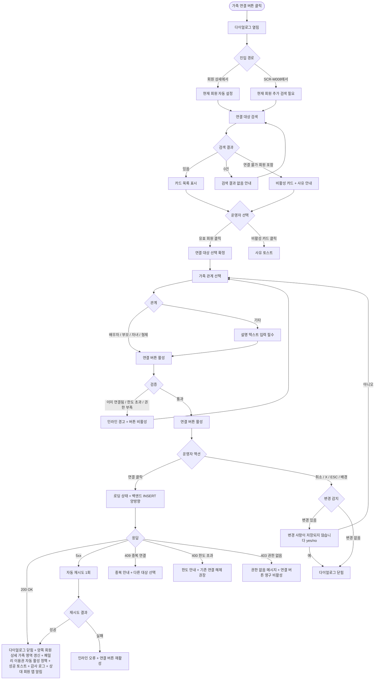

# DLG-M029 가족 연결 다이얼로그

## 1. 다이얼로그 메타 정보

이 문서는 가족 연결 다이얼로그에 대한 자기완결형 요구사항 정의서입니다. 다른 문서를 함께 보지 않아도 이 한 장만으로 다이얼로그의 호출 트리거, 화면 구성, 입력과 검증, 연결 후 동작, 권한별 처리, 예외 흐름, 그리고 가족 회원 운영 정책까지 모두 이해하고 구현할 수 있도록 작성합니다.

| 항목 | 값 |
|---|---|
| 작성일 | 2026-05-22 |
| 버전 | v1.0 |
| 상태 | 최신 통합본 반영 (정합화 완료) |
| 도메인 | D02 회원관리 |
| 다이얼로그 ID | DLG-M029 |
| 다이얼로그명 | 가족 연결 |
| 다이얼로그 유형 | 검색·선택형 다이얼로그 (Search + Pick Modal) |
| 우선순위 | P2 (확장 기능) |
| 기능코드 | MBR-02 (회원 상세), MBR-EXT-02 (가족 회원) |
| 계약코드 | MBR-02, MBR-EXT-02 |
| 부모 화면 | SCR-M004 회원 상세 페이지 (기본정보 탭), SCR-M008 가족 회원 페이지 |
| 호출 트리거 | 회원 상세의 기본정보 탭에서 "가족 연결" 버튼 클릭, 또는 SCR-M008에서 회원 연결 진입 |
| 후속 다이얼로그 | 없음 |

## 2. 다이얼로그 목적

가족 연결 다이얼로그는 같은 가족 관계인 두 회원을 시스템상 연결하는 작업을 처리하는 다이얼로그입니다. 가족 연결은 두 회원의 계정을 합치는 것이 아니라(그것은 병합 DLG-M028) 별도 독립된 두 회원이 가족이라는 관계를 가진다는 사실만 시스템에 기록합니다. 가족 연결된 회원들은 패밀리 이용권, 동반 출석, 가족 할인 같은 일부 혜택을 함께 사용할 수 있으며, 회원 상세에서 서로의 가족 정보가 표시되어 운영자가 가족 단위로 회원을 관리할 수 있게 됩니다.

운영 현장에서 이 다이얼로그는 다음 상황에서 사용됩니다. 첫째, 부부·부모·자녀가 같은 센터에 등록할 때 서로를 가족으로 연결하는 경우입니다. 둘째, 친구 소개로 형제·자매가 모두 등록한 후 가족 관계를 시스템에 등록하는 경우입니다. 셋째, 가족 패밀리 이용권을 구매한 회원들 간 연결을 설정하는 경우입니다. 넷째, 가족 할인 적용을 위해 관계를 시스템에 기록해야 하는 경우입니다. 어떤 경우든 운영자는 연결 대상 회원을 검색해 선택하고 가족 관계 종류를 지정해야 합니다.

## 3. 호출 트리거와 진입 경로

이 다이얼로그는 두 가지 부모 화면에서 호출됩니다. 첫 번째는 회원 상세 페이지(SCR-M004)의 기본정보 탭에 있는 "가족 연결" 버튼이며, 두 번째는 가족 회원 페이지(SCR-M008)에서 새 연결 추가 진입점입니다. 어느 경로로 호출되든 다이얼로그 동작은 동일하며, 다이얼로그가 닫힌 후 갱신되는 부모 화면 영역만 다릅니다.

회원 상세에서 호출된 경우 그 회원이 자동으로 "현재 회원"으로 설정되어 표시되고, 운영자는 연결 대상 회원만 검색·선택하면 됩니다. SCR-M008에서 호출된 경우 두 회원을 모두 검색·선택하는 모드가 활성화될 수 있으나, 기본 흐름은 회원 상세에서 호출하는 것이 권장됩니다.

## 4. UI 구성과 영역별 동작

다이얼로그는 화면 중앙에 가로 600px 내외(모바일 92%)로 표시됩니다. 검색 결과 영역 때문에 세로가 늘어날 수 있으며 최대 높이는 화면의 80%까지 가능합니다.

헤더에는 "가족 연결" 제목과 우측 X 버튼이 배치됩니다. 회원 상세에서 호출된 경우 보조 라벨로 현재 회원명이 표시됩니다.

본문 상단에는 "현재 회원" 카드가 표시됩니다. 카드에는 회원명·회원번호·연락처(마스킹)·현재 상태 배지가 표시되며, 이 카드는 읽기 전용입니다. 회원 상세에서 호출된 경우 이 카드가 자동으로 채워지며, SCR-M008에서 호출된 경우 추가 검색 영역이 노출되어 현재 회원도 선택해야 합니다.

그 아래에는 "연결할 회원 검색" 영역이 있습니다. 검색 입력 필드에서 이름 또는 전화번호로 검색할 수 있으며, 디바운스 300ms 후 자동 검색됩니다. 검색 결과는 카드 목록으로 표시되며 각 행에 회원 사진(없으면 이니셜), 회원명, 회원번호, 마스킹된 연락처, 현재 상태 배지, 이미 가족 연결이 있는 경우 가족 연결 배지가 표시됩니다.

검색 결과 카드를 클릭하면 그 회원이 연결 대상으로 선택되고, 검색 결과 영역이 접히면서 선택된 회원의 정보 카드가 강조되어 표시됩니다. 선택된 카드 우측에 "선택 해제" 버튼이 있어 다른 회원으로 변경 가능합니다.

검색 결과 카드 중 연결 불가 회원(탈퇴·삭제·미등록·자기 자신·이미 가족 연결되어 있는 회원)은 회색 톤으로 표시되고 클릭 시 사유가 토스트로 안내됩니다.

선택된 회원 카드 아래에는 가족 관계 선택 영역이 있습니다. 라디오 버튼으로 가족 관계 종류를 선택하며, 선택지는 배우자, 부모, 자녀, 형제·자매, 기타입니다. "기타" 선택 시 관계 설명을 자유 텍스트(최대 50자)로 입력할 수 있는 필드가 추가로 노출됩니다.

가족 관계는 양방향으로 자동 설정됩니다. 예를 들어 A를 현재 회원으로 두고 B를 자녀로 선택하면, B의 회원 상세에서는 A가 부모로 자동 표시됩니다. 배우자·형제·자매는 양쪽이 동일한 관계로 설정되고, 부모·자녀는 양쪽이 반대 관계로 설정됩니다.

다이얼로그 하단에는 액션 버튼이 우측 정렬로 배치됩니다. 좌측 취소 버튼, 우측 "연결" 버튼이 놓이며, 연결 버튼은 연결 대상 회원이 선택되고 가족 관계가 지정된 경우에 활성화됩니다.

## 5. 입력 필드와 검증

검색어는 최소 2자 이상 50자 이하의 한글·영문·숫자만 허용됩니다. 디바운스 300ms 후 자동 검색됩니다.

연결 대상 회원 선택은 필수이며, 한 번에 한 명만 선택 가능합니다. 다음 조건을 만족하지 않는 회원은 연결 불가입니다. 첫째, 현재 회원과 다른 회원이어야 합니다(자기 자신 차단). 둘째, 활성·만료예정·만료임박·만료·홀딩 상태여야 합니다(탈퇴·삭제·미등록 차단). 셋째, 이미 현재 회원과 가족 연결이 되어 있지 않아야 합니다(중복 연결 차단). 넷째, 회원이 다른 지점 소속인 경우 본사 권한자만 연결할 수 있습니다(같은 브랜드 내라면 지점 무관).

가족 관계는 필수 선택이며, 라디오 5개 중 정확히 하나를 선택해야 합니다. "기타" 선택 시 자유 텍스트가 최소 2자 이상이어야 합니다.

한 회원이 가질 수 있는 가족 연결의 최대 수는 운영 정책에 따라 결정됩니다. 기본값은 10명이며, 한도 초과 시 "이 회원의 가족 연결이 한도에 도달했어요. 기존 연결을 해제한 후 추가해 주세요" 안내가 표시되고 연결 버튼이 비활성화됩니다.

같은 가족 관계의 중복(예: 한 회원에게 배우자가 두 명) 허용 여부는 센터 정책으로 결정됩니다. 기본은 차단(배우자·부모는 1명만, 자녀·형제·자매는 다수 허용)이며, 차단 정책이 적용되면 중복 시 안내가 표시됩니다.

## 6. 연결/취소 후 동작

연결 버튼을 누르면 다이얼로그가 로딩 상태로 전환되어 두 버튼이 비활성화되고 연결 버튼 안에 스피너가 표시됩니다. 백엔드에는 현재 회원 ID, 연결 대상 회원 ID, 가족 관계, 기타 설명(있는 경우), 운영자 ID가 포함된 요청이 전송됩니다.

백엔드는 트랜잭션으로 가족 연결 테이블에 두 행을 INSERT합니다(양방향 관계). 가족 연결 ID는 한 그룹으로 묶이며, 한 그룹 내 모든 회원은 동일 family_group_id를 공유합니다. 감사 로그에 actor_id, member_a, member_b, relationship, action=LINK_FAMILY, timestamp가 비동기 기록됩니다.

200 OK 응답을 받으면 다이얼로그가 닫히고, 부모 화면(회원 상세 기본정보 탭)의 가족 정보 영역에 새 연결이 즉시 표시됩니다. 우측 상단에 녹색 토스트("[대상 회원명]과 [관계]로 연결했어요")가 5초 표시됩니다.

연결된 두 회원 모두의 회원 상세에서 서로의 가족 정보가 표시되며, 한 회원의 가족 정보 영역에 다른 회원이 카드 형태로 추가됩니다. 가족 패밀리 이용권이 적용된 경우 자동으로 양쪽 회원에게 혜택이 활성화될 수 있습니다(센터 정책에 따라).

취소 버튼·X·ESC·배경 클릭으로 닫을 때 검색이나 선택이 일부라도 있는 경우 "변경 사항이 저장되지 않습니다. 닫으시겠습니까?" yes/no 확인이 표시됩니다.

## 7. 부모 화면 갱신과 후속 처리

회원 상세에서 호출된 경우, 기본정보 탭의 가족 정보 영역에 새 연결이 카드 형태로 추가됩니다. 카드에는 대상 회원의 이름·관계·연결 일자·연결 등록자가 표시됩니다.

SCR-M008 가족 회원 페이지에서 호출된 경우, 가족 그룹 목록에 새 연결이 즉시 반영됩니다.

상대 회원의 회원 상세에서도 가족 정보 영역에 동일하게 연결이 표시됩니다.

감사 로그(SCR-097)에 비동기로 5초 안에 기록됩니다.

가족 패밀리 이용권 적용은 센터 정책에 따라 자동 또는 수동으로 처리됩니다. 자동 정책에서는 연결 즉시 양쪽 회원에게 가족 혜택이 활성화되고, 수동 정책에서는 운영자가 이용권 적용을 별도로 처리해야 합니다.

DLG-M019 양도 처리 다이얼로그에서 검색 시 가족 회원이 우선 노출되어, 가족 간 양도 운영이 효율적으로 처리됩니다.

회원 앱(있는 경우)에서 회원이 자신의 가족 정보를 직접 조회할 수 있으며, 가족 회원 사이의 동반 출석·할인 적용 같은 기능이 노출됩니다.

## 8. 권한별 처리

가족 연결은 회원 관계 데이터에 영향을 주지만 직접 자산 이동은 없으므로, 권한 제한은 상대적으로 완화됩니다.

슈퍼관리자(superAdmin), 본사 최고관리자(primary), 센터장(owner), 매니저(manager), 스태프(staff), 프런트(front)는 가족 연결 권한이 있습니다. 자기 지점 회원 간 연결만 가능하며, 다른 지점 회원 연결은 본사 권한자만 가능합니다.

FC(fc), 트레이너(trainer)는 본인 담당 회원에 한해서만 연결을 수행할 수 있도록 제한될 수 있으며, 센터 정책에 따라 권한 부여 여부가 결정됩니다.

읽기 전용(readonly)은 가족 연결 권한이 없어 부모 화면의 연결 버튼이 보이지 않습니다.

본사 통합 모드에서 다른 지점 회원과의 연결은 본사 권한자만 처리 가능하며, 일반 지점 운영자는 자기 지점 내 연결만 가능합니다.

권한 부족 이벤트는 모두 감사 로그에 기록됩니다.

가족 연결 해제는 별도 흐름(이 다이얼로그의 범위 밖)으로 처리되며, 회원 상세의 가족 정보 카드에서 해제 액션을 통해 수행할 수 있습니다. 해제 권한은 매니저 이상으로 제한됩니다.

## 9. 토스트와 알림

연결 성공 시 우측 상단에 녹색 토스트("[대상 회원명]과 [관계]로 연결했어요")가 5초 표시됩니다. 토스트 클릭 시 상대 회원의 회원 상세로 이동합니다.

연결 실패 시 사유별 빨강 토스트가 표시됩니다. "권한이 없어요"(403), "이미 가족으로 연결되어 있어요"(409), "가족 연결 한도에 도달했어요"(400), "네트워크 오류가 발생했어요"(5xx) 형태입니다.

가족 연결 시 상대 회원에게 알림 발송 여부는 센터 정책으로 결정됩니다. 알림 발송 정책에서는 상대 회원의 회원 앱에 "[현재 회원명]과 가족 연결되었습니다" 푸시가 발송됩니다.

## 10. 예외 처리

네트워크 오류(5xx, timeout) 발생 시 다이얼로그 안에 인라인 오류가 표시되고 연결 버튼이 다시 활성화됩니다. 자동 재시도 1회 후에도 실패하면 운영자가 수동 재시도해야 합니다.

동시 편집 충돌(409)이 발생하면 "다른 운영자가 동시에 처리했어요" 메시지가 표시됩니다. 이미 같은 두 회원 간 연결이 생성된 경우 후행 요청은 차단됩니다.

연결 대상 회원이 그 사이에 탈퇴·삭제·이관 처리된 경우 "대상 회원 정보가 변경되었어요. 다시 검색해 주세요" 메시지가 표시되며 검색 영역으로 돌아갑니다.

가족 연결 한도 초과(400) 시 한도 안내와 기존 연결 해제 권장이 표시됩니다.

권한 부족(401·403) 응답 시 권한 없음 메시지가 표시되고 연결 버튼이 영구 비활성화됩니다.

본사 통합 모드에서 RLS 위반이 감지되면 검색 결과가 비어 있는 상태로 표시되고, 슈퍼관리자에게만 디버그 로그로 누락 사실이 전달됩니다.

가족 그룹이 너무 커지는 경우(예: 10명 이상이 한 가족 그룹으로 묶이는 경우) 성능 또는 운영 효율 문제가 발생할 수 있으므로 인라인 경고가 표시되지만 차단되지는 않습니다.

## 11. 다이얼로그 생명주기

## 12. 관련 운영 정책

가족 회원은 마케팅·부가 혜택 연동까지 확정되기 전까지는 독립 회원 구조를 유지하고 관계만 표시한다는 운영 원칙을 따릅니다(운영기획서 7항). 즉 가족 연결이 두 회원의 계정을 합치는 것이 아니라, 별도 독립 계정인 두 회원 사이에 "가족"이라는 관계만 시스템에 기록하는 것입니다. 이는 회원 식별과 매출 귀속을 단순하게 유지하면서도 가족 단위 운영의 일부 혜택(패밀리 이용권·동반 출석·가족 할인)을 지원하기 위한 정책입니다.

가족 연결은 양방향으로 자동 설정됩니다. A가 B를 자녀로 연결하면 B의 회원 상세에는 A가 부모로 자동 표시됩니다. 배우자·형제·자매는 동일 관계, 부모·자녀는 반대 관계가 자동 매핑됩니다. 운영자가 한 방향만 등록해도 양쪽이 모두 갱신되어 일관성이 유지됩니다.

같은 가족 관계 중복 허용 여부는 센터 정책으로 결정됩니다. 일반적으로 배우자·부모는 1명만 허용되고 자녀·형제·자매는 다수가 허용됩니다. 비전형적 가족 구성(예: 재혼·입양)은 "기타" 관계로 등록하고 자유 텍스트로 설명을 남길 수 있습니다.

한 회원의 가족 연결 한도는 기본 10명이며, 이는 시스템 성능과 운영 가독성 사이의 균형점입니다. 그 이상의 큰 가족 그룹은 운영상 드물고, 가독성 면에서도 회원 상세 가족 영역이 지나치게 길어질 수 있으므로 한도가 설정됩니다.

가족 패밀리 이용권의 자동 활성 여부는 센터 정책으로 결정됩니다. 자동 정책에서는 연결 즉시 양쪽 회원에게 혜택이 활성화되고, 수동 정책에서는 운영자가 별도로 이용권을 적용해야 합니다. 자동 정책은 운영 편의를 높이지만, 수동 정책은 혜택 적용 통제를 강화합니다.

가족 간 양도(DLG-M019)는 우선 검색 노출 정책으로 효율화됩니다. 가족 연결된 회원은 양도 다이얼로그의 검색 결과 상단에 표시되어 운영자가 쉽게 선택할 수 있습니다. 이는 가족 간 양도가 가장 빈번한 양도 사유라는 운영 현실을 반영한 결과입니다.

가족 연결 해제는 별도 흐름이며 매니저 이상 권한자만 처리할 수 있습니다. 해제 시에도 양방향이 동시에 해제되며, 가족 패밀리 이용권 혜택이 자동 적용 정책으로 활성화되어 있었다면 해제와 동시에 혜택도 해제됩니다.

다른 지점 회원과의 가족 연결은 본사 권한자만 처리 가능합니다. 이는 지점 간 회원 관계 데이터의 일관성을 본사가 통제해야 한다는 정책의 결과이며, 일반 지점 운영자는 자기 지점 내 회원끼리만 연결할 수 있습니다.

회원 병합(DLG-M028)과 가족 연결은 명확히 구분됩니다. 병합은 두 계정을 하나로 합치고 한 쪽을 영구 삭제하지만, 가족 연결은 두 독립 계정 사이에 관계만 추가합니다. 운영자가 두 행위를 혼동하지 않도록 다이얼로그 안내에서 명확히 구분되며, 가족 연결 다이얼로그에는 "이 작업은 회원 병합이 아니며, 두 계정은 그대로 유지됩니다"라는 보조 안내가 표시됩니다.

가족 연결 이벤트는 감사 로그에 비동기로 5초 안에 기록됩니다. 본사는 지점별 가족 연결 빈도와 관계 분포를 모니터링하며, 데이터 품질과 운영 가이드 자료로 활용합니다.

회원 앱(있는 경우)에서는 회원이 자신의 가족 정보를 조회할 수 있고, 가족 회원과의 동반 출석·할인 적용 같은 혜택이 노출됩니다. 가족 연결의 추가·해제는 운영자만 수행할 수 있고, 회원이 직접 자기 가족을 등록·해제하는 흐름은 별도 정책(회원 셀프 등록 허용 여부)에 따라 결정됩니다.

가족 연결 정책이 비활성화된 센터에서는 부모 화면의 가족 연결 버튼 자체가 노출되지 않으며, 이 다이얼로그도 호출되지 않습니다. 가족 회원 기능을 사용할지 여부는 센터 설정(SCR-080)에서 결정됩니다.
