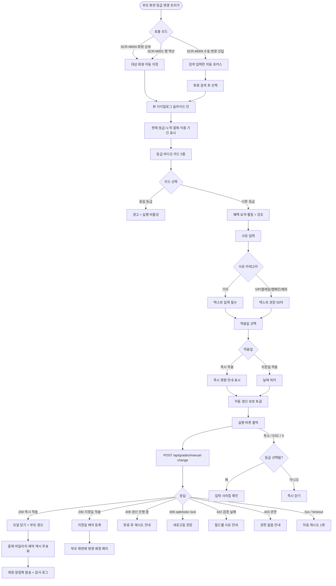

# DLG-M030 등급 변경 다이얼로그

## 1. 다이얼로그 메타 정보

이 문서는 등급 변경 다이얼로그에 대한 자기완결형 요구사항 정의서입니다. 다른 문서를 함께 보지 않아도 이 문서 한 장만으로 다이얼로그의 모든 영역, 모든 버튼, 모든 권한, 모든 예외 처리, 그리고 이 다이얼로그를 지탱하는 운영 정책까지 전부 이해하고 구현할 수 있도록 작성합니다.

| 항목 | 값 |
|---|---|
| 작성일 | 2026-05-22 |
| 버전 | v1.0 |
| 상태 | 최신 통합본 반영 (정합화 완료) |
| 도메인 | D02 회원관리 |
| 다이얼로그 ID | DLG-M030 |
| 다이얼로그명 | 등급 변경 (수동 등급 조정) |
| 다이얼로그 유형 | 입력형 모달 (Form Modal, 등급 선택·사유 입력·적용일·자동 갱신 보호 옵션) |
| 라우트 (URL) | 단독 URL 없음 (부모 화면 위 호출) |
| 플랫폼 | 데스크톱(기본), 태블릿, 모바일 |
| 우선순위 | P1 (출시 필수, 등급 운영 보조) |
| 기능코드 | MBR-02 (회원 상세), MBR-EXT-03 (회원 등급 체계 관리) |
| 계약코드 | MBR-EXT-03 |
| 계약 상태 | 계약 범위 본기능 |
| 부모 기능 prefix | MBR |
| Lv1 코드 | MBR-EXT-03 |
| 부모 화면 | SCR-M004 회원 상세 (기본정보 탭의 등급 변경 버튼), SCR-M009 등급 관리 (수동 변경 진입), 일부 SCR-M001 회원 목록의 행 액션 |
| 호출되는 다이얼로그 | 본 다이얼로그가 다른 다이얼로그를 호출하지 않음 |

## 2. 다이얼로그 개요와 목적

등급 변경 다이얼로그는 자동 등급 산정(누적 결제·이용 기간·방문 횟수 기반의 매월/분기/연 자동 갱신)과 별개로, 운영자가 특정 회원의 등급을 수동으로 조정하기 위한 입력형 모달입니다. VIP 강제 부여·클레임 보상·기획 캠페인 보상·전사 정책 예외 같은 특수 케이스를 처리하며, 등급 자동 산정 규칙을 우회하더라도 사유 기록과 감사 로그를 통해 추적성이 보장되도록 설계됩니다.

이 다이얼로그가 다루는 운영 흐름은 다양합니다. 본사 슈퍼관리자가 클레임 발생 회원에게 VIP 보상으로 등급을 한 단계 올려주고, Owner(지점장)이 특정 캠페인 보상으로 다이아몬드 등급을 부여하며, 본사 최고관리자가 분기 등급 정책 개편 직후 일부 충성 회원에게 보호 정책으로 자동 갱신 무시 옵션을 활성화합니다. 본사 정책으로 보장된 등급은 다음 갱신 주기에도 자동 강등이 발생하지 않도록 보호 기간이 적용됩니다.

이 다이얼로그는 단순 등급 선택이 아니라, 등급별 혜택 요약 미리보기·사유 필수 기록·적용일 즉시/지정 분기·자동 갱신 보호 옵션·동시 갱신 배치 충돌 차단·optimistic lock·감사 로그 before/after 기록·외부 결제·마일리지 시스템 캐시 무효화까지 모두 반영된 등급 데이터 무결성 안전망으로 동작합니다.

## 3. 호출 경로와 부모 화면

이 다이얼로그는 사용자의 명시적 클릭으로만 호출되며 호출 경로는 다음 세 가지가 있습니다.

첫 번째 경로는 SCR-M004 회원 상세 페이지의 기본정보 탭에서 "등급 변경" 버튼을 누르는 흐름입니다. 이 경우 본 다이얼로그는 현재 회원의 등급 정보(현재 등급·현재 누적 결제·자동 갱신 보호 상태)를 시작점으로 잡고, 새 등급을 선택해 변경하는 모드로 열립니다.

두 번째 경로는 SCR-M009 등급 관리 페이지의 "수동 변경" 진입 버튼을 누르는 흐름입니다. 이 경우 본 다이얼로그는 회원 검색 단계를 거쳐 대상 회원을 선택한 후 등급을 조정합니다. 회원 검색 단계는 본 다이얼로그 본문 상단에 통합되어 별도 모달을 추가로 띄우지 않습니다.

세 번째 경로는 SCR-M001 회원 목록의 행 액션 메뉴에서 "등급 변경"을 선택하는 흐름입니다. 한 회원에 대해 빠르게 등급을 변경하는 단일 모드로 본 다이얼로그가 열리며, 일괄 모드는 본 다이얼로그가 아닌 SCR-M009의 즉시 적용 흐름이 담당합니다.

본 다이얼로그가 떠 있는 부모 화면은 사용자의 의도를 확인할 때까지 어두운 백드롭으로 가려지고, 모달 확인 성공 후에는 부모 화면이 즉시 갱신됩니다. SCR-M004는 헤더 등급 배지가 새 값으로 전환되고, SCR-M009는 등급별 회원 수 분포가 즉시 갱신되며 SCR-M001은 해당 행의 등급 컬럼이 갱신됩니다.

본 다이얼로그에서 빠져나가는 경로는 두 가지입니다. 실행 버튼을 누르면 등급 변경이 저장된 후 모달이 닫히고 부모 화면이 갱신됩니다. 취소를 누르면 모달이 닫히고 부모 화면이 변경 없이 유지되며 사용자가 입력 중이던 등급·사유·적용일·보호 옵션 선택값은 폐기됩니다.

## 4. 모달 구성요소

부모 화면 위에 어두운 백드롭이 깔리고 화면 중앙에 너비 약 480~560px의 모달 카드가 떠 있습니다. 모달 본문이 길어지면 자체 스크롤이 적용됩니다. 모바일에서는 풀스크린에 가까운 폭으로 펼쳐집니다.

모달 헤더 좌측에는 등급 배지 아이콘과 함께 "등급 변경"이라는 제목이 굵은 글씨로 표시됩니다. 헤더 우측에는 닫기(X) 버튼이 배치되어 취소와 동일하게 처리됩니다.

본문 가장 위에는 대상 회원 정보 카드(읽기 전용)가 표시됩니다. 회원 사진·이름·회원번호·소속 지점·현재 등급 배지·현재 누적 결제 금액·현재 이용 기간(개월)·현재 누적 방문 횟수·자동 갱신 보호 상태(있다면 만료일)가 한 영역에 모입니다. SCR-M009에서 호출된 경우에는 회원 정보 카드 위쪽에 회원 검색 입력란이 추가되어 사용자가 대상을 선택할 수 있고, 선택 후에는 회원 정보 카드가 그 자리에 채워집니다.

그 아래에 새 등급 선택 영역이 있습니다. 등급 옵션은 브론즈·실버·골드·플래티넘·다이아몬드의 5종이며 라디오 카드 형태로 펼쳐집니다. 각 카드를 호버하면 그 등급의 혜택 요약(마일리지 적립률·이용권 할인율·부가 서비스 우선 배정·생일 특별 혜택)이 카드 아래 또는 우측 영역에 펼쳐져 사용자가 변경의 효과를 미리 확인할 수 있습니다. 사용자가 카드를 선택하면 선택된 카드가 강조 색상으로 전환되고 혜택 요약이 고정 표시됩니다.

새 등급 선택 영역 아래에는 변경 사유 입력란이 있습니다. 텍스트 박스(권장 50자 이상)와 사전 정의된 사유 목록 드롭다운이 함께 제공되며 둘 중 하나는 반드시 입력되어야 합니다. 사전 정의 사유는 VIP 보상·클레임 보상·캠페인 보상·정책 예외·기타이며, "기타" 선택 시 텍스트 입력란이 필수가 됩니다.

그 아래에 적용일 선택 라디오가 있습니다. 옵션은 "즉시 적용"과 "지정일 적용" 두 가지이며, 지정일 선택 시 날짜 피커가 우측에 표시됩니다. 기본값은 "즉시 적용"이며 안전한 운영을 위해 즉시 적용 선택 시 본문 하단에 부드러운 톤의 영향 안내(예: "혜택이 결제·마일리지에 즉시 반영됩니다")가 추가됩니다.

자동 갱신 보호 옵션은 토글 형태로 본문 하단에 배치됩니다. 활성화 시 보호 만료 기간(3개월/6개월/무기한)이 함께 표시되고 기본값은 3개월입니다. 보호가 활성화되면 다음 자동 갱신 배치가 이 회원의 등급을 강등하지 않습니다.

본문 아래에는 좌측에 "취소" 보조 버튼, 우측에 "실행" 주요 액션 버튼이 가로로 배치됩니다. "실행" 버튼은 새 등급이 선택되고 사유가 입력된 경우에만 활성화됩니다.

ESC 키와 백드롭 클릭은 취소와 동일하게 모달을 닫고 부모 화면이 유지됩니다. 키보드 포커스 트랩이 적용되어 Tab 키로 포커스가 모달 안의 요소(검색 입력란·라디오 카드·사유 입력·적용일 라디오·보호 토글·두 버튼) 사이만 순환합니다.

## 5. 동작 흐름

사용자가 부모 화면에서 등급 변경 트리거를 누르면 본 다이얼로그가 슬라이드 인 또는 페이드 인 애니메이션으로 부모 화면 위에 표시됩니다. SCR-M004·SCR-M001에서 호출된 경우 대상 회원이 이미 정해져 있어 회원 정보 카드가 즉시 표시되고, SCR-M009에서 호출된 경우 검색 입력란에 자동 포커스가 배치되어 사용자가 대상을 선택할 수 있습니다.

사용자가 새 등급 카드를 클릭하면 그 등급이 강조 색상으로 전환되고 혜택 요약이 고정 표시됩니다. 현재 등급과 같은 등급을 선택하면 "현재와 같은 등급입니다"라는 경고가 인라인으로 표시되며 "실행" 버튼이 비활성화됩니다.

사용자가 사유를 입력하고 적용일과 보호 옵션을 선택한 후 "실행" 주요 버튼을 누르면 버튼이 비활성화되고 안에 스피너가 표시됩니다. 클라이언트는 `POST /api/grades/manual-change` API를 호출하며 요청 본문에 회원 ID·새 등급·사유·적용일·자동 갱신 보호 만료일·현재 등급의 `version`이 포함됩니다. 백엔드는 `version` 일치를 검증하고 갱신 배치가 진행 중이 아닌지 확인한 후 등급을 변경합니다.

응답이 200이면 모달이 닫히고 부모 화면이 즉시 갱신됩니다. SCR-M004는 헤더 등급 배지가 새 값으로 전환되고, SCR-M009는 등급별 회원 수 분포가 5분 캐시 무효화 후 다음 조회 시 새로 계산되며, SCR-M001은 해당 행의 등급 컬럼이 갱신됩니다. 우측 상단에 "OO 회원의 등급을 변경했어요" 토스트가 5초간 표시됩니다. 즉시 적용 흐름이면 결제·마일리지·예약 시스템의 캐시가 동시에 무효화되어 다음 결제 시점부터 새 등급의 혜택이 적용됩니다. 지정일 흐름이면 지정일 새벽 배치가 등급 전환을 수행하며 사용자에게는 "지정일에 적용됩니다" 안내가 추가됩니다. 회원 본인에게는 카카오 알림톡으로 "등급이 변경되었습니다" 안내가 발송됩니다(알림 발송 옵션 활성 시).

응답이 409이면 "다른 운영자가 동시에 등급을 수정했어요" 또는 "갱신 진행 중입니다. 완료 후 다시 시도해주세요"라는 안내가 모달 본문에 표시됩니다. 응답이 422이면 등급 옵션 미선택·사유 미입력·동일 등급 선택 같은 검증 실패 사유가 인라인 메시지로 분기됩니다. 응답이 403이면 권한 부족 안내가 표시되며, 응답이 5xx 또는 timeout이면 자동 재시도 1회 후 사용자 액션을 기다립니다.

사용자가 "취소"를 누르면 모달이 즉시 닫히고 부모 화면이 그대로 유지됩니다. 입력 중이던 모든 값은 폐기됩니다. ESC 키, 백드롭 클릭, 닫기(X) 버튼도 모두 취소와 동일하게 처리되지만 사용자가 등급을 이미 선택한 상태에서 닫으려 하면 "입력 사항이 사라집니다. 닫으시겠어요?" 확인이 한 번 더 표시됩니다.

## 6. 버튼·아이콘·링크 액션 전체 정의

실행 버튼(주요 액션)은 모달 본문 우측 하단에 배치됩니다. 새 등급이 선택되고 사유가 입력된 경우에만 활성화되며, 클릭 시 `POST /api/grades/manual-change` API가 호출됩니다. 진행 중에는 비활성화 상태로 전환되며 응답이 돌아오기 전 중복 클릭은 자동 차단됩니다.

취소 버튼(보조 액션)은 본문 좌측 하단에 배치됩니다. 클릭 시 모달이 즉시 닫히고 부모 화면이 변경 없이 유지됩니다. 등급이 이미 선택된 상태이면 확인 한 번이 추가로 표시됩니다.

닫기(X) 버튼은 모달 헤더 우측에 배치됩니다. 취소와 동일하게 처리되며 등급 선택 상태에서는 추가 확인이 표시됩니다.

ESC 키와 백드롭 클릭은 취소와 동일하게 처리됩니다.

새 등급 라디오 카드(5종)는 클릭 가능합니다. 클릭하면 그 등급이 강조되고 혜택 요약이 펼쳐집니다. 현재 등급과 같은 카드 선택은 경고와 함께 "실행" 버튼이 비활성화됩니다.

사유 텍스트 입력란은 최대 500자까지 입력 가능하며, 권장 50자 미만 입력 시 노랑 경고("권장 50자 이상")가 표시되지만 진행은 허용됩니다(강제 아님). 사전 정의 사유 드롭다운에서 "기타"를 선택하면 텍스트 입력란이 필수로 전환됩니다.

적용일 라디오는 "즉시 적용"과 "지정일 적용" 중 단일 선택입니다. "지정일 적용" 선택 시 우측 날짜 피커가 활성화되어 오늘 이후 날짜를 선택할 수 있습니다. 과거 날짜 선택은 차단됩니다.

자동 갱신 보호 토글은 활성/비활성을 전환합니다. 활성화 시 보호 만료 기간 드롭다운(3개월/6개월/무기한)이 함께 표시되며 기본값은 3개월입니다.

회원 검색 입력란(SCR-M009 호출 모드에서만 노출)은 회원 이름 또는 전화번호를 받으며 300ms 디바운스가 적용됩니다. 최소 2자 이상, 최대 50자까지 입력 가능합니다.

브라우저 뒤로가기는 모달이 떠 있는 동안 라우터 변경을 시도하지만 본 다이얼로그가 z-index로 가장 위에 떠 있으므로 뒤로가기로 모달이 닫히지 않습니다.

모든 버튼은 응답이 돌아오기 전까지 자동 비활성화되어 중복 요청이 차단됩니다.

## 7. 호출되는 다이얼로그 동작

등급 변경 다이얼로그는 다른 다이얼로그를 호출하지 않습니다.

다음과 같은 관계가 있습니다.

DLG-002 이탈 경고 다이얼로그는 본 다이얼로그가 떠 있는 동안에는 트리거되지 않습니다. 본 다이얼로그가 차단형으로 동작해 라우터 변경이 일어나지 않기 때문입니다.

DLG-003 삭제 확인 다이얼로그는 본 다이얼로그와 무관합니다. 등급 변경은 데이터 제거가 아니라 변경 흐름입니다.

DLG-004 저장 확인 다이얼로그는 본 다이얼로그와 별개로 동작합니다. 본 다이얼로그는 도메인 전용 입력형 모달이며, 사유 입력과 적용일 옵션이 본 다이얼로그 자체에서 받아지므로 추가 저장 확인 단계가 별도로 표시되지 않습니다.

DLG-M001 회원 상태 변경 다이얼로그는 회원의 상태(활성·홀딩·정지·탈퇴)를 바꾸는 흐름이며, 본 다이얼로그(등급 변경)와는 완전히 분리된 별개 흐름입니다.

DLG-M029 가족 연결 다이얼로그는 가족 관계 형성 후 누적 결제 합산으로 인한 등급 재산정이 발생할 수 있지만, 그 재산정은 본 다이얼로그를 거치지 않고 백엔드 배치(병합 트랜잭션 직후 즉시 재산정)가 자동 처리합니다.

SCR-M009 등급 관리의 정책 수정 흐름은 본 다이얼로그가 아닌 SCR-M009 자체의 저장 버튼과 일괄 적용 흐름이 담당합니다. 본 다이얼로그는 회원 한 명에 대한 수동 등급 조정에 한정됩니다.

## 8. 토스트와 안내 메시지

성공 토스트는 등급 변경이 완료된 직후 부모 화면 우측 상단에 녹색 계열로 5초간 표시됩니다. 메시지 형식은 "OO 회원의 등급을 변경했어요" 또는 "OOO 회원이 골드로 승급되었습니다"입니다. 지정일 적용 흐름이면 "지정일에 적용됩니다" 보조 안내가 추가됩니다.

실패 토스트는 본 다이얼로그 본문에 인라인 메시지로 표시됩니다. 409 동시 편집·갱신 진행 중·422 등급 옵션·사유 검증 실패·403 권한 부족 같은 사유별로 메시지가 분기됩니다. 자동 재시도가 가능한 네트워크 오류는 1회까지 자동으로 다시 시도된 다음 사용자 액션을 기다립니다.

확인 팝업은 사용자가 등급을 이미 선택한 상태에서 모달을 닫으려 하면 "입력 사항이 사라집니다. 닫으시겠어요?" yes/no 형태로 한 번 표시됩니다.

혜택 요약 미리보기는 사용자가 새 등급 카드를 호버 또는 선택한 시점에 카드 아래 또는 우측 영역에 펼쳐져 표시됩니다. 마일리지 적립률·이용권 할인율·부가 서비스 우선 배정·생일 특별 혜택의 4종이 한눈에 보이도록 정리됩니다.

영향 안내는 "즉시 적용" 선택 시 본문 하단에 부드러운 톤으로 "혜택이 결제·마일리지·예약에 즉시 반영됩니다" 안내가 추가됩니다. 외부 시스템 캐시 무효화에 5분 정도 시차가 있을 수 있다는 보조 안내도 함께 표시됩니다.

회원 알림 안내는 등급 변경 완료 시 본 다이얼로그 닫힘 직후 부모 화면 토스트로 "회원 본인에게 알림톡이 발송되었어요" 보조 안내가 표시됩니다(알림 발송 옵션 활성 시). 알림 발송 옵션이 비활성화되어 있으면 표시되지 않습니다.

오프라인 안내는 본 다이얼로그가 떠 있는 동안 네트워크가 단절되면 모달 본문에 작은 배너로 "오프라인 상태입니다. 네트워크 복구 후 변경이 가능합니다" 안내가 표시되고 실행 버튼이 비활성화됩니다. 네트워크 복구 시 자동으로 활성화됩니다.

## 9. 데이터 흐름과 외부 연동

본 다이얼로그가 표시되기 직전에 부모 화면이 대상 회원 ID·현재 등급·현재 누적 결제·이용 기간·방문 횟수·자동 갱신 보호 상태를 props로 전달합니다. SCR-M009 호출 모드에서는 회원 ID가 없는 채로 모달이 열리고 검색을 통해 대상이 선택됩니다.

실행 버튼 클릭 시 클라이언트는 `POST /api/grades/manual-change` API를 호출합니다. 요청 본문에는 `member_id`·`new_grade`·`reason`·`reason_category`(VIP_REWARD·CLAIM·CAMPAIGN·POLICY_EXCEPTION·OTHER)·`apply_at`(immediate 또는 ISO 날짜)·`protection`(off 또는 만료일)·현재 등급의 `version`이 포함됩니다.

백엔드는 다음 검증을 수행합니다. 첫째, 회원의 현재 등급 `version`이 일치하는지(optimistic lock). 둘째, 등급 갱신 배치가 진행 중이 아닌지(`grades/recalc-status` 확인). 셋째, 사용자의 권한이 수동 변경이 가능한 역할인지(슈퍼관리자·본사 최고관리자만). 넷째, 새 등급이 정의된 5종 중 하나인지. 다섯째, 사유 필드가 비어 있지 않은지.

응답 성공 시 백엔드는 회원의 등급을 새 값으로 업데이트하고, 자동 갱신 보호 만료일을 함께 저장합니다. 즉시 적용 흐름이면 결제(SCR-S003)·마일리지(SCR-074)·예약 시스템의 캐시 무효화 이벤트가 발행되어 다음 결제·적립 시점부터 새 등급의 혜택이 즉시 반영됩니다. 지정일 적용 흐름이면 백엔드의 일일 새벽 배치가 지정일에 등급 전환을 수행합니다.

회원 본인에게는 카카오 알림톡 또는 SMS로 등급 변경 안내가 발송됩니다(알림 발송 옵션 활성 시). 알림톡 발송 실패 시 등급 변경 자체는 성공으로 처리되고, 운영자에게 부모 화면 토스트로 "회원 알림 발송에 실패했어요" 안내가 표시되어 수동 안내가 가능하도록 합니다.

응답 실패 시 사유별로 분기됩니다. 409 동시 편집은 본문에 충돌 안내와 새로고침 후 재시도 권장, 409 갱신 진행 중은 "갱신 완료 후 다시 시도해주세요" 안내, 422 검증 실패는 필드별 인라인 안내, 403 권한 부족은 권한 안내, 5xx 또는 timeout은 자동 재시도 1회 후 사용자 액션 대기로 처리됩니다.

감사 로그는 모든 수동 등급 변경 이벤트가 SCR-097 감사 로그에 비동기로 INSERT됩니다. 기록 필드는 `actor_id`, `action=GRADE_MANUAL_CHANGE`, `member_id`, `before`(이전 등급·이전 보호 상태 JSON), `after`(새 등급·새 보호 상태 JSON), `reason`, `reason_category`, `apply_at`, `timestamp`입니다.

알림 센터(NFR-19)는 등급 변경 결과를 운영자에게도 알림합니다. 본사 통합 모드에서는 본사 권한자가 지점장의 수동 등급 변경을 관찰할 수 있도록 알림이 함께 발송됩니다.

자동 갱신 보호 정책은 회원의 `grade_protection_until` 필드에 만료일이 저장되며, 매월 1일/분기/연 자동 갱신 배치가 이 필드를 검사해 보호 만료일 이전인 회원은 자동 강등 대상에서 제외합니다. 보호 만료 시점에 자동 재계산 대상에 포함되며, 변동 발생 시 회원과 운영자에게 알림이 발송됩니다.

회원 이관(MBR-ADV-02)·회원 병합(MBR-EXT-01)은 본 다이얼로그와 직접 연동되지 않으나, 사후 동작을 보장합니다. 이관 시 등급과 보호 상태가 함께 이전되며, 병합 시 누적 결제 합산 후 등급이 즉시 재산정됩니다.

## 10. 화면 상태와 예외 처리

표시 상태는 다이얼로그가 부모 화면 위에 떠 있는 기본 상태입니다. 대상 회원 정보 카드와 등급 라디오 카드 5종이 표시되며 사용자의 선택을 기다립니다.

검색 중 상태(SCR-M009 호출 모드)는 회원 검색 입력란에서 디바운스 후 검색 API가 호출되는 상태로, 결과 영역에 스켈레톤 또는 작은 스피너가 표시됩니다.

등급 선택됨 상태는 사용자가 라디오 카드를 클릭해 새 등급을 선택한 상태로, 혜택 요약이 펼쳐지고 카드가 강조 색상으로 전환됩니다.

사유 입력됨 상태는 사유 텍스트가 입력되거나 사전 정의 사유 드롭다운에서 선택한 상태로, "실행" 버튼이 활성화됩니다.

처리 중 상태는 "실행" 버튼을 누른 직후로, 주요 버튼이 비활성화되고 안에 스피너가 표시됩니다.

완료 상태는 등급 변경이 성공적으로 처리되어 모달이 닫히고 부모 화면이 갱신된 직후입니다.

지정일 대기 상태는 "지정일 적용" 흐름으로 저장된 직후로, 모달은 닫히고 부모 화면이 현재 등급 그대로 유지되며 회원 등급 옆에 "지정일 변경 예정" 작은 배지가 표시됩니다. 지정일이 도래하면 새벽 배치가 자동으로 등급을 전환합니다.

오프라인 상태는 네트워크 단절 중에 본 다이얼로그가 떠 있는 상태로, 본문에 오프라인 안내가 표시되고 실행 버튼이 비활성화됩니다.

자동 재시도는 5xx 또는 timeout 오류 시 1회까지 백그라운드에서 일어나고, 그래도 실패하면 사용자에게 인라인 메시지로 알리고 액션을 기다립니다.

중복 클릭 차단은 응답이 돌아오기 전까지 모든 버튼이 비활성화되어 같은 요청이 두 번 보내지지 않도록 보장합니다.

동시 갱신 배치 진행 중 충돌(409)이 발생하면 모달 본문에 "갱신 진행 중입니다. 완료 후 다시 시도해주세요" 안내가 표시됩니다. 사용자는 모달을 닫거나 갱신 완료를 기다린 후 재시도해야 합니다.

optimistic lock 위반(409)은 본문에 "다른 운영자가 동시에 등급을 수정했어요. 새로고침 후 다시 시도해주세요" 안내가 표시됩니다.

동일 등급 선택 시 인라인 경고와 함께 "실행" 버튼이 비활성화됩니다. 사용자는 다른 등급을 선택하거나 모달을 닫아야 합니다.

알림톡 발송 실패는 등급 변경 자체의 성공/실패와 분리되어 처리됩니다. 등급은 정상 변경되고 부모 화면 토스트로 "회원 알림 발송에 실패했어요" 보조 안내가 표시되어 운영자가 수동 안내할 수 있도록 합니다.

외부 시스템 캐시 동기화 실패는 백그라운드에서 5분 캐시 만료 후 자동 재동기화로 처리됩니다. 사용자에게는 별도 안내가 표시되지 않습니다.

본 다이얼로그가 떠 있는 동안 다른 다이얼로그(예: 부모 화면의 다른 모달)는 z-index가 본 다이얼로그보다 낮게 설정되어 본 다이얼로그가 항상 가장 위에 표시됩니다. 세션 만료(DLG-000)는 본 다이얼로그를 사라지게 하고 우선 표시됩니다.

여러 번의 빠른 클릭으로 본 다이얼로그가 중복 호출되어도 한 번만 표시되며, 추가 호출은 무시됩니다.

## 11. 권한별 처리

이 다이얼로그는 권한에 따라 진입 가능 여부와 노출되는 옵션이 달라집니다.

슈퍼관리자(superAdmin)와 본사 최고관리자(primary)는 본 다이얼로그를 통해 전 지점의 모든 회원의 등급을 수동으로 변경할 수 있습니다. 자동 갱신 보호 옵션의 모든 만료 기간(3개월/6개월/무기한)을 사용할 수 있으며, 사유 카테고리도 모든 옵션이 노출됩니다. 본사 통합 모드에서 지점 간 등급 분포 비교와 함께 수동 조정이 가능합니다.

Owner(지점장)은 자기 지점 회원의 등급을 수동으로 변경할 수 있으나, 자동 갱신 보호 옵션은 무기한 만료가 비활성화되고 3개월/6개월만 선택 가능합니다. 사유 카테고리는 모든 옵션이 노출됩니다.

매니저(manager)는 본 다이얼로그를 통해 등급 변경을 트리거할 수 없습니다. SCR-M004의 등급 변경 버튼이 매니저 권한에서는 비활성화 또는 hidden 처리되며, 직접 API 호출 시 403이 반환됩니다. 매니저는 등급 분포를 조회만 가능합니다.

FC(fc)·트레이너(trainer)·스태프(staff)·프런트(front)·읽기 전용(readonly)은 본 다이얼로그를 만나지 않습니다. 모든 부모 화면에서 등급 변경 버튼이 hidden 처리됩니다.

권한 외에도 운영 모드와 회원 상태에 따라 일부 옵션이 추가로 제한됩니다. 탈퇴·삭제된 회원의 등급 변경은 백엔드가 422로 거부합니다. 갱신 배치가 진행 중인 시점에는 본 다이얼로그 자체가 부모 화면에서 일시 비활성화되며, 사용자가 우회 클릭으로 모달까지 도달해도 응답이 409로 차단됩니다.

자동 갱신 보호 기간 옵션의 노출 정책은 다음과 같습니다. 슈퍼관리자·본사 최고관리자는 3개월/6개월/무기한 모두 사용 가능, Owner(지점장)은 3개월/6개월만 사용 가능, 그 외 역할은 본 다이얼로그 자체에 접근 불가입니다.

권한 부족으로 인한 액션 차단은 다음 세 단계로 일관되게 처리됩니다. 첫째, 부모 화면의 등급 변경 버튼이 권한 없는 사용자에게 hidden 또는 비활성화 표시됩니다. 둘째, 사용자가 우회 클릭으로 본 다이얼로그까지 도달한 경우 "실행" 버튼 클릭 시 백엔드 응답이 403이 되어 인라인 메시지로 차단됩니다. 셋째, 모든 권한 차단 이벤트는 감사 로그에 기록되어 사후 추적이 가능합니다.

## 12. 메인 흐름

등급 변경 다이얼로그의 핵심 동작 흐름을 다이어그램으로 표현합니다.



## 13. 에러와 예외 흐름

등급 변경 다이얼로그에서 발생할 수 있는 주요 에러와 그 처리 흐름을 다이어그램으로 표현합니다.

```mermaid
flowchart TD
    A([본 다이얼로그 표시 중]) --> B{네트워크}
    B -->|단절| C[오프라인 안내 + 실행 비활성]
    B -->|연결| D[정상 입력]
    D --> E{검증}
    E -->|등급 미선택| F[실행 버튼 비활성]
    E -->|사유 미입력| F
    E -->|동일 등급 선택| G[인라인 경고 + 실행 비활성]
    E -->|기타 카테고리 + 텍스트 비어| H[필수 안내]
    E -->|지정일 과거| I[과거 날짜 차단]
    D --> J{실행 API 응답}
    J -->|409 갱신 진행 중| K[완료 후 재시도 안내]
    J -->|409 optimistic lock| L[새로고침 후 재시도]
    J -->|422 등급 / 사유 / 회원 검증 실패| M[필드별 인라인 안내]
    J -->|403 권한 부족| N[감사 로그 + 권한 안내]
    J -->|5xx / timeout| O[자동 재시도 1회]
    O -->|성공| P[정상 처리]
    O -->|실패| Q[잠시 후 재시도 안내]
    A --> R{탈퇴·삭제 회원 대상}
    R --> S[422 거부 + 인라인 안내]
    A --> T{알림톡 발송 실패}
    T --> U[등급 변경은 성공 + 알림 실패 토스트]
    A --> V{외부 시스템 캐시 동기화 실패}
    V --> W[5분 캐시 만료 후 자동 재동기화]
    A --> X{세션 만료 동시 발생}
    X --> Y[본 다이얼로그 사라짐 + DLG-000 우선]
    A --> Z{중복 클릭}
    Z --> AA[응답 전 버튼 비활성 + 단일 요청만]
    A --> AB{보호 옵션 무기한 + Owner(지점장)}
    AB --> AC[무기한 옵션 비활성 + 3·6개월만]
    A --> AD{등급 선택 후 닫기 시도}
    AD --> AE[입력 사라짐 확인 한 번]
```

## 14. 핵심 디자인 요청사항

이 다이얼로그가 사용자에게 잘 작동하려면 다음 디자인 원칙이 시각적으로 명확히 드러나야 합니다.

모달 카드의 폭은 데스크톱에서 480~560px로 유지되어 등급 라디오 카드 5종이 한 줄 또는 두 줄로 깔끔하게 펼쳐질 수 있어야 합니다. 모달의 세로 길이가 길어지면 본문 자체 스크롤이 적용되며, 모바일에서는 풀스크린에 가까운 폭으로 펼쳐집니다.

대상 회원 정보 카드는 본문 가장 위에 부드러운 배경 톤으로 배치되어 사용자가 "어떤 회원의 등급을 바꾸는지"를 항상 인지할 수 있어야 합니다. 회원 사진·이름·회원번호·현재 등급 배지·누적 결제·이용 기간이 시각적으로 정돈되어야 합니다.

등급 라디오 카드 5종은 등급별로 고유의 부드러운 색상 톤(브론즈 갈색·실버 회색·골드 금색·플래티넘 백금색·다이아몬드 청록색)이 적용되어 사용자가 한눈에 등급 위계를 인지할 수 있어야 합니다. 선택된 카드는 강조 외곽선과 약간의 그림자로 시각적 차이가 명확해야 합니다.

혜택 요약은 카드 호버 또는 선택 시 카드 아래 또는 우측 영역에 부드럽게 펼쳐져, 사용자가 변경의 효과를 한눈에 확인할 수 있어야 합니다. 마일리지 적립률·이용권 할인율·부가 서비스 우선 배정·생일 특별 혜택의 4종이 시각적으로 정돈된 카드 또는 리스트 형태로 표시됩니다.

사유 입력 영역은 텍스트 박스와 사전 정의 사유 드롭다운이 시각적으로 분리되어 사용자가 둘 중 하나를 명확히 선택할 수 있어야 합니다. "기타" 선택 시 텍스트 박스가 강조 외곽선으로 전환되어 필수 입력임을 알려야 합니다.

적용일 라디오는 두 옵션이 명확히 구분되도록 시각적 위계가 적용되며, 안전한 기본값("즉시 적용")이 시각적으로 강조되어야 합니다. 지정일 선택 시 날짜 피커가 자연스럽게 우측에 노출되어야 합니다.

자동 갱신 보호 토글은 토글의 활성/비활성 상태가 색상으로 명확히 구분되어야 합니다. 활성화 시 만료 기간 드롭다운이 부드럽게 펼쳐지며, 권한별로 노출 가능한 옵션(3개월/6개월/무기한)이 다르게 표시됩니다.

주요 액션 버튼("실행")은 강조색으로, 보조 액션 버튼("취소")은 무채색 또는 부드러운 톤으로 시각적 위계가 명확해야 합니다.

키보드 포커스 표시는 명확한 외곽선 또는 그림자로 어느 요소에 포커스가 있는지를 사용자가 직관적으로 알 수 있어야 합니다. Tab 순환 시 모달 안 요소(검색 입력란·라디오 카드·사유 입력·적용일 라디오·보호 토글·두 버튼) 사이만 포커스가 이동합니다.

진입과 종료 애니메이션은 슬라이드 인 또는 페이드 인 0.2초 내외로 짧고 부드럽게 처리되어 사용자가 모달의 등장·소멸을 자연스럽게 인지할 수 있어야 합니다.

## 15. 운영 정책 (이 다이얼로그에 연결된 부분)

이 절은 본 다이얼로그가 의존하는 등급 체계·자동 갱신 보호·사유 기록·권한·감사 로그 운영 정책을 외부 문서 참조 없이 풀어 적습니다.

5단계 등급 체계 정책은 브론즈·실버·골드·플래티넘·다이아몬드의 5종으로 회원을 분류합니다. 등급은 누적 결제 금액·총 이용 기간·누적 방문 횟수 중 단일 또는 조합 기준으로 자동 산정되며, 본 다이얼로그는 자동 산정과 별개로 수동 조정을 수행합니다. 신규 회원의 기본 등급은 브론즈이며 누적 결제 0원으로 시작합니다.

자동 갱신 vs 수동 변경 분리 정책은 매월 1일/분기/연 새벽 4시에 실행되는 자동 갱신 배치와 본 다이얼로그의 수동 변경을 명확히 분리합니다. 자동 갱신은 정책 임계값 기반의 일괄 처리이며, 수동 변경은 운영자가 특수 케이스에 대해 명시적으로 조정하는 흐름입니다.

수동 변경 권한 한정 정책은 본 다이얼로그가 슈퍼관리자·본사 최고관리자·Owner(지점장)에게만 노출되도록 합니다. 매니저 이하는 본 다이얼로그를 만나지 않으며, 직접 API 호출 시 403이 반환됩니다.

사유 필수 기록 정책은 모든 수동 등급 변경에 사유 입력(권장 50자 이상)이 필수가 되도록 합니다. 사전 정의 사유 카테고리(VIP_REWARD·CLAIM·CAMPAIGN·POLICY_EXCEPTION·OTHER)는 분석과 감사 추적을 쉽게 하기 위한 분류이며, "기타" 선택 시 텍스트 입력란이 필수로 전환됩니다.

자동 갱신 보호 정책은 회원의 `grade_protection_until` 필드에 만료일이 저장되며, 매월/분기/연 자동 갱신 배치가 이 필드를 검사해 보호 만료일 이전인 회원은 자동 강등 대상에서 제외하도록 합니다. 보호 기간은 슈퍼관리자·본사 최고관리자는 3개월/6개월/무기한 모두 가능, Owner(지점장)은 3개월/6개월만 가능합니다. 보호 만료 시점에 자동 재계산 대상에 포함되며 변동 발생 시 알림이 발송됩니다.

즉시 적용 vs 지정일 적용 분리 정책은 즉시 적용 시 결제·마일리지·예약 시스템 캐시가 동시에 무효화되어 다음 결제 시점부터 새 등급의 혜택이 적용되도록 하고, 지정일 적용 시 지정일 새벽 배치가 등급 전환을 수행하도록 합니다. 기본값은 "즉시 적용"이지만 안전을 위해 영향 안내가 본문 하단에 표시됩니다.

동일 등급 차단 정책은 현재 등급과 같은 등급을 선택하면 인라인 경고와 함께 실행 버튼이 비활성화되도록 합니다. 무의미한 등급 변경 시도를 차단합니다.

탈퇴·삭제 회원 차단 정책은 탈퇴 또는 삭제 처리된 회원의 등급 변경을 백엔드가 422로 거부하도록 합니다. 우회 시도 시 인라인 안내가 표시됩니다.

갱신 배치 동시성 차단 정책은 자동 갱신 배치가 진행 중인 시점(전체 회원 재계산)에 수동 변경 시도가 들어오면 백엔드가 409로 거부하도록 합니다. 사용자에게 "갱신 완료 후 다시 시도해주세요" 안내가 표시되며, 본 다이얼로그가 부모 화면에서 일시 비활성화 표시될 수도 있습니다.

optimistic lock 정책은 동시 편집 충돌(409, `version` 불일치) 시 후행 요청을 거부해 무의미한 덮어쓰기를 방지합니다. 사용자에게 새로고침 후 재시도 안내가 표시됩니다.

중복 요청 차단 정책은 사용자가 "실행" 버튼을 빠르게 여러 번 눌러도 응답이 돌아오기 전까지 버튼이 비활성화되어 같은 요청이 한 번만 백엔드에 도달하도록 보장합니다.

외부 시스템 캐시 무효화 정책은 즉시 적용 흐름에서 결제(SCR-S003)·마일리지(SCR-074)·예약 시스템의 캐시가 동시에 무효화되어 다음 시점부터 새 등급의 혜택이 즉시 반영되도록 합니다. 5분 캐시 만료가 적용되어 동기화 실패 시에도 자동 재동기화가 보장됩니다.

회원 본인 알림 정책은 등급 변동 회원에게 카카오 알림톡(또는 SMS 폴백)으로 등급 변경 안내가 발송되도록 합니다. 옵션으로 비활성화 가능하며, 알림 발송 실패는 등급 변경 자체의 성공/실패와 분리되어 처리됩니다.

회원 이관·회원 병합 영향 정책은 본 다이얼로그의 직접 흐름은 아니지만 사후 동작을 보장합니다. 이관 시 등급과 보호 상태가 함께 이전되며, 병합 시 누적 결제 합산 후 등급이 즉시 재산정됩니다.

권한 검증 단계 정책은 부모 화면(버튼 hidden 또는 비활성)·본 다이얼로그(클라이언트 검증)·백엔드(API 응답) 세 단계에서 모두 권한이 검증되도록 합니다. 모든 권한 차단 이벤트는 감사 로그에 기록됩니다.

감사 로그 정책은 모든 수동 등급 변경 이벤트를 SCR-097 감사 로그에 actor·action=GRADE_MANUAL_CHANGE·member_id·before·after·reason·reason_category·apply_at·timestamp로 비동기 INSERT하며, 5초 안에 감사 로그 화면에서 조회 가능해야 합니다.

접근성 정책은 본 다이얼로그가 떠 있는 동안 키보드 포커스가 모달 안에서만 순환하고 부모 화면의 요소로 빠져나가지 않도록 보장합니다. 스크린리더용 ARIA 속성(role=dialog, aria-modal=true, aria-labelledby, aria-describedby, 라디오 카드 role=radio, 토글 role=switch)이 적용되어 보조 기술 사용자도 정상적으로 사용할 수 있어야 합니다.

다국어 정책은 본 다이얼로그의 모든 안내 메시지와 버튼 라벨을 i18n 키로 관리해 한국어 기본과 본사 정책에 따른 영어 등 다른 언어를 지원합니다.

이상의 정책은 본 다이얼로그를 구현·운영하는 사람이 별도 문서 없이 이 한 장으로 이해할 수 있도록 풀어 적었습니다. 정책이 바뀌면 이 문서가 함께 갱신되어야 하며, 코드 변경과 정책 변경은 항상 짝지어 진행됩니다.
