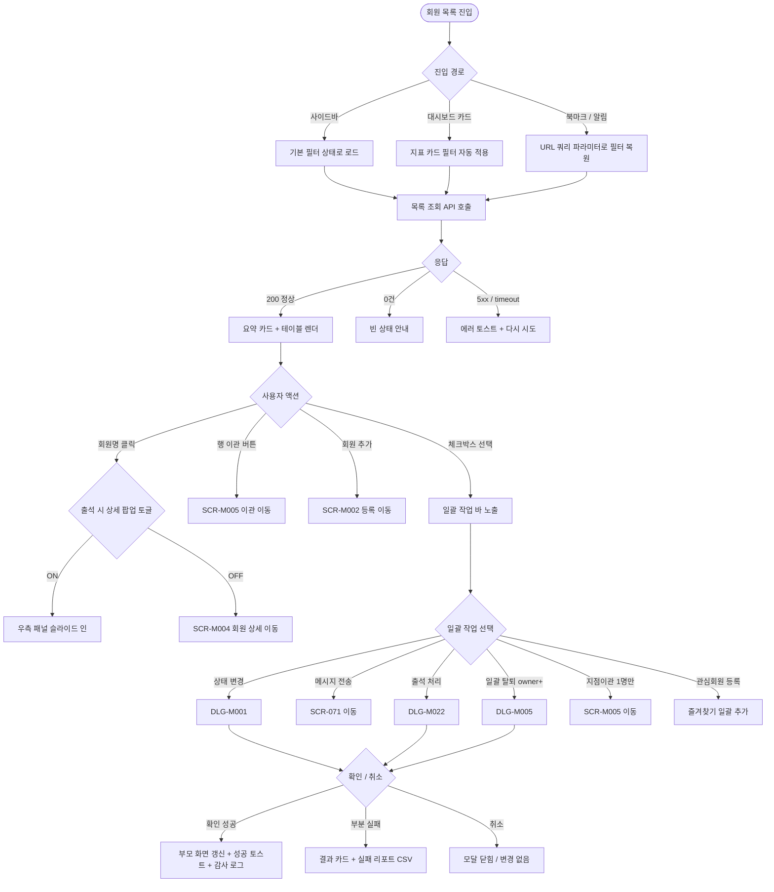
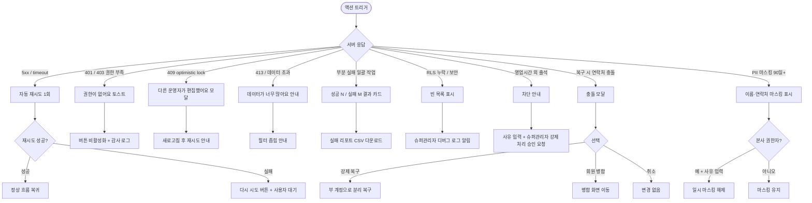

# SCR-M001 회원 목록 페이지

## 1. 화면 메타 정보

이 문서는 회원 목록 페이지에 대한 자기완결형 요구사항 정의서입니다. 다른 문서를 함께 보지 않아도 이 문서 한 장만으로 회원 목록 페이지에 들어가는 모든 영역, 모든 버튼, 모든 모달, 모든 권한, 모든 예외 처리, 그리고 이 화면을 지탱하는 운영 정책까지 전부 이해하고 구현할 수 있도록 작성합니다.

| 항목 | 값 |
|---|---|
| 작성일 | 2026-05-22 |
| 버전 | v1.0 |
| 상태 | 최신 통합본 반영 (정합화 완료) |
| 도메인 | D02 회원관리 |
| 화면 ID | SCR-M001 |
| 화면명 | 회원 목록 |
| 화면 유형 | 허브 화면 (Hub Screen) |
| 라우트 (URL) | `/members` |
| 플랫폼 | 데스크톱(기본), 태블릿, 모바일(풀스크린 진입) |
| 우선순위 | P0 (출시 필수) |
| 기능코드 | MBR-01 (회원 목록 조회) |
| 계약코드 | DQ-07, MBR-01, MBR-04 |
| 계약 상태 | 계약 범위 본기능 |
| 부모 기능 prefix | MBR |
| Lv1 코드 | MBR-01 |
| Lv2 / Lv3 세분화 | MBR-01-01 ~ MBR-01-13 (요약 카드, 메인 탭, 상태 서브탭, 통합 검색, 다중 필터, 일괄 작업, 회원 목록 테이블, 페이지네이션, 본사 통합 조회, 엑셀 내보내기, 회원 추가 진입, 삭제·탈퇴 회원 복구, 세그먼트 자동 분류 표시) |
| 연계 화면 | SCR-M002 회원등록, SCR-M003 회원수정, SCR-M004 회원상세, SCR-M005 회원이관, SCR-071 메시지발송, SCR-097 감사로그 |
| 호출 다이얼로그 | DLG-M001 상태변경, DLG-M005 탈퇴처리, DLG-M022 수동출석, DLG-M023 이관확인 |

## 2. 화면 개요와 목적

회원 목록 페이지는 센터에 등록된 모든 회원을 한눈에 조회하고, 다양한 조건으로 원하는 회원을 빠르게 찾아 상세 페이지로 이동하거나, 여러 회원을 한 번에 묶어 일괄 작업을 수행하는 회원관리 도메인의 핵심 허브 화면입니다. 모든 회원 운영 업무의 시작점이 되며, 사이드바의 회원 관리 메뉴를 누르거나 대시보드의 회원 지표 카드를 누르면 가장 먼저 진입하는 화면이기도 합니다. 본사 관계자가 상단에서 "전체 지점(통합)" 모드를 선택한 경우에는 모든 지점의 회원이 함께 조회되며, 각 회원이 어느 지점 소속인지가 목록과 엑셀 내보내기 결과에 그대로 표시됩니다.

이 화면이 다루는 운영 흐름은 매우 다양합니다. FC(피트니스 코치)는 출근 직후 HQ-09 회원 이용권 만료 step 대상 회원을 검색해 리텐션 콜 리스트를 만들고, 매니저는 최근 한 달 동안 방문하지 않은 회원에게 일괄 메시지를 보내며, Owner(지점장)은 분기 KPI 보고를 위해 전체 회원 데이터를 엑셀로 내려받아 외부 분석 도구로 가져갑니다. primary는 통합 모드에서 전 지점의 활성률과 만료 임박률을 동시에 비교하면서 본사 정책 세트의 step을 조정합니다. 스태프와 프런트는 신규 방문자가 등록된 회원인지 빠르게 확인하고 수동 출석을 처리하며, 트레이너는 본인 담당 회원의 컨디션을 확인합니다. 이 모든 업무가 같은 화면에서 권한별로 다르게 작동해야 합니다.

따라서 이 화면은 단순한 데이터 테이블이 아니라, 권한·상태·정책·외부 연동·자동화 배치까지 모두 반영된 운영 허브로 동작해야 합니다.

## 3. 진입 경로와 인접 화면

회원 목록 페이지에 진입하는 경로는 다음과 같이 여러 가지가 있고, 각 경로마다 진입 직후 화면의 초기 상태가 조금씩 달라집니다.

첫 번째 경로는 사이드바입니다. 좌측 사이드바의 "회원 관리" 메뉴 아래 "회원 목록" 항목을 클릭하면 진입합니다. 이 경우 URL은 단순히 `/members`가 되고, 화면은 기본 필터 상태(상태 필터: 전체, 메인 탭: 회원 목록, 페이지 1, 페이지당 20건)로 시작합니다.

두 번째 경로는 대시보드의 회원 지표 카드 클릭입니다. 대시보드(SCR-101)에서 "전체 회원 수", "활성 회원 수", "만료 임박 회원 수", "정책상 조치 대상" 등의 지표 카드를 클릭하면 회원 목록 페이지로 이동하면서, 그 지표에 대응하는 필터가 URL 쿼리 파라미터로 자동 적용된 상태로 진입합니다. 예를 들어 "만료 임박 회원 수" 카드를 누르면 `/members?status=expiring&period=30d`처럼 만료일이 임박한 회원만 보이는 상태로 열립니다.

세 번째 경로는 글로벌 검색(SCR-103) 결과 또는 알림 센터(SCR-104)의 회원 관련 알림 클릭입니다. 알림에서 직접 회원 상세(SCR-M004)로 가는 경우도 있지만, "오늘 만료 회원 30명"처럼 회원군을 대상으로 한 알림은 회원 목록 페이지로 이동하면서 해당 회원군 필터가 자동 적용됩니다.

네 번째 경로는 외부 도구에서 공유받은 북마크·딥링크입니다. URL 쿼리 파라미터로 필터·검색·페이지 상태가 모두 보존되므로, 매니저가 "이번 달 만료 + 미방문 7일" 같은 자주 쓰는 필터 조합을 북마크해 두고 매일 같은 URL로 진입할 수 있습니다.

이 화면에서 다시 빠져나가는 인접 화면으로는, 회원명 클릭으로 진입하는 회원 상세(SCR-M004), 행의 이관 버튼이나 단일 선택 후 하단 지점이관 버튼으로 진입하는 회원 이관(SCR-M005), 우측 상단 "회원 추가" 버튼으로 진입하는 회원 등록(SCR-M002), 일괄 작업의 메시지 전송으로 진입하는 메시지 발송(SCR-071), 그리고 모든 일괄 작업과 복구·이관 이벤트가 기록되는 감사 로그(SCR-097)가 있습니다.

## 4. 레이아웃과 UI 구성

회원 목록 페이지는 위에서 아래로 차곡차곡 쌓이는 세로형 단일 컬럼 레이아웃을 기본으로 합니다. 데스크톱에서는 가로 폭이 충분하므로 우측 상세 팝업 패널이 슬라이드 인 될 때 본문 가로폭이 자동으로 축소됩니다. 태블릿에서는 본문 가로폭을 유지하면서 상세 팝업이 우측 오버레이로 뜨고, 모바일에서는 회원을 누르면 풀스크린으로 상세가 진입합니다. 화면은 위에서부터 다음 영역들이 순서대로 배치됩니다.

가장 위에는 페이지 헤더가 있습니다. 헤더 좌측에는 "회원 목록"이라는 페이지 타이틀과 함께, 현재 조회 중인 지점이 "전체 지점(통합)"인지 특정 지점인지를 알려주는 지점 컨텍스트 배지가 따라옵니다. 헤더 우측에는 두 개의 토글이 있는데, 하나는 "삭제·탈퇴 회원 보기 토글"이고 다른 하나는 "출석 시 상세 팝업 토글"입니다. 삭제·탈퇴 회원 보기 토글이 켜지면 평소에는 숨겨져 있던 삭제·탈퇴 회원이 별도의 섹션 또는 별도 탭에 표시되며, 토글이 꺼지면 다시 숨겨집니다. 출석 시 상세 팝업 토글은 회원 행을 클릭했을 때의 동작을 제어합니다. 토글이 켜져 있으면 회원 상세(SCR-M004)로 이동하지 않고 우측에 슬라이드 인 패널이 열려 그 자리에서 빠르게 회원 정보를 확인할 수 있고, 토글이 꺼져 있으면 회원 상세 페이지로 페이지 자체가 전환됩니다. 헤더 우측 끝에는 "회원 추가" 버튼이 있습니다.

페이지 헤더 바로 아래에는 요약 지표 카드 4개가 가로로 배치됩니다. 첫 번째 카드는 "전체 회원 수"로 등록된 모든 회원의 합계를 보여주며, 이 카드를 클릭하면 상태 필터가 "전체"로 자동 적용됩니다. 두 번째 카드는 "활성 회원 수"로 status=active 상태인 회원만 카운트되며, 클릭 시 "활성" 필터가 자동 적용됩니다. 세 번째 카드는 "정책상 조치 대상"으로, 본사 정책 세트의 step 결과에 따라 운영 조치가 필요한 회원의 수를 보여주며, 클릭 시 해당 회원만 필터링됩니다. 네 번째 카드는 "정책상 조치 대상 회원 수"로 당월 안에 이용권이 만료되는 회원의 수를 보여주며, 클릭 시 만료 임박 필터가 자동 적용됩니다. 본사 통합 모드에서는 모든 카드의 숫자가 전 지점 합산으로 표시되고, 카드 아래 작은 글씨로 "전 지점 합산"이라는 주석이 붙습니다.

요약 카드 바로 아래에는 운영 포커스 바가 있습니다. 운영 포커스 바는 "지금 바로 봐야 할 회원군"을 빠른 바로가기 카드로 보여주는 영역으로, 재등록 집중 보기(만료일이 14일 이내인 회원), 이탈 위험 보기(14일 이상 방문하지 않은 회원), 관심회원 보기(별표 즐겨찾기로 등록된 회원) 같은 카드가 표시됩니다. 각 카드를 누르면 해당 조건에 맞는 필터가 즉시 적용되어 운영자가 한 클릭만으로 목록의 문맥을 전환할 수 있습니다. 운영 포커스 바 우측에는 액션 큐가 붙어 있는데, 선택된 회원이 한 명도 없을 때는 "회원을 선택하면 일괄 작업을 시작할 수 있습니다"라는 가이드 문구가 표시되고, 선택된 회원이 한 명 이상 있으면 선택된 회원의 이름이 앞쪽 두세 명까지 요약 표시된 후 메시지 발송, 상태 변경, 수동 출석 실행 버튼이 노출됩니다.

그 아래에는 운영 보기 탭이 있습니다. 운영 보기 탭은 어떤 단위로 회원을 볼 것인지를 결정하는 1차 분기로, 회원 목록 / 회원권 목록 / 수강권 목록 / 락커 목록 / 운동복 목록의 다섯 가지 보기 방식을 제공합니다. "회원 목록" 보기가 가장 기본이며, "회원권 목록" 보기를 누르면 같은 회원이라도 회원이 보유한 회원권 기준으로 행이 분리되어 표시되고, 같은 회원이 회원권을 두 개 가지고 있으면 두 행으로 표시됩니다. 수강권·락커·운동복 보기도 같은 원리로, 회원이 보유한 자산 기준으로 행이 분해됩니다. 센터의 운영 정책에 따라 락커나 운동복을 사용하지 않는 센터에서는 해당 탭을 숨길 수 있습니다.

운영 보기 탭 바로 아래에는 저장 뷰 탭이 있습니다. 저장 뷰 탭은 운영자가 자주 쓰는 회원 조회 뷰를 사전 정의해 둔 것으로, 상담내역 / 상담예약 / 재등록대상 / (구)고객관리 같은 항목이 서브 탭으로 펼쳐집니다. 이 저장 뷰는 CRM-01 리드관리의 영역과 분리된, 회원 원장 관점에서의 조회 뷰입니다. 상담내역 탭을 누르면 상담 이력이 있는 회원만, 상담예약 탭을 누르면 오늘 또는 가까운 미래에 상담 예약이 잡혀 있는 회원만, 재등록대상 탭을 누르면 만료가 임박했거나 이미 만료된 회원만 표시되도록 자동 필터가 작동합니다.

저장 뷰 탭 아래에는 상태 필터 탭이 있습니다. 상태 필터 탭은 회원 상태에 따른 분류 탭으로, 전체 / 활성 / 만료 / 예정 / 임박 / 홀딩 / 미등록 / 탈퇴의 항목이 옆으로 펼쳐집니다. `전체`는 집계 탭이고 나머지 7개는 실제 회원 상태값입니다. `정지`는 실제 회원 상태값이 아니라 현재 상태 위에 적용되는 이용 제한 플래그이므로 상태 필터 탭에 포함되지 않으며, 이용 제한이 걸린 회원은 현재 상태(활성·홀딩 등) 탭에서 정지 배지로 구분됩니다. 각 탭 우측에는 해당 상태에 해당하는 회원 수가 작은 배지로 표시되어, 운영자가 탭을 누르지 않고도 상태별 분포를 즉시 파악할 수 있습니다. 어느 탭이 선택되었는지는 URL 쿼리 파라미터 `status`로 반영되며, 페이지를 새로고침하거나 북마크로 다시 진입해도 같은 탭이 유지됩니다.

상태 필터 탭 바로 아래에는 검색 및 필터 바가 있습니다. 가장 왼쪽에는 통합 검색창이 있고, 회원 이름과 연락처와 운동 ID를 동시에 OR 조건으로 검색할 수 있습니다. 검색은 입력 후 300ms 디바운스가 적용되어 타이핑이 끝나면 자동으로 결과가 갱신되며, 최소 2자 이상 입력해야 검색이 시작되고 최대 50자까지 입력할 수 있습니다. 검색창 우측에는 기본 필터로 계약상품, 성별, 최종만료일 범위, 최근방문일 범위를 선택하는 드롭다운과 날짜 피커가 배치됩니다. 그 우측 끝에 "추가 필터" 버튼이 있고, 누르면 패널이 펼쳐지면서 관심회원만 보기, 미방문 기간(7일/14일/30일/60일/90일), 회원구분, 유입경로, 만료 상품 숨기기, 출석 시 상세 팝업 기본값 같은 추가 옵션이 노출됩니다. 적용된 필터는 검색 바 아래에 칩 형태로 나란히 표시되며, 각 칩의 X 버튼을 누르면 해당 필터만 제거되고 "전체 해제" 링크를 누르면 모든 필터가 한 번에 초기화됩니다.

필터 바 아래에는 상단 액션 바가 있습니다. 좌측에는 "선택된 목록 n/N" 형식으로 현재 선택된 회원 수와 전체 회원 수가 표시되고, 우측에는 메시지 전송 / 상태 변경 / 엑셀 다운로드 버튼이 일렬로 놓입니다. 이 상단 액션 바는 회원을 선택하지 않은 상태에서도 보이며, 회원을 한 명도 선택하지 않은 상태에서는 메시지 전송과 상태 변경 버튼이 비활성화 상태로 표시되어 누를 수 없습니다. 엑셀 다운로드 버튼은 권한에 따라 아예 보이지 않을 수 있습니다.

상단 액션 바 아래에 회원 목록 테이블이 있습니다. 테이블의 컬럼은 좌측부터 선택 체크박스, 번호(No), 별표(관심회원 토글), 상태 배지, 세그먼트 배지, 회원명, 성별, 생년월일, 나이, 연락처, 보유 이용권, 소속 지점, 마지막 방문일, 등록일, 행 액션(이관 버튼) 순서로 배치됩니다. 본사 통합 모드가 아닐 때는 "소속 지점" 컬럼이 숨겨집니다. 상태 배지는 회원 상태값에 따라 색상이 분기되며, 활성은 녹색 계열, 만료는 회색, 홀딩은 주황색, 탈퇴는 빨강 계열로 표시됩니다. `정지`는 상태값이 아닌 이용 제한 플래그이므로, 정지가 적용된 회원은 본래 상태 배지 위에 정지 표시가 함께 노출됩니다. 세그먼트 배지는 신규·이탈위험·만료임박·충성·활발·관심필요·만료후미등록의 7종입니다. 기본 자동 라벨(이탈위험·만료임박·신규·활발·관심필요·만료후미등록) 6종 중에서는 우선순위 판정에 따라 하나만 표시되며, `충성` 보조 라벨은 기본 자동 라벨과 동시에 표시될 수 있습니다. 회원명을 클릭하면 출석 시 상세 팝업 토글 상태에 따라 우측 패널이 슬라이드 인 되거나 회원 상세 페이지로 전환됩니다. 별표 컬럼은 클릭으로 즐겨찾기를 토글하며, 이 즐겨찾기는 사용자 단위로 저장되어 다른 운영자에게는 영향을 주지 않습니다. 행 우측 끝의 이관 버튼을 누르면 해당 회원 한 명을 대상으로 회원 이관(SCR-M005)으로 진입합니다.

테이블 아래에는 일괄 작업 바가 있습니다. 일괄 작업 바는 평소에는 보이지 않고, 회원을 한 명 이상 체크박스로 선택한 순간 화면 하단에 슬라이드 업 방식으로 등장합니다. 좌측에는 "n명 선택됨"이라는 표시와 함께 "전체 해제" 버튼이 있고, 우측에는 상태 변경, 메시지 전송, 출석 처리, 관심회원 등록, 일괄 탈퇴, 지점이관 버튼이 권한에 따라 노출됩니다. 일괄 탈퇴 버튼은 owner 이상 권한자에게만 보이고, 지점이관 버튼은 정확히 한 명만 선택했을 때만 활성화됩니다.

페이지 가장 아래에는 페이지네이션 영역이 있습니다. 좌측에는 페이지당 표시 건수 선택 드롭다운(20·50·100), 가운데에는 페이지 번호 이동 컨트롤(이전·다음·페이지 번호 직접 입력), 우측에는 "총 N건"이라는 합계가 표시됩니다. 페이지당 건수와 현재 페이지 번호 모두 URL 쿼리 파라미터로 보존됩니다.

마지막으로, 출석 시 상세 팝업 토글이 켜져 있고 회원을 클릭한 상태에서는, 본문 우측에 상세 팝업 패널이 슬라이드 인 됩니다. 이 패널에는 회원 프로필 사진과 이름, 방문 기록 유무, 출석 체크 / 상품 구매 / 메시지 보내기 / 더보기 같은 빠른 액션 버튼, 기본 인적사항(생년월일·성별·연락처·주소·등록일), 상담 담당자, 방문경로, 운동 목적, 구독 플랜, 인바디 같은 외부 연동 상태 요약이 표시됩니다. 패널 헤더에는 "회원 상세로 이동" 링크가 있어서, 필요하면 거기서 SCR-M004 회원 상세 페이지로 이동할 수 있습니다.

## 5. 탭 구성과 탭별 동작

이 화면은 탭이 세 단계로 중첩되어 있습니다. 1차는 운영 보기 탭, 2차는 저장 뷰 탭, 3차는 상태 필터 탭입니다. 어느 탭을 누르든 검색·필터·페이지·정렬 같은 다른 상태는 그대로 유지되고, 탭이 바뀌면서 데이터 fetch만 새로 일어납니다. 단, 운영 보기 탭을 바꾸면 행의 의미 자체가 달라지기 때문에 선택된 체크박스는 자동으로 해제됩니다. 저장 뷰 탭이나 상태 필터 탭을 바꿀 때는 선택된 체크박스가 가능하면 유지되지만, 새 데이터셋에 더 이상 포함되지 않는 회원은 자동 제거됩니다.

운영 보기 탭(1차)은 회원 목록·회원권 목록·수강권 목록·락커 목록·운동복 목록의 5개이며, 어느 탭을 누르느냐에 따라 테이블의 행 단위가 달라집니다. 기본은 회원 목록이고, 회원권 목록을 누르면 한 회원이 여러 회원권을 가지고 있을 때 그 수만큼 행이 분해됩니다. 락커·운동복 보기는 락커·운동복을 점유하고 있는 회원만 표시되며, 자산 ID와 점유 시작·종료일이 컬럼에 추가됩니다. 센터 설정(SCR-080)에서 락커·운동복 미사용으로 체크된 경우, 해당 탭은 아예 보이지 않습니다.

저장 뷰 탭(2차)은 상담내역·상담예약·재등록대상·(구)고객관리 같은 사전 정의된 뷰입니다. 상담내역 탭을 누르면 상담 기록(MBR-02-상담)이 한 건 이상 있는 회원만 표시되고, 가장 최근 상담일이 마지막 방문일 컬럼 옆에 함께 노출됩니다. 상담예약 탭은 오늘·내일·이번 주 안에 상담 예약이 잡혀 있는 회원만 표시하며, 예약 일시 컬럼이 추가됩니다. 재등록대상 탭은 만료일이 -7일부터 +14일 사이에 있는 회원만 표시하면서 자동으로 만료일 오름차순 정렬을 적용합니다. (구)고객관리 탭은 마이그레이션 전 운영 도구의 화면을 호환 차원에서 유지한 뷰입니다.

상태 필터 탭(3차)은 전체·활성·만료·예정·임박·홀딩·미등록·탈퇴의 8개이며, `전체`는 집계 탭이고 나머지 7개는 실제 회원 상태값입니다. 해당 상태의 회원만 표시합니다. 만료예정과 만료 임박은 비슷해 보이지만 다릅니다. "예정"은 만료일이 D-30 ~ D-8 범위(약 한 달 안에 만료될 회원)이고, "임박"은 만료일이 D-7 ~ D-Day 범위(일주일 안에 만료될 회원)입니다. 미등록은 앱이나 외부 연동을 통해 일부 정보만 들어와 있고 정식 등록이 완료되지 않은 회원을 가리키며, 비활성과는 다릅니다. 탈퇴는 운영자가 탈퇴 처리를 완료한 회원으로, 탈퇴 후 90일이 경과하면 PII가 마스킹됩니다. `정지`는 실제 회원 상태값이 아니라 현재 상태 위에 적용되는 이용 제한 플래그이므로 상태 필터 탭에 포함되지 않습니다. 이용 제한이 걸린 회원은 본래 상태(활성·홀딩 등) 탭에 그대로 표시되며, 목록 테이블에서 정지 배지가 함께 노출됩니다. 운영기획서(`docs/admin/운영용_기획문서/01_리드_회원_운영기획서.md` 4.1)의 운영 상태 6종(활성·홀딩·만료예정·만료·비활성·미등록)은 회원 라이프사이클을 묶어서 본 정의이고, 본 화면의 상태 필터 8탭은 운영자가 실무에서 빠르게 골라야 하는 분기(예정/임박 분리, 탈퇴 분리)를 시각화한 것입니다. 운영기획서의 `비활성`은 본 화면에서 탈퇴·삭제 회원 보기 토글의 별도 섹션으로 표시되며 본 8탭에는 포함되지 않습니다. 기능명세서(`docs/admin/기능명세서/D02-회원관리/MBR-01-회원목록/00-기본기능.md` MBR-01-03-01)는 압축 표기로 6서브탭(전체/활성/만료/미등록/홀딩/탈퇴)을 적었지만, 화면설계서(`docs/admin/화면설계서/D02-회원관리/SCR-M001-회원목록/00-기본화면.md`)와 본 도메인 문서가 정본인 8탭을 따릅니다.

세 단계 탭이 합쳐지면 예를 들어 "회원권 목록 보기 × 재등록대상 × 만료" 같은 조합이 가능하며, 이 조합은 "만료된 회원이 가지고 있던 회원권을 회원권 단위로 본 목록"이 됩니다. 운영자는 이런 조합으로 환불·정리 대상 회원권을 효율적으로 찾을 수 있습니다.

## 6. 버튼·아이콘·링크 액션 전체 정의

이 화면에 등장하는 모든 클릭 가능한 요소를 빠짐없이 정의합니다.

요약 지표 카드 4개는 각각 클릭 가능합니다. 전체 회원 수 카드를 누르면 상태 필터가 전체로 자동 변경되고 다른 필터는 유지됩니다. 활성 회원 수 카드를 누르면 상태 필터가 활성으로, 정책상 조치 대상 카드를 누르면 본사 정책 세트의 현재 step 결과에 해당하는 회원만 보이도록 자동 필터링되며, 정책상 조치 대상 회원 수 카드를 누르면 만료일이 당월 안에 있는 회원만 보이도록 필터가 적용됩니다. 어떤 카드를 누르든 페이지는 1페이지로 리셋되고 체크박스 선택은 해제됩니다.

운영 포커스 바의 바로가기 카드들도 클릭 가능합니다. 재등록 집중 보기 카드를 누르면 만료일이 D-14 ~ D-Day 사이로 자동 필터링되고, 이탈 위험 보기 카드를 누르면 마지막 방문일이 14일 이상 지난 회원만 표시되며, 관심회원 보기 카드를 누르면 사용자의 즐겨찾기로 등록된 회원만 표시됩니다.

액션 큐의 메시지 발송 버튼은 선택된 회원이 한 명 이상일 때만 활성화되며, 누르면 선택된 회원의 ID 배열을 쿼리 파라미터로 전달하면서 메시지 발송 화면(SCR-071)으로 이동합니다. 액션 큐의 상태 변경 버튼은 선택된 회원이 한 명 이상이고 권한이 매니저 이상일 때 활성화되며, 누르면 상태 변경 다이얼로그(DLG-M001)가 열립니다. 액션 큐의 수동 출석 실행 버튼은 선택된 회원이 한 명 이상이고 권한이 스태프 이상일 때 활성화되며, 누르면 수동 출석 다이얼로그(DLG-M022)가 열립니다.

상단 액션 바의 메시지 전송 버튼은 액션 큐의 메시지 발송 버튼과 같은 동작을 하지만, 좌측의 "선택된 목록 n/N" 표시 옆에서 별도의 진입점으로 제공됩니다. 상단 액션 바의 상태 변경 버튼도 마찬가지로 DLG-M001을 호출합니다. 상단 액션 바의 엑셀 다운로드 버튼은 현재 필터·검색·정렬을 그대로 적용한 전체 데이터(페이지네이션 무시)를 엑셀 파일로 내려받습니다. 다운로드는 백그라운드로 처리되며, 페이지를 떠나도 작업이 계속되고 완료되면 알림 센터(SCR-104)에 다운로드 링크 알림이 푸시됩니다. 다운로드 권한이 없는 계정에서는 이 버튼이 아예 화면에 나타나지 않습니다.

회원 목록 테이블의 별표 컬럼은 클릭으로 즐겨찾기를 토글합니다. 별표가 채워지면 그 회원이 사용자의 관심회원 목록에 추가되고, 다시 누르면 제거됩니다. 별표 상태는 `user_favorites` 테이블에 사용자 ID와 회원 ID 조합으로 저장되어, 같은 화면을 보는 다른 운영자에게는 영향을 주지 않습니다.

회원명 클릭은 출석 시 상세 팝업 토글의 상태에 따라 다르게 동작합니다. 토글이 켜져 있으면 우측에 상세 팝업 패널이 슬라이드 인 되고 본문 가로폭이 축소되며, 토글이 꺼져 있으면 회원 상세 페이지(SCR-M004)로 페이지가 전환됩니다. 모바일에서는 토글 상태와 무관하게 항상 회원 상세 페이지로 풀스크린 전환됩니다.

행의 이관 버튼은 그 회원 한 명을 대상으로 회원 이관 화면(SCR-M005)으로 이동합니다. 이관 대상이 이미 탈퇴·삭제 상태이거나 본사 통합 모드가 아닌 일반 지점 사용자에게 다른 지점 회원으로 보이는 경우(보안 우회 시도)는 클릭 자체가 차단되고 안내 토스트가 표시됩니다.

일괄 작업 바의 상태 변경 버튼은 선택된 회원 모두에게 같은 상태 변경을 적용하려는 의도로 DLG-M001을 일괄 모드로 호출합니다. 메시지 전송 버튼은 SCR-071로 이동, 출석 처리 버튼은 DLG-M022를 일괄 모드로 호출, 관심회원 등록 버튼은 선택된 회원 전체를 일괄로 즐겨찾기에 추가합니다(이미 추가되어 있는 회원은 그대로 두고 새로운 회원만 추가). 일괄 탈퇴 버튼은 DLG-M005를 일괄 모드로 호출하며, 지점이관 버튼은 정확히 한 명을 선택했을 때만 활성화되어 SCR-M005로 이동합니다.

페이지네이션의 페이지당 건수 드롭다운은 20·50·100 중 선택하며 즉시 재조회됩니다. 페이지 번호 이동은 이전·다음 버튼과 직접 입력 모두 지원하고, 현재 페이지가 1페이지면 이전 버튼이 비활성화, 마지막 페이지면 다음 버튼이 비활성화됩니다.

페이지 헤더의 회원 추가 버튼은 회원 등록 화면(SCR-M002)으로 이동합니다. 권한이 없는 계정(FC·트레이너·readonly)에서는 이 버튼이 아예 보이지 않습니다. 삭제·탈퇴 회원 보기 토글은 켜면 삭제·탈퇴 회원이 별도 섹션 또는 별도 탭에 표시되고, 그 섹션의 회원 행마다 복구 버튼이 나타납니다. 복구 버튼을 누르면 DLG-M005가 역방향(복구 확인 모드)으로 열려, 최종 확인 후 회원 상태가 활성으로 복원됩니다. 복구 권한은 Owner(지점장)·매니저·슈퍼관리자에 한정됩니다.

모든 버튼은 클릭 후 응답이 돌아오기 전까지 자동으로 비활성화되어 더블클릭이나 연타로 인한 중복 요청이 차단됩니다. 또한 일괄 작업 진행 중에는 진행 스피너가 표시되고 다른 일괄 작업 버튼이 모두 비활성화되어, 같은 작업의 중복 실행을 막습니다.

## 7. 호출되는 모달 동작

이 화면에서 호출되는 모달은 네 가지이며, 각각 어떤 트리거로 열리고, 어떤 입력을 받고, 확인/취소를 누르면 부모 화면에서 어떤 변화가 일어나는지가 모두 달라집니다.

### 7-1. DLG-M001 상태 변경 다이얼로그

상태 변경 다이얼로그는 회원의 상태를 활성·홀딩·탈퇴 같은 값으로 바꾸기 전에 의도하지 않은 변경을 막기 위해 최종 확인을 받는 모달입니다. 회원 목록 페이지에서는 두 가지 트리거로 열립니다. 첫 번째 트리거는 액션 큐의 상태 변경 버튼이나 상단 액션 바의 상태 변경 버튼 또는 일괄 작업 바의 상태 변경 버튼이고, 이 경우 선택된 회원이 한 명이면 단일 모드, 두 명 이상이면 일괄 모드로 모달이 열립니다.

모달 상단에는 "상태를 변경하시겠습니까?"라는 제목이 표시되고, 그 아래에 변경 대상이 표시됩니다. 단일 모드에서는 대상 회원의 이름과 현재 상태 → 변경될 상태를 화살표 형태로 보여주고, 일괄 모드에서는 선택된 회원 수(예: "총 23명 선택")와 변경될 상태가 표시됩니다. 변경될 상태를 고르는 드롭다운이 있어서, 활성·홀딩·정지·탈퇴 중에서 선택할 수 있습니다. 일괄 모드에서는 처리 가능 회원과 처리 불가 회원이 분리되어 표시되며, 처리 불가 회원은 사유(예: 이미 탈퇴 처리됨, 권한 부족, optimistic lock 위반)와 함께 나열됩니다.

하단에는 확인 버튼과 취소 버튼이 있습니다. 확인을 누르면 모달이 로딩 상태로 전환되어 주요 버튼이 모두 비활성화되고, 백엔드에 상태 변경 요청이 전송됩니다. 성공하면 모달이 닫히고 부모 화면(회원 목록)의 해당 회원 행 상태 배지가 즉시 갱신되며, 우측 상단에 "n명의 상태를 변경했어요"라는 성공 토스트가 표시됩니다. 일괄 모드에서 부분 실패가 발생하면 모달은 닫히지 않고 "성공 N / 실패 M"이라는 결과 카드가 표시되고, 실패 회원 목록을 CSV로 다운로드받을 수 있는 링크가 제공됩니다. 취소를 누르면 모달이 즉시 닫히고 아무 변경도 일어나지 않습니다. ESC 키 또는 배경 클릭으로도 취소와 동일한 동작이 일어나지만, 입력 도중인 경우에는 "변경 사항이 사라집니다. 닫으시겠습니까?"라는 확인을 한 번 더 묻습니다.

권한에 따라 변경 가능한 상태 옵션이 달라집니다. 매니저는 활성·홀딩·정지로만 변경 가능하며 탈퇴는 드롭다운에서 보이지 않습니다. Owner(지점장)과 슈퍼관리자는 모든 옵션을 사용할 수 있습니다. FC·트레이너·스태프·프런트는 이 모달에 진입조차 할 수 없으므로 모달 호출 전에 부모 화면의 버튼 자체가 비활성화 또는 숨김 처리됩니다.

### 7-2. DLG-M005 탈퇴 처리 다이얼로그

탈퇴 처리 다이얼로그는 회원을 탈퇴 상태로 만들기 전에 최종 확인을 받는 모달이며, 회원 목록 페이지에서는 두 가지 방향으로 동작합니다. 정방향은 일괄 작업 바의 일괄 탈퇴 버튼으로 열리는 탈퇴 확인이고, 역방향은 삭제·탈퇴 회원 섹션의 행에서 복구 버튼을 눌렀을 때 열리는 복구 확인입니다.

정방향(탈퇴 확인) 모달의 상단에는 "탈퇴 처리하시겠습니까?"라는 제목과 함께 "탈퇴 처리 시 개인정보가 마스킹되며 서비스 이용이 중단됩니다"라는 경고 문구가 표시됩니다. 그 아래에 선택된 회원 수(예: "총 50명 선택"), 처리 가능 회원 수, 차단 회원 수가 카드 형태로 나란히 표시되고, 차단 회원이 있으면 사유별로 묶어 보여줍니다. 차단 사유는 미수금이 있는 경우, 환불이 필요한 이용권을 가진 경우, 진행 중인 예약이 있는 경우, 가족 회원의 대표 회원인 경우, 이미 탈퇴·삭제된 경우의 다섯 가지로 분류됩니다. 이어서 탈퇴 사유를 선택하는 드롭다운이 있고, 본인 요청 / 장기 미이용 / 기타 중에서 고릅니다. 일괄 모드(2명 이상)에서는 안전 장치로 사용자가 직접 "탈퇴"라는 단어를 텍스트 박스에 입력해야 확인 버튼이 활성화됩니다.

확인을 누르면 처리 가능 회원만 탈퇴 처리되어 상태가 `WITHDRAWN`으로 변경되고, 개인정보 마스킹은 X11 PII 마스킹 배치(매일 새벽 5시 실행)의 대상으로 예약됩니다. 차단 회원은 변경 없이 그대로 두고 결과 토스트와 실패 리포트 CSV에서 회원별 차단 사유가 표시됩니다. 모든 처리 결과는 감사 로그(SCR-097)에 actor_id, member_ids[], action=WITHDRAW, reason, timestamp로 기록됩니다. 취소를 누르면 모달이 닫히고 아무 변경도 일어나지 않습니다.

역방향(복구 확인) 모달은 삭제·탈퇴 회원 섹션에서 행의 복구 버튼을 눌렀을 때 열립니다. 모달 상단에 "회원을 복구하시겠습니까?"라는 제목과 함께 대상 회원명, 현재 상태(WITHDRAWN 또는 DELETED), 복구 후 상태(ACTIVE)가 표시됩니다. 복구 시 동일 연락처를 가진 신규 회원이 이미 존재하면 "동일 연락처의 신규 회원이 있어요"라는 충돌 안내가 표시되고, 강제 복구(부 계정으로 분리) / 회원 병합으로 이동 / 취소 중에서 선택하게 됩니다. 일반적인 복구는 owner·manager·슈퍼관리자만 수행할 수 있고, 권한이 없으면 복구 버튼이 아예 화면에 나타나지 않습니다.

### 7-3. DLG-M022 수동 출석 다이얼로그

수동 출석 다이얼로그는 키오스크나 QR 체크인 없이 관리자가 직접 회원의 출석을 처리하는 모달이며, 회원 목록에서는 액션 큐의 수동 출석 실행 버튼이나 일괄 작업 바의 출석 처리 버튼으로 열립니다. 단일 회원을 대상으로 한 출석 처리뿐만 아니라, 여러 회원을 선택한 후 한 번에 출석을 입력하는 일괄 모드도 지원합니다.

모달 상단에는 "수동 출석 처리"라는 제목이 표시됩니다. 단일 모드에서는 대상 회원의 이름·회원번호·현재 이용권이 한 줄로 표시되고, 일괄 모드에서는 "n명 선택됨"이라는 요약과 함께 처리 가능 회원의 이름이 앞쪽 몇 명까지 표시됩니다. 그 아래에 출석 날짜 선택(기본값: 오늘, 과거 날짜도 선택 가능)과 출석 시간 입력(기본값: 현재 시간)이 있고, 마지막으로 처리 사유를 입력하는 텍스트 박스 또는 사전 정의된 사유 목록 드롭다운이 있습니다. 사유는 키오스크 오류, 회원 요청, 본사 정책 예외, 기타 등으로 미리 정의되어 있습니다.

처리 버튼을 누르면 출석 기록이 저장되고, 횟수권을 가진 회원은 이용 횟수가 자동으로 차감됩니다. 본사 통합 모드에서 일괄 출석을 처리할 경우, 각 회원의 실제 `branchId` 기준으로 출석 기록이 분산 저장되어 지점별 그루핑 결과가 토스트와 결과 카드에 표시됩니다. 영업시간 외에 처리를 시도하면 "영업시간 외 처리는 본사 정책으로 차단되었습니다"라는 안내가 표시되며, 사유를 추가로 입력해야 슈퍼관리자에게 강제 처리 승인 요청이 발송됩니다. 모든 출석 처리는 감사 로그에 기록됩니다. 취소를 누르면 변경 없이 모달이 닫힙니다.

이 모달은 스태프 이상부터 사용 가능하며, FC·트레이너·readonly는 진입할 수 없도록 부모 화면의 버튼 자체가 차단됩니다.

### 7-4. DLG-M023 이관 확인 다이얼로그

이관 확인 다이얼로그는 회원을 다른 지점으로 이관하기 전에 최종 확인을 받는 모달이지만, 회원 목록 페이지에서 직접 이 모달이 단독으로 열리지는 않습니다. 회원 목록의 이관 버튼이나 일괄 작업 바의 지점이관 버튼은 우선 회원 이관 화면(SCR-M005)으로 이동시키고, 그 화면에서 이관 대상 지점 선택을 마친 다음 마지막 단계에서 이 다이얼로그가 호출됩니다. 다만 회원 목록 페이지의 책임 범위에서는, 이관 버튼을 눌렀을 때 SCR-M005로의 진입이 stale 데이터 검증을 거쳐 안전하게 일어나는 것까지를 보장해야 합니다. 즉 회원 목록에서 이관 버튼을 누른 직후, 다른 운영자가 그 회원을 탈퇴·삭제 처리했거나 다른 지점으로 이미 이관한 경우에는 SCR-M005 진입 시 "회원 정보가 변경되었습니다. 목록을 새로고침해 주세요"라는 stale 데이터 경고를 표시하고 회원 목록으로 다시 돌려보내야 합니다.

DLG-M023 자체의 동작은 SCR-M005 문서에서 자기완결로 다시 정의되며, 이 화면의 책임은 이관 진입 전 검증과 진입 후 stale 처리에 한정됩니다.

## 8. 토스트와 확인 팝업과 알럿

회원 목록 페이지에서 발생하는 모든 알림성 UI는 다음과 같은 패턴으로 동작합니다.

성공 토스트는 우측 상단에 녹색 계열로 5초 동안 표시되며, "n명의 상태를 변경했어요", "n명에게 메시지를 발송했어요", "n명의 출석을 처리했어요", "n명을 탈퇴 처리했어요", "회원을 복구했어요", "엑셀 다운로드가 시작되었어요" 같은 짧은 문구로 결과를 알려줍니다. 토스트를 클릭하면 결과 상세(예: 메시지 발송 결과 화면)로 이동하는 경우도 있습니다.

실패 토스트는 우측 상단에 빨강 계열로 표시되며, "데이터를 불러오지 못했어요", "권한이 없어요", "다른 운영자가 동시에 편집했어요", "데이터가 너무 많아요. 필터를 좁혀주세요" 같은 문구와 함께 "다시 시도" 또는 "필터 좁히기" 같은 보조 액션 버튼이 따라옵니다. 자동 재시도가 가능한 네트워크 오류는 1회까지 자동으로 다시 시도된 다음 사용자 액션을 기다립니다.

부분 결과 알림은 일괄 작업이 완료되었을 때 토스트가 아니라 결과 카드 형태로 화면 중앙 하단에 머무릅니다. "성공 80건 / 실패 20건"처럼 두 가지 숫자가 동시에 표시되며, 실패 사유별 분류와 실패 리포트 CSV 다운로드 링크가 함께 제공됩니다. 결과 카드는 사용자가 닫기 버튼을 누를 때까지 사라지지 않고, 다른 일괄 작업을 새로 시작하면 자동으로 교체됩니다.

확인 팝업은 별도의 다이얼로그가 아닌 단순한 yes/no 형태입니다. 예를 들어 모달 입력 도중 ESC 또는 배경 클릭으로 닫으려고 할 때 "변경 사항이 사라집니다. 닫으시겠습니까?"라는 yes/no 확인이 뜨고, "전체 해제" 링크를 눌러서 모든 필터를 한 번에 초기화할 때는 별도 확인 없이 즉시 초기화됩니다.

알럿은 시스템 메시지에 가까운 차단형 안내로, 권한 없는 계정이 직접 URL로 접근했을 때 페이지 본문이 전부 사라지고 "이 화면에 접근할 권한이 없습니다. 3초 후 대시보드로 이동합니다"라는 메시지가 표시된 후 자동 이동합니다. 본사 통합 모드에서 RLS(Row-Level Security)가 누락된 회원이 감지된 경우에는 빈 목록이 표시되는 보안 동작이 일어나며, 슈퍼관리자에게만 디버그 콘솔과 알림 센터를 통해 누락 사실이 전달됩니다.

## 9. 데이터 흐름과 외부 연동

이 화면은 여러 데이터 소스와 외부 연동에 의존합니다. 화면 단위로 어떤 데이터가 어디서 오고 어디로 가는지를 모두 풀어 씁니다.

화면 진입 시점에는 회원 목록 조회 API가 호출됩니다. 요청에는 현재 활성화된 운영 보기 탭, 저장 뷰 탭, 상태 필터 탭, 검색어, 모든 필터 값, 페이지 번호, 페이지당 건수, 정렬 기준이 모두 쿼리 파라미터로 들어갑니다. 본사 통합 모드일 때는 `branchId` 파라미터가 빠지거나 `all`로 전달되어 전체 지점의 회원이 합산 조회됩니다. 응답으로는 회원 배열, 총 건수, 페이지 정보, 그리고 4개 요약 카드의 카운트가 함께 내려옵니다. 카드 카운트는 같은 필터 조건을 기준으로 계산되되 페이지네이션은 적용하지 않은 전체 합계입니다.

회원의 세그먼트 라벨은 D+1 배치(MBR-EXT-04 세그먼트 자동 재계산, 매일 새벽 4시)로 갱신됩니다. 따라서 회원이 방금 결제·홀딩·탈퇴 같은 상태 변화를 겪었다면, 다음 날 새벽 배치가 돌기 전까지 세그먼트 라벨은 이전 값을 유지할 수 있습니다. 이 한계를 보완하기 위해, 회원 상세 페이지로 진입할 때는 실시간 재판정이 수행되어 가장 최신 라벨이 표시됩니다. 회원 목록에서는 D+1 라벨이 노출되는 것이 정상이며, 운영자에게는 라벨 옆에 작은 갱신 시각 표시(예: "04:12 갱신")가 보입니다.

요약 카드의 "정책상 조치 대상 회원 수"와 "정책상 조치 대상"은 NFR-05 만료 알림 배치(매일 새벽 3시)의 결과를 그대로 사용합니다. 만료 알림 배치는 D-30·D-7·D-Day 시점에 푸시·SMS·알림톡을 발송하고, 발송 대상 회원 목록을 캐시 테이블에 적재합니다. 회원 목록 페이지의 만료 임박 필터는 이 캐시를 우선 사용하고, 캐시가 만료되었거나 비어 있는 경우에만 실시간 쿼리로 폴백합니다.

홀딩 자동 처리는 A04 배치(매일 새벽 2시)가 담당합니다. 홀딩 종료일이 도래한 회원은 자동으로 상태가 활성으로 전환되고, 만료일이 홀딩 기간만큼 자동 연장됩니다. 회원 목록의 상태 배지는 이 자동 전환 결과를 다음 새로고침 시점에 반영합니다.

PII 마스킹은 X11 배치(매일 새벽 5시)가 담당합니다. 탈퇴·삭제 후 90일이 경과한 회원의 이름·연락처·이메일이 마스킹값(예: "홍길동" → "홍**", "010-1234-5678" → "010-****-5678")으로 덮어 씌워집니다. 삭제·탈퇴 회원 보기 토글이 켜져 있을 때, 이 마스킹된 회원들이 별도 섹션에 마스킹 상태로만 노출되며, 본사 권한자가 사유를 입력하면 일시 해제가 가능합니다.

엑셀 내보내기는 백그라운드 작업으로 분리됩니다. 사용자가 엑셀 다운로드 버튼을 누르면 즉시 "다운로드가 시작되었어요"라는 토스트가 뜨고, 실제 파일 생성은 백그라운드에서 진행됩니다. 데이터가 5만 건을 초과하면 "데이터가 너무 많아요. 필터를 좁혀주세요"라는 에러가 즉시 반환되어 작업이 시작되지 않습니다. 완료된 다운로드 파일의 링크는 NFR-19 알림 센터(SCR-104)에 푸시되며, 사용자가 알림 센터를 열어 다운로드 링크를 클릭하면 실제 파일이 내려받아집니다. 본사 통합 모드 다운로드는 본사 권한자만 허용되고, 본사 권한자가 통합 모드로 다운로드하면 엑셀의 첫 컬럼에 "소속 지점"이 추가됩니다.

모든 일괄 작업(상태 변경·메시지 발송·출석 처리·복구·일괄 탈퇴·이관)은 감사 로그 시스템(SCR-097)에 비동기로 INSERT됩니다. 기록되는 필드는 `actor_id`(운영자 ID), `member_ids[]`(대상 회원 ID 배열), `action`(작업 종류), `before`(변경 전 값), `after`(변경 후 값), `reason`(사유 입력값), `timestamp`(처리 시각)입니다. 감사 로그 INSERT는 작업 결과 응답이 사용자에게 돌아간 후 5초 안에 보장됩니다.

알림 센터(NFR-19)는 엑셀 다운로드 완료, 일괄 작업 완료, 일괄 메시지 발송 결과 같은 비동기 결과를 사용자에게 푸시합니다. 사용자가 페이지를 떠난 후에 작업이 끝나도 알림이 도착하므로, 운영자는 큰 데이터를 다루는 작업을 시작한 뒤 다른 업무로 넘어갈 수 있습니다.

회원 등급(MBR-EXT-03)은 별도 배치로 월간/분기/연간 주기로 자동 갱신되며, 회원 목록의 세그먼트 배지와는 다른 트랙입니다. 등급은 회원 상세에서만 표시되며, 회원 목록에서는 노출되지 않습니다.

화면에서 호출하는 주요 API 엔드포인트는 다음과 같습니다. 회원 목록 조회 `GET /api/members`, 일괄 작업 처리 `POST /api/members/bulk-action`, 엑셀 내보내기 작업 등록 `GET /api/members/export`, 단일 회원 복구 `POST /api/members/:id/restore`, 세그먼트 재계산 상태 조회 `GET /api/members/segments/recalc-status`.

## 10. 화면 상태와 예외 처리

회원 목록 페이지는 다음 상태들을 가질 수 있고, 각 상태마다 사용자에게 보이는 모습이 달라집니다.

로딩 중 상태에서는 테이블 자리에 행 모양의 스켈레톤이 표시되어 데이터를 불러오고 있음을 알려줍니다. 요약 카드 자리에도 숫자 대신 스켈레톤이 표시되며, 헤더의 토글과 필터 바는 미리 렌더되지만 상호작용은 잠시 막혀 있습니다.

정상 목록 상태는 200 응답과 함께 회원이 한 명 이상 존재할 때 표시되는 가장 일반적인 상태입니다. 테이블에 회원 행이 채워지고 페이지네이션이 활성화되며, 모든 버튼이 권한에 맞게 활성/비활성으로 동작합니다.

검색 결과 없음 상태는 필터나 검색을 적용한 결과가 0건일 때 표시됩니다. 테이블 자리에 "검색 결과가 없습니다"라는 안내와 함께 "필터 초기화" 버튼이 표시되어, 사용자가 한 번에 모든 필터를 풀 수 있습니다.

전체 회원 없음 상태는 어떤 필터도 적용되지 않은 상태에서 회원 자체가 0건인 경우입니다. 신규로 개업한 지점에서 흔히 보이며, "등록된 회원이 없습니다"라는 안내와 "회원 추가하기" CTA 버튼이 표시됩니다.

오류 상태는 서버에서 5xx 응답이 오거나 네트워크 타임아웃이 발생했을 때 표시됩니다. 화면 중앙에 큰 에러 아이콘과 "데이터를 불러오지 못했어요"라는 메시지, 그리고 "다시 시도" 버튼이 표시됩니다. 자동 재시도가 1회까지 백그라운드에서 일어나고, 그래도 실패하면 사용자의 액션을 기다립니다.

접근 불가 상태는 권한이 없는 계정이 직접 URL로 접근했을 때 표시됩니다. 페이지 본문이 전부 가려지고 "이 화면에 접근할 권한이 없습니다"라는 메시지와 함께 3초 카운트다운이 진행되어 대시보드로 자동 이동합니다. 사이드바에서는 이 화면 메뉴 자체가 보이지 않으므로, 이 상태는 직접 URL로 들어왔을 때만 발생합니다.

일괄 작업 진행 중 상태에서는 테이블 위에 진행 스피너 오버레이가 표시되고, 일괄 작업 바의 모든 버튼이 비활성화됩니다. 일괄 작업이 백엔드에서 처리되는 동안 사용자는 다른 행을 클릭하거나 페이지를 떠날 수는 있지만, 같은 작업을 두 번 트리거할 수는 없습니다.

일괄 탈퇴 확인 중 상태는 DLG-M005가 열린 상태입니다. 이 상태에서는 부모 화면이 어둡게 처리되고, 모달 안의 처리 가능 회원과 차단 회원이 분리되어 표시되며 확인 입력이 진행됩니다.

삭제·탈퇴 보기 활성 상태는 헤더의 토글이 켜진 상태입니다. 일반 회원 목록 아래에 별도 섹션이 펼쳐지면서 삭제·탈퇴된 회원이 표시되고, 각 행에 복구 버튼이 노출됩니다. 90일이 경과한 회원은 이름·연락처가 마스킹된 상태로 보입니다.

우측 팝업 열림 상태는 출석 시 상세 팝업 토글이 켜진 상태에서 회원 행을 클릭했을 때입니다. 본문 가로폭이 약 65% 정도로 축소되면서 우측에 35% 폭의 패널이 슬라이드 인 됩니다. 패널 내부의 빠른 액션 버튼(출석 체크·상품 구매·메시지·더보기)은 그 자리에서 즉시 실행됩니다.

예외 케이스별 처리는 다음과 같이 정의됩니다.

네트워크 오류(5xx 또는 timeout)가 발생하면 "데이터를 불러오지 못했어요" 토스트와 다시 시도 버튼이 표시됩니다. 자동 재시도 1회 후 사용자 액션을 기다립니다.

권한 없는 계정이 진입하면 접근 제한 화면이 표시되고 대시보드로 자동 이동합니다.

일괄 작업의 부분 실패가 발생하면 성공 N건 / 실패 M건이라는 결과 카드와 실패 리포트 CSV 다운로드 링크가 제공됩니다. 실패 회원의 ID와 사유가 CSV에 포함되어, 운영자가 사유별로 추후 처리를 이어갈 수 있게 합니다.

일괄 작업이 전체 실패한 경우에는 빨강 토스트와 함께 트랜잭션 롤백 안내가 표시됩니다. 부분 성공이 아닌 전체 무변경이며, 재시도하거나 개별 처리로 전환할 수 있도록 안내합니다.

일괄 탈퇴 시 차단 대상이 섞여 있으면 DLG-M005 안에서 처리 가능 인원과 차단 인원을 분리해 표시합니다. 사용자는 처리 가능 회원만 진행하거나 모달을 닫고 대상을 재선택할 수 있습니다.

동일 회원에 대한 동시 편집(optimistic lock 위반)이 발생하면 "다른 운영자가 동시에 편집했어요"라는 모달이 표시되고, 사용자는 최신 데이터를 새로고침한 뒤 다시 시도해야 합니다. 후행 요청은 자동으로 거부되며 무의미한 덮어쓰기를 방지합니다.

엑셀 다운로드 권한이 없는 계정에서는 다운로드 버튼이 아예 화면에 표시되지 않습니다.

엑셀 다운로드 데이터가 5만 건을 초과하면 "데이터가 너무 많아요. 필터를 좁혀주세요"라는 에러가 즉시 반환되며, 백엔드 작업은 시작되지 않습니다.

일괄 메시지 발송 시 알림톡 외 경로로 폴백이 필요하면 DLG 안내 후 SMS로 자동 폴백되며, 발송 결과는 채널별로 구분되어 표시됩니다.

본사 통합 모드에서 RLS가 누락된 회원이 감지되면 보안상 빈 목록이 표시되고, 슈퍼관리자에게만 디버그 로그를 통해 누락 사실이 공개됩니다.

수동 출석 처리 시 영업시간 외에 처리하려고 하면 "영업시간 외 처리는 본사 정책으로 차단되었습니다"라는 안내가 표시되며, 사유 입력 후 슈퍼관리자 승인을 거치면 강제 처리가 가능합니다.

탈퇴·삭제 회원 복구 시 동일 연락처를 가진 신규 회원이 이미 존재하면 충돌 안내 모달이 표시되며, 강제 복구(부 계정으로) / 회원 병합으로 이동 / 취소 중에서 선택할 수 있습니다.

삭제·탈퇴 회원 중 90일이 경과한 PII는 이름·연락처가 마스킹되어 표시됩니다. 본사 권한자가 사유를 입력하면 일시적으로 마스킹 해제가 가능합니다.

## 11. 권한별 처리

이 화면은 권한에 따라 진입 가능 여부, 보이는 영역, 가능한 액션이 모두 달라집니다. 각 권한별로 어떻게 동작해야 하는지를 빠짐없이 정의합니다.

superAdmin와 primary는 모든 기능을 사용할 수 있습니다. 화면 진입에 제약이 없고, 헤더에서 지점 전환 드롭다운이 노출되어 전체 지점(통합)과 개별 지점을 자유롭게 전환할 수 있습니다. 통합 모드에서는 모든 지점의 회원이 합산 조회되고 회원 목록 테이블에 "소속 지점" 컬럼이 자동으로 표시됩니다. 엑셀 내보내기, 회원 추가, 상태 변경, 지점 이관, 일괄 탈퇴, 삭제·탈퇴 회원 복구, 본사 통합 모드 다운로드, PII 일시 해제, 영업시간 외 출석 강제 처리 승인까지 이 화면의 모든 기능을 사용할 수 있습니다.

Owner(지점장)은 자기가 속한 브랜드의 지점 회원 전체를 조회할 수 있습니다. 본사 통합 모드 토글은 표시되지 않거나 비활성화되며, 자기 지점에 한정해서 작업합니다. 엑셀 내보내기, 회원 추가, 상태 변경, 일괄 탈퇴(owner 이상 한정), 단일 탈퇴, 삭제·탈퇴 회원 복구를 모두 수행할 수 있고, 회원 영구 삭제도 가능합니다. 다만 본사 모드 전용 기능(통합 다운로드, PII 일시 해제, 영업시간 외 강제 처리 승인)은 사용할 수 없습니다.

매니저(manager)는 자기 지점의 회원 전체를 조회할 수 있고, 엑셀 내보내기, 회원 추가, 상태 변경, 단일 탈퇴까지 수행할 수 있습니다. 다만 일괄 탈퇴와 회원 삭제는 owner 이상 권한이 필요하므로 매니저 화면에서는 일괄 탈퇴 버튼이 일괄 작업 바에 노출되지 않습니다. 회원 복구는 매니저도 수행할 수 있습니다.

FC(피트니스 코치, fc)는 자기 지점의 전체 회원을 조회할 수 있지만, 기본적으로 자기가 담당하는 회원이 우선 노출됩니다. 담당 회원만 보기 토글이 추가로 표시되어 본인 담당 회원만 필터링할 수도 있습니다. 가능한 액션은 메시지 전송, 출석 처리, 관심회원 등록까지이며, 회원 등록·수정·삭제·엑셀 내보내기·상태 변경·일괄 탈퇴·복구는 모두 불가능합니다. 회원 추가 버튼은 화면에 보이지 않고, 엑셀 다운로드 버튼도 보이지 않으며, 상태 변경 버튼은 비활성화 상태로 표시되거나 클릭 시 권한 안내가 토스트로 표시됩니다.

트레이너(trainer)는 본인이 담당하는 회원만 조회할 수 있습니다. 화면 진입 시 자동으로 담당 회원 필터가 적용되며, 다른 회원의 데이터는 RLS로 차단되어 보이지 않습니다. 모든 작업이 조회로 한정되며, 별도의 트레이너 캘린더 화면(SCR-C001 또는 SCR-MA-200)을 우선 사용하도록 가이드되는 것이 일반적입니다. 회원명 클릭은 회원 상세로 이동만 가능하고 상세 팝업의 빠른 액션도 비활성 상태입니다.

스태프(staff)는 자기 지점의 회원 전체를 조회할 수 있고, 회원 추가, 출석 처리, 관심회원 등록까지 수행할 수 있습니다. 회원 삭제와 엑셀 내보내기는 불가능하며, 상태 변경과 탈퇴 처리도 차단됩니다. 일괄 작업 바에서는 출석 처리, 관심회원 등록, 메시지 전송 버튼만 노출됩니다.

프런트(front)는 자기 지점의 회원 전체를 조회할 수 있지만, 가능한 액션은 조회와 출석 처리뿐입니다. 회원 추가도 불가능하므로 회원 추가 버튼이 화면에 보이지 않습니다.

읽기 전용(readonly)은 이 화면 자체에 접근할 수 없습니다. 사이드바에 회원 목록 메뉴가 보이지 않고, 직접 URL로 접근하면 접근 제한 화면이 표시되며 대시보드로 자동 이동됩니다.

권한 외에도 운영 모드에 따라 일부 영역이 추가로 보이거나 숨겨집니다. 통합 운영 모드(브랜드 단위)가 활성화된 경우 본사 권한자에 한해 통합 토글이 표시되고, 통합 모드에서만 소속 지점 컬럼이 노출됩니다. 락커·운동복을 사용하지 않는 센터에서는 운영 보기 탭의 락커 목록·운동복 목록 탭이 숨겨집니다. 상담 기능을 사용하지 않는 센터에서는 저장 뷰 탭의 상담내역·상담예약 탭이 숨겨집니다.

권한이 부족해서 액션이 차단된 경우의 사용자 경험은 단계별로 일관됩니다. 첫째, 사이드바·헤더·운영 보기 탭 같은 1차 진입점에서는 메뉴 자체가 숨겨집니다. 둘째, 화면 내부의 버튼은 권한이 부족하면 아예 보이지 않거나(엑셀·회원 추가) 비활성화 상태로 표시됩니다(상태 변경·일괄 탈퇴). 셋째, 클릭 가능하지만 권한이 모자란 경우(예: 직접 URL 접근으로 모달까지 도달한 경우)에는 백엔드 응답이 403이 되어 "권한이 없어요" 토스트가 표시되고 변경이 적용되지 않습니다. 모든 권한 차단 이벤트는 감사 로그에 기록되어, 사후에 권한 우회 시도를 추적할 수 있게 합니다.

## 12. 메인 흐름

회원 목록 페이지의 핵심 동작 흐름을 다이어그램으로 표현합니다. 사용자가 화면에 진입한 시점부터 일괄 작업까지 이르는 가장 일반적인 정상 흐름입니다.

## 13. 에러와 예외 흐름

에러와 예외 상황에서의 분기를 별도 흐름으로 표현합니다.

## 14. 핵심 디자인 요청사항

이 화면이 운영자에게 잘 작동하려면 다음 디자인 원칙이 시각적으로 명확히 드러나야 합니다. 색상 토큰·간격·폰트 같은 일반적 디자인 시스템 규칙은 별도로 다루고, 여기서는 회원 목록 화면에 고유한 디자인 요청만 적습니다.

상태 배지는 색상과 라벨이 동시에 인식되어야 합니다. 활성은 녹색 계열, 만료는 회색 계열, 만료 임박은 주황 계열, 홀딩은 노랑 또는 주황의 부드러운 톤, 정지와 탈퇴는 빨강 계열로 강하게 구분해, 운영자가 멀리서 봐도 색만으로 상태를 짐작할 수 있어야 합니다. 색맹 운영자를 고려해 텍스트 라벨이 색상과 함께 항상 표시됩니다.

세그먼트 배지는 기본 자동 라벨 6종(이탈위험·만료임박·신규·활발·관심필요·만료후미등록) 중 우선순위 판정으로 하나만 노출되며, `충성` 보조 라벨은 기본 자동 라벨과 동시에 표시될 수 있습니다. 이탈위험·만료임박은 강한 톤으로 시선을 끌고, 신규·충성·활발은 부드러운 톤으로 일상적 라벨임을 표현합니다. 만료후미등록은 회색 톤으로 비활성에 가까운 인상을 주어야 합니다.

요약 카드 4개는 한눈에 비교가 가능하도록 동일 크기·동일 그리드로 배치되며, 카드 안의 숫자는 가장 큰 폰트로, 라벨은 그 아래 작은 글씨로 배치합니다. 카드 호버 시 약간의 그림자와 색상 변화로 클릭 가능함을 알려야 합니다.

운영 포커스 바와 액션 큐는 시각적으로 분리되어 있지만 같은 줄에 묶여 있어야 합니다. 포커스 바의 바로가기 카드들은 카드 자체가 액션이며, 액션 큐는 선택된 회원에 대한 액션이라는 점이 색상이나 아이콘으로 구분되어야 합니다.

일괄 작업 바는 화면 하단에 fixed로 떠 있는 형태로 디자인되어, 사용자가 페이지를 스크롤해도 계속 보입니다. 슬라이드 업 애니메이션으로 등장하고, 선택 해제 시 슬라이드 다운으로 사라집니다.

우측 상세 팝업 패널은 부드럽게 슬라이드 인 되며, 본문 가로폭이 동시에 축소되는 애니메이션이 함께 일어나야 합니다. 사용자가 패널을 닫을 때는 슬라이드 아웃과 본문 가로폭 확장이 동시에 일어납니다.

테이블 가독성이 가장 중요하므로, 행 간격은 충분히 넓게, 폰트 크기는 일반 텍스트보다 약간 크게, 컬럼 정렬은 회원명은 좌측 정렬, 숫자(나이)는 우측 정렬, 상태·세그먼트 배지는 중앙 정렬로 통일합니다.

모바일에서는 테이블이 카드형 리스트로 자동 전환되어, 한 행에 회원 사진·이름·상태·세그먼트가 위에, 연락처·만료일·이용권 요약이 아래에 표시되는 2단 카드 구조를 사용합니다.

진행 스피너와 로딩 스켈레톤은 동일한 톤으로 통일하여, 운영자가 어떤 영역이 로딩 중인지 직관적으로 파악할 수 있어야 합니다.

## 15. 운영 정책 (이 화면에 연결된 부분)

이 화면은 단순한 UI가 아니라 회원 운영의 정책 결정이 그대로 반영된 도구입니다. 다른 문서를 보지 않아도 이 화면을 구현·운영하는 사람이 알아야 할 정책을 모두 풀어 씁니다.

회원 실제 상태값은 docs2 `_공통/상태전이.md` 정의에 따라 7종으로 고정됩니다 — `ACTIVE`(활성) / `EXPIRED`(만료) / `SCHEDULED`(예정) / `EXPIRING`(임박) / `HOLDING`(홀딩) / `UNREGISTERED`(미등록) / `WITHDRAWN`(탈퇴). 회원 제한 플래그 `정지`는 실제 회원 상태값이 아니라 현재 회원 상태 위에 추가되는 이용 제한 플래그이므로 상태 필터 탭에 포함되지 않으며, 이용 제한이 걸린 회원은 본래 상태(활성·홀딩 등) 탭에서 정지 배지로 구분됩니다. 회원 상태 필터 탭은 집계 탭 `전체` 1개 + 실제 상태 7종 = 총 8개입니다.

회원 상태는 운영 정의에 따라 명확히 분리됩니다. 활성은 현재 이용 가능한 회원이며 등록 직후 자동으로 부여됩니다. 만료예정은 만료일이 D-30 ~ D-8 범위에 있는 회원이며, 만료 알림 배치(NFR-05)가 매일 새벽 3시에 자동으로 라벨을 갱신합니다. 만료임박은 D-7 ~ D-Day 범위이며 회원 목록의 상태 필터 탭에서 "임박"으로 분리되어 노출됩니다. 만료는 이용권 종료일이 도래한 회원이며 만료일 도래 시 자동으로 부여됩니다. 홀딩은 일시 정지 상태이며 운영자가 명시적으로 등록해야 하고, 홀딩 종료일이 도래하면 A04 배치(매일 새벽 2시)가 자동으로 활성으로 복귀시키면서 만료일을 홀딩 기간만큼 연장합니다. `정지`는 실제 회원 상태값이 아니라 현재 상태(활성·홀딩 등) 위에 적용되는 이용 제한 플래그입니다. 이용 제한이 걸린 회원은 본래 상태 탭에 그대로 표시되며 정지 배지가 함께 노출됩니다. 이용 제한 해제는 운영자 액션으로만 가능하며 자동 전환되지 않습니다. 미등록은 앱 연동이나 외부 유입을 통해 일부 정보만 들어와 있고 정식 등록이 완료되지 않은 상태로, 비활성과 합치지 않습니다.

기본 자동 라벨은 이탈위험·만료임박·신규·활발·관심필요·만료후미등록의 6종이며, 우선순위(이탈위험 > 만료임박 > 신규 > 활발 > 관심필요 > 만료후미등록)에 따라 가장 높은 라벨 하나만 표시됩니다. `충성`은 보조 라벨로 별도 판정하며, 다른 기본 자동 라벨과 동시에 표시할 수 있습니다. 기본 자동 라벨을 단일로 표시하는 이유는 다중 라벨이면 운영자가 우선 액션을 판단하기 어렵기 때문이며, 이 정책은 향후에도 변경하지 않습니다. 세그먼트는 D+1 배치(매일 새벽 4시, MBR-EXT-04)로 자동 재계산되며, 운영자에게는 회원 상세에서 실시간 재판정 결과가 표시됩니다.

본사 통합 모드는 본사 권한자(superAdmin·primary)에게만 활성화됩니다. 이는 데이터 노출 범위 제어와 보안 정책의 결과이며, 일반 지점 사용자는 자기 지점 외 데이터에 접근할 수 없습니다. 통합 모드의 일괄 출석 같은 작업은 회원의 실제 `branchId`를 기준으로 분산 저장되어, 출석 기록이 잘못된 지점에 묶이지 않도록 보장합니다.

일괄 작업은 운영 실수의 위험이 크므로 권한이 단계적으로 제한됩니다. 일괄 상태 변경과 일괄 메시지 발송은 매니저 이상, 일괄 탈퇴는 owner 이상으로 한정합니다. 일괄 탈퇴는 1회 최대 100명까지로 제한되며, 미수금·환불 필요 이용권·진행 예약·가족 대표 회원은 자동으로 차단되어 사전 정리 후 재시도하도록 안내합니다. 부분 실패는 전체 롤백이 아닌 처리 가능 회원만 진행하는 방식으로 처리되어, 운영자가 같은 일을 다시 처음부터 하지 않도록 합니다.

회원 복구와 영구 삭제는 owner·manager·슈퍼관리자에 한정합니다. 현장 스태프의 실수로 인한 회복 불가능 변경을 차단하기 위한 정책이며, 복구 시 동일 연락처의 신규 회원이 있으면 강제 복구·병합·취소를 운영자가 직접 선택해야 합니다.

PII 마스킹은 탈퇴·삭제 후 90일이 경과한 회원에 자동 적용됩니다. 이는 개인정보 보호 정책에 따른 결과이며, 본사 권한자가 사유를 입력하면 일시 해제가 가능합니다. 마스킹된 회원은 회원 목록의 삭제·탈퇴 보기 토글이 켜진 상태에서만 노출됩니다.

엑셀 내보내기는 본사 통합 모드에서는 본사 권한자만 사용할 수 있고, 일반 지점 사용자는 자기 지점에 한정해서만 다운로드할 수 있습니다. FC·트레이너·스태프·프런트는 다운로드 자체가 차단됩니다. 이는 회원 데이터 유출 위험을 통제하기 위한 정책입니다.

감사 로그는 회원 목록에서 발생하는 모든 일괄 작업·복구·이관·삭제를 비동기로 기록하며, 5초 안에 SCR-097 감사 로그 화면에서 조회 가능해야 합니다. 이는 운영 행위의 추적성을 보장하기 위한 정책이며, actor_id·member_ids·action·before·after·reason·timestamp가 모두 기록됩니다.

KPI 측정 기준은 운영 정책의 일부로서 이 화면의 요약 카드와 연결됩니다. 활성률은 활성 회원 수 ÷ 전체 회원 수(탈퇴·삭제 제외)로 일 단위로 측정합니다. 재계약률은 만료 후 30일 이내 재등록한 회원 수 ÷ 당월 만료 회원 수로 월 단위로 측정합니다. 세그먼트 이동 추이는 충성에서 이탈위험·만료임박 등으로 부정적으로 이동한 회원 수를 주 단위로 측정합니다. 콜 응답률은 FC가 상담 등록한 회원 수 ÷ 콜 리스트 회원 수로 FC별·주 단위로 측정합니다.

검색 디바운스 300ms와 최소 2자 / 최대 50자 입력 제한은 검색 부하 분산과 의미 없는 단일 글자 쿼리 차단을 위한 정책입니다. 이 정책은 회원 목록뿐 아니라 다른 화면의 검색에도 공통 적용됩니다.

이상의 모든 정책은 이 화면을 구현하고 운영하는 사람이 별도 문서 없이 이 한 장만 보면 이해할 수 있도록 풀어 적었습니다. 정책이 바뀌면 이 문서가 함께 갱신되어야 하며, 코드 변경과 정책 변경은 항상 짝지어 진행됩니다.
