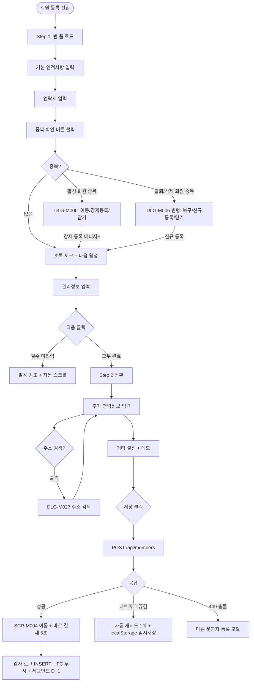
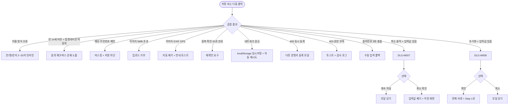

# SCR-M002 회원 등록 페이지

## 1. 화면 메타 정보

이 문서는 회원 등록 페이지에 대한 자기완결형 요구사항 정의서입니다. 다른 문서를 함께 보지 않아도 이 문서 한 장만으로 회원 등록 페이지에 들어가는 모든 영역, 모든 버튼, 모든 모달, 모든 권한, 모든 예외 처리, 그리고 이 화면을 지탱하는 운영 정책까지 전부 이해하고 구현할 수 있도록 작성합니다.

| 항목 | 값 |
|---|---|
| 작성일 | 2026-05-22 |
| 버전 | v1.0 |
| 상태 | 최신 통합본 반영 (정합화 완료) |
| 도메인 | D02 회원관리 |
| 화면 ID | SCR-M002 |
| 화면명 | 회원 등록 |
| 화면 유형 | 입력 폼 화면 (Form Screen, 2-Step Wizard) |
| 라우트 (URL) | `/members/new` |
| 플랫폼 | 데스크톱(기본), 태블릿, 모바일 풀스크린 |
| 우선순위 | P0 (출시 필수) |
| 기능코드 | MBR-03 (회원 등록·수정) |
| 계약코드 | MBR-03 |
| 계약 상태 | 계약 범위 본기능 |
| 부모 기능 prefix | MBR |
| Lv1 코드 | MBR-03 |
| Lv2 / Lv3 세분화 | MBR-03-01 ~ MBR-03-09 (단계 표시기, 프로필 사진, Step1 인적사항, Step1 관리정보, Step2 추가정보, Step2 기타설정, 하단 버튼, 저장+결제 진입, 이탈 확인) |
| 연계 화면 | SCR-M001 회원목록, SCR-M003 회원수정, SCR-M004 회원상세, SCR-S003 결제 처리, SCR-097 감사로그 |
| 호출 다이얼로그 | DLG-M006 전화번호중복, DLG-M007 작업취소확인, DLG-M008 초기화확인, DLG-M027 주소검색 |

## 2. 화면 개요와 목적

회원 등록 페이지는 센터에 새로운 회원을 시스템에 들이는 시작점입니다. 운영 현장의 가장 흔한 시나리오는 카운터 앞에 처음 방문한 손님을 마주한 스태프나 프런트가 빠르게 회원을 만들고 곧장 이용권 결제로 넘어가는 것입니다. 이 화면은 그 동선을 깨지 않기 위해 입력을 두 단계로 명확히 나누고, 저장이 끝난 직후에는 회원 상세 화면 위에 5초간 "바로 결제" 버튼이 잠시 떠올라 신규 회원을 망설임 없이 결제로 끌어옵니다.

Step 1은 회원이 누구인지(이름·성별·연락처·회원구분)와 그 회원을 운영상 누가 어디에서 관리할지(소속지점·기본 이용지점·담당 FC·담당 트레이너·기본 매출 귀속 지점·기본 인센티브 귀속자·방문경로·유입경로·운동 목적)를 받습니다. Step 2는 마케팅과 후속 관리에 필요한 정보(별칭·이메일·주소·회사명·출석번호·광고 동의·메모)를 선택적으로 받습니다. 두 단계로 나눈 이유는 명확합니다. 카운터에서 줄이 길 때는 Step 1만 1분 안에 끝내고 결제로 직행하고, 사전 상담이 있었던 매니저는 Step 2까지 채워 CRM·세그먼트(MBR-EXT-04) 분석에 필요한 정보를 확보합니다.

이 화면은 단순한 입력 폼이 아닙니다. 연락처 중복 검증, 법인 회원 모드, 이미지 EXIF GPS 제거, 메모 민감정보 패턴 검출, 입력 도중 페이지 이탈 시 임시 저장, 본사 통합 모드에서의 지점 컨텍스트 처리까지 운영 현장의 잡음과 정책이 그대로 녹아 있습니다.

## 3. 진입 경로와 인접 화면

회원 등록 페이지로 들어오는 가장 일반적인 경로는 회원 목록(SCR-M001) 페이지 우측 상단의 "회원 추가" 버튼입니다. 이 버튼은 매니저 이상의 권한자에게 노출되며, 누르면 즉시 URL이 `/members/new`로 바뀌면서 빈 폼 상태로 진입합니다. 두 번째 경로는 대시보드(SCR-101)의 "오늘 신규 등록" 카드 우측에 위치한 "회원 추가하기" 미니 버튼이고, 세 번째 경로는 알림 센터(SCR-104)에서 "신규 방문 회원이 대기 중입니다" 알림을 누른 직후에 회원 등록 화면으로 전환되는 흐름입니다. 마지막은 본사 통합 모드에서 본사 관리자가 특정 지점을 대신 등록할 때 지점 선택 후 회원 추가 진입입니다.

이 화면에서 빠져나가는 인접 화면은 두 갈래로 나뉩니다. 저장에 성공하면 자동으로 회원 상세(SCR-M004)로 이동하면서 우측 상단에 5초 카운트다운이 있는 "바로 결제" 버튼이 노출되어, 누르면 결제 처리 화면(SCR-S003)으로 자연스럽게 진입합니다. 저장하지 않고 취소하면 호출 직전 화면(회원 목록 또는 대시보드)으로 되돌아갑니다. 입력 도중 강제로 새로고침을 하거나 브라우저 탭을 닫으려 하면 브라우저 기본 경고가 뜨고, 운영자가 페이지를 떠나기로 결정한 경우에도 localStorage에 30분 TTL로 입력값이 임시 저장되어 다시 같은 URL에 진입하면 "이전에 작성 중이던 내용을 불러올까요?"라고 묻습니다.

## 4. 레이아웃과 UI 구성

회원 등록 페이지는 데스크톱에서 가운데 정렬된 단일 컬럼 폼으로 그려집니다. 가장 위에는 페이지 헤더가 있고, 헤더에는 "회원 등록"이라는 타이틀과 그 옆에 현재 작업 중인 지점 컨텍스트 배지(슈퍼관리자가 본사 통합 모드에서 특정 지점을 선택해 등록할 때 그 지점명이 표시됨)가 함께 표시됩니다. 헤더 우측에는 "초기화" 버튼이 있고, 입력값이 하나라도 있을 때만 활성화됩니다.

헤더 바로 아래에는 2단계 진행 표시기(Stepper)가 있습니다. Step 1, Step 2가 동그라미와 연결선으로 표시되며 현재 단계가 강조됩니다. Step 1에서는 Step 2가 회색으로 비활성화되고, Step 1을 완료한 후에야 Step 2가 활성화되어 클릭으로도 이동할 수 있습니다.

진행 표시기 아래에는 프로필 사진 업로더가 원형으로 배치됩니다. 사진을 업로드하지 않으면 이름의 첫 글자로 만든 이니셜 아바타가 자동 생성되어 표시되고, 사진을 클릭하면 파일 선택 다이얼로그가 열립니다. 업로드 도중에는 로딩 스피너가 표시되고, 업로드가 완료되면 미리보기로 즉시 교체됩니다. 5MB를 초과하거나 JPEG/PNG/WebP가 아닌 파일은 거부됩니다.

Step 1의 본문은 두 개의 그룹으로 나뉘어 있습니다. 첫 그룹은 "기본 인적 사항"이며 이름·성별 토글(남/여)·연락처+중복 확인 버튼·회원구분 라디오(일반/기명법인/무기명법인)·법인 회사명(법인 선택 시 조건부 노출)·생년월일 캘린더·키(cm) 입력란이 위에서 아래로 차곡차곡 배치됩니다. 두 번째 그룹은 "관리 정보"이며 소속지점·기본 이용지점·담당 상담자(FC)·담당 트레이너·방문경로·유입경로·운동 목적·기본 매출 귀속 지점·기본 인센티브 귀속자의 9개 드롭다운이 2열 그리드로 배치되고, 그룹 상단에는 "회원 기본값입니다. 결제 시점에는 다시 확인·조정할 수 있습니다"라는 안내 배너가 보입니다.

Step 2의 본문은 "추가 연락 정보"와 "기타 설정"으로 나뉩니다. 추가 연락 정보에는 별칭/닉네임·이메일·주소(주소 검색 버튼 옆에 붙음)·상세 주소·회사명·출석번호 입력란이 있고, 기타 설정에는 광고성 정보 수신 동의 체크박스와 최대 500자까지 입력 가능한 메모 영역이 있으며 메모 영역 우측 하단에 글자 수가 실시간으로 표시됩니다.

페이지 하단에는 고정된 액션 바가 있습니다. Step 1에서는 좌측에 "취소", 우측에 "다음" 버튼이 놓이고, Step 2에서는 좌측에 "이전", 우측에 "저장" 버튼이 놓입니다. 액션 바는 본문이 길어져도 화면 하단에 고정되어 사용자가 스크롤 위치와 무관하게 즉시 누를 수 있습니다.

## 5. 단계별 동작과 화면 흐름

Step 1은 회원의 정체성과 운영 컨텍스트를 받는 단계이며, 이 단계의 핵심 검증은 연락처 중복 확인입니다. 사용자가 연락처를 010 형식으로 입력하면 마스크가 자동으로 적용되고, 입력이 끝나면 옆의 "중복 확인" 버튼이 활성화됩니다. 이 버튼을 눌러 `POST /api/members/check-phone`을 호출하고 응답이 정상이어야만 "다음" 버튼이 활성화됩니다. 중복 확인 결과는 30초간만 유효하며, 30초가 지나면 자동으로 무효화되어 다시 확인해야 합니다. 이는 운영자가 중복 확인 직후 자리를 비웠다가 30분 뒤 돌아와 저장 버튼을 누를 때 그 사이 발생한 다른 운영자의 등록 충돌을 막기 위한 정책입니다.

연락처 중복이 발견되면 DLG-M006 전화번호 중복 안내 다이얼로그가 뜨고, 활성 회원과 중복인 경우에는 기존 회원 카드(이름·이용권 상태)와 함께 "기존 회원으로 이동", "강제 등록(매니저+만 가능, 무기명 법인 같은 케이스에 사용)", "닫기"의 세 선택지가 제공됩니다. 탈퇴·삭제 회원과 중복인 경우에는 같은 모달이지만 우선순위가 바뀌어 "복구로 이동"이 권장되고 그 다음에 "신규 등록"이 가능합니다.

"다음" 버튼을 누르면 모든 필수 필드(이름·성별·연락처+중복확인 완료·회원구분)가 채워졌는지 확인한 뒤, 미입력 필드가 있으면 빨강으로 강조하고 가장 위쪽의 미입력 필드로 자동 스크롤됩니다. 모두 채워졌으면 Step 2로 전환되고, 진행 표시기가 Step 2를 강조 상태로 갱신합니다.

Step 2에서는 모든 입력이 선택 사항이지만, 입력하면 그만큼 회원 데이터의 마케팅·후속 케어 가치가 올라갑니다. 주소 입력란 옆의 "주소 검색" 버튼을 누르면 DLG-M027 주소 검색 다이얼로그가 열려, 도로명·지번·건물명으로 검색 후 결과를 선택하면 우편번호와 도로명 주소가 자동 채워지고 상세 주소만 사용자가 입력합니다. 메모 영역에 주민번호 패턴(6자리-7자리)이 감지되면 즉시 빨강 인라인 경고와 함께 저장이 차단됩니다.

"이전" 버튼은 Step 2에서 Step 1로 돌아가는 동작으로, Step 1에서 입력한 값과 Step 2에서 입력한 값은 모두 보존됩니다. "저장" 버튼은 누른 즉시 비활성화되어 더블 클릭 방지 처리되고, `POST /api/members`가 호출됩니다. 저장 도중 네트워크가 끊기면 자동으로 1회 재시도되고, 그래도 실패하면 입력값이 localStorage에 30분 TTL로 임시 저장된 뒤 "네트워크가 불안정해요" 토스트가 표시됩니다.

저장 성공 시 회원 상세(SCR-M004)로 이동하면서 우측 상단에 5초 카운트다운이 도는 "바로 결제" 버튼이 표시됩니다. 5초가 지나면 버튼은 사라지고 일반 회원 상세 상태로 전환됩니다. 출석번호를 수동 입력하지 않은 경우 시스템이 자동으로 지점 내 유일한 4~6자리 숫자를 부여하며, 3회 재시도까지 충돌이 발생하면 운영자에게 "출석번호 자동 생성에 실패했어요. 직접 입력해주세요"라고 안내합니다.

## 6. 버튼·아이콘·링크 액션 전체 정의

이 화면에 등장하는 모든 클릭 가능 요소를 빠짐없이 정의합니다.

프로필 사진 업로더 영역은 클릭으로 파일 선택 다이얼로그를 열고, 5MB 이내 / JPEG·PNG·WebP만 허용합니다. 업로드 직후 EXIF GPS 정보가 자동 제거되며 사용자에게 "위치 정보를 제거했어요" 안내가 짧게 뜹니다. 이미지를 다시 클릭하면 교체할 수 있고, 작은 휴지통 아이콘으로 제거하면 다시 이니셜 아바타로 돌아갑니다.

성별 토글은 남/여 두 버튼이 가로로 붙어 있는 형태이며, 누르면 즉시 한쪽이 선택 상태로 변합니다. 필수 입력이지만 누락 시 "다음"을 눌러야만 경고가 표시됩니다.

연락처 옆의 "중복 확인" 버튼은 연락처가 11자리 010 형식으로 완성된 경우에만 활성화됩니다. 누르면 백엔드 호출이 시작되어 로딩 스피너가 잠시 표시되고, 결과가 돌아오면 정상이면 초록 체크가, 중복이면 DLG-M006이 표시됩니다. 같은 연락처를 다시 입력하면 이전 중복 확인이 무효화되고 버튼을 다시 눌러야 합니다.

회원구분 라디오는 일반/기명법인/무기명법인의 세 옵션이며, 기명 또는 무기명 법인을 선택하면 그 아래에 "법인 회사명" 입력란이 부드럽게 펼쳐집니다. 일반으로 다시 돌리면 회사명이 비워진다는 안내가 잠깐 표시된 뒤 입력란이 사라집니다.

주소 입력란 옆의 "주소 검색" 버튼은 DLG-M027을 호출합니다. 다이얼로그 안에서 주소를 선택하고 확인을 누르면 본문 주소 필드에 자동 입력됩니다.

광고성 정보 수신 동의 체크박스는 누를 때 즉시 토글되며, 동의 시 `marketing_agreed_at` 타임스탬프가 저장됩니다. 동의 철회는 이 화면에서 할 수 없고 회원 본인이 모바일 앱에서만 할 수 있다는 안내가 체크박스 아래에 작은 글씨로 표시됩니다(전자문서법).

하단 액션 바의 "취소" 버튼은 입력값이 하나라도 있으면 DLG-M007 작업 취소 확인 다이얼로그를 띄우고, 입력값이 전혀 없으면 즉시 이전 화면으로 돌아갑니다. "초기화" 버튼은 입력값이 있을 때만 활성화되며 누르면 DLG-M008 초기화 확인 다이얼로그가 뜹니다. "다음" 버튼은 Step 1 필수 항목과 중복 확인이 모두 완료된 경우에만 활성화되고, "이전" 버튼은 Step 2에서 항상 활성화되며 누르면 즉시 Step 1로 전환합니다. "저장" 버튼은 누른 직후 로딩 상태로 전환되어 중복 클릭이 차단됩니다.

## 7. 호출되는 모달 동작

### 7-1. DLG-M006 전화번호 중복 안내 다이얼로그

전화번호 중복 안내 다이얼로그는 연락처 중복 확인 결과가 "이미 등록됨"으로 돌아왔을 때 호출됩니다. 회원 등록 페이지에서 이 모달은 두 가지 경우로 나뉘어 다르게 보입니다. 활성 회원과 중복일 때는 모달 본문에 기존 회원 카드(이름·이용권 상태·등록일·소속 지점)가 표시되고 "기존 회원으로 이동"과 "강제 등록", "닫기" 버튼이 함께 노출됩니다. "기존 회원으로 이동"을 누르면 현재 입력값이 폐기되고 SCR-M004 회원 상세로 페이지가 전환됩니다. "강제 등록"은 매니저 이상 권한자에게만 노출되며, 무기명 법인 같은 동일 연락처로 별도 등록이 필요한 케이스에 사용됩니다. 강제 등록을 선택하면 모달이 닫히고 부모 화면의 중복 확인 상태가 "강제 통과" 표시로 바뀌어 다음 단계로 진행할 수 있습니다.

탈퇴·삭제 회원과 중복일 때는 모달 본문에 마스킹된 회원 정보(이름은 첫 글자만, 연락처는 가운데 자리만 마스킹)와 함께 "복구로 이동" 버튼이 우선순위 상단에 표시되고, 그 아래에 "신규 등록(별도 회원 ID 부여)"과 "닫기" 버튼이 표시됩니다. 복구로 이동을 선택하면 회원 목록의 삭제·탈퇴 회원 섹션으로 이동해 해당 회원을 복구합니다. 신규 등록을 선택하면 모달이 닫히고 부모 화면에서 새 회원 ID로 등록을 계속 진행합니다.

### 7-2. DLG-M007 작업 취소 확인 다이얼로그

작업 취소 확인 다이얼로그는 "취소" 버튼을 눌렀는데 입력값이 하나라도 있을 때 표시됩니다. 모달 제목은 "작업을 취소하시겠습니까?"이고 본문은 "입력하신 내용이 저장되지 않습니다"입니다. "계속 작성" 버튼은 모달을 닫고 입력 화면으로 복귀시키며, "취소 확인" 버튼은 입력값을 모두 폐기하고 이전 화면(회원 목록 또는 대시보드)으로 돌아갑니다. ESC 키나 배경 클릭은 "계속 작성"과 같은 동작입니다.

### 7-3. DLG-M008 입력 폼 초기화 확인 다이얼로그

초기화 확인 다이얼로그는 "초기화" 버튼을 눌렀을 때 입력값이 있는 경우에만 표시됩니다. 모달 제목은 "입력 내용을 초기화하시겠습니까?"이고 본문은 "입력하신 모든 내용이 초기 상태로 돌아갑니다"입니다. "확인"을 누르면 모든 필드가 빈 상태로 리셋되고 Step도 Step 1로 돌아갑니다. "취소"는 모달만 닫습니다. 입력값이 전혀 없으면 초기화 버튼 자체가 비활성화 상태이므로 이 모달은 호출되지 않습니다.

### 7-4. DLG-M027 주소 검색 다이얼로그

주소 검색 다이얼로그는 Step 2의 "주소 검색" 버튼을 눌러 호출됩니다. 모달 안에 검색어 입력란이 있고, 도로명·지번·건물명을 입력하고 "검색"을 누르면 우편번호·도로명 주소·지번 주소가 리스트로 표시됩니다. 결과 행을 선택하면 상세 주소 입력란이 활성화되며, 사용자가 동·호수를 입력하고 "확인"을 누르면 모달이 닫히면서 부모 화면의 주소 필드에 자동 입력됩니다. "닫기"는 변경 없이 모달을 닫고, ESC 또는 배경 클릭도 동일하게 동작합니다.

## 8. 토스트와 확인 팝업과 알럿

저장 성공 시 회원 상세로 이동하면서 우측 상단에 "회원이 등록되었어요" 토스트가 5초간 표시되고, 그 위에 "바로 결제" 버튼이 카운트다운과 함께 떠 있습니다. 이미지 EXIF 위치 정보가 자동 제거된 경우 "사진의 위치 정보를 제거했어요"라는 정보 토스트가 잠깐 표시됩니다. 출석번호 자동 생성이 3회 충돌하면 "출석번호 자동 생성에 실패했어요. 직접 입력해주세요" 경고가 출석번호 입력란 아래에 인라인으로 표시됩니다.

저장 실패 시 표시되는 토스트는 케이스별로 다릅니다. 네트워크 끊김 시에는 "네트워크가 불안정해요. 잠시 후 다시 시도해주세요"라고 빨강 토스트가 뜨고 자동 재시도 1회가 진행됩니다. 권한 부족(403) 시에는 "이 작업을 수행할 권한이 없어요" 토스트와 함께 입력값은 유지된 채 저장이 중단됩니다. 동시 편집 충돌(409) 시에는 "다른 운영자가 동시에 등록했어요"라는 모달이 뜨고 새로고침 후 재시도하도록 안내합니다.

권한이 없는 계정(FC·트레이너·프런트·readonly)이 직접 URL `/members/new`로 진입하면 페이지 본문 전체가 가려지고 "이 화면에 접근할 권한이 없습니다. 3초 후 대시보드로 이동합니다"라는 차단형 알럿이 표시된 후 자동 이동합니다.

## 9. 데이터 흐름과 외부 연동

화면 진입 시점에는 별도의 GET 호출이 없습니다. 폼은 빈 상태로 시작합니다. 슈퍼관리자가 본사 통합 모드에서 진입한 경우에는 헤더 컨텍스트로 선택된 지점 ID가 폼의 소속지점 기본값으로 미리 채워져 있습니다.

연락처 중복 확인은 `POST /api/members/check-phone`을 호출하고, 응답에는 중복 여부(`isDuplicate`), 중복 회원의 상태(`status`: ACTIVE / WITHDRAWN / DELETED), 마스킹된 회원 정보(`maskedProfile`)가 포함됩니다. 중복이 발견되면 DLG-M006이 호출됩니다.

저장은 `POST /api/members`를 호출합니다. 요청 본문에는 모든 입력값과 함께 호출 직전 중복 확인의 토큰(`phoneCheckToken`, 30초 유효)이 포함되어, 백엔드는 이 토큰의 유효성을 다시 검증합니다. 저장 응답에는 새 회원의 ID와 자동 생성된 출석번호가 포함되며, 클라이언트는 이 ID로 `/members/:id`로 이동합니다.

저장이 완료되면 자동화 체인이 트리거됩니다. NFR-19 알림 센터를 통해 담당 FC에게 "신규 회원이 배정되었어요" 푸시가 전송되고, MBR-EXT-04 세그먼트 자동 분류 배치가 D+1 새벽 4시에 회원에게 "신규" 라벨을 부여합니다. 등급 시스템(MBR-EXT-03)은 등록 시점에 기본 "브론즈" 등급을 부여하고 누적 결제 0원으로 시작합니다. 광고 동의를 체크한 경우 마케팅 CRM의 알림톡 발송 대상에 즉시 등록됩니다.

SCR-097 감사 로그에는 등록 이벤트가 actor_id·new_member_id·timestamp·fields(저장된 필드 전체의 JSON)으로 INSERT됩니다. 이 INSERT는 저장 응답이 사용자에게 돌아간 직후 5초 안에 보장됩니다.

이미지 업로드는 S3 멀티파트 업로드로 처리되며, 업로드 도중 사용자가 페이지를 떠나면 임시 S3 객체가 자동 정리됩니다. 저장 시점에 이미지가 업로드 중이면 저장 버튼이 자동 비활성화되어 업로드 완료를 기다립니다.

화면에서 호출하는 주요 API 엔드포인트: 연락처 중복 확인 `POST /api/members/check-phone`, 회원 등록 `POST /api/members`, 주소 검색 `GET /api/address/search`, 이미지 업로드 `POST /api/upload/profile-image`.

## 10. 화면 상태와 예외 처리

이 화면은 다음 상태들을 가질 수 있고 각 상태마다 사용자에게 보이는 모습이 달라집니다.

초기 상태에서는 모든 입력란이 비어 있고 초기화 버튼은 비활성, "다음" 버튼은 비활성, 진행 표시기는 Step 1을 강조한 상태입니다. 입력 중 상태는 사용자가 어떤 필드든 값을 입력하기 시작한 직후로, 초기화 버튼이 활성화되고 빠져나가기 시도 시 DLG-M007이 트리거됩니다.

연락처 미확인 상태는 연락처는 입력했지만 "중복 확인"을 누르지 않은 상태이며 "다음" 버튼은 여전히 비활성입니다. 연락처 확인 완료 상태에서는 초록 체크가 표시되고 "다음" 버튼이 활성화됩니다. 30초가 지나면 자동으로 미확인 상태로 되돌아가면서 "중복 확인이 만료됐어요. 다시 확인해주세요"라는 인라인 경고가 나타납니다.

법인 회원 모드는 회원구분에서 기명 또는 무기명 법인을 선택한 상태로, 회사명 입력란이 펼쳐져 있고 무기명 법인의 경우 DLG-M006에서 강제 등록을 허용하는 흐름이 가능해집니다.

이미지 업로드 중 상태에서는 프로필 영역에 스피너가 표시되고 "저장" 버튼은 자동 비활성화됩니다. 저장 중 상태에서는 액션 바의 모든 버튼이 비활성화되고 스피너가 표시됩니다. 등록 완료 상태는 저장 직후 회원 상세로 페이지가 전환되기 직전의 짧은 순간이며, 사용자에게는 별도로 보이지 않습니다.

예외 케이스별 처리는 다음과 같이 정의됩니다. 이름 형식 오류(특수문자·이모지 포함)는 인라인 빨강 메시지로 "한/영/한자 2~20자만 입력 가능"이라고 표시되고 저장이 차단됩니다. 만 14세 미만 회원은 법정 대리인 동의 체크박스가 강제로 노출되고 미체크 시 저장이 차단됩니다(개인정보보호법). 메모에 주민번호 패턴이 감지되면 해당 부분이 마스킹되고 저장이 차단됩니다. 이미지 5MB 초과나 허용되지 않은 포맷은 업로드 자체가 거부됩니다.

연락처 중복 확인 30초 만료 후 "다음"을 시도하면 "중복 확인이 만료됐어요" 알림이 뜨고 재확인 후 진행해야 합니다. 동시 수정 충돌은 거의 발생하지 않지만, 동일 연락처에 대해 두 운영자가 동시 등록을 시도하면 후행 요청은 409 Conflict로 거부됩니다. 출석번호 자동 생성 3회 실패는 사용자가 직접 입력하는 흐름으로 폴백합니다.

저장 도중 네트워크 끊김이 발생하면 입력값이 localStorage에 30분 TTL로 저장되고, 같은 사용자가 같은 URL로 30분 안에 재진입하면 "이전에 작성 중이던 내용을 불러올까요?" 모달이 표시되어 복원할 수 있습니다.

## 11. 권한별 처리

이 화면은 권한에 따라 진입 가능 여부와 일부 액션이 달라집니다.

superAdmin와 primary는 모든 기능을 사용할 수 있습니다. 본사 통합 모드에서 다른 지점 회원을 대신 등록할 수 있고, DLG-M006의 강제 등록 옵션도 사용할 수 있습니다.

Owner(지점장)·매니저(manager)는 자기 지점에 한정해 회원 등록 모든 기능을 사용할 수 있습니다. 본사 통합 모드 토글은 보이지 않거나 비활성화되어 있고, DLG-M006의 강제 등록은 매니저 이상 권한자가 사용할 수 있습니다.

스태프(staff)도 자기 지점 회원 등록을 모두 사용할 수 있지만 회원구분의 "기명법인/무기명법인" 옵션은 매니저 이상에게만 활성화되어 스태프 화면에서는 일반만 선택 가능합니다(법인 회원 운영의 복잡성 때문). 또한 DLG-M006 강제 등록은 스태프에게 노출되지 않습니다.

FC(fc), 트레이너(trainer), 프런트(front)는 이 화면에 진입할 수 없습니다. 사이드바와 회원 목록의 "회원 추가" 버튼이 보이지 않으며, 직접 URL로 진입하면 접근 제한 알럿 후 대시보드로 자동 이동됩니다.

readonly는 이 화면에 진입할 수 없습니다.

권한별 액션 차단은 단계적으로 일관되게 적용됩니다. 첫째, 사이드바와 회원 목록의 "회원 추가" 같은 1차 진입점에서 권한 없는 계정에게는 메뉴 자체가 숨겨집니다. 둘째, 직접 URL 접근 시 페이지 본문이 가려지면서 접근 제한 알럿이 표시됩니다. 셋째, 백엔드 응답이 403인 경우 "권한이 없어요" 토스트가 표시되며 모든 권한 차단 이벤트는 감사 로그에 기록됩니다.

## 12. 메인 흐름

회원 등록 페이지의 핵심 동작 흐름을 다이어그램으로 표현합니다.

## 13. 에러와 예외 흐름

에러와 예외 상황에서의 분기를 별도 흐름으로 표현합니다.

## 14. 핵심 디자인 요청사항

회원 등록 화면이 운영자에게 잘 작동하려면 다음 디자인 원칙이 시각적으로 명확히 드러나야 합니다.

진행 표시기는 현재 단계가 한눈에 보여야 합니다. Step 1과 Step 2의 동그라미는 동일 크기로 배치되고, 현재 단계는 강조 색상(브랜드 컬러)으로, 완료된 단계는 채워진 동그라미와 체크 아이콘으로, 비활성 단계는 회색 윤곽으로 표현합니다. 두 단계 사이의 연결선도 진행 상태에 따라 색이 채워집니다.

필수 항목은 라벨 옆에 빨강 별표를 붙여 누락 시 빨강 테두리로 강조합니다. 색맹 운영자를 위해 별표와 텍스트 메시지를 항상 함께 노출합니다.

연락처 중복 확인 버튼은 입력 직후에는 회색 비활성, 11자리 완성 후에는 활성, 확인 완료 후에는 초록 체크 아이콘으로 시각적 단계 전환을 명확히 보여야 합니다. 만료된 경우 다시 회색으로 돌아오고 우측에 작은 노랑 경고 아이콘이 추가됩니다.

프로필 사진 영역은 원형이며 호버 시 카메라 아이콘이 가운데 떠올라 클릭 가능함을 안내합니다. 이니셜 아바타는 배경색이 회원 이름의 첫 글자 해시에 따라 7~8가지 톤 중 하나로 결정됩니다.

법인 회원 모드에서 회사명 입력란이 등장할 때는 페이드 인 애니메이션으로 부드럽게 펼쳐지고, 일반으로 돌아갈 때는 페이드 아웃으로 사라집니다. 단순한 보이기/숨기기보다 사용자가 변경을 인식하도록 합니다.

하단 액션 바는 화면 하단에 fixed로 떠 있어 본문 스크롤과 무관하게 항상 보입니다. 좌측 취소·이전 버튼은 회색 톤(보조 액션), 우측 다음·저장 버튼은 강조 톤(주 액션)으로 시각적 위계를 명확히 합니다.

저장 직후 회원 상세로 전환되는 시점의 "바로 결제" 버튼은 5초 카운트다운이 작은 게이지 형태로 표시되어 시간이 흘러감을 직관적으로 알려야 합니다.

모바일에서는 폼이 풀스크린으로 전환되고, 두 단계는 슬라이드 애니메이션으로 좌우 전환됩니다. 키보드가 올라올 때 입력 필드가 가려지지 않도록 스크롤 보정이 적용됩니다.

## 15. 운영 정책 (이 화면에 연결된 부분)

이 화면은 단순한 입력 폼이 아니라 회원 데이터의 시작점이며, 그렇기 때문에 PII(개인정보)·등급·세그먼트·감사·결제 진입까지 여러 정책이 한 화면에 얽혀 있습니다. 다른 문서를 보지 않아도 이 화면을 구현·운영하는 사람이 알아야 할 정책을 모두 풀어 씁니다.

연락처는 회원의 1차 식별자이며 중복은 운영상 큰 혼란을 일으킵니다. 그래서 활성 회원 연락처와의 중복은 매니저 이상 권한자만 "강제 등록"으로 우회할 수 있고, 그 외 권한자는 기존 회원으로 이동하거나 다른 번호로 다시 입력해야 합니다. 무기명 법인의 경우 동일 회사 번호로 여러 회원을 등록해야 하므로 강제 등록이 필요한 정당한 사례입니다. 탈퇴·삭제 회원 연락처와의 중복은 복구 우선 안내가 정책입니다. 회원이 이전에 가입했다가 탈퇴한 케이스를 신규 등록으로 처리하면 과거 이력이 단절되기 때문에, 복구로 유도하는 것이 운영 관점에서 옳습니다.

중복 확인 결과의 30초 유효 정책은 두 가지 이유로 존재합니다. 첫째, 검증과 저장 사이에 다른 운영자가 같은 연락처를 먼저 등록할 가능성을 막기 위해서이고, 둘째, 운영자가 검증 후 자리를 비웠다가 한참 뒤 돌아와 무심코 저장하는 사고를 막기 위해서입니다.

만 14세 미만 회원의 법정 대리인 동의 체크박스는 개인정보보호법에 따른 정책입니다. 동의가 없으면 저장이 차단되며, 동의를 받은 사실은 회원 데이터에 별도 컬럼으로 저장됩니다.

이름 입력의 한/영/한자 2~20자 정책은 검색 정합성과 출력 가독성을 위한 것이며, 외국인 회원의 영문 미들네임 공백은 허용합니다. 특수문자와 이모지는 검색·정렬·CSV 출력을 망가뜨리기 때문에 차단합니다.

메모 영역의 주민번호 패턴 차단은 PII 최소수집 원칙입니다. 운영자가 무심코 메모에 주민번호를 적어 두면 PII가 비식별 영역으로 확산되어 X11 마스킹 정책의 통제를 벗어납니다. 따라서 입력 시점에 정규식으로 검출해 저장을 막습니다.

이미지의 EXIF GPS 자동 제거는 개인정보보호 정책입니다. 회원이 스스로 찍은 셀카에는 종종 GPS 좌표가 포함되어 있고, 이를 그대로 저장하면 회원의 거주지나 직장 좌표가 시스템에 누적됩니다. 업로드 즉시 EXIF를 정리해 이런 누출을 차단합니다.

광고성 정보 수신 동의는 등록 시점에 받을 수 있지만 동의 철회는 회원 본인이 모바일 앱에서만 할 수 있다는 정책은 전자문서법에 따른 결과입니다. 운영자가 회원 대신 동의를 철회할 수 있게 하면 마케팅 동의 자체의 법적 효력이 약해지기 때문입니다.

기본 귀속 필드(homeBranchId·defaultUsageBranchId·defaultSalesAttributionBranchId·defaultIncentiveOwnerId·assignedConsultantId·assignedTrainerId)와 거래 시점 귀속 필드(paymentBranchId·usageBranchId·salesAttributionBranchId·settlementBranchId·incentiveOwnerId)를 분리해 저장하는 정책은 KPI·정산 정확성의 근간입니다. 이 화면에서 입력하는 값은 회원 기본값이며, 실제 결제·환불·수업·정산 레코드는 거래 발생 시점의 값을 따로 저장합니다. 운영 시점에 회원 기본값이 변경되어도 과거 거래의 귀속은 흔들리지 않습니다.

branchId 직접 변경 차단 정책은 데이터 일관성을 위한 정책입니다. 등록된 회원의 소속 지점을 임의로 변경하면 결제·이용권·출석 이력의 정합성이 깨지므로, 지점 변경은 SCR-M005 회원 이관 화면을 통해서만 가능합니다.

부분 저장(드래프트) localStorage 30분 TTL 정책은 네트워크 장애 복원성을 위한 것입니다. 카운터에서 등록 도중 인터넷이 끊기거나 브라우저가 죽는 경우 입력값을 잃지 않도록 합니다.

권한 차단 시점은 사이드바·진입 버튼·페이지 본문·백엔드 응답까지 4단계로 일관되게 적용되며, 모든 권한 차단 이벤트는 감사 로그에 기록되어 사후에 권한 우회 시도를 추적할 수 있게 합니다.

수정 권한별 차이(매니저는 회원구분 변경 불가, 슈퍼관리자만 모든 필드 수정 가능, FC/트레이너는 메모·운동목적 외 수정 불가)는 운영 실수의 영향을 최소화하기 위한 RBAC 세부 정책입니다.

이상의 정책은 이 화면을 구현하고 운영하는 사람이 별도 문서 없이 이 한 장으로 이해할 수 있도록 풀어 적었습니다. 정책이 바뀌면 이 문서가 함께 갱신되어야 하며, 코드 변경과 정책 변경은 항상 짝지어 진행됩니다.
