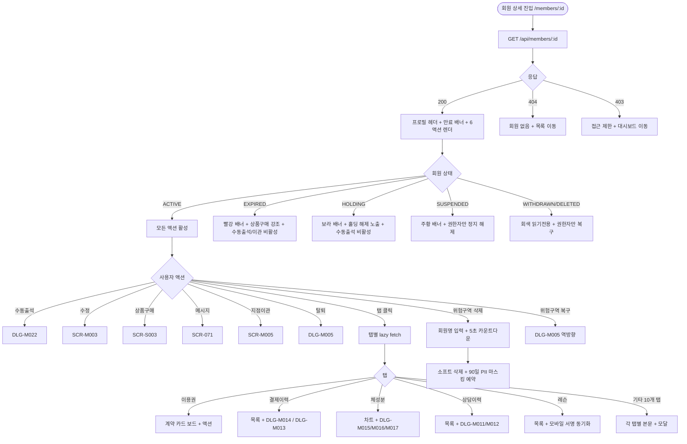
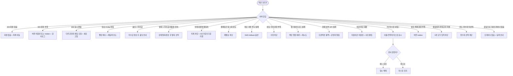

# SCR-M004 회원 상세 페이지

## 1. 화면 메타 정보

이 문서는 회원 상세 페이지에 대한 자기완결형 요구사항 정의서입니다. 다른 문서를 함께 보지 않아도 이 문서 한 장만으로 회원 상세 페이지에 들어가는 모든 영역, 모든 탭, 모든 버튼, 모든 모달, 모든 권한, 모든 예외 처리, 그리고 이 화면을 지탱하는 운영 정책까지 전부 이해하고 구현할 수 있도록 작성합니다.

| 항목 | 값 |
|---|---|
| 작성일 | 2026-05-22 |
| 버전 | v1.0 |
| 상태 | 최신 통합본 반영 (정합화 완료) |
| 도메인 | D02 회원관리 |
| 화면 ID | SCR-M004 |
| 화면명 | 회원 상세 |
| 화면 유형 | 허브 화면 (Hub Screen, 15개 탭 + 고정 헤더 + 위험 구역) |
| 라우트 (URL) | `/members/detail` (탭 deep link: `/members/detail?tab=usage` 등) |
| 플랫폼 | 데스크톱(기본), 태블릿, 모바일 풀스크린 |
| 우선순위 | P0 (출시 필수) |
| 기능코드 | MBR-02 (회원 상세) |
| 계약코드 | MBR-02, MBR-ADV-01, MBR-ADV-05, MBR-ADV-07, PRD-02 |
| 계약 상태 | 계약 범위 본기능 |
| 부모 기능 prefix | MBR |
| Lv1 코드 | MBR-02 |
| Lv2 / Lv3 세분화 | MBR-02-01 ~ MBR-02-22 (프로필 헤더, 만료 알림 배너, 헤더 6액션, 15개 탭, 홀딩 처리, 탈퇴 처리, 회원 삭제, 회원 복구) |
| 연계 화면 | SCR-M001 회원목록, SCR-M002 회원등록, SCR-M003 회원수정, SCR-M005 회원이관, SCR-M006 체성분관리, SCR-S003 결제처리, SCR-S004 미수금, SCR-071 메시지, SCR-073 쿠폰, SCR-074 마일리지, SCR-097 감사로그 |
| 호출 다이얼로그 | DLG-M001 상태변경, DLG-M002 삭제확인, DLG-M003 홀딩등록, DLG-M004 홀딩해제, DLG-M005 탈퇴처리, DLG-M009 메모추가, DLG-M010 메모삭제, DLG-M011 상담등록, DLG-M012 상담삭제, DLG-M013 환불처리, DLG-M014 결제상세, DLG-M015 체성분등록, DLG-M016 체성분덮어쓰기, DLG-M017 목표설정, DLG-M018 연장등록, DLG-M019 양도처리, DLG-M020 쿠폰적용, DLG-M021 마일리지조정, DLG-M022 수동출석, DLG-M023 이관확인, DLG-M024 종합평가등록, DLG-M025 운동프로그램배정, DLG-M026 운동이력등록, DLG-M029 가족연결, DLG-M030 등급변경 (회원관리 거의 전체 다이얼로그) |

## 2. 화면 개요와 목적

회원 상세 페이지는 한 명의 회원이 가진 모든 정보가 모이는 회원관리 도메인의 중심 허브입니다. 회원의 인적사항·이용권·출석·결제·예약·체성분·상담·레슨·평가·운동프로그램·운동이력 같은 15개 영역의 데이터가 탭으로 나뉘어 한 페이지에 모두 들어 있고, 상단에는 회원의 정체성과 현재 상태를 요약하는 고정 프로필 헤더가, 그 아래에는 만료 알림 배너와 6개의 주요 액션 버튼(수동출석·수정·상품구매·메시지·지점이관·탈퇴)이 자리 잡고 있습니다. 화면 하단에는 권한자에게만 보이는 위험 구역이 있어 회원 삭제·복구·강제 처리 같은 되돌리기 어려운 작업이 분리되어 있습니다.

이 화면이 다루는 운영 흐름은 회원과 관련된 거의 모든 업무를 포괄합니다. FC가 D-7 만료 임박 회원에게 리텐션 상담을 진행할 때 만료 배너 + 결제이력 탭 + 상담이력 탭 + 메시지 액션을 한 화면에서 모두 처리하고, 매니저가 회원의 환불 클레임에 응대할 때 결제내역 탭 + 출석이력 탭 + 상담메모 탭으로 사실관계를 파악합니다. 트레이너가 PT 세션 직전에 회원의 컨디션을 확인할 때 체성분 탭 + 종합평가 탭 + 운동프로그램 탭 + 운동이력 탭을 차례로 열어 세션 강도를 조정합니다. Owner(지점장)이 회원의 환불·양도·이관을 결재할 때 헤더 6액션과 상세내역 탭(홀딩·연장·양도·쿠폰·마일리지)으로 결재 근거를 확인합니다. primary가 정책 위반 의심 회원을 감사할 때 이 화면에서 모든 변경 이력의 단서를 종합한 후 SCR-097 감사 로그로 진입합니다. 회원 본인의 사망이나 중대 사고 같은 비상 상황에서는 탈퇴 처리(DLG-M005)로 회원 데이터를 보존하면서 X11 PII 마스킹 90일 카운트를 시작합니다.

이 화면은 회원의 라이프사이클 전체(등록 → 활성 이용 → 만료 임박 → 재등록 또는 만료 → 홀딩 또는 정지 또는 탈퇴 → 90일 후 PII 마스킹 → 1년 후 hard delete)를 단일 페이지에서 다룹니다. 각 상태마다 표시되는 배너의 색상과 강조 수준, 활성화되는 버튼, 안내 메시지가 완전히 달라지며, 본사 정책 세트의 step 결과에 따라 만료 알림 배너의 긴급도가 자동으로 조정됩니다.

## 3. 진입 경로와 인접 화면

회원 상세 페이지에 들어오는 가장 일반적인 경로는 회원 목록(SCR-M001)에서 회원명을 클릭하는 것입니다. 출석 시 상세 팝업 토글이 꺼져 있는 상태에서는 페이지 자체가 전환되어 `/members/detail`로 이동하고, 토글이 켜져 있으면 회원 목록 우측에 슬라이드 인 패널만 열리는데 그 패널 헤더의 "회원 상세로 이동" 링크를 누르면 전체 페이지로 전환됩니다. 두 번째 경로는 대시보드(SCR-101)의 회원 위젯, 세 번째는 글로벌 검색(SCR-103) 결과, 네 번째는 알림 센터(SCR-104)의 회원 관련 알림(예: "○○ 회원 상담 예약 도래")입니다. 회원 등록(SCR-M002) 저장 직후에도 자동으로 이 화면으로 이동하면서 우측 상단에 5초 카운트다운 "바로 결제" 버튼이 떠 있는 특수 진입 상태로 진입합니다.

URL 쿼리 파라미터로 진입 시점에 특정 탭을 미리 열어 둘 수 있습니다. 예를 들어 `/members/detail?tab=payment`는 결제이력 탭이 활성 상태로 진입하고, `/members/detail?tab=consultation`은 상담이력 탭이 활성 상태로 진입합니다. 이 deep link 지원 덕분에 알림 센터에서 "상담 예약 도래" 알림을 누르면 회원 상세의 상담이력 탭이 바로 열립니다.

이 화면에서 빠져나가는 인접 화면은 매우 많습니다. 헤더 6액션이 각각 다른 화면을 호출합니다. 수동출석은 DLG-M022 모달, 수정은 SCR-M003 회원 수정, 상품구매는 SCR-S003 결제 처리, 메시지는 SCR-071 메시지 발송, 지점이관은 SCR-M005 회원 이관, 탈퇴는 DLG-M005 탈퇴 처리 모달입니다. 탭 내부에서도 다양한 모달과 화면이 호출되며, 가장 자주 쓰이는 진입은 결제이력 탭의 결제 상세(DLG-M014)와 환불 처리(DLG-M013), 이용권 탭의 홀딩 등록(DLG-M003)·연장(DLG-M018)·양도(DLG-M019)입니다.

## 4. 레이아웃과 UI 구성

회원 상세 페이지는 위에서 아래로 차곡차곡 쌓이는 단일 컬럼 레이아웃을 기본으로 합니다. 가장 위에는 이동 경로 표시(브레드크럼)가 있어 "회원 목록 > ○○ 회원 상세"가 표시되고, 그 다음에 만료 알림 배너(조건부)가 옵니다. 만료 알림 배너는 본사 정책 세트의 step 결과가 있을 때만 표시되며, 색상과 강조 수준은 지점에 적용된 정책의 긴급도를 따릅니다. D-14는 info(파랑), D-7은 warning(주황), D-1은 danger(빨강) 톤이며, 배너 안에는 만료일까지 남은 일수와 정책 권장 액션(예: "리텐션 상담 추천")이 표시됩니다.

만료 알림 배너 아래에는 회원 프로필 요약 카드가 있습니다. 이 카드는 스크롤 중에도 상단에 고정되어 어느 탭에서든 즉시 회원의 핵심 정보를 볼 수 있게 합니다. 카드 좌측에는 프로필 사진과 관심회원 별표 토글이 있고, 가운데에는 회원명·등급 배지·상태 배지(활성/홀딩/만료/정지/탈퇴)와 만료일까지 남은 D-day 표시가 큰 글씨로 배치됩니다. 카드 우측에는 연락처·이메일이 있고 그 아래에 미수금·마일리지·계약 건수·락커 번호 요약이 작은 글씨로 표시됩니다.

프로필 카드 바로 아래에는 지점·귀속 요약 카드가 별도로 표시됩니다. 이 카드에는 소속지점·기본 이용지점·담당 상담자(FC)·담당 트레이너·기본 매출 귀속 지점·기본 인센티브 귀속자가 한 줄씩 표시되며, 각 항목은 회원 수정 화면에서 변경할 수 있는 회원 기본값입니다. 실제 거래 시점의 귀속은 결제·이용권 카드에서 별도로 표시됩니다.

귀속 카드 아래에는 운영 코크핏이 있습니다. 운영 코크핏은 "지금 바로 처리할 운영 이슈"를 우선순위 순으로 카드형 경보로 노출하는 영역입니다. 만료 임박, 미수금 존재, 장기 미방문, 홀딩 상태, 이용 정지 같은 리스크가 카드로 표시되고, 각 카드를 누르면 해당 이슈를 처리하는 화면 또는 모달로 진입합니다. 운영 코크핏 우측에는 추천 액션 큐가 있어 재등록 안내 발송, 미수 결제 처리, 추가 상품 제안, 홀딩 처리·해제, 상담 이력 확인 같은 다음 액션 버튼이 문맥에 따라 다르게 배치됩니다.

운영 코크핏 아래에는 최근 신호 요약 블록이 있어 마지막 방문일, 최근 30일 결제금액, 활성 계약 수가 별도 요약 카드로 표시됩니다. 운영자가 탭을 이동하지 않고도 회원의 현재 건강도를 파악할 수 있게 합니다.

최근 신호 요약 아래에는 헤더 6액션 버튼이 가로로 배치됩니다. 좌측부터 수동출석·수정·상품구매·메시지·지점이관·탈퇴 순이며, 회원의 현재 상태와 운영자 권한에 따라 활성/비활성이 결정됩니다. 만료 회원에게는 수동출석·이관이 비활성이 되고 상품구매 버튼이 강조 톤으로 변하며, 홀딩 회원에게는 수동출석이 비활성, 정지 회원에게는 거의 모든 액션이 비활성이 됩니다.

헤더 6액션 아래에 15개 탭이 가로로 펼쳐집니다. 좌측부터 회원정보·이용권·출석이력·결제이력·결제내역·예약내역·상세내역·체성분·상담메모·레슨·신체정보·종합평가·상담이력·운동프로그램·운동이력 순서이며, 데스크톱에서는 모든 탭이 한 줄에 표시되지만 화면 폭이 좁아지면 가로 스크롤이 활성화됩니다. 모바일에서는 탭이 가로 스크롤로 표시되고 현재 활성 탭은 강조 색상으로 표시됩니다.

각 탭의 본문은 탭별로 완전히 다른 레이아웃을 가집니다. 회원정보 탭은 인적사항·가입일·이용권 기간·운영 정보·특이사항·메모 같은 정적 정보를 카드 형태로 표시합니다. 이용권 탭은 보유 계약 카드를 그리드로 펼쳐 표시하고, 각 카드에는 상태 배지(사용중/홀딩/만료임박)·상품명·기간·판매 담당자·계약일·더보기 메뉴가 들어 있습니다. 카드 보드 상단에는 업그레이드·양도·환불·기간정지·기간정지 종료·기간정지 취소 같은 계약 액션 버튼이 묶음으로 배치되고, "유효한 상품만 토글"이 우측에 위치합니다. 카드 보드 아래에는 계약 내역 원장 테이블이 있어 계약일·유형·계약·계약금액·합계·결제금액·미납·할인내역·메모·메뉴 컬럼이 표시됩니다.

출석이력 탭은 6개월치 히트맵과 최근 20회 체크인 목록으로 구성됩니다. 히트맵은 색상의 진하기로 일별 출석 빈도를 시각화합니다. 결제이력 탭은 결제 건의 간략 목록과 결제 상세 팝업(DLG-M014) 진입, 환불 진입(DLG-M013)을 제공합니다. 결제내역 탭은 누적 요약 카드(총 결제·총 환불·미수금 잔액)와 정가·판매·할인·미수 컬럼이 있는 상세 테이블로 구성됩니다. 두 탭 모두 결제경로(POS·결제링크·수기), 결제지점·이용지점·매출 귀속 지점·정산 지점·인센티브 귀속자·판매 담당자·승인번호를 함께 표시합니다.

예약내역 탭은 월 캘린더와 테이블 뷰가 동시에 표시되어 SHOW(출석)/NOSHOW(미참석)/미처리 상태가 색상으로 구분됩니다. 상세내역 탭은 홀딩/연장/양도/쿠폰/마일리지의 5개 서브탭으로 구성되어 각 영역의 이력을 별도로 조회합니다. 체성분 탭은 라인 차트와 측정 기록 테이블로 구성되며 측정 추가(DLG-M015)·덮어쓰기(DLG-M016)·목표 설정(DLG-M017)을 호출합니다. 상담메모 탭은 카테고리별 자유 메모를 시간 순으로 표시하고 메모 추가(DLG-M009)·삭제(DLG-M010)를 호출합니다.

레슨 탭은 PT/GX 기록을 시간 순으로 표시하고 모바일 레슨 완료 서명과 동기화됩니다. 서명이 없는 레슨은 `in_progress` 상태로 표시되고, 서명이 있으면 `completed` 상태로 전환됩니다. 신체정보 탭은 키·몸무게·혈압·심박 같은 신체 측정값의 추이 차트를 보여줍니다. 종합평가 탭은 5개 카테고리(근력·유연성·심폐지구력·자세·목표달성도)를 1~10점 척도로 평가한 결과의 시계열을 표시하고 평가 등록(DLG-M024)을 호출합니다. 상담이력 탭은 일정·결과·후속조치·전환율을 표시하고 상담 등록(DLG-M011)·삭제(DLG-M012)를 호출합니다. 운동프로그램 탭은 배정된 운동 프로그램을 표시하고 새 프로그램 배정(DLG-M025)을 호출하며, 운동이력 탭은 일별 운동 종목·세트·횟수를 표시하고 운동 이력 등록(DLG-M026)을 호출합니다.

페이지 가장 아래에는 위험 구역(Danger Zone)이 있습니다. 위험 구역은 권한자(Owner(지점장)·슈퍼관리자)에게만 표시되며 회원 삭제 버튼이 포함됩니다. 삭제는 되돌릴 수 없음이 명시되어 있고 회원명 직접 입력 + 사유 입력 + 5초 카운트다운 후에 [삭제] 버튼이 활성화됩니다. 삭제된 회원은 90일 후 PII 마스킹, 1년 후 hard delete 대상이 됩니다.

탈퇴 또는 삭제된 회원의 회원 상세 페이지는 회색 톤의 읽기 전용 모드로 표시되며, 권한자에게만 "복구" 버튼이 노출됩니다. 복구는 DLG-M005를 역방향(복구 확인) 모드로 호출합니다.

## 5. 탭 구성과 탭별 동작

15개 탭은 클릭 시 본문이 부드럽게 전환되며, URL 쿼리 파라미터 `tab`이 함께 갱신되어 deep link로 동일한 탭 상태로 재진입할 수 있습니다. 탭 전환 시 다른 탭의 데이터는 lazy fetch 정책에 따라 즉시 로드되지 않고, 회원 정보 탭만 진입 시 즉시 로드되며 나머지 14개 탭은 클릭 시점에 fetch가 시작됩니다. 이렇게 분할하지 않으면 회원 상세 진입 시 모든 탭이 한꺼번에 호출되어 네트워크 부담이 커집니다.

각 탭의 동작을 풀어 적습니다.

회원정보 탭(MBR-02-04)은 인적사항(이름·성별·생년월일·나이·연락처·이메일·주소)·등록 정보(가입일·소속지점·기본 이용지점·담당 FC·담당 트레이너·기본 매출 귀속·기본 인센티브 귀속자)·이용권 기간 요약·운영 정보(방문경로·유입경로·운동 목적·회원구분·법인 회사명)·특이사항(법정 대리인 동의·광고 동의)·메모 요약을 카드형으로 표시합니다. 탭 상단의 "수정" 버튼은 헤더 6액션의 수정 버튼과 동일하게 SCR-M003으로 진입합니다.

이용권 탭(MBR-02-05)은 보유 계약을 카드형으로 펼쳐 표시합니다. 각 카드 상단에 상태 배지(사용중/홀딩/만료임박/만료/정지), 가운데에 상품명·기간·잔여 횟수·판매 담당자·계약일이 표시되고, 우측 더보기 메뉴에서 업그레이드·양도(DLG-M019)·환불(DLG-M013)·기간정지·기간정지 종료·기간정지 취소 액션을 호출할 수 있습니다. 카드 보드 상단 액션 버튼 묶음에서 신규 이용권 등록은 헤더의 상품구매(SCR-S003)로 진입합니다. 법인 회원권, 홈&오피스, 주말 이용권, 통합 회원권은 카드에 운영 정책 배지와 이용 가능 지점 요약을 함께 노출합니다.

출석이력 탭(MBR-02-06)은 6개월치 히트맵으로 일별 출석 빈도를 색의 진하기로 시각화하고, 그 아래에 최근 20회 체크인 목록(체크인 시각·체크인 방식 키오스크/QR/수동·체크인한 지점)이 표시됩니다. 수동 출석 추가는 헤더의 수동출석 액션(DLG-M022)으로 호출됩니다.

결제이력 탭(MBR-02-07)은 결제 건의 간략 목록을 시간 역순으로 표시합니다. 행 클릭 시 DLG-M014 결제 상세 팝업이 열려 결제 수단·이용권·할인·결제경로·결제지점·매출 귀속 지점·정산 지점을 자세히 볼 수 있고, 권한자에게는 환불 버튼(DLG-M013)이 표시됩니다. PAY-06 확정 후에는 결제링크가 만료되었거나 취소된 건에 권한자(superAdmin·primary·Owner(지점장)·매니저·FC)에게 "재발송" 버튼이 노출되며 발송은 일 3회로 제한됩니다. PAY-06 확정 전에는 재발송·무효화 버튼을 노출하지 않습니다.

결제내역 탭(MBR-02-08)은 누적 요약 카드(총 결제·총 환불·미수금 잔액)와 정가·판매·할인·미수 컬럼이 있는 상세 테이블을 동시에 표시합니다. POS·결제링크·수기 입력 모든 채널이 한 타임라인에 노출되고 미수금은 누적 합산됩니다. 결제링크 채널은 PAY-06 확정 후에만 활성화되며 결제링크 발송 행에는 `미결제 / 발송됨` 표시가 붙는데, `미결제`는 화면 표시값이고 PAY-06 결제링크 상태값은 `발송됨`입니다. 미수금 누적에는 포함하지 않으며 환불 버튼도 노출되지 않습니다. 스태프는 이 탭이 hidden이며 readonly는 조회만 가능합니다.

예약내역 탭(MBR-02-09)은 월 캘린더에서 일자별 예약을 색으로 표시하고, 아래 테이블에서 일정 목록을 보여줍니다. SHOW/NOSHOW/미처리 상태가 행 색상으로 구분되며, 미처리 일정은 후속 처리 버튼이 표시됩니다.

상세내역 탭(MBR-02-10)은 5개 서브탭(홀딩·연장·양도·쿠폰·마일리지)으로 나뉘어 있습니다. 홀딩 서브탭에서는 홀딩 등록(DLG-M003)과 홀딩 해제(DLG-M004)를 호출하고, 연장 서브탭에서는 연장 등록(DLG-M018)을, 양도 서브탭에서는 양도 처리(DLG-M019)를, 쿠폰 서브탭에서는 쿠폰 적용(DLG-M020)을, 마일리지 서브탭에서는 마일리지 조정(DLG-M021)을 호출합니다.

체성분 탭(MBR-02-11)은 SCR-M006 체성분 관리 화면과 동일한 데이터 소스(`body_composition`)를 공유합니다. 라인 차트와 측정 기록 테이블이 표시되고, 측정 추가(DLG-M015)와 동일 일자 충돌 시 덮어쓰기 확인(DLG-M016), 목표 설정(DLG-M017)을 호출합니다. InBody 장비 자동 수집된 측정값은 `source=device` 라벨이 붙고, 회원 본인 모바일 앱 입력은 `source=self` 라벨이 붙습니다.

상담메모 탭(MBR-02-12)은 카테고리별(상담·체험·재등록·기타) 자유 메모를 시간 역순으로 표시합니다. 메모 추가(DLG-M009)로 새 메모를 작성하고 중요도(일반/중요)를 선택할 수 있으며, 메모 삭제(DLG-M010)로 기존 메모를 삭제합니다. 작성자 본인과 상위 권한자만 수정·삭제할 수 있습니다.

레슨 탭(MBR-02-13)은 Supabase `classes` 테이블의 회원 레슨 기록을 시간 순으로 표시합니다. 레슨 추가 시 트레이너·수업명·운동 메모를 입력하고 서명이 첨부되면 `completed` 상태로, 서명이 없으면 `in_progress` 상태로 저장됩니다. 모바일 앱에서 회원이 완료 서명을 하면 `signature_at`와 `completed_at`가 업데이트되어 자동으로 `completed` 상태로 전환됩니다.

신체정보 탭(MBR-02-14)은 키·몸무게·혈압·심박 같은 신체 측정값의 추이를 차트로 표시합니다. 체성분과는 다른 데이터 소스이며, 운동 강도·식단 조정의 보조 지표입니다.

종합평가 탭(MBR-02-15)은 5개 카테고리(근력·유연성·심폐지구력·자세·목표달성도)를 1~10점 척도로 평가한 결과의 시계열을 표시합니다. 평가 등록(DLG-M024)으로 새 평가를 입력하며, 분기당 최소 1회 권장입니다. 미입력 회원은 세그먼트 "관심 필요" 라벨이 자동 부여됩니다.

상담이력 탭(MBR-02-16)은 Supabase `consultations` 테이블의 상담 기록을 표시합니다. 일정·유형(상담/OT/체험/재등록상담)·채널(방문/전화/카카오톡/DM/SNS/기타)·담당자·상태(예정/완료/취소/노쇼)·결과(등록/미등록/보류)·연결 매출·후속조치·내용을 컬럼으로 표시합니다. 상담 등록·수정(DLG-M011)과 상담 삭제(DLG-M012)를 호출하며, 수정 시 히스토리 로그에 `상담 이력 수정됨` 문구가 자동 추가됩니다.

운동프로그램 탭(MBR-02-17)은 배정된 운동 프로그램의 목록과 진행률을 표시합니다. 프로그램 배정(DLG-M025)으로 기존 프로그램 선택 또는 직접 구성으로 새 프로그램을 배정합니다.

운동이력 탭(MBR-02-18)은 일별 운동 종목·세트·횟수·무게를 표시합니다. 운동 이력 등록(DLG-M026)으로 수동 입력할 수 있으며, 앱이나 기기 미사용 케이스를 보완합니다.

## 6. 헤더 6액션 버튼 전체 정의

회원 상세 페이지의 핵심 액션은 헤더에 고정된 6개 버튼입니다. 각 버튼의 동작·권한·상태별 차이를 풀어 적습니다.

수동출석 버튼(MBR-02-03-01)은 DLG-M022 수동 출석 다이얼로그를 호출합니다. 키오스크나 QR 체크인 없이 관리자가 직접 출석을 처리하는 액션이며, 출석 날짜·시간·사유를 입력하면 출석 기록이 저장되고 횟수권은 자동 차감됩니다. 권한은 스태프 이상이며 만료·정지 회원에게는 비활성, 홀딩 중인 회원에게도 비활성됩니다. 영업시간 외 처리는 본사 정책으로 차단되며 슈퍼관리자 강제 처리 승인이 필요합니다.

수정 버튼(MBR-02-03-02)은 SCR-M003 회원 수정 화면으로 진입합니다. 권한은 매니저 이상이며 FC·트레이너는 비활성이지만 FC는 메모·운동목적만 수정 가능한 별도 모드로 진입할 수 있습니다(권한 정책 옵션).

상품구매 버튼(MBR-02-03-03)은 SCR-S003 결제 처리 화면으로 진입합니다. 권한은 스태프 이상이며 정지 회원에게는 비활성됩니다. 만료 회원에게는 강조 톤으로 표시되어 재계약을 유도합니다.

메시지 버튼(MBR-02-03-04)은 SCR-071 메시지 발송 화면으로 진입하면서 이 회원이 대상으로 미리 선택된 상태로 시작합니다. 권한은 FC 이상입니다. 카카오 알림톡이 기본 채널이며 실패 시 SMS로 자동 폴백됩니다.

지점이관 버튼(MBR-02-03-05)은 SCR-M005 회원 이관 화면으로 진입하면서 이 회원이 이관 대상으로 자동 선택됩니다. 권한은 Owner(지점장) 이상이며 매니저·FC·스태프·프런트는 비활성됩니다. 만료·정지 회원은 이관 차단(SCR-M005 화면 상태 규칙과 동일)이며, 미수금·락커 보유 시에도 차단됩니다(MBR-ADV-02 비즈룰).

탈퇴 버튼(MBR-02-03-06)은 DLG-M005 탈퇴 처리 다이얼로그를 호출합니다. 사유를 선택하고 확인하면 status=WITHDRAWN으로 변경되며 데이터는 보존됩니다. 미수금이나 미사용 이용권이 있으면 강제 탈퇴/정산 후 탈퇴 선택 모달이 추가되고 강제 탈퇴는 권한자만 가능합니다. 권한은 매니저 이상입니다.

상태별 헤더 액션 활성 조건은 다음과 같이 일관되게 적용됩니다. 활성 회원에게는 6개 모두 권한에 따라 활성, 만료 회원에게는 수동출석·이관 비활성 + 상품구매 강조, 홀딩 회원에게는 수동출석 비활성, 정지 회원에게는 모든 액션 비활성(권한자만 정지 해제 가능), 탈퇴·삭제 회원에게는 모든 액션 비활성(권한자만 복구 가능).

위험 구역에 있는 회원 삭제 버튼은 헤더가 아닌 페이지 하단에 분리되어 있습니다. 회원명 직접 입력 + 사유 입력 + 5초 카운트다운 후 활성화되며 권한은 Owner(지점장) 이상입니다. 삭제는 소프트 삭제이며 hard delete는 본사 슈퍼관리자만 별도 절차로 수행합니다.

## 7. 호출되는 모달 동작

이 화면에서 호출되는 모달은 회원관리 도메인의 거의 모든 다이얼로그(DLG-M001~M030 중 M001 상태변경·M005 탈퇴처리·M022 수동출석·M023 이관확인을 포함한 25개)입니다. 모든 모달은 자기완결형 README가 별도로 존재하지만, 여기서는 회원 상세에서 호출되는 맥락과 호출 결과의 부모 화면 반영을 풀어 적습니다.

### 7-1. 헤더 액션 모달군 (DLG-M005, M022)

탈퇴 버튼은 DLG-M005를 호출하며, 단일 회원 모드로 열립니다. 회원의 미수금·미사용 이용권·진행 예약·가족 대표 여부 같은 차단 조건이 있는 경우 모달 본문에 사유와 함께 강조 표시되고 강제 탈퇴 옵션이 권한자에게 제공됩니다. 확인 시 상태가 WITHDRAWN으로 변경되며 페이지가 자동으로 새로고침되어 회색 톤의 읽기 전용 모드로 전환됩니다.

수동출석 버튼은 DLG-M022를 호출하며, 모달 내에서 출석 날짜·시간·사유를 입력합니다. 영업시간 외 처리는 본사 정책으로 차단되어 슈퍼관리자 강제 처리 승인 요청이 발송됩니다. 처리 완료 시 출석이력 탭이 즉시 갱신됩니다.

### 7-2. 이용권 탭 모달군 (DLG-M003, M004, M013, M018, M019, M020)

홀딩 등록(DLG-M003)은 이용권 탭의 활성 이용권 카드 또는 상세내역 탭의 홀딩 서브탭에서 호출됩니다. 시작일·종료일·사유를 입력하고 등록하면 이용권 만료일이 홀딩 일수만큼 자동 연장되며, A04 배치(매일 새벽 2시)가 종료일 도래 시 자동으로 활성 상태로 복귀시킵니다. 이미 활성 홀딩이 있는 회원은 새 홀딩 등록이 차단됩니다.

홀딩 해제(DLG-M004)는 홀딩 중인 회원의 이용권 카드에서 호출됩니다. 해제 시 잔여 홀딩 기간이 만료일에서 차감되는 옵션을 안내하며, 확인 시 status=ACTIVE로 즉시 전환됩니다.

환불 처리(DLG-M013)는 결제이력 탭의 결제 건에서 환불 버튼으로 호출됩니다. 원결제 정보(결제일·금액·수단)가 표시되고 환불 금액(전액 또는 부분)·사유를 입력해 환불을 실행합니다. 외부 결제사 API 호출이 포함되며 실패 시 트랜잭션 롤백됩니다.

연장 등록(DLG-M018)은 이용권 탭의 활성 이용권 카드 또는 상세내역 탭의 연장 서브탭에서 호출됩니다. 기간 연장(일수 또는 개월)이나 날짜 직접 지정으로 만료일을 갱신하며 사유가 기록됩니다.

양도 처리(DLG-M019)는 이용권 탭의 활성 이용권 카드 또는 상세내역 탭의 양도 서브탭에서 호출됩니다. 양수자 회원을 검색해 선택하고 확인하면 이용권 소유자가 변경되며 누적 결제가 양도자에서 차감되고 양수자에 가산됩니다. 등급 시스템에 즉시 재산정 트리거가 발송됩니다.

쿠폰 적용(DLG-M020)은 이용권 탭 또는 결제 탭에서 호출되어 회원에게 쿠폰을 수동 적용합니다. 코드 입력 또는 목록 선택으로 쿠폰을 고르고 적용 대상 이용권을 지정합니다.

### 7-3. 상태 변경 모달 (DLG-M001)

DLG-M001 상태 변경 다이얼로그는 회원 상세에서 직접 호출되지는 않지만, 헤더의 탈퇴 버튼이나 위험 구역의 상태 변경 메뉴를 통해 이어지는 흐름에서 활용됩니다. 단일 회원 모드로 열려 활성·홀딩·정지·탈퇴 중 새 상태를 선택하고 확인합니다. 권한별 변경 가능 상태 옵션이 달라집니다.

### 7-4. 메모·상담 모달군 (DLG-M009, M010, M011, M012)

메모 추가(DLG-M009)는 상담메모 탭에서 호출됩니다. 메모 내용·중요도(일반/중요)를 입력하고 등록하면 메모 목록이 즉시 갱신됩니다. 메모 삭제(DLG-M010)는 메모 행의 삭제 버튼으로 호출되며 작성자 본인 또는 상위 권한자만 삭제 가능합니다.

상담 등록·수정(DLG-M011)은 상담이력 탭의 추가 또는 수정 버튼으로 호출됩니다. 일시·유형·채널·담당자·상태·결과·연결 매출·내용·후속조치를 입력하고 저장하면 Supabase `consultations`에 저장됩니다. 수정 시 히스토리 로그에 `상담 이력 수정됨` 문구가 자동 추가됩니다. 상담 삭제(DLG-M012)는 작성자 본인과 상위 권한자만 가능합니다.

### 7-5. 체성분 모달군 (DLG-M015, M016, M017)

체성분 등록(DLG-M015)은 체성분 탭의 추가 버튼으로 호출됩니다. 측정일·체중·골격근량·체지방률·체수분을 입력하면 BMI·체지방량·기초대사량이 자동 계산됩니다. 동일 일자에 이미 측정값이 있으면 DLG-M016 덮어쓰기 확인이 호출되어 덮어쓰기/취소/시간 다르게 3선택지가 제공됩니다.

목표 설정(DLG-M017)은 체성분 탭의 목표 설정 버튼으로 호출됩니다. 시작 체성분·목표 체성분·기간을 입력하면 그래프에 목표선이 overlay되어 진행률이 시각화됩니다.

### 7-6. 평가·운동 모달군 (DLG-M024, M025, M026)

종합평가 등록(DLG-M024)은 종합평가 탭의 등록 버튼으로 호출됩니다. 5개 카테고리를 1~10점으로 평가하고 종합 의견과 다음 평가 예정일을 입력합니다. 직전 분기 체성분 추이가 자동 첨부됩니다.

운동프로그램 배정(DLG-M025)은 운동프로그램 탭의 배정 버튼으로 호출됩니다. 기존 프로그램 선택 또는 직접 구성으로 새 프로그램을 배정합니다.

운동이력 등록(DLG-M026)은 운동이력 탭의 등록 버튼으로 호출됩니다. 운동 날짜·종목·시간·세부 내역(세트·반복·무게)을 입력하고 저장합니다.

### 7-7. 마일리지·등급·가족·이관 모달군 (DLG-M021, M030, M029, M023)

마일리지 조정(DLG-M021)은 상세내역 탭의 마일리지 서브탭에서 호출됩니다. 적립·차감 유형과 포인트·사유를 입력해 마일리지 잔액을 수동 조정합니다.

등급 변경(DLG-M030)은 회원정보 탭의 등급 변경 버튼으로 호출됩니다(슈퍼관리자만). 새 등급·사유·자동 갱신 보호 옵션을 선택하고 확인합니다.

가족 연결(DLG-M029)은 회원정보 탭의 가족 연결 버튼으로 호출됩니다. 가족 회원을 검색하고 관계(부모/자녀/배우자/형제/기타)를 선택합니다.

이관 확인(DLG-M023)은 헤더 지점이관 버튼이 호출한 SCR-M005에서 최종 확인 단계로 호출됩니다. 회원 상세에서 직접 호출되지 않습니다.

### 7-8. 회원 삭제·복구 모달 (DLG-M002, M005 역방향)

회원 삭제는 위험 구역에서 DLG-M002 형태의 2차 확인 + 회원명 직접 입력 + 사유 입력 + 5초 카운트다운으로 처리됩니다. 회원 복구는 탈퇴·삭제 회원의 헤더에 표시되는 "복구" 버튼이 DLG-M005를 역방향(복구 확인 모드)으로 호출합니다. 동일 연락처 신규 회원이 존재하면 회원 병합(MBR-EXT-01) 진입 권유가 함께 표시됩니다.

## 8. 토스트와 확인 팝업과 알럿

성공 토스트는 우측 상단에 녹색 계열로 5초 동안 표시됩니다. "회원 정보가 수정되었어요", "출석이 처리되었어요", "환불이 완료되었어요", "홀딩이 등록되었어요", "메시지가 발송되었어요" 같은 짧은 문구로 결과를 알려주며, 결제·환불·이관 같은 무거운 작업은 토스트와 함께 결과 카드가 본문 중앙 하단에 머무릅니다.

실패 토스트는 빨강 계열로 표시되며 "권한이 없어요", "다른 운영자가 동시에 편집했어요", "외부 결제사 응답이 없어요" 같은 문구와 함께 "다시 시도" 또는 "새로고침" 같은 보조 액션 버튼이 따라옵니다.

만료 D-day 회원 진입 시에는 빨강 배너 강조와 함께 "재계약을 권장합니다" 안내가 상품구매 버튼 옆에 작은 말풍선으로 표시됩니다. 홀딩 중 회원 진입 시에는 보라색 배너에 홀딩 기간과 사유가 명시되어 있고 "홀딩 해제" 버튼이 노출됩니다. 정지 회원 진입 시에는 주황 배너에 정지 사유가 표시되고 권한자에게만 "정지 해제" 버튼이 노출됩니다.

탈퇴·삭제 회원 진입 시에는 회색 배너에 "이 회원은 탈퇴되었습니다(또는 삭제되었습니다). 데이터는 90일 후 마스킹됩니다"라는 안내가 표시되고 권한자에게만 "복구" 버튼이 노출됩니다. 90일 경과 후 PII 마스킹된 회원의 경우 이름·연락처가 자동 마스킹된 상태로 표시되며, 본사 권한자가 사유 입력 시 일시 해제가 가능합니다.

회원 ID가 잘못된 URL로 진입하면 본문이 사라지고 "회원을 찾을 수 없습니다. 3초 후 목록으로 이동합니다" 알럿이 표시된 후 자동 이동합니다. 권한이 없는 계정이 직접 URL로 접근하면 본문이 가려지고 "이 회원에 접근할 권한이 없습니다"가 표시됩니다.

15개 탭 중 일부가 데이터 로드에 실패해도 다른 탭은 정상 동작하며, 실패한 탭에는 "데이터를 불러오지 못했어요" + "다시 시도" 버튼이 표시됩니다.

레슨 탭의 모바일 서명 미완료 건은 in_progress 표시와 함께 "서명 요청 푸시 재발송" 버튼이 권한자에게 노출됩니다. PAY-06 확정 후에는 결제링크 만료 건에 권한자에게 "재발송" 버튼이 노출되며 일 3회 한도가 초과되면 "오늘 발송 한도(3회)를 초과했어요" 알림이 표시됩니다. PAY-06 확정 전에는 재발송·무효화 버튼이 노출되지 않습니다.

## 9. 데이터 흐름과 외부 연동

화면 진입 시 회원 ID로 `GET /api/members/:id`가 호출되어 회원의 기본 정보·상태·등급·세그먼트·요약 지표가 한 번에 로드됩니다. 회원정보 탭의 데이터는 이 응답에 포함되어 즉시 표시됩니다.

나머지 14개 탭은 lazy fetch 정책에 따라 탭 클릭 시점에 별도 API가 호출됩니다. 이용권 탭은 `GET /api/members/:id/contracts`, 출석이력 탭은 `GET /api/members/:id/attendance`, 결제이력 탭은 `GET /api/members/:id/payments`, 결제내역 탭은 `GET /api/members/:id/payment-summary`, 예약내역 탭은 `GET /api/members/:id/reservations`, 상세내역 탭은 `GET /api/members/:id/details`, 체성분 탭은 `GET /api/body-composition/:memberId`, 상담메모 탭은 `GET /api/members/:id/memos`, 레슨 탭은 `GET /api/members/:id/classes`, 신체정보 탭은 `GET /api/members/:id/biometrics`, 종합평가 탭은 `GET /api/members/:id/assessments`, 상담이력 탭은 `GET /api/members/:id/consultations`, 운동프로그램 탭은 `GET /api/members/:id/workout-programs`, 운동이력 탭은 `GET /api/members/:id/workout-history`입니다.

상태 변경(홀딩·탈퇴·삭제·복구)은 모두 회원 row에 optimistic lock(`version` 컬럼)을 사용합니다. 동시 처리 시 후행 요청은 409 Conflict로 거부되어 사용자에게 새로고침 안내가 표시됩니다.

만료 알림 배너의 step 결과는 NFR-05 만료 알림 배치(매일 새벽 3시)가 D-30·D-7·D-Day 시점에 정책 세트를 적용해 결과를 캐시 테이블에 적재한 값을 그대로 가져옵니다. 화면 진입 시점에는 실시간 재판정이 수행되어 가장 최신 결과가 표시됩니다.

홀딩 자동 해제는 A04 배치(매일 새벽 2시)가 처리하며, 종료일 도래 시 status=ACTIVE로 자동 전환되고 만료일이 홀딩 일수만큼 자동 연장됩니다. PII 마스킹은 X11 배치(매일 새벽 5시)가 탈퇴·삭제 90일 경과 회원에 자동 적용합니다. 세그먼트 라벨은 MBR-EXT-04 배치(매일 새벽 4시)가 갱신하지만 회원 상세에서는 실시간 재판정으로 가장 최신 라벨이 표시됩니다. 등급은 월간/분기/연간 주기로 자동 갱신되며 회원 병합·이관 시점에 즉시 재산정됩니다.

레슨 탭은 Supabase `classes` 테이블에 저장되며, `member_id`·`member_name`·`lesson_status`·`signature_url`·`signature_at`·`completed_at`·`memo`를 사용합니다. 모바일 앱에서 회원이 완료 서명을 하면 `signature_at`와 `completed_at`가 업데이트되어 자동으로 `completed` 상태로 전환됩니다.

상담이력 탭은 Supabase `consultations` 테이블에 저장되며 `memberId`·`branchId`·`scheduledAt`·`completedAt`·`channel`을 사용합니다.

결제 환불·결제링크 재발송은 외부 결제사 API를 호출하며 트랜잭션 원자성이 보장됩니다. 알림은 NFR-19 알림 센터를 통해 회원·운영자 양방향으로 발송되고, 카카오 알림톡이 기본 채널이며 실패 시 SMS로 폴백됩니다. 모바일 앱 푸시는 FCM을 통해 발송되며 레슨 서명 요청, 상담 알림, 만료 알림 같은 메시지가 회원에게 도달합니다. InBody 외부 장비 연동은 체성분 탭에서 자동 INSERT를 받아 즉시 차트에 반영합니다.

모든 헤더 액션과 탭 내 변경(홀딩·연장·양도·환불·메모·상담·체성분·평가·등급·마일리지)은 SCR-097 감사 로그에 비동기 INSERT되며 actor_id·member_id·field·before·after·reason·timestamp가 기록됩니다. INSERT는 작업 결과 응답이 사용자에게 돌아간 후 5초 안에 보장됩니다.

화면에서 호출하는 주요 API: 회원 상세 조회 `GET /api/members/:id`, 회원 수정 `PATCH /api/members/:id`, 홀딩 등록 `PUT /api/members/:id/holding`, 회원 삭제 `DELETE /api/members/:id`, 회원 복구 `POST /api/members/:id/restore`, 결제링크 재발송 `POST /api/payments/:id/resend-link`, 회원 정지 `POST /api/members/:id/suspend`, 양도 처리 `POST /api/members/:id/transfer-ownership`. 탭별 상세 API는 위에 풀어 적은 대로입니다.

## 10. 화면 상태와 예외 처리

회원 상태에 따른 화면 상태가 매우 다양합니다.

정상 활성(ACTIVE) 상태는 만료 배너 없음, 모든 헤더 6액션 권한별 활성, "홀딩 처리" 버튼이 위험 구역 또는 상세내역 탭에 표시되는 가장 일반적인 상태입니다. 만료 D-day(EXPIRED) 상태는 빨강 재등록 유도 배너가 표시되고 상품구매 버튼이 강조 톤으로 변하며 수동출석·이관이 비활성됩니다.

홀딩 중(HOLDING) 상태는 보라색 배너에 홀딩 기간·사유가 표시되고 "홀딩 해제" 버튼이 노출되며 수동출석이 비활성됩니다. 기간정지 상품 보유 상태는 계약 카드에 정지 시작일·종료일이 표시되고 "기간정지 종료" 또는 "기간정지 취소" 버튼이 노출됩니다.

이용 정지(SUSPENDED) 상태는 주황색 정지 사유 배너가 표시되고 대부분 액션이 차단되며 권한자에게만 "정지 해제" 버튼이 노출됩니다. 비활성(INACTIVE) 상태는 회색 배너의 읽기 전용 안내가 표시되고 권한자에게 "복구" 버튼이 노출됩니다.

탈퇴(WITHDRAWN)·삭제(DELETED) 상태는 회색 톤 읽기 전용 모드로 전환되며 헤더 6액션이 모두 비활성됩니다. 90일이 경과한 회원은 PII가 자동 마스킹되어 이름·연락처가 마스킹값으로 표시되며 본사 권한자가 사유 입력 시 일시 해제가 가능합니다.

회원 없음 상태는 잘못된 URL이거나 삭제된 회원의 ID로 접근한 경우 표시되며 "회원을 찾을 수 없습니다" + 목록으로 이동 버튼이 표시됩니다. 권한 부족 상태는 사이드바·진입 버튼·페이지 본문·백엔드 응답까지 4단계로 일관 차단됩니다.

로딩 중 상태는 회원 정보 GET 도중 표시되며 모든 영역에 스켈레톤이 표시됩니다. 탭 데이터 로드 실패 시에는 해당 탭에만 에러 표시가 나고 다른 탭은 정상 동작합니다.

예외 케이스별 처리는 다음과 같습니다. 만료 D-day 회원이 헤더 수동출석을 누르면 비활성이라 모달이 호출되지 않습니다. 홀딩 처리 시 미수금이 있으면 "미수금이 있어요. 정산 후 홀딩하세요" 안내가 모달 또는 토스트로 표시됩니다. 탈퇴 처리 시 미수금이나 이용권 잔여가 있으면 강제 탈퇴/정산 후 탈퇴 선택 모달이 표시되고 강제 탈퇴는 권한자만 가능합니다.

회원 삭제 시 회원명 입력 불일치는 "회원명이 일치하지 않아요" 인라인 메시지로 차단되며 5초 카운트다운도 다시 시작됩니다. 결제링크 재발송 일 3회 한도 초과는 "오늘 발송 한도를 초과했어요" 안내로 차단됩니다. 레슨 서명 푸시 발송 실패는 SMS 폴백 옵션이 제공됩니다.

상담이력 수정 시 권한 부족은 "본인 작성 상담만 수정 가능" 안내로 차단됩니다(작성자 본인 + 상위 권한자만 가능). 동시 편집 충돌(409)은 "다른 운영자가 동시에 편집했어요" 모달과 새로고침 안내로 처리됩니다.

본사 통합 모드에서 이관 차단 회원(미수금·락커·만료)은 지점이관 버튼이 비활성되고 사유 툴팁으로 차단 사유가 안내됩니다. 정지 해제 권한이 없는 경우 정지 해제 버튼 자체가 hidden 처리됩니다.

종합평가 입력 시 5개 카테고리 미완이면 "5개 카테고리 모두 입력해주세요" 안내로 저장이 차단됩니다. 양도 처리 시 양수자 미선택은 "양수자를 선택해주세요" 안내로 차단됩니다. 운동프로그램 배정 시 지점 내 트레이너가 없으면 "지점 내 트레이너가 없어요" + 트레이너 등록 안내가 표시됩니다.

## 11. 권한별 처리

이 화면은 권한에 따라 진입 가능 여부, 보이는 탭, 가능한 액션이 모두 달라집니다.

superAdmin와 primary는 모든 탭과 모든 액션을 사용할 수 있습니다. 본사 통합 모드에서 타 지점 회원의 상세 페이지에도 진입 가능하며, 위험 구역의 회원 삭제·복구·정지 해제·결제링크 재발송·PII 일시 해제까지 모두 사용할 수 있습니다.

Owner(지점장)은 자기 지점 회원의 모든 탭과 모든 액션을 사용할 수 있습니다. 회원 수정·이관·탈퇴·삭제·홀딩·정지 해제·결제링크 재발송 등 거의 모든 기능을 사용 가능하며, 위험 구역의 회원 삭제도 가능합니다. 본사 모드 전용 기능(PII 일시 해제, 영업시간 외 강제 처리 승인)은 사용할 수 없습니다.

매니저(manager)는 자기 지점 회원의 모든 탭을 볼 수 있고, 수동출석·수정·상품구매·메시지·탈퇴·홀딩·결제링크 재발송이 가능합니다. 이관·삭제·정지 해제는 불가능하며 헤더에서 비활성 또는 hidden으로 표시됩니다.

FC(fc)는 모든 탭을 조회할 수 있지만 결제내역 탭은 조회만 가능합니다. 수동출석·상품구매·메시지·관심회원 등록·결제링크 재발송이 가능하지만 수정·이관·탈퇴는 불가능합니다. 헤더 액션에서 수정은 메모·운동목적만 수정하는 별도 모드로 진입할 수 있습니다(권한 정책 옵션).

스태프(staff)는 결제내역 탭이 hidden이고 나머지 탭을 조회할 수 있습니다. 수동출석·수정·상품구매·메시지가 가능하지만 이관·탈퇴·삭제·홀딩은 불가능합니다.

트레이너(trainer)·프런트(front)는 이 화면에 진입할 수 없습니다. 트레이너는 본인이 담당하는 회원에 한해 별도의 트레이너 캘린더 화면(SCR-C001 또는 SCR-MA-200)을 사용합니다.

readonly는 모든 탭을 조회만 할 수 있고, 어떤 액션도 수행할 수 없습니다.

권한별 가시성 정책은 단계적으로 일관 적용됩니다. 첫째, 사이드바·회원 목록 진입에서 권한 없는 계정은 회원 상세로의 링크가 막힙니다. 둘째, 직접 URL 접근 시 접근 제한 알럿이 표시됩니다. 셋째, 화면 내부의 버튼은 권한이 부족하면 비활성 또는 hidden으로 표시됩니다. 넷째, 백엔드 응답이 403인 경우 토스트와 함께 액션이 차단되고 감사 로그에 기록됩니다.

본사 통합 모드에서는 본사 권한자에 한해 타 지점 회원의 상세에 진입 가능하며, RLS(Row-Level Security)로 일반 지점 사용자는 자기 지점 회원만 볼 수 있습니다. 락커·운동복을 사용하지 않는 센터에서는 관련 탭이 hidden 처리되고, 상담 기능을 사용하지 않는 센터에서는 상담메모·상담이력 탭이 hidden 처리됩니다.

## 12. 메인 흐름

## 13. 에러와 예외 흐름

## 14. 핵심 디자인 요청사항

회원 상세 페이지는 정보 밀도가 매우 높은 화면입니다. 다음 디자인 원칙이 시각적으로 명확히 드러나야 합니다.

프로필 헤더 고정 영역은 스크롤 중에도 상단에 떠 있어 어느 탭에서든 회원의 정체성과 핵심 상태를 즉시 알 수 있어야 합니다. 헤더는 그림자와 배경 톤으로 본문과 시각적으로 분리되며, 헤더 안의 등급 배지·상태 배지·D-day 표시는 색상과 라벨이 동시에 인식되도록 합니다. 상태별 배너 색상은 활성=녹색, 만료 임박=주황, 만료=회색, 홀딩=보라, 정지=주황, 탈퇴/삭제=회색으로 일관되어 멀리서 색만 봐도 상태를 짐작할 수 있어야 합니다.

만료 알림 배너의 강조 색상은 정책 step에 따라 D-14=info(파랑), D-7=warning(주황), D-1=danger(빨강)로 분기되며 색상과 함께 텍스트 라벨이 항상 표시되어 색맹 운영자도 이해할 수 있어야 합니다.

운영 코크핏의 카드들은 우선순위 순으로 배치되며 강한 톤(빨강·주황)은 즉시 처리 필요, 부드러운 톤(파랑·회색)은 모니터링 권장으로 구분됩니다. 카드 호버 시 약간의 그림자와 색상 변화로 클릭 가능함을 알립니다.

헤더 6액션 버튼은 동일 크기 동일 그리드로 배치되며 비활성 상태와 활성 상태의 시각적 대비가 명확해야 합니다. 비활성 버튼은 회색 톤 + 자물쇠 아이콘 또는 비활성 사유 툴팁으로 차단 이유를 알려야 합니다. 만료 회원의 상품구매 버튼처럼 강조 톤으로 변하는 액션은 펄스 애니메이션으로 시선을 끌 수 있습니다.

15개 탭은 가로 스크롤로 표시되며 현재 활성 탭은 강조 색상과 밑줄로 표시됩니다. 탭 클릭 시 본문이 부드럽게 전환되고 로딩 중에는 본문 영역에 스켈레톤이 표시됩니다. 모바일에서는 탭이 가로 스크롤 + 현재 탭을 가운데로 자동 정렬해 사용자가 현재 위치를 잃지 않게 합니다.

이용권 탭의 계약 카드는 카드 보드 레이아웃으로 펼쳐지며 상태 배지(사용중=녹색·홀딩=보라·만료임박=주황)가 카드 좌상단에 큰 글씨로 표시되어 카드 무리에서 즉시 식별됩니다. 카드 호버 시 카드가 살짝 떠올라 클릭 가능함을 알립니다.

위험 구역은 페이지 하단에 분리되어 시각적으로 명확히 구분되며 빨강 테두리와 경고 아이콘이 동반됩니다. 회원 삭제 버튼은 5초 카운트다운이 작은 게이지 형태로 표시되어 시간이 흘러감을 직관적으로 알리고, 회원명 입력란은 입력 중일 때는 노랑 강조, 정확 일치 시 초록 강조, 불일치 시 빨강 강조로 시각적 피드백을 즉시 제공합니다.

탈퇴·삭제 회원의 회원 상세는 본문 전체가 회색 톤으로 dim 처리되어 일반 상태와 구분됩니다. PII 마스킹된 회원은 마스킹값(예: "홍**", "010-****-5678")이 일관된 형태로 표시되어야 합니다.

모바일에서는 헤더 6액션이 가로 스크롤 또는 더보기 메뉴로 분할되고, 15개 탭은 가로 스크롤 + 활성 탭 가운데 정렬로 표시됩니다. 탭 본문은 풀스크린으로 표시되어 좁은 화면에서도 가독성이 유지됩니다.

## 15. 운영 정책 (이 화면에 연결된 부분)

회원 상세 페이지는 회원 운영의 정책 결정이 그대로 반영된 도구입니다. 다른 문서를 보지 않아도 이 화면을 구현·운영하는 사람이 알아야 할 정책을 모두 풀어 씁니다.

만료 알림 배너의 우선순위는 만료 D-1(danger) > 정지(suspended) > 홀딩(holding) > 만료 D-7(warning) > 만료 D-14(info)이며, 본사 정책 세트 결과가 있는 경우에만 표시됩니다. 이 우선순위는 운영자가 가장 시급한 이슈에 먼저 대응하도록 유도하는 정책입니다.

홀딩 처리 시 만료일이 홀딩 일수만큼 자동 연장되는 정책은 회원에게 손해가 가지 않게 하는 운영 원칙입니다. 홀딩 기간 중 출석·이용권 사용은 차단되며 결제·예약은 가능합니다. 홀딩 중복 등록 차단(활성 홀딩 1건 이상이면 새 홀딩 등록 불가)은 운영 혼란을 막기 위한 정책입니다.

탈퇴는 status=WITHDRAWN으로 변경하며 데이터를 보존하는 정책입니다. 회원이 추후 복귀할 가능성과 환불·정산 후속 처리 가능성을 위해 즉시 hard delete하지 않고 90일 보관 후 PII 마스킹, 1년 보관 후 hard delete로 단계적으로 처리합니다. 미수금이나 미사용 이용권이 있는 회원은 정산 후 탈퇴가 원칙이며, 강제 탈퇴는 권한자(Owner(지점장)·슈퍼관리자)만 가능합니다.

삭제는 논리적 삭제(soft delete)이며 회원 목록에서 보이지 않습니다. 권한자가 회원명 직접 입력 + 사유 입력 + 5초 카운트다운 후 활성화되는 [삭제] 버튼으로 처리하며, hard delete는 본사 슈퍼관리자만 별도 절차로 수행합니다. 이 다단계 정책은 회복 불가능한 변경의 실수를 막기 위한 안전장치입니다.

회원 복구는 Owner(지점장)·매니저·슈퍼관리자에 한정합니다. 동일 연락처 신규 회원이 존재하면 회원 병합(MBR-EXT-01) 진입 권유가 자동으로 표시되어, 운영자가 두 회원을 분리해 관리하는 사고를 막습니다.

레슨 탭 데이터는 모바일 레슨 완료·서명과 동일 레코드를 공유하는 정책이 있습니다. `classes` 테이블의 한 행이 운영자 화면과 모바일 앱 양쪽에서 동시 갱신되며, 서명이 없으면 in_progress, 있으면 completed 상태로 일관 관리됩니다.

상담이력 수정 시 히스토리 로그에 `상담 이력 수정됨` 문구를 자동 추가하는 정책은 사후 추적을 위한 것입니다. 단순 수정이라도 사실관계가 바뀔 수 있으므로 수정 이력이 명시되어야 합니다.

권한별 가시성·액션 정책은 회원관리 도메인의 핵심입니다. FC는 결제내역 탭 조회만 가능, 스태프는 결제내역 탭 hidden, readonly는 모든 탭 조회만, 트레이너·프런트는 화면 진입 차단입니다. 이 정책은 PII 노출 통제와 운영 실수 방지를 동시에 달성합니다.

이관 후 즉시 효과 정책은 데이터 일관성을 위한 것입니다. 지점 이관 완료 시 현재 헤더에서 즉시 사라지고 통합 모드 운영자는 새 지점 컨텍스트로 재진입해야 합니다. 만료·정지 회원은 이관 차단되며 미수금·락커 보유 시에도 차단되는 정책은 회원과 지점 양쪽의 정산 안전성을 보장합니다.

체성분 탭이 SCR-M006 체성분 관리 화면과 동일 데이터 소스(`body_composition`)를 공유하는 정책은 측정값의 단일 진실 원천을 유지하기 위한 것입니다. 한쪽에서 변경하면 다른 쪽도 즉시 반영됩니다.

거래 귀속 우선 원칙은 KPI·정산 정확성의 근간입니다. 회원 헤더의 기본 귀속값은 회원 기본값이며, 결제이력·결제내역·수업·환불 화면은 각 레코드의 거래 시점 귀속(`paymentBranchId`·`usageBranchId`·`salesAttributionBranchId`·`settlementBranchId`·`incentiveOwnerId`)을 우선 표시합니다. 회원이 이관되거나 담당자가 바뀌어도 과거 거래의 귀속은 흔들리지 않습니다.

예외 회원권(법인·홈&오피스·주말·통합) 표시 정책은 운영 정책 배지와 이용 가능 지점 요약을 카드에 함께 노출하는 것입니다. 운영자가 카드만 봐도 이 이용권이 어떤 정책으로 운영되는지 즉시 파악할 수 있어야 합니다.

결제내역 탭 통합 표시 정책은 POS·결제링크·수기 입력 모든 채널을 하나의 타임라인에 노출하고 미수금은 누적 합산하는 것입니다. 결제 채널이 분산되어 있으면 회원의 결제 현황을 한눈에 파악하기 어렵습니다.

PAY-06 확정 후 결제링크 재발송 정책은 PAY-06 고객사 확인 후에만 적용되며 권한자(슈퍼관리자·Owner(지점장)·매니저·FC)만 가능하며 발송 횟수 일 3회 한도입니다. 무분별한 재발송으로 회원이 피로감을 느끼는 것을 막기 위한 정책입니다.

위험 구역의 회원 삭제 2차 검증(회원명 직접 입력 + 사유 입력 + 5초 카운트다운)은 회복 불가능 변경의 실수를 막기 위한 정책입니다. 5초 카운트다운은 사용자가 실수로 누른 경우 마음을 바꿀 시간을 주기 위한 것입니다.

이관 가능 조건(만료·정지 회원 차단, 미수금·락커 보유 차단)은 회원 이관(MBR-ADV-02) 비즈룰과 일관되어야 합니다. 회원 상세에서 이관 버튼이 활성으로 보이는데 SCR-M005에서 다시 차단되는 모순을 막기 위해, 이 화면에서도 동일한 차단 조건을 미리 검증해 버튼을 비활성화합니다.

메시지 발송 채널 fallback 정책은 카카오 알림톡 실패 시 SMS로 자동 전환되어 메시지 도달률을 최대화하는 정책입니다(NFR-19).

15개 탭 lazy loading 정책은 회원 정보 탭만 즉시 로드하고 나머지는 탭 클릭 시 lazy fetch하는 정책입니다. 회원 상세 진입 시 한꺼번에 모든 탭이 호출되면 네트워크 부담이 크고 응답 속도가 느려지므로, 사용자가 실제로 클릭한 탭만 fetch하도록 분할합니다.

PII 마스킹 시점 정책은 탈퇴·삭제 후 90일 경과 시 X11 배치가 이름·연락처·이메일을 마스킹하는 것입니다. 본사 권한자가 사유 입력 시 일시 해제가 가능합니다.

레슨·상담·메모 작성자 권한 정책은 작성자 본인 + 상위 권한자만 수정·삭제 가능한 것입니다. FC가 작성한 상담은 매니저 이상이 수정 가능하며 이는 작성자의 의도가 사후에 임의로 바뀌는 사고를 막기 위한 정책입니다.

헤더 액션 활성 조건은 만료 회원은 수동출석·이관 비활성, 홀딩 회원은 수동출석 비활성, 정지 회원은 모든 액션 비활성(권한자만 정지 해제)으로 회원 상태와 액션의 의미 모순을 막기 위한 일관 정책입니다.

동시성 제어 정책은 회원 정보 수정·홀딩 등록·탈퇴 처리 모두 optimistic lock(`version`)을 사용하며 동시 처리 시 후행 요청 409 거부입니다. 운영자 간 변경 충돌이 자동 차단됩니다.

이용권 탭의 잔여 횟수 0건 + 만료 동시 발생 시 "재계약 또는 이관 권유" CTA 강조 정책은 회원에게 가장 적절한 후속 액션을 안내하기 위한 것입니다.

종합평가 입력 주기 정책은 분기당 최소 1회 권장이며 미입력 회원은 세그먼트 "관심 필요" 자동 라벨이 부여됩니다. 회원 관리의 사각지대를 만들지 않기 위한 정책입니다.

이상의 모든 정책은 이 화면을 구현하고 운영하는 사람이 별도 문서 없이 이 한 장으로 이해할 수 있도록 풀어 적었습니다. 정책이 바뀌면 이 문서가 함께 갱신되어야 하며, 코드 변경과 정책 변경은 항상 짝지어 진행됩니다.
