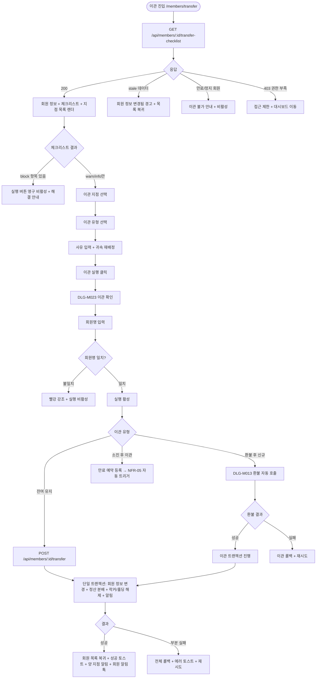

# SCR-M005 회원 이관 페이지

## 1. 화면 메타 정보

이 문서는 회원 이관 페이지에 대한 자기완결형 요구사항 정의서입니다. 다른 문서를 함께 보지 않아도 이 문서 한 장만으로 회원 이관 페이지에 들어가는 모든 영역, 모든 버튼, 모든 모달, 모든 권한, 모든 예외 처리, 그리고 이 화면을 지탱하는 운영 정책까지 전부 이해하고 구현할 수 있도록 작성합니다.

| 항목 | 값 |
|---|---|
| 작성일 | 2026-05-22 |
| 버전 | v1.0 |
| 상태 | 최신 통합본 반영 (정합화 완료) |
| 도메인 | D02 회원관리 |
| 화면 ID | SCR-M005 |
| 화면명 | 회원 이관 |
| 화면 유형 | 검증·확인 화면 (Validation + Confirmation Screen) |
| 라우트 (URL) | `/members/transfer` |
| 플랫폼 | 데스크톱(기본), 태블릿 |
| 우선순위 | P0 (출시 필수) |
| 기능코드 | MBR-ADV-02 (회원 이관) |
| 계약코드 | MBR-ADV-02 |
| 계약 상태 | 계약 범위 본기능 |
| 부모 기능 prefix | MBR |
| Lv1 코드 | MBR-ADV-02 |
| Lv2 / Lv3 세분화 | MBR-ADV-02-01 ~ MBR-ADV-02-06 (대상 회원 정보, 체크리스트 자동 점검, 등급 시각 표시, 이관 설정, 이관 확인 모달, 이관 후 처리) |
| 연계 화면 | SCR-M001 회원목록, SCR-M004 회원상세, SCR-S004 미수금, SCR-097 감사로그 |
| 호출 다이얼로그 | DLG-M023 이관확인, DLG-M013 환불처리 (환불 후 신규 유형 선택 시) |

## 2. 화면 개요와 목적

회원 이관 페이지는 회원을 현재 소속 지점에서 다른 지점으로 옮기는 화면입니다. 회원의 거주지가 바뀌거나 직장이 옮겨지거나 가맹점 합병·폐점이 일어났을 때, 회원의 모든 이력(결제·출석·상담·체성분·이용권)을 유지한 채 소속만 다른 지점으로 옮기는 작업을 수행합니다. 이관은 되돌릴 수 없는 작업이며 회원의 소속·담당자·정산 흐름 전체에 영향을 미치므로, 사전 검증과 명시적 확인 단계를 거칩니다.

이 화면의 핵심은 이관 전 체크리스트 6종(미납금·락커·홀딩 진행 중·PT 잔여·쿠폰·마일리지)을 자동 점검해 차단(block) / 주의(warn) / 안내(info) 등급으로 결과를 표시하고, 이관 유형 3종(잔여 이용권 유지 / 환불 후 신규 / 소진 후 이관)을 선택해 최종 이관을 실행하는 것입니다. 미납금이 있거나 락커를 보유하고 있으면 block 등급으로 이관이 차단되며, 홀딩 중이거나 PT 잔여가 있어도 warn 등급으로 진행은 가능하지만 운영자 확인을 거칩니다. 쿠폰이나 마일리지는 info 등급으로 안내만 됩니다.

운영 현장의 가장 흔한 시나리오는 거주지 이전이나 직장 이동에 따른 자발적 이관입니다. 이 경우 잔여 이용권 유지 유형을 선택하고 잔여 횟수·기간을 그대로 새 지점에서 사용하게 합니다. 회원 본인이 환불 후 새 지점에서 신규로 시작하기를 원하면 환불 후 신규 유형을 선택해 환불 처리(DLG-M013)가 자동 호출되고 환불 완료 후 이관 트랜잭션이 진행됩니다. 회원이 만료일까지 현재 지점을 다 쓰고 옮기고 싶다면 소진 후 이관 유형을 선택해 즉시 이관 대신 만료 예약을 등록하고, NFR-05 만료 배치가 만료 도래 시점에 자동 이관을 트리거합니다.

본사 슈퍼관리자는 가맹점 폐점·합병 시 다수 회원을 1명씩 순차 이관할 수 있고(CSV 일괄은 미지원, 안전성 우선), 본사 통합 모드에서 진입해도 원 지점은 회원의 실제 `branchId` 기준으로 확정됩니다.

## 3. 진입 경로와 인접 화면

회원 이관 페이지에 들어오는 일반적인 경로는 세 가지입니다. 첫째, 회원 목록(SCR-M001)의 행별 "이관" 버튼이며 한 명을 바로 이관 화면으로 보냅니다. 둘째, 회원 목록에서 한 명을 체크박스로 선택한 후 일괄 작업 바의 "지점이관" 버튼이며 단일 선택일 때만 활성화됩니다. 셋째, 회원 상세(SCR-M004) 헤더의 "지점이관" 액션 버튼이며 가장 자주 쓰이는 진입점입니다.

이 화면에 진입한 시점에 stale 데이터 검증이 수행됩니다. 직전에 다른 운영자가 이 회원을 탈퇴·삭제 처리했거나 다른 지점으로 이미 이관했다면, "회원 정보가 변경되었습니다. 목록을 새로고침해 주세요"라는 경고가 표시되고 회원 목록으로 다시 돌려보내집니다. 이 검증 덕분에 운영자가 stale 데이터를 기준으로 이관을 강행하는 사고가 차단됩니다.

이 화면에서 빠져나가는 인접 화면은 두 갈래입니다. 정상 이관 완료 시 회원 목록(SCR-M001)으로 복귀하면서 성공 토스트가 표시되고, 환불 후 신규 유형 이관 시에는 환불 처리(DLG-M013)가 자동 호출된 후 환불 성공 시 이관 트랜잭션이 이어집니다. 미납금 block 발생 시에는 SCR-S004 미수금 정산 화면으로 진입할 수 있는 안내가 표시되며, 락커 보유 시에는 회원 상세 락커 회수 안내가 표시됩니다.

## 4. 레이아웃과 UI 구성

회원 이관 페이지는 위에서 아래로 차곡차곡 쌓이는 단일 컬럼 레이아웃입니다. 가장 위에는 페이지 헤더("회원 이관"이라는 타이틀과 함께 이관 대상 회원명 배지)가 있고, 그 아래에 회원 정보 카드, 체크리스트 카드, 이관 설정 카드, 사유 입력 영역, 안내 박스, 하단 액션 바가 차례로 배치됩니다.

이관 대상 회원 정보 카드는 진입 직후 가장 위에 표시됩니다. 카드 안에는 회원명·연락처·현재 소속 지점·기본 이용지점·기본 매출 귀속 지점·현재 이용권·만료일이 한눈에 보이도록 구성됩니다. 본사 통합 모드에서 진입한 경우에도 원 지점은 화면 상단의 컨텍스트 지점이 아닌 회원 row의 실제 `branchId`로 확정되며, 카드 안에 "이 회원의 실제 소속 지점은 ○○ 지점입니다"라는 안내가 표시됩니다.

회원 정보 카드 아래에는 이관 전 체크리스트 카드가 있습니다. 6종 항목(미납금·락커·홀딩 진행 중·PT 잔여·쿠폰·마일리지)이 행으로 나열되고, 각 항목 우측에 등급 배지(block=빨강·warn=주황·info=파랑)와 상세 사유가 표시됩니다. 미납금 항목은 금액과 함께 "○○○원의 미수금이 있습니다. 정산 후 이관 가능합니다"가 표시되고 우측에 미수금 정산 화면(SCR-S004) 진입 링크가 있습니다. 락커 항목은 락커 번호와 함께 "락커 키 반납과 시스템 해제 처리가 필요합니다" 안내가 표시됩니다. 홀딩 진행 중 항목은 "이관 시 홀딩이 자동 해제되며 만료일이 즉시 적용됩니다" 경고가 표시되고 진행은 가능합니다. PT 잔여 항목은 잔여 횟수와 함께 "유형 선택에 따라 처리 방식이 달라집니다" 안내가 표시됩니다. 쿠폰 항목은 보유 쿠폰 중 지점 한정 쿠폰이 있으면 "N건 소멸 예정" 명시가 표시됩니다. 마일리지 항목은 보유 마일리지와 함께 "이관 후 그대로 유지됩니다" 안내가 표시됩니다.

체크리스트 카드 아래에는 이관 설정 카드가 있습니다. 이 카드 안에는 세 가지 입력이 있습니다. 첫째, "이관할 지점" 드롭다운으로 현재 소속 지점을 제외한 지점 목록이 나열됩니다. 슈퍼관리자에게는 전 지점이 노출되고 센터장에게는 소속 브랜드 내 지점만 노출됩니다. 둘째, "이관 유형" 라디오 그룹으로 잔여 유지 / 환불 후 신규 / 소진 후 이관 세 가지가 있고 각 옵션 아래에 짧은 설명이 붙어 있습니다. 셋째, "사유" 텍스트 영역으로 10자 이상 권장이며 감사 로그 필수 필드입니다.

이관 설정 카드 아래에는 귀속 필드 재배정 표가 있습니다. 소속지점·기본 이용지점·기본 매출 귀속 지점·정산 지점 기본값·담당 상담자·담당 트레이너·인센티브 귀속자의 7개 항목이 한 표에 표시되어, 이관 후 새 지점에서 사용할 값을 운영자가 직접 지정합니다. 담당 상담자와 담당 트레이너는 새 지점에서 자동 해제되어 빈 값으로 표시되고 운영자가 새 지점의 직원 중에서 선택해야 합니다.

예외 회원권 안내 박스가 그 아래에 있습니다. 법인 회원권, 홈&오피스, 주말 이용권, 통합 회원권 같은 예외 회원권을 보유한 경우 "단순 소속지점 이동만으로 끝나지 않으므로 이용 가능 지점과 정산 지점 정책을 함께 점검해야 합니다"라는 경고가 표시됩니다.

페이지 하단에는 안내 박스와 액션 바가 있습니다. 안내 박스에는 "이관 후 현재 지점에서 해당 회원을 조회할 수 없습니다"와 "이관 후 유지되는 항목: 이용권 잔여일·잔여 횟수·결제 이력·출석 이력·상담 메모", "이관 후 변경되는 항목: 소속 지점·기본 이용지점·담당 FC·담당 트레이너·기본 매출 귀속·기본 인센티브 귀속자"가 명시됩니다. 액션 바에는 좌측에 "취소" 버튼, 우측에 "이관 실행" 버튼이 있으며, 이관 실행 버튼은 모든 검증을 통과한 경우에만 활성화됩니다.

## 5. 진입과 이관 실행 흐름

화면 진입 시점에 `GET /api/members/:id/transfer-checklist`가 호출되어 회원의 현재 상태와 6종 체크리스트 결과가 한 번에 로드됩니다. 응답에는 회원 기본 정보, 각 체크 항목의 상태(block/warn/info)와 상세 사유, 이관 가능 지점 목록, 권한별 차단 정보가 포함됩니다. 이 응답을 기반으로 화면이 렌더되고 운영자는 체크리스트 결과를 확인합니다.

block 항목이 한 건이라도 있으면 이관 실행 버튼은 영구적으로 비활성 상태가 유지되며, 운영자는 block 사유를 해결한 후(미수금 정산 또는 락커 해제) 이 화면에 재진입해 다시 체크리스트를 받아야 합니다. warn 항목은 진행 가능하지만 모달 안에서 추가 경고를 표시합니다.

이관 지점 드롭다운에서 새 지점을 선택하면 귀속 필드 재배정 표가 그 지점에 맞게 갱신됩니다. 새 지점의 직원 목록이 담당 상담자·담당 트레이너 드롭다운에 로드되고, 새 지점의 정산 정책이 정산 지점 기본값에 반영됩니다.

이관 유형 라디오에서 잔여 유지를 선택하면 가장 단순한 흐름으로, 이용권 잔여 횟수·기간이 그대로 새 지점에서 사용됩니다. 정산 분배는 본사 정산 정책 세트에 따라 잔여 가치(잔여 횟수 × 단가)가 양 지점에 자동 분배 회계 처리됩니다. 환불 후 신규를 선택하면 이관 실행 시 환불 처리(DLG-M013)가 자동 호출되어 환불이 완료된 후 이관 트랜잭션이 시작되고, 환불 실패 시 이관 전체가 롤백됩니다. 소진 후 이관을 선택하면 즉시 이관 대신 만료 예약이 등록되어 만료 도래 시점에 NFR-05 배치가 자동 이관을 트리거합니다.

사유 입력란에 10자 미만 입력 시 노랑 경고가 표시되지만 진행은 가능하며, 50자 이상 권장 안내가 표시됩니다. 사유는 감사 로그(SCR-097)에 그대로 기록되어 사후 추적에 사용됩니다.

"이관 실행" 버튼을 누르면 DLG-M023 이관 확인 다이얼로그가 열립니다. 이 다이얼로그에서 운영자는 회원명을 정확히 입력해야 [실행] 버튼이 활성화됩니다. 이는 오타 방지와 의도하지 않은 이관을 막기 위한 안전장치입니다.

다이얼로그에서 [실행]을 누르면 `POST /api/members/:id/transfer`가 호출됩니다. 환불 후 신규 유형의 경우 `POST /api/members/:id/transfer/refund-and-new`가, 소진 후 이관의 경우 `POST /api/members/:id/transfer/schedule-after-expire`가 호출됩니다. 백엔드에서는 회원 row에 대해 PostgreSQL `SELECT FOR UPDATE` lock을 걸어 동시 이관 시도를 차단하고, 단일 트랜잭션 안에서 회원 정보 변경·정산 분배·락커 해제·홀딩 해제·알림 발송을 처리합니다. 1개라도 실패하면 전체 롤백됩니다.

성공 시 모달이 닫히고 회원 목록(SCR-M001)으로 복귀하면서 "○○ 회원이 △△ 지점으로 이관되었습니다" 성공 토스트가 표시됩니다. 양 지점의 센터장·매니저·FC에게 NFR-19 알림 센터를 통한 푸시가 발송되고, 회원에게는 카카오 알림톡으로 "지점이 이관되었어요" 메시지가 발송됩니다. SCR-097 감사 로그에 시점·actor·지점 전후·유형·사유가 INSERT됩니다.

## 6. 버튼·아이콘·링크 액션 전체 정의

체크리스트 카드의 각 항목 우측에는 상황에 따라 다른 액션 버튼이 표시됩니다. 미수금 block 항목에는 "미수금 정산 화면으로 이동" 링크가 있어 SCR-S004로 진입할 수 있습니다. 락커 block 항목에는 "회원 상세에서 락커 회수" 링크가 있어 SCR-M004 락커 영역으로 이동할 수 있습니다. 홀딩 warn 항목에는 별도 액션 없이 진행 가능 안내만 표시됩니다. PT 잔여 warn 항목에는 "유형 선택 가이드 보기" 도움말 링크가 있어 잔여 유지/환불/소진 유형별 처리 방식을 설명합니다.

이관 지점 드롭다운은 현재 소속 지점을 자동으로 제외한 옵션 목록을 표시하며, 슈퍼관리자는 전 지점, 센터장은 소속 브랜드 지점만 보입니다. 정원이 가득 찬 지점은 비활성 상태로 표시되고 "정원 초과로 이관 불가" 툴팁이 표시됩니다.

이관 유형 라디오 그룹의 각 옵션은 클릭으로 선택되며 선택 시 해당 옵션의 상세 설명이 강조됩니다. 환불 후 신규를 선택하면 그 아래에 "환불 처리(DLG-M013)가 자동 호출됩니다" 추가 안내가 표시되고, 소진 후 이관을 선택하면 "만료일까지 현재 지점에서 사용 후 자동 이관됩니다" 안내가 표시됩니다.

귀속 필드 재배정 표의 각 행은 드롭다운으로 새 값을 선택할 수 있습니다. 담당 상담자·담당 트레이너는 새 지점 직원 중에서 고를 수 있고, 기본 매출 귀속 지점과 정산 지점 기본값은 본사 정책에 따라 자동 추천값이 미리 채워져 있지만 운영자가 변경할 수 있습니다.

사유 입력란은 10자 이상 권장, 50자 이상 권장 안내가 글자 수 표시 옆에 표시됩니다.

하단 액션 바의 "취소" 버튼은 모든 변경을 폐기하고 호출 직전 화면(회원 목록 또는 회원 상세)으로 돌아갑니다. 입력값이 있는 경우 별도 확인 없이 즉시 돌아갑니다(되돌릴 수 있는 변경이 없으므로). "이관 실행" 버튼은 모든 block 항목이 해결되고 이관 지점·유형이 선택된 경우에만 활성화되며, 누르면 DLG-M023이 호출됩니다.

## 7. 호출되는 모달 동작

### 7-1. DLG-M023 이관 확인 다이얼로그

이관 확인 다이얼로그는 회원 이관의 최종 확인 단계로 호출됩니다. 회원 이관 페이지에서 이관 실행 버튼을 눌렀을 때 표시되며, 모달 상단에는 "지점 이관 확인"이라는 제목과 함께 이관 대상 회원명·현재 지점·이관 대상 지점이 표시됩니다.

모달 본문에는 이관 시 함께 이전되는 정보(이용권·출석 이력·체성분·결제 이력·상담 메모)와 이관 후 변경되는 정보(소속 지점·기본 이용지점·담당 FC·담당 트레이너·기본 매출 귀속)가 명시됩니다. 또한 "이관 후 현재 지점에서 해당 회원을 조회할 수 없습니다"라는 경고가 강조 표시됩니다.

본문 하단에는 회원명을 정확히 입력하는 텍스트 입력란이 있습니다. 운영자가 회원명을 정확히 입력해야 [실행] 버튼이 활성화되며, 오타가 있으면 빨강 강조 + [실행] 비활성 상태가 유지됩니다. 이는 의도하지 않은 이관을 막기 위한 안전장치입니다.

[실행] 버튼을 누르면 모달이 로딩 상태로 전환되어 모든 버튼이 비활성화되고 스피너가 표시됩니다. 백엔드 호출이 시작되며 단일 트랜잭션 안에서 회원 정보 변경·정산 분배·락커/홀딩 해제·알림 발송이 처리됩니다. 성공 시 모달이 닫히고 부모 화면이 회원 목록으로 자동 이동하면서 성공 토스트가 표시됩니다.

실패 시 모달은 닫히지 않고 에러 메시지가 표시됩니다. 환불 후 신규 유형에서 환불 외부 API 실패 시 "이관이 취소되었습니다. 환불 처리가 실패했습니다" 메시지와 재시도 옵션이 표시됩니다. stale 데이터 충돌(409) 시 "다른 운영자가 회원 정보를 변경했습니다. 새로고침 후 재시도해주세요" 모달이 표시됩니다.

[취소] 버튼이나 ESC 키, 배경 클릭으로 모달을 닫을 수 있으며 이 경우 이관 화면으로 복귀합니다(입력값은 보존됩니다).

### 7-2. DLG-M013 환불 처리 다이얼로그 (환불 후 신규 유형 선택 시)

환불 후 신규 유형을 선택하고 이관 실행 시 자동 호출되는 모달입니다. 모달 본문에는 환불할 이용권 정보(이용권명·기간·잔여 횟수)와 환불 금액이 표시되며, 운영자는 환불 사유를 입력하고 확인합니다. 환불이 성공하면 모달이 닫히고 이관 트랜잭션이 이어집니다. 환불이 실패하면 이관 트랜잭션 전체가 롤백됩니다.

이 다이얼로그의 상세 동작은 회원 상세 페이지의 결제이력 탭에서 호출되는 일반 환불 처리와 동일하지만, 회원 이관 컨텍스트에서는 환불 완료가 이관 진행의 전제 조건이 된다는 점이 다릅니다.

## 8. 토스트와 확인 팝업과 알럿

성공 토스트는 회원 목록으로 복귀하면서 우측 상단에 녹색 톤으로 5초간 표시됩니다. "○○ 회원이 △△ 지점으로 이관되었습니다" 문구가 표시되고, 잔여 유지 유형은 정산 분배 결과(예: "잔여 가치 ○○○원이 양 지점에 분배되었습니다")가 부가 안내로 함께 표시됩니다. 소진 후 이관 유형은 "만료일(○○○○-○○-○○)에 자동 이관 예정입니다"라는 안내가 함께 표시됩니다.

실패 토스트는 빨강 톤으로 표시되며 에러 케이스에 따라 다른 메시지가 표시됩니다. block 항목 미해결 시 "미수금 또는 락커가 있어 이관할 수 없습니다", 새 지점 정원 초과 시 "선택 지점이 정원에 도달했어요", 환불 후 신규 환불 실패 시 "환불 처리 실패로 이관이 취소되었습니다", 네트워크 끊김 시 "이관이 완료되지 않았습니다. 다시 시도해주세요"가 표시됩니다.

stale 데이터 경고는 화면 진입 시점이나 이관 실행 시점에 다른 운영자가 회원을 동시에 처리한 경우 발생합니다. 진입 시점에는 "회원 정보가 변경되었습니다. 목록을 새로고침해 주세요" 알럿이 표시되며 회원 목록으로 자동 이동됩니다. 실행 시점에는 "다른 운영자가 회원 정보를 변경했습니다" 모달이 표시되고 새로고침 후 재시도 안내가 표시됩니다.

권한이 없는 계정(매니저·FC·트레이너·스태프·프런트·readonly)이 직접 URL로 진입하면 본문이 가려지고 "이 화면에 접근할 권한이 없습니다" 알럿이 표시된 후 대시보드로 자동 이동합니다.

회원이 만료 또는 정지 상태인 경우 이관 자체가 차단되며 "이 회원은 만료/정지 상태로 이관할 수 없습니다" 안내가 화면 본문에 표시되고 이관 실행 버튼이 영구 비활성됩니다.

## 9. 데이터 흐름과 외부 연동

화면 진입 시 `GET /api/members/:id/transfer-checklist`가 호출되어 회원 기본 정보와 6종 체크리스트 결과가 병렬로 로드됩니다. 응답에는 다음이 포함됩니다. 회원 기본 정보(이름·연락처·현재 지점·상태·이용권·만료일), 6종 체크리스트 결과 각각의 등급(block/warn/info)과 상세 사유, 이관 가능 지점 목록(권한별 필터링됨), 새 지점의 직원 목록(담당자 재배정용), 본사 정산 정책의 분배 비율, 회원이 보유한 예외 회원권(법인·홈&오피스·주말·통합) 정보, optimistic lock용 `version` 컬럼.

이관 지점을 선택하면 해당 지점의 직원 목록과 정산 정책이 추가로 로드될 수 있으며, 응답 캐시를 활용해 빠르게 표시됩니다.

이관 실행은 `POST /api/members/:id/transfer`를 호출합니다. 요청 본문에는 이관 대상 지점 ID, 이관 유형, 사유, 귀속 필드 재배정 값, `version`이 포함됩니다. 환불 후 신규 유형은 `POST /api/members/:id/transfer/refund-and-new`를, 소진 후 이관은 `POST /api/members/:id/transfer/schedule-after-expire`를 호출합니다.

백엔드는 회원 row에 `SELECT FOR UPDATE` lock을 걸어 동시 이관을 차단합니다. 단일 트랜잭션 안에서 다음이 처리됩니다. 회원 `branchId` 변경, 담당 FC·트레이너 자동 해제, 새 지점 직원으로 재배정, 홀딩 자동 해제(warn 항목이 있던 경우), 락커 시스템 해제, 잔여 가치 본사 정산 정책에 따른 양 지점 회계 분배, SCR-097 감사 로그 INSERT, NFR-19 알림 센터 양 지점 운영자 푸시, 카카오 알림톡 회원 알림 발송. 1개라도 실패하면 전체 롤백됩니다.

이관 후 자동화 체인이 트리거됩니다. MBR-EXT-03 등급 시스템은 누적 결제가 그대로 보존되어 등급이 유지되지만 새 지점 정책이 다르면 다음 갱신 주기에 재산정됩니다. MBR-EXT-04 세그먼트 자동 재계산 배치(D+1 새벽 4시)가 회원의 세그먼트 라벨을 새 지점 컨텍스트로 갱신합니다. MBR-EXT-02 가족 그룹은 자동 분리되지 않으며 지점 간 가족 그룹이 허용됩니다.

소진 후 이관 유형은 즉시 이관하지 않고 만료 예약 테이블에 레코드를 INSERT합니다. NFR-05 만료 배치(매일 새벽 3시)가 매일 만료 예약을 확인해 만료 도래 회원의 자동 이관을 트리거합니다.

화면에서 호출하는 주요 API: 이관 체크리스트 조회 `GET /api/members/:id/transfer-checklist`, 이관 실행 `POST /api/members/:id/transfer`, 환불 후 신규 이관 `POST /api/members/:id/transfer/refund-and-new`, 소진 후 이관 예약 `POST /api/members/:id/transfer/schedule-after-expire`.

## 10. 화면 상태와 예외 처리

화면 상태는 다음과 같이 정의됩니다. 로딩 중 상태는 체크리스트 GET 호출 도중 표시되며 모든 영역에 스켈레톤이 표시됩니다.

정상(이관 가능) 상태는 block 항목이 0개이고 이관 지점·유형이 선택된 상태로 이관 실행 버튼이 활성화됩니다. block 항목 있음 상태는 미수금이나 락커 같은 차단 사유가 있어 이관 실행 버튼이 영구 비활성된 상태입니다. warn 항목 있음 상태는 홀딩·PT 잔여 같은 주의 사유가 있지만 이관은 가능한 상태로, 모달에서 추가 경고가 표시됩니다.

처리 중 상태는 이관 실행 직후 로딩 + 중복 클릭 방지 상태로 모든 버튼이 비활성화됩니다. 처리 완료 상태는 회원 목록으로 자동 복귀하기 직전의 짧은 순간이며 사용자에게는 별도로 보이지 않습니다. 처리 실패 상태는 에러 토스트 + 재시도 옵션이 표시된 상태입니다.

동일 지점 선택 상태는 자동 차단됩니다. 드롭다운에서 현재 소속 지점은 자동 제외되고 API에서도 422로 거부됩니다. 이관 불가 상태는 만료·정지 회원이 진입한 경우로, 화면 본문에 "이 회원은 만료/정지 상태로 이관할 수 없습니다" 안내가 표시되고 모든 입력이 비활성됩니다.

예외 회원권 보유 상태는 법인·홈&오피스·주말·통합 회원권을 보유한 회원이 진입한 경우로, 화면 상단에 강조 경고 박스가 표시되고 정책 점검과 귀속 재설정을 함께 요구합니다.

예외 케이스별 처리는 다음과 같습니다. block 항목 발생 시 미수금 항목에는 SCR-S004 미수금 정산 화면 진입 안내, 락커 항목에는 락커 회수 안내가 표시되며 실행 버튼은 영구 비활성됩니다. warn 항목 발생 시 홀딩 중에는 "이관 시 홀딩 자동 해제됩니다" 사전 경고, PT 잔여에는 "유형 선택에 따라 처리 방식이 달라집니다" 안내가 표시됩니다.

이관 유형이 환불 후 신규일 때 환불 외부 결제사 API 실패가 발생하면 트랜잭션 롤백 + "이관이 취소되었습니다" + 재시도 옵션이 제공됩니다. 소진 후 이관 만료 도래 후 자동 처리 실패는 NFR-05 배치 알림으로 운영자에게 통보되며 수동 처리 안내가 표시됩니다.

이관 도중 네트워크 끊김은 트랜잭션 롤백 + 자동 재시도 1회로 처리되며 명시적 안내가 표시됩니다. 권한 부족 진입은 접근 제한 화면 후 대시보드로 자동 이동합니다.

동시 이관 시도는 lock 대기 후 stale 검증으로 처리되며 충돌 시 "잠시 후 다시 시도해주세요" 또는 "다른 운영자가 동시에 처리했습니다" 모달이 표시됩니다. stale 데이터 충돌(409)은 새로고침 후 재시도 안내가 표시됩니다.

사유 10자 미만 입력은 노랑 경고가 표시되지만 진행은 가능합니다. DLG-M023 회원명 오타는 빨강 강조 + [실행] 비활성으로 차단되며 정확 입력 시 활성됩니다.

가족 회원 이관 시 그룹은 자동 분리되지 않으며 "가족 그룹은 유지됩니다" 안내 모달이 표시됩니다. 운영자가 가족 그룹을 분리하고 싶다면 가족 회원 화면(SCR-M008)에서 별도 조정해야 합니다.

쿠폰 지점 한정 손실은 info 알림에 "쿠폰 N건 소멸 예정" 명시가 표시되며 회원 사전 동의가 필요하다는 안내가 추가됩니다. 마일리지는 테넌트 전체 공유이므로 이관 후 그대로 유지된다는 info 안내가 표시됩니다.

새 지점 정원 초과는 본사 정책에 따라 422 응답으로 처리되며 "선택 지점이 정원에 도달했어요" 모달이 표시되고 다른 지점 선택을 안내합니다.

## 11. 권한별 처리

이 화면은 권한에 따라 진입 가능 여부와 가능한 이관 범위가 모두 달라집니다.

슈퍼관리자(superAdmin)와 본사 최고관리자(primary)는 모든 지점 간 이관이 가능합니다. 본사 통합 모드에서도 회원의 실제 소속 지점 기준으로 이관 처리되며, 가맹점 폐점·합병 시 다수 회원을 1명씩 순차 이관할 수 있습니다.

센터장(owner)은 본인 지점에서 같은 브랜드의 다른 지점으로 이관할 수 있습니다. 다른 브랜드 지점은 이관 지점 드롭다운에서 보이지 않으며 직접 URL로 지정해도 422로 거부됩니다.

매니저(manager), FC(fc), 트레이너(trainer), 스태프(staff), 프런트(front), readonly는 이 화면에 진입할 수 없습니다. 회원 목록과 회원 상세에서 이관 버튼이 비활성 또는 hidden으로 표시되며, 직접 URL로 진입하면 접근 제한 알럿 후 대시보드로 자동 이동합니다.

권한별 차단은 단계적으로 일관 적용됩니다. 첫째, 사이드바·회원 목록·회원 상세의 이관 진입 버튼이 권한 없는 계정에게 비활성 또는 hidden으로 표시됩니다. 둘째, 직접 URL 접근 시 접근 제한 알럿이 표시됩니다. 셋째, 백엔드 응답이 403인 경우 토스트와 함께 액션이 차단되고 감사 로그에 기록됩니다.

본사 통합 모드 진입 시에도 원 지점은 회원의 실제 `branchId`로 확정되어, 본사 권한자가 화면 컨텍스트로 선택한 지점이 아닌 회원의 실제 소속 지점이 이관 원 지점이 됩니다. 이는 본사 통합 모드의 보안·정합성 정책입니다.

## 12. 메인 흐름



## 13. 에러와 예외 흐름

```mermaid
flowchart TD
    A([액션 트리거]) --> B{검증 결과}
    B -->|미납금 block| C[빨강 박스 + 미수금 화면 진입 안내 + 실행 영구 비활성]
    B -->|락커 block| D[빨강 박스 + 락커 회수 안내 + 실행 영구 비활성]
    B -->|홀딩 warn| E[노랑 박스 + "홀딩 자동 해제" 사전 경고 + 진행 가능]
    B -->|PT 잔여 warn| F[노랑 박스 + 유형별 처리 안내 + 진행 가능]
    B -->|쿠폰 info| G[파랑 박스 + "N건 소멸 예정" + 회원 동의 안내]
    B -->|마일리지 info| H[파랑 박스 + "이관 후 유지" 안내]
    B -->|동일 지점 선택| I[드롭다운 자동 제외 + API 422]
    B -->|새 지점 정원 초과| J["정원 초과" 모달 + 다른 지점 안내]
    B -->|환불 외부 API 실패| K[전체 롤백 + "이관 취소" + 재시도]
    B -->|소진 후 이관 자동 실패| L[배치 알림 + 운영자 수동 처리 안내]
    B -->|네트워크 끊김| M[롤백 + 자동 재시도 1회]
    B -->|권한 부족| N[접근 제한 + 대시보드 이동]
    B -->|동시 이관 lock| O["잠시 후 재시도" 안내]
    B -->|stale 데이터 409| P[새로고침 안내]
    B -->|사유 10자 미만| Q[노랑 경고 + 진행 가능]
    B -->|DLG-M023 회원명 오타| R[빨강 강조 + 실행 비활성]
    B -->|가족 회원 이관| S["가족 그룹 유지" 안내 + 진행 가능]
    B -->|예외 회원권 보유| T[강조 경고 + 정책 점검 필수]
```

## 14. 핵심 디자인 요청사항

회원 이관 화면이 운영자에게 잘 작동하려면 다음 디자인 원칙이 시각적으로 명확히 드러나야 합니다.

체크리스트 카드의 등급별 색상은 일관되어야 합니다. block은 빨강 톤(즉시 차단), warn은 주황 톤(주의 필요), info는 파랑 톤(참고 안내)으로 운영자가 멀리서 색만 봐도 등급을 짐작할 수 있어야 합니다. 색맹 운영자를 위해 색상과 함께 라벨(차단/주의/안내)을 항상 표시합니다.

이관 유형 라디오 그룹의 선택된 옵션은 강조 색상과 굵은 테두리로 표시되고, 그 아래의 상세 설명도 강조되어 운영자가 자신의 선택을 명확히 인식할 수 있어야 합니다.

귀속 필드 재배정 표는 행이 많아 한눈에 보기 어려울 수 있으므로, 각 행에 작은 아이콘과 라벨로 항목을 구분하고 변경된 필드에는 dirty 마크(노랑 점)를 붙입니다.

이관 실행 버튼은 모든 검증을 통과한 경우에만 활성화되며, 비활성 상태에서는 회색 톤과 함께 "block 항목을 해결해 주세요" 또는 "이관 지점을 선택해 주세요" 같은 안내가 툴팁으로 표시됩니다.

DLG-M023의 회원명 입력란은 입력 중일 때 노랑 강조, 정확 일치 시 초록 강조, 불일치 시 빨강 강조로 시각적 피드백을 즉시 제공해야 합니다. 회원명이 정확히 일치할 때만 [실행] 버튼이 활성화되어 운영자가 신중히 확인하도록 유도합니다.

처리 중 상태에서는 화면 전체에 dim 오버레이가 표시되고 가운데에 큰 스피너와 함께 "이관 처리 중입니다. 잠시만 기다려 주세요"라는 안내가 표시됩니다.

예외 회원권 안내 박스는 빨강 또는 주황 톤으로 강조 표시되어 운영자가 무심코 단순 이관으로 처리하는 사고를 막아야 합니다.

## 15. 운영 정책 (이 화면에 연결된 부분)

회원 이관은 되돌릴 수 없는 작업이며 회원의 소속·담당자·정산 흐름 전체에 영향을 미치므로, 이 화면을 지탱하는 운영 정책이 매우 엄격합니다. 다른 문서를 보지 않아도 이 화면을 구현·운영하는 사람이 알아야 할 정책을 모두 풀어 씁니다.

체크리스트 6종(미납금·락커·홀딩·PT 잔여·쿠폰·마일리지)의 등급 분류 정책은 운영 안전성을 위한 것입니다. 미납금과 락커는 block으로 분류되어 이관 자체가 차단됩니다. 미수금이 있는 채로 이관하면 새 지점에서 채무 추적이 어려워지므로 정산 후 이관이 원칙이며, 락커는 물리적으로 키 반납이 필요하므로 회수 전 이관이 불가능합니다. 홀딩과 PT 잔여는 warn으로 분류되어 진행은 가능하지만 사전 안내가 필요합니다. 쿠폰과 마일리지는 info로 분류되어 안내만 됩니다.

이관 유형 3종(잔여 유지·환불 후 신규·소진 후 이관)의 처리 정책은 회원의 요구와 정산 안전성을 동시에 달성하기 위한 것입니다. 잔여 유지는 이용권 잔여 횟수·기간 그대로 새 지점 사용이며 회계 정산은 본사 정산 정책에 따라 양 지점 분배입니다. 환불 후 신규는 환불 처리(DLG-M013) 자동 호출 후 새 지점 신규 결제 안내로 이관 자체는 회원 정보만 이전합니다. 소진 후 이관은 즉시 이관 안 하고 만료 예약 등록 후 NFR-05 배치가 만료 도래 시 자동 이관 트리거를 발동합니다.

이관 권한 정책은 슈퍼관리자(전 지점), 센터장(소속 브랜드 지점), 그 외 권한 차단입니다. 매니저·FC·스태프 모두 이관 불가입니다. 이 정책은 이관이 회원 운영의 중요한 결정이므로 권한자만 처리하도록 강제하는 것입니다.

본사 통합 모드에서 원 지점 확정 정책은 화면 컨텍스트가 아닌 회원 row의 실제 `branchId`로 확정하는 것입니다. 본사 권한자가 통합 모드에서 다른 지점 회원을 이관해도, 데이터는 회원의 실제 소속을 기준으로 처리되어 보안·정합성이 보장됩니다.

이관 트랜잭션 원자성 정책은 회원 정보 변경·정산 분배·락커/홀딩 해제·알림 발송이 단일 트랜잭션으로 처리되며 1개 실패 시 전체 롤백되는 것입니다. 이 정책 덕분에 이관 도중 네트워크가 끊기거나 외부 API가 실패해도 회원 데이터가 일관성 없는 상태로 남지 않습니다.

결제이력·출석이력은 이관 시 그대로 보존됩니다. `branchId`는 데이터 행의 발생 시점 지점 그대로 유지되어, 새 지점에서 회원 상세를 봐도 과거 거래의 귀속이 흔들리지 않습니다. 이 정책은 KPI·정산 정확성의 근간입니다.

상담메모·운동프로그램·종합평가는 회원에 종속된 데이터로 그대로 따라갑니다. 새 지점 담당자에게 인수인계 알림이 발송되며, FC는 새 지점 담당 FC에게 상담 인계 메모를 작성할 수 있습니다.

가족 그룹 미분리 정책은 가족 회원 1명만 이관해도 그룹은 유지되는 것입니다. 가족 그룹은 지점 간 허용되며, 분리가 필요하면 가족 회원 화면(SCR-M008)에서 별도 처리해야 합니다.

DLG-M023 회원명 입력 일치 정책은 최종 확인 모달에서 회원명을 정확히 입력해야 [실행]이 활성화되는 것입니다. 오타로 인한 의도하지 않은 이관을 막기 위한 안전장치입니다.

동시성 제어 정책은 회원 row에 대해 PostgreSQL `SELECT FOR UPDATE` lock을 거는 것입니다. 동시 이관 시도 시 후행 요청은 lock 대기 후 stale 검증을 거치며 충돌 시 409로 거부됩니다.

본사 정산 정책은 이관 시점의 잔여 가치(잔여 횟수 × 단가)를 본사 정산 정책 세트의 분배 비율에 따라 양 지점 회계 처리하는 것입니다. 잔여 가치가 그대로 새 지점에 이전되면 원 지점이 손해를 보고, 환불 처리되면 회원이 손해를 보므로, 본사가 정한 분배 비율로 양 지점을 안정시킵니다.

새 지점 정원 제한 정책은 본사 정책에서 지점 정원이 정의된 경우 정원 초과 지점으로의 이관을 차단(422)하는 것입니다. 인기 지점에 회원이 과도하게 몰려 운영 품질이 떨어지는 사고를 막기 위한 정책입니다.

쿠폰 지점 한정 손실 안내 정책은 info 알림에 "쿠폰 N건 소멸 예정" 명시와 회원 사전 동의 안내를 표시하는 것입니다. 운영자가 회원에게 충분히 안내하지 않고 이관을 진행해 클레임이 발생하는 사고를 막기 위한 정책입니다.

마일리지 유지 정책은 마일리지가 테넌트 전체 공유이므로 이관 후에도 그대로 유지되는 것입니다. 단 본사 정책 세트에서 별도 정의된 경우 분배도 가능합니다.

이상의 모든 정책은 이 화면을 구현하고 운영하는 사람이 별도 문서 없이 이 한 장으로 이해할 수 있도록 풀어 적었습니다. 정책이 바뀌면 이 문서가 함께 갱신되어야 하며, 코드 변경과 정책 변경은 항상 짝지어 진행됩니다.
