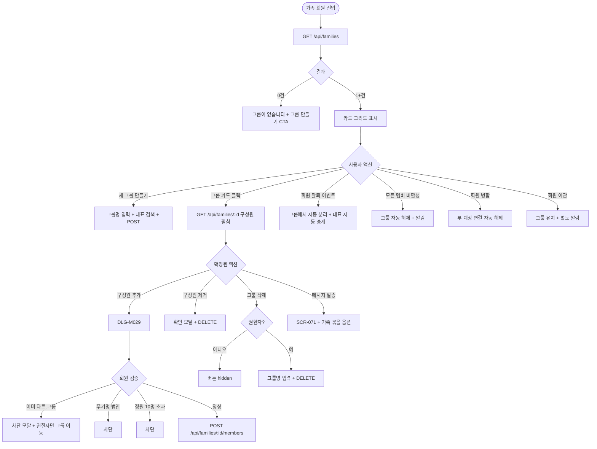
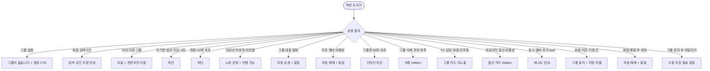

# SCR-M008 가족 회원 페이지

## 1. 화면 메타 정보

이 문서는 가족 회원 페이지에 대한 자기완결형 요구사항 정의서입니다. 다른 문서를 함께 보지 않아도 이 문서 한 장만으로 가족 회원 페이지에 들어가는 모든 영역, 모든 버튼, 모든 모달, 모든 권한, 모든 예외 처리, 그리고 이 화면을 지탱하는 운영 정책까지 전부 이해하고 구현할 수 있도록 작성합니다.

| 항목 | 값 |
|---|---|
| 작성일 | 2026-05-22 |
| 버전 | v1.0 |
| 상태 | 정합화 완료 (퍼블링 완료/데이터 미연동) |
| 도메인 | D02 회원관리 |
| 화면 ID | SCR-M008 |
| 화면명 | 가족 회원 |
| 화면 유형 | 그룹 관리 화면 (Group Management Screen) |
| 라우트 (URL) | `/members/family` |
| 플랫폼 | 데스크톱(기본), 태블릿 |
| 우선순위 | P1 |
| 기능코드 | MBR-EXT-02 (가족 회원) |
| 계약코드 | MBR-EXT-02 |
| 계약 상태 | 계약 범위 본기능 |
| 부모 기능 prefix | MBR |
| Lv1 코드 | MBR-EXT-02 |
| Lv2 / Lv3 세분화 | MBR-EXT-02-01 ~ MBR-EXT-02-07 (그룹 목록, 그룹 상세, 그룹 생성, 구성원 추가, 구성원 제거, 가족 요약, 그룹 삭제) |
| 연계 화면 | SCR-M001 회원목록, SCR-M004 회원상세, SCR-074 마일리지, SCR-071 메시지, SCR-097 감사로그 |
| 호출 다이얼로그 | DLG-M029 가족연결 |

## 2. 화면 개요와 목적

가족 회원 페이지는 동일 가족 구성원인 회원들을 서로 연결하여 가족 단위로 관리하는 화면입니다. 패밀리 이용권 혜택 적용, 가족 단위 결제 현황 파악, 특정 가족 묶음 대상 마케팅, 마일리지 가족 합산 사용 같은 운영 기능을 지원합니다. 한 회원은 한 그룹에만 속할 수 있으며 가족 관계(부모/자녀/배우자/형제·자매/기타)를 명시합니다.

운영 현장의 시나리오는 다양합니다. 부모-자녀가 동시 등록될 때 신규 등록 후 가족 그룹을 만들어 패밀리 할인을 적용하고, 배우자 결제 합산 마케팅에서는 부부 묶음 세그먼트(MBR-EXT-04 연계)로 메시지를 발송하며 패밀리 이용권을 권유합니다. 형제·자매 묶음 PT 패키지에서는 가족 그룹의 모든 활성 회원에게 동일 PT 패키지를 일괄 결제하고, 가족 단위 마일리지 사용에서는 부모가 적립한 마일리지를 자녀가 결제 시 차감할 수 있습니다(테넌트 정책에 따라). 미성년 자녀 보호자 동의 관리에서는 자녀 회원에게 보호자 회원이 그룹 대표로 연결되어 동의·결제 권한이 관리됩니다.

가족 단위 분석을 위해 그룹별 활성 회원 수, 총 마일리지 합산, 이용권 현황, 누적 결제 금액이 요약 카드로 제공됩니다.

## 3. 진입 경로와 인접 화면

가족 회원 페이지에 들어오는 일반적인 경로는 사이드바 "회원관리 > 가족 회원" 항목, 회원 상세(SCR-M004) 내 가족 그룹 메뉴, 회원 검색 결과의 가족 그룹 카드입니다. 회원 상세에서 진입하면 해당 회원이 속한 그룹이 자동으로 펼쳐진 상태로 표시됩니다.

이 화면에서 빠져나가는 인접 화면으로는 그룹 카드의 구성원 클릭 시 SCR-M004 회원 상세 이동, 메시지 발송 버튼으로 진입하는 SCR-071 메시지 발송(가족 묶음 옵션), 마일리지 합산 사용 시 진입하는 SCR-074 마일리지, 회원 검색 시 진입하는 SCR-M001 회원 목록, 모든 그룹 변경 이벤트가 기록되는 SCR-097 감사 로그가 있습니다.

## 4. 레이아웃과 UI 구성

가족 회원 페이지는 위에서 아래로 차곡차곡 쌓이는 레이아웃입니다. 가장 위에는 페이지 헤더("가족 회원"이라는 타이틀과 함께 "새 그룹 만들기" 버튼)가 있습니다.

헤더 아래에는 가족 그룹 목록이 카드 그리드 형태로 펼쳐집니다. 각 카드에는 그룹 이름(예: "김씨 가족"), 구성원 수, 대표 회원 이름, 가족 단위 요약(총 마일리지·활성 회원 수)이 표시됩니다. 카드 호버 시 약간의 그림자가 추가되어 클릭 가능함을 알립니다.

그룹 카드를 클릭하면 카드가 확장되어 구성원 상세가 펼쳐집니다. 구성원 상세는 한 명씩 행으로 표시되며 행에는 이름·관계(부모/자녀/배우자/형제·자매/기타)·이용권 상태·최근 방문일·소속 지점(통합 모드 시)이 노출됩니다. 각 행 우측에는 "회원 상세로 이동" 링크와 권한자에게만 보이는 "구성원 제거" 버튼이 있습니다.

확장된 카드 상단에는 "구성원 추가" 버튼이 있어 DLG-M029 가족 연결 다이얼로그를 호출합니다. 카드 우측에는 "그룹 삭제" 버튼(권한자만)과 "메시지 발송(가족 묶음 옵션)" 버튼이 있습니다.

새 그룹 만들기 버튼은 페이지 헤더 우측에 위치하며 누르면 그룹 생성 모드로 전환됩니다. 그룹 이름 입력란(1~30자, 특수문자·이모지 차단, 같은 지점 내 중복 허용)이 활성화되고 대표 회원을 검색해 선택한 후 최초 구성원을 추가하면 그룹이 생성됩니다.

가족 단위 요약 정보는 각 그룹 카드와 별도로 페이지 상단에 전체 통계가 표시될 수 있습니다. 등록된 가족 그룹 수, 가족 회원 비율, 활성 가족 그룹 수 같은 지점 단위 요약이 제공됩니다.

## 5. 그룹 생성·구성원 추가·제거 흐름

새 그룹 만들기 흐름은 다음과 같습니다. 헤더의 "새 그룹 만들기" 버튼을 누르면 그룹 이름 입력란이 표시되고, 이름을 입력하면(1~30자, 특수문자·이모지 차단) 대표 회원 검색 영역이 활성화됩니다. 대표 회원을 검색해 선택하면 최초 구성원이 추가된 상태로 그룹이 생성됩니다. 그룹당 정원은 최대 10명이며 초과 시 추가 차단됩니다.

구성원 추가는 그룹 카드 상단의 "구성원 추가" 버튼으로 DLG-M029 가족 연결 다이얼로그를 호출합니다. 다이얼로그에서 회원을 검색해 선택하고 관계(부모/자녀/배우자/형제·자매/기타)를 지정한 후 "추가"를 누르면 즉시 그룹에 반영됩니다.

이미 다른 그룹에 속한 회원을 추가 시도하면 모달이 표시되어 "이미 다른 가족 그룹에 속해 있어요" 안내와 함께 기존 그룹 카드가 노출되고, "그룹 이동(권한자만)" 또는 "취소" 선택지가 제공됩니다. 그룹 이동은 슈퍼관리자·Owner(지점장)에게만 허용되며 부 그룹에서 자동 분리 후 새 그룹에 추가됩니다.

무기명 법인 회원은 가족 그룹 가입이 불가능하며 추가 시도 시 "무기명 법인은 가족 그룹 가입이 불가합니다" 차단 모달이 표시됩니다. 미성년 자녀(만 14세 미만)는 보호자 연결이 권장되며 노랑 경고가 표시되지만 강제는 아닙니다(정책에 따라 강제 가능).

구성원 제거는 행 우측의 "구성원 제거" 버튼으로 호출됩니다. 제거 확인 모달이 표시되고 확인 시 그룹에서 분리됩니다. 분리 후 해당 회원의 데이터는 그대로 유지되며 가족 연결 정보만 해제됩니다.

그룹 대표 회원이 탈퇴 처리되면 자동으로 다음 활성 회원(가입일 기준 가장 오래된 회원)이 대표 역할을 승계합니다. 모든 멤버가 비활성이면 그룹이 자동 해체되며 운영자에게 알림이 발송됩니다.

그룹 삭제는 카드의 "그룹 삭제" 버튼으로 호출됩니다. 삭제 확인 모달이 표시되고 그룹명을 정확히 입력해야 활성화됩니다. 삭제 시 구성원의 회원 데이터는 모두 유지되며 `family_members` 테이블의 연결만 끊깁니다. 권한은 슈퍼관리자·Owner(지점장)만 가능합니다.

## 6. 버튼·아이콘·링크 액션 전체 정의

페이지 헤더의 "새 그룹 만들기" 버튼은 그룹 생성 모드로 전환합니다. 권한이 없는 계정(FC·트레이너·스태프·프런트)에게는 hidden 처리됩니다.

그룹 카드 본문 클릭은 구성원 상세를 펼치거나 접습니다. 한 번에 여러 그룹을 펼칠 수 있고, 새로고침해도 펼침 상태가 유지됩니다(localStorage).

구성원 행의 "회원 상세로 이동" 링크는 SCR-M004로 이동합니다. "구성원 제거" 버튼은 권한자에게만 보이고 클릭 시 확인 모달이 호출됩니다.

확장된 카드의 "구성원 추가" 버튼은 DLG-M029를 호출합니다. "그룹 삭제" 버튼은 슈퍼관리자·Owner(지점장)에게만 보이며 클릭 시 그룹명 입력 + 삭제 확인 모달이 호출됩니다. "메시지 발송" 버튼은 SCR-071로 진입하면서 가족 묶음 옵션이 자동 활성화된 상태로 시작합니다.

페이지 검색 입력란은 그룹명이나 대표 회원명으로 그룹 카드를 필터링합니다.

## 7. 호출되는 모달 동작

### 7-1. DLG-M029 가족 연결 다이얼로그

가족 연결 다이얼로그는 그룹 카드의 "구성원 추가" 버튼이나 회원 상세의 "가족 연결" 버튼으로 호출됩니다. 모달 본문에는 현재 회원 정보(읽기 전용)와 연결할 회원 검색 영역, 가족 관계 선택 라디오가 있습니다.

연결할 회원을 이름·연락처로 검색하면 결과 카드가 표시되고 선택할 수 있습니다. 가족 관계는 배우자/부모/자녀/형제·자매/기타 중 단일 선택입니다.

[연결] 버튼을 누르면 즉시 그룹에 반영되고 모달이 닫힙니다. 이미 다른 그룹에 속한 회원이면 차단 모달이 추가로 표시됩니다. 무기명 법인이면 "무기명 법인은 가족 그룹 가입이 불가합니다" 차단이 표시됩니다. 그룹 정원 10명 초과 시 "그룹 정원이 초과되었어요" 안내가 표시됩니다.

[취소]는 변경 없이 모달을 닫습니다.

### 7-2. 그룹 삭제 확인 모달 (자체 모달)

그룹 삭제 확인 모달은 카드의 "그룹 삭제" 버튼으로 호출됩니다. 모달 본문에는 그룹명·구성원 수·"구성원의 회원 데이터는 모두 유지됩니다" 안내가 표시되고 그룹명 정확 입력 후 [삭제] 활성화입니다. 권한은 슈퍼관리자·Owner(지점장)만 가능합니다.

### 7-3. 구성원 이미 다른 그룹 안내 모달

이미 다른 그룹에 속한 회원 추가 시도 시 표시되는 모달입니다. 본문에는 기존 그룹 카드와 함께 "그룹 이동(권한자만)" 또는 "취소" 선택지가 제공됩니다.

## 8. 토스트와 확인 팝업과 알럿

성공 토스트는 우측 상단에 녹색 톤으로 표시됩니다. "그룹이 생성되었어요", "구성원이 추가되었어요", "구성원이 제거되었어요", "그룹이 삭제되었어요" 같은 문구가 5초간 유지됩니다.

실패 토스트는 빨강 톤으로 표시됩니다. "그룹 정원이 초과되었어요", "이미 다른 그룹에 속해 있어요", "무기명 법인은 가족 그룹 가입이 불가합니다", "권한이 없어요" 같은 안내가 표시됩니다.

빈 상태는 등록된 가족 그룹이 0건일 때 "가족 그룹이 없습니다" + "그룹 만들기" CTA 버튼이 표시됩니다.

그룹 대표 회원 탈퇴 시 자동 승계 알림이 발송되며 모든 멤버 비활성 시 그룹 자동 해체 알림이 발송됩니다. 운영자가 새 그룹을 생성해야 한다는 안내가 함께 전달됩니다.

가족 마일리지 합산 비활성 테넌트에서는 마일리지 합산 카드 자체가 hidden 처리됩니다.

동시 멤버 추가 시 lock 충돌 발생 시 "잠시 후 다시 시도해주세요" 안내가 표시됩니다.

권한 부족(트레이너·스태프·프런트가 직접 URL 진입) 시 접근 제한 알럿 또는 조회만 가능한 모드로 표시됩니다.

## 9. 데이터 흐름과 외부 연동

페이지 진입 시 `GET /api/families`가 호출되어 그룹 목록과 각 그룹의 기본 요약이 로드됩니다. 응답에는 그룹별 ID·이름·구성원 수·대표 회원·총 마일리지·활성 회원 수가 포함되며 권한별로 필터링됩니다.

그룹 카드 펼침 시 `GET /api/families/:id`가 호출되어 구성원 상세(이름·관계·이용권 상태·최근 방문일)가 로드됩니다.

그룹 생성은 `POST /api/families`, 그룹명 수정은 `PATCH /api/families/:id`, 그룹 삭제는 `DELETE /api/families/:id`를 호출합니다. 구성원 추가는 `POST /api/families/:id/members`, 구성원 제거는 `DELETE /api/families/:id/members/:memberId`, 그룹 대표 변경은 `POST /api/families/:id/transfer-head`를 호출합니다.

자동화 체인이 트리거됩니다. 회원 탈퇴/삭제 이벤트가 발생하면 그룹에서 자동 분리 + 대표 자동 승계 처리됩니다. 회원 병합(MBR-EXT-01) 시 부 계정의 가족 연결이 자동 해제되며 주 계정 그룹은 유지됩니다. 회원 이관(MBR-ADV-02) 시 가족 그룹은 자동 분리되지 않고 유지되어 지점 간 가족 그룹이 허용됩니다.

MBR-EXT-04 세그먼트는 가족 그룹 조건을 사용해 세그먼트를 자동 갱신할 수 있습니다(예: "활성 가족 회원 3명 이상 그룹"). NFR-19 알림 센터를 통해 그룹 대표 승계, 그룹 자동 해체 알림이 운영자에게 발송됩니다.

마케팅 메시지(SCR-071) 발송 시 가족 묶음 옵션을 켜면 그룹당 1명에게만 발송되어 중복을 방지합니다. 가족 마일리지 합산 정책이 활성화된 테넌트에서는 결제 시 가족 잔액 합산에서 차감됩니다.

매주 월요일 새벽 4시에 가족 단위 KPI 배치가 실행되어 그룹별 누적 결제·재방문률이 집계됩니다.

모든 그룹 생성·수정·삭제·멤버 추가·제거는 SCR-097 감사 로그에 기록되며 `family_id`·`member_id`·`relation`·`actor_id`가 INSERT됩니다.

화면에서 호출하는 주요 API: 그룹 목록 `GET /api/families`, 그룹 상세 `GET /api/families/:id`, 그룹 생성 `POST /api/families`, 그룹 수정 `PATCH /api/families/:id`, 그룹 삭제 `DELETE /api/families/:id`, 구성원 추가 `POST /api/families/:id/members`, 구성원 제거 `DELETE /api/families/:id/members/:memberId`, 대표 변경 `POST /api/families/:id/transfer-head`.

## 10. 화면 상태와 예외 처리

화면 상태는 다음과 같이 정의됩니다.

그룹 없음 상태는 등록된 가족 그룹이 0건일 때 "가족 그룹이 없습니다" + 그룹 생성 버튼이 표시됩니다. 그룹 목록 상태는 카드 그리드 표시이며 일반적인 진입 상태입니다.

구성원 상세 상태는 그룹 카드가 펼쳐진 상태이며 구성원 목록과 이용 현황이 표시됩니다. 구성원 추가 중 상태는 DLG-M029가 열린 상태로 회원 검색 + 관계 선택이 진행됩니다. 처리 중 상태는 그룹 생성·수정·삭제 도중이며 로딩 표시가 됩니다.

예외 케이스별 처리는 다음과 같습니다. 회원 검색 0건은 "검색 결과가 없어요" + 검색 조건 조정 안내로 처리됩니다. 이미 다른 그룹 회원 추가 시도는 모달 + 기존 그룹 카드 노출 + "그룹 이동(권한자만)" 또는 "취소" 선택지로 처리됩니다.

무기명 법인 회원 추가 시도는 "무기명 법인은 가족 그룹 가입이 불가합니다" 차단으로 처리됩니다. 그룹 정원 10명 초과는 "그룹 정원이 초과되었어요" 차단입니다. 미성년 보호자 미연결은 노랑 경고 + 권장 안내(강제 아님)로 진행 가능합니다.

그룹 대표 탈퇴는 자동 승계 + 운영자 알림으로 처리되며 모든 멤버 비활성 시 그룹 자동 해체 + 알림 + 운영자가 새 그룹 생성 안내로 처리됩니다.

그룹명 동일 지점 내 중복은 허용됩니다(의미 있음). 그룹명 30자 초과는 인라인 "30자 이내" 안내로 차단됩니다. 그룹 삭제 권한 부족은 버튼 hidden 처리됩니다.

FC 권한으로 조회 시 담당 회원이 그룹에 미포함되면 그룹 카드 자체가 미노출됩니다. 가족 마일리지 합산 비활성 테넌트는 마일리지 합산 카드가 hidden 처리됩니다.

동시 멤버 추가 lock 충돌은 "잠시 후 다시 시도해주세요" 재시도 안내로 처리됩니다. 회원 이관 후 그룹 카드(지점 간)는 정상 표시되며 멤버별 지점 라벨이 노출됩니다.

회원 병합 후 부 계정 가족 연결은 자동 해제되며 알림이 발송됩니다. 주 계정 그룹은 유지됩니다.

그룹 분리 후 가족 마일리지 잔액은 운영자 수동 조정이 필요하다는 알림이 발송됩니다. 마일리지 화면에서 분배 처리해야 합니다.

## 11. 권한별 처리

이 화면은 권한에 따라 진입 가능 여부와 가능한 액션이 모두 달라집니다.

슈퍼관리자(superAdmin)와 본사 최고관리자(primary)는 전 지점 가족 그룹을 조회·생성·수정·삭제할 수 있습니다. 구성원 추가·제거·대표 변경·그룹 이동까지 모두 가능합니다.

Owner(지점장)은 소속 지점 가족 그룹을 조회·생성·수정·삭제할 수 있습니다.

매니저(manager)는 소속 지점 가족 그룹을 조회·구성원 추가·구성원 제거할 수 있지만 그룹 삭제는 불가능합니다.

FC(fc)는 담당 회원이 포함된 가족 그룹만 조회할 수 있고 어떤 변경도 불가능합니다(조회만).

트레이너(trainer), 스태프(staff), 프런트(front), readonly는 이 화면에 접근할 수 없거나 조회만 가능합니다(테넌트 정책에 따라).

권한별 차단은 단계적으로 일관 적용됩니다. 사이드바·페이지 본문·백엔드 응답까지 4단계로 차단되며 모든 권한 차단 이벤트는 감사 로그에 기록됩니다.

## 12. 메인 흐름

## 13. 에러와 예외 흐름

## 14. 핵심 디자인 요청사항

가족 회원 화면이 운영자에게 잘 작동하려면 다음 디자인 원칙이 시각적으로 명확해야 합니다.

가족 그룹 카드는 그룹의 정체성(이름·대표·구성원 수)이 한눈에 보여야 합니다. 그룹 이름은 큰 글씨로 카드 상단에 배치되고 대표 회원 사진을 작은 아바타로 함께 표시해 시각적 식별을 돕습니다.

구성원 행은 관계(부모/자녀/배우자/형제·자매/기타)별로 아이콘 또는 색상 라벨로 구분되어 관계 구조가 시각적으로 명확해야 합니다.

가족 단위 요약 카드는 그룹별 총 마일리지·활성 회원 수·이용권 현황을 직관적으로 보여주며 호버 시 상세 분석으로 진입 가능함을 알립니다.

그룹 정원(10명) 도달 시 카드 우측 상단에 "정원" 배지가 표시되어 더 이상 추가할 수 없음을 시각적으로 알립니다.

대표 회원은 다른 구성원과 구분되는 작은 왕관 아이콘이나 배지로 표시되어 대표임을 즉시 인식할 수 있어야 합니다.

비활성·탈퇴 멤버는 회색 톤으로 처리되어 활성 멤버와 시각적으로 구분됩니다(정책에 따라 표시 또는 분리).

DLG-M029의 회원 검색 결과 카드는 이미 다른 그룹에 속한 회원의 경우 노랑 톤으로 처리되어 추가 시 차단됨을 사전에 알립니다.

빈 상태(그룹 0건)는 단순한 텍스트가 아니라 일러스트와 함께 "그룹 만들기" CTA 버튼을 강조해 운영자가 즉시 그룹을 만들도록 유도합니다.

## 15. 운영 정책 (이 화면에 연결된 부분)

가족 그룹은 회원 데이터의 관계 정보를 다루므로 이 화면을 지탱하는 정책이 회원·결제·마일리지·이관·병합과 모두 얽혀 있습니다.

한 회원 한 그룹 정책은 회원이 여러 가족 그룹에 동시 속하지 못하는 것입니다. 다른 그룹 추가 시도 시 모달로 차단되며 권한자(Owner(지점장) 이상)만 그룹 이동이 가능합니다.

그룹 정원 10명 정책은 운영 정책에 따른 한도입니다. 가족 단위가 너무 커지면 마일리지 합산·메시지 발송 같은 가족 기능의 의미가 약해지므로 한도가 설정됩니다.

관계 타입 5종(부모/자녀/배우자/형제·자매/기타) 정책은 단일 선택이며 변경 가능합니다. 회원의 관계는 결혼·이혼·입양 같은 사건으로 바뀔 수 있으므로 변경을 허용합니다.

그룹 대표(head_member_id) 정책은 그룹당 1명이며 대표 탈퇴 시 가입일 기준 다음 활성 회원이 자동 승계되고 모두 비활성이면 그룹이 자동 해체됩니다. 이는 그룹이 대표 없는 상태로 방치되는 사고를 막기 위한 정책입니다.

무기명 법인 가입 차단 정책은 무기명 법인 회원이 가족 그룹에 가입할 수 없게 하는 것입니다. 무기명 법인은 개인 식별 정보가 없으므로 가족 관계의 의미가 성립하지 않습니다.

미성년 자녀 보호자 연결 권장 정책은 만 14세 미만 자녀에게 보호자 회원이 그룹 대표로 연결되는 것을 권장하는 것입니다. 정책에 따라 강제 가능합니다.

가족 마일리지 합산 사용 정책은 테넌트 토글로 활성화 가능하며, 활성 시 부모 마일리지를 자녀 결제에 사용할 수 있게 합니다.

회원 이관(MBR-ADV-02) 영향 정책은 가족 그룹이 자동 분리되지 않는 것입니다. 지점 간 가족 그룹이 허용되어 회원이 이관되어도 가족 관계는 유지됩니다. 분리가 필요하면 가족 회원 화면에서 별도 처리합니다.

회원 병합(MBR-EXT-01) 영향 정책은 병합 시 부 계정의 가족 연결만 해제되고 주 계정 그룹은 유지되는 것입니다.

회원 탈퇴·삭제 시 그룹에서 자동 분리되거나 비활성 멤버로 표시만 하고 분리하지 않을 수도 있습니다(정책에 따라).

그룹 삭제 권한 정책은 슈퍼관리자·Owner(지점장)만 가능하며 매니저는 멤버 추가·제거만 가능합니다.

그룹명 정책은 1~30자, 특수문자·이모지 차단이며 같은 지점 내 중복이 허용됩니다(의미 있음).

권한별 가시성 정책은 슈퍼관리자(전 지점), Owner(지점장)(소속 지점), 매니저(소속 지점, 추가·제거 가능), FC(담당 회원 포함 그룹 조회만), 트레이너·스태프·프런트(접근 불가 또는 조회만)입니다.

감사 로그 정책은 그룹 생성·수정·삭제·멤버 추가·제거 모두 SCR-097에 기록되는 것입니다.

세그먼트 연계 정책은 가족 그룹을 조건으로 세그먼트를 생성할 수 있게 하는 것입니다(예: "활성 가족 회원 3명 이상 그룹").

마케팅 발송 시 가족 묶음 정책은 메시지 발송 시 가족 그룹 1명에게만 발송 옵션을 제공하는 것입니다. 중복 발송으로 회원이 동일 메시지를 여러 번 받는 사고를 막습니다.

결제 단위 가족 결제 정책은 가족 그룹 결제(한 멤버가 전체 결제) 시 결제 이력이 결제자에게, 이용권이 각 회원에게 부여되는 것입니다.

그룹 분리 시 데이터 무결성 정책은 가족 마일리지 합산 사용 후 분리되면 회원별 마일리지로 자동 재산정되지 않으며 운영자가 별도 조정이 필요한 것입니다.

이상의 모든 정책은 이 화면을 구현하고 운영하는 사람이 별도 문서 없이 이 한 장으로 이해할 수 있도록 풀어 적었습니다. 정책이 바뀌면 이 문서가 함께 갱신되어야 하며, 코드 변경과 정책 변경은 항상 짝지어 진행됩니다.
