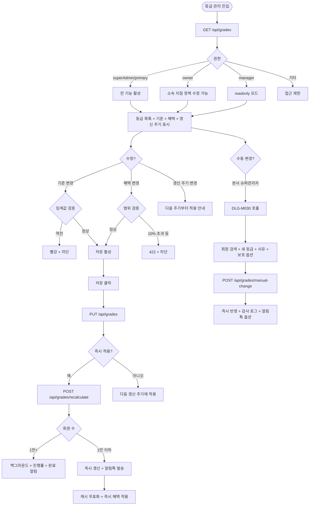
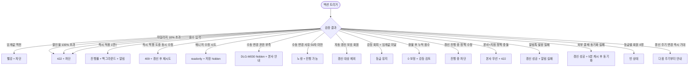

# SCR-M009 등급 관리 페이지

## 1. 화면 메타 정보

이 문서는 등급 관리 페이지에 대한 자기완결형 요구사항 정의서입니다. 다른 문서를 함께 보지 않아도 이 문서 한 장만으로 등급 관리 페이지에 들어가는 모든 영역, 모든 버튼, 모든 모달, 모든 권한, 모든 예외 처리, 그리고 이 화면을 지탱하는 운영 정책까지 전부 이해하고 구현할 수 있도록 작성합니다.

| 항목 | 값 |
|---|---|
| 작성일 | 2026-05-22 |
| 버전 | v1.0 |
| 상태 | 정합화 완료 (퍼블링 완료/데이터 미연동) |
| 도메인 | D02 회원관리 |
| 화면 ID | SCR-M009 |
| 화면명 | 등급 관리 |
| 화면 유형 | 정책 설정 화면 (Policy Configuration Screen) |
| 라우트 (URL) | `/members/grade` |
| 플랫폼 | 데스크톱(기본) |
| 우선순위 | P1 |
| 기능코드 | MBR-EXT-03 (등급 관리) |
| 계약코드 | MBR-EXT-03 |
| 계약 상태 | 계약 범위 본기능 |
| 부모 기능 prefix | MBR |
| Lv1 코드 | MBR-EXT-03 |
| Lv2 / Lv3 세분화 | MBR-EXT-03-01 ~ MBR-EXT-03-07 (등급 목록 패널, 등급 기준 설정, 등급별 혜택, 자동 갱신 주기, 등급별 회원 현황, 저장+적용, 등급 수동 변경) |
| 연계 화면 | SCR-M001 회원목록, SCR-M004 회원상세, SCR-S003 결제, SCR-074 마일리지, SCR-097 감사로그 |
| 호출 다이얼로그 | DLG-M030 등급변경 |

## 2. 화면 개요와 목적

등급 관리 페이지는 회원 등급 체계(브론즈/실버/골드/플래티넘/다이아몬드 5단계)의 기준을 설정하고 각 등급별 혜택을 관리하는 화면입니다. 누적 결제 금액·총 이용 기간(개월)·누적 방문 횟수 같은 조건으로 등급 산정 기준을 정의하고, 조건을 충족한 회원에게 자동으로 등급을 부여합니다. 등급별 차별화된 혜택(마일리지 적립률·이용권 할인율·부가 서비스 우선 배정·생일 특별 혜택)으로 회원 충성도와 재방문율을 높이며, 결제(SCR-S003)·마일리지(SCR-074)·예약 시스템과 자동 연동되어 등급 혜택이 즉시 적용됩니다.

운영 현장의 시나리오는 다양합니다. 본사 최고관리자가 분기 등급 정책 개편 시 임계값과 혜택 비율을 조정하고 즉시 적용 또는 다음 갱신 주기에 반영합니다. Owner(지점장)은 본사 정책 위에 지점별 추가 혜택을 정의합니다(혜택 차감은 불가). FC는 회원 상세에서 D-임박 카드를 보고 등급 상승 직전 회원에게 추가 결제를 권유합니다. 매월 1일 새벽 04:00에 자동 갱신 배치가 모든 회원의 누적 결제·이용 기간을 재계산해 등급을 갱신하고 변동 회원에게 카카오 알림톡을 발송합니다. 본사 슈퍼관리자는 VIP 케이스나 클레임 보상으로 DLG-M030을 호출해 회원의 등급을 수동 변경하며 사유 입력이 필수입니다.

회원 병합(MBR-EXT-01) 시 누적 결제 합산으로 등급이 즉시 재산정되고, 회원 이관(MBR-ADV-02) 후에는 누적 결제·이용 기간·방문 횟수가 모두 보존되어 등급이 유지됩니다(새 지점 정책이 다르면 다음 갱신에 재산정).

## 3. 진입 경로와 인접 화면

등급 관리 페이지에 들어오는 일반적인 경로는 사이드바 "회원관리 > 등급 관리" 항목입니다. 본사 정책 개편 시 본사 최고관리자가 직접 진입하고, 지점별 추가 혜택 설정 시 Owner(지점장)이 진입합니다. 매니저는 조회만 가능하며 FC·트레이너·스태프·프런트는 접근이 차단됩니다.

이 화면에서 빠져나가는 인접 화면으로는 등급별 회원 현황 클릭 시 SCR-M001 회원 목록(등급 필터 자동 적용), 회원 등급 수동 변경 시 DLG-M030이 호출되어 회원 상세(SCR-M004)에서 이어지는 흐름, 정책 수정 시 SCR-097 감사 로그 INSERT가 있습니다.

## 4. 레이아웃과 UI 구성

등급 관리 페이지는 위에서 아래로 차곡차곡 쌓이는 레이아웃입니다. 가장 위에는 페이지 헤더("등급 관리"라는 타이틀)가 있고, 헤더 아래에 등급 목록 패널, 등급 기준 설정 영역, 등급별 혜택 설정 영역, 자동 갱신 주기 영역, 등급별 회원 현황 링크, 저장+적용 액션 바가 차례로 배치됩니다.

등급 목록 패널은 5단계 등급(브론즈/실버/골드/플래티넘/다이아몬드)을 순서대로 표시합니다. 각 등급 행에는 등급명, 등급 아이콘(색상으로 구분), 해당 등급에 속한 현재 회원 수가 표시됩니다. 회원 수 옆에는 "회원 보기" 링크가 있어 클릭 시 SCR-M001 회원 목록 + 해당 등급 필터 자동 적용으로 이동합니다.

등급 기준 설정 영역에는 기준 항목 선택 옵션(누적 결제 금액 / 총 이용 기간(개월) / 누적 방문 횟수 — 단일 또는 조합)이 있습니다. 조합 선택 시 AND 매칭으로 모든 조건을 충족해야 등급이 부여됩니다. 각 등급의 최솟값을 입력하면 초과 조건으로 자동 계산됩니다. 예를 들어 골드 = 누적 결제 300만원 + 이용 12개월처럼 표시됩니다. 임계값이 역전된 경우(실버 < 브론즈)는 인라인 빨강 + "상위 등급은 하위보다 커야 합니다" 안내가 표시되고 저장이 차단됩니다.

등급별 혜택 설정 영역은 각 등급 카드에 마일리지 적립률(0~10%), 이용권 할인율(0~100%), 부가 서비스 우선 배정 토글, 생일 특별 혜택 토글이 있습니다. 입력값이 허용 범위 외이면 422로 거부되고 저장이 차단됩니다.

자동 갱신 주기 영역은 월간 / 분기 / 연간 중 선택할 수 있는 라디오 그룹입니다. 갱신 시점은 매월 1일 04:00, 분기 첫날 04:00, 연 1월 1일 04:00입니다. 자동 갱신 보호 토글(수동 변경 회원의 다음 자동 갱신 시 정책 재계산 제외)과 강등 회피 정책 토글("최고 도달 등급 유지" 활성화)이 함께 제공됩니다.

저장+적용 액션 바는 페이지 하단에 위치합니다. 저장 후 변경 즉시 적용 여부를 선택할 수 있으며, 즉시 적용 선택 시 백그라운드 재계산이 시작되고 진행률이 표시됩니다. 회원 수가 1만 명을 초과하면 5~10분이 소요됨이 안내됩니다.

등급 수동 변경은 페이지 헤더 또는 회원 상세 진입 메뉴를 통해 DLG-M030이 호출되어 진행됩니다.

## 5. 정책 수정과 적용 흐름

페이지 진입 시 `GET /api/grades`가 호출되어 현재 등급 정책과 등급별 회원 분포가 로드됩니다. 응답에는 5등급 각각의 기준 항목·최솟값·혜택·자동 갱신 주기·강등 회피 정책·자동 갱신 보호 정책·등급별 회원 수가 포함됩니다.

기준 항목 수정 시 임계값 정합성 검증이 실시간으로 수행됩니다. 상위 등급의 임계값이 하위 등급의 임계값보다 작으면 인라인 빨강 + 저장 차단입니다. 마일리지 적립률 10% 초과나 할인율 100% 초과 같은 범위 외 입력도 즉시 검증됩니다. 음수 입력은 차단됩니다. 브론즈는 임계값 0이 허용되지만(누구나 시작 가능) 다른 등급은 0보다 커야 합니다.

저장 버튼을 누르면 `PUT /api/grades`가 호출되어 변경된 정책이 저장됩니다. 즉시 적용 여부 선택 모달이 표시되고, "즉시 적용"을 선택하면 `POST /api/grades/recalculate`가 호출되어 모든 회원 등급이 재산정됩니다. "다음 갱신 주기"를 선택하면 즉시 변동 없이 다음 배치에서 처리됩니다.

즉시 적용 시 회원 1만 명 이상이면 백그라운드 처리되며 진행률 표시 + 완료 알림이 제공됩니다. 즉시 적용 도중 다른 운영자가 정책을 수정하면 optimistic lock 위반 + 후행 요청 거부 + "다른 운영자가 정책을 수정 중" 모달이 표시됩니다.

갱신 배치 실행 중 정책 수정 시도는 "갱신 진행 중입니다. 완료 후 다시 시도해주세요" 모달로 차단됩니다.

등급 수동 변경은 DLG-M030을 호출합니다. 회원 검색 → 새 등급 선택 → 사유 입력(50자 이상 권장) → 자동 갱신 보호 옵션(다음 자동 갱신 시 자동 재계산 무시) → [실행]으로 즉시 반영됩니다. 보호 만료 시점(3개월/6개월/무기한)을 설정할 수 있습니다. 권한은 본사 슈퍼관리자만 가능합니다.

## 6. 버튼·아이콘·링크 액션 전체 정의

등급 목록 패널의 "회원 보기" 링크는 SCR-M001 회원 목록 + 해당 등급 필터 자동 적용으로 이동합니다.

기준 항목 선택 라디오는 누적 결제 금액 / 총 이용 기간(개월) / 누적 방문 횟수 중 단일 또는 조합으로 선택됩니다. 각 등급 입력란은 숫자만 입력 가능하며 음수 차단입니다.

등급별 혜택 설정 카드의 마일리지 적립률·할인율 입력란은 범위 검증이 실시간으로 수행됩니다. 부가 서비스 우선 배정·생일 특별 혜택은 토글 스위치로 on/off 됩니다.

자동 갱신 주기 라디오는 월간/분기/연간 중 단일 선택입니다. 자동 갱신 보호 토글과 강등 회피 정책 토글은 별도 토글로 on/off 됩니다.

저장 버튼은 변경 사항이 있을 때만 활성화됩니다. 누르면 즉시 적용 여부 선택 모달이 표시되고 운영자가 즉시 적용 또는 다음 갱신 주기를 선택합니다.

등급 수동 변경 진입 메뉴는 본사 슈퍼관리자에게만 보이며 누르면 DLG-M030이 호출됩니다.

## 7. 호출되는 모달 동작

### 7-1. DLG-M030 등급 변경 다이얼로그

등급 변경 다이얼로그는 본사 슈퍼관리자가 등급 관리 페이지의 [수동 변경] 메뉴 또는 회원 상세에서 진입할 때 호출됩니다. 권한이 부족한 사용자에게는 다이얼로그 자체가 hidden 처리됩니다.

모달 본문에는 회원 검색 영역(이름·연락처로 검색), 검색 결과에서 회원 선택, 현재 등급 표시(읽기 전용), 새 등급 선택 드롭다운, 각 등급별 혜택 요약 안내(선택 시 표시), 사유 입력 텍스트 영역(필수, 50자 이상 권장), 변경 적용일 선택(기본값 즉시 적용), 자동 갱신 보호 토글(다음 자동 갱신 시 자동 재계산 무시)이 있습니다.

[확인] 버튼을 누르면 `POST /api/grades/manual-change`가 호출됩니다. 사유가 50자 미만이면 노랑 경고가 표시되지만 진행은 가능합니다. 성공 시 모달이 닫히고 회원의 등급이 즉시 변경되며, 회원에게 카카오 알림톡으로 등급 변경 알림이 발송됩니다(옵션). SCR-097 감사 로그에 기록됩니다.

[취소] 버튼이나 ESC 키, 배경 클릭으로 모달을 닫을 수 있습니다.

## 8. 토스트와 확인 팝업과 알럿

성공 토스트는 우측 상단에 녹색 톤으로 표시됩니다. "정책이 저장되었어요", "○○ 회원의 등급이 변경되었어요", "즉시 적용이 시작되었어요" 같은 문구가 5초간 유지됩니다. 즉시 적용 회원 1만+ 시 진행률 표시 카드가 페이지 중앙 하단에 머무릅니다.

실패 토스트는 빨강 톤으로 표시됩니다. "임계값이 역전되었어요", "마일리지 적립률은 10% 이하여야 합니다", "할인율은 100% 이하여야 합니다", "다른 운영자가 정책을 수정 중입니다", "갱신 진행 중입니다" 같은 안내가 표시됩니다.

매니저가 정책 수정을 시도하면 입력란이 readonly로 표시되고 저장 버튼이 hidden 처리됩니다. FC·트레이너·스태프·프런트가 직접 URL 진입을 시도하면 접근 제한 알럿 후 대시보드로 자동 이동됩니다.

자동 갱신 보호 회원이 자동 재계산 대상에서 자동 제외됨, 강등 회피 정책 활성 + 임계값 미달 회원이 등급을 유지함 같은 정책 동작은 토스트가 아닌 카드형 안내로 페이지에 표시됩니다.

회원 알림톡 발송 실패는 갱신 자체는 성공한 상태에서 알림 실패 토스트만 표시됩니다. 외부 결제 시스템 동기화 실패도 등급 갱신은 성공한 상태에서 혜택 적용이 5분 캐시 만료 후 자동 동기화됨이 안내됩니다.

등급별 회원 0명인 등급은 "회원이 없습니다" 빈 상태로 표시됩니다. 갱신 주기 변경 직후 즉시 효과를 기대하는 경우 "다음 주기부터 적용됩니다" 안내가 표시됩니다.

## 9. 데이터 흐름과 외부 연동

페이지 진입 시 `GET /api/grades`가 호출되어 현재 등급 정책과 등급별 회원 분포가 로드됩니다.

정책 저장은 `PUT /api/grades`를 호출합니다. 즉시 적용은 `POST /api/grades/recalculate`를 호출하며 백그라운드 작업으로 처리됩니다. 진행률은 `GET /api/grades/recalc-status`로 폴링됩니다.

등급 수동 변경은 `POST /api/grades/manual-change`를 호출합니다. 요청 본문에는 회원 ID, 새 등급, 사유, 자동 갱신 보호 옵션, 보호 만료 시점이 포함됩니다.

등급별 회원 분포 조회는 `GET /api/grades/distribution`을 호출해 통합 모드 시 지점별 등급 분포 비교를 제공합니다.

자동화 체인이 트리거됩니다. 등급 자동 갱신 배치(매월 1일 / 분기 / 연 04:00)가 모든 회원의 누적 결제·이용 기간·방문 횟수를 재계산해 등급을 갱신합니다. 변동 회원에게 카카오 알림톡 "○○로 승급되었습니다" 발송이 트리거되며 NFR-19 알림 센터로 회원·운영자 양방향 알림이 발송됩니다.

결제(SCR-S003) 시점에 회원 등급에 따른 할인율이 자동 적용되고, 마일리지(SCR-074) 적립 시 등급별 적립률이 적용됩니다. 예약 시스템에서 부가 서비스(락커·주차) 우선 배정에 등급 우선순위가 적용됩니다.

회원 병합(MBR-EXT-01) 시 병합 트랜잭션 내부에서 누적 결제 합산 → 등급 즉시 재산정 트리거가 발동됩니다. 회원 이관(MBR-ADV-02) 시 누적 결제·이용 기간·방문 횟수가 모두 보존되어 등급이 유지되며, 새 지점 정책이 다르면 다음 갱신에 재산정됩니다.

환불 처리(DLG-M013) 시 누적 결제 차감 + 등급 강등 검토가 발동됩니다. 양도 처리(DLG-M019) 시 양도자 누적 차감 + 양수자 누적 가산이 발생합니다.

회원 목록·회원 상세의 등급 배지는 캐시 무효화 후 즉시 반영됩니다.

MBR-EXT-04 세그먼트는 등급 조건을 사용해 자동 갱신됩니다. 본사 통합 KPI 대시보드에서 등급 분포의 일/주/월 집계가 제공됩니다.

모든 정책 수정·즉시 적용·수동 변경은 SCR-097 감사 로그에 actor·before/after·사유 JSON으로 INSERT됩니다.

화면에서 호출하는 주요 API: 등급 정책 조회 `GET /api/grades`, 정책 저장 `PUT /api/grades`, 즉시 재산정 `POST /api/grades/recalculate`, 등급 수동 변경 `POST /api/grades/manual-change`, 등급 분포 `GET /api/grades/distribution`, 재산정 진행률 `GET /api/grades/recalc-status`.

## 10. 화면 상태와 예외 처리

화면 상태는 다음과 같이 정의됩니다.

기준 미설정 상태는 등급 기준이 한 번도 정의되지 않은 신규 테넌트에서 표시되며 "등급 기준을 설정해주세요" 안내가 표시됩니다. 정상(조회) 상태는 5등급 + 기준/혜택이 표시된 일반 상태입니다.

편집 중 상태는 변경 감지 + 저장 활성 상태입니다. 저장 중 상태는 PUT 요청 도중 로딩 표시입니다. 즉시 적용 중 상태는 재산정 백그라운드 작업 진행 중이며 진행률이 표시됩니다.

권한 부족 상태는 매니저가 진입한 경우 readonly 모드로 표시되거나 FC 이하 권한자는 접근 제한 화면으로 차단됩니다.

예외 케이스별 처리는 다음과 같습니다. 임계값 역전(실버 < 브론즈)은 빨강 인라인 + "상위 등급은 하위보다 커야 합니다" 차단입니다. 마일리지 적립률 10% 초과, 할인율 100% 초과, 음수 입력은 422 + "범위 안내" 차단입니다.

즉시 적용 회원 수 1만+ 는 진행률 표시 + 백그라운드 처리 + 5~10분 소요 안내 + 완료 알림입니다. 즉시 적용 도중 동시 수정은 "다른 운영자가 정책을 수정 중입니다" 모달 + 갱신 완료 후 재시도 안내입니다.

매니저 수정 시도는 입력란 readonly + 저장 버튼 hidden입니다. 수동 변경 권한 부족은 DLG-M030 진입 차단 + 본사 문의 안내입니다. 수동 변경 사유 50자 미만은 노랑 경고 + 진행 가능입니다.

자동 갱신 보호 회원이 자동 재계산 시도 시 갱신 대상에서 자동 제외되며 보호 만료 시 재포함됩니다. 강등 회피 정책 활성 + 임계값 미달은 등급 유지(강등 안 함) + 다음 갱신에 다시 검사입니다.

환불 시 누적 차감 후 음수는 0으로 보정 + 등급 강등 검토입니다. 갱신 배치 진행 중 정책 수정은 "갱신 진행 중입니다. 완료 후 다시 시도해주세요" 차단입니다.

본사 정책 + 지점 정책 충돌은 본사 정책 우선 + 지점 차감 시도 시 422 거부 + 본사 정책 확인 안내입니다.

회원 알림톡 발송 실패는 갱신은 성공 + 알림 실패 토스트 + 운영자 수동 안내입니다. 외부 결제 시스템 동기화 실패는 등급 갱신은 성공 + 혜택 적용 지연 + 5분 캐시 만료 후 자동 동기화입니다.

등급별 회원 0명은 "회원이 없습니다" 빈 상태로 표시됩니다. 갱신 주기 변경 직후 즉시 효과 기대는 "다음 주기부터 적용됩니다" 안내입니다.

## 11. 권한별 처리

이 화면은 권한에 따라 진입 가능 여부와 가능한 액션이 모두 달라집니다.

superAdmin와 primary는 전체 브랜드 등급 체계를 설정·관리할 수 있습니다. 등급 기준·혜택 설정, 갱신 주기 변경, 즉시 적용, 등급 수동 변경(DLG-M030)까지 모두 가능합니다.

Owner(지점장)은 소속 지점 등급 체계를 설정·관리할 수 있습니다. 본사 정책 위에 지점별 추가 혜택을 정의할 수 있지만 혜택 차감은 불가능합니다.

매니저(manager)는 소속 지점 등급 현황을 조회만 할 수 있습니다. 정책 수정은 불가능하며 입력란이 readonly + 저장 버튼이 hidden 처리됩니다. 등급 수동 변경(DLG-M030)도 불가능합니다.

FC(fc), 트레이너(trainer), 스태프(staff), 프런트(front), readonly는 이 화면에 진입할 수 없습니다. 직접 URL 진입 시 접근 제한 알럿 후 대시보드로 자동 이동됩니다.

권한별 차단은 단계적으로 일관 적용됩니다. 사이드바·페이지 본문·백엔드 응답까지 4단계로 차단되며 모든 권한 차단 이벤트는 감사 로그에 기록됩니다.

## 12. 메인 흐름

## 13. 에러와 예외 흐름

## 14. 핵심 디자인 요청사항

등급 관리 화면이 운영자에게 잘 작동하려면 다음 디자인 원칙이 시각적으로 명확해야 합니다.

5등급은 시각적 위계가 명확해야 합니다. 브론즈=동색, 실버=은색, 골드=금색, 플래티넘=백금색, 다이아몬드=다이아 톤으로 등급 아이콘 색상이 일관되어야 하며 등급명 라벨과 함께 표시되어 색맹 운영자도 식별 가능해야 합니다.

각 등급 카드는 동일 크기 동일 그리드로 배치되며 임계값과 혜택을 한눈에 비교할 수 있어야 합니다. 임계값 역전 시 빨강 강조 + 화살표 표시로 어느 등급의 어느 임계값이 잘못되었는지 명확히 표시합니다.

혜택 입력란은 범위 표시(0~10%, 0~100% 등)가 라벨 옆에 작은 글씨로 항상 노출되어 사용자가 범위를 인식할 수 있게 합니다. 범위 초과 시 빨강 강조 + 인라인 메시지가 즉시 표시됩니다.

자동 갱신 주기 라디오는 선택된 옵션이 강조 색상으로 표시되고 그 옆에 갱신 시점(매월 1일 04:00 등) 안내가 작은 글씨로 표시됩니다.

저장 버튼은 변경 사항이 있을 때만 활성화되며 비활성 상태에서는 회색 + "변경 사항이 없습니다" 툴팁이 표시됩니다.

즉시 적용 진행률 카드는 페이지 중앙 하단에 머무르며 진행률 게이지와 함께 "○○명 중 △△명 처리 완료" 텍스트가 표시됩니다.

DLG-M030의 등급 선택 드롭다운은 각 등급의 혜택 요약이 옵션 옆에 짧은 글씨로 표시되어 운영자가 변경 후 혜택을 즉시 알 수 있게 합니다.

매니저 readonly 모드에서는 입력란이 회색 톤으로 처리되고 우측에 자물쇠 아이콘이 표시되어 readonly임을 시각적으로 알립니다.

## 15. 운영 정책 (이 화면에 연결된 부분)

등급 시스템은 회원 충성도와 재방문율의 핵심 도구이며 결제·마일리지·예약과 모두 연동되므로, 이 화면을 지탱하는 정책이 매우 다층적입니다.

등급 임계값 정합성 정책은 상위 등급의 모든 임계값이 하위 등급보다 같거나 커야 하는 것입니다. 역전 시 저장이 차단되며 이는 등급의 의미 자체를 보호하는 정책입니다.

혜택 범위 정책은 마일리지 적립률 0~10%, 이용권 할인율 0~100% 이내입니다. 음수·초과 입력은 422로 거부되며 이는 비현실적 혜택으로 회원의 기대를 깨뜨리는 사고를 막기 위한 정책입니다.

등급 자동 갱신 vs 수동 정책은 수동 변경 + 자동 갱신 보호 체크 시 다음 자동 갱신 시 정책 재계산이 제외되는 것입니다. 보호 만료 시점은 3개월/6개월/무기한 중 설정 가능합니다. VIP 케이스나 클레임 보상으로 부여된 등급이 자동 갱신으로 강등되는 사고를 막습니다.

등급 강등 정책은 자동 갱신 시 임계값 미달이면 강등 가능이지만, 강등 회피 정책 토글로 "최고 도달 등급 유지" 활성화 가능합니다. 충성도 보호를 위한 옵션 정책입니다.

신규 회원 기본 등급 정책은 브론즈 자동 부여 + 누적 결제 0원 시작입니다.

누적 결제 산정 정책은 환불 처리 시 환불 금액만큼 누적에서 차감하며 양도된 이용권은 양수자 누적에 가산, 양도자에서 차감입니다. 누적 차감 후 음수가 되면 0으로 보정하고 강등 검토가 발동됩니다.

이용 기간 산정 정책은 등록일부터 현재까지(탈퇴/홀딩 기간 제외)입니다. 방문 횟수 산정 정책은 출석 처리(수동/자동) 기준이며 동일 일자 다중 출석은 1회로 카운트입니다.

회원 이관 시 등급 보존 정책은 누적 결제·이용 기간·방문 횟수 모두 이전되고 등급이 유지되는 것입니다. 새 지점 정책이 다르면 다음 갱신에 재산정됩니다.

회원 병합(MBR-EXT-01) 시 정책은 병합 트랜잭션 내부에서 누적 결제 합산 → 등급 즉시 재산정 트리거입니다.

본사 통합 모드 정책은 본사 정책이 우선이며 지점은 추가 혜택만 정의 가능합니다(혜택 차감 불가). 본사+지점 정책 충돌 시 본사 정책 우선 + 지점 차감 시도는 422로 거부됩니다.

지점별 회원 수 표시 정책은 본사 모드에서 지점별 등급 분포 비교가 가능한 것입니다.

혜택 적용 시점 정책은 등급 변동 즉시 결제·마일리지·예약 시스템에 반영되며 캐시 무효화 처리됩니다.

알림 정책은 등급 변동 회원에게 카카오 알림톡(축하 또는 안내) 발송이며 옵션으로 비활성화 가능합니다.

감사 로그 정책은 정책 수정 / 즉시 적용 / 수동 변경 모두 SCR-097에 before/after JSON 형태로 기록되는 것입니다.

등급별 회원 목록 진입 정책은 등급 클릭 → SCR-M001 회원 목록 + 등급 필터 자동 적용입니다.

임계값 0 입력 허용 정책은 브론즈만 임계값 0이 가능한 것입니다(누구나 시작 가능). 다른 등급은 0보다 커야 합니다.

갱신 주기 변경 정책은 변경 시 즉시 효과는 없고 다음 주기부터 새 주기가 적용되는 것입니다.

수동 변경 보호 만료 정책은 보호 기간 만료 시 자동 재계산 대상에 포함되며 변동 시 알림 push가 발송되는 것입니다.

갱신 진행 중 동시성 정책은 갱신 배치 실행 중 정책 수정 시도 시 차단 + 완료 후 재시도 안내입니다.

이상의 모든 정책은 이 화면을 구현하고 운영하는 사람이 별도 문서 없이 이 한 장으로 이해할 수 있도록 풀어 적었습니다. 정책이 바뀌면 이 문서가 함께 갱신되어야 하며, 코드 변경과 정책 변경은 항상 짝지어 진행됩니다.
