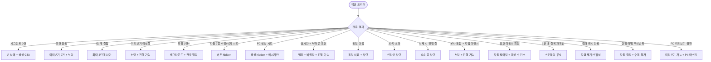

# SCR-M010 세그먼트 관리 페이지

## 1. 화면 메타 정보

이 문서는 세그먼트 관리 페이지에 대한 자기완결형 요구사항 정의서입니다. 다른 문서를 함께 보지 않아도 이 문서 한 장만으로 세그먼트 관리 페이지에 들어가는 모든 영역, 모든 버튼, 모든 모달, 모든 권한, 모든 예외 처리, 그리고 이 화면을 지탱하는 운영 정책까지 전부 이해하고 구현할 수 있도록 작성합니다.

| 항목 | 값 |
|---|---|
| 작성일 | 2026-05-22 |
| 버전 | v1.0 |
| 상태 | 정합화 완료 (퍼블링 완료/데이터 미연동) |
| 도메인 | D02 회원관리 |
| 화면 ID | SCR-M010 |
| 화면명 | 세그먼트 관리 |
| 화면 유형 | 조건 빌더·분석 화면 (Query Builder + Analytics Screen) |
| 라우트 (URL) | `/members/segment` |
| 플랫폼 | 데스크톱(기본) |
| 우선순위 | P1 |
| 기능코드 | MBR-EXT-04 (세그먼트 관리) |
| 계약코드 | MBR-ADV-06, MBR-EXT-04 |
| 계약 상태 | 계약 범위 본기능 |
| 부모 기능 prefix | MBR |
| Lv1 코드 | MBR-EXT-04 |
| Lv2 / Lv3 세분화 | MBR-EXT-04-01 ~ MBR-EXT-04-08 (세그먼트 목록, 생성, 조건 빌더, 미리보기, 자동 갱신, 액션 연결, 수정·삭제, 자동 분류 7종) |
| 연계 화면 | SCR-M001 회원목록, SCR-071 메시지, SCR-073 쿠폰, SCR-074 마일리지, SCR-097 감사로그 |
| 호출 다이얼로그 | 없음 (조건 빌더는 화면 내부 UI로 처리) |

## 2. 화면 개요와 목적

세그먼트 관리 페이지는 공통된 특성이나 행동 패턴을 가진 회원들을 그룹(세그먼트)으로 묶어 타겟 마케팅과 맞춤 관리에 활용하는 화면입니다. "30일 이상 미방문 활성 회원", "이번 달 만료 예정 회원", "신규 등록 후 한 번도 방문하지 않은 회원", "골드 등급 + 가족 그룹 보유" 같은 다양한 조건 조합으로 세그먼트를 생성하고, 해당 그룹에 메시지 발송(SCR-071)이나 이용권 혜택 적용(SCR-073) 같은 액션을 연결합니다.

자동 분류 세그먼트 7종(신규 / 만료후미등록 / 이탈위험 / 만료임박 / 관심필요 / 충성 / 활발)이 회원 목록(SCR-M001) 배지에 자동 표시됩니다. 기본 자동 라벨 6종(신규·만료후미등록·이탈위험·만료임박·관심필요·활발)은 우선순위 기반으로 하나만 부여되며, `충성`은 보조 라벨로 별도 판정하여 기본 자동 라벨과 동시에 표시됩니다. 운영자 정의 커스텀 세그먼트는 추가 라벨 형태로 제공됩니다.

운영 현장의 시나리오는 다양합니다. 매니저가 월말 이탈 방지 캠페인으로 "30일 미방문 + 활성 + 만료 D-30 이내" 세그먼트를 만들어 카카오 알림톡을 일괄 발송하고, FC가 일일 콜 리스트로 "오늘 만료" + "충성" 자동 세그먼트를 결합해 우선 콜 대상을 확보합니다. 본사 슈퍼관리자는 분기 신규 첫 방문 유도 캠페인으로 "이번 분기 신규 + 첫 방문 X" 세그먼트에 첫 방문 쿠폰을 일괄 발급하고, 센터장은 "활발" 세그먼트 회원 수 추이로 지점 KPI를 정량 측정합니다.

세그먼트는 회원 검색 조건의 확장이자 마케팅 대상 정의 도구로 활용되며, 등급(MBR-EXT-03)·가족(MBR-EXT-02)·결제 이력·출석 패턴을 모두 조건으로 사용할 수 있습니다.

## 3. 진입 경로와 인접 화면

세그먼트 관리 페이지에 들어오는 일반적인 경로는 사이드바 "회원관리 > 세그먼트 관리" 항목입니다. 본사 슈퍼관리자가 분기 캠페인 계획 시, 매니저가 월말 이탈 방지 캠페인 준비 시, FC가 일일 콜 리스트 작성 시 진입합니다.

이 화면에서 빠져나가는 인접 화면으로는 세그먼트 카드의 [메시지 발송] 클릭 시 SCR-071 메시지 발송(대상 자동 선택), [이용권 혜택 적용] 클릭 시 SCR-073 쿠폰 발급(대상 자동 선택), [회원 목록으로 보기] 클릭 시 SCR-M001 회원 목록(세그먼트 필터 자동 적용), 마일리지 일괄 적립 시 SCR-074 마일리지, 모든 세그먼트 변경 이벤트가 기록되는 SCR-097 감사 로그가 있습니다.

## 4. 레이아웃과 UI 구성

세그먼트 관리 페이지는 위에서 아래로 차곡차곡 쌓이는 레이아웃입니다. 가장 위에는 페이지 헤더("세그먼트 관리"라는 타이틀과 함께 "새 세그먼트 만들기" 버튼)가 있습니다.

헤더 아래에는 자동 분류 7종 세그먼트 패널이 있습니다. 신규·만료후미등록·이탈위험·만료임박·관심필요·충성·활발의 7개 카드가 가로로 배치되고 각 카드에는 세그먼트명·짧은 설명·해당 회원 수·우선순위 번호가 표시됩니다. 카드 클릭 시 SCR-M001 회원 목록 + 해당 세그먼트 필터 자동 적용으로 이동합니다. 자동 7종은 시스템 정의이며 수정·삭제가 불가능해 수정·삭제 버튼이 hidden 처리됩니다.

자동 7종 아래에는 커스텀 세그먼트 목록이 카드 그리드로 표시됩니다. 각 카드에는 세그먼트명·설명·해당 회원 수·생성일·마지막 업데이트·자동 갱신 주기·생성자가 표시됩니다. 카드 우측 상단에 [메시지 발송] / [이용권 혜택 적용] / [회원 목록으로 보기] 액션 버튼이 권한별로 노출됩니다. 카드 하단에는 수정·삭제 버튼(권한자만)이 있습니다.

새 세그먼트 만들기 또는 기존 세그먼트 수정 시 조건 빌더 영역이 펼쳐집니다. 조건 빌더는 AND/OR 조합으로 다중 조건을 추가하는 UI로, 최대 3단계 중첩((A AND B) OR (C AND D))까지 지원됩니다. 더 깊은 중첩은 UI에서 차단됩니다.

조건 항목 13종은 다음과 같습니다. 회원 상태(활성/홀딩/만료/미등록), 최근 방문일(예: 30일 이상 미방문), 이용권 만료일(정책 step 대상·만료 30일 이내 같은 운영 조건), 등록일(예: 최근 30일 내 등록), 성별, 연령대, 회원구분, 유입경로, 누적 결제 금액 범위(min~max), 등급(MBR-EXT-03), 가족 그룹(MBR-EXT-02), 자동 세그먼트 라벨(7종), 운동프로그램 보유.

조건 빌더 아래에는 미리보기 영역이 있습니다. [미리보기] 버튼을 누르면 현재 조건에 해당하는 회원 수와 샘플 명단 10명(이름·연락처·등급)이 표시됩니다. 90일 경과 탈퇴 회원은 PII 마스킹 표시됩니다.

자동 갱신 설정 영역은 실시간 / 매일 / 주간 / 월간 중 선택할 수 있습니다. 실시간은 회원 상태 변경·결제·출석 이벤트 발생 시 즉시 재계산되지만 부하가 큰 세그먼트는 빨강 경고와 함께 비권장됩니다.

페이지 하단에는 저장 액션 바가 있습니다. 미리보기 미실행 후 저장 시도는 노랑 경고 "회원 수 미확정" 후 진행 가능합니다.

## 5. 세그먼트 생성과 액션 실행 흐름

새 세그먼트 만들기는 다음과 같이 진행됩니다. 헤더의 "새 세그먼트 만들기" 버튼을 누르면 빈 조건 빌더가 펼쳐집니다. 이름·설명을 입력(이름 필수, 30자 이내, 동일 지점 내 중복 차단)하고 조건 빌더에서 AND/OR 조합으로 다중 조건을 추가합니다.

조건 빌더 사용 시 충돌 조건(예: 활성 + 탈퇴 동시 선택) 시 미리보기 결과 0건 + 경고 안내가 표시됩니다. 4단계 중첩 시도 시 "최대 3단계까지 가능합니다" 차단됩니다.

[미리보기] 버튼으로 현재 조건에 해당하는 회원 수와 샘플 명단을 확인합니다. 미리보기 미실행 후 저장 시도 시 노랑 경고가 표시되지만 진행은 가능합니다.

자동 갱신 주기를 선택합니다. 실시간 모드 + 부하 큰 조건(전체 회원 대상 복잡 조건 등) 시 빨강 경고 + 비권장 안내가 표시되지만 강제는 아닙니다.

[저장]을 누르면 `POST /api/segments`가 호출되어 세그먼트가 INSERT되고 첫 번째 재계산이 즉시 실행됩니다. 회원 1만+ 시 백그라운드 처리 + 카드에 "계산 중" 라벨 + 완료 시 알림 센터 푸시입니다.

기존 세그먼트 수정은 카드의 수정 버튼으로 진행됩니다. 자동 7종은 수정 불가능이므로 수정 버튼이 hidden입니다.

세그먼트 삭제는 카드의 삭제 버튼으로 진행됩니다. 진행 중 메시지 발송 / 쿠폰 발급 작업이 있으면 완료까지 삭제 보류 + "발송 진행 중. 완료 후 삭제 가능" 안내가 표시됩니다. 자동 7종은 삭제 불가능입니다.

액션 연결 흐름은 다음과 같습니다. 세그먼트 카드의 [메시지 발송] 버튼 클릭 시 SCR-071 메시지 발송으로 진입하면서 대상자가 자동 선택됩니다. 광고 동의(`marketing_agreed_at`) 회원만 자동 필터링되어 발송 대상이 좁혀집니다. 가족 묶음 옵션을 켜면 그룹당 1명에게만 발송됩니다.

[이용권 혜택 적용] 버튼 클릭 시 SCR-073 쿠폰 발급으로 진입하면서 대상자가 자동 선택되고 일괄 쿠폰 발급이 진행됩니다. [회원 목록으로 보기] 버튼 클릭 시 SCR-M001 회원 목록 + 세그먼트 필터 자동 적용으로 이동해 추가 필터를 결합할 수 있습니다.

[지금 재계산] 버튼은 결과 캐시(24시간)를 무시하고 강제 재계산을 트리거합니다. 동일 세그먼트 1분 내 중복 재계산 요청은 스로틀링으로 무시됩니다.

## 6. 버튼·아이콘·링크 액션 전체 정의

페이지 헤더의 "새 세그먼트 만들기" 버튼은 빈 조건 빌더를 펼칩니다.

자동 7종 세그먼트 카드는 클릭으로 SCR-M001 회원 목록 + 해당 세그먼트 필터 자동 적용으로 이동합니다. 수정·삭제 버튼은 hidden입니다.

커스텀 세그먼트 카드의 [메시지 발송] 버튼은 SCR-071로 진입하면서 대상이 자동 선택됩니다. [이용권 혜택 적용] 버튼은 SCR-073으로 진입합니다. [회원 목록으로 보기] 버튼은 SCR-M001로 진입합니다.

카드 하단의 수정·삭제 버튼은 권한자에게만 보입니다. 수정은 조건 빌더를 펼치고, 삭제는 확인 모달 호출입니다.

조건 빌더의 [조건 추가] 버튼은 새 조건 행을 추가하며, AND/OR 토글은 조건 간 관계를 변경합니다. [중첩 추가] 버튼은 괄호 그룹을 추가하며 최대 3단계까지 가능합니다.

[미리보기] 버튼은 실시간 쿼리로 회원 수와 샘플 명단을 표시합니다.

자동 갱신 주기 라디오는 실시간 / 매일 / 주간 / 월간 중 단일 선택입니다.

페이지 저장 액션 바의 [저장] 버튼은 모든 검증을 통과한 경우에만 활성화되며 누르면 POST 또는 PATCH가 호출됩니다.

[지금 재계산] 버튼은 카드별 또는 페이지 상단에서 강제 재계산을 트리거합니다.

## 7. 호출되는 모달 동작

이 화면은 별도 다이얼로그를 거의 호출하지 않고 조건 빌더를 화면 내부 UI로 처리합니다. 그러나 다음 보조 모달들이 사용됩니다.

세그먼트 삭제 확인 모달은 카드의 삭제 버튼으로 호출됩니다. 모달 본문에는 세그먼트명·해당 회원 수·"진행 중 작업이 있으면 완료 후 삭제됩니다" 안내가 표시되고 [확인] / [취소] 버튼이 있습니다. 진행 중 메시지 발송이나 쿠폰 발급 작업이 있으면 "발송 진행 중. 완료 후 삭제 가능" 차단으로 처리됩니다.

회원 보기 모달은 세그먼트에 포함된 샘플 회원 목록과 운영 메모를 즉시 확인하는 모달입니다. 카드의 [보기] 버튼으로 호출되며 샘플 명단과 운영 메모가 표시됩니다. 90일 경과 탈퇴 회원은 PII 마스킹 표시됩니다.

메시지 발송 모달은 세그먼트 기준 공지 메시지를 바로 발송하는 빠른 모달입니다. 카드의 [메시지 발송] 버튼이 SCR-071 전체 화면으로 진입하는 대신 이 모달로 간단 발송을 처리할 수도 있습니다(테넌트 설정에 따라).

## 8. 토스트와 확인 팝업과 알럿

성공 토스트는 우측 상단에 녹색 톤으로 표시됩니다. "세그먼트가 저장되었어요", "세그먼트가 삭제되었어요", "재계산이 시작되었어요", "메시지 발송 화면으로 이동합니다" 같은 문구가 5초간 유지됩니다.

실패 토스트는 빨강 톤으로 표시됩니다. "조건이 충돌해요(활성 + 탈퇴)", "최대 3단계까지 가능합니다", "동일 이름이 이미 있어요", "30자 이내로 입력해주세요", "발송 진행 중. 완료 후 삭제 가능" 같은 안내가 표시됩니다.

빈 상태는 세그먼트가 0건일 때 "세그먼트가 없습니다" + [생성] CTA 버튼이 표시됩니다.

자동 갱신 진행 상태는 카드에 "계산 중" / "최종 갱신 N분 전" 라벨로 표시됩니다.

자동 7종 수정·삭제 시도는 버튼이 hidden 처리되어 진입이 차단됩니다.

권한 부족(FC 생성 시도) 시 생성 버튼이 hidden 처리되며 메시지 발송만 가능합니다. 트레이너·스태프·프런트가 직접 URL 진입 시 접근 제한 알럿 후 대시보드로 자동 이동됩니다.

자동 갱신 실시간 + 부하 큰 조건 시 빨강 경고 + "권장하지 않습니다" 안내가 표시되지만 진행은 가능합니다.

본사 통합 모드 + 지점 한정 조건 미명시 시 노랑 경고 "지점 한정 조건이 필요할 수 있어요" 안내가 표시됩니다.

세그먼트 → 메시지 발송 시 광고 미동의 회원이 자동 필터링되며 발송 대상 수 감소가 안내됩니다.

자동 갱신 1분 내 중복 재계산 요청은 스로틀링으로 무시되며 별도 알림이 없습니다.

미리보기 권한 부족(FC) 시 미리보기는 가능하지만 샘플 명단의 PII가 마스킹 처리됩니다.

## 9. 데이터 흐름과 외부 연동

페이지 진입 시 `GET /api/segments`가 호출되어 자동 7종과 커스텀 세그먼트 목록이 모두 로드됩니다. 응답에는 각 세그먼트의 ID·이름·설명·해당 회원 수·생성일·마지막 업데이트·자동 갱신 주기·생성자·자동 7종 여부가 포함됩니다.

세그먼트 생성은 `POST /api/segments`, 수정은 `PATCH /api/segments/:id`, 삭제는 `DELETE /api/segments/:id`를 호출합니다. 자동 7종은 수정·삭제가 백엔드에서 차단됩니다.

미리보기는 `POST /api/segments/:id/preview`(저장된 세그먼트) 또는 `POST /api/segments/preview`(새 세그먼트)를 호출합니다. 응답에는 회원 수와 샘플 10명이 포함됩니다.

강제 재계산은 `POST /api/segments/:id/recalculate`를 호출합니다. 자동 갱신 1분 내 중복 요청은 스로틀링으로 무시됩니다.

자동 7종 갱신 배치(매일 04:00)가 모든 회원의 기본 자동 라벨을 우선순위 기반으로 갱신합니다. 기본 자동 라벨 우선순위는 이탈위험 > 만료임박 > 신규 > 활발 > 관심필요 > 만료후미등록 순서이며, 회원이 여러 조건에 해당하더라도 가장 높은 우선순위 기본 라벨 하나만 부여됩니다. `충성`은 보조 라벨로 별도 판정하여 기본 자동 라벨과 동시에 표시될 수 있습니다.

7종 자동 세그먼트 정의는 다음과 같습니다. 신규는 등록 후 30일 이내, 만료후미등록은 만료 60일 경과 + 재등록 없음, 이탈위험은 30일+ 미방문 + 활성 상태, 만료임박은 만료일 D-30 이내, 관심필요는 최근 90일 종합평가 미입력 또는 상담 미진행, 충성은 누적 12개월+ 이용 + 골드+ 등급, 활발은 월 8회+ 방문입니다.

커스텀 세그먼트 자동 갱신은 주기별(실시간/매일/주간/월간)로 트리거됩니다. 실시간 모드는 회원 상태/결제/출석 이벤트마다 즉시 재계산되며 부하 큰 세그먼트는 비권장됩니다.

세그먼트 결과 캐시는 24시간 유지됩니다. 자동 주기 = 매일/주간/월간 세그먼트는 결과 캐시를 그대로 사용하며 [지금 재계산] 버튼으로 강제 재계산할 수 있습니다.

자동화 체인이 트리거됩니다. 회원 상태/결제/출석 이벤트가 발생하면 실시간 모드 세그먼트가 즉시 재계산됩니다. MBR-EXT-03 등급 갱신 시 "충성" 세그먼트가 자동 재계산됩니다. MBR-EXT-02 가족 그룹 생성·해체 시 가족 조건 세그먼트가 재계산됩니다. 회원 병합(MBR-EXT-01) 시 부 계정 라벨이 제거되고 주 계정이 재계산됩니다. 회원 이관(MBR-ADV-02) 시 새 지점 세그먼트로 라벨이 갱신됩니다.

액션 연계는 SCR-071 메시지 발송(카드 [메시지 발송] 클릭 시 대상 자동 선택 + 광고 동의 필터), SCR-073 쿠폰 발급(카드 [이용권 혜택 적용] 클릭 시 대상 자동 선택), SCR-074 마일리지 적립(세그먼트 기반 일괄 적립 시 대상자에게 마일리지 자동 INSERT)으로 연결됩니다.

X11 PII 마스킹은 90일 경과 탈퇴 회원의 샘플 명단을 마스킹 처리합니다.

본사 통합 KPI는 매주 월요일 새벽 4시에 세그먼트별 회원 수 추이를 집계합니다.

모든 세그먼트 생성·수정·삭제·액션 실행은 SCR-097 감사 로그에 actor·segment_id·조건 INSERT로 기록됩니다.

화면에서 호출하는 주요 API: 세그먼트 목록 `GET /api/segments`, 생성 `POST /api/segments`, 수정 `PATCH /api/segments/:id`, 삭제 `DELETE /api/segments/:id`, 미리보기 `POST /api/segments/:id/preview` 또는 `POST /api/segments/preview`, 재계산 `POST /api/segments/:id/recalculate`, 자동 7종 분포 `GET /api/segments/auto/distribution`, 메시지 발송 `POST /api/segments/:id/send-message`, 쿠폰 적용 `POST /api/segments/:id/apply-coupon`.

## 10. 화면 상태와 예외 처리

화면 상태는 다음과 같이 정의됩니다.

세그먼트 없음 상태는 커스텀 세그먼트가 0건일 때 "세그먼트가 없습니다" + 생성 CTA 버튼이 표시됩니다(자동 7종은 항상 표시됩니다).

목록 상태는 자동 7종 + 커스텀 세그먼트 카드 그리드가 표시된 일반 상태입니다.

조건 빌더 상태는 새 세그먼트 만들기 또는 기존 세그먼트 수정 시 펼쳐진 상태로 AND/OR 조합 + 조건 항목 추가·삭제가 가능합니다.

미리보기 상태는 [미리보기] 클릭 후 조회 중 로딩 → 결과 표시 상태입니다.

처리 중 상태는 저장·삭제 도중 로딩 표시입니다. 액션 실행 상태는 메시지 발송·혜택 적용 진행 중입니다.

예외 케이스별 처리는 다음과 같습니다. 세그먼트 0건은 빈 상태 안내 + 생성 CTA로 처리됩니다. 조건 충돌(활성 + 탈퇴)은 미리보기 결과 0건 + 노랑 경고로 처리됩니다.

조건 빌더 4단계 중첩 시도는 "최대 3단계까지 가능합니다" 차단됩니다. 미리보기 미실행 후 저장은 노랑 경고 "회원 수 미확정" 후 진행 가능합니다.

회원 1만+ 백그라운드 처리는 카드 "계산 중" 라벨 + 완료 시 알림으로 처리됩니다. 자동 7종 수정·삭제 시도는 버튼 hidden으로 차단됩니다.

권한 부족(FC 생성 시도)은 생성 버튼 hidden + 메시지 발송만 가능입니다. 자동 갱신 실시간 + 부하 큰 조건은 빨강 경고 + "권장하지 않습니다" + 진행 가능입니다.

동일 이름 세그먼트 생성 시도는 "동일 이름이 이미 있어요" + 이름 변경 안내로 차단됩니다. 세그먼트 30자 초과는 인라인 "30자 이내" 차단입니다.

삭제 시 진행 중 액션은 "발송 진행 중. 완료 후 삭제 가능" + 완료 후 재시도 안내입니다.

본사 통합 모드 + 지점 한정 조건 미명시는 노랑 경고 + 진행 가능입니다. 세그먼트 → 메시지 발송 시 광고 미동의 회원은 자동 필터링 + 발송 대상 수 감소 안내입니다.

자동 갱신 1분 내 중복 재계산은 스로틀링으로 무시됩니다. 세그먼트 결과 캐시 만료는 [지금 재계산] 버튼 활성으로 강제 재계산 가능합니다.

회원 단일 라벨 우선순위는 자동 결정이며 수동 지정 불가입니다. 미리보기 권한 부족(FC)은 미리보기 가능 + 샘플 명단 PII 마스킹입니다.

## 11. 권한별 처리

이 화면은 권한에 따라 진입 가능 여부와 가능한 액션이 모두 달라집니다.

슈퍼관리자(superAdmin)와 본사 최고관리자(primary)는 전체 브랜드 세그먼트를 조회·생성·수정·삭제·액션 실행할 수 있습니다.

센터장(owner)은 소속 지점 세그먼트를 조회·생성·수정·삭제·액션 실행할 수 있습니다.

매니저(manager)는 소속 지점 세그먼트를 조회·생성·수정·액션 실행할 수 있지만 삭제는 불가능합니다. 삭제 버튼이 hidden 처리됩니다.

FC(fc)는 소속 지점 세그먼트를 조회할 수 있고 기존 세그먼트 기반 메시지 발송만 가능합니다. 생성·수정·삭제 버튼이 hidden 처리되며 미리보기는 가능하지만 샘플 명단의 PII가 마스킹됩니다.

트레이너(trainer), 스태프(staff), 프런트(front), readonly는 이 화면에 진입할 수 없습니다. 직접 URL 진입 시 접근 제한 알럿 후 대시보드로 자동 이동됩니다.

권한별 차단은 단계적으로 일관 적용됩니다. 사이드바·페이지 본문·버튼·백엔드 응답까지 4단계로 차단되며 모든 권한 차단 이벤트는 감사 로그에 기록됩니다.

본사 통합 모드에서는 전 지점 세그먼트 생성이 가능하지만 지점 한정 조건은 명시적 추가가 필요합니다.

## 12. 메인 흐름

```mermaid
flowchart TD
    A([세그먼트 관리 진입]) --> B[GET /api/segments]
    B --> C[자동 7종 + 커스텀 세그먼트 표시]
    C --> D{사용자 액션}
    D -->|새 세그먼트| E[조건 빌더 펼침]
    E --> F[이름/설명 + AND/OR 조건 + 자동 갱신 주기]
    F --> G{조건 검증}
    G -->|충돌/4단계+| H[차단 또는 노랑 경고]
    G -->|정상| I[미리보기 클릭]
    I --> J[POST preview → 회원 수 + 샘플 10명]
    J --> K[저장 클릭]
    K --> L[POST /api/segments]
    L --> M{회원 수}
    M -->|1만+| N[백그라운드 + "계산 중" + 완료 알림]
    M -->|1만 이하| O[즉시 INSERT + 카드 추가]
    D -->|자동 7종 클릭| P[SCR-M001 + 세그먼트 필터]
    D -->|커스텀 카드 액션| Q{어떤 액션?}
    Q -->|메시지 발송| R[SCR-071 + 대상 자동 + 광고 동의 필터]
    Q -->|이용권 혜택| S[SCR-073 + 대상 자동]
    Q -->|회원 목록 보기| T[SCR-M001 + 세그먼트 필터]
    Q -->|수정| E
    Q -->|삭제| U{진행 중 작업?}
    U -->|있음| V["발송 진행 중" 차단]
    U -->|없음| W[삭제 확인 + DELETE]
    Q -->|지금 재계산| X[POST recalculate + 캐시 무효화]
    D -->|회원 상태 변경 이벤트| Y[실시간 모드 세그먼트 즉시 재계산]
    D -->|등급/가족/병합/이관| Z[관련 세그먼트 자동 재계산]
```

## 13. 에러와 예외 흐름



## 14. 핵심 디자인 요청사항

세그먼트 관리 화면이 운영자에게 잘 작동하려면 다음 디자인 원칙이 시각적으로 명확해야 합니다.

자동 7종 세그먼트와 커스텀 세그먼트는 시각적으로 명확히 구분되어야 합니다. 자동 7종은 시스템 톤(파란 계열 또는 회색 계열)으로 카드 상단에 작은 "자동" 배지를 붙이고, 커스텀 세그먼트는 일반 톤(녹색 계열 또는 흰색)으로 표시됩니다. 자동 7종은 수정·삭제 버튼이 없어 시각적으로도 정적임을 보여줍니다.

자동 7종의 우선순위 표시는 카드 우상단에 1~7 숫자 또는 우선순위 아이콘으로 명시되어 운영자가 라벨 결정 규칙을 즉시 이해할 수 있어야 합니다.

조건 빌더 UI는 각 조건 행이 명확히 구분되어야 하며 AND/OR 토글이 행 사이에 시각적으로 배치되어 조건 간 관계가 직관적이어야 합니다. 중첩 그룹은 들여쓰기와 괄호로 표현되어 3단계 중첩 구조가 한눈에 보여야 합니다.

조건 충돌(활성 + 탈퇴) 시 충돌 조건 사이에 빨강 경고 아이콘이 표시되어 운영자가 즉시 식별할 수 있어야 합니다.

미리보기 결과는 큰 숫자(회원 수)와 함께 샘플 10명의 카드형 미리보기가 표시되어 운영자가 세그먼트 정의의 효과를 즉시 가늠할 수 있어야 합니다.

자동 갱신 주기 선택 시 각 옵션 옆에 갱신 시점(매일 04:00 등)이 작은 글씨로 표시되고 실시간 + 부하 큰 조건 선택 시 빨강 경고가 강조 표시됩니다.

카드 상단의 액션 버튼(메시지 발송/이용권 혜택/회원 보기/지금 재계산)은 아이콘과 함께 표시되어 즉시 식별 가능해야 합니다.

회원 수 0건 세그먼트는 카드에 "0명" 표시 + [메시지 발송] 버튼이 회색 비활성 + "회원이 없어서 발송할 수 없어요" 툴팁이 표시됩니다.

자동 갱신 진행 중 카드는 "계산 중" 라벨과 함께 작은 스피너가 표시되며 최종 갱신 시각이 함께 노출됩니다.

빈 상태(세그먼트 0건)는 일러스트와 함께 "첫 세그먼트 만들기" CTA 버튼을 강조해 운영자가 즉시 세그먼트를 만들도록 유도합니다.

## 15. 운영 정책 (이 화면에 연결된 부분)

세그먼트는 회원 운영의 핵심 분류 도구이며 마케팅·KPI·자동 분류와 모두 연동되므로, 이 화면을 지탱하는 정책이 다층적입니다.

자동 7종 세그먼트 정의 정책은 시스템 정의이며 운영자는 조회만 가능합니다. 임계값 변경은 본사 정책으로만 가능하며 일반 운영자는 수정·삭제할 수 없습니다.

7종의 정의는 다음과 같습니다. 신규는 등록 후 30일 이내, 만료후미등록은 만료 60일 경과 + 재등록 없음, 이탈위험은 30일+ 미방문 + 활성 상태, 만료임박은 만료일 D-30 이내, 관심필요는 최근 90일 종합평가 미입력 또는 상담 미진행, 충성은 누적 12개월+ 이용 + 골드+ 등급, 활발은 월 8회+ 방문입니다.

자동 라벨 우선순위 정책: 기본 자동 라벨 6종의 우선순위는 이탈위험 > 만료임박 > 신규 > 활발 > 관심필요 > 만료후미등록이며, 회원이 여러 조건에 해당해도 기본 자동 라벨은 가장 높은 우선순위 하나만 부여됩니다. `충성`은 보조 라벨로 별도 판정하며 기본 자동 라벨과 동시에 표시됩니다. 운영자가 우선 액션을 명확히 판단할 수 있도록 기본 자동 라벨을 단일로 유지하는 정책입니다.

커스텀 세그먼트 권한 정책은 본사 슈퍼관리자·센터장만 변경 가능, 매니저는 생성·수정만, 삭제는 센터장+, FC는 메시지 발송만입니다.

자동 주기 정책은 매일 04:00 / 주간 월요일 04:00 / 월간 1일 04:00 또는 실시간입니다. 실시간 모드는 회원 상태/결제/출석 이벤트마다 즉시 재계산되며 부하 큰 세그먼트는 비권장됩니다.

조건 빌더 AND/OR 중첩 정책은 최대 3단계 중첩((A AND B) OR (C AND D))입니다. 더 깊은 중첩은 UI에서 차단됩니다.

조건 항목 13종 정책은 회원 상태 / 최근 방문일 / 이용권 만료일 / 등록일 / 성별 / 연령대 / 회원구분 / 유입경로 / 누적 결제 금액 / 등급 / 가족 그룹 / 자동 세그먼트 라벨 / 운동프로그램 보유입니다.

미리보기 결과 정책은 회원 수 + 샘플 10명(이름·연락처·등급)이며 90일 경과 탈퇴 회원은 PII 마스킹됩니다.

세그먼트 카드 정보 정책은 이름·설명·해당 회원 수·생성일·마지막 업데이트·자동 갱신 주기·생성자를 표시합니다.

세그먼트 회원 수 0건 정책은 카드에 "0명" 표시 + [메시지 발송] 비활성 + 조건 변경 안내입니다.

메시지 발송 시 가족 묶음 옵션 정책은 SCR-071에서 가족 그룹 1명만 발송하는 옵션을 제공해 중복 발송을 방지합니다.

세그먼트 삭제 시 의존성 정책은 진행 중 메시지 발송 / 쿠폰 발급 작업이 있으면 완료까지 삭제가 보류되는 것입니다.

세그먼트 이름 정책은 1~30자, 동일 지점 내 중복 차단입니다.

자동 갱신 진행 상태 표시 정책은 카드에 "계산 중" / "최종 갱신 N분 전" 표시입니다.

샘플 명단 PII 마스킹 정책은 탈퇴/삭제 90일 경과 회원에 대해 X11 정책에 따라 마스킹하는 것입니다.

감사 로그 정책은 세그먼트 생성·수정·삭제·액션 실행 시 SCR-097에 INSERT입니다.

세그먼트 → 회원 목록 진입 정책은 카드 클릭 → SCR-M001 + 세그먼트 필터 자동 적용이며 추가 필터 결합이 가능합니다.

자동 갱신 부하 제한 정책은 동일 세그먼트 1분 내 중복 재계산 요청 시 스로틀링으로 제한합니다.

세그먼트 결과 캐시 정책은 자동 주기 = 매일/주간/월간 세그먼트는 결과 캐시 24시간이며 [지금 재계산] 버튼으로 강제 재계산할 수 있습니다.

마케팅 동의 회원 필터링 정책은 메시지 발송 시 광고 동의(`marketing_agreed_at`) 회원만 자동 필터링하는 것입니다.

회원 라벨 변경 시 알림 안 함 정책은 세그먼트 라벨이 시각적 분류일 뿐이라 회원에게 알림을 발송하지 않는 것입니다(단 액션 트리거 시 알림 발송).

이상의 모든 정책은 이 화면을 구현하고 운영하는 사람이 별도 문서 없이 이 한 장으로 이해할 수 있도록 풀어 적었습니다. 정책이 바뀌면 이 문서가 함께 갱신되어야 하며, 코드 변경과 정책 변경은 항상 짝지어 진행됩니다.
