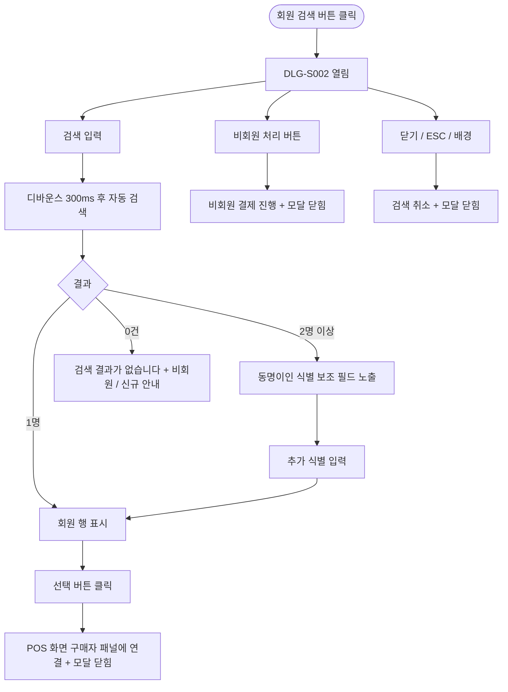

# DLG-S002 구매자 검색 다이얼로그

## 1. 다이얼로그 메타 정보

이 문서는 구매자 검색 다이얼로그에 대한 자기완결형 요구사항 정의서입니다.

| 항목 | 값 |
|---|---|
| 작성일 | 2026-05-22 |
| 버전 | v1.0 |
| 상태 | 최신 통합본 반영 (정합화 완료) |
| 도메인 | D03 매출관리 |
| 다이얼로그 ID | DLG-S002 |
| 다이얼로그명 | 구매자 검색 |
| 다이얼로그 유형 | 검색·선택 모달 |
| 호출 화면 | SCR-S002 POS판매, SCR-S003 결제처리(구매자 변경) |
| 기능코드 | SAL-EXT-05 |
| 계약코드 | SAL-EXT-05 |
| 우선순위 | P0 (출시 필수) |

## 2. 다이얼로그 개요와 목적

구매자 검색 다이얼로그는 POS 결제 진행 시 구매 회원을 빠르게 찾아 연결하는 모달입니다. 이름, 연락처(전화번호), 회원번호 중 하나로 검색하여 해당 회원을 결제 대상으로 지정합니다. 비회원으로 진행하거나 검색 결과가 없을 때 신규 회원 등록을 안내할 수도 있습니다. 카운터에서 짧은 시간 안에 정확한 회원을 식별하는 것이 핵심 운영 과제이며, 동명이인 식별과 비활성·탈퇴 회원 제외가 핵심 정책입니다.

## 3. 호출 트리거와 진입 경로

첫 번째 트리거는 SCR-S002 POS 판매 화면의 구매 회원 패널에서 "회원 검색" 버튼 클릭입니다. 두 번째 트리거는 SCR-S003 결제 처리 화면에서 구매자를 변경하려고 회원 검색 영역의 검색 버튼을 누를 때입니다. 다이얼로그를 닫으면 호출 화면으로 복귀하며, 선택된 회원이 있으면 구매자 패널에 자동 연결됩니다.

## 4. 레이아웃과 UI 구성

다이얼로그는 화면 중앙에 표시되는 중간 크기(데스크톱 약 600px 너비) 모달입니다. 모달 상단에 "구매자 검색" 제목과 [X 닫기] 아이콘이 배치됩니다.

상단 헤더 아래에는 검색 입력창이 있습니다. 이름·연락처·회원번호 중 하나로 입력 가능하며, 디바운스 300ms 후 자동 검색이 실행됩니다. 검색 입력 옆에 [검색] 버튼이 보조로 제공되어 사용자 선호에 따라 사용 가능합니다.

검색 입력 아래에는 검색 결과 목록이 펼쳐집니다. 각 행에는 회원의 이름, 연락처, 회원 등급, 마지막 방문일이 한 줄로 표시되며, 우측에 [선택] 버튼이 배치됩니다. 결과가 2명 이상이면 동명이인 식별을 위해 전화번호 끝자리 또는 생년월일을 추가로 입력할 수 있는 보조 필드가 자동으로 노출됩니다. 비활성·탈퇴 회원은 검색 결과에서 자동 제외됩니다.

FC 권한자가 검색하면 RLS에 의해 본인 담당 회원만 결과에 노출됩니다.

모달 하단에는 [비회원 처리] 버튼과 [닫기] 버튼이 배치됩니다. 비회원 처리 버튼은 회원 연결 없이 비회원으로 결제를 진행하며, 닫기 버튼은 검색을 취소하고 POS 화면으로 복귀합니다.

검색 결과가 0건이면 "검색 결과가 없습니다" 안내와 함께 "비회원으로 진행" 또는 "신규 회원 등록" 액션이 안내됩니다.

ESC 키 또는 배경 클릭으로도 닫을 수 있습니다.

## 5. 버튼·아이콘·링크 액션 전체 정의

검색 입력은 디바운스 300ms 후 자동 실행됩니다. [검색] 버튼은 즉시 검색을 수행합니다.

검색 결과 행의 [선택] 버튼은 해당 회원을 결제 대상으로 연결하고 모달을 닫습니다. 호출 화면의 구매자 패널에 회원 정보가 자동으로 채워집니다.

[비회원 처리] 버튼은 회원 연결 없이 비회원 결제를 진행하도록 하며, 모달을 닫고 POS 화면으로 복귀합니다.

검색 결과 동명이인 식별 보조 필드(전화번호 끝자리·생년월일)는 추가 입력 시 결과를 더 좁힙니다.

[닫기] 버튼은 검색을 취소하고 POS 화면으로 복귀합니다.

ESC 키 또는 배경 클릭으로도 닫을 수 있습니다.

모든 버튼은 클릭 후 응답이 돌아오기 전까지 자동으로 비활성화됩니다.

## 6. 다이얼로그 상태와 예외 처리

기본 표시 상태는 검색 입력창과 빈 결과 목록이 표시되는 상태입니다.

검색 결과 있음 상태는 1건 이상의 회원이 검색되어 목록에 표시되는 상태입니다.

검색 결과 0건 상태는 "검색 결과가 없습니다" 안내와 비회원 진행/신규 등록 안내가 표시되는 상태입니다.

동명이인 식별 상태는 결과가 2명 이상일 때 추가 식별 입력 안내와 보조 필드가 노출되는 상태입니다.

저장/처리 중 상태는 회원 선택 후 호출 화면으로 데이터를 전달하는 중으로, 주요 버튼이 비활성화됩니다.

실패 상태는 검색 API 오류 시 토스트가 표시되는 상태입니다.

예외 케이스별 처리는 다음과 같이 정의됩니다. 검색 결과 0건 시 비회원 진행 안내가 표시됩니다. 동명이인 2명 이상이면 추가 식별 정보 입력이 안내됩니다. 비활성/탈퇴 회원은 검색 결과에서 자동 제외됩니다. FC 비담당 회원은 RLS로 결과에서 제외됩니다. 포인트 사용 시 회원 선택 없이 [비회원 처리]를 시도하면 SCR-S003 단계에서 차단됩니다. 네트워크 오류 시 자동 재시도 1회 후 사용자 액션을 기다립니다.

## 7. 권한별 처리

슈퍼관리자·본사 최고관리자·Owner(지점장)·매니저는 전체 회원 검색이 가능합니다.

FC는 RLS에 의해 본인 담당 회원만 결과에 포함됩니다.

트레이너·스태프는 POS 화면 자체 접근이 차단되므로 이 모달도 호출되지 않습니다.

readonly는 다이얼로그 진입이 차단됩니다.

권한 차단 시 호출 화면에서 권한 안내, 모든 권한 차단 이벤트는 감사 로그에 기록됩니다.

## 8. 데이터 흐름과 외부 연동

회원 검색은 `GET /api/members?search=`로 호출됩니다. 응답으로는 회원 배열이 내려오며, 비활성·탈퇴 회원은 결과에서 제외됩니다. FC 권한자가 호출하면 RLS가 적용되어 본인 담당 회원만 포함됩니다.

검색 디바운스 300ms는 검색 부하 분산을 위한 정책이며, 최소 2자 이상 입력 시 시작됩니다.

회원 선택 이벤트는 부모 화면의 구매자 패널에 회원 정보를 전달하고 SCR-097 감사 로그에 비동기로 기록됩니다. 기록 필드는 `actor_id`, `member_id`, `action=select`, `timestamp`입니다.

## 9. 메인 흐름

## 10. 핵심 디자인 요청사항

다이얼로그는 카운터 단말의 짧은 시야를 고려해 가로로 넓은 다이얼로그(약 600px)로 표시되며, 검색 결과 목록은 한 행에 회원의 핵심 정보(이름·연락처·등급·마지막 방문일)가 한눈에 들어오도록 컴팩트하게 배치됩니다.

검색 입력창은 모달 상단에 큰 폰트로 배치되며, 실시간 검색 안내(예: "이름, 전화번호, 회원번호로 검색")가 placeholder로 표시됩니다.

회원 행은 호버 시 강조 색상으로 표시되고, [선택] 버튼은 우측 끝에 컴팩트하게 배치됩니다. 회원 등급은 작은 컬러 배지로 시각화됩니다.

동명이인 식별 보조 필드는 검색 결과 위에 노란색 안내 박스로 표시되어 사용자가 추가 입력의 필요성을 즉시 인지할 수 있도록 합니다.

[비회원 처리] 버튼은 좌측 하단에 보조 색상으로 배치되고, [닫기]는 우측 끝에 배치됩니다.

## 11. 운영 정책

회원 검색 디바운스 정책은 300ms이며, 검색 부하 분산을 위한 정책입니다.

회원 동명이인 식별 정책은 검색 결과가 2명 이상일 때 전화번호 끝자리 또는 생년월일을 추가로 입력받아 정확한 회원을 선택하도록 합니다.

회원 비활성/탈퇴 제외 정책은 비활성/탈퇴 회원을 검색 결과에서 자동 제외합니다. 본사 권한자만 별도 권한으로 비활성 회원을 조회할 수 있습니다.

FC RLS 정책은 FC가 회원 검색 시 본인 담당 회원만 결과에 포함됨을 보장합니다.

비회원 결제 정책은 회원 연결 없이 비회원 결제를 허용하지만, 포인트 사용은 회원 선택이 필수이며 SCR-S003 결제 등록 단계에서 차단됩니다.

감사 로그 정책은 회원 선택 이벤트를 SCR-097에 비동기로 기록합니다. 기록 필드는 `actor_id`, `member_id`, `action=select`, `timestamp`입니다.

신규 회원 등록 안내 정책은 검색 결과가 0건일 때 신규 회원 등록 화면으로의 이동을 안내합니다.

이상의 모든 정책은 이 다이얼로그를 구현하고 운영하는 사람이 별도 문서 없이 이 한 장만 보면 이해할 수 있도록 풀어 적었습니다.
