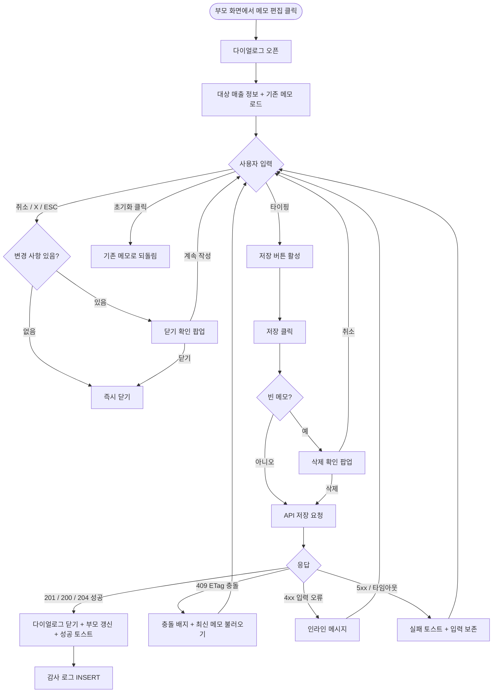

# DLG-S005 메모 편집 다이얼로그

## 1. 다이얼로그 메타 정보

이 문서는 매출 건에 관리자 메모를 작성·수정하는 메모 편집 다이얼로그(DLG-S005)에 대한 자기완결형 요구사항 정의서입니다. 외부 화면설계서나 기능명세서를 함께 보지 않더라도 이 문서 한 장만으로 호출 트리거, 입력 UI, 검증 규칙, 확인·취소 동작, 부모 화면 갱신 로직, 예외 처리, 권한, 운영 정책까지 빠짐없이 구현·운영할 수 있도록 작성합니다.

| 항목 | 값 |
|---|---|
| 작성일 | 2026-05-22 |
| 버전 | v1.0 |
| 상태 | 최신 통합본 반영 (정합화 완료) |
| 도메인 | D03 매출관리 |
| 다이얼로그 ID | DLG-S005 |
| 다이얼로그명 | 메모 편집 |
| 다이얼로그 유형 | 입력형 모달 (저장 후 닫힘) |
| 호출 트리거 | DLG-S001 매출 상세 메모 버튼, SCR-S001 매출 현황 목록 행 액션, SCR-S008 미수금 관리 행 메모 버튼, SCR-S009 할부 결제 관리 회차 메모 버튼 |
| 부모 화면 | SCR-S001 매출 현황, SCR-S008 미수금 관리, SCR-S009 할부 결제 관리, DLG-S001 매출 상세 |
| 기능코드 | PAY-03 (미수금 관리 메모 편집), SAL-EXT-01 (할부 회차 메모 편집) |
| 계약코드 | PAY-03 |
| 권한 9역할 | superAdmin / primary / owner / manager / fc / staff / trainer / front / readonly |
| 사용 가능 권한 | superAdmin, primary, owner, manager, fc, staff, front |
| 조회만 가능 | trainer, readonly |
| 연결 API | `POST /api/sales/:saleId/memos`, `PUT /api/sales/:saleId/memos/:memoId`, `GET /api/sales/:saleId/memos`, `POST /api/unpaid/:id/memos`, `POST /api/installments/:id/rounds/:round/memos` |
| 감사 로그 | SCR-097에 `memo_create`, `memo_update`, `memo_delete` 액션으로 기록 |

## 2. 다이얼로그 목적과 사용 맥락

메모 편집 다이얼로그는 특정 매출 건, 미수금 건, 할부 회차에 운영자가 자유 형식 메모를 남기고 동료 운영자에게 공유하는 작은 입력형 모달입니다. 매출 관리 도메인에서는 한 회원의 한 결제 건을 여러 명이 돌려가며 회수·환불·후속 처리하는 일이 잦습니다. 그 과정에서 "5월 15일 입금 약속 받음", "회원이 카드 분실로 잔액 결제 지연 예정", "현장 영수증은 분실, POS 단말 거래내역으로 대체 첨부함" 같은 운영 메모를 매출 건 자체에 묶어두면, 다음 담당자가 다른 문서나 메신저를 뒤지지 않고도 이전 상황을 즉시 파악할 수 있습니다.

다이얼로그가 다루는 운영 흐름은 세 가지 줄기로 나뉩니다. 첫째는 매출 상세에서 일반 매출 건에 메모를 다는 경우로, 결제 직후 특이사항(이중 영수증 발급, 회원이 현장 변심 후 다시 결제 결정 등)을 기록하는 흐름입니다. 둘째는 미수금 관리에서 회수 약속·연락 결과·연체 사유 등을 기록하는 흐름으로, PAY-03 운영 시나리오에서 가장 자주 사용됩니다. 셋째는 할부 결제 관리에서 회차 단위 메모를 다는 흐름이며, 회원과 약속한 입금 일자나 회차 분할 사유를 회차에 묶어 기록합니다.

이 다이얼로그는 단순한 텍스트 입력처럼 보이지만, 모든 메모는 작성자·작성 시각이 함께 저장되고 SCR-097 감사 로그에 append-only로 기록되기 때문에 사후 추적이 가능한 운영 기록물입니다. 따라서 잘못 작성하더라도 단순 삭제가 아닌 수정 이력이 남는 방식으로 관리됩니다.

## 3. 호출 트리거와 부모 화면 컨텍스트

이 다이얼로그는 다음 네 가지 진입점으로 호출됩니다.

첫 번째 진입점은 DLG-S001 매출 상세 다이얼로그의 메모 영역에서 "메모 편집" 버튼을 누르는 경우입니다. 이 경우 다이얼로그는 부모 매출 건의 `saleId`와 기존 메모(있다면)를 함께 받아 입력창에 미리 채운 상태로 열립니다.

두 번째 진입점은 SCR-S001 매출 현황 페이지의 매출 행 액션 메뉴에서 "메모 편집"을 선택하는 경우입니다. 이 경우 매출 상세 다이얼로그를 거치지 않고 바로 메모 편집 다이얼로그가 열리며, 저장 후에는 매출 현황 목록 행에 메모 아이콘(말풍선 모양)이 채워지는 형태로 표시됩니다.

세 번째 진입점은 SCR-S008 미수금 관리 페이지의 미수금 행 우측 액션의 "메모" 버튼입니다. 이 경우 부모는 미수금 ID(`unpaidId`)이며, 저장 후 미수금 목록의 메모 컬럼이 갱신됩니다. PAY-03 비즈니스 규칙에 따라 단일 미수금 항목당 메모 30자를 초과하면 자동 줄바꿈으로 표시되고 전체 보기 버튼이 함께 노출됩니다.

네 번째 진입점은 SCR-S009 할부 결제 관리 페이지에서 계약 행을 펼친 후 회차 상세에서 "메모" 버튼을 누르는 경우입니다. 이 경우 부모는 할부 ID와 회차 번호(`installmentId`, `round`) 조합이며, 메모는 회차 단위로 저장됩니다.

진입 시 다이얼로그가 받는 컨텍스트는 항상 다음과 같이 표준화되어 있습니다. 부모 화면 식별자, 메모 대상 객체 종류(`SALE` / `UNPAID` / `INSTALLMENT_ROUND`), 대상 ID, 기존 메모 본문(없으면 빈 문자열), 기존 메모의 마지막 수정 시각(낙관적 락 검증용 ETag), 그리고 현재 로그인한 운영자의 권한 정보입니다. 다이얼로그 자체는 이 컨텍스트를 그대로 입력값으로 사용하고, 저장 시 같은 컨텍스트로 API를 호출합니다.

## 4. 레이아웃과 UI 구성

다이얼로그는 데스크톱에서 가로 480px 가량의 중앙 정렬 모달로 표시되고, 모바일에서는 화면 하단에서 슬라이드 업되는 풀너비 시트 형태로 표시됩니다. 위에서 아래로 다음 네 영역이 순차 배치됩니다.

가장 위에는 다이얼로그 헤더가 있습니다. 좌측에 "메모 편집"이라는 제목이 표시되고 우측 끝에 X 아이콘 닫기 버튼이 있습니다. 닫기 버튼은 입력 변경이 없을 때는 즉시 닫힘으로 동작하지만, 입력 내용이 기존 메모와 달라진 상태에서는 "변경 사항이 사라집니다. 닫으시겠습니까?"라는 확인 팝업이 한 번 더 뜬 후 사용자가 "닫기"를 선택해야 닫힙니다.

헤더 바로 아래에는 대상 매출 정보 카드가 있습니다. 이 카드는 읽기 전용으로, 어떤 대상에 메모를 다는지 운영자가 헷갈리지 않도록 매출 번호(또는 미수금 번호/할부 회차 번호), 결제일, 회원명, 상품명을 한 줄로 요약 표시합니다. 미수금 대상일 경우에는 발생 유형(`계약금 잔액` / `결제링크 미결제` / `수기 분할` / `정기 할부 미납`)이 작은 배지로 함께 표시되고, 할부 회차 대상일 경우에는 "n회차 / 총 m회차"라는 회차 정보가 함께 표시됩니다.

그 아래에는 메모 입력창이 있습니다. 여러 줄 입력이 가능한 textarea로 기본 높이는 5줄 분량(약 120px)이며, 입력 내용이 길어지면 8줄까지 자동 확장된 후에는 내부 스크롤로 전환됩니다. 입력창 우측 하단에는 "현재 글자 수 / 최대 1000자" 형식의 글자 수 카운터가 작은 글씨로 표시되고, 900자를 넘기면 카운터 글자색이 주황으로, 1000자에 도달하면 빨강으로 바뀌면서 추가 입력이 차단됩니다. 입력창에는 작성자 정보를 자동으로 덧붙이지 않으며, 운영자는 메모 본문만 자유 형식으로 작성합니다. 작성자 이름과 시각은 시스템이 저장 시점에 자동으로 메타데이터로 기록합니다.

입력창 아래 좌측에는 보조 정보가 표시됩니다. 기존 메모가 있을 경우에는 "최초 작성: 홍길동 매니저, 2026-04-12 14:23"과 "마지막 수정: 이수정 매니저, 2026-05-10 09:15" 두 줄이 작은 회색 글씨로 표시되어, 누가 언제 마지막으로 메모를 만졌는지 즉시 알 수 있습니다. 신규 메모일 경우 이 영역은 "처음 작성하는 메모입니다"라는 안내 문구로 대체됩니다.

다이얼로그 가장 아래에는 액션 바가 있습니다. 좌측에 "초기화" 텍스트 링크(기존 메모 내용으로 입력을 되돌림)가 있고, 우측에는 회색 "취소" 버튼과 강조색 "저장" 버튼이 나란히 놓입니다. 저장 버튼은 입력 내용이 기존 메모와 동일한 경우 비활성 상태(클릭 불가)로 표시되어 의미 없는 저장 요청을 사전에 차단합니다. 권한이 조회만 가능한 계정(트레이너·읽기 전용)에서는 저장 버튼과 초기화 링크가 아예 화면에서 사라지고, 입력창도 읽기 전용으로 잠겨 메모를 읽을 수만 있도록 동작합니다.

## 5. 입력 검증과 저장 로직

메모 입력은 다음 검증을 순서대로 통과해야 저장됩니다.

첫째, 글자 수 검증입니다. 본문은 최소 0자(빈 메모로 기존 내용 비우기)부터 최대 1000자까지 허용됩니다. 1000자 초과 입력은 입력창 자체가 추가 글자 입력을 막아 사전에 차단합니다. 공백만 1000자 입력하는 경우도 정상 입력으로 처리되지 않으며, 저장 시 자동으로 앞뒤 공백을 trim한 후 비어 있으면 "빈 메모 저장" 흐름으로 분기됩니다. 빈 메모 저장은 기존 메모를 삭제하는 의도로 해석되어, 확인 단계에서 "기존 메모를 삭제하시겠습니까?"라는 확인 팝업이 한 번 더 표시됩니다.

둘째, 낙관적 락 검증입니다. 다이얼로그 진입 시 받은 ETag(마지막 수정 시각)와 저장 직전 서버의 최신 ETag가 다르면 409 충돌로 응답됩니다. 이 경우 모달은 닫히지 않고 "다른 운영자가 메모를 수정했어요. 최신 메모를 불러올까요?"라는 안내가 입력창 위에 노란 배지로 표시되며, "최신 메모 불러오기" 버튼을 누르면 현재 입력 내용을 임시 보관한 채 최신 메모를 다시 로드합니다. 사용자는 다시 로드된 최신 내용과 자신의 임시 내용을 비교한 뒤 어떤 내용으로 저장할지 결정합니다.

셋째, 권한 검증입니다. 클라이언트에서 권한이 부족한 경우 저장 버튼 자체가 노출되지 않지만, 직접 API 호출 우회 시도가 들어오면 백엔드는 403으로 응답하며 다이얼로그는 "권한이 없어요"라는 토스트를 띄우고 변경을 적용하지 않습니다.

저장이 통과되면 API는 메모 본문, 작성자 ID, 작성 또는 수정 시각, 부모 매출/미수금/할부 회차 ID, 클라이언트 ETag를 함께 받아 처리합니다. 신규 메모일 경우 새 메모 ID와 함께 201로 응답하고, 기존 메모 수정일 경우 200으로 응답합니다. 빈 메모 저장(삭제 의도)일 경우 204 No Content로 응답하면서 메모 행을 soft-delete 처리합니다(완전 삭제가 아닌 `deletedAt` 마킹).

## 6. 확인·취소 동작과 부모 화면 갱신

저장 버튼을 누르면 다이얼로그는 즉시 로딩 상태로 전환되어 저장 버튼과 취소 버튼이 모두 비활성화되고, 저장 버튼 라벨이 "저장 중..."으로 바뀝니다. API 응답이 돌아오면 결과에 따라 다음과 같이 동작합니다.

성공 응답(200/201/204)이 도착하면 다이얼로그가 자동으로 닫힙니다. 부모 화면이 DLG-S001 매출 상세인 경우 매출 상세의 메모 영역이 새 메모 본문으로 즉시 갱신됩니다. 부모 화면이 SCR-S001 매출 현황 목록인 경우 해당 매출 행의 메모 아이콘이 채워진 상태로 바뀝니다. 부모 화면이 SCR-S008 미수금 관리인 경우 해당 미수금 행의 메모 컬럼이 메모 미리보기(최대 30자 + "..." 말줄임)로 갱신됩니다. 부모 화면이 SCR-S009 할부 결제 관리인 경우 펼쳐진 회차 상세의 메모 영역이 갱신됩니다. 우측 상단에는 "메모를 저장했어요" 또는 "메모를 삭제했어요"(빈 메모 저장 시) 토스트가 5초간 표시됩니다.

실패 응답이 도착하면 다이얼로그는 닫히지 않고 입력 내용은 그대로 유지됩니다. 4xx 입력 오류일 경우 입력창 하단에 사유가 인라인 메시지로 표시되며, 5xx 서버 오류일 경우 우측 상단에 "메모 저장에 실패했어요. 잠시 후 다시 시도해주세요"라는 빨강 토스트가 뜨고, 자동 재시도 없이 사용자가 다시 저장 버튼을 누를 때까지 기다립니다.

취소 버튼은 두 가지로 동작합니다. 입력 내용이 기존 메모와 동일하거나 신규 작성에서 입력이 비어 있는 경우, 취소 버튼은 즉시 다이얼로그를 닫고 부모 화면에는 어떤 변경도 적용되지 않습니다. 입력 내용이 기존 메모와 달라진 상태(미저장 변경 사항이 있는 상태)에서는 "변경 사항이 사라집니다. 닫으시겠습니까?"라는 확인 팝업이 먼저 표시되며, 사용자가 "닫기"를 선택해야 다이얼로그가 닫힙니다. ESC 키 입력과 배경 클릭도 취소 버튼과 동일하게 동작합니다.

저장 또는 삭제가 완료되면 SCR-097 감사 로그에 비동기로 액션이 기록됩니다. 기록 필드는 `actor_id`(운영자 ID), `target_type`(`SALE`/`UNPAID`/`INSTALLMENT_ROUND`), `target_id`, `action`(`memo_create`/`memo_update`/`memo_delete`), `before`(이전 메모 본문 또는 null), `after`(새 메모 본문 또는 null), `timestamp`입니다. 감사 로그 INSERT는 응답이 사용자에게 돌아간 후 5초 이내 보장됩니다.

## 7. 화면 상태

다이얼로그는 다음과 같은 상태를 가지며, 각 상태마다 보이는 모습이 달라집니다.

기본 표시 상태는 다이얼로그가 갓 열린 직후의 상태로, 입력창에 기존 메모가 채워져 있거나 비어 있고, 저장 버튼은 비활성(변경 없음)입니다.

입력 중 상태는 사용자가 메모를 타이핑하기 시작한 상태로, 입력 내용이 기존과 달라지면 저장 버튼이 활성화되고 글자 수 카운터가 실시간으로 갱신됩니다.

저장 중 상태는 저장 버튼을 누른 직후의 상태로, 저장 버튼이 "저장 중..."으로 비활성화되고 입력창도 잠시 비활성화되어 추가 입력이 차단됩니다.

저장 완료 상태는 API 성공 응답을 받은 직후의 상태로, 다이얼로그가 자동으로 닫히고 부모 화면이 갱신되며 성공 토스트가 표시됩니다. 사용자에게는 이 상태가 별도 단계로 보이지 않고 곧장 부모 화면으로 복귀하는 인상이 됩니다.

저장 실패 상태는 4xx 또는 5xx 응답을 받은 상태로, 다이얼로그는 그대로 유지되고 입력 내용도 보존됩니다. 오류 사유에 따라 인라인 메시지 또는 토스트가 표시됩니다.

낙관적 락 충돌 상태는 다른 운영자가 같은 메모를 동시에 수정해 ETag가 어긋난 상태로, 입력창 위에 노란 배지로 충돌 안내가 표시되고 "최신 메모 불러오기" 버튼이 노출됩니다.

권한 부족 상태는 트레이너·읽기 전용 계정이 진입했을 때의 상태로, 입력창이 읽기 전용으로 잠기고 저장·초기화 버튼이 숨겨져 메모를 읽기만 할 수 있습니다.

빈 메모 삭제 확인 상태는 사용자가 기존 메모를 모두 지우고 저장을 시도한 직후의 상태로, "기존 메모를 삭제하시겠습니까?"라는 확인 팝업이 다이얼로그 위에 겹쳐 표시됩니다.

미저장 닫기 확인 상태는 변경 사항이 있는데 X·취소·ESC·배경 클릭으로 닫으려는 시도가 들어왔을 때의 상태로, "변경 사항이 사라집니다. 닫으시겠습니까?"라는 확인 팝업이 표시됩니다.

## 8. 예외 처리

네트워크 오류(5xx 또는 타임아웃)가 발생하면 "메모 저장에 실패했어요. 잠시 후 다시 시도해주세요"라는 빨강 토스트가 표시되며, 입력 내용은 그대로 보존됩니다. 자동 재시도는 수행하지 않고 사용자의 다시 시도 액션을 기다립니다.

낙관적 락 충돌(409)이 발생하면 모달은 닫히지 않고 안내 배지가 입력창 위에 표시됩니다. 사용자가 "최신 메모 불러오기"를 선택하면 현재 입력은 임시 보관되고 최신 메모가 로드되며, 임시 보관 내용은 입력창 하단의 작은 패널에서 클립보드로 복사할 수 있게 제공됩니다.

권한 부족(403)이 발생하면 "권한이 없어요" 토스트가 뜨고 모달은 닫힙니다. 동시에 SCR-097 감사 로그에 권한 우회 시도 이벤트가 기록됩니다.

대상 객체가 이미 삭제·이전된 경우(404)에는 "이 매출 건은 더 이상 존재하지 않습니다"라는 안내가 모달 안에 표시되고 저장 버튼이 비활성화됩니다. 사용자는 모달을 닫고 부모 화면을 새로고침해야 합니다.

글자 수 초과는 입력창 자체가 1000자 도달 시 추가 입력을 차단하지만, 만약 클립보드 붙여넣기로 1000자를 초과하는 텍스트가 입력되면 자동으로 1000자에서 잘리며 "최대 1000자까지 입력할 수 있어요"라는 안내가 입력창 하단에 표시됩니다.

회원 탈퇴·매출 삭제 후 메모 진입 시도(예: 다른 사용자가 매출을 환불 후 폐기한 상태)에서는 진입 자체가 차단되어, 부모 화면에 "이 매출은 더 이상 메모를 작성할 수 없습니다"라는 토스트가 표시되고 다이얼로그는 열리지 않습니다.

## 9. 권한별 처리

슈퍼관리자(superAdmin)와 본사 최고관리자(primary)는 모든 매출·미수금·할부 회차의 메모를 자유롭게 작성·수정·삭제할 수 있습니다. 본사 통합 모드에서도 동작이 동일하며, 통합 모드에서 다른 지점 매출의 메모를 편집해도 별도의 추가 권한 검증 없이 진행됩니다.

Owner(지점장)과 매니저(manager)는 자기 지점에 속한 매출·미수금·할부 회차의 메모를 모두 작성·수정·삭제할 수 있습니다. 다른 지점의 매출에는 진입 자체가 차단됩니다.

FC(fitness coach)는 자기가 담당하는 회원의 매출에 한해 메모 작성·수정·삭제가 가능합니다. 담당 회원 외의 매출에 대한 메모 편집 시도는 부모 화면에서 차단되어 다이얼로그가 열리지 않습니다.

스태프(staff)와 프런트(front)는 자기 지점의 매출에 대해 메모 작성·수정이 가능하지만, 삭제(빈 메모 저장)는 매니저 이상 권한자가 작성한 메모인 경우 차단됩니다. 본인이 작성한 메모는 본인이 자유롭게 삭제할 수 있습니다.

트레이너(trainer)는 본인이 담당하는 회원의 매출 메모를 읽기 전용으로만 볼 수 있습니다. 다이얼로그는 열리지만 입력창이 잠겨 있고 저장·초기화 버튼이 숨겨집니다.

읽기 전용(readonly)은 다이얼로그가 열리기는 하지만 모든 입력 영역이 잠긴 상태로 표시됩니다. 기존 메모 내용만 확인할 수 있으며 어떤 변경도 적용할 수 없습니다.

권한이 없는 계정이 직접 API를 호출하면 백엔드는 403으로 응답하고, 시도 자체가 SCR-097 감사 로그에 권한 우회 시도로 기록됩니다.

## 10. 운영 정책

메모 편집은 비형식적 운영 메시지를 매출 건에 묶어두는 도구이지만, 모든 메모는 운영 행위 기록물로 취급되어 감사 로그에 append-only로 적재됩니다. 이는 같은 매출 건이 환불·할부·미수금 흐름을 거치면서 여러 담당자에게 인수인계될 때, 누가 어떤 약속을 했는지가 분쟁 시 명확한 근거로 작동해야 하기 때문입니다.

메모는 회원에게 노출되지 않습니다. 회원앱·키오스크·결제링크 화면 어디에서도 운영자 메모가 표시되지 않으며, 메모는 오로지 운영자 간 정보 공유 용도로만 사용됩니다. 회원에게 전달할 메시지는 별도의 SMS/카카오톡 발송 흐름이나 회원앱 알림 흐름을 통해 전달해야 합니다.

메모 본문은 자유 형식이지만 개인정보·민감정보 직접 기입은 피하는 것이 권장됩니다. 회원 본인의 식별 정보는 매출 건 자체에 이미 연결되어 있으므로 메모에 다시 적을 필요가 없으며, 카드번호·계좌번호·주민등록번호 같은 민감정보는 메모에 기록하지 않습니다.

메모 보존 기간은 매출 건의 보존 기간을 따릅니다. 매출 이력은 회계·세무 신고 기간을 고려해 5년간 보관되며, 5년이 경과한 매출 건의 메모는 PII 마스킹 배치(월 1회)에서 메모 본문도 함께 익명화 처리됩니다. 단 메모의 작성자 ID와 작성 시각, 액션 종류는 감사 로그에 그대로 남습니다.

권한별 메모 삭제 정책은 자기가 쓴 메모는 누구나 삭제할 수 있지만, 상위 권한자(매니저 이상)가 작성한 메모는 동등 또는 상위 권한자만 삭제할 수 있도록 제한됩니다. 이는 상급자의 운영 지시가 적힌 메모를 하위 권한자가 임의로 지우는 사고를 방지하기 위한 정책입니다.

미수금 회수 메모의 경우 PAY-03 운영 시나리오에서 가장 빈번하게 사용되며, "5/15 입금 약속", "5/20 재통화 예정", "회원 연락 두절, 보호자 연락처 확보" 같은 후속 액션 가능한 정보를 짧고 명확하게 적도록 안내합니다. 메모 한 건당 30자 이내로 핵심만 적는 것이 권장되며, 30자를 초과하면 미수금 목록 화면에서 말줄임으로 표시됩니다.

할부 회차 메모의 경우 SAL-EXT-01 운영 시나리오에 따라 회차별 입금 약속 일자나 분할 사유를 기록하며, 회차 단위로 메모가 묶이므로 회차가 미납에서 완료로 전환되더라도 메모는 보존됩니다.

## 11. 메인 흐름 (F2)



## 12. 에러와 예외 흐름 (F8)

```mermaid
flowchart TD
    A([저장 시도]) --> B{서버 응답}
    B -->|5xx / timeout| C["메모 저장 실패" 빨강 토스트]
    C --> D[입력 내용 보존]
    D --> E[사용자 다시 시도 대기]
    B -->|401 / 403 권한 부족| F["권한이 없어요" 토스트]
    F --> G[모달 닫기 + 감사 로그 권한 우회 시도 기록]
    B -->|404 대상 없음| H["이 매출은 더 이상 존재하지 않아요" 안내]
    H --> I[저장 버튼 비활성 + 모달 닫기 유도]
    B -->|409 ETag 충돌| J[충돌 배지 + 최신 메모 불러오기 버튼]
    J --> K{사용자 선택}
    K -->|최신 불러오기| L[현재 입력 임시 보관 + 최신 로드]
    K -->|덮어쓰기 선택| M[force 옵션 저장 재시도]
    B -->|413 글자 수 초과 (붙여넣기)| N[자동 1000자 절단 + 안내]
    N --> O[입력 가능 상태 유지]
    B -->|423 잠금 (소프트 삭제된 매출)| P["메모를 작성할 수 없는 매출" 안내]
    P --> Q[모달 닫기]
    B -->|성공 + 빈 메모| R["메모를 삭제했어요" 토스트]
    R --> S[부모 화면 메모 아이콘 비움]
```

## 13. 핵심 디자인 요청사항

다이얼로그 헤더의 제목과 X 닫기 버튼은 시각적으로 가벼운 톤으로 처리되어 부모 화면의 주의를 빼앗지 않아야 합니다. 메모 편집은 부수 액션이지 주 액션이 아니기 때문입니다.

대상 매출 정보 카드는 회색 톤의 보조 정보로, 본문 영역(메모 입력창)이 시각적 주인공이 되도록 비중을 작게 둡니다. 다만 매출 번호와 회원명은 평소보다 한 단계 진한 글씨로 강조해 운영자가 잘못된 매출에 메모를 다는 사고를 막아야 합니다.

메모 입력창은 충분한 행간(line-height)으로 한국어 가독성을 보장하고, 글자 수 카운터는 입력창과 같은 시선 흐름 안에서 자연스럽게 보이도록 우측 하단에 배치합니다. 900자·1000자 임계점의 색 변화는 점진적 경고로 작동해야 하며, 갑작스러운 강한 빨강이 아닌 주황→빨강 순서로 부드럽게 전환합니다.

저장 버튼은 변경 사항이 있을 때만 강조색(브랜드 컬러)으로 표시되고, 변경이 없거나 저장 중일 때는 회색 비활성으로 표시되어 사용자가 한눈에 액션 가능 여부를 알 수 있어야 합니다.

이전 작성자 정보는 작은 회색 글씨로 표시되되, 작성자명·시각은 컬러 토큰 중 가장 약한 텍스트 색을 사용해 메인 내용과 명확히 구분되도록 합니다.

모바일에서는 풀너비 시트로 전환되며, 입력창 자체가 화면 대부분을 차지하도록 비율을 조정합니다. 키보드가 올라왔을 때 저장 버튼이 키보드에 가려지지 않도록 액션 바가 키보드 위에 sticky로 부착되어야 합니다.

확인 팝업(빈 메모 삭제·미저장 닫기 확인)은 다이얼로그 위에 작은 모달로 겹쳐 표시되며, 다이얼로그 자체가 어두워지면서 확인 팝업이 강조되어 보입니다.

## 14. 운영 정책 (이 다이얼로그에 연결된 부분)

이 다이얼로그가 작성한 메모는 PAY-03 미수금 관리의 "메모 변경 이력은 감사 로그(SCR-097)에 기록" 규칙과 SAL-EXT-01 할부 결제 관리의 "회차별 메모 기록" 규칙에 따라 모두 append-only로 적재됩니다. 메모 한 건의 생성·수정·삭제는 각각 별도 이벤트로 기록되며, before/after 값이 모두 저장되어 누가 언제 어떤 내용으로 바꿨는지가 사후에도 재구성 가능합니다.

메모는 회원에게 노출되지 않는 내부 정보입니다. PAY-06 결제링크 발송의 내부 메모 필드와 같은 정책으로, 외부 채널(SMS·카카오톡·이메일·회원앱)에는 절대로 메모 본문이 흘러가지 않습니다.

빈 메모로 저장하면 soft-delete 처리되고 메모 행 자체는 보존됩니다. 이는 운영 사고 시 "메모가 있었는지조차 없었던 일이 되는" 상황을 막기 위한 정책입니다. 완전 삭제는 5년 보관 기간이 경과한 후 PII 마스킹 배치에서만 수행됩니다.

권한별 삭제 정책은 본인이 작성한 메모는 본인이 삭제할 수 있지만, 매니저 이상 권한자가 작성한 메모는 동등·상위 권한자만 삭제할 수 있다는 규칙으로 운영됩니다. 이는 상급자의 운영 지시가 적힌 메모를 하위 권한자가 임의로 지우는 사고를 방지합니다.

미수금 메모 30자 표시 제한은 PAY-03의 "메모 30자 초과 시 자동 줄바꿈 + 전체 보기" 정책을 따릅니다. 메모 본문 자체는 1000자까지 입력 가능하지만, 목록 화면에서는 30자 미리보기 + 전체 보기 버튼으로 표시되어 화면 가독성을 유지합니다.

회원 탈퇴 후에도 매출 건이 보존되는 한 메모는 함께 보존되며, 회원 탈퇴 사유 추적이나 분쟁 대응에 활용됩니다. 단 회원 탈퇴 + 90일 경과 + 매출 5년 경과가 모두 충족되면 메모 본문이 PII 마스킹 대상이 됩니다.

이 다이얼로그는 외부 결제 시스템·국세청·PG와 직접 연동하지 않으며, 모든 동작은 CRM 내부 메타데이터 갱신과 감사 로그 적재로 완결됩니다. 따라서 네트워크 비용이 가벼우며, 빠른 응답성이 사용자 경험의 핵심 지표가 됩니다.

이상의 정책은 메모 편집 다이얼로그가 단순 입력 도구처럼 보이더라도 실제로는 매출 운영의 책임 추적성을 받치는 인프라임을 보여줍니다. 다이얼로그 구현·운영자는 별도 문서를 보지 않고도 이 한 장으로 모든 정책을 이해할 수 있어야 하며, 정책이 바뀌면 이 문서가 함께 갱신되어야 합니다.
