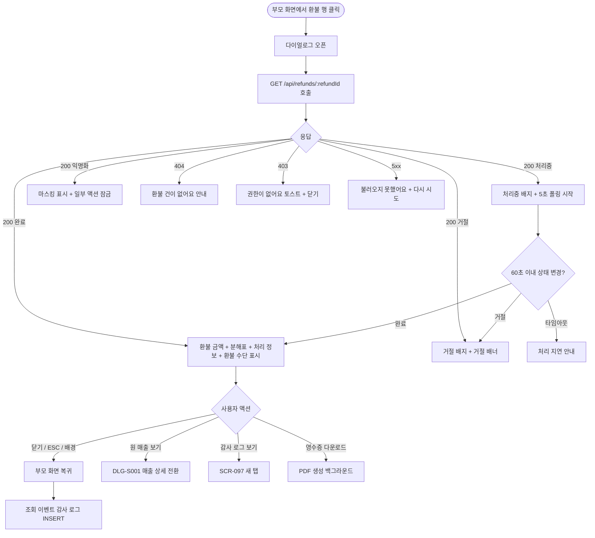
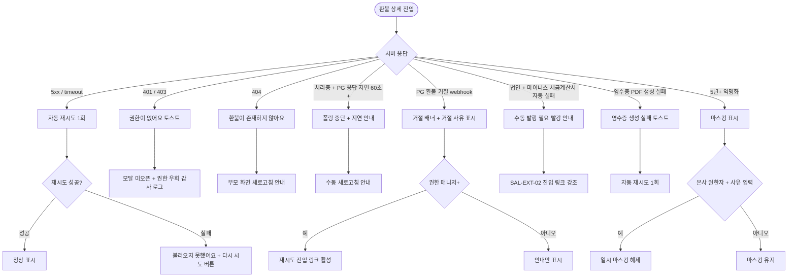

# DLG-S006 환불 상세 다이얼로그

## 1. 다이얼로그 메타 정보

이 문서는 처리 완료된 환불 건의 상세 내역을 조회하는 환불 상세 다이얼로그(DLG-S006)에 대한 자기완결형 요구사항 정의서입니다. 외부 화면설계서나 기능명세서 없이도 이 문서 한 장만으로 호출 트리거, 표시 UI, 검증·확인 흐름, 부모 화면 복귀, 권한, 예외 처리, 운영 정책까지 모두 이해해 구현·운영할 수 있도록 작성합니다.

| 항목 | 값 |
|---|---|
| 작성일 | 2026-05-22 |
| 버전 | v1.0 |
| 상태 | 최신 통합본 반영 (정합화 완료) |
| 도메인 | D03 매출관리 |
| 다이얼로그 ID | DLG-S006 |
| 다이얼로그명 | 환불 상세 |
| 다이얼로그 유형 | 조회형 모달 (변경 없음) |
| 호출 트리거 | SCR-S007 환불 관리 목록 행 클릭, SCR-M004 회원 상세의 환불 이력 클릭, DLG-S014 환불 상세 결과의 "환불 이력 보기" 진입 |
| 부모 화면 | SCR-S007 환불 관리, SCR-M004 회원 상세, DLG-S001 매출 상세 (환불 이력 영역), DLG-S014 환불 상세 결과 |
| 기능코드 | PAY-02 (환불 관리), SAL-EXT-04 (결제 취소·부분 환불) |
| 계약코드 | PAY-02 |
| 권한 9역할 | superAdmin / primary / owner / manager / fc / staff / trainer / front / readonly |
| 사용 가능 권한 | superAdmin, primary, owner, manager, fc, staff, front, trainer, readonly (조회 전용 다이얼로그) |
| 연결 API | `GET /api/refunds/:refundId`, `GET /api/refunds/:refundId/payment-rows` (혼합결제 행 단위 환불 분해표 조회) |
| 감사 로그 | SCR-097에 `refund_view` 액션으로 조회 이벤트 기록 (열람 추적) |

## 2. 다이얼로그 목적과 사용 맥락

환불 상세 다이얼로그는 이미 처리가 끝난 환불 건의 모든 상세 정보를 한 화면에서 조회하는 읽기 전용 모달입니다. PAY-02 환불 관리 화면에서 가장 자주 진입되며, 회원이 과거 환불에 대해 문의했을 때 운영자가 그 자리에서 환불 시각·금액·사유·처리자·환불 수단을 확인하고 응대하는 도구로 사용됩니다.

이 다이얼로그가 다루는 운영 흐름은 네 가지로 나뉩니다. 첫째는 회원 분쟁 대응 흐름으로, 회원이 "지난주 환불받은 금액이 다르다"고 항의했을 때 운영자가 환불 번호·환불 금액·기사용 차감금·위약금 항목을 확인하고 회원에게 설명합니다. 둘째는 회계 마감 검토 흐름으로, 회계 담당자가 환불 이력을 한 건씩 열어 매출 차감과 환불 수단(현장 카드/결제링크 카드/현금/계좌이체/포인트)이 정확한지 점검합니다. 셋째는 본사 슈퍼관리자의 환불 패턴 점검 흐름으로, 환불률이 높은 지점의 환불 건을 무작위로 열어 환불 사유와 위약금 면제 여부를 검토합니다. 넷째는 부분 환불 누적 추적 흐름으로, 같은 결제 건에 부분 환불이 누적되어 있을 때 각 환불 회차의 상세를 확인합니다.

다이얼로그는 변경 액션을 일절 가지지 않습니다. 환불 처리는 SAL-EXT-04 결제 취소·부분 환불 화면에서만 수행되며, 이 다이얼로그는 처리된 결과를 보여주기만 합니다. 단 환불 건이 결제링크 카드 환불이고 PG webhook 응답이 아직 도착하지 않은 처리 중 상태라면, 상태 배지에 "처리중" 표시와 함께 자동 폴링이 동작합니다.

## 3. 호출 트리거와 부모 화면 컨텍스트

이 다이얼로그는 다음 진입점에서 호출됩니다.

첫 번째 진입점은 SCR-S007 환불 관리 목록 페이지의 환불 행 클릭입니다. 행 어디를 누르더라도 다이얼로그가 열리며(액션 버튼 영역 제외), `refundId`가 컨텍스트로 전달됩니다.

두 번째 진입점은 SCR-M004 회원 상세 페이지의 환불 이력 탭에서 특정 환불 건을 클릭하는 경우입니다. 회원 단위로 묶인 환불 이력에서 한 건을 선택하면 이 다이얼로그가 열립니다.

세 번째 진입점은 DLG-S001 매출 상세 다이얼로그의 환불 이력 카드에서 환불 행을 누르는 경우입니다. 매출 상세를 보던 운영자가 "이 매출의 환불 내역" 부분을 확인하려고 진입합니다.

네 번째 진입점은 DLG-S014 환불 상세 결과 다이얼로그의 "환불 이력 보기" 링크입니다. 방금 처리한 환불의 결과 모달을 닫지 않고 곧장 환불 상세 다이얼로그로 전환할 수 있도록 제공됩니다.

다이얼로그가 진입 시 받는 컨텍스트는 `refundId`(필수), 부모 화면 식별자(복귀 처리용), 그리고 부모 화면에서 미리 캐시된 일부 요약 정보(있을 경우)입니다. 캐시 정보는 모달 첫 표시 깜빡임을 줄이는 용도로만 쓰이며, API 응답이 도착하면 캐시는 폐기되고 최신 응답으로 교체됩니다.

## 4. 레이아웃과 UI 구성

다이얼로그는 데스크톱에서 가로 640px의 중앙 정렬 모달로 표시되고, 모바일에서는 풀스크린 시트로 표시됩니다. 위에서 아래로 다음 영역이 순차 배치됩니다.

가장 위에는 다이얼로그 헤더가 있습니다. 좌측에 "환불 상세" 제목과 환불 번호(`R-2026-0512-00123` 형식)가 함께 표시되고, 그 옆에 환불 상태 배지(완료/처리중/거절/취소발행)가 색상으로 구분되어 노출됩니다. 우측 끝에는 X 닫기 버튼이 있습니다.

헤더 아래에는 환불 금액 요약 카드가 강조 영역으로 배치됩니다. 환불 금액 숫자가 가장 큰 글씨로 표시되고(빨강 강조 색상), 그 아래에 부분 환불 여부 배지("부분 환불" 또는 "전체 취소")가 작은 칩 형태로 붙습니다. 부분 환불일 경우 원결제 금액 대비 환불 비율(예: "원결제 1,200,000원의 25%")이 보조 설명으로 추가됩니다.

그 아래에는 환불 계산 분해표가 있습니다. SAL-EXT-04 환불 계산 박스의 결과를 그대로 보여주는 영역으로, 원결제 금액, 기사용 차감금, 위약금, 기환불 누계(이전 부분 환불 합계), 이번 환불 가능액, 최종 환불액의 6개 행이 표 형태로 나란히 표시됩니다. 각 행마다 금액이 우측 정렬되고, 위약금 행에는 면제 여부(면제 시 "면제됨" 배지 + 면제 사유)가 함께 노출됩니다. 처리 담당자가 수기 조정한 항목이 있으면 그 행에 "수기 조정" 작은 배지가 붙고, 조정 사유가 표 아래에 인용 형태로 표시됩니다.

분해표 아래에는 혼합결제 환불 분해표가 추가로 표시됩니다. 원결제가 혼합결제(카드+현금+포인트 같은 조합)였을 경우, 각 결제 수단별로 원수납액·기환불액·이번 환불 배분액·잔여 환불 가능액의 4개 컬럼이 표시되어 어느 수단에서 얼마가 환불되었는지를 명확히 보여줍니다. 단일 결제 수단이면 이 표는 한 행으로 단순화됩니다.

다음 섹션은 원 매출 정보 카드입니다. 환불 대상이 된 원 매출의 번호, 결제일, 상품명, 결제 금액, 결제 수단 요약이 작은 카드로 표시되고, 카드 우측에 "원 매출 보기" 텍스트 링크가 있어 누르면 DLG-S001 매출 상세 다이얼로그로 전환됩니다.

그 아래에는 처리 정보 카드가 있습니다. 처리 일시(분 단위까지), 처리 담당자 이름과 권한 라벨, 환불 사유 카테고리(단순 변심/결제 오류/회원 요청/서비스 불만/기타), 자유 입력 사유 본문이 표시됩니다. 사유 본문이 길면 처음 2줄까지만 보이고 "더 보기" 링크로 확장됩니다.

처리 정보 아래에는 환불 수단 카드가 있습니다. 환불이 실제로 어떤 경로로 이루어졌는지가 다음과 같이 분기 표시됩니다: 현장 카드 환불(외부 POS 환불 완료 시각·승인번호·단말 ID), 결제링크 카드 환불(PG 환불 시각·PG 응답 코드·webhook 수신 시각), 현금 환불(계좌 이체 정보·이체 시각), 계좌이체 환불(이체 계좌·이체 시각), 포인트 환불(포인트 회복 시각·잔액). 외부 처리 상태와 증빙 메모가 있으면 함께 표시됩니다.

그 아래에는 귀속 정보 카드가 있으며, 결제지점·이용지점·매출 귀속 지점·정산 지점·인센티브 귀속자가 한 줄에 표시됩니다. 본사 통합 모드가 아닐 때는 카드가 압축 표시되고, 본사 모드에서는 펼친 상태로 표시되어 본사 권한자가 지점별 차이를 즉시 알 수 있게 합니다.

마지막 섹션은 연계 액션 영역입니다. "원 매출 보기"(DLG-S001), "감사 로그 보기"(SCR-097의 이 환불 관련 이벤트 필터), 그리고 법인 회원이면 "마이너스 세금계산서 발행 상태"(SAL-EXT-02 연계) 링크가 노출됩니다. 환불 이력이 5년이 경과해 익명화된 경우에는 익명화 안내가 카드로 표시되고 연계 액션 일부가 잠금 처리됩니다.

다이얼로그 가장 아래에는 액션 바가 있습니다. 좌측에는 "환불 영수증 다운로드" 텍스트 링크(PDF 다운로드), 우측에는 "닫기" 버튼이 있습니다. 환불 상세는 변경 액션이 없으므로 저장 버튼은 존재하지 않습니다.

## 5. 데이터 로드와 상태 폴링

다이얼로그가 열리면 즉시 `GET /api/refunds/:refundId`를 호출해 환불 상세를 로드합니다. 응답이 도착할 때까지는 모든 카드 영역이 스켈레톤 UI로 표시되며, 스켈레톤 높이는 실제 데이터 영역과 거의 일치하도록 설계되어 로드 후 점프가 발생하지 않습니다.

환불 상태가 "처리중"(결제링크 카드 환불에서 PG webhook 미수신 상태)인 경우, 다이얼로그는 5초마다 자동 폴링을 수행해 상태가 "완료" 또는 "거절"로 전환되었는지 확인합니다. 폴링은 최대 60초간 진행되며, 60초 후에도 처리중이 유지되면 폴링을 중단하고 "처리가 지연되고 있어요. 잠시 후 다시 열어주세요"라는 안내가 헤더 배지 옆에 인라인으로 표시됩니다.

상태가 "거절"로 전환되면 다이얼로그 상단에 "환불이 거절되었어요" 빨강 안내 배너가 추가로 표시되며, PG 응답 코드와 거절 사유가 환불 수단 카드 안에 함께 표시됩니다. 권한이 매니저 이상이면 배너에 "SAL-EXT-04에서 재시도" 링크가 활성화되어 누르면 결제 취소 화면으로 이동합니다.

5년 경과 후 익명화된 환불 건의 경우 회원명·연락처가 마스킹된 형태("홍**", "010-****-5678")로 표시되며, 본사 권한자가 사유를 입력해 일시 마스킹 해제 요청을 보낼 수 있는 버튼이 추가로 노출됩니다.

## 6. 확인·취소 동작과 부모 화면 복귀

이 다이얼로그는 변경 액션이 없으므로 전통적 의미의 "확인" 버튼은 존재하지 않습니다. 닫기 버튼은 다이얼로그를 즉시 닫고 부모 화면으로 복귀시킵니다. 부모 화면은 다이얼로그 진입 시점의 스크롤·필터·페이지 상태를 그대로 유지하며, 별도 데이터 재요청은 수행하지 않습니다.

ESC 키와 배경 클릭도 닫기 버튼과 동일하게 동작합니다. 환불 영수증 다운로드 링크는 별도 백그라운드 작업으로 PDF 생성을 트리거하고, 생성 완료 시 알림 센터(NFR-19)에 다운로드 링크가 푸시됩니다. 다운로드는 다이얼로그를 닫더라도 백그라운드에서 계속 진행됩니다.

"원 매출 보기" 링크는 현재 다이얼로그를 닫고 DLG-S001 매출 상세 다이얼로그를 열며, 매출 상세에서 다시 닫기를 누르면 부모 화면(SCR-S007 등)으로 복귀합니다. 이는 모달 스택이 아닌 모달 교체 방식이어서 두 다이얼로그가 동시에 겹쳐 보이지 않습니다.

"감사 로그 보기" 링크는 새 탭에서 SCR-097 감사 로그 화면을 열고, 이 환불 ID로 미리 필터링된 상태로 진입시킵니다.

다이얼로그 진입과 닫기 자체는 감사 로그에 `refund_view` 액션으로 비동기 기록됩니다. 기록 필드는 `actor_id`, `refund_id`, `view_at`, `referrer_screen`(어떤 부모 화면에서 진입했는지)입니다. 이 열람 로그는 환불 데이터의 접근 추적성을 보장하기 위한 정책이며, 5년간 보관됩니다.

## 7. 화면 상태

다이얼로그는 다음 상태들을 가지며 각 상태마다 표시되는 모습이 달라집니다.

로딩 중 상태는 다이얼로그가 갓 열린 직후 API 응답을 기다리는 상태로, 모든 카드 영역이 스켈레톤으로 표시되고 닫기 버튼만 활성화됩니다.

정상 표시 상태는 환불 상태가 "완료"이고 모든 필드가 채워진 일반적인 상태로, 환불 금액 카드와 분해표·처리 정보·환불 수단·귀속 정보가 모두 정상 노출됩니다.

처리 중 상태는 결제링크 카드 환불에서 PG webhook 미수신 상태로, 상태 배지에 "처리중" 노란색이 표시되고 5초 간격 자동 폴링이 동작합니다.

거절 상태는 PG가 환불을 거절한 상태로, 헤더 배지가 빨강 "거절"로 표시되고 상단에 거절 안내 배너가 추가됩니다. 매니저 이상 권한자에게는 재시도 진입 링크가 활성화됩니다.

취소 발행 상태는 법인 회원 환불에 대한 마이너스 세금계산서 발행이 완료된 상태로, 헤더 배지에 "취소 발행" 주황 배지가 추가됩니다.

부분 환불 누적 상태는 같은 결제 건에 이전 부분 환불이 있는 경우로, 분해표의 기환불 누계 행이 0원이 아닌 값으로 강조 표시되고, 분해표 아래에 "이전 부분 환불 N건" 링크가 추가되어 누르면 이전 환불 건들의 환불 번호 리스트가 펼쳐집니다.

익명화 상태는 5년 경과 환불 건으로, 회원명·연락처가 마스킹되고 일부 액션이 잠금 처리됩니다.

권한 부족 상태는 해당 환불 건을 조회할 권한이 없는 계정이 접근한 경우(예: 자기 지점이 아닌 환불을 본사 모드 없이 보려는 시도)로, 다이얼로그가 열리지 않고 부모 화면에 "권한이 없어요" 토스트가 표시됩니다.

폴링 지연 상태는 PG 응답이 60초를 초과한 처리중 상태로, 폴링이 중단되고 "처리가 지연되고 있어요. 잠시 후 다시 열어주세요"라는 인라인 안내가 표시됩니다.

오류 상태는 5xx 또는 타임아웃으로 API 응답을 받지 못한 경우로, 다이얼로그 중앙에 "환불 정보를 불러오지 못했어요" 메시지와 "다시 시도" 버튼이 표시됩니다.

## 8. 예외 처리

네트워크 오류로 환불 정보 로드에 실패하면 다이얼로그 중앙에 큰 에러 아이콘과 "환불 정보를 불러오지 못했어요" 메시지, "다시 시도" 버튼이 표시됩니다. 자동 재시도는 1회 백그라운드에서 진행되며, 실패하면 사용자 액션을 기다립니다.

권한 부족(403) 응답이 오면 다이얼로그는 열리지 않고 부모 화면에 "권한이 없어요" 토스트가 표시됩니다. 동시에 SCR-097에 권한 우회 시도 이벤트가 기록됩니다.

환불 ID가 존재하지 않거나 이미 삭제된 경우(404)에는 "이 환불 건은 더 이상 존재하지 않아요" 메시지가 다이얼로그 중앙에 표시되고 닫기 버튼만 활성화됩니다. 부모 화면을 새로고침하도록 안내됩니다.

PG webhook 거절(환불 상태 거절)이 발생한 경우 처리 중 폴링이 자동으로 거절 상태로 전환되고, 빨강 안내 배너가 다이얼로그 상단에 추가되며 거절 사유가 환불 수단 카드 내에 표시됩니다.

법인 회원 환불인데 마이너스 세금계산서 발행이 자동 실패한 경우, 연계 액션 영역에 "마이너스 세금계산서 발행 실패 - 수동 발행 필요" 빨강 안내가 표시되고 SAL-EXT-02 진입 링크가 강조됩니다.

5년 경과 익명화 데이터에 대해 본사 권한자가 일시 마스킹 해제를 요청했지만 사유 입력이 빈 경우 "마스킹 해제 사유를 입력해주세요" 인라인 메시지가 표시됩니다.

환불 영수증 PDF 다운로드 생성이 실패하면 "영수증 생성에 실패했어요" 토스트가 표시되고, 자동 재시도가 1회 백그라운드에서 수행됩니다.

부모 화면이 환불 데이터를 캐시한 상태로 다이얼로그를 열었는데 캐시와 서버 응답이 다른 경우(드물게 5초 이상 stale 캐시), 응답값을 신뢰하고 캐시를 폐기합니다.

## 9. 권한별 처리

superAdmin와 primary는 전체 지점의 모든 환불 상세를 조회할 수 있습니다. 본사 통합 모드에서 익명화된 환불의 일시 마스킹 해제 요청도 가능합니다.

Owner(지점장)과 매니저(manager)는 자기 지점의 환불 상세를 조회할 수 있습니다. 다른 지점 환불은 다이얼로그가 열리지 않습니다. 거절된 환불의 재시도 진입 링크는 owner·manager에게 활성화됩니다.

FC(fc)는 자기가 담당하는 회원의 환불만 조회할 수 있습니다. 담당 회원 외 환불에 대한 진입은 차단됩니다.

스태프(staff)와 프런트(front)는 자기 지점의 환불을 조회만 할 수 있으며, 재시도·마이너스 세금계산서 진입 등 후속 액션 링크는 비활성화됩니다.

트레이너(trainer)는 본인이 담당하는 회원의 환불을 조회할 수 있으며, 후속 액션은 모두 비활성화됩니다.

읽기 전용(readonly)은 자기 지점의 환불을 조회만 가능하며, 환불 영수증 다운로드는 권한에 따라 활성/비활성으로 분기됩니다.

권한이 없는 계정의 직접 API 호출은 403으로 차단되고, 모든 차단 이벤트가 감사 로그에 기록됩니다.

## 10. 운영 정책

환불 상세 다이얼로그는 PAY-02·SAL-EXT-04의 환불 이력 5년 보관 정책에 따라 5년간 모든 환불 건을 조회할 수 있어야 합니다. 5년 경과 후에는 익명화 배치가 회원 식별 정보를 마스킹하지만, 환불 금액·일시·사유·환불 수단은 그대로 보존됩니다.

부분 환불 누적 추적은 SAL-EXT-04 비즈니스 규칙 "부분 환불 누적: 같은 결제 건의 부분 환불은 누적 추적, 가능액 = 원결제 - 기환불 누계 - 위약금 - 기사용"을 그대로 시각화한 것이며, 이 다이얼로그를 통해 운영자가 부분 환불 흐름을 사후에 재구성할 수 있어야 합니다.

혼합결제 환불 분해표는 PAY-01·SAL-EXT-04의 "혼합결제 행 단위 잔액 관리" 규칙을 시각화합니다. 카드/현금/계좌이체/포인트별로 원수납액과 기환불액·잔여 가능액이 별도로 추적되며, 부분 환불 분쟁 시 어느 수단에서 얼마가 환불되었는지를 명확히 보여주는 1차 증거가 됩니다.

PG webhook 거절 상태는 SAL-EXT-04 "결제링크 PG 환불 거절 시 처리" 규칙에 따라 익영업일 재시도가 권장됩니다. 다이얼로그의 재시도 진입 링크는 이 정책을 운영자가 즉시 실행할 수 있도록 도와줍니다.

법인 회원 환불에 대한 마이너스 세금계산서 발행은 SAL-EXT-02·SAL-EXT-04 연계 규칙에 따라 자동 발행이 기본이며, 자동 실패 시 운영자가 수동 발행해야 합니다. 다이얼로그에서 발행 상태를 즉시 확인할 수 있어 회계 처리 누락을 방지합니다.

귀속 정보(결제지점·이용지점·매출 귀속 지점·정산 지점·인센티브 귀속자) 표시는 PAY-02 "환불 귀속 기준 유지" 정책에 따라 원결제의 귀속을 그대로 상속해 표시합니다. 이는 환불이 발생해도 KPI·정산·인센티브 차감의 기준이 일관되게 유지되어야 한다는 요구를 충족합니다.

환불 영수증 PDF 다운로드는 회원이 환불 증빙을 요청했을 때 즉시 제공할 수 있도록 자동 생성되며, 회계·세무 신고 자료와 동일한 양식으로 발행됩니다. PDF에는 환불 번호·환불 금액·환불 수단·처리자가 모두 포함됩니다.

조회 이벤트의 감사 로그 적재(`refund_view`)는 환불 데이터의 열람 접근 추적성을 보장하기 위한 정책으로, 누가 어떤 환불을 언제 조회했는지가 사후에도 재구성 가능합니다. 이는 PII 데이터를 다루는 보안·컴플라이언스 요구사항입니다.

## 11. 메인 흐름 (F2)

## 12. 에러와 예외 흐름 (F8)

## 13. 핵심 디자인 요청사항

환불 금액 카드는 다이얼로그 안에서 가장 강한 시각적 비중을 가져야 합니다. 환불 금액은 큰 폰트와 빨강 강조 색상으로 표시하고, "환불 완료" 또는 "처리중"·"거절" 같은 상태가 한 눈에 들어와야 합니다. 이는 운영자가 회원과 통화하면서도 자료를 보지 않고 음성으로 환불 결과를 즉시 확인할 수 있게 합니다.

환불 계산 분해표는 표 형태로 깔끔하게 정렬되며, 각 행마다 항목명은 좌측, 금액은 우측으로 정렬해 운영자가 영수증을 읽듯 자연스럽게 인식할 수 있어야 합니다. 위약금 면제·수기 조정 같은 특이 사항은 작은 배지로 표시되어 즉시 식별 가능해야 합니다.

혼합결제 분해표는 보조 정보이지만 분쟁 시 핵심 근거가 되므로, 단일 결제일 때는 한 줄로 간략화하고 혼합결제일 때만 표 형태로 펼쳐 보여 정보 밀도를 조절합니다.

상태 배지(완료/처리중/거절/취소발행)는 색상과 텍스트가 함께 보여야 색맹 운영자도 인식할 수 있습니다. 완료는 녹색, 처리중은 노랑, 거절은 빨강, 취소 발행은 주황으로 일관성 있게 표시합니다.

처리 정보·환불 수단·귀속 정보의 세 카드는 동일한 카드 스타일로 통일되되, 카드 안의 항목 정렬과 라벨 폰트는 운영자의 시선이 항목명 → 값 순서로 자연스럽게 흐르도록 디자인합니다.

5년 경과 익명화된 회원 정보는 마스킹된 값임이 한 눈에 보이도록 별도의 회색 톤이나 배경색으로 표시되어, 운영자가 실제 값과 마스킹된 값을 혼동하지 않도록 합니다.

처리중 상태의 폴링은 헤더 배지 옆에 작은 회전 스피너로 표시되고, 폴링 횟수가 진행될수록 점진적으로 "처리가 지연되고 있어요" 안내가 자연스럽게 등장해 사용자가 무한 대기 인상을 받지 않도록 합니다.

모바일에서는 환불 금액 카드와 분해표가 화면 최상단에 우선 표시되고, 그 외 카드는 아래로 자연스럽게 흐르는 단일 컬럼 스크롤 형태가 됩니다.

## 14. 운영 정책 (이 다이얼로그에 연결된 부분)

이 다이얼로그는 변경 액션이 없는 조회 전용이지만, 모든 조회 이벤트가 SCR-097에 `refund_view` 액션으로 기록됩니다. 이는 PII가 포함된 환불 데이터의 열람 접근을 추적할 수 있어야 한다는 컴플라이언스 요구사항을 충족하기 위한 정책입니다.

환불 이력 5년 보관 정책은 회계·세무 신고 기간을 고려한 결과이며, 다이얼로그는 5년 동안 모든 환불 건을 조회할 수 있어야 합니다. 5년 경과 후 PII 마스킹 배치(월 1회)에서 회원 식별 정보가 익명화되지만, 환불 금액·일시·사유·수단·귀속·처리자는 그대로 보존됩니다.

본사 통합 모드에서의 환불 상세 조회는 본사 권한자만 가능하며, 일반 지점 사용자는 자기 지점 환불만 조회할 수 있습니다. 이는 환불 데이터 유출 위험을 통제하기 위한 정책입니다.

PG webhook 거절 상태에서의 재시도는 익영업일에 진행하는 것이 권장됩니다. 이는 PG사 정책에 따른 것으로, 같은 날 중복 재시도는 PG측에서 차단될 수 있습니다.

법인 회원 환불의 마이너스 세금계산서 발행은 회계 정합성의 핵심으로, 자동 발행이 실패하면 수동 발행을 반드시 수행해야 하며 다이얼로그가 그 상태를 운영자에게 명확히 안내해야 합니다.

귀속 정보 표시는 환불이 발생해도 KPI·정산·인센티브 차감의 기준이 원결제 귀속을 그대로 따른다는 정책의 시각화입니다. 이를 통해 환불이 잘못된 지점·담당자에 묶이는 오류를 사후 검증할 수 있습니다.

위약금 면제 권한은 슈퍼관리자·Owner(지점장)에게만 있으며, 면제 사유는 반드시 기록됩니다. 다이얼로그에서 면제 여부와 면제 사유가 항상 함께 표시되어, 분쟁 시 면제 근거를 확인할 수 있습니다.

수기 조정 항목(기사용 차감금·위약금·환불 가능액의 수기 조정)에 대한 조정 사유 기록은 SAL-EXT-04 "조정 권한 + 사유 기록" 정책에 따라 필수이며, 다이얼로그가 조정 여부와 사유를 항상 함께 표시하는 것은 운영 판단의 책임 추적성을 보장하기 위한 정책입니다.

이 다이얼로그가 보여주는 모든 정보는 환불 처리 시점의 스냅샷이며, 환불 처리 후 위약금 정책 세트가 갱신되더라도 이 다이얼로그가 표시하는 위약금은 처리 시점의 원정책 기준값으로 유지됩니다. 이는 PAY-02 "위약금 정책 세트 변경: 신규 환불부터 적용, 기존 환불 이력은 원정책 보존" 정책의 결과입니다.

이상의 정책은 환불 상세 다이얼로그가 단순 조회 화면이 아닌 회계·컴플라이언스·분쟁 대응의 1차 증거 화면이라는 점을 보여줍니다. 정책이 바뀌면 이 문서도 함께 갱신되어야 하며, 코드 변경과 정책 변경은 항상 짝지어 진행됩니다.
