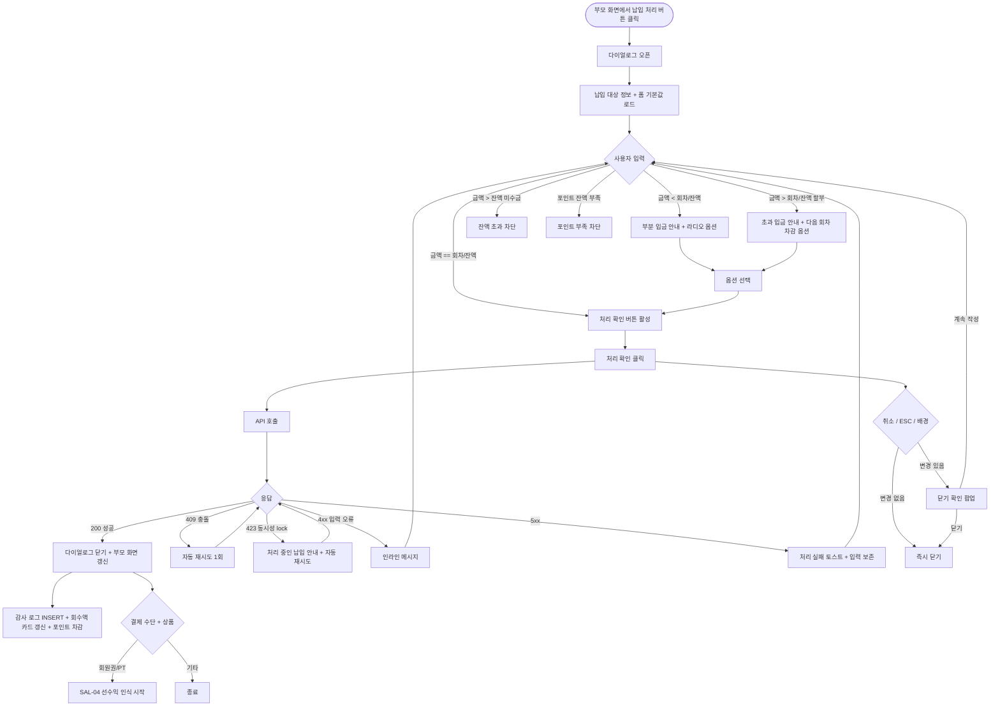
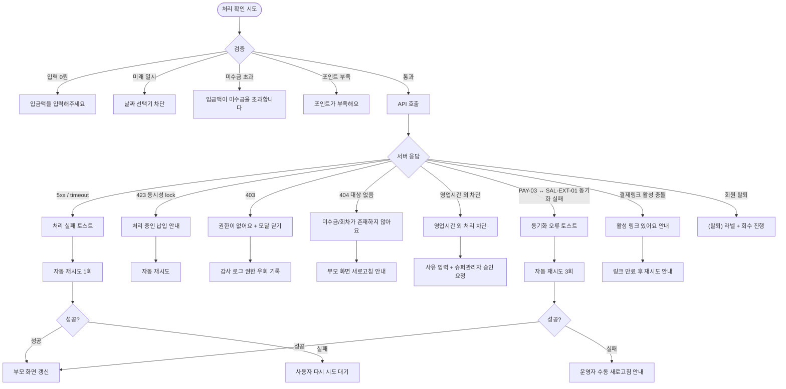

# DLG-S008 납입 처리 다이얼로그

## 1. 다이얼로그 메타 정보

이 문서는 미수금 회수 또는 할부 회차 미납 처리를 위해 실제 입금 수령을 시스템에 기록하는 납입 처리 다이얼로그(DLG-S008)에 대한 자기완결형 요구사항 정의서입니다. 외부 화면설계서나 기능명세서 없이도 이 문서 한 장만으로 호출 트리거, 입력 UI, 검증, 확인·취소 동작, 부모 화면 갱신, 권한, 예외 처리, 운영 정책까지 빠짐없이 이해해 구현·운영할 수 있도록 작성합니다.

| 항목 | 값 |
|---|---|
| 작성일 | 2026-05-22 |
| 버전 | v1.0 |
| 상태 | 최신 통합본 반영 (정합화 완료) |
| 도메인 | D03 매출관리 |
| 다이얼로그 ID | DLG-S008 |
| 다이얼로그명 | 납입 처리 |
| 다이얼로그 유형 | 입력형 모달 (저장 후 닫힘) |
| 호출 트리거 | DLG-S007 할부 상세 회차 행의 "납입 처리" 버튼, SCR-S008 미수금 관리 목록 행의 "납입 처리" 버튼, SCR-S009 할부 결제 관리 회차 펼침의 "납입 처리" 버튼 |
| 부모 화면 | DLG-S007 할부 상세, SCR-S008 미수금 관리, SCR-S009 할부 결제 관리 |
| 기능코드 | PAY-03 (미수금 관리), SAL-EXT-01 (할부 결제 관리) |
| 계약코드 | PAY-03 |
| 권한 9역할 | superAdmin / primary / owner / manager / fc / staff / trainer / front / readonly |
| 사용 가능 권한 | superAdmin, primary, owner, manager, fc (담당 회원에 한해) |
| 조회 불가 / 사용 불가 | staff, front, trainer, readonly (납입 처리는 미수금·할부 회수 권한자에 한정) |
| 연결 API | `POST /api/unpaid/:id/payment` (미수금 납입), `POST /api/installments/:id/rounds/:round/payments` (할부 회차 납입) |
| 후속 다이얼로그 | DLG-S007 할부 상세 (부모가 DLG-S007이면 복귀하며 회차 상태 갱신) |
| 감사 로그 | SCR-097에 `installment_round_paid`, `unpaid_paid` 액션 기록 (`actor_id`, `target_id`, `round`, `amount`, `method`, `paid_at`) |

## 2. 다이얼로그 목적과 사용 맥락

납입 처리 다이얼로그는 회원이 실제로 입금한 금액·시각·결제 수단을 운영자가 시스템에 기록해 미수금·할부 회차 상태를 "완료" 또는 "일부결제"로 전환하는 핵심 입력 모달입니다. PAY-03·SAL-EXT-01 운영 시나리오에서 매일 출근 직후 카운터 매니저가 가장 자주 사용하는 다이얼로그이며, 통장에서 회원 입금이 확인된 순간 운영자가 그 자리에서 입금 사실을 시스템에 반영해 미수금·할부 원장이 항상 실제와 일치하도록 유지합니다.

이 다이얼로그가 다루는 운영 흐름은 네 가지로 나뉩니다. 첫째는 할부 회차 정기 납입 흐름으로, 회원이 약속된 회차 금액을 정확히 입금했을 때 회차 상태를 "완료"로 전환합니다. 둘째는 미수금 회수 흐름으로, 계약금 잔액·결제링크 미결제·수기 분할 미수에 대해 부분 입금 또는 완납 처리합니다. 셋째는 부분 입금 흐름으로, 회원이 회차 금액보다 적게 또는 많게 입금했을 때 부분 입금 처리(미달) 또는 다음 회차 차감(초과)을 선택합니다. 넷째는 동시 납입 처리 흐름으로, 같은 회원의 미수 건에 대해 두 명의 운영자가 동시에 납입 처리를 시도할 때 row-level lock으로 직렬화됩니다.

다이얼로그는 입금 시각, 입금액, 결제 수단, 사유·메모를 받아 미수금/할부 회차 원장에 기록하며, 동시에 SCR-097 감사 로그·SCR-S001 매출 현황·SAL-04 선수익금 인식에 영향을 미칩니다.

## 3. 호출 트리거와 부모 화면 컨텍스트

이 다이얼로그는 다음 세 가지 진입점에서 호출됩니다.

첫 번째 진입점은 DLG-S007 할부 상세 다이얼로그의 회차 행 "납입 처리" 버튼입니다. 부모는 `installmentId`와 `round`(회차 번호)를 컨텍스트로 전달하며, 다이얼로그는 해당 회차의 예정 금액·예정일·회원 정보를 자동으로 로드해 입력 폼에 기본값으로 채웁니다.

두 번째 진입점은 SCR-S008 미수금 관리 목록의 미수금 행 "납입 처리" 버튼입니다. 부모는 `unpaidId`를 컨텍스트로 전달하며, 다이얼로그는 미수금 잔액·발생 유형(계약금 잔액/결제링크 미결제/수기 분할/정기 할부 미납)·회원 정보를 자동으로 로드합니다. 발생 유형이 "정기 할부 미납"인 경우 내부적으로는 할부 회차 납입과 같은 처리가 일어나며 양쪽 원장이 함께 갱신됩니다.

세 번째 진입점은 SCR-S009 할부 결제 관리 페이지에서 계약 행을 펼친 후 회차 펼침 영역의 "납입 처리" 버튼입니다. 부모는 DLG-S007과 동일한 컨텍스트(`installmentId`, `round`)를 전달합니다.

다이얼로그가 받는 공통 컨텍스트는 대상 종류(`UNPAID` / `INSTALLMENT_ROUND`), 대상 ID, 회차 번호(할부의 경우), 회원 정보, 예정 입금액(또는 미수금 잔액), 부모 화면 식별자입니다.

## 4. 레이아웃과 UI 구성

다이얼로그는 데스크톱에서 가로 520px의 중앙 정렬 모달이고, 모바일에서는 풀너비 시트로 표시됩니다. 위에서 아래로 다음 영역이 순차 배치됩니다.

가장 위에는 다이얼로그 헤더가 있습니다. 좌측에 "납입 처리" 제목, 우측 끝에 X 닫기 버튼이 있습니다. 헤더 아래에 작은 보조 라벨로 "할부 회차 납입" 또는 "미수금 납입"이 표시되어 운영자가 대상 종류를 즉시 인식할 수 있게 합니다.

헤더 아래에는 납입 대상 정보 카드가 표시됩니다. 회원명(연락처는 작은 글씨로 옆에 표시), 상품명, 그리고 대상별 추가 정보가 한 줄로 요약 표시됩니다. 할부 회차 납입의 경우 "n회차 / 총 m회차"와 예정일이, 미수금 납입의 경우 발생 유형 배지와 결제 기한이 함께 표시됩니다. 카드 하단에는 잔액 또는 회차 예정 금액이 강조 표시되어 운영자가 입력해야 할 기준 금액을 즉시 알 수 있습니다.

그 아래에는 입력 폼이 있습니다. 첫 번째 필드는 실수령 금액입니다. 기본값으로 회차 예정 금액 또는 미수금 잔액이 자동 입력되어 있으며, 운영자가 직접 수정할 수 있습니다. 입력값이 회차/잔액과 다르면 즉시 차액이 우측에 빨강(미달) 또는 녹색(초과)으로 표시됩니다. 입력 단위는 원 단위이며, 천 단위 콤마가 자동 포맷됩니다.

두 번째 필드는 수령 일시입니다. 기본값은 현재 날짜·시각이며, 운영자가 과거 일시로 수정할 수 있습니다(미래 일시는 차단). 수령 일시는 통장 입금 시각이나 현금 수령 시각을 정확히 반영하기 위함이며, 회계·세무 신고의 기준 시각이 됩니다.

세 번째 필드는 결제 수단 선택입니다. 드롭다운으로 카드(외부 POS), 현금, 계좌이체, 포인트 중 선택합니다. 결제 수단별로 추가 입력이 분기됩니다. 카드 선택 시 외부 POS 승인번호와 단말 ID 입력란이 노출됩니다(선택 입력). 현금/계좌이체 선택 시 입금자명 입력란이 노출됩니다. 포인트 선택 시 회원의 현재 포인트 잔액과 사용 후 잔액이 자동 표시되며, 잔액 부족 시 결제 수단 변경 안내가 인라인으로 표시됩니다.

네 번째 필드는 처리 사유·메모입니다. 자유 입력 textarea로 최대 500자까지 입력 가능하며, 미수금이나 회차 예정 금액과 다른 입금액으로 처리할 때는 운영자가 사유를 적도록 권장 안내가 표시됩니다. 권장이지 필수는 아니지만, 부분 입금이나 초과 입금의 경우 사유 입력이 자동으로 강조됩니다.

폼 아래에는 부분/초과 입금 안내 영역이 있습니다. 입력 금액이 회차/잔액과 정확히 일치하면 이 영역은 표시되지 않습니다. 입력 금액이 미달하면 "회차 금액에 N원 부족합니다. 부분 입금으로 처리하시겠습니까?"라는 안내와 함께 "부분 입금" / "다음 회차에 차감" 라디오 옵션이 표시됩니다. 입력 금액이 초과하면 "회차 금액보다 N원 초과합니다. 다음 회차에 자동 차감할까요?"라는 안내와 함께 "다음 회차에 차감" / "초과분 보관(별도 미수)" 라디오 옵션이 표시됩니다.

다이얼로그 가장 아래에는 액션 바가 있습니다. 우측에 회색 "취소" 버튼과 강조색 "처리 확인" 버튼이 나란히 놓입니다. 처리 확인 버튼은 모든 필수 검증을 통과해야 활성화되며, 검증이 통과되지 않은 상태에서는 회색 비활성으로 표시되고 호버 시 사유가 툴팁으로 표시됩니다.

## 5. 입력 검증 규칙

납입 처리는 다음 검증을 순서대로 통과해야 저장됩니다.

첫째, 입력 금액 검증입니다. 입력 금액은 1원 이상이어야 하며, 0원 또는 음수 입력은 차단됩니다. 미수금 잔액을 초과하는 입력은 PAY-03 "납입처리 입금액 검증: 입금액 ≤ 미수금 잔액. 초과 시 차단" 규칙에 따라 차단됩니다. 단 할부 회차 납입에서는 초과 입금이 다음 회차 차감 옵션과 함께 허용됩니다.

둘째, 수령 일시 검증입니다. 수령 일시는 현재 시각 이전이어야 합니다. 미래 일시는 입력 자체가 차단됩니다. 또한 수령 일시가 회차 예정일보다 너무 이르면(예: 예정일 30일 이전) 경고 안내가 표시되지만 처리는 가능합니다.

셋째, 결제 수단별 검증입니다. 포인트 선택 시 회원의 현재 포인트 잔액이 입력 금액 이상이어야 하며, 부족 시 처리 확인 버튼이 비활성화됩니다. 카드 선택 시 승인번호와 단말 ID는 선택 입력이지만, 입력하면 형식 검증(승인번호 숫자만, 단말 ID 영문+숫자)이 적용됩니다.

넷째, 부분 입금 옵션 검증입니다. 미달 입금에서 "부분 입금" 옵션을 선택하면 미수금은 "일부결제" 상태로 전환되고 잔액 미수금이 유지됩니다. "다음 회차에 차감" 옵션을 선택하면 미달분이 다음 회차에 추가되어 다음 회차 금액이 증가합니다(할부 회차 한정).

다섯째, 동시성 검증입니다. 같은 미수 건 또는 같은 할부 회차에 대해 다른 운영자가 동시에 납입 처리를 시도하는 경우 row-level lock으로 직렬화되며, 후행 요청은 "처리 중인 납입이 있어요. 잠시 후 다시 시도해주세요" 안내와 함께 자동 재시도됩니다.

여섯째, 권한 검증입니다. 클라이언트에서는 권한이 부족한 계정에 처리 확인 버튼이 노출되지 않지만, 직접 API 호출 우회 시도 시 백엔드가 403으로 응답하고 다이얼로그가 "권한이 없어요" 토스트를 띄우며 변경을 적용하지 않습니다.

## 6. 확인·취소 동작과 부모 화면 갱신

처리 확인 버튼을 누르면 다이얼로그는 즉시 로딩 상태로 전환되어 모든 버튼이 비활성화되고, 처리 확인 버튼 라벨이 "처리 중..."으로 바뀝니다. API 응답이 돌아오면 다음과 같이 동작합니다.

성공 응답(200/201)이 도착하면 다이얼로그가 자동으로 닫힙니다. 부모 화면별로 다음 갱신이 일어납니다. 부모가 DLG-S007 할부 상세이면 해당 회차의 상태가 "완료"(또는 부분 입금 시 "예정" 유지 + 다음 회차 차감)로 전환되고 잔여 금액·진행률·다음 납입 예정일이 즉시 재계산됩니다. 부모가 SCR-S008 미수금 관리이면 해당 미수금 행의 상태가 "완료" 또는 "일부결제"로 전환되고 미수금 총액 카드가 갱신됩니다. 부모가 SCR-S009 할부 결제 관리이면 펼친 회차 상세 상태가 갱신되고 계약 요약 카드도 함께 재계산됩니다. 우측 상단에는 "납입을 처리했어요" 토스트가 5초간 표시됩니다.

성공 처리는 동시에 다음 시스템에 영향을 미칩니다. SCR-097에 감사 로그 INSERT가 5초 이내 보장되며, 기록 필드는 `actor_id`, `target_type`(UNPAID/INSTALLMENT_ROUND), `target_id`, `round`(할부의 경우), `amount`, `method`, `paid_at`, `reason_memo`입니다. SCR-S001 매출 현황의 회수액 카드가 즉시 갱신되고, 결제 수단이 포인트인 경우 포인트 잔액이 차감됩니다. SAL-04 선수익금에 대해 회원권/PT 회수 완료 시 선수익 인식이 시작됩니다. PAY-03·SAL-EXT-01 양쪽 원장이 자동 동기화되어 미수금과 회차가 한 쌍으로 묶여 갱신됩니다.

실패 응답이 오면 다이얼로그는 닫히지 않고 입력 내용이 그대로 보존됩니다. 4xx 입력 오류일 경우 사유가 인라인 메시지로 표시되며, 5xx 서버 오류일 경우 우측 상단에 "납입 처리에 실패했어요" 빨강 토스트가 뜨고, 자동 재시도 없이 사용자의 다시 시도 액션을 기다립니다. 동시성 충돌(423)의 경우 자동 재시도가 1회 진행됩니다.

취소 버튼은 다음과 같이 동작합니다. 입력 내용이 기본값과 동일하면 즉시 다이얼로그를 닫고 부모 화면에 어떤 변경도 적용하지 않습니다. 입력 내용이 변경된 상태에서는 "변경 사항이 사라집니다. 닫으시겠습니까?"라는 확인 팝업이 한 번 더 표시됩니다. ESC 키와 배경 클릭도 취소 버튼과 동일하게 동작합니다.

## 7. 화면 상태

다이얼로그는 다음 상태들을 가지며 각 상태마다 보이는 모습이 달라집니다.

기본 표시 상태는 다이얼로그가 갓 열린 직후의 상태로, 입력 폼에 기본값(회차 금액·현재 시각·기본 결제 수단)이 자동 채워져 있고 처리 확인 버튼이 활성화됩니다.

부분 입금 안내 상태는 입력 금액이 회차/잔액에 미달한 상태로, 입력 폼 아래에 미달 안내와 부분 입금/다음 회차 차감 라디오 옵션이 표시됩니다.

초과 입금 안내 상태는 입력 금액이 회차/잔액을 초과한 상태로, 초과 안내와 다음 회차 차감/초과분 보관 라디오 옵션이 표시됩니다(할부 한정, 미수금은 초과 자체가 차단).

포인트 잔액 부족 상태는 결제 수단 포인트 선택 시 회원 잔액이 부족한 상태로, "포인트가 부족해요. 다른 결제 수단을 선택해주세요" 인라인 메시지가 표시되고 처리 확인 버튼이 비활성화됩니다.

처리 중 상태는 처리 확인 버튼을 누른 직후의 상태로, 모든 입력이 잠기고 버튼 라벨이 "처리 중..."으로 바뀝니다.

성공 완료 상태는 API 성공 응답을 받은 직후의 상태로, 다이얼로그가 자동으로 닫히고 부모 화면이 갱신되며 성공 토스트가 표시됩니다.

실패 상태는 4xx 또는 5xx 응답을 받은 상태로, 입력 내용이 보존되고 사유에 따라 인라인 메시지 또는 토스트가 표시됩니다.

동시성 충돌 상태는 다른 운영자가 같은 미수 건에 동시 납입 처리한 경우로, "처리 중인 납입이 있어요" 안내와 자동 재시도가 진행됩니다.

영업시간 외 처리 상태는 본사 정책으로 영업시간 외 납입 처리가 차단된 상태로(테넌트 정책 토글), 사유 입력과 슈퍼관리자 강제 처리 요청 흐름으로 분기됩니다.

회원 탈퇴 상태는 회원이 탈퇴 처리된 후에도 미수금 회수가 진행되는 상태로, 회원명에 "(탈퇴)" 라벨이 붙고 일부 안내가 추가됩니다.

권한 부족 상태는 권한이 없는 계정의 직접 진입 시도로, 다이얼로그가 열리지 않고 부모 화면에 토스트가 표시됩니다.

## 8. 예외 처리

네트워크 오류로 납입 처리가 실패하면 "납입 처리에 실패했어요. 잠시 후 다시 시도해주세요" 빨강 토스트가 표시되고, 입력 내용은 그대로 보존됩니다. 자동 재시도는 1회 백그라운드에서 진행됩니다.

동시성 충돌(다른 운영자가 같은 미수 건 동시 처리)이 발생하면 "처리 중인 납입이 있어요. 잠시 후 다시 시도해주세요" 안내가 표시되고 자동 재시도가 진행됩니다. row-level lock으로 직렬화되어 이중 차감이 방지됩니다.

입금액이 미수금 잔액 초과(미수금 한정)는 "입금액이 미수금을 초과합니다" 인라인 에러로 처리 확인 버튼이 비활성화됩니다. 정정 안내가 함께 표시됩니다.

입금액 0원 시도는 "입금액을 입력해주세요" 인라인 에러로 차단됩니다.

포인트 잔액 부족은 "포인트가 부족해요. 다른 결제 수단을 선택해주세요" 인라인 메시지로 처리 확인 버튼이 비활성화됩니다.

미래 일시 입력은 입력 자체가 차단되며, 날짜·시각 선택기가 현재 시각까지만 허용됩니다.

회원 탈퇴 후 미수금 회수는 가능하지만, 회원 카드 진입 링크가 비활성화됩니다. 다이얼로그 안의 회원명 옆에 "(탈퇴)" 라벨이 붙습니다.

결제링크 미결제 미수금에 대한 납입 처리 시도(현장 입금 형태)는 PAY-03 흐름에 따라 가능하지만, 같은 결제링크가 활성 상태로 살아있으면 충돌을 막기 위해 운영자에게 "활성 링크가 있어요. 링크 만료 후 처리할까요?" 안내가 표시됩니다.

영업시간 외 처리 시도는 테넌트 정책 토글에 따라 차단될 수 있으며, 차단 시 사유 입력과 슈퍼관리자 강제 처리 승인 요청 흐름으로 분기됩니다.

PAY-03·SAL-EXT-01 양방향 동기화 실패가 발생하면 운영자에게 "동기화 오류" 토스트가 표시되고 자동 재시도가 3회 진행됩니다. 3회 실패 시 운영자가 수동 새로고침을 시도할 수 있습니다.

권한 부족(403)은 모달 닫기와 함께 부모 화면에 "권한이 없어요" 토스트를 띄우고 감사 로그에 권한 우회 시도가 기록됩니다.

## 9. 권한별 처리

superAdmin와 primary는 전체 지점의 모든 미수금·할부 회차에 대해 납입 처리를 수행할 수 있습니다. 본사 통합 모드에서도 동작이 동일합니다.

Owner(지점장)과 매니저(manager)는 자기 지점의 미수금·할부 회차에 대해 납입 처리를 수행할 수 있습니다. PAY-03 권한 규칙에 따라 결제 기한 연장도 owner 권한자가 수행 가능합니다.

FC(fc)는 자기가 담당하는 회원의 미수금·할부 회차에 대해 납입 처리를 수행할 수 있습니다. 담당 회원 외 미수·회차에 대한 진입은 부모 화면에서 차단됩니다.

스태프(staff), 프런트(front), 트레이너(trainer), 읽기 전용(readonly)은 납입 처리 자체가 권한 없음으로 차단됩니다. 다이얼로그가 열리지 않으며, 부모 화면의 납입 처리 버튼이 노출되지 않습니다.

권한 우회 시도(직접 API 호출)는 403으로 차단되고 감사 로그에 기록됩니다.

영업시간 외 강제 처리 승인은 슈퍼관리자에게만 권한이 있으며, 일반 운영자는 사유 입력 후 승인 요청만 보낼 수 있습니다.

## 10. 운영 정책

납입 처리는 PAY-03 "납입처리 입금액 검증: 입금액 ≤ 미수금 잔액. 초과 시 차단" 규칙과 "납입처리 동시성 락: 동일 미수 건에 대한 동시 납입처리는 row-level lock으로 직렬화" 규칙을 그대로 따릅니다. 이는 이중 차감과 과다 차감을 막기 위한 핵심 정책입니다.

부분 입금 시 "일부결제" 자동 전환은 PAY-03 "부분 입금 시 상태: 미수금 일부 입금 시 일부결제 자동 전환, 잔액 미수금 유지" 규칙에 따릅니다. 일부결제 상태에서 다음 회차에 차감 옵션을 선택하면 미수금이 0원 처리되고 부족분이 다음 회차에 더해집니다.

할부 회차 초과 입금의 "다음 회차 차감" 옵션은 SAL-EXT-01 "초과 입금 옵션: 입금액 > 회차 금액 시 다음 회차에 자동 차감 옵션" 정책의 시각화입니다. 운영자가 다음 회차 차감 또는 초과분 별도 보관을 선택할 수 있습니다.

납입 처리 완료 시 감사 로그 적재는 PAY-03·SAL-EXT-01의 감사 로그 정책에 따라 비동기로 5초 이내 보장됩니다. 기록 필드는 actor_id, target_id, round(할부), amount, method, paid_at, reason_memo입니다.

SCR-S001 매출 현황의 회수액 카드는 PAY-03 "회수액 카드 갱신: 이번 달 회수액은 매일 04:00 집계, 실시간 회수 시 즉시 추가" 정책에 따라 납입 처리 즉시 갱신됩니다.

PAY-03·SAL-EXT-01 양방향 동기화는 SAL-EXT-01 "PAY-03 동기화: 미납 회차는 PAY-03에 자동 INSERT, 회수 시 양쪽 자동 갱신" 정책에 따라 동작합니다. 다이얼로그에서 한 번 처리하면 두 원장이 자동으로 동기화됩니다.

회원 탈퇴 후 미수금 회수는 PAY-03 "회원 탈퇴 후 미수: 탈퇴 회원도 미수금은 유지, 회원 카드 진입 차단" 정책에 따라 가능합니다. 다이얼로그는 탈퇴 회원이라도 납입 처리를 진행할 수 있도록 동작합니다.

영업시간 외 처리 차단은 본사 정책 토글이며, 정책이 활성화된 테넌트에서는 영업시간 외 납입 처리가 사유 입력과 슈퍼관리자 강제 처리 승인 흐름으로 분기됩니다.

수령 일시 입력은 통장 입금 시각이나 현금 수령 시각을 정확히 반영하기 위한 필드로, 회계·세무 신고 시 인식 시각의 근거가 됩니다. 미래 시각 입력은 차단되어 사후 조작 위험이 방지됩니다.

결제 수단별 추가 입력(외부 POS 승인번호·단말 ID·입금자명)은 선택 입력이지만, 입력하면 회계·감사 추적성을 위해 그대로 보존됩니다. PAY-01 "카드 승인정보 저장"·"계좌이체 증빙 저장" 정책의 연장선입니다.

권한별 가능 범위는 PAY-03 권한 매트릭스에 따라 superAdmin·primary·owner·manager·fc까지만 납입 처리가 가능하며, 그 외 권한은 모두 차단됩니다.

## 11. 메인 흐름 (F2)

## 12. 에러와 예외 흐름 (F8)

## 13. 핵심 디자인 요청사항

납입 대상 정보 카드는 한눈에 누구의 어떤 회차/미수에 입금을 처리하는지 명확히 보여야 합니다. 회원명은 다이얼로그 안에서 가장 큰 글씨로 표시하고, 회차 번호나 발생 유형은 작은 배지로 보조 표시합니다. 운영자가 잘못된 대상에 처리하는 사고를 막기 위한 시각적 안전 장치입니다.

실수령 금액 입력란은 폼의 중심이 되어야 하며, 폰트가 크고 천 단위 콤마가 자동 포맷되어 운영자가 즉시 금액의 자릿수를 읽을 수 있어야 합니다. 입력값이 회차/잔액과 다르면 차액이 우측에 빨강(미달) 또는 녹색(초과)으로 즉시 표시되어 운영자가 의도하지 않은 차이를 즉각 인지할 수 있게 합니다.

부분 입금 안내 영역은 입력 금액이 회차/잔액과 달라진 순간에만 부드럽게 아래로 펼쳐지는 애니메이션으로 표시되어, 정상 입력 시에는 폼이 콤팩트하게 유지되도록 합니다.

결제 수단 드롭다운은 선택에 따라 추가 입력란이 자연스럽게 슬라이드 다운되도록 처리되며, 포인트 선택 시 잔액 정보가 강조 표시되어 운영자가 잔액 부족 여부를 사전에 확인할 수 있습니다.

처리 확인 버튼은 검증 통과 시에만 강조색으로 활성화되며, 검증 미통과 시에는 회색 비활성으로 표시되고 호버 시 사유가 툴팁으로 표시되어 운영자가 무엇이 막혀 있는지 즉시 파악할 수 있게 합니다.

처리 중 상태에서는 처리 확인 버튼에 작은 스피너가 함께 표시되고, 모든 입력란이 잠기는 시각적 변화로 사용자가 처리 진행을 즉시 인식하도록 합니다.

모바일에서는 풀너비 시트로 전환되며 입력 폼이 화면 대부분을 차지합니다. 처리 확인 버튼은 키보드 위에 sticky로 부착되어 키보드가 올라온 상태에서도 항상 클릭 가능해야 합니다.

성공 토스트는 우측 상단에 5초 동안 표시되며, "n회차 납입을 처리했어요" 또는 "n원을 회수했어요" 같이 구체적인 결과 문구로 운영자에게 처리 사실을 명확히 알립니다.

## 14. 운영 정책 (이 다이얼로그에 연결된 부분)

이 다이얼로그는 PAY-03·SAL-EXT-01의 핵심 운영 도구이며, 모든 납입 처리가 감사 로그에 5초 이내 적재되어 사후 추적이 가능합니다.

입금액 검증(미수금 한정 초과 차단, 0원 차단)은 회계 정합성을 위한 핵심 정책이며, 미수금 잔액을 절대로 초과할 수 없도록 백엔드에서 한 번 더 검증됩니다. 할부 회차는 다음 회차 차감 옵션과 함께 초과 입금이 허용되지만, 미수금은 잔액 한도 내에서만 처리됩니다.

부분 입금의 "일부결제" 자동 전환과 잔액 미수금 유지 정책은 회원이 분할 납부하는 현실을 반영하기 위한 정책이며, 운영자가 잔액 미수를 별도로 추적할 수 있도록 원장이 자동으로 분리됩니다.

동시성 락(row-level lock)은 같은 미수 건에 두 명 이상의 운영자가 동시에 납입 처리하는 경우 이중 차감을 막기 위한 정책으로, 후행 요청은 자동 재시도되거나 충돌 안내로 분기됩니다.

PAY-03·SAL-EXT-01 양방향 동기화는 미납 회차와 미수금이 한 쌍으로 묶여 관리되어야 한다는 운영 정합성 요구의 결과입니다. 다이얼로그에서 한 번 처리하면 두 원장이 동기화되어 어느 화면에서 봐도 같은 상태가 표시됩니다.

수령 일시 정확 입력은 회계·세무 신고의 인식 시각 기준이 되며, 미래 시각 입력 차단은 사후 조작 위험을 방지하기 위한 정책입니다.

결제 수단별 추가 입력(외부 POS 승인번호·단말 ID·입금자명)은 PAY-01의 카드 승인정보·계좌이체 증빙 저장 정책의 연장선이며, 회계·감사 추적성을 위해 선택 입력이라도 입력값이 그대로 보존됩니다.

영업시간 외 처리 차단은 본사 정책 토글이며, 차단된 경우 사유 입력 후 슈퍼관리자 강제 처리 승인 흐름으로 진행됩니다. 이는 비영업 시간대의 비정상 운영을 모니터링하기 위한 정책입니다.

회원 탈퇴 후 미수금 회수가 가능하다는 정책은 탈퇴 회원이라도 미수금이 보존되어 회수 추진이 계속될 수 있어야 한다는 회계 요구의 결과입니다.

권한별 사용 범위는 PAY-03·SAL-EXT-01 권한 매트릭스에 따라 운영 책임이 있는 권한자(superAdmin·primary·owner·manager·fc)에게만 부여되며, 매출 조회만 가능한 권한(staff·front·trainer·readonly)은 모두 차단됩니다.

이상의 정책은 납입 처리 다이얼로그가 회수 운영의 1차 입력 도구이자 회계 정합성의 핵심임을 보여줍니다. 정책이 바뀌면 이 문서도 함께 갱신되어야 하며, 코드 변경과 정책 변경은 항상 짝지어 진행됩니다.
