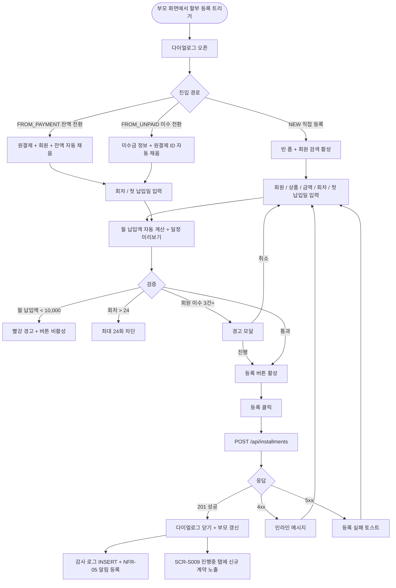

# DLG-S009 할부 등록 다이얼로그

## 1. 다이얼로그 메타 정보

이 문서는 회원과의 정기 분납 계획(`collectionMode=INSTALLMENT_PLAN`)을 새로 생성하는 할부 등록 다이얼로그(DLG-S009)에 대한 자기완결형 요구사항 정의서입니다. 다른 문서를 보지 않고도 이 문서 한 장만으로 호출 트리거, 입력 폼, 검증 규칙, 자동 일정 산출, 확인·취소 동작, 부모 화면 갱신, 권한, 예외 처리, 운영 정책까지 모두 이해해 구현·운영할 수 있도록 작성합니다.

| 항목 | 값 |
|---|---|
| 작성일 | 2026-05-22 |
| 버전 | v1.0 |
| 상태 | 최신 통합본 반영 (정합화 완료) |
| 도메인 | D03 매출관리 |
| 다이얼로그 ID | DLG-S009 |
| 다이얼로그명 | 할부 등록 |
| 다이얼로그 유형 | 입력형 모달 (저장 후 닫힘) |
| 호출 트리거 | SCR-S009 할부 결제 관리 페이지의 "+ 할부 등록" 버튼, SCR-S002 POS 판매에서 결제 처리 후 잔액을 정기 분납 계획으로 전환할 때, SCR-S003 결제 처리 화면의 잔액 처리 라우팅 |
| 부모 화면 | SCR-S009 할부 결제 관리, SCR-S002 POS 판매, SCR-S003 결제 처리 |
| 기능코드 | SAL-EXT-01 (할부 결제 관리) |
| 계약코드 | SAL-EXT-01 |
| 권한 9역할 | superAdmin / primary / owner / manager / fc / staff / trainer / front / readonly |
| 사용 가능 권한 | superAdmin, primary, owner, manager |
| 사용 불가 | fc, staff, front, trainer, readonly (SAL-EXT-01 정책: FC는 등록 불가, 매니저+ 만 등록) |
| 연결 API | `POST /api/installments` (할부 계약 생성), `POST /api/installments/preview` (월 납입액·일정 미리보기 계산) |
| 후속 화면 | SCR-S009 할부 결제 관리 (등록 직후 진행중 탭에 신규 계약 노출) |
| 감사 로그 | SCR-097에 `installment_create` 액션 기록 (`actor_id`, `installment_id`, `member_id`, `total_amount`, `rounds`, `start_date`) |

## 2. 다이얼로그 목적과 사용 맥락

할부 등록 다이얼로그는 새로운 정기 분납 계약을 시스템에 등록하는 입력형 모달입니다. SAL-EXT-01 운영 시나리오에 따르면 한 명의 매니저 또는 슈퍼관리자가 회원과 합의한 분할 납부 계획을 시스템에 입력하면, 이 다이얼로그가 자동으로 회차별 일정을 산출해 계약을 생성하고 SCR-S009 할부 결제 관리에 즉시 반영합니다.

이 다이얼로그가 다루는 운영 흐름은 세 가지로 명확히 분리됩니다. 첫째는 잔액 처리 라우팅 흐름으로, PAY-01 결제 처리 화면에서 계약금만 받고 잔액을 정기 분납 계획으로 전환할 때 호출됩니다. 이 경우 원결제 ID와 잔액 금액이 컨텍스트로 전달되어 다이얼로그에 자동 채워집니다. 둘째는 직접 등록 흐름으로, SCR-S009 할부 결제 관리에서 운영자가 회원을 검색해 새 할부 계약을 처음부터 입력하는 경우입니다. 셋째는 기존 미수금 전환 흐름으로, 단기 미수금을 정기 분납 계획으로 전환할 때 원결제 ID 연결과 함께 등록합니다.

이 다이얼로그는 SAL-EXT-01 "본 화면 범위: 잔액 기준 정기 분납 계획"이라는 명확한 범위를 가지며, 동일일자 복합결제, 현장 계약금 수납, 결제링크 발송은 다이얼로그 범위가 아닙니다. 계약금 수납 자체는 SCR-S003 결제 처리에서 먼저 확정되어야 하고, 이 다이얼로그는 확정된 잔액에 대한 정기 분납 계획만 등록합니다.

## 3. 호출 트리거와 부모 화면 컨텍스트

이 다이얼로그는 다음 세 가지 진입점에서 호출됩니다.

첫 번째 진입점은 SCR-S009 할부 결제 관리 페이지의 "+ 할부 등록" 버튼입니다. 부모는 빈 컨텍스트를 전달하며, 다이얼로그는 회원 검색부터 모든 필드를 처음부터 입력해야 합니다. 단 부모 화면에서 회원이 미리 선택된 상태였다면(예: 회원 카드에서 진입) 회원 정보가 미리 채워진 상태로 시작됩니다.

두 번째 진입점은 SCR-S002 POS 판매 화면 또는 SCR-S003 결제 처리 화면에서 잔액 처리 방식으로 "정기 할부(SAL-EXT-01)"를 선택했을 때입니다. 부모는 원결제 ID, 잔액 금액, 회원 정보, 상품 정보를 컨텍스트로 전달하며, 다이얼로그는 이 정보를 읽기 전용으로 표시하고 회차 수·첫 납입일만 입력받습니다.

세 번째 진입점은 PAY-03 미수금 관리에서 기존 단기 미수금을 정기 분납 계획으로 전환할 때입니다. 부모는 미수금 ID와 원결제 ID, 잔액을 컨텍스트로 전달하며, 다이얼로그는 미수금을 할부 계약으로 변환하는 흐름으로 동작합니다.

진입 시 다이얼로그가 받는 컨텍스트는 진입 경로(`NEW` / `FROM_PAYMENT` / `FROM_UNPAID`), 원결제 ID(있을 경우), 회원 ID(있을 경우), 상품 ID(있을 경우), 잔액 금액(있을 경우), 부모 화면 식별자입니다. 진입 경로에 따라 다이얼로그의 입력 가능 필드와 검증 규칙이 약간씩 분기됩니다.

## 4. 레이아웃과 UI 구성

다이얼로그는 데스크톱에서 가로 560px의 중앙 정렬 모달이고, 모바일에서는 풀너비 시트로 표시됩니다. 위에서 아래로 다음 영역이 순차 배치됩니다.

가장 위에는 다이얼로그 헤더가 있습니다. 좌측에 "할부 등록" 제목, 우측 끝에 X 닫기 버튼이 있습니다. 헤더 아래에 작은 보조 라벨로 진입 경로 안내가 표시됩니다(예: "결제 잔액을 정기 분납으로 전환" / "신규 할부 계약 등록" / "미수금 → 정기 분납 전환").

헤더 아래에는 회원 정보 카드가 있습니다. 회원이 컨텍스트로 전달된 경우 회원명·연락처·회원 상태가 읽기 전용으로 표시됩니다. 신규 등록 경로에서 회원이 미선택된 경우 회원 검색 입력란(이름 또는 연락처)이 표시되어, 입력 시 디바운스 300ms로 검색 결과가 드롭다운으로 노출됩니다. 회원 선택 후에는 카드가 채워지고 검색 입력란이 사라집니다. 회원 우측에는 "회원 변경" 텍스트 링크가 있어 신규 등록 경로에서는 다시 검색할 수 있고, 잔액 전환 경로에서는 비활성화됩니다.

회원 카드 아래에는 상품 정보 카드가 있습니다. 상품이 컨텍스트로 전달된 경우 상품명·정가가 읽기 전용으로 표시됩니다. 신규 등록에서는 상품 검색 또는 자유 입력으로 상품명을 입력합니다.

상품 카드 아래에는 할부 금액 입력 영역이 있습니다. 잔액 전환 경로에서는 총 할부 금액이 컨텍스트의 잔액 값으로 자동 채워지고 읽기 전용으로 표시됩니다. SAL-EXT-01 "총 할부 금액은 원결제 총액이 아니라 선납금과 할인 반영 후 남은 잔액 기준" 규칙에 따라, 표시 라벨이 "총 할부 금액(잔액)"으로 명확히 표시됩니다. 신규 등록에서는 운영자가 직접 입력하며, 천 단위 콤마가 자동 포맷됩니다.

그 아래에는 할부 기간 선택이 있습니다. 라디오 또는 드롭다운으로 3개월·6개월·9개월·12개월·24개월 중 선택하거나 운영자가 직접 회차 수를 입력할 수 있습니다. SAL-EXT-01 "할부 회차 한도: 최대 24회" 정책에 따라 24회를 초과하는 입력은 차단됩니다.

할부 기간 아래에는 월 납입액 표시 영역이 있습니다. 총 할부 금액 ÷ 회차로 자동 계산된 값이 큰 폰트로 표시되며, 마지막 회차의 끝수 보정 안내가 함께 표시됩니다(예: "1~11회차: 33,333원, 12회차: 33,337원"). SAL-EXT-01 "회차 금액 최소: 회차당 분납액 최소 10,000원" 정책에 따라, 계산된 월 납입액이 10,000원 미만이면 빨강 경고와 함께 회차 수 조정 안내가 표시됩니다.

그 아래에는 첫 납입일 선택이 있습니다. 기본값은 등록일 + 30일(약 한 달 후)이며, 운영자가 날짜 피커로 직접 선택할 수 있습니다. SAL-EXT-01 "계약 시작일: 시작일은 등록일 이후만 허용, 과거 시작일은 본사 권한자만 가능" 정책에 따라, 일반 운영자는 오늘 이후 날짜만 선택 가능하고 본사 권한자는 과거 일자도 허용됩니다.

다음은 납입 일정 미리보기 영역입니다. 회차 수·첫 납입일·월 납입액이 모두 정상 입력되면 자동으로 회차별 일정이 표시됩니다. 각 회차는 한 줄로 표시되며, 회차 번호·예정일·납입 금액의 3개 컬럼으로 정렬됩니다. SAL-EXT-01 "회차 일정 산출: 시작일 기준 매월 동일 일자, 말일 보정(1/31 → 2/28)" 정책에 따라, 첫 납입일이 31일이면 2월에 28일로 자동 보정되고 그 보정 안내가 작은 회색 텍스트로 표시됩니다.

미리보기 아래에는 메모 입력란(선택)이 있습니다. 자유 형식 textarea로 최대 500자까지 입력 가능하며, "정기 분납 합의 메모"라는 라벨로 운영자가 계약 배경을 기록할 수 있도록 안내됩니다.

다이얼로그 가장 아래에는 액션 바가 있습니다. 우측에 회색 "취소" 버튼과 강조색 "등록" 버튼이 나란히 놓입니다. 등록 버튼은 모든 필수 입력이 완료되고 검증을 통과해야 활성화됩니다.

## 5. 입력 검증과 자동 일정 산출

할부 등록은 다음 검증을 순서대로 통과해야 저장됩니다.

첫째, 회원 정보 검증입니다. 회원이 선택되어 있어야 하며, 회원 상태가 활성 또는 홀딩이어야 합니다. 탈퇴·삭제 회원은 신규 할부 계약 등록 대상이 아니므로 선택 자체가 차단됩니다. SAL-EXT-01 "회원 신용 경고: 회원 미수 이력 3건 이상 시 등록 시 경고" 규칙에 따라, 선택된 회원에 미수 이력이 3건 이상 있으면 등록 시도 직전에 경고 모달이 표시됩니다. 강제 차단은 아니며 운영자가 진행/취소를 선택합니다.

둘째, 상품 정보 검증입니다. 상품이 선택되거나 입력되어 있어야 합니다. 잔액 전환 경로에서는 원결제 상품이 자동 연결되므로 별도 검증이 없습니다.

셋째, 할부 금액 검증입니다. 1원 이상이어야 하며, 잔액 전환 경로에서는 컨텍스트 잔액과 정확히 일치해야 합니다(읽기 전용). 신규 등록에서는 운영자가 입력하며, 음수나 0원 입력은 차단됩니다.

넷째, 회차 수 검증입니다. 1회 이상 24회 이하여야 합니다. 24회 초과는 SAL-EXT-01 "할부 회차 한도: 최대 24회" 정책에 따라 차단됩니다.

다섯째, 월 납입액 검증입니다. 자동 계산된 월 납입액이 10,000원 이상이어야 합니다. SAL-EXT-01 "회차 금액 최소: 회차당 분납액 최소 10,000원" 정책에 따라 미만인 경우 회차 수를 줄이거나 총액을 늘리도록 안내됩니다.

여섯째, 첫 납입일 검증입니다. 일반 운영자는 등록일 이후만 허용되고, 본사 권한자는 과거 일자도 허용됩니다. 첫 납입일이 너무 가까우면(등록일 + 7일 이내) 경고가 표시되지만 차단되지는 않습니다.

자동 일정 산출은 다음 로직을 따릅니다. 시작일을 기준으로 매월 동일 일자에 회차 예정일이 생성됩니다. 시작일이 31일인데 2월처럼 31일이 없는 달에는 그 달의 말일로 보정됩니다(2/28 또는 2/29). 시작일이 29·30일인 경우도 비슷하게 보정됩니다. 회차당 분납액은 총 할부 금액 ÷ 총 회차로 계산되되, 마지막 회차에 끝수 보정이 적용됩니다(예: 100,000 / 3 → 33,333 / 33,333 / 33,334).

일곱째, 권한 검증입니다. FC·스태프·프런트·트레이너·읽기 전용은 다이얼로그가 열리지 않으며, 직접 API 호출 시도는 403으로 차단됩니다.

## 6. 확인·취소 동작과 부모 화면 갱신

등록 버튼을 누르면 다이얼로그는 즉시 로딩 상태로 전환되어 모든 버튼이 비활성화되고, 등록 버튼 라벨이 "등록 중..."으로 바뀝니다.

성공 응답(201)이 도착하면 다이얼로그가 자동으로 닫힙니다. 부모 화면별로 다음 갱신이 일어납니다. 부모가 SCR-S009 할부 결제 관리이면 진행중 탭이 자동 선택되고 신규 등록된 계약이 목록 최상단에 노출되며, 요약 카드의 "진행 중인 할부 계약 수"가 1 증가합니다. 부모가 SCR-S003 결제 처리이면 결제 처리 흐름이 계속 진행되어 계약금 수납 완료 처리가 이어지고, 잔액이 정기 분납 계획으로 설정되었음이 결제 요약에 반영됩니다. 부모가 PAY-03 미수금 관리이면 원래 미수금 행이 "할부 전환" 상태로 표시되고, 새로 생성된 할부 계약 ID로 연결됩니다.

성공 처리는 동시에 다음 시스템 영향을 미칩니다. SCR-097 감사 로그에 `installment_create` 액션이 적재됩니다. NFR-05 만료 알림 배치가 첫 납입일 D-3에 회원·운영자 알림을 발송하도록 등록됩니다. PAY-03 미수금 관리에는 회차별 미납 예정 행이 자동 생성되지 않고, 회차가 실제로 미납될 때마다 자동 INSERT됩니다.

실패 응답이 오면 다이얼로그는 닫히지 않고 입력 내용이 그대로 보존됩니다. 4xx 입력 오류는 사유가 인라인 메시지로 표시되며, 5xx 서버 오류는 빨강 토스트가 뜨고 자동 재시도 없이 사용자의 다시 시도 액션을 기다립니다.

취소 버튼은 다음과 같이 동작합니다. 입력 내용이 비어 있거나 컨텍스트 기본값과 동일하면 즉시 다이얼로그를 닫고 부모 화면에 변경을 적용하지 않습니다. 입력 내용이 변경된 상태에서는 "변경 사항이 사라집니다. 닫으시겠습니까?"라는 확인 팝업이 표시됩니다. 잔액 전환 경로에서 취소를 누르면 부모 결제 처리 화면이 잔액 처리 방식 선택 상태로 복귀해 운영자가 다른 옵션(수기 분할 미수금 또는 결제링크 발송)을 다시 선택할 수 있게 됩니다.

ESC 키와 배경 클릭도 취소 버튼과 동일하게 동작합니다.

## 7. 화면 상태

다이얼로그는 다음 상태들을 가지며 각 상태마다 보이는 모습이 달라집니다.

기본 표시 상태는 다이얼로그가 갓 열린 직후의 상태로, 진입 경로에 따라 일부 필드가 자동 채워져 있고 나머지 필드는 입력 대기 상태입니다.

회원 미선택 상태는 신규 등록에서 회원이 아직 선택되지 않은 상태로, 회원 검색 입력란이 활성화되어 있고 그 외 필드들은 비활성화됩니다.

월 납입액 미달 상태는 회차 수가 너무 많아 월 납입액이 10,000원 미만이 되는 상태로, 월 납입액 표시 영역에 빨강 경고가 표시되고 등록 버튼이 비활성화됩니다.

회차 한도 초과 상태는 운영자가 25회 이상을 입력한 상태로, 회차 입력란 우측에 "최대 24회까지 가능" 인라인 메시지가 표시되고 입력 자체가 24에서 제한됩니다.

회원 미수 경고 상태는 등록 직전 회원 신용 검증에서 미수 3건 이상이 감지된 상태로, 경고 모달이 다이얼로그 위에 겹쳐 표시되어 운영자가 진행/취소를 선택합니다.

자동 일정 산출 상태는 회차 수·첫 납입일·총 금액이 모두 입력된 직후의 상태로, 납입 일정 미리보기가 자동으로 채워지고 등록 버튼이 활성화됩니다.

등록 중 상태는 등록 버튼을 누른 직후의 상태로, 모든 입력이 잠기고 버튼이 "등록 중..."으로 표시됩니다.

성공 완료 상태는 API 성공 응답을 받은 직후의 상태로, 다이얼로그가 자동으로 닫히고 부모 화면이 갱신되며 성공 토스트가 표시됩니다.

실패 상태는 4xx 또는 5xx 응답을 받은 상태로, 입력 내용이 보존되고 사유에 따라 메시지가 표시됩니다.

권한 부족 상태는 권한이 없는 계정의 직접 진입 시도로, 다이얼로그가 열리지 않고 부모 화면에 토스트가 표시됩니다.

본사 권한 과거 시작일 상태는 본사 권한자가 첫 납입일을 과거로 설정한 상태로, 날짜 피커가 과거 일자까지 허용되며 안내 배지가 함께 표시됩니다.

## 8. 예외 처리

네트워크 오류로 등록이 실패하면 "할부 등록에 실패했어요. 잠시 후 다시 시도해주세요" 빨강 토스트가 표시되고, 입력 내용은 그대로 보존됩니다. 자동 재시도는 1회 백그라운드에서 수행됩니다.

회원 미수 3건 이상 경고는 등록 시도 직전 경고 모달로 표시되며, 사용자가 "그래도 진행"을 선택하면 등록이 계속되고, "취소"를 선택하면 다이얼로그로 돌아갑니다. 진행 시 경고는 감사 로그에 기록됩니다.

회차 한도 초과는 입력 자체가 24에서 차단되며, 사용자가 더 큰 값을 입력하려 하면 "최대 24회까지 가능" 인라인 메시지가 표시됩니다.

월 납입액 10,000원 미만은 자동 계산 결과가 미만일 경우 회차 수 조정 안내와 함께 등록 버튼이 비활성화됩니다.

첫 납입일 과거 입력 시도는 일반 운영자에게는 차단되고, 본사 권한자에게만 허용됩니다. 본사 권한자가 과거 일자를 선택하면 "과거 시작일로 등록됩니다" 안내 배지가 표시됩니다.

잔액 전환 경로에서 컨텍스트 잔액이 음수이거나 0원인 경우(원결제가 이미 완납된 상태) 다이얼로그가 열리지 않고 부모 화면에 "할부로 전환할 잔액이 없어요" 안내가 표시됩니다.

기존 미수금 전환에서 원결제 ID 누락이 감지되면 "원결제 정보가 누락되었어요. 미수금 화면에서 다시 시도해주세요" 안내가 표시되고 등록이 차단됩니다.

자동 일정 산출이 실패하는 엣지 케이스(예: 2/29 윤년 처리, 시작일 29~31일 보정)는 백엔드가 보정 결과를 응답하며, 다이얼로그는 보정 결과를 그대로 표시합니다.

권한 부족(403)은 모달 닫기와 함께 부모 화면에 "권한이 없어요" 토스트를 띄우고 감사 로그에 권한 우회 시도가 기록됩니다.

PAY-03 자동 INSERT 실패가 감지되는 경우(드물게 발생) 운영자에게 "동기화 오류" 안내가 표시되고 자동 재시도가 3회 진행됩니다.

## 9. 권한별 처리

슈퍼관리자(superAdmin)와 본사 최고관리자(primary)는 전체 지점의 할부 계약을 등록할 수 있으며, 첫 납입일을 과거로 설정할 수 있는 권한도 가집니다. 본사 통합 모드에서 다른 지점 회원에 대한 할부 계약 등록도 가능합니다.

센터장(owner)과 매니저(manager)는 자기 지점의 할부 계약을 등록할 수 있습니다. 첫 납입일은 등록일 이후만 허용됩니다.

FC(fc), 스태프(staff), 프런트(front), 트레이너(trainer), 읽기 전용(readonly)은 SAL-EXT-01 "할부 등록 권한: FC는 등록 불가, 매니저+ 만 등록 가능" 정책에 따라 다이얼로그가 열리지 않습니다. 부모 화면의 할부 등록 버튼도 노출되지 않습니다.

권한 우회 시도(직접 API 호출)는 403으로 차단되고 감사 로그에 기록됩니다.

본사 통합 모드는 본사 슈퍼관리자만 사용 가능하며, 일반 지점 사용자는 자기 지점 회원에 대해서만 할부 등록이 가능합니다.

## 10. 운영 정책

이 다이얼로그는 SAL-EXT-01 "본 화면 범위: `collectionMode=INSTALLMENT_PLAN` 계약만" 정책의 시작점이며, `collectionMode=DEPOSIT` 잔액은 PAY-03 미수금 관리에서 별도로 다룹니다.

잔액 기준 계산은 SAL-EXT-01 "총 할부 금액은 원결제 총액이 아니라 선납금과 할인 반영 후 남은 잔액 기준" 정책에 따라, 다이얼로그가 표시하는 총 할부 금액은 항상 잔액 기준입니다. 운영자가 헷갈리지 않도록 라벨에 "(잔액)"이 명시됩니다.

회차 한도 24회는 SAL-EXT-01 "할부 회차 한도: 최대 24회 (정책 한도, 변경 가능)" 정책의 결과이며, 정책 토글로 변경 가능합니다. 다이얼로그는 현재 정책 값을 그대로 따릅니다.

회차 금액 최소 10,000원은 SAL-EXT-01 "회차 금액 최소: 회차당 분납액 최소 10,000원 (정책 한도)" 정책의 결과이며, 분할이 지나치게 잘게 쪼개지는 것을 방지하기 위한 정책입니다.

첫 납입일 과거 허용 권한은 SAL-EXT-01 "계약 시작일: 과거 시작일은 본사 권한자만 가능" 정책에 따라 본사 권한자에게만 부여됩니다. 이는 사후 정산 같은 예외 운영을 위한 권한입니다.

자동 회차 일정 산출(매월 동일 일자 + 말일 보정)은 SAL-EXT-01 "회차 일정 산출: 시작일 기준 매월 동일 일자, 말일 보정(1/31 → 2/28)" 정책의 시각화입니다. 다이얼로그가 자동으로 산출한 일정을 운영자가 확인할 수 있어 등록 전에 회원과 일정을 맞출 수 있습니다.

회원 신용 경고(미수 3건 이상)는 SAL-EXT-01 "회원 신용 경고: 회원 미수 이력 3건 이상 시 등록 시 경고 (강제 차단 아님)" 정책에 따라 경고만 표시되며, 운영자가 진행/취소를 직접 결정합니다.

신규 할부 계약 등록은 즉시 SCR-S009 할부 결제 관리에 반영되며, 진행중 탭에서 즉시 조회 가능합니다.

PAY-03 미수금 관리와의 연계는 회차 단위로 자동 INSERT가 일어나는 방식이며, 등록 시점에는 미수금이 생성되지 않습니다. 회차가 실제로 미납될 때 PAY-03에 자동 INSERT됩니다.

회차 D-3 알림(NFR-05) 등록은 등록 직후 자동으로 설정되며, 운영자가 별도로 알림 설정을 만들 필요가 없습니다.

권한 매트릭스에 따라 매니저+ 만 등록 가능한 이유는 할부 등록이 회수 위험을 수반하는 의사결정이기 때문이며, FC 이하 권한자에게는 회수 책임을 지우지 않는 운영 원칙의 결과입니다.

감사 로그 적재(`installment_create`)는 비동기로 5초 이내 보장되며, actor_id, installment_id, member_id, total_amount, rounds, start_date 필드가 모두 기록됩니다.

이상의 정책은 할부 등록 다이얼로그가 단순 입력 도구가 아니라 회수 운영의 시작점임을 보여줍니다.

## 11. 메인 흐름 (F2)



## 12. 에러와 예외 흐름 (F8)

```mermaid
flowchart TD
    A([등록 시도]) --> B{검증}
    B -->|회원 미선택| C[회원 검색 강조]
    B -->|회원 탈퇴/삭제| D["등록 불가" 안내]
    B -->|총액 0/음수| E["금액 확인"]
    B -->|회차 > 24| F["최대 24회" 차단]
    B -->|월 납입액 < 10,000| G[회차 수 조정 안내]
    B -->|첫 납입일 과거 + 일반 권한| H[과거 일자 차단]
    B -->|첫 납입일 과거 + 본사 권한| I[허용 + 안내 배지]
    B -->|회원 미수 3건+| J[경고 모달]
    J -->|진행 + 감사 로그| K[계속]
    J -->|취소| L[다이얼로그 복귀]
    B -->|통과| M[API 호출]
    M --> N{서버 응답}
    N -->|5xx / timeout| O["등록 실패" 토스트]
    O --> P[자동 재시도 1회]
    P --> Q{성공?}
    Q -->|성공| R[부모 화면 갱신]
    Q -->|실패| S[사용자 재시도 대기]
    N -->|403| T["권한이 없어요" + 모달 닫기]
    T --> U[감사 로그 권한 우회 기록]
    N -->|잔액 음수/0 컨텍스트| V["전환할 잔액이 없어요" 안내]
    V --> W[다이얼로그 미오픈]
    N -->|원결제 ID 누락 (FROM_UNPAID)| X["원결제 정보 누락" 안내]
    X --> Y[등록 차단]
    N -->|PAY-03 동기화 실패| Z["동기화 오류" 토스트]
    Z --> AA[자동 재시도 3회]
    N -->|201 성공| R
```

## 13. 핵심 디자인 요청사항

회원 정보 카드와 상품 정보 카드는 잔액 전환 경로에서 자동 채워진 상태임을 시각적으로 명확히 보여야 합니다. "자동 채움" 또는 "원결제 연결" 같은 보조 배지로 운영자가 이 정보를 변경할 수 없음을 즉시 알 수 있게 합니다.

할부 금액 입력 라벨은 "총 할부 금액(잔액)"으로 표시되어, 운영자가 원결제 총액과 혼동하지 않도록 합니다. 잔액 전환 경로에서는 이 필드가 회색 비활성으로 표시되어 변경 불가임이 분명히 보입니다.

회차 수 선택은 라디오 또는 드롭다운으로 운영자가 자주 쓰는 값(3·6·9·12·24)을 즉시 선택할 수 있게 하고, 직접 입력 옵션도 함께 제공됩니다.

월 납입액 표시 영역은 다이얼로그 안에서 시각적 중심이 되어야 합니다. 큰 폰트로 표시되고, 끝수 보정 안내가 작은 회색 글씨로 함께 표시됩니다. 10,000원 미만 경고는 빨강 강조 색상으로 즉시 인식되어야 합니다.

납입 일정 미리보기는 회차 수에 따라 자동으로 펼쳐지는 표 형태로 표시됩니다. 회차가 12개를 초과하면 표 내부 스크롤로 처리되어 다이얼로그 자체 높이가 과도하게 늘어나지 않도록 합니다.

회원 미수 경고 모달은 다이얼로그 위에 겹쳐 표시되며, 미수 건수와 미수 총액이 명확히 표시되어 운영자가 판단 근거를 즉시 인식할 수 있게 합니다.

등록 버튼은 검증 통과 시에만 강조색으로 활성화되며, 그렇지 않으면 회색 비활성으로 표시되고 호버 시 사유가 툴팁으로 표시됩니다.

모바일에서는 풀너비 시트로 전환되며, 일정 미리보기 표가 카드형 리스트로 자동 변환되어 손가락으로 스크롤하기 쉽게 처리됩니다.

성공 후 부모 화면 갱신은 즉시 일어나며, SCR-S009 부모의 경우 새로 생성된 계약 행이 잠시 강조 배경색으로 깜빡인 후 정상 표시로 안정화되어, 운영자가 어느 행이 방금 생성되었는지 즉시 인식할 수 있게 합니다.

## 14. 운영 정책 (이 다이얼로그에 연결된 부분)

이 다이얼로그는 SAL-EXT-01 정기 분납 계획의 단일 등록 진입점이며, 동일일자 복합결제·현장 계약금 수납·결제링크 발송 같은 다른 매출 흐름과 명확히 분리됩니다. 운영자가 잔액 처리 방식을 SCR-S003에서 먼저 확정한 후 이 다이얼로그로 진입하는 흐름이 표준입니다.

잔액 기준 금액 표시는 SAL-EXT-01 "총 할부 금액은 원결제 총액이 아니라 선납금과 할인 반영 후 남은 잔액 기준" 정책의 시각화이며, 운영자가 원결제 총액과 혼동하지 않도록 라벨이 명시적으로 "(잔액)"을 표시합니다.

회차 수 24회 한도와 월 납입액 10,000원 최소는 SAL-EXT-01 "할부 회차 한도: 최대 24회"·"회차 금액 최소: 회차당 분납액 최소 10,000원" 정책의 결과이며, 분할이 지나치게 잘게 쪼개지는 것을 방지합니다.

자동 회차 일정 산출(매월 동일 일자 + 말일 보정)은 회차 일정의 일관성을 보장하기 위한 정책이며, 운영자가 수동으로 회차별 날짜를 입력하지 않아도 됩니다. 운영자는 첫 납입일만 정하면 나머지는 자동 산출됩니다.

회원 신용 경고(미수 3건 이상)는 경고만 표시하고 강제 차단하지 않는 정책이며, 운영자의 판단 권한을 존중합니다. 진행 시 경고가 감사 로그에 기록되어 사후 추적이 가능합니다.

첫 납입일 과거 허용은 본사 권한자에게만 부여되는 예외 권한이며, 사후 정산이나 마이그레이션 같은 운영 예외 상황을 위한 정책입니다. 일반 운영자가 사후 등록을 시도하면 차단됩니다.

권한 매트릭스(매니저+ 만 등록 가능)는 회수 위험을 수반하는 의사결정 권한을 책임 있는 권한자에게만 부여한다는 원칙의 결과입니다.

신규 계약 등록 직후 NFR-05 회차 D-3 알림 발송 등록이 자동으로 일어나는 것은 회수 운영의 자동화 정책이며, 운영자가 별도로 알림을 설정하지 않아도 됩니다.

PAY-03 미수금 관리와의 연계는 회차가 실제로 미납될 때만 자동 INSERT되는 방식으로 동작합니다. 등록 시점에는 미수금이 생성되지 않아 미수금 화면이 비정상적으로 부풀어 보이는 사고를 방지합니다.

본사 통합 모드에서는 본사 권한자가 다른 지점 회원에 대한 할부 계약을 등록할 수 있지만, 등록된 계약의 귀속(`paymentBranchId` 등)은 회원의 지점 또는 부모 결제의 귀속을 그대로 따릅니다.

감사 로그 적재는 비동기로 5초 이내 보장되며, 이는 운영 행위의 추적성을 보장하기 위한 정책입니다.

이상의 정책은 할부 등록 다이얼로그가 회수 운영의 시작점임을 보여줍니다. 정책이 바뀌면 이 문서도 함께 갱신되어야 합니다.
