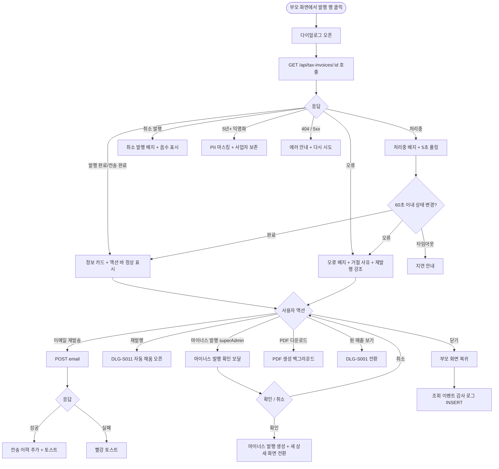
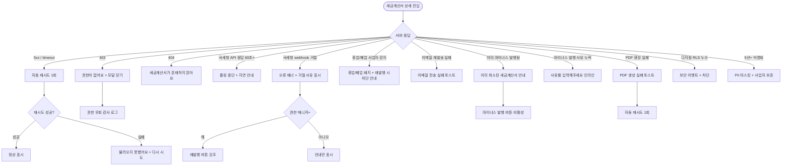

# DLG-S010 세금계산서 상세 다이얼로그

## 1. 다이얼로그 메타 정보

이 문서는 발행된 세금계산서의 상세 내용을 조회하고 필요 시 이메일 재발송·재발행을 수행하는 세금계산서 상세 다이얼로그(DLG-S010)에 대한 자기완결형 요구사항 정의서입니다. 외부 문서 없이도 이 문서 한 장만으로 호출 트리거, 표시 UI, 검증, 확인·취소 동작, 부모 화면 갱신, 권한, 예외 처리, 운영 정책까지 모두 이해해 구현·운영할 수 있도록 작성합니다.

| 항목 | 값 |
|---|---|
| 작성일 | 2026-05-22 |
| 버전 | v1.0 |
| 상태 | 최신 통합본 반영 (정합화 완료) |
| 도메인 | D03 매출관리 |
| 다이얼로그 ID | DLG-S010 |
| 다이얼로그명 | 세금계산서 상세 |
| 다이얼로그 유형 | 조회 + 보조 액션형 모달 (이메일 재발송·재발행 진입) |
| 호출 트리거 | SCR-S010 세금계산서 발행 페이지의 이력 탭에서 발행 행 클릭, DLG-S001 매출 상세의 세금계산서 발행 이력 행 클릭, DLG-S011 세금계산서 발행 완료 직후 결과 조회 진입 |
| 부모 화면 | SCR-S010 세금계산서 발행, DLG-S001 매출 상세, DLG-S011 세금계산서 발행 |
| 기능코드 | SAL-EXT-02 (세금계산서 발행) |
| 계약코드 | SAL-EXT-02 |
| 권한 9역할 | superAdmin / primary / owner / manager / fc / staff / trainer / front / readonly |
| 사용 가능 권한 | superAdmin, primary, owner, manager (조회 + 이메일 재발송 + 재발행), fc, staff, front, trainer, readonly (조회만) |
| 연결 API | `GET /api/tax-invoices/:invoiceId`, `POST /api/tax-invoices/:invoiceId/email` (이메일 재발송), `POST /api/tax-invoices/:invoiceId/cancel` (마이너스 발행 - 슈퍼관리자), `GET /api/tax-invoices/:invoiceId/pdf` (PDF 다운로드) |
| 후속 다이얼로그 | DLG-S011 세금계산서 발행 (재발행 진입 시 자동 채움) |
| 감사 로그 | SCR-097에 `tax_invoice_view`, `tax_invoice_email_resend`, `tax_invoice_minus_issue` 액션 기록 |

## 2. 다이얼로그 목적과 사용 맥락

세금계산서 상세 다이얼로그는 SAL-EXT-02 세금계산서 발행 기능의 사후 조회·관리 도구로, 발행된 세금계산서의 모든 상세 정보를 한 화면에서 확인하고 회원의 이메일 분실 요청이나 발행 오류 발견 시 후속 액션(재발송·재발행·마이너스 발행)을 즉시 실행할 수 있도록 설계되어 있습니다. 회계 마감과 부가세 신고의 핵심 도구이며, 법인·사업자 회원과의 거래에서 가장 빈번하게 사용되는 다이얼로그입니다.

이 다이얼로그가 다루는 운영 흐름은 네 가지로 구분됩니다. 첫째는 회원 요청 응대 흐름으로, 법인 담당자가 "지난주 발행한 세금계산서를 잃어버렸다"고 연락했을 때 운영자가 즉시 이 다이얼로그를 열어 이메일을 재발송합니다. 둘째는 회계 마감 검토 흐름으로, 회계 담당자가 분기 또는 월 마감 직전 발행 이력을 한 건씩 열어 공급가액·부가세·합계 금액의 정합성을 점검합니다. 셋째는 발행 오류 정정 흐름으로, 사업자번호나 상호가 잘못 발행된 것을 발견했을 때 마이너스 세금계산서 발행으로 취소하고 재발행을 진행합니다. 넷째는 부가세 신고 자료 작성 흐름으로, 세무 담당자가 분기 합계 산출 전 개별 발행 건을 검증합니다.

다이얼로그는 발행 완료된 세금계산서의 모든 필드를 정확히 보여주며, SAL-EXT-02 "발행 후 수정 불가" 정책에 따라 발행 내용 자체를 변경하는 액션은 제공하지 않습니다. 잘못 발행된 건은 마이너스 발행으로만 정정 가능합니다.

## 3. 호출 트리거와 부모 화면 컨텍스트

이 다이얼로그는 다음 세 가지 진입점에서 호출됩니다.

첫 번째 진입점은 SCR-S010 세금계산서 발행 페이지의 이력 탭에서 발행 행 클릭입니다. 행 어디를 누르더라도 다이얼로그가 열리며, `invoiceId`가 컨텍스트로 전달됩니다.

두 번째 진입점은 DLG-S001 매출 상세 다이얼로그의 세금계산서 발행 이력 카드에서 발행 행 클릭입니다. 원 매출에 묶인 세금계산서를 확인하기 위한 진입입니다.

세 번째 진입점은 DLG-S011 세금계산서 발행 다이얼로그에서 발행이 성공적으로 완료된 직후 자동으로 이 다이얼로그가 열리는 경우입니다. 발행 결과를 즉시 확인할 수 있도록 흐름이 자연스럽게 이어집니다.

다이얼로그가 받는 컨텍스트는 `invoiceId`(필수), 부모 화면 식별자(복귀 처리용)입니다.

## 4. 레이아웃과 UI 구성

다이얼로그는 데스크톱에서 가로 720px의 중앙 정렬 모달이고, 모바일에서는 풀스크린 시트로 표시됩니다. 위에서 아래로 다음 영역이 순차 배치됩니다.

가장 위에는 다이얼로그 헤더가 있습니다. 좌측에 "세금계산서 상세" 제목과 세금계산서 번호(`TI-2026-0512-0078` 형식)가 함께 표시되고, 그 옆에 상태 배지가 색상으로 분기되어 표시됩니다(발행 완료=초록 / 전송 완료=파랑 / 오류=빨강 / 취소 발행=주황 / 처리중=노랑). 우측 끝에 X 닫기 버튼이 있습니다.

헤더 아래에는 발행 정보 카드가 있습니다. 발행 일시(분 단위까지), 발행 담당자 이름과 권한 라벨, 발행 기준일(공급일자)이 한 줄로 요약 표시됩니다.

그 아래에는 공급자 정보 카드가 있습니다. 자사 정보로 사업자번호(자동 포맷 `xxx-xx-xxxxx`), 상호, 대표자명, 주소, 업태·업종이 표시됩니다. 자사 정보는 보통 운영 설정에서 한 번 입력된 값을 가져오며, 모든 세금계산서에서 동일합니다.

공급자 카드 아래에는 공급받는자 정보 카드가 있습니다. 거래처 사업자번호(자동 포맷), 상호, 대표자명, 업태·업종, 이메일 주소가 표시됩니다. 사업자번호 우측에는 국세청 진위 확인 결과 배지가 함께 표시되어, 정상 사업자라면 "사업자 정상" 녹색 배지, 위·휴·폐업이면 "휴업/폐업" 빨강 배지가 노출됩니다. 이메일 주소 우측에는 "이메일 재발송" 텍스트 버튼이 위치합니다.

그 아래에는 공급 내역 테이블이 있습니다. 컬럼은 상품명, 수량, 단가, 공급가액으로 구성되며, 단일 품목이면 한 행만 표시되고 복수 품목이면 여러 행으로 펼쳐집니다. 면세 품목은 행 우측에 "면세" 회색 배지가 추가됩니다.

공급 내역 테이블 아래에는 금액 요약 카드가 강조 영역으로 표시됩니다. 공급가액(부가세 제외), 부가세(공급가액의 10%, 면세는 0), 합계 금액(공급가액 + 부가세)이 세 행으로 정렬되고, 합계 금액은 가장 큰 폰트로 표시됩니다. 마이너스 세금계산서(취소 발행)의 경우 모든 금액이 음수로 빨강 표시됩니다.

금액 요약 아래에는 전송 이력 카드가 있습니다. 이메일 전송 시각과 수신자 이메일, 전송 결과(성공/실패), 그리고 이전 재발송 이력이 시간순으로 나열됩니다. 가장 최근 전송 결과는 강조 표시되어 운영자가 즉시 마지막 상태를 인식할 수 있습니다.

그 아래에는 국세청 전송 이력 카드가 있습니다. SAL-EXT-02 "국세청 전자세금계산서 API 연동" 정책에 따라, 국세청 API로 전송된 시각과 webhook으로 수신한 응답 코드, 처리 결과(성공/처리중/거절)가 표시됩니다. 처리 결과가 거절이면 거절 사유 코드와 사유 메시지가 함께 표시됩니다.

마지막 섹션은 원 매출 정보 카드입니다. 세금계산서가 발행된 원 매출의 번호, 결제일, 상품명, 결제 금액이 작은 카드로 표시되고, 우측에 "원 매출 보기" 텍스트 링크가 있어 누르면 DLG-S001 매출 상세 다이얼로그로 전환됩니다.

다이얼로그 가장 아래에는 액션 바가 있습니다. 좌측에 "PDF 다운로드" 텍스트 링크, 가운데에 "이메일 재발송" 버튼(권한이 있는 경우 활성), 그 옆에 "재발행" 버튼(오류 상태이거나 운영자가 마이너스 발행 후 새로 발행할 때, 매니저+), 우측 끝에 "마이너스 발행"(슈퍼관리자 한정)과 "닫기" 버튼이 배치됩니다.

## 5. 데이터 로드와 상태 표시

다이얼로그가 열리면 즉시 `GET /api/tax-invoices/:invoiceId`를 호출해 세금계산서 상세를 로드합니다. 응답이 도착할 때까지는 카드 영역들이 스켈레톤 UI로 표시됩니다.

상태가 "처리중"(국세청 API 응답 미수신)인 경우, 다이얼로그는 5초 간격으로 자동 폴링을 수행해 상태 전환을 확인합니다. 폴링은 SAL-EXT-02 "국세청 API 응답 지연: 처리 중 로딩 + 60초 타임아웃 → 재시도 안내" 규칙에 따라 최대 60초간 진행되며, 60초 후에도 처리중이 유지되면 폴링을 중단하고 "처리가 지연되고 있어요. 다시 시도해주세요"라는 안내가 헤더 배지 옆에 표시됩니다.

상태가 "오류"로 전환되면 헤더 배지가 빨강 "오류"로 표시되고, 다이얼로그 상단에 빨강 안내 배너로 "세금계산서 발행에 오류가 있어요"라는 문구와 함께 거절 사유 코드가 표시됩니다. 매니저 이상 권한자에게는 "재발행" 버튼이 강조 활성화됩니다.

마이너스 세금계산서(취소 발행)의 경우 헤더 배지가 주황 "취소 발행"으로 표시되고, 금액이 모두 음수 빨강으로 강조됩니다. 원본 세금계산서와의 연결 링크가 추가로 표시됩니다.

5년 경과 익명화된 세금계산서의 경우 SAL-EXT-02 "익명화: 5년 경과 후 PII 마스킹 (단 사업자 정보 보존)" 정책에 따라, 회원 식별 정보(상호 외 개인정보)는 마스킹되지만 사업자 정보는 그대로 보존됩니다. 이는 세무 신고 기간 요구사항입니다.

## 6. 후속 액션과 부모 화면 갱신

이메일 재발송 버튼을 누르면 즉시 백엔드에 `POST /api/tax-invoices/:invoiceId/email` 요청이 전송됩니다. 다이얼로그는 닫히지 않고, 버튼이 잠시 "전송 중..."으로 비활성화됩니다. 전송이 성공하면 우측 상단에 "이메일을 재발송했어요" 토스트가 표시되고, 전송 이력 카드에 새 행이 시간순으로 추가됩니다. 전송이 실패하면 "이메일 전송에 실패했어요" 빨강 토스트가 표시되고, 자동 재시도 없이 사용자의 다시 시도 액션을 기다립니다.

재발행 버튼을 누르면 DLG-S011 세금계산서 발행 다이얼로그가 자동 채움 상태로 열립니다. 기존 발행의 공급받는자 정보와 공급 내역이 그대로 채워진 채로 사용자는 필요한 부분만 수정해 재발행할 수 있습니다. 재발행은 새 발행 ID로 처리되며, 기존 발행 건은 그대로 보존됩니다. SAL-EXT-02 "재발행: 오류 건 자동 채움 + 재발행, 새 발행 ID 부여" 정책의 시각화입니다.

마이너스 발행 버튼(슈퍼관리자 한정)을 누르면 마이너스 발행 확인 모달이 다이얼로그 위에 겹쳐 표시됩니다. 모달에는 원 세금계산서 금액의 음수 표시와 마이너스 발행 사유 입력이 있으며, 확인을 누르면 마이너스 세금계산서가 즉시 발행됩니다. 발행 완료 후 자동으로 마이너스 세금계산서의 상세 화면으로 전환됩니다.

PDF 다운로드 링크는 백그라운드에서 PDF 생성을 트리거하고, 생성 완료 시 즉시 다운로드가 시작됩니다. 사용자가 다이얼로그를 닫더라도 다운로드는 계속 진행됩니다.

원 매출 보기 링크는 현재 다이얼로그를 닫고 DLG-S001 매출 상세 다이얼로그로 전환합니다.

닫기 버튼은 다이얼로그를 닫고 부모 화면으로 복귀합니다. 다이얼로그 진입 후 후속 액션이 한 번이라도 실행되었으면(이메일 재발송 또는 마이너스 발행), 부모 화면에 갱신 신호를 보내 이력 목록이 다시 fetch됩니다.

ESC 키와 배경 클릭은 닫기와 동일하게 동작합니다.

다이얼로그 진입과 모든 후속 액션은 SCR-097 감사 로그에 비동기 기록됩니다.

## 7. 화면 상태

다이얼로그는 다음 상태들을 가지며 각 상태마다 보이는 모습이 달라집니다.

로딩 중 상태에서는 카드 영역이 스켈레톤으로 표시되고 닫기 버튼만 활성화됩니다.

정상 표시 상태는 상태가 "발행 완료" 또는 "전송 완료"인 일반적인 상태로, 모든 카드와 액션 버튼이 정상 노출됩니다.

처리중 상태는 국세청 API 응답 미수신 상태로, 헤더 배지에 "처리중" 노란색이 표시되고 5초 폴링이 동작합니다.

오류 상태는 국세청 API 거절·통신 실패 상태로, 헤더 배지가 빨강 "오류"로 표시되고 상단 안내 배너에 거절 사유가 노출됩니다. 재발행 버튼이 강조 활성화됩니다.

취소 발행 상태는 마이너스 세금계산서로, 헤더 배지가 주황 "취소 발행"으로 표시되고 모든 금액이 음수 빨강으로 강조됩니다.

휴업/폐업 사업자 경고 상태는 국세청 진위 확인 결과 위·휴·폐업으로 응답된 상태로, 공급받는자 카드의 사업자번호 우측에 빨강 "휴업/폐업" 배지가 표시됩니다. 이런 세금계산서는 발행 이력으로만 보존되며 재발송·재발행 시 추가 검토 안내가 표시됩니다.

전송 실패 상태는 이메일 전송에 실패한 상태로, 전송 이력 카드의 최근 행이 빨강 "전송 실패"로 표시되고 "이메일 재발송" 버튼이 강조됩니다.

5년+ 익명화 상태는 회원 PII가 마스킹된 상태로, 사업자 정보는 보존되고 그 외 개인정보는 마스킹 형태로 표시됩니다.

권한 부족 상태는 자기 지점이 아닌 세금계산서를 본사 모드 없이 보려는 시도로, 다이얼로그가 열리지 않고 부모 화면에 토스트가 표시됩니다.

후속 액션 진행 중 상태는 이메일 재발송 또는 마이너스 발행이 진행 중인 상태로, 해당 버튼이 비활성화되고 스피너가 표시됩니다.

## 8. 예외 처리

네트워크 오류로 세금계산서 정보 로드에 실패하면 다이얼로그 중앙에 "세금계산서 정보를 불러오지 못했어요" 메시지와 "다시 시도" 버튼이 표시됩니다.

국세청 API 응답 60초 타임아웃 시 폴링이 중단되고 처리 지연 안내가 표시됩니다. 운영자는 잠시 후 수동 새로고침으로 다시 확인할 수 있습니다.

국세청 webhook 거절 응답이 수신되면 상태가 "오류"로 전환되고 거절 사유 코드가 표시됩니다. 거절 사유에 따라 재발행 진입 안내가 함께 노출됩니다.

이메일 재발송이 실패하면 "이메일 전송에 실패했어요" 빨강 토스트가 표시되고, 전송 이력에 실패 행이 기록됩니다. 자동 재시도는 없으며 운영자가 직접 다시 시도해야 합니다.

PDF 생성이 실패하면 "PDF 생성에 실패했어요" 토스트가 표시되고, 자동 재시도가 1회 백그라운드에서 수행됩니다.

마이너스 발행 시 원본 세금계산서가 이미 마이너스 발행으로 취소되어 있으면 "이미 취소된 세금계산서입니다" 안내가 표시되고 마이너스 발행 버튼이 비활성화됩니다.

마이너스 발행 사유 입력이 빈 경우 "마이너스 발행 사유를 입력해주세요" 인라인 메시지가 표시됩니다.

권한 부족(403)은 모달 닫기와 함께 부모 화면에 "권한이 없어요" 토스트를 띄우고 감사 로그에 권한 우회 시도가 기록됩니다.

본사 통합 모드 권한 미달 상태에서 다른 지점 세금계산서를 직접 URL로 접근한 경우, 다이얼로그가 열리지 않고 부모 화면에 토스트가 표시됩니다.

휴업/폐업 사업자에 대한 재발행 시도가 들어오면 SAL-EXT-02 "위/휴/폐업 차단: 국세청 API 위/휴/폐업 응답 시 발행 차단" 정책에 따라 DLG-S011에서 발행이 차단됩니다.

다지점 RLS 누수가 감지되면 보안 이벤트가 즉시 발생하고 다이얼로그가 차단됩니다.

## 9. 권한별 처리

superAdmin와 primary는 전체 지점의 모든 세금계산서를 조회하고 이메일 재발송·재발행·마이너스 발행을 수행할 수 있습니다. 본사 통합 모드에서도 동작이 동일합니다.

Owner(지점장)과 매니저(manager)는 자기 지점의 세금계산서를 조회하고 이메일 재발송·재발행까지 수행할 수 있습니다. 마이너스 발행은 슈퍼관리자만 가능하므로 버튼이 노출되지 않습니다.

FC(fc)는 자기가 담당하는 회원의 세금계산서를 조회만 할 수 있습니다(SAL-EXT-02 "fc: 담당 회원 결제 건, 이력 조회만").

스태프(staff), 프런트(front), 트레이너(trainer), 읽기 전용(readonly)은 자기 지점의 세금계산서를 조회만 할 수 있습니다. 후속 액션 버튼은 모두 숨겨집니다. PDF 다운로드는 권한에 따라 활성/비활성으로 분기됩니다.

권한 우회 시도(직접 API 호출)는 403으로 차단되고 감사 로그에 기록됩니다.

## 10. 운영 정책

이 다이얼로그는 SAL-EXT-02 "발행 후 수정 차단: 발행 후 수정 불가, 잘못 발행한 건은 마이너스 발행으로 취소" 정책의 핵심 시각화입니다. 다이얼로그가 발행된 세금계산서의 모든 내용을 보여주지만 직접 수정 액션은 일절 제공하지 않으며, 정정이 필요하면 반드시 마이너스 발행 → 재발행의 두 단계 절차를 거쳐야 합니다.

발행 이력 5년 보관은 SAL-EXT-02 "발행 이력 5년 보관: 국세 기본법 준수" 정책의 결과이며, 다이얼로그는 5년 동안 모든 발행 건을 조회할 수 있어야 합니다. 5년 경과 후 PII 마스킹 배치(월 1회)가 회원 식별 정보를 마스킹하지만 사업자 정보는 보존됩니다.

국세청 진위 확인 결과 표시는 SAL-EXT-02 "국세청 진위 확인: 사업자번호는 국세청 진위 확인 API로 검증한 후 발행 허용" 정책의 시각화입니다. 휴업·폐업 사업자에 대한 발행은 차단되며, 이미 발행된 건이 사후에 휴업·폐업 상태로 전환된 경우에도 다이얼로그에서 이를 즉시 인식할 수 있게 합니다.

국세청 webhook 수신과 처리는 SAL-EXT-02 "국세청 API 연동: 실시간 전송 + webhook 응답 처리" 정책에 따라 동작하며, webhook 거절 응답은 다이얼로그에서 사유 코드와 함께 즉시 표시됩니다.

마이너스 발행은 회계 정정의 유일한 합법적 방법이며, 슈퍼관리자만 권한을 가집니다. 이는 잘못된 정정이 추가 회계 오류를 유발하지 않도록 보호하는 권한 정책입니다.

이메일 재발송은 회원 요청 응대의 가장 빈번한 케이스이며, 매니저 이상 권한자가 즉시 수행할 수 있도록 다이얼로그에서 단일 버튼으로 제공됩니다.

PDF 다운로드 형식은 SAL-EXT-02 "PDF 첨부 자동: 발행 완료 후 PDF 자동 생성 + 이메일 첨부" 정책에 따라 자동 생성되며, 회원에게 발송된 이메일 첨부 PDF와 동일한 양식입니다.

다지점 RLS 격리는 SAL-EXT-02 "다지점 RLS: 지점별 발행 이력 격리" 정책에 따라 동작하며, 본사 통합 모드가 아닌 경우 다른 지점 세금계산서는 다이얼로그가 열리지 않습니다.

조회 이벤트(`tax_invoice_view`)와 후속 액션(`tax_invoice_email_resend`, `tax_invoice_minus_issue`)은 모두 감사 로그에 기록되어, 세무 신고 자료의 책임 추적성을 보장합니다.

CFO 월별 보고서 자동 생성(매월 1일 06:00)은 이 다이얼로그가 보여주는 발행 이력의 합산 결과이며, 다이얼로그에서 개별 건을 검증한 결과가 보고서에 정확히 반영됩니다.

## 11. 메인 흐름 (F2)

## 12. 에러와 예외 흐름 (F8)

## 13. 핵심 디자인 요청사항

상태 배지는 색상과 라벨이 함께 보이도록 디자인되어 색맹 운영자도 인식할 수 있어야 합니다. 발행 완료=초록, 전송 완료=파랑, 오류=빨강, 취소 발행=주황, 처리중=노랑의 5단계 색상 체계를 일관되게 유지합니다.

공급자·공급받는자 정보 카드는 동일한 스타일로 통일되되, 사업자번호 자동 포맷(`xxx-xx-xxxxx`)과 국세청 진위 확인 배지가 즉시 인식되도록 사업자번호 라인이 시각적으로 강조됩니다.

금액 요약 카드는 다이얼로그 안에서 가장 강한 시각적 비중을 가져야 합니다. 합계 금액은 가장 큰 폰트로 표시되고, 마이너스 발행이면 모든 금액이 음수 빨강으로 강조되어 운영자가 정상 발행과 즉시 구분할 수 있게 합니다.

공급 내역 테이블은 깔끔한 표 형태로 정렬되며, 면세 품목은 "면세" 회색 배지로 구분되어 부가세 0원의 이유를 즉시 인식할 수 있게 합니다.

전송 이력 카드와 국세청 전송 이력 카드는 시간순으로 정렬된 작은 행들로 표시되어, 운영자가 발행·전송의 흐름을 시간 축으로 따라갈 수 있게 합니다. 가장 최근 이벤트는 강조 처리합니다.

액션 바의 버튼들은 권한과 상태에 따라 활성/비활성/숨김이 명확히 분기되어야 합니다. 특히 마이너스 발행처럼 위험도가 높은 액션은 빨강 보더의 보조 버튼으로 표시되고, 일반 액션과 시각적으로 구분되어야 합니다.

휴업/폐업 사업자 경고는 공급받는자 카드 자체에 빨강 톤 보더가 들어가도록 처리해, 운영자가 카드를 보는 순간 즉시 문제를 인지할 수 있게 합니다.

5년+ 익명화된 데이터는 마스킹된 값임이 한 눈에 보이도록 별도의 회색 톤 배경으로 표시되어, 운영자가 실제 값과 마스킹 값을 혼동하지 않도록 합니다.

모바일에서는 풀스크린 시트로 전환되며, 카드들이 위에서 아래로 자연스럽게 흐르는 단일 컬럼 스크롤 형태가 됩니다. 액션 바는 화면 하단에 sticky로 부착됩니다.

## 14. 운영 정책 (이 다이얼로그에 연결된 부분)

이 다이얼로그가 따르는 운영 정책은 SAL-EXT-02 세금계산서 발행의 핵심 규칙들을 그대로 시각화한 것입니다.

발행 후 수정 차단 정책에 따라 다이얼로그는 직접 수정 액션을 제공하지 않습니다. 정정은 반드시 마이너스 발행 → 재발행의 두 단계 절차를 거쳐야 하며, 이는 회계·세무 정합성의 핵심입니다.

발행 이력 5년 보관 정책은 국세 기본법 준수를 위한 정책이며, 다이얼로그는 5년 동안 모든 발행 건의 조회를 보장합니다. 5년 경과 후 PII 마스킹은 월 1회 배치로 수행되며, 사업자 정보는 보존됩니다.

국세청 진위 확인 결과는 사업자번호 옆에 배지로 즉시 표시되어, 운영자가 발행된 세금계산서의 유효성을 즉시 확인할 수 있게 합니다. 이미 발행된 세금계산서가 사후에 휴업·폐업으로 전환된 경우에도 다이얼로그에서 이를 즉시 알 수 있습니다.

국세청 webhook 거절 응답 표시는 발행 실패 사유를 운영자에게 명확히 전달하기 위한 정책이며, 거절 사유 코드와 메시지가 즉시 노출됩니다. 매니저+ 권한자에게는 재발행 진입 버튼이 강조 활성화되어 정정 흐름이 자연스럽게 이어집니다.

마이너스 발행 권한은 슈퍼관리자에게만 부여되며, 발행 사유 필수 입력과 함께 신중하게 처리되어야 합니다. 이는 잘못된 정정이 회계 오류를 누적시키지 않도록 보호하는 정책입니다.

이메일 재발송 권한은 매니저+ 이상에게 부여되며, 회원 요청 응대의 가장 빈번한 케이스를 즉시 처리할 수 있도록 설계되었습니다. 재발송 이력은 전송 이력 카드에 시간순으로 모두 기록됩니다.

다지점 RLS 격리는 본사 통합 모드가 아닌 경우 자기 지점 세금계산서만 조회 가능하다는 보안 정책의 시각화입니다.

조회 이벤트와 후속 액션의 감사 로그 적재는 세무 신고 자료의 책임 추적성을 보장하는 정책이며, 누가 언제 어떤 세금계산서를 조회·재발송·취소했는지가 사후에도 재구성 가능합니다.

PDF 다운로드는 회원에게 발송된 이메일 첨부 PDF와 동일한 양식으로 발급되며, 회계 마감과 분쟁 대응에 활용됩니다.

CFO 월별 보고서와의 연계는 이 다이얼로그에서 검증한 개별 건의 합산 결과가 보고서에 반영되는 구조이며, 다이얼로그에서 정정한 내용이 보고서에 자동 반영됩니다.

이상의 정책은 세금계산서 상세 다이얼로그가 회계·세무 컴플라이언스의 핵심 검증 도구임을 보여줍니다. 정책이 바뀌면 이 문서도 함께 갱신되어야 합니다.
