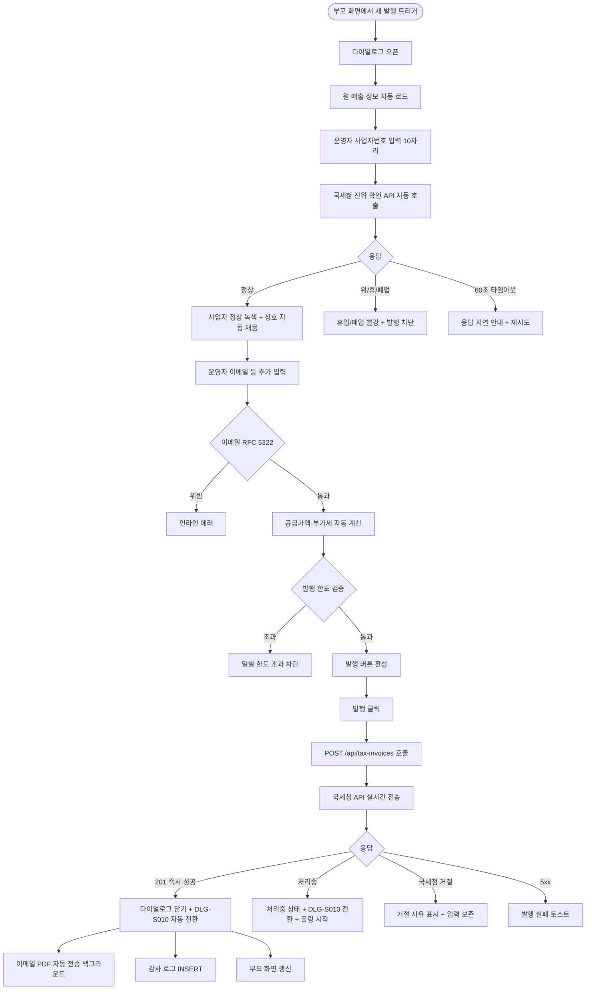
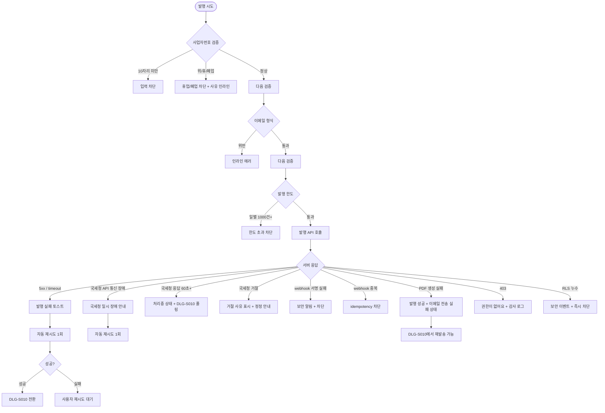

# DLG-S011 세금계산서 발행 다이얼로그

## 1. 다이얼로그 메타 정보

이 문서는 특정 매출 건에 대한 세금계산서를 새로 발행하는 세금계산서 발행 다이얼로그(DLG-S011)에 대한 자기완결형 요구사항 정의서입니다. 외부 문서 없이도 이 문서 한 장만으로 호출 트리거, 입력 폼, 검증, 국세청 진위 확인, 확인·취소 동작, 부모 화면 갱신, 권한, 예외 처리, 운영 정책까지 모두 이해해 구현·운영할 수 있도록 작성합니다.

| 항목 | 값 |
|---|---|
| 작성일 | 2026-05-22 |
| 버전 | v1.0 |
| 상태 | 최신 통합본 반영 (정합화 완료) |
| 도메인 | D03 매출관리 |
| 다이얼로그 ID | DLG-S011 |
| 다이얼로그명 | 세금계산서 발행 |
| 다이얼로그 유형 | 입력형 모달 (발행 후 DLG-S010으로 전환) |
| 호출 트리거 | SCR-S010 세금계산서 발행 페이지의 "새 발행" 버튼, DLG-S001 매출 상세의 "세금계산서 발행" 버튼, DLG-S010 세금계산서 상세의 "재발행" 버튼, PAY-01 결제 완료 후 법인 회원이면 자동 노출되는 발행 안내 진입 |
| 부모 화면 | SCR-S010 세금계산서 발행, DLG-S001 매출 상세, DLG-S010 세금계산서 상세 |
| 기능코드 | SAL-EXT-02 (세금계산서 발행) |
| 계약코드 | SAL-EXT-02 |
| 권한 9역할 | superAdmin / primary / owner / manager / fc / staff / trainer / front / readonly |
| 사용 가능 권한 | superAdmin, primary, owner, manager |
| 사용 불가 | fc, staff, front, trainer, readonly (SAL-EXT-02: 매니저+ 만 발행) |
| 연결 API | `POST /api/tax-invoices/verify-business-no` (국세청 진위 확인), `POST /api/tax-invoices/preview` (공급가액·부가세 미리보기), `POST /api/tax-invoices` (발행 처리) |
| 후속 다이얼로그 | DLG-S010 세금계산서 상세 (발행 성공 시 자동 전환) |
| 감사 로그 | SCR-097에 `tax_invoice_issue` 액션 기록 (`actor_id`, `invoice_id`, `payment_id`, `business_no`, `total_amount`) |

## 2. 다이얼로그 목적과 사용 맥락

세금계산서 발행 다이얼로그는 법인·사업자 회원과의 거래에 대해 세금계산서를 새로 생성하고 국세청 전자세금계산서 API로 전송하며 동시에 공급받는자 이메일로 PDF를 첨부 발송하는 핵심 입력 모달입니다. SAL-EXT-02 운영 시나리오에서 회계 담당자의 월말 일괄 발행과 법인 영업 담당자의 결제 직후 즉시 발행에 가장 많이 사용됩니다.

이 다이얼로그가 다루는 운영 흐름은 네 가지입니다. 첫째는 결제 직후 즉시 발행 흐름으로, 법인 회원의 결제 완료(PAY-01)와 동시에 세금계산서 발행 안내가 자동 노출되고 운영자가 다이얼로그를 열어 즉시 발행합니다. 둘째는 월말 일괄 발행 흐름으로, 회계 담당자가 SCR-S010 발행 탭에서 미발행 결제 건 목록을 보고 한 건씩 발행을 진행합니다. 셋째는 재발행 흐름으로, DLG-S010에서 발행 오류가 발생한 건의 "재발행" 버튼으로 진입해 자동 채움된 폼에서 정정 발행합니다. 넷째는 마이너스 발행 후 신규 발행 흐름으로, 잘못 발행된 건을 마이너스 발행으로 취소한 후 올바른 정보로 다시 발행합니다.

다이얼로그는 SAL-EXT-02 "국세청 진위 확인" 정책에 따라 사업자번호 입력 시 국세청 API로 검증을 수행하며, 위·휴·폐업 사업자는 발행 자체가 차단됩니다. 또한 SAL-EXT-02 "발행 후 수정 차단" 정책에 따라 발행이 완료된 후에는 정보 수정이 불가하며, 발행 전 단계인 이 다이얼로그가 마지막 검토 단계가 됩니다.

## 3. 호출 트리거와 부모 화면 컨텍스트

이 다이얼로그는 다음 네 가지 진입점에서 호출됩니다.

첫 번째 진입점은 SCR-S010 세금계산서 발행 페이지의 "새 발행" 버튼입니다. 부모는 발행 대상 결제 건 ID(`paymentId`)를 컨텍스트로 전달하며, 다이얼로그는 결제 건의 원 매출 정보(상품·금액)를 자동으로 로드합니다.

두 번째 진입점은 DLG-S001 매출 상세 다이얼로그의 "세금계산서 발행" 버튼입니다. 부모는 매출 상세를 보던 결제 ID를 컨텍스트로 전달합니다.

세 번째 진입점은 DLG-S010 세금계산서 상세 다이얼로그의 "재발행" 버튼입니다. 부모는 원본 세금계산서 ID와 발행 정보(공급받는자 정보·공급 내역)를 컨텍스트로 전달하며, 다이얼로그는 모든 필드를 자동 채움 상태로 시작합니다.

네 번째 진입점은 PAY-01 결제 완료 직후 결제 처리 화면(SCR-S003)에 자동 노출되는 "세금계산서 발행" 안내입니다. SAL-EXT-02 "법인 회원 결제 시 SAL-EXT-02 세금계산서 발행 알림 자동 노출 + 사업자 정보 자동 채움" 정책에 따라, 결제 회원이 법인이면 발행 안내가 노출되고 운영자가 즉시 다이얼로그를 열어 발행할 수 있습니다.

다이얼로그가 받는 컨텍스트는 진입 경로(`NEW` / `REISSUE` / `POST_PAYMENT`), 발행 대상 결제 ID, 원본 세금계산서 ID(재발행 한정), 회원의 사업자 정보(있을 경우), 부모 화면 식별자입니다.

## 4. 레이아웃과 UI 구성

다이얼로그는 데스크톱에서 가로 720px의 중앙 정렬 모달이고, 모바일에서는 풀스크린 시트로 표시됩니다. 위에서 아래로 다음 영역이 순차 배치됩니다.

가장 위에는 다이얼로그 헤더가 있습니다. 좌측에 "세금계산서 발행" 제목, 우측 끝에 X 닫기 버튼이 있습니다. 헤더 아래에 진입 경로 안내가 표시됩니다(예: "새 발행" / "재발행 - 원본 TI-2026-0512-0078" / "결제 완료 → 즉시 발행").

헤더 아래에는 원 매출 정보 카드가 있습니다. 발행 대상 결제 건의 매출 번호, 결제일, 상품명, 결제 금액이 읽기 전용으로 표시됩니다. 이 정보는 변경할 수 없으며, 세금계산서의 공급 내역과 공급가액 자동 계산의 기준이 됩니다.

그 아래에는 공급받는자 정보 입력 영역이 있습니다. 첫 번째 필드는 사업자번호입니다. 10자리 자동 포맷(`xxx-xx-xxxxx`)이 적용되고, 10자리를 모두 입력하면 자동으로 국세청 진위 확인 API가 호출됩니다. 확인이 진행되는 동안에는 입력란 우측에 작은 스피너가 표시되고, 결과가 도착하면 결과 배지가 표시됩니다. 정상 사업자라면 "사업자 정상" 녹색 배지, 위·휴·폐업이면 빨강 배지와 함께 발행 차단 안내가 표시됩니다. 진위 확인 결과 정상이면 자동으로 상호·대표자·업태·업종이 국세청 응답값으로 채워지지만, 운영자가 직접 수정할 수 있습니다.

두 번째 필드는 상호입니다. 텍스트 입력으로 필수이며, 국세청 응답값이 있으면 자동 채움됩니다.

세 번째 필드는 대표자명입니다. 텍스트 입력으로 필수입니다.

네 번째 필드는 업태·업종입니다. 텍스트 입력으로 선택이지만 입력 권장입니다.

다섯 번째 필드는 이메일 주소입니다. SAL-EXT-02 "이메일 형식 검증: RFC 5322 기준" 정책에 따라 형식 검증이 실시간으로 적용됩니다. 형식 오류 시 인라인 에러가 표시됩니다. 이메일은 발행 완료 후 PDF 첨부 발송의 수신 주소가 됩니다.

여섯 번째 필드는 발행 일자(공급일자)입니다. 기본값은 원 매출의 결제일이며, 운영자가 날짜 피커로 수정할 수 있습니다. 일반적으로 결제일과 발행 일자가 일치하는 것이 회계 관행이지만, 정정 발행이나 일괄 발행 시 별도 일자를 선택할 수 있습니다.

공급받는자 정보 아래에는 공급 내역 표가 있습니다. 컬럼은 상품명, 수량, 단가, 공급가액으로 구성되며, 원 매출의 상품 정보가 자동 채움됩니다. 단일 품목이면 한 행, 복수 품목이면 여러 행으로 표시됩니다. 각 행의 단가·수량은 운영자가 수정할 수 있고, 수정하면 공급가액이 자동 재계산됩니다.

그 아래에는 금액 요약 카드가 강조 영역으로 표시됩니다. 공급가액(부가세 제외, 자동 계산), 부가세액(공급가액의 10%, 면세는 0), 합계 금액(공급가액 + 부가세)이 세 행으로 정렬되고 합계 금액은 가장 큰 폰트로 표시됩니다. 면세 품목이 포함된 경우 부가세 0원으로 자동 처리되고 "면세" 표시가 함께 노출됩니다.

마지막 섹션은 메모 입력란(선택)입니다. 자유 형식 textarea로 최대 500자까지 입력 가능하며, 내부 관리용으로 회원에게는 노출되지 않습니다.

다이얼로그 가장 아래에는 액션 바가 있습니다. 우측에 회색 "취소" 버튼과 강조색 "발행" 버튼이 나란히 놓입니다. 발행 버튼은 모든 필수 입력이 완료되고 국세청 진위 확인이 정상 응답한 경우에만 활성화됩니다.

## 5. 입력 검증과 국세청 진위 확인

세금계산서 발행은 다음 검증을 순서대로 통과해야 저장됩니다.

첫째, 사업자번호 형식 검증입니다. 10자리 숫자여야 하며, 미만은 입력 자체가 차단됩니다.

둘째, 국세청 진위 확인 검증입니다. 10자리 입력 직후 자동으로 `POST /api/tax-invoices/verify-business-no`가 호출됩니다. 응답이 60초 안에 도착하지 않으면 SAL-EXT-02 "국세청 API 응답 지연 (60초+): 처리 중 + 재시도" 정책에 따라 폴링 안내가 표시됩니다. 결과가 정상이면 발행 진행이 가능하고, 위·휴·폐업이면 발행 버튼이 비활성화되며 사유가 인라인으로 표시됩니다.

셋째, 필수 필드 검증입니다. 상호·대표자·이메일은 필수 입력이며, 빈 값이면 발행 버튼이 비활성화됩니다.

넷째, 이메일 형식 검증입니다. RFC 5322 기준으로 실시간 검증이 적용됩니다.

다섯째, 발행 일자 검증입니다. 미래 일자는 차단됩니다. 너무 과거 일자(예: 1년 전)는 경고만 표시되고 발행 자체는 가능합니다.

여섯째, 공급가액 검증입니다. 자동 계산된 공급가액이 0원 이상이어야 하며, 음수는 발생할 수 없습니다.

일곱째, 발행 한도 검증입니다. SAL-EXT-02 "발행 한도: 일별 1000건 제한 (국세청 API 처리량)" 정책에 따라 일별 발행 횟수가 1000건을 초과하면 "발행 한도를 초과했어요" 안내와 함께 발행이 차단됩니다.

여덟째, 권한 검증입니다. 권한이 없는 계정은 다이얼로그가 열리지 않으며, 직접 API 호출 시도는 403으로 차단됩니다.

## 6. 발행 처리와 부모 화면 갱신

발행 버튼을 누르면 다이얼로그는 즉시 로딩 상태로 전환되어 모든 버튼이 비활성화되고, 발행 버튼 라벨이 "발행 중..."으로 바뀝니다. 백엔드는 다음 흐름으로 처리합니다.

먼저 자체 검증을 통과하면 국세청 전자세금계산서 API로 실시간 전송을 시도합니다. 응답이 즉시 도착하면 그 결과로 세금계산서 상태가 결정되고, 응답이 지연되면 상태 "처리중"으로 저장한 뒤 webhook 응답을 기다립니다.

성공 응답(201)이 도착하면 다이얼로그가 자동으로 닫히고 DLG-S010 세금계산서 상세 다이얼로그로 전환되어 발행 결과가 즉시 표시됩니다. 동시에 이메일 PDF 자동 첨부 전송이 백그라운드에서 시작되며, 전송 결과는 DLG-S010의 전송 이력 카드에 비동기로 추가됩니다.

부모 화면별로 다음 갱신이 일어납니다. 부모가 SCR-S010 세금계산서 발행 페이지이면 이력 탭이 자동 선택되고 신규 발행 건이 목록 최상단에 노출되며 요약 카드의 "이번 달 발행 건수"·"이번 달 발행 총액"이 갱신됩니다. 부모가 DLG-S001 매출 상세이면 매출 상세의 세금계산서 발행 이력 카드에 신규 발행 행이 추가됩니다. 부모가 DLG-S010(재발행)이면 DLG-S010이 자동으로 새 세금계산서 상세로 전환됩니다.

실패 응답이 오면 다이얼로그는 닫히지 않고 입력 내용이 그대로 보존됩니다. 4xx 입력 오류는 사유가 인라인 메시지로 표시되며, 국세청 API 거절은 거절 사유 코드와 함께 빨강 토스트로 안내됩니다.

취소 버튼은 다음과 같이 동작합니다. 입력 내용이 빈 상태(또는 자동 채움된 상태에서 변경 없음)이면 즉시 다이얼로그를 닫습니다. 입력이 변경된 상태에서는 "변경 사항이 사라집니다. 닫으시겠습니까?" 확인 팝업이 표시됩니다.

ESC 키와 배경 클릭도 취소와 동일하게 동작합니다.

발행 성공 시 SCR-097 감사 로그에 `tax_invoice_issue` 액션이 적재되고, 국세청 API 전송 결과도 함께 기록되어 사후 추적이 가능합니다.

## 7. 화면 상태

다이얼로그는 다음 상태들을 가지며 각 상태마다 보이는 모습이 달라집니다.

기본 표시 상태는 다이얼로그가 갓 열린 직후의 상태로, 진입 경로에 따라 일부 필드가 자동 채워져 있고 사업자번호 입력 대기 상태입니다.

국세청 진위 확인 중 상태는 사업자번호 10자리 입력 직후의 상태로, 입력란 우측에 스피너가 표시되고 발행 버튼은 비활성화됩니다.

진위 확인 정상 상태는 국세청 응답이 정상으로 도착한 상태로, "사업자 정상" 녹색 배지가 표시되고 상호·대표자·업태·업종이 자동 채워지며 발행 버튼이 활성화 후보가 됩니다.

진위 확인 실패 상태는 위·휴·폐업 응답이 도착한 상태로, "휴업/폐업" 빨강 배지가 표시되고 발행 버튼이 비활성화됩니다.

진위 확인 지연 상태는 국세청 API 응답이 60초 이상 지연된 상태로, 처리 지연 안내가 표시되고 재시도 옵션이 제공됩니다.

이메일 형식 오류 상태는 이메일 입력이 RFC 5322 형식을 위반한 상태로, 이메일 입력란에 인라인 에러가 표시됩니다.

발행 중 상태는 발행 버튼을 누른 직후의 상태로, 모든 입력이 잠기고 버튼이 "발행 중..."으로 표시됩니다.

발행 한도 초과 상태는 일별 1000건을 초과한 상태로, "발행 한도를 초과했어요" 안내와 함께 발행이 차단됩니다.

성공 완료 상태는 API 성공 응답을 받은 직후의 상태로, 다이얼로그가 자동으로 닫히고 DLG-S010으로 전환됩니다.

실패 상태는 발행 처리 실패 상태로, 입력 내용이 보존되고 사유에 따라 메시지가 표시됩니다.

면세 품목 상태는 공급 내역에 면세 품목이 포함된 상태로, 부가세 0원과 "면세" 표시가 함께 노출됩니다.

권한 부족 상태는 권한이 없는 계정의 직접 진입 시도로, 다이얼로그가 열리지 않습니다.

## 8. 예외 처리

네트워크 오류로 발행이 실패하면 "세금계산서 발행에 실패했어요" 빨강 토스트가 표시되고 입력 내용은 보존됩니다.

국세청 API 통신 장애가 발생하면 "국세청 시스템에 일시적 장애가 있어요. 잠시 후 다시 시도해주세요" 안내가 표시되고 자동 재시도가 1회 백그라운드에서 진행됩니다.

국세청 진위 확인 실패(위·휴·폐업)는 SAL-EXT-02 "위/휴/폐업 차단" 정책에 따라 발행이 차단됩니다. 운영자가 사업자번호를 정정하거나 발행을 포기해야 합니다.

이메일 형식 오류는 인라인 에러로 즉시 표시되며, 발행 버튼이 비활성화됩니다.

발행 한도(일별 1000건+) 초과는 차단되며, 다음 날 재시도가 안내됩니다.

PDF 생성 자동 실패는 발행 자체는 성공으로 처리되고, 이메일 전송이 자동 실패한 것으로 DLG-S010 측에서 "전송 실패" 상태로 표시됩니다. 운영자가 DLG-S010에서 재발송 버튼을 눌러 다시 시도할 수 있습니다.

webhook 서명 실패는 국세청 응답 자체에 위변조가 의심되는 상황이며, 자동으로 차단되고 보안 알림이 슈퍼관리자에게 발송됩니다.

webhook 중복 수신은 idempotency-key로 자동 차단되어 이중 처리가 방지됩니다.

발행 후 수정 시도(이미 발행 완료된 건의 필드 수정 시도)는 다이얼로그가 이미 닫혀 발생하지 않지만, 만약 우회 시도가 들어오면 백엔드가 차단합니다.

권한 부족(403)은 모달 닫기와 함께 부모 화면에 "권한이 없어요" 토스트를 띄우고 감사 로그에 권한 우회 시도가 기록됩니다.

본사 통합 모드 권한 미달 상태에서 다른 지점 결제 건에 대한 발행 시도는 다이얼로그가 열리지 않습니다.

다지점 RLS 누수가 감지되면 보안 이벤트가 즉시 발생하고 차단됩니다.

## 9. 권한별 처리

슈퍼관리자(superAdmin)와 본사 최고관리자(primary)는 전체 지점의 결제 건에 대해 세금계산서 발행이 가능합니다. 본사 통합 모드에서도 동작이 동일합니다.

센터장(owner)과 매니저(manager)는 자기 지점의 결제 건에 대해 세금계산서 발행이 가능합니다(SAL-EXT-02 "매니저+ 만 발행" 정책).

FC(fc)는 발행 권한이 없으므로 다이얼로그가 열리지 않습니다. SAL-EXT-02 권한 매트릭스에 따라 fc는 이력 조회만 가능합니다.

스태프(staff), 프런트(front), 트레이너(trainer), 읽기 전용(readonly)도 발행 권한이 없으므로 다이얼로그가 열리지 않습니다.

권한 우회 시도(직접 API 호출)는 403으로 차단되고 감사 로그에 기록됩니다.

## 10. 운영 정책

이 다이얼로그는 SAL-EXT-02 세금계산서 발행 기능의 핵심 입력 단계이며, 발행 후 수정 차단 정책과 국세청 진위 확인 정책이 모두 이 단계에서 적용됩니다.

국세청 진위 확인은 SAL-EXT-02 "국세청 진위 확인: 사업자번호는 국세청 진위 확인 API로 검증한 후 발행 허용" 정책의 시각화이며, 위·휴·폐업 사업자에 대한 발행을 사전에 차단합니다.

부가세 자동 계산은 SAL-EXT-02 "부가세 자동 계산: 공급가액의 10%, 면세 품목은 별도 처리" 정책에 따라 자동으로 적용되며, 면세 품목은 부가세 0원으로 처리됩니다.

발행 후 수정 차단은 SAL-EXT-02 "발행 후 수정 차단: 발행 후 수정 불가, 잘못 발행한 건은 마이너스 발행으로 취소" 정책의 결과이며, 이 다이얼로그가 마지막 검토 단계임을 의미합니다. 발행 버튼을 누른 후에는 입력값을 변경할 수 없습니다.

이메일 PDF 자동 첨부 발송은 SAL-EXT-02 "PDF 첨부 자동: 발행 완료 후 PDF 자동 생성 + 이메일 첨부" 정책에 따라 발행 직후 백그라운드에서 자동으로 시작됩니다. 운영자가 별도로 발송 버튼을 누를 필요가 없습니다.

발행 한도 일별 1000건은 SAL-EXT-02 "발행 한도: 일별 1000건 제한 (국세청 API 처리량)" 정책의 결과이며, 한도 초과 시 다음 날 재시도가 안내됩니다.

국세청 webhook 보안(HMAC 서명 검증 + idempotency)은 SAL-EXT-02 "국세청 webhook 보안: HMAC 서명 검증 + idempotency" 정책에 따라 자동으로 적용되며, 위변조 시도와 중복 수신을 차단합니다.

권한 매트릭스(매니저+ 만 발행)는 세금계산서가 회계·세무 컴플라이언스의 핵심 문서이기 때문에, 발행 권한을 책임 있는 권한자에게만 부여하는 정책입니다.

법인 회원 결제 직후 자동 노출은 SAL-EXT-02·PAY-01 연계 정책에 따라 결제 완료와 동시에 발행 안내가 노출되어, 운영자가 세금계산서 발행을 빠뜨리지 않도록 보장합니다.

재발행은 SAL-EXT-02 "재발행: 오류 건 자동 채움 + 재발행, 새 발행 ID 부여" 정책에 따라 새 발행 ID로 생성되며, 기존 발행 건은 그대로 보존됩니다. 두 건이 모두 이력에 남아 사후 추적이 가능합니다.

CFO 월별 보고서는 매월 1일 06:00에 자동 생성되며, 이 다이얼로그에서 발행한 건들이 합산되어 보고서에 반영됩니다.

다지점 RLS 격리는 SAL-EXT-02 "다지점 RLS: 지점별 발행 이력 격리" 정책에 따라 본사 통합 모드가 아닌 경우 자기 지점 결제 건에 대해서만 발행 가능합니다.

감사 로그 적재(`tax_invoice_issue`)는 비동기로 5초 이내 보장되며, 세무 신고 자료의 책임 추적성을 보장합니다.

## 11. 메인 흐름 (F2)

## 12. 에러와 예외 흐름 (F8)

## 13. 핵심 디자인 요청사항

원 매출 정보 카드는 회색 톤의 보조 정보로, 발행 폼이 시각적 주인공이 되도록 비중을 작게 합니다. 매출 번호와 결제 금액은 진한 글씨로 강조해 운영자가 잘못된 매출에 발행하는 사고를 막아야 합니다.

사업자번호 입력란은 다이얼로그 안에서 가장 중요한 입력 필드이므로 가장 위에 배치되고, 입력 직후 자동 진위 확인이 진행되는 시각적 피드백(스피너 → 결과 배지)이 즉시 보여야 합니다. 정상 사업자 배지는 녹색, 휴업·폐업은 빨강으로 색상이 강하게 구분되어 운영자가 즉시 인지할 수 있어야 합니다.

자동 채움된 상호·대표자·업태·업종 필드는 자동 채움 표시(작은 "자동 채움" 배지 또는 다른 보더 색상)로 운영자가 직접 입력한 값과 시각적으로 구분되어, 운영자가 변경하면 자동 채움 배지가 사라지는 식으로 명확히 표시합니다.

이메일 입력란은 형식 검증이 실시간으로 작동하며, 입력 도중에는 검증을 표시하지 않고 입력 완료(blur 또는 일정 시간 멈춤) 시점에 검증이 진행되어 사용자 입력을 방해하지 않습니다.

공급 내역 표는 깔끔한 표 형태로 정렬되며, 운영자가 수량·단가를 수정할 수 있는 인풋이 행 안에 내장되어 자연스럽게 편집할 수 있어야 합니다. 면세 품목은 작은 회색 배지로 즉시 구분됩니다.

금액 요약 카드는 다이얼로그 안에서 가장 강한 시각적 비중을 가지며, 합계 금액은 가장 큰 폰트로 표시됩니다. 부가세 자동 계산 결과가 실시간으로 반영되도록 공급가액 변경 시 즉시 재계산되는 시각 효과가 들어가야 합니다.

발행 버튼은 모든 검증 통과 시에만 강조색으로 활성화되며, 검증 미통과 시 회색 비활성으로 표시되고 호버 시 사유가 툴팁으로 표시됩니다.

발행 중 상태에서는 발행 버튼에 작은 스피너가 표시되고, 다이얼로그 자체가 어둡게 처리되어 사용자가 처리 진행을 즉시 인식하도록 합니다.

성공 시 DLG-S010 자동 전환은 부드러운 모달 교체 애니메이션으로 진행되어, 운영자가 발행→상세 확인의 흐름을 자연스럽게 따라갈 수 있게 합니다.

모바일에서는 풀스크린 시트로 전환되고, 키보드가 올라온 상태에서도 발행 버튼이 키보드 위에 sticky로 부착되어 항상 클릭 가능해야 합니다.

## 14. 운영 정책 (이 다이얼로그에 연결된 부분)

이 다이얼로그는 SAL-EXT-02 세금계산서 발행 기능의 핵심 입력 단계로서, 발행 후 수정 차단 정책의 마지막 보호 단계입니다. 다이얼로그를 닫고 발행이 완료된 후에는 수정이 불가하며, 정정은 마이너스 발행으로만 가능합니다.

국세청 진위 확인을 통한 위·휴·폐업 사업자 발행 차단은 회계 정합성과 세무 신고 신뢰성을 위한 핵심 정책이며, 다이얼로그에서 사전 차단됩니다.

부가세 자동 계산은 회계 오류를 방지하기 위한 정책이며, 운영자가 수동으로 부가세를 계산해 입력하는 위험을 사전에 제거합니다. 면세 품목은 부가세 0원으로 별도 처리됩니다.

발행 한도 일별 1000건은 국세청 API 처리량 한계를 고려한 정책이며, 한도 초과 시 다음 날 재시도가 안내되어 운영자가 무한 발행 시도로 시스템 부담을 주지 않도록 보호합니다.

이메일 PDF 자동 첨부 발송은 회원에게 세금계산서를 즉시 전달하기 위한 정책이며, 발행 직후 백그라운드에서 자동 시작되어 운영자가 별도 액션을 취할 필요가 없습니다.

webhook HMAC 서명 검증과 idempotency는 외부 시스템(국세청) 응답의 보안과 신뢰성을 보장하기 위한 정책이며, 위변조 시도와 중복 처리를 사전 차단합니다.

권한 매트릭스(매니저+ 만 발행)는 세금계산서가 회계·세무 컴플라이언스 문서이기 때문에, 발행 책임을 명확한 권한자에게 한정하는 정책입니다.

법인 회원 결제 직후 자동 발행 안내는 PAY-01·SAL-EXT-02 연계 정책의 결과이며, 운영자가 결제 후 세금계산서 발행을 빠뜨리지 않도록 시스템이 적극적으로 안내합니다.

재발행 시 새 발행 ID 부여는 SAL-EXT-02 "재발행: 새 발행 ID 부여" 정책에 따라 모든 발행 이력이 보존되어, 정정 흐름이 사후에도 추적 가능합니다.

다지점 RLS 격리는 본사 통합 모드가 아닌 경우 자기 지점 결제 건만 발행 가능하다는 보안 정책의 결과입니다.

감사 로그 적재는 비동기로 5초 이내 보장되며, 누가 언제 어떤 결제에 어떤 사업자번호로 세금계산서를 발행했는지가 사후에도 재구성 가능합니다.

CFO 월별 보고서와의 연계는 이 다이얼로그에서 발행한 건들이 합산되어 보고서에 반영되는 구조이며, 발행 데이터의 일관성이 보고서에 그대로 전달됩니다.

이상의 정책은 세금계산서 발행 다이얼로그가 회계·세무 컴플라이언스의 가장 민감한 입력 단계임을 보여줍니다. 정책이 바뀌면 이 문서도 함께 갱신되어야 합니다.
