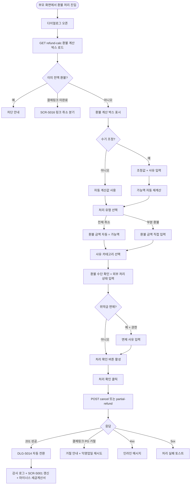
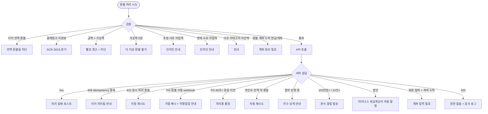

# DLG-S013 환불 처리 다이얼로그

## 1. 다이얼로그 메타 정보

이 문서는 접수된 환불 요청 또는 운영자가 직접 발견한 환불 대상 매출 건에 대해 환불 금액·사유·수단을 확정하고 실제 환불 처리를 수행하는 환불 처리 다이얼로그(DLG-S013)에 대한 자기완결형 요구사항 정의서입니다. 외부 문서 없이도 이 문서 한 장만으로 호출 트리거, 입력 폼, 환불 계산, 검증, 확인·취소 동작, 부모 화면 갱신, 권한, 예외 처리, 운영 정책까지 모두 이해해 구현·운영할 수 있도록 작성합니다.

| 항목 | 값 |
|---|---|
| 작성일 | 2026-05-22 |
| 버전 | v1.0 |
| 상태 | 최신 통합본 반영 (정합화 완료) |
| 도메인 | D03 매출관리 |
| 다이얼로그 ID | DLG-S013 |
| 다이얼로그명 | 환불 처리 |
| 다이얼로그 유형 | 입력형 모달 (처리 후 DLG-S014 자동 전환) |
| 호출 트리거 | DLG-S015 환불 요청 다이얼로그의 "환불 처리" 진입, SCR-S007 환불 관리 목록의 미처리 건 "처리" 버튼, DLG-S001 매출 상세의 "환불" 버튼, SCR-S012 결제 취소·부분 환불 페이지의 결제 건 선택 후 처리 진입 |
| 부모 화면 | DLG-S015 환불 요청, SCR-S007 환불 관리, DLG-S001 매출 상세, SCR-S012 결제 취소·부분 환불 |
| 기능코드 | PAY-02 (환불 관리), SAL-EXT-04 (결제 취소·부분 환불) |
| 계약코드 | PAY-02 |
| 권한 9역할 | superAdmin / primary / owner / manager / fc / staff / trainer / front / readonly |
| 사용 가능 권한 | superAdmin, primary, owner, manager (환불 처리 + 위약금 면제), fc (환불 처리 가능, 위약금 면제 불가) |
| 사용 불가 | staff, front, trainer, readonly (조회만) |
| 연결 API | `GET /api/payments/:paymentId/refund-calc` (환불 계산 박스 로드), `POST /api/payments/:paymentId/adjust-refund-base` (수기 조정), `POST /api/payments/:paymentId/cancel` (전체 취소), `POST /api/payments/:paymentId/partial-refund` (부분 환불) |
| 후속 다이얼로그 | DLG-S014 환불 상세 결과 (처리 성공 시 자동 전환) |
| 감사 로그 | SCR-097에 `refund_process` 액션 기록 (`actor_id`, `payment_id`, `refund_amount`, `reason`, `adjustments`) |

## 2. 다이얼로그 목적과 사용 맥락

환불 처리 다이얼로그는 SAL-EXT-04 결제 취소·부분 환불 기능의 입력 단계로, 운영자가 환불 가능액과 위약금·기사용 차감을 확인·조정하고 최종 환불 금액·사유·수단을 결정해 실제 환불을 실행하는 핵심 입력 모달입니다. PAY-02 환불 관리에서 가장 중요한 운영 도구이며, 회원 분쟁·휴원·이사·결제 오류 같은 모든 환불 시나리오의 공통 처리 화면입니다.

이 다이얼로그가 다루는 운영 흐름은 다섯 가지로 구분됩니다. 첫째는 회원 환불 요청 응대 흐름으로, DLG-S015에서 접수된 환불 요청을 운영자가 검토한 후 이 다이얼로그에서 실제 환불을 처리합니다. 둘째는 직접 환불 처리 흐름으로, SCR-S007 환불 관리 목록에서 미처리 건의 처리 버튼을 통해 진입합니다. 셋째는 매출 상세 환불 흐름으로, DLG-S001 매출 상세에서 결제 건을 보던 운영자가 즉시 환불을 진행합니다. 넷째는 수기 조정 흐름으로, 기사용 차감금·위약금·환불 가능액을 운영자가 수기로 조정하고 조정 사유를 기록합니다. 다섯째는 부분 환불 누적 흐름으로, 같은 결제 건에 이전 부분 환불이 있어 누적 추적이 필요한 흐름입니다.

다이얼로그는 SAL-EXT-04 환불 계산 박스의 결과를 그대로 표시하며, SCR-S012의 계산 규칙을 따라갑니다. 클라이언트 정책이 확정되지 않은 항목(기사용 차감금·위약금·기환불 누계 등)은 수기 입력으로 받고 조정 사유를 필수 기록합니다. 처리 결과는 SCR-S007·SCR-S001에 자동 반영되고 감사 로그에 기록됩니다.

## 3. 호출 트리거와 부모 화면 컨텍스트

이 다이얼로그는 다음 네 가지 진입점에서 호출됩니다.

첫 번째 진입점은 DLG-S015 환불 요청 다이얼로그에서 운영자가 요청을 승인하고 처리로 진입하는 경우입니다. 부모는 환불 요청 ID와 결제 ID를 컨텍스트로 전달하며, 다이얼로그는 요청 정보(요청자·요청 사유·요청 금액)를 자동 채움 형태로 시작합니다.

두 번째 진입점은 SCR-S007 환불 관리 목록의 미처리 행에서 "처리" 버튼을 클릭하는 경우입니다. 부모는 환불 요청 ID와 결제 ID를 전달합니다.

세 번째 진입점은 DLG-S001 매출 상세의 "환불" 버튼입니다. 부모는 결제 ID만 전달하며, 다이얼로그는 환불 요청 없이 직접 환불 처리를 시작합니다(요청자 = 직원 자동 설정).

네 번째 진입점은 SCR-S012 결제 취소·부분 환불 페이지에서 결제 건을 검색 선택 후 "환불 처리" 버튼입니다. 이 경우 SCR-S012에서 이미 환불 계산 박스가 표시되어 있으므로, 다이얼로그는 그 결과를 받아 확인 단계만 수행합니다.

다이얼로그가 받는 컨텍스트는 결제 ID(필수), 환불 요청 ID(있을 경우), 진입 경로(`FROM_REQUEST` / `FROM_LIST` / `FROM_PAYMENT_DETAIL` / `FROM_SCR_S012`), 부모 화면 식별자입니다.

## 4. 레이아웃과 UI 구성

다이얼로그는 데스크톱에서 가로 720px의 중앙 정렬 모달이고, 모바일에서는 풀스크린 시트로 표시됩니다. 위에서 아래로 다음 영역이 순차 배치됩니다.

가장 위에는 헤더가 있습니다. 좌측에 "환불 처리" 제목, 우측 끝에 X 닫기 버튼이 있습니다. 헤더 아래에 진입 경로 안내가 작은 라벨로 표시됩니다.

헤더 아래에는 원 매출 정보 카드가 읽기 전용으로 표시됩니다. 매출 번호, 결제일, 회원명, 상품명, 결제 금액, 결제 수단 요약이 한 줄로 나열되며, 우측에 "원 매출 보기"(DLG-S001) 텍스트 링크가 있습니다.

그 아래에는 환불 계산 요약 박스가 강조 영역으로 표시됩니다. SAL-EXT-04 환불 계산 박스의 6개 항목이 표 형태로 나란히 표시됩니다. 원결제 금액, 기사용 차감금, 위약금, 기환불 누계, 이번 환불 가능액, 최종 환불액 순서입니다. 각 행의 금액은 우측 정렬되고, 자동 계산된 항목은 회색 비활성 글씨로, 운영자가 수기 조정할 수 있는 항목은 진한 글씨와 함께 "조정" 작은 버튼이 우측에 표시됩니다.

수기 조정 영역은 SAL-EXT-04 "정책 미확정 시 기사용 차감금·위약금·기환불 누계 수기 입력" 정책에 따라, 기사용 차감금·위약금·이번 환불 가능액 항목 각각에 "조정" 버튼이 있으며 누르면 인풋 필드로 전환됩니다. 조정값을 입력하면 즉시 이번 환불 가능액이 자동 재계산됩니다. SAL-EXT-04 "조정 권한 + 사유 기록: 담당자는 ... 조정할 수 있으며 조정 사유 필수 기록" 정책에 따라, 조정 시 사유 입력란이 함께 펼쳐지고 필수 입력으로 표시됩니다.

위약금 면제 토글은 슈퍼관리자·Owner(지점장) 한정으로 표시되며, 토글을 켜면 위약금이 0원으로 자동 적용되고 면제 사유 입력란이 노출됩니다. 면제 사유는 필수 입력입니다.

환불 계산 박스 아래에는 혼합결제 환불 분해표가 있습니다. SAL-EXT-04 "혼합결제 행 단위 잔액 관리" 정책에 따라, 원결제가 혼합결제(카드+현금+포인트 같은 조합)인 경우 각 수단별로 원수납액·기환불액·이번 환불 배분액·잔여 가능액의 4개 컬럼이 표시되어 어느 수단에서 얼마를 환불할지가 운영자에게 명확히 보입니다. 단일 결제 수단이면 한 행으로 축약됩니다.

분해표 아래에는 처리 유형 선택이 있습니다. 라디오로 "전체 취소"와 "부분 환불"을 선택하며, 전체 취소를 선택하면 환불 금액 입력란이 환불 가능액으로 자동 채워지고 잠금됩니다. 부분 환불을 선택하면 환불 금액 입력란이 활성화되어 운영자가 직접 입력합니다.

그 아래에는 환불 금액 입력란이 있습니다. 천 단위 콤마 자동 포맷이 적용되며, 입력값이 환불 가능액을 초과하면 빨강 경고와 함께 처리 버튼이 비활성화됩니다. 부분 환불 최소 금액은 1원입니다.

환불 금액 아래에는 환불 사유 선택 영역이 있습니다. 라디오로 SAL-EXT-04의 5종 사유(단순 변심·결제 오류·회원 요청·서비스 불만·기타)를 선택하고, "기타"를 선택하면 자유 입력 textarea가 노출됩니다. 다른 카테고리를 선택해도 추가 의견 textarea가 함께 표시되어 운영자가 상세 사유를 적을 수 있습니다.

환불 사유 아래에는 환불 수단 확인 카드가 있습니다. 원결제 수단별로 환불 방법이 안내됩니다. 현장 카드는 "외부 POS 환불 완료 후 CRM 기록", 결제링크 카드는 "PG 환불 처리(영업일 3~5일)", 현금은 "계좌 이체 환불", 계좌이체는 "계좌 이체", 포인트는 "즉시 회복"이 표시됩니다. SAL-EXT-04 "외부 처리 상태와 증빙 메모 수기 기록" 정책에 따라, 외부 처리 상태(요청/승인대기/완료) 선택과 승인 메모·승인번호 입력란이 함께 제공됩니다.

마지막은 귀속 수기 기록 영역입니다. SAL-EXT-04 "승인/귀속 수기 기록" 정책에 따라, 결제지점·이용지점·매출 귀속 지점·정산 지점·인센티브 귀속자가 원결제 값으로 자동 채워지고, 운영자가 필요 시 수정할 수 있습니다.

다이얼로그 가장 아래에는 액션 바가 있습니다. 우측에 회색 "취소" 버튼과 강조색 "처리 확인" 버튼이 나란히 놓입니다. 처리 확인 버튼은 모든 검증을 통과해야 활성화됩니다.

## 5. 입력 검증과 환불 계산

환불 처리는 다음 검증을 순서대로 통과해야 저장됩니다.

첫째, 환불 계산 박스 로드 검증입니다. `GET /api/payments/:id/refund-calc` 응답이 정상이어야 합니다. 응답 실패 시 다이얼로그가 정상 작동하지 않으므로 사용자 액션이 기다려집니다.

둘째, 이미 전액 환불 검증입니다. SAL-EXT-04 "이미 전액 환불 차단" 정책에 따라 이미 전액 환불된 결제 건은 다이얼로그가 차단 안내와 함께 표시되고 처리 버튼이 비활성화됩니다.

셋째, 결제링크 미완료 검증입니다. SAL-EXT-04 "결제링크 미완료: 결제 미완료 링크는 환불이 아닌 링크 취소" 정책에 따라, 미완료 결제링크에 대한 환불 시도는 SCR-S016 링크 취소 안내로 분기됩니다.

넷째, 환불 금액 검증입니다. 최종 환불 금액은 이번 환불 가능액을 초과할 수 없습니다(SAL-EXT-04 "최종 환불액 한도: ≤ 확정된 환불 가능액"). 부분 환불 최소 금액은 1원입니다.

다섯째, 수기 조정 사유 검증입니다. 기사용 차감금·위약금·환불 가능액을 수기 조정한 경우 조정 사유가 필수입니다. 사유 빈 입력은 처리 버튼이 비활성화됩니다.

여섯째, 위약금 면제 사유 검증입니다. 슈퍼관리자·Owner(지점장)이 위약금 면제 토글을 켠 경우 면제 사유가 필수입니다.

일곱째, 환불 사유 카테고리 선택 검증입니다. 5종 중 하나를 반드시 선택해야 하며 미선택 시 처리 버튼이 비활성화됩니다.

여덟째, 환불 수단별 추가 입력 검증입니다. 현금/계좌이체 환불의 경우 회원의 환불 계좌 정보가 사전에 등록되어 있어야 하며, 등록되지 않은 경우 "환불 계좌가 필요합니다" 안내가 표시됩니다.

아홉째, 동시 환불 처리 충돌 검증입니다. SAL-EXT-04 "idempotency: 환불 요청은 idempotency-key로 중복 처리 차단" 정책에 따라, 같은 결제 건에 동시 환불 시도가 들어오면 후행 요청이 차단됩니다.

열째, 권한 검증입니다. staff·front·trainer·readonly는 다이얼로그가 열리지 않습니다.

## 6. 확인·취소 동작과 부모 화면 갱신

처리 확인 버튼을 누르면 다이얼로그는 즉시 로딩 상태로 전환되어 모든 버튼이 비활성화되고, 처리 확인 버튼 라벨이 "처리 중..."으로 바뀝니다.

성공 응답(201)이 도착하면 다이얼로그가 자동으로 닫히고 DLG-S014 환불 상세 결과 다이얼로그로 전환되어 처리 결과가 즉시 표시됩니다.

부모 화면별로 다음 갱신이 일어납니다. 부모가 SCR-S007 환불 관리이면 미처리 목록에서 해당 행이 제거되고 환불 이력 목록에 새 행이 추가되며 요약 카드(이번 달 환불 총액·건수·위약금 합계)가 갱신됩니다. 부모가 DLG-S001 매출 상세이면 환불 이력 카드에 새 행이 추가됩니다. 부모가 SCR-S012이면 환불 완료 안내와 함께 결제 건 검색 영역으로 복귀합니다. 부모가 DLG-S015이면 요청이 처리 완료로 전환됩니다.

성공 처리는 동시에 다음 시스템 영향을 미칩니다. SCR-097 감사 로그에 `refund_process` 액션이 적재되고 actor·payment_id·refund_amount·reason·adjustments가 함께 기록됩니다. SAL-EXT-04 "SCR-S001 자동 반영: 처리 완료 webhook → 매출 차감 + 환불 카드 갱신" 정책에 따라 SCR-S001 매출 현황이 5초 이내 갱신됩니다. 결제링크 카드 환불의 경우 PG 환불 요청이 백그라운드로 진행되며 webhook 응답이 도착하면 상태가 자동 갱신됩니다. 할부 진행 중 환불의 경우 SAL-EXT-01 잔여 회차 일괄 취소가 자동으로 진행됩니다. 법인 회원 환불의 경우 SAL-EXT-02 마이너스 세금계산서 자동 발행이 트리거됩니다. 포인트 환불은 즉시 포인트 잔액이 회복됩니다.

실패 응답이 오면 다이얼로그는 닫히지 않고 입력 내용이 보존됩니다. 4xx 입력 오류는 사유가 인라인 메시지로 표시되며, 결제링크 PG 환불 거절 webhook이 도착하면 "PG 환불 거절" 빨강 안내가 표시되고 익영업일 재시도 안내가 함께 제공됩니다.

취소 버튼은 입력 변경이 없으면 즉시 닫히고, 변경된 상태에서는 "변경 사항이 사라집니다. 닫으시겠습니까?" 확인 팝업이 표시됩니다. ESC 키와 배경 클릭도 취소와 동일합니다.

## 7. 화면 상태

기본 표시 상태는 다이얼로그가 갓 열린 직후 환불 계산 박스가 자동 로드된 상태입니다.

이미 전액 환불 상태는 결제 건이 이미 전액 환불된 상태로, 차단 안내와 함께 처리 버튼이 비활성화됩니다.

결제링크 미완료 상태는 미완료 결제링크에 대한 환불 시도로, SCR-S016 링크 취소 안내로 분기됩니다.

수기 조정 중 상태는 운영자가 환불 가능액·위약금·기사용 차감금을 수기 조정한 상태로, 조정 사유 입력란이 필수로 표시됩니다.

위약금 면제 상태는 슈퍼관리자·Owner(지점장)이 면제 토글을 켠 상태로, 면제 사유 입력란이 필수로 표시됩니다.

부분 환불 누적 상태는 같은 결제 건에 이전 부분 환불이 있어 기환불 누계가 0원이 아닌 상태로, 강조 표시됩니다.

전체 취소 선택 상태는 환불 금액 입력란이 환불 가능액으로 자동 채워지고 잠금된 상태입니다.

부분 환불 선택 상태는 환불 금액 입력란이 활성화된 상태입니다.

처리 중 상태는 처리 확인 버튼을 누른 직후로, 모든 입력이 잠기고 버튼이 "처리 중..."으로 표시됩니다.

처리 완료 상태는 API 성공 응답을 받은 직후로, 다이얼로그가 자동으로 닫히고 DLG-S014로 전환됩니다.

PG 환불 거절 상태는 결제링크 카드 환불의 PG 거절 webhook 수신 상태로, "거절" 안내와 익영업일 재시도 안내가 표시됩니다.

동시 처리 충돌 상태는 같은 결제 건에 다른 운영자가 동시에 처리한 상태로, idempotency 차단 안내가 표시됩니다.

권한 부족 상태는 처리 권한이 없는 계정의 진입 시도로, 다이얼로그가 열리지 않습니다.

## 8. 예외 처리

이미 전액 환불 시도는 SAL-EXT-04 "이미 전액 환불 차단" 정책에 따라 차단되며 안내가 표시됩니다.

결제링크 미완료 환불 시도는 SCR-S016 링크 취소로 분기 안내됩니다.

부분 환불 가능액 초과 입력은 인라인 빨강 경고로 차단되며 정정 안내가 표시됩니다.

부분 환불 가능액 0원은 "더 이상 환불할 금액이 없습니다" 안내로 처리가 차단됩니다.

수기 조정 사유 미입력은 "조정 사유는 필수입니다" 인라인 메시지로 차단됩니다.

위약금 면제 권한 부족은 면제 토글이 노출되지 않습니다(매니저는 면제 불가).

현장 환불 증빙 누락(외부 POS 환불 미완료 상태)은 "환불 증빙이 필요합니다" 안내로 차단됩니다.

결제링크 PG 환불 거절 webhook 수신 시 "거절" 빨강 배너와 함께 익영업일 재시도 안내가 표시됩니다.

결제링크 PG 응답 60초+ 타임아웃은 "처리중" 상태 유지와 자동 폴링이 진행됩니다.

포인트 잔액 락 충돌은 SAL-EXT-04 "포인트 잔액 잠금: 자동 재시도" 정책에 따라 자동 재시도됩니다.

환불 계좌 정보 누락(현금/계좌이체)은 "환불 계좌가 필요합니다" 안내로 회원 정보 입력이 요구됩니다.

할부 진행 중 환불은 자동 미수 상계 안내가 표시되고 운영자 확인 후 진행됩니다.

idempotency 중복 요청은 "이미 처리된 요청" 안내로 중복 처리가 차단됩니다.

동시 환불 처리 충돌은 SAL-EXT-04 "동시 환불 처리 충돌: 자동 재시도" 정책에 따라 처리됩니다.

법인 회원 환불은 처리 완료 후 "마이너스 세금계산서 발행 필요" 안내가 함께 표시됩니다.

회원 탈퇴 + 환불 계좌 누락은 "환불 계좌 입력 필요" 안내로 회원 정보 수정이 요구됩니다.

100만원+ 환불 또는 일별 10건+ 환불은 SAL-EXT-04 "대량/고액 환불 알림" 정책에 따라 본사 슈퍼관리자에게 알림이 자동 발송됩니다.

권한 부족(403)은 모달 닫기와 함께 부모 화면에 토스트가 표시되고 감사 로그에 권한 우회 시도가 기록됩니다.

## 9. 권한별 처리

superAdmin와 primary는 전체 지점의 환불 처리와 위약금 면제·수기 조정을 모두 수행할 수 있습니다.

Owner(지점장)은 자기 지점의 환불 처리·위약금 면제·수기 조정이 가능합니다.

매니저(manager)는 환불 처리·수기 조정이 가능하지만 위약금 면제는 불가합니다.

FC(fc)는 담당 회원의 환불 처리와 환불 가능액 조정은 가능하지만 위약금 면제는 불가합니다.

스태프(staff), 프런트(front), 트레이너(trainer), 읽기 전용(readonly)은 다이얼로그가 열리지 않습니다.

권한 우회 시도(직접 API 호출)는 403으로 차단되고 감사 로그에 기록됩니다.

## 10. 운영 정책

이 다이얼로그가 따르는 운영 정책은 SAL-EXT-04 결제 취소·부분 환불의 핵심 규칙들을 그대로 시각화한 것입니다.

환불 계산 항목 분리(기사용 차감금·위약금·기환불 누계·환불 가능액·최종 환불액)는 SAL-EXT-04 "환불 계산 항목" 정책의 시각화이며, 운영자가 각 항목을 명확히 인식하고 의사결정할 수 있게 합니다.

조정 권한 + 사유 기록은 SAL-EXT-04 "조정 권한 + 사유 기록" 정책의 결과이며, 자동 계산값과 다른 값을 적용할 때 사유를 반드시 기록해 사후 추적 가능성을 보장합니다.

최종 환불액 한도는 SAL-EXT-04 "최종 환불액 한도: ≤ 확정된 환불 가능액" 정책에 따라 초과 차단됩니다.

위약금 정책(7일 0% / 30일 30% / 30일+ 50%)은 SAL-EXT-04 "위약금 정책 (기본)" 정책에 따라 자동 계산되며, 정책 세트 변경 시 신규 환불부터 적용됩니다.

위약금 면제 권한(슈퍼관리자·Owner(지점장))은 SAL-EXT-04 "위약금 면제 권한" 정책에 따라 한정되며, 면제 사유 필수 입력으로 책임 추적이 보장됩니다.

혼합결제 행 단위 잔액 관리는 SAL-EXT-04 "혼합결제 행 단위 잔액 관리" 정책의 시각화이며, 카드/현금/계좌이체/포인트별 잔여 환불 가능액이 별도 추적됩니다.

환불 귀속 유지는 SAL-EXT-04 "환불 귀속 유지" 정책에 따라 원결제의 귀속을 그대로 상속합니다.

할부 환불 연계는 SAL-EXT-04 "할부 환불 연계: 잔여 회차 일괄 취소" 정책에 따라 자동 처리됩니다.

법인 회원 마이너스 세금계산서 자동 발행은 SAL-EXT-04·SAL-EXT-02 연계 정책의 결과입니다.

idempotency 중복 처리 차단은 SAL-EXT-04 "idempotency" 정책에 따라 적용됩니다.

대량/고액 환불 본사 알림은 SAL-EXT-04 "대량/고액 환불 알림: 단일 100만원+ 또는 일별 10건+ 시 본사 슈퍼관리자 알림" 정책의 결과입니다.

환불 이력 5년 보관은 회계·세무 신고 기간 준수를 위한 정책이며, 다이얼로그에서 처리한 모든 환불이 5년간 보존됩니다.

감사 로그 적재는 환불 운영의 추적성을 보장하며, actor·payment_id·refund_amount·reason·adjustments가 모두 기록됩니다.

## 11. 메인 흐름 (F2)

## 12. 에러와 예외 흐름 (F8)

## 13. 핵심 디자인 요청사항

환불 계산 박스는 다이얼로그의 시각적 중심이며, 6개 항목이 표 형태로 깔끔하게 정렬되어야 합니다. 자동 계산값과 수기 조정 가능한 값이 시각적으로 구분되고, 조정 시 인라인 인풋으로 부드럽게 전환되어야 합니다.

위약금 면제 토글은 권한이 있을 때만 노출되며, 토글 켜는 순간 면제 사유 입력란이 부드럽게 슬라이드 다운되어 사용자가 추가 입력이 필요함을 즉시 인식할 수 있게 합니다.

혼합결제 분해표는 단일 결제일 때 한 줄로 축약되고, 혼합결제일 때만 표 형태로 펼쳐져 정보 밀도를 조절합니다.

처리 유형 라디오(전체 취소/부분 환불)는 시각적으로 동등하게 배치되며, 전체 취소 선택 시 환불 금액 입력란이 잠금 상태로 시각적으로 표시되어 사용자가 변경 불가임을 인지하도록 합니다.

환불 사유 라디오는 5종이 한눈에 비교 가능하게 배치되며, "기타" 선택 시 자유 입력 textarea가 자연스럽게 펼쳐집니다.

환불 수단 카드는 원결제 수단별로 환불 방법이 명확히 안내되어, 운영자가 외부 처리 절차를 즉시 파악할 수 있습니다.

처리 확인 버튼은 모든 검증 통과 시 강조색으로 활성화되며, 미통과 시 회색 비활성과 호버 툴팁으로 사유가 안내됩니다.

처리 중 상태에서는 처리 확인 버튼에 스피너가 표시되고 다이얼로그가 어둡게 처리됩니다.

DLG-S014로의 자동 전환은 부드러운 모달 교체 애니메이션으로 진행되어, 운영자가 처리→결과 확인 흐름을 자연스럽게 따라갈 수 있게 합니다.

모바일에서는 풀스크린 시트로 전환되며, 환불 계산 박스와 처리 유형이 최상단에 우선 표시됩니다.

## 14. 운영 정책 (이 다이얼로그에 연결된 부분)

환불 계산 항목 분리·수기 조정·사유 기록은 운영 판단의 책임 추적성을 보장하는 정책이며, 자동 계산값과 운영 판단값이 모두 사후에 재구성 가능합니다.

위약금 정책(7일/30일/30일+)과 위약금 면제 권한 한정은 환불 정책의 공정성과 통제권을 함께 보장하는 정책입니다.

혼합결제 행 단위 잔액 관리는 부분 환불 누적 시 어느 수단에서 얼마가 환불되었는지가 명확히 추적되도록 하는 정책입니다.

환불 귀속 원결제 상속은 환불이 발생해도 KPI·정산·인센티브 차감의 기준이 일관되게 유지되도록 보장합니다.

할부 환불 연계와 법인 마이너스 세금계산서 자동 발행은 환불이 다른 도메인에 미치는 연쇄 영향을 자동화한 정책의 결과입니다.

idempotency 중복 차단과 동시 처리 충돌 자동 재시도는 환불의 정합성과 안정성을 보장합니다.

대량/고액 환불 본사 알림은 운영 품질 모니터링을 위한 정책이며, 다이얼로그 처리 직후 자동으로 알림이 발송됩니다.

환불 이력 5년 보관과 5년 경과 익명화는 회계·세무 신고 기간과 PII 보호 균형을 위한 정책입니다.

권한 매트릭스(슈퍼관리자·primary·owner·manager·fc 처리 가능, 위약금 면제는 슈퍼관리자·owner)는 환불의 영향 크기와 권한 책임을 맞춘 정책입니다.

감사 로그 적재는 환불 운영의 모든 의사결정이 사후에도 추적 가능하다는 정책의 결과이며, 분쟁 대응의 1차 증거가 됩니다.

DLG-S014 자동 전환은 처리→결과 확인의 운영 흐름을 매끄럽게 잇기 위한 UX 정책의 결과이며, 운영자가 결과를 즉시 확인하고 회원에게 응대할 수 있게 합니다.

이상의 정책은 환불 처리 다이얼로그가 회계·운영·컴플라이언스의 교차점임을 보여줍니다. 정책이 바뀌면 이 문서도 함께 갱신되어야 합니다.
