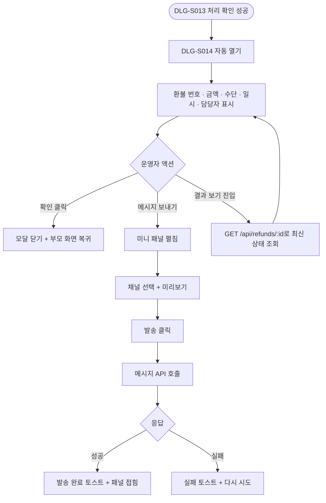
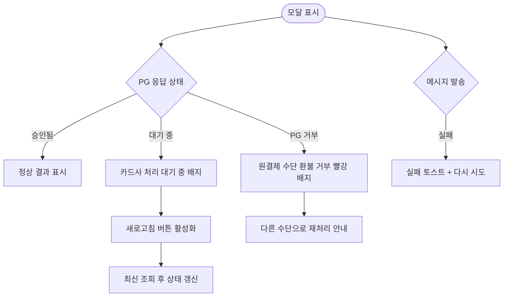

# DLG-S014 환불 상세 결과 다이얼로그

## 1. 메타 정보

| 항목 | 값 |
|---|---|
| 작성일 | 2026-05-22 |
| 버전 | v1.0 |
| 상태 | 정합화 완료 |
| 도메인 | D03 매출관리 |
| 다이얼로그 ID | DLG-S014 |
| 다이얼로그명 | 환불 상세 결과 |
| 부모 다이얼로그 | DLG-S013 환불 처리 |
| 기능코드 | PAY-02 (환불 관리), SAL-EXT-04 (결제 취소 / 부분 환불) |
| 계약코드 | PAY-02, SAL-EXT-04 |
| 우선순위 | P0 |
| 플랫폼 | 데스크톱, 태블릿 |

## 2. 다이얼로그 개요와 목적

환불 상세 결과 다이얼로그는 환불 처리 다이얼로그(DLG-S013)에서 환불이 정상적으로 완료된 직후 자동으로 열리는 결과 확인 모달입니다. 환불 번호, 환불 금액, 환불 수단, 처리 일시, 처리 담당자 같은 처리 완료 내역을 한 화면에 모아 보여주어, 운영자가 실수 없이 환불 결과를 확인하고 필요하면 회원에게 즉시 안내할 수 있도록 합니다. 이 모달은 입력을 받지 않는 결과 표시 전용 다이얼로그이며, 운영자가 확인 버튼을 누르면 모달이 닫히고 부모 화면인 환불 관리 목록 또는 매출 현황 화면으로 돌아갑니다.

## 3. 호출 트리거

이 모달은 DLG-S013 환불 처리에서 처리 확인 버튼을 눌러 환불이 성공적으로 완료된 직후에만 자동으로 표시됩니다. 운영자가 별도로 열 수 있는 버튼은 존재하지 않으며, 동일한 환불 건의 결과를 다시 보고 싶다면 환불 관리 화면(SCR-S007)의 목록 행에서 "결과 보기" 액션을 통해 같은 형태의 모달을 다시 열 수 있습니다. 결과 보기 진입 시에는 처리 일시가 과거이고, 새로 도착한 PG 응답이 있으면 그 부분이 갱신된 상태로 표시됩니다.

## 4. 레이아웃과 UI 구성

모달 상단에는 "환불 처리가 완료되었습니다"라는 성공 안내 문구가 큰 글씨로 표시되고, 그 옆에 녹색 체크 아이콘이 배치됩니다. 본문 첫 영역은 환불 번호 박스로, 시스템이 부여한 고유 환불 번호가 모노스페이스 폰트로 표시되며 옆에 복사 아이콘이 있어 운영자가 클립보드에 즉시 복사할 수 있습니다. 두 번째 영역은 환불 금액 표시 영역으로, 실제 환불된 금액이 가장 큰 폰트로 강조되며 천 단위 콤마가 포함됩니다. 부분 환불인 경우 "총 결제 X원 중 Y원 환불"이라는 보조 문구가 함께 표시됩니다. 세 번째 영역은 처리 정보 박스로, 환불 수단(원결제 수단·현금·포인트·플랫폼 잔여 캐시), 처리 일시(YYYY-MM-DD HH:MM:SS), 처리 담당자 이름, 처리한 지점, 원 매출 번호, 환불 사유가 표 형식으로 정리되어 표시됩니다. 네 번째 영역은 PG 응답 상태 박스로, 원결제 수단 환불인 경우 카드사 처리 상태(승인됨·대기 중·실패)와 카드사가 안내하는 예상 환불 완료일(보통 1~3 영업일)이 함께 표시됩니다. 모달 하단 우측에는 "확인" 버튼이 단독으로 배치되고, 좌측에는 보조로 "회원에게 안내 메시지 보내기" 링크가 표시됩니다.

## 5. 입력 필드와 검증 규칙

이 모달은 입력을 받지 않습니다. 단, 좌측 하단의 "회원에게 안내 메시지 보내기" 링크를 누르면 미니 입력 패널이 펼쳐지면서 발송 채널(푸시·SMS·카카오톡 알림톡)을 선택하고 미리 작성된 안내 메시지를 미리보기로 확인한 다음 발송을 실행할 수 있습니다. 메시지 발송은 선택 사항이며 모달을 닫는 데에는 영향을 주지 않습니다.

## 6. 확인/취소 버튼 동작

확인 버튼을 누르면 모달이 닫히고 부모 화면으로 돌아갑니다. 부모 화면은 이미 갱신된 상태(해당 건 상태가 "처리 완료")로 표시됩니다. ESC 키나 배경 클릭은 확인 버튼과 동일하게 동작하며, 결과 확인 자체는 운영자가 거부할 수 있는 단계가 아니므로 추가 확인 없이 즉시 닫힙니다.

## 7. 자식 모달과 후속 흐름

자식 모달은 없습니다. 회원에게 안내 메시지를 보내는 미니 패널은 같은 모달 안에서 펼쳐지는 영역이며 별도 모달로 분리되지 않습니다. 메시지 발송이 완료되면 미니 패널이 다시 접히면서 "안내 메시지를 발송했습니다" 토스트가 표시됩니다.

## 8. 토스트와 알림

모달이 처음 열릴 때는 별도 토스트가 표시되지 않고 모달 자체가 결과 표시 역할을 합니다. 안내 메시지 발송 시에만 발송 결과 토스트가 표시됩니다. 회원 측에는 환불 처리 시점에 이미 자동 푸시·SMS가 발송되었으므로 이 모달의 안내 메시지는 운영자가 수동으로 추가 안내가 필요할 때만 사용합니다.

## 9. 데이터 흐름과 외부 연동

이 모달은 DLG-S013의 처리 응답을 그대로 사용하여 표시하므로 별도 API 호출 없이 즉시 렌더됩니다. 결과 보기 진입(SCR-S007 목록에서 행 클릭)으로 열린 경우에는 `GET /api/refunds/:refundId`를 호출하여 최신 상태(PG 응답 갱신 포함)를 가져옵니다. PG 응답이 비동기로 도착하는 경우, 결과 보기로 다시 열 때 카드사 처리 상태가 "승인됨"으로 갱신되어 표시됩니다. 안내 메시지 발송 시에는 `POST /api/messages/refund-notice`가 호출되며 회원 ID, 환불 번호, 채널이 요청에 포함됩니다.

## 10. 화면 상태와 예외 처리

이 모달은 결과 표시 전용이므로 입력/수정 상태가 없습니다. PG 응답이 아직 도착하지 않은 경우 "카드사 처리 대기 중" 배지가 표시되며, 운영자가 새로고침 버튼을 누르면 최신 상태가 다시 조회됩니다. 환불이 PG에서 최종 실패한 경우(드물지만 한도 초과·만료 카드 등의 이유)에는 "원결제 수단 환불이 거부되었습니다. 다른 수단으로 환불을 진행해 주세요"라는 빨강 배지가 표시되고, 운영자에게는 환불 관리 화면에서 다시 처리할 수 있도록 안내됩니다. 이 경우 모달의 확인 버튼은 그대로 동작하지만, 부모 화면의 해당 건 상태는 "처리 완료"가 아닌 "PG 거부"로 표시됩니다.

## 11. 권한별 처리

이 모달은 DLG-S013의 후속 모달이므로 권한은 부모 모달의 진입 권한과 동일합니다. 슈퍼관리자, 본사 최고관리자, 센터장, 매니저는 처리 직후 결과 모달을 볼 수 있습니다. FC, 트레이너, 스태프, 프런트, readonly는 부모 모달에 진입할 수 없으므로 이 결과 모달도 만나지 않습니다. 단, SCR-S007 환불 관리 화면의 결과 보기 진입은 owner와 manager 이상만 가능하며, 그 외 권한은 결과 모달을 단독으로 열 수 없습니다. 안내 메시지 발송은 manager 이상이면 누구나 사용할 수 있습니다.

## 12. 메인 흐름

## 13. 에러와 예외 흐름

## 14. 핵심 디자인 요청사항

환불 금액은 모달에서 가장 큰 폰트로 표시되어 운영자가 일순간에 금액을 인식할 수 있어야 합니다. 환불 번호는 모노스페이스 폰트로 표시되어 다른 정보와 구분되고, 복사 아이콘은 호버 시 강조되어 운영자가 클립보드 복사를 쉽게 인지하게 합니다. PG 응답 상태 박스는 상태별 색상(승인됨=녹색·대기 중=노랑·거부=빨강)으로 즉시 인식 가능해야 합니다. 안내 메시지 보내기 링크는 본문 톤보다 약간 부드럽게 배치되어 보조 액션임을 표현하되, 클릭 시 펼쳐지는 패널은 명확하게 시각적으로 분리됩니다. 모달의 전체 분위기는 "완료"의 안정감을 주도록 녹색 계열을 메인으로 사용합니다.

## 15. 운영 정책

환불 결과는 처리 즉시 회원에게 푸시·SMS로 자동 발송되며, 운영자가 추가로 안내 메시지를 보내는 것은 선택 사항입니다. 원결제 수단 환불은 카드사 처리에 1~3 영업일이 소요되며 운영자는 PG 응답 갱신을 기다리지 말고 다음 업무로 넘어가도록 안내됩니다. 결과 모달은 처리 즉시 닫혀도 무방하며, 결과 확인이 필요할 때 SCR-S007 환불 관리에서 결과 보기로 언제든 다시 열 수 있습니다. 환불 번호는 영구 보존되어 향후 회계 감사·세금계산서 발행·회원 분쟁 응대 시 추적 키로 사용됩니다. PG가 환불을 최종 거부한 경우 환불 건의 상태는 자동으로 "PG 거부"로 변경되어 운영자가 다른 수단(현금·포인트·플랫폼 잔여 캐시)으로 재처리해야 하며, 거부 사유는 환불 관리 화면의 행 상세에 함께 표시됩니다.
