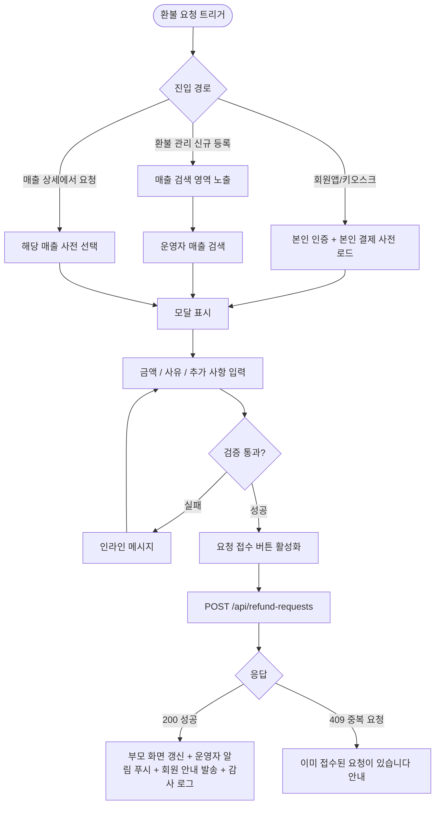
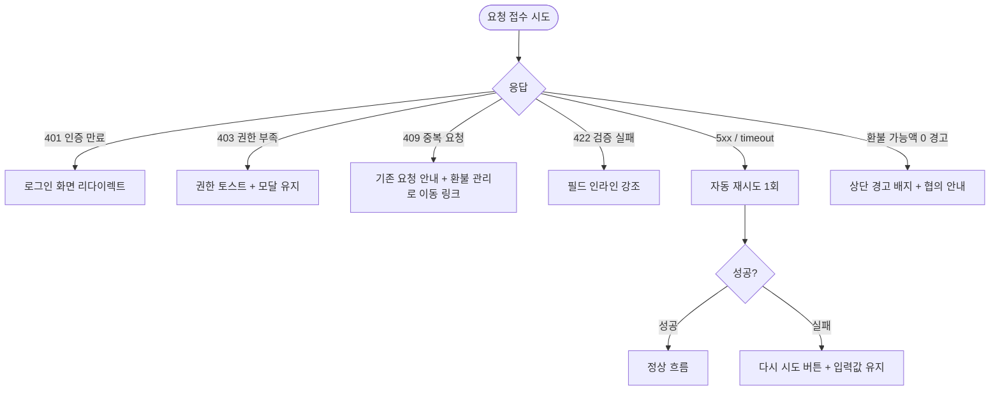

# DLG-S015 환불 요청 다이얼로그

## 1. 메타 정보

| 항목 | 값 |
|---|---|
| 작성일 | 2026-05-22 |
| 버전 | v1.0 |
| 상태 | 정합화 완료 |
| 도메인 | D03 매출관리 |
| 다이얼로그 ID | DLG-S015 |
| 다이얼로그명 | 환불 요청 |
| 부모 화면 | SCR-S007 환불 관리, DLG-S001 매출 상세, 회원앱 환불 요청 진입 |
| 기능코드 | PAY-02 (환불 관리), SAL-EXT-04 (결제 취소 / 부분 환불) |
| 계약코드 | PAY-02, SAL-EXT-04 |
| 우선순위 | P0 |
| 플랫폼 | 데스크톱, 태블릿, 모바일(회원앱 진입 시) |

## 2. 다이얼로그 개요와 목적

환불 요청 다이얼로그는 회원 또는 직원이 환불을 처음 접수하는 첫 단계 모달입니다. 환불 대상 결제 건과 요청 금액, 요청 사유를 입력해 환불 관리 화면(SCR-S007)의 미처리 목록에 등록하는 역할만 담당하며, 실제 환불 처리(금액 확정·PG 호출·이력 기록)는 이후 운영자가 환불 처리 다이얼로그(DLG-S013)에서 별도로 진행합니다. 이 분리 구조는 회원의 환불 요청을 즉시 받아들이되 처리 전 운영자가 검토·승인 단계를 거치도록 하여, 사용분 차감·위약금·중복 결제 같은 정책 판단이 필요한 케이스를 운영자가 통제할 수 있게 합니다.

## 3. 호출 트리거

이 모달이 열리는 경로는 세 가지입니다. 첫째, 회원이 회원앱이나 키오스크에서 결제 이력을 보다가 "환불 요청" 버튼을 누르면 모바일 풀스크린 모달로 열립니다. 둘째, 직원이 환불 관리 화면(SCR-S007)에서 "새 환불 요청 등록" 버튼을 누르면 데스크톱 모달로 열리며, 직원이 회원 대신 요청을 접수하는 경우입니다. 셋째, 매출 상세 다이얼로그(DLG-S001)에서 결제 건을 보다가 "환불 요청" 버튼을 누르면 그 결제 건이 사전 선택된 상태로 열립니다.

## 4. 레이아웃과 UI 구성

모달 상단에는 "환불 요청"이라는 제목과 닫기(X) 아이콘이 표시되고, 그 아래에 요청자 구분(회원 본인 요청·직원 대리 접수) 배지가 함께 표시되어 누가 요청하는지를 시각적으로 명확히 합니다. 본문 첫 영역은 환불 대상 매출 박스로, 결제일·상품명·결제 수단·결제 금액이 읽기 전용 카드로 표시됩니다. 부모 화면에서 매출 건이 사전 선택된 경우 이 박스는 자동으로 채워지고, 환불 관리 화면에서 신규 등록으로 진입한 경우에는 매출 검색 입력 필드가 먼저 노출되어 회원명·연락처·매출 번호로 매출 건을 찾을 수 있습니다. 두 번째 영역은 환불 요청 금액 입력 영역으로, "전체 환불"과 "부분 환불" 라디오 버튼이 있고 부분 환불 선택 시 금액 입력 필드가 활성화됩니다. 세 번째 영역은 환불 요청 사유 영역으로, 사전 정의된 사유 드롭다운(고객 변심·서비스 불만·중복 결제·기기 오작동·기타)과 직접 입력 텍스트 박스가 함께 배치되며 "기타" 선택 시 직접 입력이 필수가 됩니다. 네 번째 영역은 추가 요청 사항 입력 영역(선택)으로, 회원이 전달하고 싶은 추가 내용을 자유 입력합니다. 모달 하단 우측에는 "요청 접수"와 "취소" 버튼이 배치됩니다.

## 5. 입력 필드와 검증 규칙

환불 요청 금액은 0보다 크고 결제 금액 이하여야 하며, 전체 환불 선택 시에는 결제 금액이 자동 입력되어 잠깁니다. 부분 환불에서 결제 금액을 초과하는 입력은 "결제 금액을 초과할 수 없습니다"라는 인라인 오류로 차단됩니다. 환불 요청 사유는 필수 선택이고, "기타"를 고른 경우 직접 입력 필드가 최소 5자 이상이어야 요청 접수 버튼이 활성화됩니다. 회원 본인 요청 모드에서는 회원 신원 검증(앱 로그인 또는 키오스크 본인 인증)이 사전에 완료되어 있어야 하며, 직원 대리 접수 모드에서는 직원의 권한(staff 이상)이 검증됩니다. 동일 결제 건에 대해 이미 미처리 환불 요청이 존재하는 경우 신규 요청 등록이 차단되고 "이미 접수된 환불 요청이 있습니다"라는 안내가 표시됩니다.

## 6. 확인/취소 버튼 동작

요청 접수 버튼을 누르면 버튼이 비활성화되고 스피너가 표시되며 백엔드에 요청 등록 API가 호출됩니다. 성공하면 모달이 닫히고 부모 화면이 갱신됩니다. 환불 관리 화면에서 호출한 경우 미처리 목록에 새 행이 추가되고, 매출 상세에서 호출한 경우 매출 상세에 "환불 요청 접수됨" 배지가 추가됩니다. 회원앱에서 호출한 경우에는 회원에게 "환불 요청이 접수되었습니다. 담당자 확인 후 처리됩니다" 화면으로 전환됩니다. 취소 버튼이나 ESC, 배경 클릭은 모달을 닫으며 입력 도중에는 한 번 더 확인을 묻습니다.

## 7. 자식 모달과 후속 흐름

자식 모달은 없습니다. 요청 접수 성공 후 운영자가 별도로 환불 처리 다이얼로그(DLG-S013)를 열어 실제 환불을 진행합니다. 회원이 요청을 접수한 직후에는 운영자에게 알림 센터를 통해 신규 환불 요청 알림이 푸시되어, 운영자가 즉시 환불 관리 화면으로 진입할 수 있도록 안내됩니다.

## 8. 토스트와 알림

요청 접수 성공 시 회원 측 화면에는 "환불 요청이 접수되었습니다"라는 큰 성공 안내가 표시되고, 직원 화면에는 우측 상단 토스트로 "환불 요청이 접수되었습니다 (환불관리 #N으로 이동)"이 표시됩니다. 운영자에게는 알림 센터를 통해 신규 요청 알림이 즉시 푸시됩니다. 회원에게는 푸시·SMS로 "환불 요청이 접수되었습니다. 1~2 영업일 안에 처리 결과를 안내드립니다"가 자동 발송됩니다.

## 9. 데이터 흐름과 외부 연동

매출 검색 시에는 `GET /api/sales?search=X`가 호출되어 매출 건을 조회합니다. 요청 등록 시에는 `POST /api/refund-requests`가 호출되며 요청 바디에 paymentId, requesterType(member/staff), requesterId, amount, reason, additionalNote가 들어갑니다. 응답에는 요청 ID와 상태(`PENDING`)가 포함됩니다. 동일 결제 건에 대한 기존 미처리 요청 존재 검증은 백엔드에서 자동으로 수행되며, 존재 시 409 응답으로 차단됩니다. 운영자 알림은 NFR-19 알림 센터를 통해 발송되며, 회원 알림은 NFR-13 자동 알림 엔진(만료 알림과 동일 인프라)을 사용해 발송됩니다. 모든 요청 접수는 감사 로그(SCR-097)에 actor_id, payment_id, requester_type, amount, reason, timestamp로 기록됩니다.

## 10. 화면 상태와 예외 처리

기본 표시·입력/수정 중·저장/처리 중·완료·실패 5개 상태를 가집니다. 매출 검색 중에는 검색 결과 영역에 스켈레톤이 표시되며, 검색 결과 0건일 때는 "해당 조건의 매출이 없습니다"라는 빈 상태가 표시됩니다. 예외 처리는 다음과 같습니다. 동일 결제 건의 기존 미처리 요청이 있으면 409로 차단됩니다. 회원 본인 요청 모드에서 인증이 만료된 경우 401 응답과 함께 모달이 닫히고 로그인 화면으로 리다이렉트됩니다. 네트워크 오류는 자동 재시도 1회 후 사용자 대기로 전환됩니다. 환불 가능액이 0원으로 자동 계산되는 경우(예: 이미 전액 사용분 차감)에는 모달 상단에 경고 배지가 표시되어 운영자가 요청 접수 전에 회원과 다시 협의하도록 안내합니다.

## 11. 권한별 처리

슈퍼관리자(superAdmin), 본사 최고관리자(primary), 센터장(owner), 매니저(manager)는 직원 대리 접수 모드로 어떤 회원의 환불 요청도 등록할 수 있습니다. FC(fc), 스태프(staff), 프런트(front)는 본인 지점 회원의 요청 접수만 가능하며, 등록 후 본인의 처리 권한이 없으므로 자동으로 환불 관리의 미처리 목록에 들어가 운영자가 후속 처리하도록 흐름이 분리됩니다. 트레이너(trainer)는 환불 요청 접수 권한이 없습니다. readonly는 접근 불가입니다. 회원 본인 요청 모드(회원앱·키오스크 진입)는 본인 인증을 거친 회원만 진입 가능하며, 본인이 결제한 건에 대해서만 요청할 수 있고 다른 회원의 결제 건에 대한 요청 시도는 자동 차단됩니다.

## 12. 메인 흐름

## 13. 에러와 예외 흐름

## 14. 핵심 디자인 요청사항

요청자 구분 배지는 모달 상단에 명확히 표시되어, 직원이 회원 대리로 요청을 접수하는 경우와 회원이 본인 요청을 접수하는 경우가 시각적으로 구분되어야 합니다. 매출 정보 박스는 읽기 전용임이 명확하도록 흐린 배경 톤으로 처리하고, 금액 입력 필드는 강조 톤으로 운영자의 주의를 끕니다. 회원앱·키오스크 진입 시에는 풀스크린 모달로 전환되어 모바일 사용성을 최우선으로 하며, 입력 필드는 큰 터치 영역과 명확한 라벨로 디자인됩니다. 사유 드롭다운은 가장 자주 사용되는 사유(고객 변심·중복 결제) 두 개가 상단에 고정되어 빠른 선택이 가능하게 합니다. 요청 접수 후 회원 화면에는 안심을 주는 녹색 톤의 성공 카드가 표시되며, 다음 처리 일정에 대한 안내가 함께 보입니다.

## 15. 운영 정책

환불 요청은 접수와 처리가 분리되어 있어 회원의 요청이 즉시 시스템에 들어오되 운영자가 검토·승인 단계를 거칠 수 있도록 설계되었습니다. 이 분리는 사용분 차감·위약금·중복 결제 같은 정책 판단이 필요한 케이스에서 운영자가 통제권을 가지기 위함입니다. 동일 결제 건에 대한 중복 요청은 차단되어, 회원이 같은 건을 여러 번 접수하는 혼선을 막습니다. 회원이 요청한 후 운영자가 처리하기까지의 표준 SLA는 1~2 영업일로 안내되며, 그 안에 처리되지 않으면 본사 알림으로 에스컬레이션됩니다. 회원이 요청을 취소하고 싶은 경우(처리 전), 회원앱에서 동일 결제 건의 환불 요청 상세에서 "요청 취소" 액션을 사용할 수 있으며 그 액션은 환불 관리의 해당 행을 자동 삭제합니다. 처리가 시작된 후에는 회원이 직접 취소할 수 없고 운영자에게 연락이 필요합니다. 환불 요청 접수 자체는 별도 결제 처리 비용을 발생시키지 않으며, 실제 PG 호출은 환불 처리 단계(DLG-S013)에서만 일어납니다.
