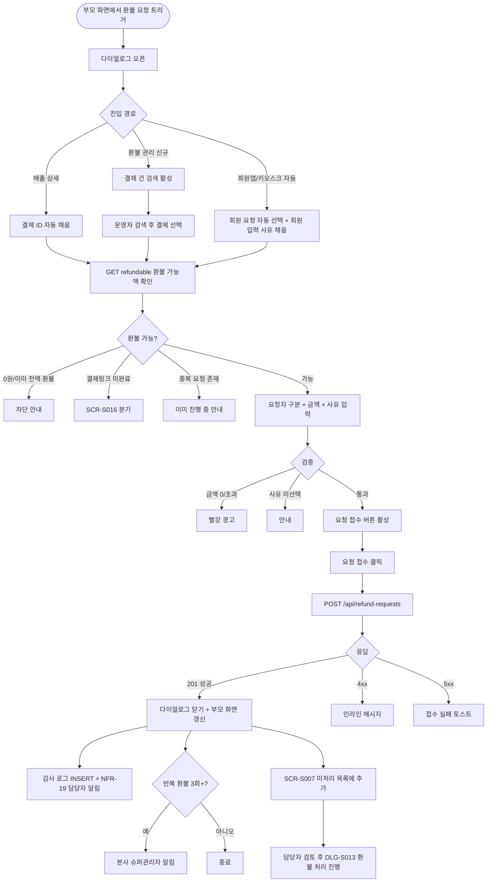
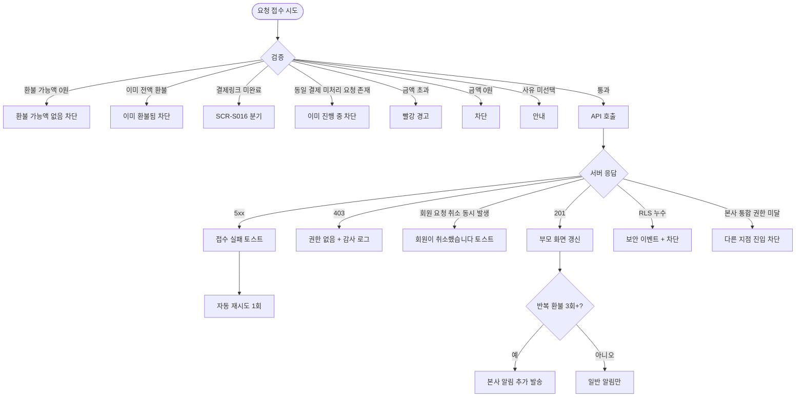

# DLG-S015 환불 요청 다이얼로그

## 1. 다이얼로그 메타 정보

이 문서는 회원 또는 직원이 환불 요청을 시스템에 접수하는 첫 번째 단계인 환불 요청 다이얼로그(DLG-S015)에 대한 자기완결형 요구사항 정의서입니다. 외부 문서 없이도 이 문서 한 장만으로 호출 트리거, 입력 폼, 검증, 확인·취소 동작, 부모 화면 갱신, 권한, 예외 처리, 운영 정책까지 모두 이해해 구현·운영할 수 있도록 작성합니다.

| 항목 | 값 |
|---|---|
| 작성일 | 2026-05-22 |
| 버전 | v1.0 |
| 상태 | 최신 통합본 반영 (정합화 완료) |
| 도메인 | D03 매출관리 |
| 다이얼로그 ID | DLG-S015 |
| 다이얼로그명 | 환불 요청 |
| 다이얼로그 유형 | 입력형 모달 (저장 후 닫힘, 실제 환불 처리는 DLG-S013에서) |
| 호출 트리거 | DLG-S001 매출 상세의 "환불 요청" 버튼, SCR-S007 환불 관리의 "새 환불 요청 등록" 버튼, 회원앱/키오스크에서 회원이 환불 요청 진입 시 운영자 화면에 자동 표시 |
| 부모 화면 | DLG-S001 매출 상세, SCR-S007 환불 관리 |
| 기능코드 | PAY-02 (환불 관리), SAL-EXT-04 (결제 취소·부분 환불) |
| 계약코드 | PAY-02 |
| 권한 9역할 | superAdmin / primary / owner / manager / fc / staff / trainer / front / readonly |
| 사용 가능 권한 | superAdmin, primary, owner, manager, fc, staff, front (모든 운영자가 요청 접수 가능) |
| 사용 불가 | trainer, readonly |
| 연결 API | `POST /api/refund-requests` (환불 요청 접수), `GET /api/payments/:paymentId/refundable` (환불 가능 여부 사전 확인) |
| 후속 처리 | SCR-S007 환불 관리의 미처리 목록 추가, 담당자에게 NFR-19 알림 발송 |
| 감사 로그 | SCR-097에 `refund_request_create` 액션 기록 (`actor_id`, `payment_id`, `requester_type`, `request_amount`, `reason`) |

## 2. 다이얼로그 목적과 사용 맥락

환불 요청 다이얼로그는 환불의 첫 단계로, 실제 환불 처리(DLG-S013)에 들어가기 전에 회원 또는 직원이 요청 사실과 사유를 시스템에 명시적으로 등록하는 접수형 입력 모달입니다. PAY-02·SAL-EXT-04 운영 시나리오에서 환불 요청과 실제 처리를 분리해 책임 있는 담당자가 검토 후 처리하는 흐름의 시작점입니다. 회원이 직접 앱이나 키오스크에서 환불을 요청한 경우 운영자 화면에 자동으로 이 다이얼로그가 떠 운영자가 요청을 검토할 수 있도록 흐름이 연결됩니다.

이 다이얼로그가 다루는 운영 흐름은 네 가지입니다. 첫째는 회원 직접 요청 흐름으로, 회원이 앱·키오스크·고객센터를 통해 환불 요청을 시작하고 운영자가 그 요청을 시스템에 등록합니다. 둘째는 직원 대리 요청 흐름으로, 회원이 전화로 환불을 요청했을 때 운영자가 회원을 대신해 요청을 등록합니다. 셋째는 매출 상세 진입 흐름으로, 운영자가 DLG-S001에서 결제 건을 확인하다가 환불이 필요하다고 판단해 요청을 등록합니다. 넷째는 환불 관리 신규 등록 흐름으로, SCR-S007에서 운영자가 직접 새 환불 요청을 만듭니다.

다이얼로그는 환불 요청 정보(요청자·요청 금액·요청 사유)만 받아 시스템에 등록하며, 실제 환불 처리는 별도 흐름(DLG-S013)에서 진행됩니다. 이 분리 구조는 환불 요청의 책임 추적성과 처리 권한의 분리를 보장합니다.

## 3. 호출 트리거와 부모 화면 컨텍스트

이 다이얼로그는 다음 세 가지 진입점에서 호출됩니다.

첫 번째 진입점은 DLG-S001 매출 상세 다이얼로그의 "환불 요청" 버튼입니다. 부모는 결제 ID를 컨텍스트로 전달하며, 다이얼로그는 결제 정보(매출 번호·금액·상품명)를 자동 채움 상태로 시작합니다.

두 번째 진입점은 SCR-S007 환불 관리 페이지의 "새 환불 요청 등록" 버튼입니다. 부모는 빈 컨텍스트를 전달하며, 운영자는 환불 대상 결제 건을 다이얼로그 안에서 검색해야 합니다.

세 번째 진입점은 회원앱/키오스크에서 회원이 환불 요청을 시작했을 때 운영자 화면에 자동 노출되는 알림 다이얼로그입니다. 회원이 입력한 요청 사유와 요청 금액이 이미 채워진 상태로 운영자에게 표시되며, 운영자는 요청 사실을 확인해 시스템에 등록합니다.

다이얼로그가 받는 컨텍스트는 결제 ID(있을 경우), 요청자 종류(`MEMBER` / `STAFF`), 회원이 입력한 사유 미리보기(있을 경우), 진입 경로 식별자, 부모 화면 식별자입니다.

## 4. 레이아웃과 UI 구성

다이얼로그는 데스크톱에서 가로 560px의 중앙 정렬 모달이고, 모바일에서는 풀너비 시트로 표시됩니다. 위에서 아래로 다음 영역이 순차 배치됩니다.

가장 위에는 헤더가 있습니다. 좌측에 "환불 요청" 제목, 우측 끝에 X 닫기 버튼이 있습니다. 헤더 아래에 진입 경로 안내 라벨이 표시됩니다("회원 요청 접수" / "직원 등록" / "매출 상세에서 진입").

헤더 아래에는 환불 대상 매출 카드가 있습니다. 매출 ID가 컨텍스트로 전달된 경우 매출 번호·결제일·상품명·결제 금액이 읽기 전용으로 표시됩니다. 신규 등록 경로(매출 ID 없음)에서는 결제 건 검색 입력란(회원명·상품명·결제일·결제 ID 중 선택)이 표시되어, 운영자가 검색 후 매출 행을 선택하면 정보가 채워집니다. 검색은 디바운스 300ms가 적용되며, SAL-EXT-04 검색 규칙과 동일하게 동작합니다.

매출 카드 아래에는 요청자 구분 영역이 있습니다. 라디오로 "회원 요청"과 "직원 등록" 중 선택합니다. 진입 경로가 회원앱/키오스크인 경우 "회원 요청"이 자동 선택되고 변경 불가입니다. 매출 상세나 환불 관리에서 직접 진입한 경우에는 운영자가 선택할 수 있으며, 기본값은 "직원 등록"입니다.

그 아래에는 환불 가능액 안내 카드가 있습니다. `GET /api/payments/:paymentId/refundable` 응답으로 받은 환불 가능액(원결제 - 기환불 누계 - 위약금 - 기사용)이 표시되어 운영자가 가능 범위를 즉시 파악할 수 있습니다. 환불 가능액이 0원이면 빨강 안내 ("더 이상 환불할 금액이 없습니다")가 표시되고 요청 접수 자체가 차단됩니다.

환불 가능액 카드 아래에는 환불 요청 금액 입력란이 있습니다. 라디오로 "전체 환불"과 "부분 환불" 중 선택합니다. 전체 환불을 선택하면 환불 가능액 전액이 자동 입력되고 잠금됩니다. 부분 환불을 선택하면 운영자가 직접 금액을 입력할 수 있고, 환불 가능액을 초과하면 빨강 경고가 표시됩니다.

그 아래에는 환불 요청 사유 영역이 있습니다. 라디오로 5종 사유(단순 변심·결제 오류·회원 요청·서비스 불만·기타)를 선택하고, "기타" 선택 시 자유 입력 textarea가 노출됩니다. 다른 카테고리를 선택해도 추가 의견 textarea가 함께 표시되며 입력은 선택입니다. 회원이 앱/키오스크에서 입력한 사유가 컨텍스트로 들어오면 자유 입력 textarea에 미리 채워지며 운영자가 수정 가능합니다.

마지막은 추가 요청 사항 입력란(선택)입니다. 자유 형식 textarea로 최대 500자까지 입력 가능하며, 회원이 추가로 전달하고 싶은 내용이나 직원의 메모를 적을 수 있습니다.

다이얼로그 가장 아래에는 액션 바가 있습니다. 우측에 회색 "취소" 버튼과 강조색 "요청 접수" 버튼이 나란히 놓입니다. 요청 접수 버튼은 모든 필수 입력이 완료되고 환불 가능액이 0원이 아닐 때 활성화됩니다.

## 5. 입력 검증과 환불 가능 사전 확인

환불 요청은 다음 검증을 순서대로 통과해야 등록됩니다.

첫째, 결제 건 선택 검증입니다. 환불 대상 매출이 선택되어 있어야 하며, 미선택 시 요청 접수 버튼이 비활성화됩니다.

둘째, 환불 가능 여부 사전 확인입니다. `GET /api/payments/:id/refundable` 응답이 환불 가능액 0원이면 SAL-EXT-04 정책에 따라 요청 접수가 차단됩니다.

셋째, 결제링크 미완료 검증입니다. 결제링크가 미완료 상태인 결제는 환불 대상이 아니며, SCR-S016 링크 취소 안내로 분기됩니다.

넷째, 이미 전액 환불 검증입니다. 결제가 이미 전액 환불된 상태이면 "이미 전액 환불된 건입니다" 안내와 함께 요청 접수가 차단됩니다.

다섯째, 환불 요청 금액 검증입니다. 1원 이상 환불 가능액 이하여야 합니다. 0원이나 음수, 또는 가능액 초과는 차단됩니다.

여섯째, 환불 사유 카테고리 선택 검증입니다. 5종 중 하나는 반드시 선택해야 하며 미선택 시 요청 접수 버튼이 비활성화됩니다.

일곱째, 권한 검증입니다. trainer·readonly는 다이얼로그가 열리지 않습니다.

여덟째, 요청자 종류 검증입니다. "회원 요청" 또는 "직원 등록" 중 하나를 선택해야 하며, 진입 경로에 따라 기본값이 다릅니다.

## 6. 확인·취소 동작과 부모 화면 갱신

요청 접수 버튼을 누르면 다이얼로그는 즉시 로딩 상태로 전환되어 모든 버튼이 비활성화되고, 요청 접수 버튼 라벨이 "접수 중..."으로 바뀝니다.

성공 응답(201)이 도착하면 다이얼로그가 자동으로 닫히고 부모 화면에 "환불 요청이 접수되었어요" 토스트가 표시됩니다.

부모 화면별로 다음 갱신이 일어납니다. 부모가 DLG-S001 매출 상세이면 매출 상세에 환불 요청 행이 추가되고, 매출 상태가 "환불 요청 접수됨"으로 갱신됩니다. 부모가 SCR-S007 환불 관리이면 미처리 목록에 새 요청 행이 추가되고, 요약 카드의 "처리 중 환불"이 1 증가합니다. 회원앱/키오스크 진입의 경우 회원에게 "요청이 접수되었습니다" 안내가 회원앱 측에 전달됩니다.

성공 처리는 동시에 다음 시스템 영향을 미칩니다. SCR-097 감사 로그에 `refund_request_create` 액션이 적재되고 actor_id·payment_id·requester_type·request_amount·reason이 함께 기록됩니다. NFR-19 알림 센터를 통해 담당자(매니저 이상 권한자)에게 "새 환불 요청이 접수되었어요" 알림이 발송됩니다. SAL-EXT-04 "반복 환불 회원 알림" 정책에 따라 동일 회원이 3회 이상 환불 요청을 보낸 경우 본사 슈퍼관리자에게도 별도 알림이 발송됩니다.

이 시점에서는 아직 실제 환불 처리가 일어나지 않으며, 매출 차감·포인트 회복·PG 환불 같은 후속 처리는 모두 DLG-S013 환불 처리 단계에서 진행됩니다.

실패 응답이 오면 다이얼로그는 닫히지 않고 입력 내용이 보존됩니다. 4xx 입력 오류는 사유가 인라인 메시지로 표시되며, 5xx 서버 오류는 빨강 토스트가 뜨고 사용자의 다시 시도 액션을 기다립니다.

취소 버튼은 입력 변경이 없으면 즉시 닫히고, 변경된 상태에서는 "변경 사항이 사라집니다. 닫으시겠습니까?" 확인 팝업이 표시됩니다. ESC 키와 배경 클릭도 취소와 동일합니다.

## 7. 화면 상태

기본 표시 상태는 다이얼로그가 갓 열린 직후의 상태로, 진입 경로에 따라 일부 필드가 자동 채워져 있습니다.

결제 건 검색 중 상태는 신규 등록 경로에서 결제 건을 검색하는 상태로, 검색 결과가 드롭다운으로 표시됩니다.

환불 가능액 0원 상태는 환불 가능액이 0원인 결제 건을 선택한 상태로, 빨강 안내와 함께 요청 접수가 차단됩니다.

이미 전액 환불 상태는 결제가 이미 전액 환불된 상태로, 차단 안내가 표시됩니다.

결제링크 미완료 상태는 미완료 결제링크에 대한 요청 시도로, SCR-S016 안내로 분기됩니다.

전체 환불 선택 상태는 환불 금액이 자동 채워지고 잠금된 상태입니다.

부분 환불 선택 상태는 운영자가 직접 금액을 입력하는 상태입니다.

금액 초과 입력 상태는 환불 가능액을 초과하는 금액을 입력한 상태로, 빨강 경고와 함께 요청 접수 버튼이 비활성화됩니다.

회원 요청 자동 표시 상태는 회원이 앱/키오스크에서 요청을 시작해 운영자 화면에 자동 노출된 상태로, 요청자 구분이 "회원 요청"으로 잠겨 있고 회원이 입력한 사유가 미리 채워져 있습니다.

접수 중 상태는 요청 접수 버튼을 누른 직후로, 모든 입력이 잠기고 버튼이 "접수 중..."으로 표시됩니다.

접수 완료 상태는 API 성공 응답을 받은 직후로, 다이얼로그가 자동으로 닫히고 부모 화면이 갱신됩니다.

반복 환불 회원 경고 상태는 동일 회원이 3회 이상 환불 요청을 한 경우로, 회원명 옆에 "주의 - 반복 환불 회원" 라벨이 표시됩니다.

권한 부족 상태는 trainer·readonly의 직접 진입 시도로, 다이얼로그가 열리지 않습니다.

## 8. 예외 처리

환불 가능액 0원 결제 건 선택 시 SAL-EXT-04 정책에 따라 차단되며 안내가 표시됩니다.

결제링크 미완료 시도는 SCR-S016 링크 취소로 분기 안내됩니다.

이미 전액 환불 시도는 차단되며 안내가 표시됩니다.

금액 초과 입력은 인라인 빨강 경고로 차단됩니다.

금액 0원/음수 입력은 차단됩니다.

사유 카테고리 미선택은 요청 접수 버튼 비활성화로 차단됩니다.

같은 결제 건에 대한 환불 요청이 이미 미처리 상태로 존재하는 경우 "이미 진행 중인 환불 요청이 있어요" 안내가 표시되고 신규 접수가 차단됩니다. 운영자는 SCR-S007에서 기존 요청을 확인하도록 안내됩니다.

반복 환불 회원(3회 이상) 감지 시 회원명 옆에 "주의" 라벨이 표시되며, 접수 자체는 진행되지만 운영자가 추가 검토를 할 수 있도록 안내됩니다.

권한 부족(403)은 모달 닫기와 함께 부모 화면에 토스트가 표시되고 감사 로그에 권한 우회 시도가 기록됩니다.

네트워크 오류로 접수가 실패하면 "요청 접수에 실패했어요" 빨강 토스트가 표시되고 입력 내용은 보존됩니다.

회원이 앱/키오스크에서 요청을 보냈는데 운영자가 다이얼로그를 열기 전에 회원이 요청을 취소한 경우, 다이얼로그가 자동으로 닫히고 "회원이 요청을 취소했습니다" 토스트가 표시됩니다.

본사 통합 모드 권한 미달 상태에서 다른 지점 결제 건에 대한 요청 시도는 다이얼로그가 열리지 않습니다.

## 9. 권한별 처리

슈퍼관리자(superAdmin)와 본사 최고관리자(primary)는 전체 지점의 환불 요청을 접수할 수 있습니다.

Owner(지점장)과 매니저(manager)는 자기 지점의 환불 요청을 접수할 수 있습니다.

FC(fc)는 담당 회원의 환불 요청을 접수할 수 있습니다.

스태프(staff)와 프런트(front)는 자기 지점의 환불 요청을 접수할 수 있습니다. PAY-02 권한 매트릭스에서 staff·front는 매출 조회만 가능하지만, 환불 요청은 접수 단계로 처리 단계가 아니므로 요청 접수까지는 허용됩니다(실제 환불 처리는 DLG-S013에서 매니저+ 가 진행).

트레이너(trainer)와 읽기 전용(readonly)은 다이얼로그가 열리지 않습니다.

권한 우회 시도(직접 API 호출)는 403으로 차단되고 감사 로그에 기록됩니다.

## 10. 운영 정책

이 다이얼로그는 PAY-02·SAL-EXT-04 환불 운영의 첫 단계이며, 환불 요청과 실제 처리를 분리해 책임 추적성과 권한 분리를 보장하는 정책의 시각화입니다.

요청자 구분(회원/직원)은 환불 요청의 출처를 명확히 기록해 사후 분석에 활용하는 정책의 결과이며, 회원 직접 요청과 직원 대리 등록을 구분합니다.

환불 가능 사전 확인은 SAL-EXT-04 환불 계산 박스의 결과를 미리 보여줘 운영자가 무의미한 요청을 등록하지 않도록 보호합니다.

이미 전액 환불 차단은 SAL-EXT-04 "이미 전액 환불 차단" 정책의 시각화이며, 중복 요청을 사전에 방지합니다.

결제링크 미완료 차단은 SAL-EXT-04 "결제링크 미완료: 환불이 아닌 링크 취소" 정책의 결과이며, 운영자를 올바른 흐름(SCR-S016)으로 안내합니다.

요청 사유 5종 카테고리는 SAL-EXT-04 "사유 카테고리: 단순 변심 / 결제 오류 / 회원 요청 / 서비스 불만 / 기타" 정책의 시각화이며, 환불 사유 패턴 분석에 활용됩니다.

반복 환불 회원 경고는 SAL-EXT-04 "반복 환불 회원 알림: 동일 회원 3회 이상 환불 시 운영자 알림" 정책의 시각화이며, 마케팅·CS 대응에 활용됩니다.

동일 결제 건의 중복 환불 요청 차단은 운영 정합성을 위한 정책이며, 같은 결제에 미처리 요청이 이미 존재하면 신규 접수가 차단됩니다.

NFR-19 담당자 알림은 환불 요청이 빠뜨려지지 않고 즉시 검토되도록 보장하는 정책이며, 매니저 이상에게 자동 발송됩니다.

다지점 RLS 격리는 본사 통합 모드가 아닌 경우 자기 지점 결제 건만 요청 가능하다는 보안 정책의 결과입니다.

권한 매트릭스(staff·front까지 요청 접수 가능, trainer·readonly 차단)는 요청 접수와 실제 처리의 권한 분리 정책의 결과이며, 모든 운영자가 회원 요청을 즉시 시스템에 등록할 수 있도록 보장합니다.

감사 로그 적재(`refund_request_create`)는 환불 운영의 책임 추적성을 보장하며, 누가 언제 어떤 결제에 어떤 사유로 환불을 요청했는지가 사후에도 재구성 가능합니다.

이 다이얼로그는 실제 환불 처리를 수행하지 않으며, 매출 차감·포인트 회복·PG 환불 같은 후속 처리는 모두 DLG-S013에서 진행됩니다. 이 분리 구조는 권한 분리와 검토 단계 보장을 위한 정책입니다.

## 11. 메인 흐름 (F2)

## 12. 에러와 예외 흐름 (F8)

## 13. 핵심 디자인 요청사항

환불 대상 매출 카드는 운영자가 잘못된 결제 건에 요청을 등록하는 사고를 막기 위해 매출 번호와 회원명이 명확히 강조되어 표시됩니다.

환불 가능액 안내 카드는 운영자의 의사결정 근거이므로 한눈에 보이도록 강조 영역으로 표시되며, 0원이면 즉시 빨강 톤으로 전환되어 차단됨을 시각적으로 알립니다.

요청자 구분 라디오는 두 옵션이 시각적으로 동등하게 배치되며, 회원앱/키오스크 진입의 경우 자동 선택과 잠금 상태가 명확히 표시되어 운영자가 무의식적으로 변경하지 않도록 보호합니다.

환불 요청 금액 입력은 전체/부분 라디오 선택에 따라 입력란 상태가 명확히 분기되며, 부분 환불 선택 시에만 직접 입력 가능 상태로 전환됩니다.

환불 사유 라디오는 5종이 한눈에 비교 가능하게 배치되고, "기타" 선택 시 자유 입력 textarea가 부드럽게 펼쳐집니다. 회원이 미리 입력한 사유가 자유 입력란에 채워진 경우 "회원 입력" 작은 배지가 함께 표시되어 운영자가 출처를 인식할 수 있게 합니다.

반복 환불 회원 경고는 회원명 옆에 "주의" 라벨로 자연스럽게 표시되어, 운영자가 추가 검토 필요성을 인지하면서도 회원 응대에 부정적 인상을 주지 않도록 톤을 조절합니다.

요청 접수 버튼은 검증 통과 시에만 강조색으로 활성화되며, 검증 미통과 시 회색 비활성과 호버 툴팁으로 사유가 안내됩니다.

접수 중 상태에서는 버튼에 스피너가 표시되고 다이얼로그가 어둡게 처리되어 처리 진행을 명확히 알립니다.

성공 후 부모 화면 갱신은 즉시 일어나며, SCR-S007이 부모인 경우 새 요청 행이 미처리 목록 최상단에 강조 배경색으로 잠시 깜빡인 후 안정화되어 운영자가 방금 생성된 행을 즉시 인식할 수 있게 합니다.

모바일에서는 풀너비 시트로 전환되고, 환불 대상 매출 카드와 환불 가능액 안내가 화면 상단에 우선 표시됩니다.

## 14. 운영 정책 (이 다이얼로그에 연결된 부분)

이 다이얼로그가 따르는 운영 정책은 환불의 첫 단계로서 요청 접수와 실제 처리의 분리 원칙을 시각화한 것입니다.

요청과 처리 분리는 PAY-02·SAL-EXT-04 환불 운영의 핵심 정책이며, 모든 운영자가 환불 요청을 즉시 시스템에 등록할 수 있게 하면서도 실제 처리는 매니저 이상 권한자가 검토 후 진행하도록 권한을 분리합니다.

환불 가능 사전 확인은 운영 효율성을 위한 정책이며, 운영자가 처리 단계에서야 알 수 있는 차단 사유(이미 전액 환불·결제링크 미완료 등)를 요청 단계에서 미리 알려 무의미한 요청 등록을 사전에 차단합니다.

요청자 구분(회원/직원)은 환불 요청의 출처를 명확히 기록해 사후 분석에 활용하는 정책이며, 회원 직접 요청과 직원 대리 등록의 비율이 운영 품질 지표로 사용됩니다.

요청 사유 5종 카테고리는 SAL-EXT-04 사유 정책의 결과이며, 환불 사유 분포가 정기적으로 분석되어 운영 개선에 활용됩니다.

반복 환불 회원 경고는 SAL-EXT-04 "반복 환불 회원 알림: 동일 회원 3회 이상 환불 시 운영자 알림" 정책의 시각화이며, 마케팅·CS 대응 자료로 활용됩니다.

동일 결제 건의 중복 요청 차단은 운영 정합성을 위한 정책이며, 같은 결제에 미처리 요청이 이미 존재하면 신규 접수가 차단되어 같은 요청이 여러 운영자에 의해 중복 처리되는 사고를 방지합니다.

NFR-19 담당자 알림 자동 발송은 환불 요청이 빠뜨려지지 않고 즉시 검토되도록 보장하는 정책이며, 매니저 이상에게 알림이 자동 발송됩니다.

본사 슈퍼관리자 반복 환불 알림은 반복 환불 회원(3회 이상)이 발생한 경우 본사 차원의 추가 모니터링이 필요하다는 운영 정책의 결과입니다.

권한 매트릭스(staff·front까지 요청 접수 가능, trainer·readonly 차단)는 요청 접수가 운영 책임이 가벼운 액션이므로 모든 운영자가 가능하게 하되, 실제 처리는 책임 권한자에게 분리하는 원칙의 결과입니다.

다지점 RLS 격리는 본사 통합 모드가 아닌 경우 자기 지점 결제 건만 요청 가능하다는 보안 정책의 결과입니다.

감사 로그 적재는 환불 운영의 첫 단계부터 책임 추적성을 보장하는 정책의 결과이며, 누가 언제 어떤 결제에 어떤 사유로 환불을 요청했는지가 사후에도 재구성 가능합니다.

회원앱/키오스크 자동 노출은 회원이 직접 요청한 환불이 즉시 운영자에게 전달되도록 보장하는 정책이며, 회원 요청과 운영자 검토 사이의 시간 지연을 최소화합니다.

이상의 정책은 환불 요청 다이얼로그가 환불 운영의 시작점이자 권한 분리의 핵심 단계임을 보여줍니다. 정책이 바뀌면 이 문서도 함께 갱신되어야 합니다.
