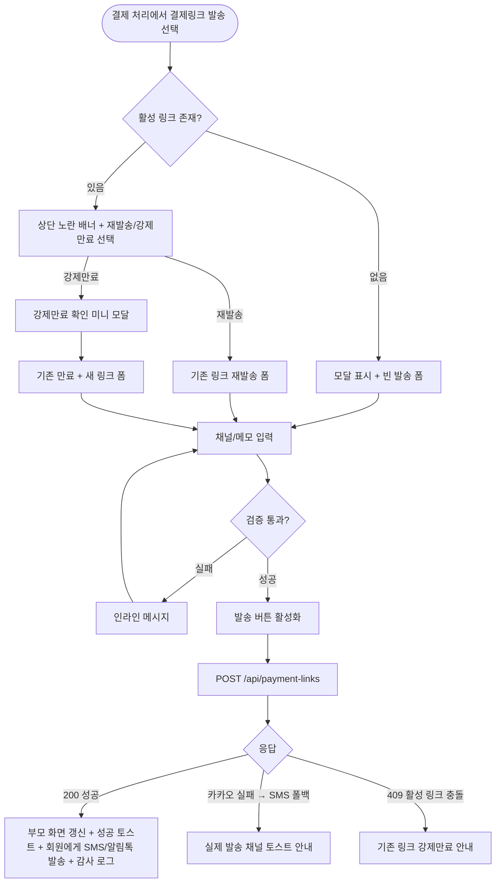
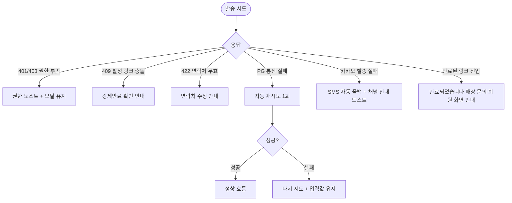

# DLG-S016 결제링크 발송 다이얼로그

## 1. 메타 정보

| 항목 | 값 |
|---|---|
| 작성일 | 2026-05-22 |
| 버전 | v1.0 |
| 상태 | 정합화 완료 |
| 도메인 | D03 매출관리 |
| 다이얼로그 ID | DLG-S016 |
| 다이얼로그명 | 결제링크 발송 |
| 부모 화면 | SCR-S003 결제 처리 |
| 기능코드 | PAY-01 (결제 처리), PAY-06 (결제링크 발송) |
| 계약코드 | PAY-01, PAY-06 |
| 우선순위 | P0 |
| 플랫폼 | 데스크톱, 태블릿 |

## 2. 다이얼로그 개요와 목적

결제링크 발송 다이얼로그는 현장에서 운영자가 회원과 함께 상품·금액·할인 조건을 확정한 다음, 회원이 본인의 휴대폰에서 직접 결제할 수 있도록 SMS 또는 카카오톡으로 결제 링크를 보내는 모달입니다. 회원이 카드를 두고 왔거나 본인 명의 카드로 결제해야 하는 경우, 또는 현장에서 결제하지 않고 추후 결제하는 케이스 같은 운영 상황을 위한 도구입니다. 발송 후에는 회원이 결제 수단만 선택할 수 있고 상품 구성·금액·할인은 수정할 수 없도록 잠겨, 운영자가 현장에서 확정한 조건이 그대로 결제에 반영됩니다.

## 3. 호출 트리거

이 모달은 결제 처리 화면(SCR-S003)에서 운영자가 상품과 할인을 모두 적용한 다음 수납 방식 선택에서 "결제링크 발송"을 고르면 열립니다. 또한 동일 원결제 기준 활성 링크가 이미 있는 경우 다시 같은 링크를 재발송하거나 강제 만료 후 새 링크를 만들고 싶을 때 결제 처리 화면의 "활성 링크 관리" 메뉴에서도 진입할 수 있습니다.

## 4. 레이아웃과 UI 구성

모달 상단에는 "결제링크 발송"이라는 제목과 닫기(X) 아이콘이 배치됩니다. 본문 첫 영역은 회원 정보 박스로, 수신 대상 회원의 이름·연락처·앱 연결 여부가 읽기 전용으로 표시됩니다. 앱 연결이 되어 있으면 카카오톡 알림톡 발송이 가능함을 표시하는 배지가 함께 노출됩니다. 두 번째 영역은 결제 요약 박스로, 상품명·수량·정가·할인·최종 결제 금액·잔액 여부(분할 결제 시)가 표 형태로 표시되며 모두 잠금 상태입니다. 세 번째 영역은 발송 채널 선택 영역으로, "SMS"와 "카카오톡 알림톡" 라디오 버튼이 배치되고 회원의 앱 연결 상태에 따라 사용 가능한 채널이 활성화됩니다. 네 번째 영역은 링크 만료일시 표시로, 발송 시점 +7일로 자동 계산된 만료일시가 보여집니다. 다섯 번째 영역은 내부 메모 입력 영역으로, 상담 메모·발송 사유·특이사항을 자유 입력할 수 있습니다. 활성 링크가 이미 존재하는 경우 모달 상단에 노란색 알림 배너가 표시되어 "이 결제 건에 활성 링크가 있습니다. 같은 링크 재발송 또는 강제 만료 후 새 링크를 선택하세요"라는 안내와 함께 두 개의 액션 버튼(재발송·강제 만료 후 새 링크)이 노출됩니다. 모달 하단 우측에는 "발송"과 "취소" 버튼이 배치됩니다.

## 5. 입력 필드와 검증 규칙

회원의 연락처가 없거나 유효하지 않은 형식(010-XXXX-XXXX 외)인 경우 발송 버튼이 비활성화되며 "연락처가 없습니다. 회원 정보를 먼저 수정해 주세요"라는 안내가 표시됩니다. 발송 채널은 회원의 앱 연결 상태에 따라 사용 가능한 채널이 자동 결정되며, 카카오톡 알림톡 발송이 실패하면 SMS로 자동 폴백되도록 백엔드에서 처리합니다. 활성 링크가 있는 상태에서 새 링크를 만들려고 하면 반드시 기존 링크를 강제 만료해야 하며, 운영자가 강제 만료 확인을 누르지 않으면 새 링크 발송이 차단됩니다. 만료일시는 시스템이 자동 계산하므로 운영자가 수정할 수 없습니다.

## 6. 확인/취소 버튼 동작

발송 버튼은 입력 검증이 통과된 경우에만 활성화됩니다. 발송을 누르면 버튼이 비활성화되고 스피너가 표시되며 백엔드에 결제링크 생성·발송 API가 호출됩니다. 성공하면 모달이 닫히고 부모 화면(결제 처리)의 링크 상태가 "발송됨"으로 즉시 갱신됩니다. 우측 상단에 "결제링크를 발송했습니다 (만료: YYYY-MM-DD HH:MM)" 성공 토스트가 표시됩니다. 취소 버튼이나 ESC, 배경 클릭은 모달을 닫으며 입력 도중에는 한 번 더 확인을 묻습니다.

## 7. 자식 모달과 후속 흐름

활성 링크 강제 만료를 선택한 경우 "기존 링크를 만료하시겠습니까? 만료된 링크는 회원이 사용할 수 없습니다"라는 yes/no 확인 미니 모달이 한 단계 더 표시됩니다. 운영자가 확인하면 기존 링크가 만료되고 새 링크 발송이 진행됩니다.

## 8. 토스트와 알림

발송 성공 시 운영자 화면에는 "결제링크를 발송했습니다" 토스트가 표시되고, 회원에게는 즉시 SMS 또는 알림톡이 도착합니다. 발송 실패(연락처 오류·PG API 오류·메시지 채널 오류) 시에는 빨강 토스트로 사유가 표시되며 입력값은 유지되어 운영자가 즉시 재시도할 수 있습니다. 회원이 링크를 통해 결제를 완료하면 운영자에게 알림 센터를 통해 "결제 완료" 알림이 푸시되어 결제 처리 화면을 다시 열지 않아도 결과를 알 수 있습니다. 링크가 만료 시점에 가까워지면(D-1) 운영자에게 미결제 알림이 발송되어 회원에게 추가 안내 여부를 결정할 수 있습니다.

## 9. 데이터 흐름과 외부 연동

발송 시에는 `POST /api/payment-links`가 호출되며 요청 바디에 paymentDraftId(현장에서 확정한 임시 결제 정보), memberId, channel(sms/kakao), expiresAt 같은 필드가 포함됩니다. 응답에는 결제링크 URL, 링크 ID, 만료일시가 포함됩니다. 카카오톡 알림톡 발송이 실패하면 백엔드에서 자동으로 SMS로 폴백되며, 응답에 실제 발송된 채널 정보가 포함되어 운영자가 결과를 확인할 수 있습니다. 활성 링크 강제 만료는 `PATCH /api/payment-links/:id/expire`로 처리됩니다. 회원이 링크에 진입해 결제를 완료하면 PG 콜백을 통해 결제 상태가 업데이트되고, 알림 센터(NFR-19)를 통해 운영자에게 푸시됩니다. 모든 링크 발송·만료·결제 완료는 감사 로그(SCR-097)에 기록됩니다. 메시지 발송은 마케팅 자동 알림 엔진(MKT-02 인프라)을 공유하지 않고 결제 전용 채널을 사용해, 마케팅 수신 동의와 무관하게 항상 발송됩니다.

## 10. 화면 상태와 예외 처리

기본 표시·입력/수정 중·저장/처리 중·완료·실패 5개 상태를 가지며, 활성 링크 충돌 상태가 보조로 추가됩니다. 예외 처리는 다음과 같습니다. 회원 연락처가 없거나 유효하지 않으면 발송 자체가 차단되고 안내가 표시됩니다. 활성 링크가 있는 상태에서 새 링크 발송 시도는 강제 만료를 거치지 않으면 차단됩니다. 카카오톡 알림톡 발송 실패는 SMS로 자동 폴백되며 운영자에게는 실제 발송 채널이 토스트로 안내됩니다. PG API 통신 실패는 자동 재시도 1회 후 사용자 대기로 전환됩니다. 만료된 링크는 회원이 진입해도 결제할 수 없으며 "만료된 링크입니다. 매장에 문의해 주세요" 안내가 표시되고 운영자가 새 링크를 발송해야 합니다. 동일 원결제 기준 활성 링크 1개 제한이 백엔드에서 강제되어, 우회 시도 시 409 응답으로 차단됩니다.

## 11. 권한별 처리

슈퍼관리자(superAdmin), 본사 최고관리자(primary), 센터장(owner), 매니저(manager), 스태프(staff), 프런트(front)는 결제링크 발송을 사용할 수 있습니다. FC(fc)와 트레이너(trainer)는 결제 처리 권한이 없으므로 부모 화면 자체에 접근할 수 없어 이 모달도 만나지 않습니다. readonly는 접근 불가입니다. 본사 권한자는 본사 통합 모드에서 다른 지점의 결제링크도 발송할 수 있으며, 이 경우 발송 출처(어느 지점에서 보낸 링크인지)가 회원에게 보내는 메시지에 명시됩니다. 활성 링크 강제 만료는 운영자 본인이 발송한 링크 또는 같은 지점의 다른 운영자가 발송한 링크에 대해서만 가능하며, 다른 지점의 링크는 본사 권한자만 만료할 수 있습니다.

## 12. 메인 흐름

## 13. 에러와 예외 흐름

## 14. 핵심 디자인 요청사항

결제 요약 박스는 잠금 상태임을 시각적으로 명확히 하여 운영자가 이 단계에서는 더 이상 금액·상품을 수정할 수 없음을 인지하게 합니다. 회원 정보 박스의 앱 연결 여부 배지는 카카오톡 알림톡 발송 가능 여부와 연결되어, 운영자가 채널 선택의 의미를 즉시 파악할 수 있어야 합니다. 활성 링크 충돌 시 표시되는 노란색 배너는 상단에 강하게 배치되어 운영자가 무심코 새 링크를 만드는 일을 방지합니다. 강제 만료 확인 미니 모달은 빨강 톤의 경고 색상으로 처리되어 만료 행위가 되돌릴 수 없음을 표현합니다. 발송 성공 토스트에는 만료 일시가 함께 표시되어 운영자가 회원에게 추가 안내할 시점을 계산할 수 있게 합니다.

## 15. 운영 정책

결제링크 발송은 회원이 본인 명의 카드로 결제해야 하거나 현장에서 즉시 결제하지 못하는 운영 케이스를 위한 도구로, 발송 후에는 상품 구성·금액·할인이 잠겨 운영자가 현장에서 확정한 조건이 그대로 결제에 반영되도록 보장합니다. 이는 회원이 결제 단계에서 조건을 임의로 바꾸거나 운영자가 발송 후 가격을 수정해 분쟁이 생기는 일을 방지하기 위한 정책입니다. 동일 원결제 기준 활성 링크는 1개만 유지되며, 새 링크를 만들려면 반드시 기존 링크를 강제 만료해야 합니다. 이 제한은 회원이 여러 링크를 받아 혼란을 겪는 일과 운영자가 같은 결제에 대해 여러 링크를 발송해 중복 결제가 일어나는 일을 막기 위함입니다. 링크 만료는 발송 시점 +7일로 고정되며, 만료된 링크는 새 링크 발송으로 대체해야 하고 만료 링크를 재사용하지 않습니다. 카카오톡 알림톡 발송 실패 시 SMS로 자동 폴백되는 정책은 회원에게 결제 안내가 끊김 없이 도달하도록 보장하며, 폴백 사실은 운영자에게 명시적으로 안내되어 운영자가 회원에게 별도 통화를 할지 결정할 수 있게 합니다. 결제링크 발송은 마케팅 수신 동의와 무관하게 항상 발송되며, 이는 결제 안내가 거래 행위에 필수적인 정보 전달이라는 법적 근거에 따른 것입니다. 모든 발송·만료·결제 완료 이력은 감사 로그에 영구 보존되어 분쟁 응대와 회계 감사에 사용됩니다.
