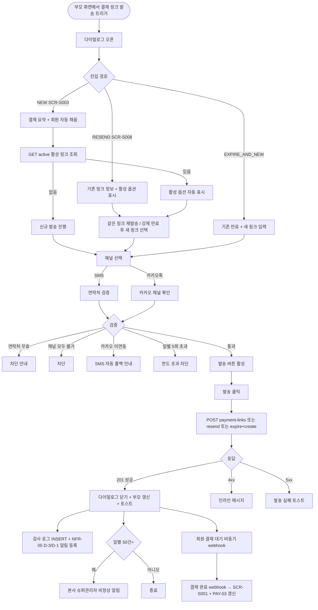

# DLG-S016 결제 링크 발송 다이얼로그

## 1. 다이얼로그 메타 정보

이 문서는 현장에서 확정한 상품·금액·할인 조건으로 회원이 비대면으로 직접 결제할 수 있는 링크를 발송하는 결제 링크 발송 다이얼로그(DLG-S016)에 대한 자기완결형 요구사항 정의서입니다. 외부 문서 없이도 이 문서 한 장만으로 호출 트리거, 입력 폼, 검증, 확인·취소 동작, 부모 화면 갱신, 권한, 예외 처리, 운영 정책까지 모두 이해해 구현·운영할 수 있도록 작성합니다.

| 항목 | 값 |
|---|---|
| 작성일 | 2026-05-22 |
| 버전 | v1.0 |
| 상태 | 최신 통합본 반영 (정합화 완료) |
| 도메인 | D03 매출관리 |
| 다이얼로그 ID | DLG-S016 |
| 다이얼로그명 | 결제 링크 발송 |
| 다이얼로그 유형 | 입력형 모달 (발송 후 닫힘) |
| 호출 트리거 | SCR-S003 결제 처리 화면에서 수납 방식 "결제 링크 발송" 선택, SCR-S008 미수금 관리에서 결제링크 미결제 건의 "결제 링크 재발송" 버튼, SCR-S007 환불 관리에서 미결제 링크 취소 후 새 링크 생성 |
| 부모 화면 | SCR-S003 결제 처리, SCR-S008 미수금 관리, SCR-S007 환불 관리, SCR-S016 결제 링크 관리 |
| 기능코드 | PAY-01 (결제 처리), PAY-06 (결제 링크 발송) |
| 계약코드 | PAY-01, PAY-06 |
| 권한 9역할 | superAdmin / primary / owner / manager / fc / staff / trainer / front / readonly |
| 사용 가능 권한 | superAdmin, primary, owner, manager, fc (담당 회원에 한해) |
| 사용 불가 | staff, front, trainer, readonly |
| 연결 API | `POST /api/payment-links` (신규 링크 생성), `POST /api/payment-links/:id/resend` (동일 링크 재발송), `POST /api/payment-links/:id/expire` (수동 만료), `POST /api/payment-links/:id/cancel` (취소), `GET /api/payment-links/active?paymentId=` (활성 링크 조회) |
| 후속 처리 | SCR-S003 복귀하며 링크 상태 "발송됨"으로 갱신, 회원이 자가 결제 시 PG webhook으로 SCR-S001 매출 반영 |
| 감사 로그 | SCR-097에 `payment_link_send`, `payment_link_resend`, `payment_link_expire`, `payment_link_cancel` 액션 기록 |

## 2. 다이얼로그 목적과 사용 맥락

결제 링크 발송 다이얼로그는 비대면 결제가 필요한 회원에게 SMS 또는 카카오톡으로 결제 링크를 보내는 핵심 입력 모달입니다. PAY-06 운영 시나리오에서 현장 결제가 어려운 회원(카드 미소지·외부 미팅·회원 자택 결제·계약금 + 잔액 분할 회수 등)에게 운영자가 현장에서 확정한 금액·할인 조건을 그대로 담아 결제 링크를 발송하는 흐름의 시각화입니다.

이 다이얼로그가 다루는 운영 흐름은 다섯 가지입니다. 첫째는 비대면 결제 발송 흐름으로, 카운터에서 회원이 카드를 가져오지 않은 경우 SMS로 결제 링크를 보내 회원이 즉석에서 결제하도록 합니다. 둘째는 외부 미팅 후 결제 위임 흐름으로, FC가 외부 미팅 후 사무실에 복귀하지 않고 카카오톡으로 결제 링크를 보냅니다. 셋째는 계약금 + 잔액 분할 회수 흐름으로, 계약금을 현장 수납한 후 잔액은 결제 링크로 발송해 회원이 추후 결제하게 합니다. 넷째는 활성 링크 재발송 흐름으로, 회원이 링크를 분실했을 때 같은 링크를 다시 보냅니다. 다섯째는 강제 만료 + 신규 흐름으로, 금액이나 상품 변경이 필요할 때 기존 링크를 만료시키고 새 링크를 생성합니다.

다이얼로그는 PAY-06 "발송 후 수정 불가" 정책에 따라 링크 발송 후에는 상품·할인·최종 금액을 변경할 수 없으며, 활성 링크 1개 제한 정책에 따라 동일 원결제 기준 활성 링크는 1개만 유지됩니다.

## 3. 호출 트리거와 부모 화면 컨텍스트

이 다이얼로그는 다음 세 가지 진입점에서 호출됩니다.

첫 번째 진입점은 SCR-S003 결제 처리 화면에서 수납 방식으로 "결제 링크 발송"을 선택한 경우입니다. 부모는 결제 처리 화면의 현재 장바구니 정보(상품·금액·할인·회원 정보)를 컨텍스트로 전달하며, 다이얼로그는 모든 결제 요약을 자동 채움 상태로 시작합니다.

두 번째 진입점은 SCR-S008 미수금 관리 페이지에서 발생 유형이 "결제 링크 미결제"인 미수금 행의 "결제 링크 재발송" 버튼입니다. 부모는 기존 결제 링크 ID를 컨텍스트로 전달하며, 다이얼로그는 활성 링크 처리 옵션(같은 링크 재발송 / 강제 만료 후 새 링크)을 자동 분기해 표시합니다.

세 번째 진입점은 SCR-S007 환불 관리에서 미결제 링크 취소 후 새 링크 생성이 필요한 경우입니다. 부모는 원결제 ID와 새 금액을 컨텍스트로 전달합니다.

다이얼로그가 받는 컨텍스트는 진입 경로(`NEW` / `RESEND` / `EXPIRE_AND_NEW`), 원결제 ID, 결제 요약 정보(상품·수량·할인·최종 금액·잔액 여부), 회원 정보, 활성 링크 ID(재발송 경로), 부모 화면 식별자입니다.

## 4. 레이아웃과 UI 구성

다이얼로그는 데스크톱에서 가로 560px의 중앙 정렬 모달이고, 모바일에서는 풀너비 시트로 표시됩니다. 위에서 아래로 다음 영역이 순차 배치됩니다.

가장 위에는 헤더가 있습니다. 좌측에 "결제 링크 발송" 제목, 우측 끝에 X 닫기 버튼이 있습니다. 헤더 아래에 진입 경로 안내가 표시됩니다("신규 결제 링크" / "같은 링크 재발송" / "강제 만료 후 새 링크").

헤더 아래에는 회원 정보 카드가 있습니다. 수신 대상 회원 이름, 연락처(010 자동 포맷), 앱 연결 여부("회원앱 설치됨" 또는 "미설치")가 한 줄로 요약 표시됩니다. 회원앱이 설치된 경우 카카오톡 채널 사용 가능 여부도 함께 표시됩니다.

회원 카드 아래에는 결제 요약 카드가 강조 영역으로 표시됩니다. 상품명, 수량, 정가, 할인 금액·사유, 최종 결제 금액이 표 형태로 정렬되고, 최종 결제 금액이 가장 큰 폰트로 표시됩니다. 잔액 여부(계약금 분할 후 잔액인 경우)가 보조 안내로 함께 표시됩니다. 이 카드는 PAY-06 "발송 후 수정 불가" 정책에 따라 다이얼로그 안에서 모두 읽기 전용으로 표시되며, 금액이나 상품을 변경하려면 다이얼로그를 취소하고 SCR-S003에서 다시 입력해야 합니다.

결제 요약 아래에는 활성 링크 처리 옵션 영역이 있습니다. 진입 경로가 신규(`NEW`)이고 활성 링크가 없는 경우 이 영역은 표시되지 않습니다. 진입 경로가 재발송(`RESEND`)이거나 새 발송 시도 시 활성 링크가 감지된 경우 이 영역이 표시되며, 라디오로 "같은 링크 재발송"과 "강제 만료 후 새 링크" 중 선택합니다. 같은 링크 재발송은 만료일시 갱신 없이 동일 링크를 재전송하고, 강제 만료 후 새 링크는 기존 링크를 만료 처리한 뒤 새 링크를 생성합니다.

활성 링크 옵션 아래에는 발송 채널 선택 영역이 있습니다. 라디오로 SMS와 카카오톡 중 선택합니다. SMS는 회원 연락처가 유효한 경우 기본 활성화되며, 카카오톡은 회원이 카카오 채널 친구이거나 회원앱이 연결된 경우에만 활성화됩니다. 두 채널 모두 사용 불가한 경우 "발송 가능한 채널이 없어요" 안내가 표시되고 발송이 차단됩니다. 카카오톡 미연동인 경우 PAY-06 "카카오 미연동 회원: SMS 자동 폴백" 정책에 따라 SMS로 자동 폴백 추천이 안내됩니다.

발송 채널 아래에는 링크 만료일시 표시 영역이 있습니다. PAY-06 "만료일 고정: 발송 시점 + 7일" 정책에 따라 만료일시가 자동으로 발송 시점 + 7일로 고정되어 읽기 전용으로 표시됩니다. 운영자는 만료일을 직접 수정할 수 없으며, 만료 후에는 새 링크를 발송해야 합니다.

마지막은 내부 메모 입력란(선택)입니다. 자유 형식 textarea로 최대 500자까지 입력 가능하며, 상담 메모·발송 사유·특이사항을 기록할 수 있습니다. 회원에게 노출되지 않는 내부 관리용 메모입니다.

다이얼로그 가장 아래에는 액션 바가 있습니다. 우측에 회색 "취소" 버튼과 강조색 "발송" 버튼이 나란히 놓입니다. 발송 버튼은 회원 연락처 유효성과 채널 선택 검증을 통과해야 활성화됩니다.

## 5. 입력 검증과 발송 로직

결제 링크 발송은 다음 검증을 순서대로 통과해야 처리됩니다.

첫째, 회원 연락처 검증입니다. 회원의 연락처가 등록되어 있고 유효한 형식(010-XXXX-XXXX)이어야 합니다. PAY-06 "연락처 필수" 정책에 따라 누락된 경우 발송이 차단되고 회원 정보 수정 안내가 표시됩니다.

둘째, 발송 채널 사용 가능 여부 검증입니다. SMS는 연락처가 유효하면 사용 가능하며, 카카오톡은 회원이 카카오 채널 친구이거나 회원앱이 연결된 경우에만 사용 가능합니다. 둘 다 사용 불가한 경우 PAY-06 "발송 채널 폴백" 정책에 따라 차단됩니다.

셋째, 활성 링크 검증입니다. PAY-06 "활성 링크 1개 제한" 정책에 따라 동일 원결제 기준 활성 링크가 이미 있으면 신규 발송이 차단되고 재발송/강제 만료 옵션이 자동 표시됩니다.

넷째, 만료된 링크 재발송 시도 차단입니다. PAY-06 "만료 후 재사용 차단" 정책에 따라 만료된 링크는 재발송 불가이며, 새 링크 생성 안내가 표시됩니다.

다섯째, 발송 한도 검증입니다. PAY-06 "발송 한도: 동일 회원 동일 원결제에 일별 발송 횟수 5회 제한" 정책에 따라 일별 5회를 초과하면 "발송 횟수 한도 초과" 안내와 함께 다음 날 재시도가 안내됩니다.

여섯째, 권한 검증입니다. staff·front·trainer·readonly는 다이얼로그가 열리지 않습니다.

발송 로직은 다음과 같이 동작합니다. 신규 발송의 경우 새 링크 토큰(7일 만료, 1회용)을 생성하고 선택된 채널로 비동기 발송 큐에 등록합니다. 같은 링크 재발송의 경우 기존 링크 토큰을 그대로 사용하고 만료일은 갱신하지 않은 채 채널 발송만 다시 트리거합니다. 강제 만료 후 새 링크의 경우 기존 링크를 즉시 만료 처리하고 새 토큰을 생성해 발송합니다.

## 6. 확인·취소 동작과 부모 화면 갱신

발송 버튼을 누르면 다이얼로그는 즉시 로딩 상태로 전환되어 모든 버튼이 비활성화되고, 발송 버튼 라벨이 "발송 중..."으로 바뀝니다.

성공 응답(201)이 도착하면 다이얼로그가 자동으로 닫히고 부모 화면에 "결제 링크를 발송했어요" 토스트가 표시됩니다.

부모 화면별로 다음 갱신이 일어납니다. 부모가 SCR-S003 결제 처리이면 결제 링크 상태가 "발송됨"으로 잠금 표시되고, 결제 처리 화면 자체에서 다른 수납 방식으로 재시도할 수 없도록 PAY-06 "결제링크 발송 후 SCR-S003 복귀: 링크 상태 발송됨으로 잠금, 별도 현장 등록 재시도 차단" 정책이 적용됩니다. 부모가 SCR-S008 미수금 관리이면 해당 미수금 행의 링크 상태가 갱신되고 운영자에게 발송 완료 안내가 표시됩니다.

성공 처리는 동시에 다음 시스템 영향을 미칩니다. SCR-097 감사 로그에 `payment_link_send` 또는 `payment_link_resend` 액션이 적재됩니다. 만료 D-3·D-1 자동 알림이 NFR-05 크론에 등록됩니다. 일별 발송 50건 초과 시 PAY-06 "비정상 발송 알림: 일별 50건 이상 발송 시 본사 슈퍼관리자 알림" 정책에 따라 본사 슈퍼관리자에게 알림이 발송됩니다.

회원이 링크를 받고 자가 결제를 완료하면 PG webhook이 도착해 SCR-S001 매출 현황과 PAY-03 미수금이 자동 갱신됩니다. 이 흐름은 다이얼로그 자체와는 비동기로 진행되며, 운영자는 발송 후 결제 처리 화면을 떠나도 됩니다.

실패 응답이 오면 다이얼로그는 닫히지 않고 입력 내용이 보존됩니다. 4xx 입력 오류(연락처 무효·채널 미사용 등)는 인라인 메시지로 표시되며, 발송 실패는 PAY-06 "발송 실패" 정책에 따라 빨강 토스트와 재시도 옵션이 제공됩니다.

취소 버튼은 입력 변경이 없으면 즉시 닫히고, 변경된 상태에서는 닫기 확인 팝업이 표시됩니다. ESC 키와 배경 클릭도 취소와 동일합니다.

## 7. 화면 상태

기본 표시 상태는 다이얼로그가 갓 열린 직후의 상태로, 결제 요약과 회원 정보가 자동 채워져 있고 발송 채널 선택 대기 상태입니다.

활성 링크 있음 상태는 신규 발송 시도 시 활성 링크가 감지된 상태로, 활성 링크 처리 옵션 영역이 펼쳐져 라디오 선택이 요구됩니다.

만료된 링크 재발송 시도 상태는 운영자가 만료된 링크의 재발송을 시도한 상태로, "만료된 링크입니다" 안내와 새 링크 생성 옵션이 표시됩니다.

연락처 무효 상태는 회원 연락처가 없거나 형식이 잘못된 상태로, 인라인 에러와 회원 정보 수정 안내가 표시되고 발송 버튼이 비활성화됩니다.

채널 미사용 상태는 SMS와 카카오톡 모두 사용 불가한 상태로, 차단 안내가 표시됩니다.

카카오 미연동 상태는 카카오톡 미연동이지만 SMS는 사용 가능한 상태로, "SMS로 발송됩니다" 자동 폴백 안내가 표시됩니다.

발송 한도 초과 상태는 일별 5회 초과한 상태로, "발송 횟수 한도 초과" 안내와 다음 날 재시도 안내가 표시됩니다.

발송 중 상태는 발송 버튼을 누른 직후로, 모든 입력이 잠기고 버튼이 "발송 중..."으로 표시됩니다.

발송 완료 상태는 API 성공 응답을 받은 직후로, 다이얼로그가 자동으로 닫히고 부모 화면이 갱신됩니다.

발송 실패 상태는 발송 처리 실패 상태로, 입력 내용이 보존되고 사유에 따라 메시지가 표시됩니다.

회원 자가 결제 완료 상태(비동기, 다이얼로그 외부)는 회원이 링크를 받고 PG 결제를 완료한 상태로, webhook으로 SCR-S001 매출 반영과 PAY-03 미수금 차감이 자동 갱신됩니다.

권한 부족 상태는 권한이 없는 계정의 진입 시도로, 다이얼로그가 열리지 않습니다.

## 8. 예외 처리

연락처 무효는 PAY-06 정책에 따라 발송 차단됩니다.

채널 모두 사용 불가는 차단됩니다.

활성 링크 1개 제한 위반(신규 발송 시 활성 링크 감지)은 옵션 모달로 분기되어 운영자가 처리 방식을 선택합니다.

만료된 링크 재발송 시도는 새 링크 생성으로 안내됩니다.

발송 한도(일별 5회+) 초과는 차단됩니다.

발송 실패(네트워크)는 빨강 토스트와 재시도 버튼이 표시됩니다. 자동 재시도는 없습니다.

PG webhook 서명 검증 실패는 PAY-06 "PG webhook 보안: HMAC 서명 검증" 정책에 따라 webhook이 차단되고 보안 알림이 슈퍼관리자에게 발송됩니다. 이는 다이얼로그 외부 비동기 이벤트입니다.

PG webhook 중복 수신은 PAY-06 "idempotency: webhook 중복 수신 시 idempotency-key로 이중 처리 차단" 정책에 따라 차단됩니다.

발송 후 수정 시도는 PAY-06 "발송 후 수정 불가" 정책에 따라 다이얼로그 안에서 결제 요약이 읽기 전용으로 잠겨 있으므로 발생하지 않습니다.

미완료 환불 시도(회원이 결제 미완료 링크에 대해 환불을 요청한 경우)는 SCR-S012에서 환불이 아닌 링크 취소로 분기됩니다.

회원 연락처 변경 이벤트가 발생하면 PAY-06 "연락처 변경 시 미발송 링크 갱신: 회원 연락처 변경 후 미발송 링크는 새 연락처로 자동 갱신" 정책에 따라 미발송 링크는 자동 갱신됩니다. 발송된 링크는 별도 재발송이 필요합니다.

비정상 발송(일별 50건+)은 PAY-06 "비정상 발송 알림" 정책에 따라 본사 슈퍼관리자 알림이 자동 발송됩니다.

권한 부족(403)은 모달 닫기와 함께 부모 화면에 토스트가 표시되고 감사 로그에 권한 우회 시도가 기록됩니다.

본사 통합 모드 권한 미달 상태에서 다른 지점 결제 건에 대한 발송 시도는 다이얼로그가 열리지 않습니다.

링크 토큰 위변조 시도는 PAY-06 "링크 토큰 보안: 링크 토큰은 1회용 + 7일 만료, 위변조 방지 서명 포함" 정책에 따라 회원 측 결제 화면에서 차단되며 보안 알림이 발송됩니다.

## 9. 권한별 처리

슈퍼관리자(superAdmin)와 본사 최고관리자(primary)는 전체 지점의 결제 링크 발송이 가능합니다. 본사 통합 모드에서 다른 지점 회원에 대한 발송도 가능합니다.

센터장(owner)과 매니저(manager)는 자기 지점 회원에 대한 결제 링크 발송이 가능합니다.

FC(fc)는 담당 회원에 대한 결제 링크 발송과 재발송이 가능합니다.

스태프(staff), 프런트(front), 트레이너(trainer), 읽기 전용(readonly)은 PAY-06 권한 매트릭스에 따라 발송 권한이 없으므로 다이얼로그가 열리지 않습니다.

권한 우회 시도(직접 API 호출)는 403으로 차단되고 감사 로그에 기록됩니다.

## 10. 운영 정책

이 다이얼로그가 따르는 운영 정책은 PAY-01·PAY-06의 핵심 규칙들을 그대로 시각화한 것입니다.

발송 후 수정 불가는 PAY-06 "발송 후 수정 불가: 링크 발송 후 상품·할인·최종 금액 수정 차단 (현장 합의 보호)" 정책의 결과이며, 운영자가 현장에서 회원과 합의한 조건이 발송 후 임의로 변경되는 사고를 방지합니다.

활성 링크 1개 제한은 PAY-06 "활성 링크 1개 제한: 동일 원결제 기준 활성 링크는 1개만 유지" 정책의 결과이며, 같은 결제에 여러 개의 결제 링크가 동시에 활성화되어 회원이 혼란을 겪는 사고를 방지합니다.

만료일 7일 고정은 PAY-06 "만료일 고정: 발송 시점 + 7일 (정책 한도, 변경 가능)" 정책의 결과이며, 운영자가 만료일을 임의로 변경할 수 없도록 잠겨 있습니다.

만료 후 재사용 차단은 PAY-06 "만료 후 재사용 차단" 정책의 결과이며, 만료된 링크는 반드시 새 링크로 교체해야 합니다.

발송 한도 일별 5회는 PAY-06 "발송 한도: 동일 회원 동일 원결제에 일별 발송 횟수 5회 제한 (스팸 방지)" 정책의 결과이며, 회원에 대한 과도한 발송을 방지합니다.

비정상 발송 알림(일별 50건+)은 PAY-06 "비정상 발송 알림: 일별 50건 이상 발송 시 본사 슈퍼관리자 알림" 정책의 결과이며, 운영 이상을 본사가 즉시 감지합니다.

PG webhook 보안(HMAC 서명 검증 + idempotency)은 PAY-06 "PG webhook 보안" 정책의 결과이며, 외부 시스템 응답의 위변조와 중복 처리를 차단합니다.

회원 연락처 변경 시 미발송 링크 자동 갱신은 PAY-06 "연락처 변경 시 미발송 링크 갱신" 정책의 결과이며, 회원 정보 변경이 발송 흐름에 자동 반영됩니다.

회원앱 MA-140 비편집 모드는 PAY-06 "회원앱 MA-140 비편집 모드: 결제수단만 선택, 금액·상품 수정 불가" 정책의 결과이며, 회원이 현장 합의 조건을 임의로 변경할 수 없도록 보장합니다.

미사용 만료 시 미수금 유지는 PAY-06 "링크 미사용 만료 시 미수금 유지" 정책의 결과이며, 링크가 만료되어도 PAY-03 미수금이 자동 등록되어 운영자가 새 링크 발송 또는 다른 회수 방법을 추진할 수 있게 합니다.

미완료 환불 차단은 PAY-06 "미완료 환불 차단" 정책의 결과이며, 결제 미완료 링크는 환불이 아닌 링크 취소로 처리됩니다.

권한 매트릭스(매니저+ 및 fc 발송 가능)는 PAY-06 권한 정책의 결과이며, 책임 있는 운영자에게만 발송 권한을 부여합니다.

링크 토큰 보안(1회용 + 7일 만료 + 위변조 방지 서명)은 PAY-06 "링크 토큰 보안" 정책의 결과이며, 토큰의 무단 사용을 방지합니다.

만료 D-3/D-1 자동 알림(NFR-05)은 회원이 결제를 빠뜨리지 않도록 자동 안내하는 정책의 결과이며, 다이얼로그 발송 시점에 자동 등록됩니다.

감사 로그 적재는 발송·재발송·만료·취소·결제 webhook의 모든 이벤트가 추적 가능하도록 보장하는 정책의 결과입니다.

다지점 RLS 격리는 본사 통합 모드가 아닌 경우 자기 지점 회원에 대해서만 발송 가능하다는 보안 정책의 결과입니다.

이상의 정책은 결제 링크 발송 다이얼로그가 비대면 결제 운영의 핵심 입력 도구임을 보여줍니다.

## 11. 메인 흐름 (F2)



## 12. 에러와 예외 흐름 (F8)

```mermaid
flowchart TD
    A([발송 시도]) --> B{검증}
    B -->|연락처 무효| C[인라인 에러 + 회원 정보 수정 안내]
    B -->|채널 모두 불가| D["발송 가능한 채널 없음"]
    B -->|카카오 미연동| E[SMS 폴백 안내]
    B -->|활성 링크 감지 + 신규 시도| F[활성 옵션 모달 분기]
    B -->|만료된 링크 재발송| G["만료된 링크" + 새 링크 안내]
    B -->|일별 5회+| H["한도 초과" + 다음 날 안내]
    B -->|통과| I[API 호출]
    I --> J{서버 응답}
    J -->|5xx / timeout| K["발송 실패" 토스트]
    K --> L[수동 재시도]
    J -->|403| M["권한 없음" + 감사 로그]
    J -->|연락처 변경 이벤트 동시 발생| N[미발송 링크 자동 갱신]
    J -->|회원 PG 결제 완료 webhook| O[SCR-S001 + PAY-03 자동 갱신]
    J -->|회원 PG 결제 실패 webhook| P[링크 "결제 실패" 상태 유지]
    J -->|webhook 서명 실패| Q[차단 + 보안 알림]
    J -->|webhook 중복| R[idempotency 차단]
    J -->|일별 50건+ 비정상 발송| S[본사 슈퍼관리자 알림]
    J -->|회원앱 MA-140 미설치| T[웹 결제 페이지 자동 폴백]
    J -->|링크 토큰 위변조| U[회원 측 "유효하지 않은 링크" + 보안 알림]
    J -->|결제 미완료 환불 시도| V["링크 취소로 처리" SCR-S012 안내]
    J -->|미사용 만료| W[PAY-03 미수금 등록 + 새 링크 안내]
```

## 13. 핵심 디자인 요청사항

회원 정보 카드는 수신 대상이 명확히 보이도록 회원명과 연락처가 강조 표시되며, 카카오톡 채널 사용 가능 여부가 작은 배지로 함께 표시되어 운영자가 채널 선택 전에 사용 가능성을 즉시 알 수 있게 합니다.

결제 요약 카드는 다이얼로그의 시각적 중심이며, 최종 결제 금액이 가장 큰 폰트로 표시되어 운영자가 회원에게 발송 직전에 금액을 한 번 더 확인할 수 있게 합니다. 모든 필드가 읽기 전용임이 시각적으로 명확해 운영자가 수정 시도를 하지 않도록 합니다.

활성 링크 처리 옵션 영역은 활성 링크가 감지된 경우에만 부드럽게 펼쳐지는 아코디언 애니메이션으로 표시되어, 평상시에는 다이얼로그가 콤팩트하게 유지됩니다.

발송 채널 라디오는 두 채널이 동등하게 배치되되, 사용 불가한 채널은 회색 비활성으로 표시되고 호버 시 사유가 툴팁으로 안내됩니다. 카카오 미연동의 SMS 자동 폴백은 작은 안내 라벨로 자연스럽게 표시됩니다.

링크 만료일시는 보조 정보로 작게 표시되며, 운영자가 변경할 수 없음을 시각적으로 명확히 합니다.

발송 버튼은 모든 검증 통과 시에만 강조색으로 활성화되며, 검증 미통과 시 회색 비활성과 호버 툴팁으로 사유가 안내됩니다.

발송 중 상태에서는 발송 버튼에 스피너가 표시되고 다이얼로그가 어둡게 처리되어 처리 진행을 명확히 알립니다.

성공 후 부모 화면 갱신은 즉시 일어나며, SCR-S003 부모의 경우 결제 링크 상태가 "발송됨"으로 잠금 표시되고 다른 수납 방식 재시도가 시각적으로 차단됩니다.

모바일에서는 풀너비 시트로 전환되며, 결제 요약 카드가 화면 상단에 우선 표시됩니다. 발송 버튼은 키보드 위에 sticky로 부착됩니다.

활성 링크 처리 옵션의 라디오 선택 시 라벨 옆에 해당 옵션의 동작 설명(만료일 갱신 여부·새 토큰 생성 여부)이 작은 글씨로 함께 표시되어, 운영자가 선택의 결과를 즉시 이해할 수 있게 합니다.

## 14. 운영 정책 (이 다이얼로그에 연결된 부분)

이 다이얼로그가 따르는 운영 정책은 PAY-06 결제 링크 발송의 핵심 규칙들을 그대로 시각화한 것입니다.

발송 후 수정 불가는 운영자와 회원 간의 현장 합의 조건을 보호하는 핵심 정책이며, 다이얼로그 안에서 결제 요약이 읽기 전용으로 잠겨 있어 발송 직전 사고를 방지합니다.

활성 링크 1개 제한은 동일 원결제에 여러 활성 링크가 공존하지 않도록 보장하는 정책이며, 회원이 어느 링크로 결제해야 할지 혼란을 겪는 사고를 방지합니다.

만료일 7일 고정은 운영자가 만료일을 임의로 변경할 수 없도록 잠겨 있는 정책의 결과이며, 정책 토글로 변경 가능합니다.

발송 한도 일별 5회는 스팸 방지 정책의 결과이며, 동일 회원에 대한 과도한 발송이 시스템 자원과 회원 경험을 해치지 않도록 보호합니다.

비정상 발송 알림(일별 50건+)은 운영 이상을 본사가 즉시 감지하기 위한 정책이며, 다이얼로그 발송 직후 자동으로 본사 슈퍼관리자에게 알림이 발송됩니다.

PG webhook 보안(HMAC 서명 검증 + idempotency)은 외부 시스템 응답의 신뢰성을 보장하는 보안 정책이며, 위변조와 중복 처리를 차단합니다.

회원 연락처 변경 시 미발송 링크 자동 갱신은 회원 정보 일관성 정책의 결과이며, 운영자가 별도로 갱신 작업을 하지 않아도 됩니다.

회원앱 MA-140 비편집 모드는 회원이 현장 합의 조건을 임의로 변경할 수 없도록 보장하는 정책의 결과이며, 회원은 결제 수단만 선택할 수 있습니다.

미사용 만료 시 미수금 유지는 회수 운영의 연속성을 보장하는 정책이며, 만료된 링크에 대한 미수금이 PAY-03에 등록되어 새 링크 발송 또는 다른 회수 방법을 추진할 수 있습니다.

미완료 환불 차단은 환불 흐름과 링크 흐름을 명확히 분리하는 정책의 결과이며, 결제 미완료 링크에 대한 환불 시도는 SCR-S012 링크 취소로 분기됩니다.

권한 매트릭스(매니저+ 및 fc 발송 가능)는 결제 운영의 책임 권한 분리 정책의 결과입니다.

링크 토큰 보안은 토큰의 무단 사용 방지 정책의 결과이며, 1회용 + 7일 만료 + 위변조 방지 서명이 모두 적용됩니다.

만료 D-3/D-1 자동 알림은 회원이 결제를 빠뜨리지 않도록 자동 안내하는 정책이며, 발송 시점에 자동으로 NFR-05 크론에 등록됩니다.

감사 로그 적재는 발송·재발송·만료·취소·결제 webhook의 모든 이벤트가 사후 추적 가능하도록 보장하는 정책의 결과이며, 운영 행위의 추적성을 보장합니다.

다지점 RLS 격리는 본사 통합 모드가 아닌 경우 자기 지점 회원에 대해서만 발송 가능하다는 보안 정책의 결과입니다.

회원 자가 결제 완료 webhook은 다이얼로그 외부의 비동기 이벤트이지만, 발송 행위의 종착점이며 SCR-S001 매출 반영·PAY-03 미수금 차감으로 흐름이 자연스럽게 이어집니다.

이상의 정책은 결제 링크 발송 다이얼로그가 비대면 결제 운영의 핵심 입력 도구이자 회원-운영자 간 신뢰 보장의 핵심 단계임을 보여줍니다. 정책이 바뀌면 이 문서도 함께 갱신되어야 합니다.
