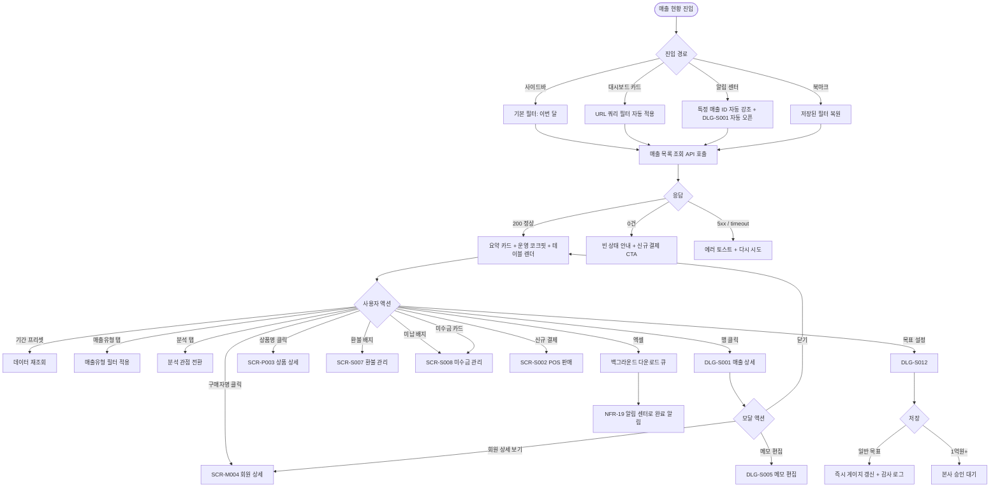

# SCR-S001 매출 현황 페이지

## 1. 화면 메타 정보

이 문서는 매출 현황 페이지에 대한 자기완결형 요구사항 정의서입니다. 다른 문서를 함께 보지 않아도 이 문서 한 장만으로 매출 현황 페이지에 들어가는 모든 영역, 모든 버튼, 모든 모달, 모든 권한, 모든 예외 처리, 그리고 이 화면을 지탱하는 운영 정책까지 전부 이해하고 구현할 수 있도록 작성합니다.

| 항목 | 값 |
|---|---|
| 작성일 | 2026-05-22 |
| 버전 | v1.0 |
| 상태 | 최신 통합본 반영 (정합화 완료) |
| 도메인 | D03 매출관리 |
| 화면 ID | SCR-S001 |
| 화면명 | 매출 현황 |
| 화면 유형 | 허브 화면 (Hub Screen) |
| 라우트 (URL) | `/sales` |
| 플랫폼 | 데스크톱(기본), 태블릿, 모바일(요약 카드형) |
| 우선순위 | P0 (출시 필수) |
| 기능코드 | SAL-01 (매출 현황 통합 허브) |
| 계약코드 | SAL-01, SAL-02 |
| 계약 상태 | 계약 범위 본기능 |
| 부모 기능 prefix | SAL |
| Lv1 코드 | SAL-01 |
| Lv2 / Lv3 세분화 | SAL-01-01 ~ SAL-01-11 (요약 지표 카드, 기간 프리셋, 통합 검색, 복합 필터, 매출유형 탭, 분석 탭 7종, 매출 목록 테이블, 하단 요약 바, 매출 상세 모달, 신규 결제 진입, 엑셀 내보내기) |
| 연계 화면 | SCR-S002 POS판매, SCR-S003 결제처리, SCR-S004 매출통계, SCR-S007 환불관리, SCR-S008 미수금관리, SCR-M004 회원상세, SCR-P003 상품상세, SCR-097 감사로그 |
| 호출 다이얼로그 | DLG-S001 매출상세, DLG-S005 메모편집(DLG-S001 경유), DLG-S012 목표매출설정 |

## 2. 화면 개요와 목적

매출 현황 페이지는 센터에서 발생한 전체 매출 거래를 한눈에 조회하고 분석하는 매출관리 도메인의 핵심 허브 화면입니다. 카운터 매니저는 출근 직후 오늘 매출 카드를 누르고 일별 결산 자료를 만들며, 센터장은 월말에 이번 달 카드 + 결제수단별·담당자별 탭으로 월간 결산을 마감합니다. FC는 본인 영업 성과를 담당자별 탭에서 신규/재등록 분리로 확인하고, 본사 슈퍼관리자는 통합 모드에서 전 지점 매출을 합산해 지점별 매출 믹스를 비교합니다. 회계 담당자는 엑셀 내보내기로 회계 시스템에 입력할 자료를 받아 가고, 마케팅 담당자는 매출유형 탭으로 신규/재등록/휴면복귀/종목추가/업그레이드 비율을 분석합니다.

이 화면은 D03 매출관리 도메인의 시작점입니다. 매출 내역에서 회원명을 누르면 회원 상세(SCR-M004)로 이동하고, 상품명을 누르면 상품 상세(SCR-P003)로 이동하며, 우측 상단의 신규 결제(POS) 버튼을 누르면 POS 판매(SCR-S002)로 진입합니다. 환불 탭이나 미납 탭의 배지를 누르면 환불 관리(SCR-S007) 또는 미수금 관리(SCR-S008)로 라우팅됩니다. 따라서 단순한 데이터 테이블이 아니라, 모든 매출 관련 후속 작업이 시작되는 진입 허브로 작동해야 합니다.

또한 이 화면은 카드 결제·현금 결제·결제링크 결제가 webhook으로 5초 이내에 반영되는 실시간 매출 모니터링 화면이기도 합니다. 본사 슈퍼관리자가 통합 모드를 활성화하면 전 지점의 매출이 합산되어 표시되고, 각 거래에는 소속 지점 컬럼이 추가됩니다. 일반 지점 사용자는 자기 지점 매출만 볼 수 있으며, FC는 본인이 담당하는 회원의 결제만 볼 수 있습니다.

## 3. 진입 경로와 인접 화면

매출 현황 페이지에 진입하는 경로는 다음과 같이 여러 가지가 있고, 각 경로마다 진입 직후 화면의 초기 상태가 조금씩 달라집니다.

첫 번째 경로는 사이드바입니다. 좌측 사이드바의 "매출관리" 메뉴 아래 "매출 현황" 항목을 클릭하면 진입합니다. 이 경우 URL은 단순히 `/sales`가 되고, 화면은 기본 필터 상태(기간 프리셋: 이번 달, 매출유형 탭: 전체, 분석 탭: 매출 내역, 페이지 1, 페이지당 20건)로 시작합니다.

두 번째 경로는 대시보드의 매출 지표 카드 클릭입니다. 대시보드(SCR-D001)에서 "오늘 매출", "이번 달 순매출", "미수금 합계", "이번 달 환불액" 같은 지표 카드를 클릭하면 매출 현황 페이지로 이동하면서 그 지표에 대응하는 필터가 URL 쿼리 파라미터로 자동 적용된 상태로 진입합니다. 예를 들어 "이번 달 환불액" 카드를 누르면 `/sales?period=month&tab=refund` 형태로 환불 내역 탭이 자동 열린 상태로 진입합니다.

세 번째 경로는 알림 센터(SCR-104)에서 결제 webhook 알림이나 비정상 매출 패턴 알림을 눌렀을 때입니다. 이 경우 알림이 가리키는 특정 매출 ID로 자동 스크롤되고, DLG-S001 매출 상세 모달이 자동으로 열립니다.

네 번째 경로는 외부 도구에서 공유받은 북마크·딥링크입니다. URL 쿼리 파라미터로 필터·검색·페이지 상태가 모두 보존되므로, 회계 담당자가 "이번 달 + 결제수단별 탭" 같은 자주 쓰는 조합을 북마크해 두고 매일 같은 URL로 진입할 수 있습니다.

다섯 번째 경로는 다른 매출 화면에서 돌아오는 경로입니다. POS 판매(SCR-S002), 결제 처리(SCR-S003), 환불 관리(SCR-S007), 미수금 관리(SCR-S008) 등에서 "매출 현황으로 이동" 버튼이나 결제 완료 후 후속 CTA를 누르면 이 화면으로 돌아오면서 방금 처리한 거래가 자동 강조 표시됩니다.

이 화면에서 빠져나가는 인접 화면으로는, 신규 결제(POS) 버튼으로 진입하는 POS 판매(SCR-S002), 환불 탭 배지로 진입하는 환불 관리(SCR-S007), 미납 탭 배지로 진입하는 미수금 관리(SCR-S008), 매출유형 분석을 더 깊게 보려고 진입하는 매출 통계(SCR-S004), 행의 회원명·상품명 클릭으로 진입하는 회원 상세(SCR-M004)·상품 상세(SCR-P003), 그리고 모든 조회·다운로드 이벤트가 기록되는 감사 로그(SCR-097)가 있습니다.

## 4. 레이아웃과 UI 구성

매출 현황 페이지는 위에서 아래로 차곡차곡 쌓이는 세로형 단일 컬럼 레이아웃을 기본으로 합니다. 데스크톱에서는 가로 폭이 충분하므로 분석 탭과 테이블이 한 줄로 펼쳐지고, 태블릿에서는 요약 카드가 2x2 그리드로 재배치되며, 모바일에서는 테이블이 카드형 리스트로 자동 전환됩니다.

가장 위에는 페이지 헤더가 있습니다. 헤더 좌측에는 "매출 현황"이라는 페이지 타이틀과 함께, 현재 조회 중인 지점이 "전체 지점(통합)"인지 특정 지점인지를 알려주는 지점 컨텍스트 배지가 따라옵니다. 헤더 우측에는 두 개의 액션 버튼이 있는데, 하나는 "신규 결제(POS)" 버튼이고 다른 하나는 "엑셀 내보내기" 버튼입니다. 신규 결제 버튼은 매니저+ 권한과 FC 권한에서 모두 활성화되어 SCR-S002로 이동시키고, 엑셀 내보내기 버튼은 매니저+ 권한자에게만 보이며 현재 필터가 적용된 전체 매출 데이터를 백그라운드 다운로드 큐로 등록합니다.

페이지 헤더 바로 아래에는 요약 지표 카드 4개가 가로로 배치됩니다. 첫 번째 카드는 "순 매출"로, 환불·할인을 차감한 후의 순매출(총매출 - 환불 - 할인)을 표시합니다. 두 번째 카드는 "카드 결제"로, 현장 카드와 결제링크 카드의 합계를 보여줍니다. 세 번째 카드는 "현금 결제"로, 현금과 계좌이체의 합계를 보여줍니다. 네 번째 카드는 "미수금"으로, 계약금 잔액·결제링크 미결제·수기 분할·정기 할부 미납을 합산한 현재 미수 총액을 표시합니다. 네 카드 모두 클릭 가능하며, 클릭 시 해당 영역에 자동 필터가 적용되거나 미수금 카드는 SCR-S008로 라우팅됩니다. 본사 통합 모드에서는 모든 카드의 숫자가 전 지점 합산으로 표시되고, 카드 아래 작은 글씨로 "전 지점 합산"이라는 주석이 붙습니다.

요약 카드 바로 아래에는 운영 코크핏 영역이 있습니다. 운영 코크핏은 지금 바로 봐야 할 매출 이슈를 우선순위 카드로 묶어 보여주는 영역으로, "미수 추적", "환불 검토", "재등록 성과", "고할인 거래" 카드가 표시됩니다. 각 카드를 누르면 해당 조건에 맞는 탭과 필터가 자동 적용됩니다. 운영 코크핏 우측에는 처리 큐가 붙어 있는데, 미수 규모·환불 금액·재등록 매출 영향도를 기준으로 상위 거래 3~4건이 따로 모여 표시되고 각 건마다 "거래 보기" "회원 보기" 버튼이 즉시 실행됩니다.

운영 코크핏 아래에는 기간 프리셋과 검색·필터 바가 있습니다. 좌측에는 기간 프리셋 버튼 3개(오늘 / 이번 주 / 이번 달)가 토글 그룹으로 묶여 있고, 우측에는 시작일~종료일 직접 입력 필드가 있습니다. 직접 입력 필드는 프리셋과 배타적이지 않고, 직접 날짜를 입력하면 프리셋 선택이 자동 해제됩니다. 그 우측에 통합 검색창이 있고, 구매자 이름과 상품명을 동시에 OR 조건으로 검색합니다. 검색은 입력 후 300ms 디바운스가 적용되어 타이핑이 끝나면 자동으로 결과가 갱신되며, 최소 2자 이상 입력해야 검색이 시작됩니다.

검색창 아래에는 복합 필터 영역이 펼쳐집니다. 유형 필터(이용권 / PT / 상품 / 기타), 상태 필터(완료 / 환불 / 미납), 결제경로 필터(POS / 링크 / 수기) 세 가지 드롭다운이 가로로 배치됩니다. POS는 현장 영수증 첨부 등록, 링크는 결제링크 webhook 완료, 수기는 본사 운영팀이 레거시 매출을 직접 INSERT한 건을 의미합니다. 적용된 필터는 검색 바 아래에 칩 형태로 나란히 표시되며, 각 칩의 X 버튼을 누르면 해당 필터만 제거되고 "전체 해제" 링크를 누르면 모든 필터가 한 번에 초기화됩니다.

복합 필터 아래에는 매출유형 필터 탭이 있습니다. 매출유형 필터 탭은 전체 / 신규 / 재등록 / 휴면복귀 / 종목추가 / 업그레이드의 6개 항목으로 펼쳐집니다. 신규는 회원의 첫 결제, 재등록은 만료 후 30일 이내 재등록, 휴면복귀는 90일 이상 미방문 후 결제, 종목추가는 같은 회원이 다른 종목(이용권 외 PT/GX 등)을 추가 결제, 업그레이드는 같은 회원이 상위 등급 상품으로 변경 결제한 경우입니다. 매출유형은 D+1 배치(매일 새벽)로 회원 결제 패턴 기반 자동 분류되며, 자동 분류 실패 시 "기타"로 분류되고 운영자에게 알림이 발송됩니다.

매출유형 탭 아래에는 분석 탭 7개가 있습니다. 매출 내역 / 기간별 매출 / 상품별 내역 / 결제수단별 / 담당자별 / 환불 내역 / 미납 내역의 일곱 가지 분석 관점을 제공하며, 환불·미납 탭에는 해당 건수가 빨강 배지로 표시되어 즉시 후속 작업 라우팅이 가능하도록 강조됩니다. 매출 내역 탭은 거래 단위 목록, 기간별 매출 탭은 일/주/월 집계, 상품별 내역 탭은 상품별 합계, 결제수단별 탭은 카드/현금/포인트/복합 합계, 담당자별 탭은 담당자별 신규/재등록/기타/판매 건수/평균 단가, 환불 내역 탭은 건수 배지와 함께 환불 목록, 미납 내역 탭은 미수금 목록을 보여줍니다.

분석 탭 아래에 매출 목록 테이블이 있습니다. 테이블의 컬럼은 좌측부터 구매일, 매출유형 배지, 유형(이용권/PT/상품/기타), 상품명, 구매자, 담당자, 금액, 결제수단, 결제경로, 현금·카드·포인트 분해, 미수금, 링크 상태, 상태 배지 순서로 배치됩니다. 본사 통합 모드에서는 "소속 지점" 컬럼이 자동으로 추가됩니다. 상품명을 클릭하면 상품 상세(SCR-P003)로 이동하고, 구매자를 클릭하면 회원 상세(SCR-M004)로 이동하며, 행 전체를 클릭하면 DLG-S001 매출 상세 모달이 열립니다. 상태 배지는 완료(초록)·환불(주황)·부분환불(노랑)·미납(빨강) 색상으로 즉시 구분 가능합니다. 링크 상태 컬럼은 결제경로가 LINK인 거래에만 표시되며 SENT/OPENED/PAID/EXPIRED/CANCELED 값을 배지로 표시합니다.

테이블 아래에는 하단 요약 바가 있습니다. 현재 필터 기준의 총매출 / 순매출 / 현금 / 카드 / 환불 / 미납금 / 할인 합계가 한 줄로 표시되어, 페이지를 스크롤하지 않고도 합계를 빠르게 확인할 수 있습니다. 본사 통합 모드에서는 이 요약 바가 전 지점 합산 기준이 됩니다.

페이지 가장 아래에는 페이지네이션 영역이 있습니다. 좌측에는 페이지당 표시 건수 선택 드롭다운(20·50·100), 가운데에는 페이지 번호 이동 컨트롤, 우측에는 "총 N건"이라는 합계가 표시됩니다.

## 5. 탭 구성과 탭별 동작

이 화면은 탭이 두 단계로 중첩되어 있습니다. 1차는 매출유형 필터 탭, 2차는 분석 탭입니다. 매출유형 탭을 바꾸면 분석 탭의 데이터가 그 매출유형으로 필터링된 채로 다시 계산되며, 분석 탭을 바꾸면 매출유형 선택은 그대로 유지되고 보여주는 방식만 달라집니다.

매출유형 필터 탭(1차)은 전체·신규·재등록·휴면복귀·종목추가·업그레이드의 6개입니다. 전체는 모든 매출, 신규는 회원의 첫 결제, 재등록은 만료 후 30일 이내 재등록, 휴면복귀는 90일 이상 미방문 후 결제, 종목추가는 같은 회원이 다른 종목 추가 결제, 업그레이드는 상위 등급 상품 변경 결제를 의미합니다. 이 분류는 D+1 배치로 자동 산정되며, 회원의 결제 패턴 변경에 따라 매일 새벽에 재계산됩니다. 매출유형 분류가 실패한 거래는 "기타"로 분류되고 운영자에게 알림이 발송됩니다.

분석 탭(2차)은 매출 내역·기간별 매출·상품별 내역·결제수단별·담당자별·환불 내역·미납 내역의 7개입니다. 매출 내역 탭은 거래 단위로 모든 매출 행을 보여주며 가장 일반적인 운영 흐름입니다. 기간별 매출 탭은 같은 데이터를 일/주/월 집계로 보여주며, 일별 트렌드 분석에 사용됩니다. 상품별 내역 탭은 상품 단위로 합산하여 가장 잘 팔리는 상품을 보여주고, 결제수단별 탭은 카드/현금/포인트/복합 합계와 비율을 보여줍니다. 담당자별 탭은 회원권·락카는 K열 "담당자", 강습·골프는 K열 "등록강사"를 판매 귀속 담당자로 사용해 신규/재등록 매출을 분리해 보여주며, FC는 본인 행만 RLS로 노출됩니다. 환불 내역 탭과 미납 내역 탭은 빨강 배지로 건수를 노출하고, 배지를 클릭하면 각각 SCR-S007 환불 관리, SCR-S008 미수금 관리로 라우팅됩니다.

두 단계 탭이 합쳐지면 예를 들어 "재등록 × 결제수단별" 조합으로 재등록 매출 중 카드·현금·포인트 비율을 확인할 수 있고, "휴면복귀 × 담당자별" 조합으로 어느 담당자가 휴면회원 복귀에 강한지 분석할 수 있습니다.

## 6. 버튼·아이콘·링크 액션 전체 정의

이 화면에 등장하는 모든 클릭 가능한 요소를 빠짐없이 정의합니다.

요약 지표 카드 4개는 각각 클릭 가능합니다. 순 매출 카드를 누르면 상태 필터가 "완료"로 자동 변경되고, 카드 결제 카드를 누르면 결제수단별 탭으로 자동 전환되어 카드 행만 강조됩니다. 현금 결제 카드도 같은 방식으로 결제수단별 탭으로 이동하면서 현금/계좌이체 행을 강조합니다. 미수금 카드는 클릭 시 매출 현황 페이지 안에 머무르지 않고 즉시 SCR-S008 미수금 관리 화면으로 라우팅됩니다. 어떤 카드를 누르든 페이지는 1페이지로 리셋됩니다.

운영 코크핏의 4개 카드는 각각 자동 필터 조합을 가집니다. "미수 추적" 카드를 누르면 분석 탭이 미납 내역으로 전환되고 상태 필터가 미납으로 적용됩니다. "환불 검토" 카드를 누르면 환불 내역 탭으로 전환되고 상태 필터가 환불로 적용됩니다. "재등록 성과" 카드를 누르면 매출유형 탭이 재등록으로 전환됩니다. "고할인 거래" 카드를 누르면 할인율이 30% 이상인 거래만 보이도록 자동 필터가 적용됩니다. 처리 큐의 각 행에는 "거래 보기"와 "회원 보기" 두 개의 액션 버튼이 있으며, 거래 보기는 DLG-S001 매출 상세 모달을 열고, 회원 보기는 SCR-M004 회원 상세 페이지로 이동시킵니다.

기간 프리셋 버튼 3개(오늘·이번 주·이번 달)는 토글로 작동합니다. 한 번에 하나만 활성화되며, 활성화된 버튼은 강조 색상으로 표시되고 다시 누르면 비활성화되어 직접 입력 모드로 전환됩니다. 직접 입력 모드에서는 시작일·종료일 데이트피커가 활성화되고, 두 날짜가 모두 채워지면 자동 조회가 실행됩니다.

매출유형 탭 6개와 분석 탭 7개는 누르면 즉시 데이터 fetch가 일어나고, 다른 필터·검색·페이지·정렬 상태는 유지됩니다. 단 매출유형 탭이 바뀌면 분석 탭의 집계가 새 매출유형에 한정되어 다시 계산됩니다.

매출 목록 테이블의 행 클릭은 DLG-S001 매출 상세 모달을 엽니다. 단, 행 내부의 상품명을 클릭하면 모달이 아닌 상품 상세(SCR-P003)로 페이지 전환되고, 구매자 이름을 클릭하면 회원 상세(SCR-M004)로 페이지 전환됩니다. 즉 행의 빈 영역 클릭만 모달 호출이며, 텍스트 링크 영역 클릭은 페이지 이동입니다.

상태 배지나 매출유형 배지는 클릭해도 동작하지 않습니다(시각적 표시 전용). 단, 환불 내역·미납 내역 탭의 우측에 표시된 건수 배지는 클릭 가능하며, 각각 SCR-S007 환불 관리·SCR-S008 미수금 관리 화면으로 라우팅됩니다.

페이지 헤더의 신규 결제(POS) 버튼은 SCR-S002 POS 판매 화면으로 이동합니다. 권한이 없는 계정(트레이너·readonly)에서는 이 버튼이 아예 보이지 않습니다. 매니저 이상은 활성, FC는 담당 회원 범위에서 활성, 트레이너·스태프는 비활성 또는 hidden입니다.

엑셀 내보내기 버튼은 현재 필터·검색·정렬을 그대로 적용한 전체 데이터(페이지네이션 무시)를 엑셀 파일로 내려받습니다. 다운로드는 백그라운드로 처리되며, 데이터가 30,000건을 초과하면 "백그라운드 다운로드가 시작되었습니다"라는 토스트가 즉시 뜨고 완료되면 알림 센터(NFR-19)에 다운로드 링크 알림이 푸시됩니다. 다운로드 권한이 없는 계정(FC·트레이너·스태프)에서는 이 버튼이 아예 화면에 나타나지 않습니다. 본사 통합 모드에서 다운로드하면 엑셀의 첫 컬럼에 "소속 지점"이 추가됩니다.

페이지네이션의 페이지당 건수 드롭다운은 20·50·100 중 선택하며 즉시 재조회됩니다. 페이지 번호 이동은 이전·다음 버튼과 직접 입력 모두 지원합니다.

모든 버튼은 클릭 후 응답이 돌아오기 전까지 자동으로 비활성화되어 더블클릭이나 연타로 인한 중복 요청이 차단됩니다.

## 7. 호출되는 모달 동작

이 화면에서 호출되는 모달은 두 가지이며, 각각 어떤 트리거로 열리고, 어떤 입력을 받고, 확인/취소를 누르면 부모 화면에서 어떤 변화가 일어나는지가 모두 달라집니다.

### 7-1. DLG-S001 매출 상세 모달

매출 상세 모달은 특정 매출 건의 결제 정보·결제경로·링크 상태·카드 승인·메모를 한 화면에서 확인하는 모달입니다. 매출 현황 페이지에서는 매출 목록 테이블의 행을 클릭했을 때, 운영 코크핏 처리 큐의 "거래 보기" 버튼을 클릭했을 때, 알림 센터에서 매출 관련 알림을 클릭했을 때 열립니다.

모달 상단에는 매출 번호와 결제일시가 표시되고, 그 아래에 결제 금액(크게 강조), 할인 내역, 결제 수단, 결제 경로(POS/LINK/MANUAL), 링크 상태(LINK인 경우 SENT/OPENED/PAID/EXPIRED/CANCELED), 카드 승인번호(카드 결제인 경우), 외부 거래번호, 결제일시, 영수증 파일 링크가 차례로 표시됩니다. 상품 정보 영역에는 구매한 상품명·수량·단가 목록이 표시되고, 구매 회원 영역에는 회원명·연락처·회원 등급이 표시되며, 처리 직원 정보도 함께 보입니다. 메모 영역에는 해당 매출 건에 등록된 관리자 메모가 표시되고, 메모 옆 편집 아이콘을 누르면 DLG-S005 메모 편집 모달이 열립니다.

모달 하단에는 "회원 상세 보기" 버튼이 있어 누르면 SCR-M004로 이동하고, "닫기" 버튼은 모달을 닫고 매출 현황 페이지로 복귀합니다. ESC 키 또는 배경 클릭으로도 닫을 수 있습니다. 권한이 없는 계정이 회원 상세 진입을 시도하면 RLS에 의해 "조회 권한이 없습니다" 토스트가 표시되고 진입이 차단됩니다.

### 7-2. DLG-S012 목표 매출 설정 모달

목표 매출 설정 모달은 월별 또는 특정 기간의 매출 목표 금액을 설정하는 모달입니다. 매출 현황 페이지에서는 요약 카드 영역 우측의 "목표 설정" 링크나 운영 코크핏 옆 "목표 매출 설정" 버튼을 통해 호출됩니다. 매출 예측(SCR-S011)에서도 같은 모달이 호출되며, 매출 현황과 매출 예측이 같은 목표 데이터를 공유합니다.

모달 상단에는 "목표 매출 설정"이라는 제목과 함께 설정할 기간 단위 선택(월/분기/연간)이 표시되고, 그 아래에 목표 금액 입력 필드, 적용 시점 선택(즉시 / 다음 기간부터), 이전 기간 실적 참고값이 표시됩니다. 이전 기간 실적은 동일 기간의 전년도 또는 전월 실제 매출액으로 자동 채워져 운영자가 목표를 합리적으로 설정할 수 있도록 도와줍니다.

저장 버튼을 누르면 목표가 저장되고 매출 현황·매출 예측 양쪽의 달성률 게이지가 즉시 갱신되며, 변경 이력은 SCR-097 감사 로그에 actor·period·before·after로 기록됩니다. 1억원 이상의 목표는 본사 슈퍼관리자 승인 큐로 들어가며 승인 전까지 "본사 승인 대기" 상태로 표시됩니다. 매니저 이상만 목표 설정이 가능하며 FC·트레이너·스태프는 이 모달에 진입할 수 없습니다.

## 8. 토스트와 확인 팝업과 알럿

매출 현황 페이지에서 발생하는 모든 알림성 UI는 다음과 같은 패턴으로 동작합니다.

성공 토스트는 우측 상단에 녹색 계열로 5초 동안 표시되며, "엑셀 다운로드가 시작되었어요", "목표 매출을 저장했어요", "메모를 저장했어요" 같은 짧은 문구로 결과를 알려줍니다. 엑셀 다운로드 토스트는 클릭하면 알림 센터로 이동해 완료된 파일을 확인할 수 있습니다.

실패 토스트는 우측 상단에 빨강 계열로 표시되며, "데이터를 불러오지 못했어요", "권한이 없어요", "데이터가 너무 많아요. 필터를 좁혀주세요", "결제수단 합산이 일치하지 않습니다" 같은 문구와 함께 "다시 시도" 또는 "필터 좁히기" 같은 보조 액션 버튼이 따라옵니다. 네트워크 오류는 1회까지 자동으로 다시 시도된 다음 사용자 액션을 기다립니다.

webhook 동기화 안내 토스트는 PAY-01 결제 webhook이나 SAL-EXT-04 환불 webhook이 도착했을 때 우측 하단에 파랑 계열로 잠시 표시되며, "최신 매출이 반영되었어요"라는 메시지와 함께 5초 후 자동 사라집니다. 이 안내는 운영자가 실시간 매출 변동을 인지할 수 있도록 보조하는 역할입니다.

알럿은 시스템 메시지에 가까운 차단형 안내로, 권한 없는 계정이 직접 URL로 접근했을 때 페이지 본문이 전부 사라지고 "이 화면에 접근할 권한이 없습니다"라는 메시지와 함께 3초 후 대시보드로 자동 이동합니다. 본사 통합 모드에서 RLS 누락 매출이 감지된 경우에는 빈 목록이 표시되고 슈퍼관리자에게만 디버그 콘솔과 알림 센터를 통해 누락 사실이 전달됩니다.

결제수단별 탭의 합계가 순매출과 일치하지 않는 경우에는 카드가 빨강으로 강조 표시되고 운영자에게 별도 알림이 발송되며, 알림 센터에서 합산 검증 배치(매일 04:00)의 결과를 확인할 수 있습니다.

## 9. 데이터 흐름과 외부 연동

이 화면은 여러 데이터 소스와 외부 연동에 의존합니다. 화면 단위로 어떤 데이터가 어디서 오고 어디로 가는지를 모두 풀어 씁니다.

화면 진입 시점에는 매출 목록 조회 API(`GET /api/sales`)가 호출됩니다. 요청에는 현재 활성화된 매출유형 탭, 분석 탭, 검색어, 기간, 모든 필터 값, 페이지 번호, 페이지당 건수, 정렬 기준이 모두 쿼리 파라미터로 들어갑니다. 본사 통합 모드일 때는 `branchId` 파라미터가 빠지거나 `all`로 전달되어 전체 지점의 매출이 합산 조회됩니다. 응답으로는 매출 배열, 총 건수, 페이지 정보, 그리고 4개 요약 카드의 합계가 함께 내려옵니다.

매출유형 자동 분류(신규/재등록/휴면복귀/종목추가/업그레이드)는 회원 결제 패턴 기반 자동 분류 배치로 D+1에 수행됩니다. 회원이 방금 결제한 거래는 다음 날 새벽 배치가 돌기 전까지 "기타"로 분류되어 보일 수 있으며, 배치 완료 후 매출유형이 갱신됩니다. 자동 분류 실패 거래는 "기타"로 남고 운영자에게 NFR-19 알림이 발송됩니다.

PAY-01 결제 처리 webhook은 현장 영수증 첨부 등록이 완료된 직후 호출되어 매출 카드와 리스트를 5초 이내에 갱신합니다. SAL-EXT-04 환불 webhook은 환불 완료 직후 호출되어 매출 차감과 환불 카드를 갱신하고, PAY-03 미수금 회수 webhook은 미수금 회수 시점에 호출되어 미수금 카드를 차감합니다. PAY-06 결제링크 webhook은 회원 자가 결제 완료 시 호출되어 매출이 자동 반영됩니다. 모든 webhook은 HMAC 서명 검증과 idempotency-key로 위변조와 중복 처리를 차단합니다.

결제수단 합산 검증 배치는 매일 04:00에 실행됩니다. 결제수단별 탭의 카드/현금/포인트/복합 합계가 순 매출과 일치하는지 검증하고, 불일치 시 운영자에게 NFR-19 알림을 발송합니다. 합산 불일치는 일반적으로 환불 누락 반영, 결제경로 분류 오류, 외부 시트 동기화 누락 중 하나가 원인이며, 운영자가 알림을 받으면 감사 로그를 추적해 원인을 파악합니다.

비정상 매출 패턴 알림은 일별 환불률 5% 초과, 단일 환불 100만원 이상, 5분 이내 동일 회원 다중 결제 등 사전 정의된 패턴이 감지되면 본사 슈퍼관리자에게 발송됩니다. 이는 운영 품질 점검과 부정 결제 조기 감지를 위한 자동화입니다.

외부 시트 매핑은 `[매출종합]` 시트와 `[월매출]` 시트의 매핑으로 레거시 호환을 제공합니다. 회원권·락카 매출은 K열 담당자, 강습·골프 매출은 K열 등록강사를 판매 귀속 담당자로 사용하며, 매출 INSERT 시 양쪽 시트에 동기화됩니다. 시트 매핑이 실패하면 "데이터 동기화 중" 표시가 노출되고 운영팀에 점검 알림이 발송됩니다.

엑셀 내보내기는 백그라운드 작업으로 분리됩니다. 사용자가 엑셀 다운로드 버튼을 누르면 즉시 "다운로드가 시작되었어요"라는 토스트가 뜨고, 실제 파일 생성은 백그라운드 큐에서 진행됩니다. 데이터가 30,000건을 초과하면 자동으로 백그라운드 다운로드로 분기되며, 동시 다운로드가 여러 건 발생하면 순차 처리됩니다. 완료된 다운로드 파일의 링크는 알림 센터(NFR-19)에 푸시됩니다. 본사 통합 모드 다운로드는 본사 권한자만 허용되며 첫 컬럼에 "소속 지점"이 추가됩니다.

매출 데이터는 5년간 보관됩니다. 회계·세무 신고 기간을 고려한 보관 정책이며, 5년 경과 후에는 PII 마스킹 배치(매월 1회)가 회원명·연락처를 익명화합니다. 매출 금액과 결제 정보는 마스킹 후에도 회계 분석을 위해 보존됩니다.

감사 로그는 매출 조회·엑셀 다운로드·매출 상세 모달 진입을 SCR-097에 비동기로 기록합니다. 기록 필드는 `actor_id`, `query`, `count`, `timestamp`이며, 감사 로그 INSERT는 사용자에게 응답이 돌아간 후 5초 이내 보장됩니다.

화면에서 호출하는 주요 API 엔드포인트는 다음과 같습니다. 매출 목록 조회 `GET /api/sales`, 매출 상세 조회 `GET /api/sales/:id`, 엑셀 내보내기 작업 등록 `GET /api/sales/export`, 담당자별 집계 `GET /api/sales/by-staff`, 상품별 집계 `GET /api/sales/by-product`, 결제 webhook `POST /api/payments/webhook`, 환불 webhook `POST /api/payments/refund-webhook`, 결제링크 webhook `POST /api/payment-links/webhook`.

## 10. 화면 상태와 예외 처리

매출 현황 페이지는 다음 상태들을 가질 수 있고, 각 상태마다 사용자에게 보이는 모습이 달라집니다.

로딩 중 상태에서는 테이블 자리에 행 모양의 스켈레톤이 표시되어 데이터를 불러오고 있음을 알려줍니다. 요약 카드 자리에도 숫자 대신 스켈레톤이 표시되며, 헤더와 필터 바는 미리 렌더되지만 상호작용은 잠시 막혀 있습니다.

정상 목록 상태는 200 응답과 함께 매출이 한 건 이상 존재할 때 표시되는 가장 일반적인 상태입니다. 테이블에 매출 행이 채워지고 페이지네이션이 활성화되며, 모든 버튼이 권한에 맞게 활성/비활성으로 동작합니다.

검색 결과 없음 상태는 필터나 검색을 적용한 결과가 0건일 때 표시됩니다. 테이블 자리에 "검색 결과가 없습니다"라는 안내와 함께 "필터 초기화" 버튼이 표시됩니다.

전체 데이터 없음 상태는 어떤 필터도 적용되지 않은 상태에서 매출 자체가 0건인 경우입니다. 신규 개업 지점이나 매출이 발생하지 않은 기간에 보이며, "조회된 매출이 없습니다"라는 안내와 "신규 결제(POS)" CTA 버튼이 표시됩니다.

본사 통합 모드 상태는 본사 권한자가 통합 토글을 활성화한 상태입니다. 모든 요약 카드 숫자가 전 지점 합산으로 표시되고 테이블에 "소속 지점" 컬럼이 추가됩니다. 엑셀 내보내기 시 첫 컬럼이 소속 지점으로 추가됩니다.

환불·미납 배지 표시 상태는 분석 탭 라벨 옆에 빨강 카운트 배지가 표시되는 상태입니다. 건수가 0이면 배지가 숨겨지고, 건수가 1 이상이면 빨강 배지로 강조되어 즉시 후속 작업이 필요함을 알립니다.

엑셀 다운로드 진행 중 상태에서는 엑셀 버튼 옆에 진행률 토스트가 표시되고, 사용자가 페이지를 떠나도 작업이 계속되어 완료 시 알림 센터로 결과가 전달됩니다.

권한 미달 상태에서는 신규 결제 버튼·엑셀 버튼이 hidden 처리되고, 통합 모드 토글도 hidden 처리됩니다. 직접 URL로 권한 외 영역에 접근하면 페이지 본문이 가려지고 "이 화면에 접근할 권한이 없습니다"라는 메시지가 3초 카운트다운 후 대시보드로 자동 이동시킵니다.

오류 상태는 서버에서 5xx 응답이 오거나 네트워크 타임아웃이 발생했을 때 표시됩니다. 화면 중앙에 큰 에러 아이콘과 "데이터를 불러오지 못했어요"라는 메시지, "다시 시도" 버튼이 표시됩니다. 자동 재시도가 1회까지 백그라운드에서 일어나고, 그래도 실패하면 사용자의 액션을 기다립니다.

매출 상세 모달 열림 상태는 DLG-S001이 열려 있는 상태입니다. 부모 화면이 어둡게 처리되고 모달이 중앙에 표시되며, ESC 또는 배경 클릭으로 닫을 수 있습니다.

예외 케이스별 처리는 다음과 같이 정의됩니다.

검색 결과 없음일 때는 "검색 결과가 없습니다" 안내와 필터 초기화 안내가 표시됩니다. 전체 데이터 없음일 때는 빈 화면 안내와 신규 결제 CTA가 표시됩니다.

통합 모드 권한 미달이면 통합 토글이 hidden 처리됩니다. FC 권한이지만 비담당 회원의 결제 데이터는 RLS로 자동 미노출됩니다. 트레이너가 신규 결제(POS)를 시도하면 버튼이 hidden이거나 비활성화로 표시됩니다.

엑셀 다운로드가 30,000건을 초과하면 "백그라운드 다운로드" 토스트가 표시되고 완료 알림이 발송됩니다. 엑셀 다운로드 권한이 없으면 버튼이 hidden 처리됩니다. DLG-S001 진입 시 회원 RLS 위반이 감지되면 "조회 권한이 없습니다" 토스트가 표시되고 진입이 차단됩니다.

결제수단 합산 불일치 발생 시 결제수단별 카드가 빨강 강조되고 운영자 알림이 발송됩니다. 외부 시트 매핑 누락이면 "데이터 동기화 중" 표시와 운영팀 점검 알림이 발송됩니다.

매출 5년이 경과한 데이터는 익명화 데이터로 표시되어 회원명·연락처는 마스킹되지만 매출 금액은 보존됩니다. webhook 지연이 발생하면 "최신 데이터 동기화 중" 표시가 노출되고 5초 후 자동 갱신됩니다. 매출유형 자동 분류 실패 거래는 "기타"로 분류되고 운영자에게 알림이 발송됩니다.

본사 통합 모드 로딩이 지연되면 진행률 표시가 노출되며, DLG-S001에서 결제 데이터 누락이 감지되면 "결제 정보를 불러올 수 없습니다" 메시지와 재시도 버튼이 표시됩니다. 비정상 매출 패턴(대량 환불·중복 등록 등)이 감지되면 본사 슈퍼관리자에게 알림이 발송되고 감사 로그 검토 안내가 이어집니다.

권한 미달 + 직접 URL 접근 시 페이지가 차단되고 대시보드로 자동 이동됩니다. 환불 탭·미납 탭 배지가 0이면 배지가 hidden 처리됩니다. 동시 엑셀 다운로드가 여러 건 발생하면 큐 대기 안내가 표시되고 순차 처리됩니다.

## 11. 권한별 처리

이 화면은 권한에 따라 진입 가능 여부, 보이는 영역, 가능한 액션이 모두 달라집니다. 각 권한별로 어떻게 동작해야 하는지를 빠짐없이 정의합니다.

슈퍼관리자(superAdmin)와 본사 최고관리자(primary)는 모든 기능을 사용할 수 있습니다. 화면 진입에 제약이 없고, 헤더에서 본사 통합 모드 토글이 노출되어 전체 지점(통합)과 개별 지점을 자유롭게 전환할 수 있습니다. 통합 모드에서는 모든 지점의 매출이 합산 조회되고 매출 목록 테이블에 "소속 지점" 컬럼이 자동으로 표시됩니다. 신규 결제(POS) 진입, 엑셀 내보내기, 모든 필터·탭 사용, 본사 통합 다운로드, 목표 매출 설정, 비정상 매출 패턴 모니터링까지 이 화면의 모든 기능을 사용할 수 있습니다. 1억원 이상의 목표는 슈퍼관리자만 승인할 수 있습니다.

센터장(owner)은 자기가 속한 브랜드의 지점 매출 전체를 조회할 수 있습니다. 본사 통합 모드 토글은 표시되지 않거나 비활성화되며, 자기 지점에 한정해서 작업합니다. 신규 결제 진입, 엑셀 내보내기, 모든 필터·탭, 목표 매출 설정까지 가능합니다. 다만 본사 모드 전용 기능(통합 다운로드, 비정상 패턴 알림 수신, 1억원 이상 목표 승인)은 사용할 수 없습니다.

매니저(manager)는 자기 지점의 매출 전체를 조회할 수 있고, 신규 결제 진입, 엑셀 내보내기, 모든 필터·탭, 목표 매출 설정까지 수행할 수 있습니다. 1억원 미만의 일반 목표 설정은 매니저도 가능하며, 1억원 이상은 본사 슈퍼관리자 승인 큐로 전송됩니다.

FC(피트니스 코치, fc)는 담당 회원의 결제만 조회할 수 있습니다. 화면 진입 시 RLS가 적용되어 본인이 담당하는 회원의 결제 외에는 표시되지 않으며, 신규 결제(POS) 진입과 조회·필터 사용까지만 가능합니다. 엑셀 내보내기 버튼과 목표 매출 설정 버튼은 화면에 보이지 않습니다. 담당자별 탭에서는 본인 행만 노출됩니다.

트레이너(trainer)와 스태프(staff)는 자기 지점의 매출을 조회만 할 수 있습니다. 신규 결제 진입, 엑셀 내보내기, 목표 매출 설정은 모두 차단되며, 모든 탭과 필터는 조회 전용으로 동작합니다. 매출 상세 모달은 열 수 있지만 결제 처리나 환불은 트리거할 수 없습니다.

읽기 전용(readonly)은 이 화면 자체에 접근할 수 없습니다. 사이드바에 매출 현황 메뉴가 보이지 않고, 직접 URL로 접근하면 접근 제한 화면이 표시되며 대시보드로 자동 이동됩니다.

권한 외에도 운영 모드에 따라 일부 영역이 추가로 보이거나 숨겨집니다. 통합 운영 모드가 활성화된 경우 본사 권한자에 한해 통합 토글이 표시되고, 통합 모드에서만 소속 지점 컬럼이 노출됩니다. 결제경로 필터에서 "수기"는 본사 운영팀이 레거시 매출을 직접 INSERT한 건이므로 본사 권한자에게만 의미 있는 분류이고, 지점 사용자는 거의 사용하지 않습니다.

권한이 부족해서 액션이 차단된 경우의 사용자 경험은 단계별로 일관됩니다. 첫째, 사이드바·헤더 같은 1차 진입점에서는 메뉴 자체가 숨겨집니다. 둘째, 화면 내부의 버튼은 권한이 부족하면 아예 보이지 않거나(엑셀·신규 결제·목표 설정) 비활성화 상태로 표시됩니다. 셋째, 클릭 가능하지만 권한이 모자란 경우에는 백엔드 응답이 403이 되어 "권한이 없어요" 토스트가 표시되고 변경이 적용되지 않습니다. 모든 권한 차단 이벤트는 감사 로그에 기록됩니다.

## 12. 메인 흐름

매출 현황 페이지의 핵심 동작 흐름을 다이어그램으로 표현합니다. 사용자가 화면에 진입한 시점부터 일별 결산·매출 상세 진입·후속 화면 라우팅까지의 가장 일반적인 정상 흐름입니다.



## 13. 에러와 예외 흐름

에러와 예외 상황에서의 분기를 별도 흐름으로 표현합니다.

```mermaid
flowchart TD
    A([액션 트리거]) --> B{서버 응답}
    B -->|5xx / timeout| C[자동 재시도 1회]
    C --> D{재시도 성공?}
    D -->|성공| E[정상 흐름 복귀]
    D -->|실패| F[다시 시도 버튼 + 사용자 대기]
    B -->|401 / 403 권한 부족| G["권한이 없어요" 토스트]
    G --> H[버튼 hidden + 감사 로그]
    B -->|413 데이터 초과| I["데이터가 너무 많아요" 안내]
    I --> J[필터 좁힘 안내]
    B -->|RLS 누락 / 보안| K[빈 목록 표시]
    K --> L[슈퍼관리자 디버그 로그 알림]
    B -->|결제수단 합산 불일치| M[결제수단별 카드 빨강]
    M --> N[운영자 NFR-19 알림 + 04:00 검증 배치]
    B -->|매출유형 자동 분류 실패| O["기타"로 분류]
    O --> P[운영자 수동 분류 알림]
    B -->|외부 시트 매핑 누락| Q["데이터 동기화 중" 표시]
    Q --> R[운영팀 점검 알림]
    B -->|webhook 지연 (60초+)| S["최신 데이터 동기화 중"]
    S --> T[5초 후 자동 갱신]
    B -->|비정상 매출 패턴 (대량 환불 / 100만원+)| U[본사 슈퍼관리자 알림]
    U --> V[감사 로그 검토]
    B -->|매출 5년 경과| W[익명화 데이터 표시]
    W --> X[회원명·연락처 마스킹, 매출 금액 보존]
    B -->|동시 엑셀 다운로드 (대량)| Y[큐 대기 안내]
    Y --> Z[순차 처리 + 완료 알림]
    B -->|1억원+ 목표 설정| AA[본사 승인 대기]
    AA --> AB{슈퍼관리자 승인}
    AB -->|승인| AC[목표 적용 + 게이지 갱신]
    AB -->|반려| AD[목표 미적용 + 알림]
```

## 14. 핵심 디자인 요청사항

이 화면이 운영자에게 잘 작동하려면 다음 디자인 원칙이 시각적으로 명확히 드러나야 합니다.

요약 지표 카드 4개는 한눈에 비교가 가능하도록 동일 크기·동일 그리드로 배치되며, 카드 안의 숫자는 가장 큰 폰트로, 라벨은 그 아래 작은 글씨로 배치합니다. 카드 호버 시 약간의 그림자와 색상 변화로 클릭 가능함을 알려야 하며, 미수금 카드는 라우팅(SCR-S008)이 발생함을 시각적으로 더 강하게 표시합니다. 통합 모드의 "전 지점 합산" 주석은 작은 회색 글씨로 카드 하단에 부드럽게 배치됩니다.

운영 코크핏 카드들은 일반 요약 카드와 시각적으로 분리되어야 합니다. 강한 톤의 컬러 액센트(빨강·주황 계열)와 가벼운 아이콘으로 "즉시 처리가 필요함"을 표현하며, 처리 큐의 행은 카드보다 좁고 컴팩트한 디자인으로 차이를 둡니다.

매출유형 배지는 6종이 시각적으로 구분되어야 합니다. 신규(파랑), 재등록(초록), 휴면복귀(보라), 종목추가(주황), 업그레이드(분홍), 기타(회색) 등 색상 토큰을 매핑하고, 색맹 사용자를 고려해 텍스트 라벨이 항상 색상과 함께 표시됩니다.

상태 배지는 완료(초록), 환불(주황), 부분환불(노랑), 미납(빨강) 네 가지로 분명히 구분합니다. 결제경로 배지(POS/LINK/MANUAL)와 링크 상태 배지(SENT/OPENED/PAID/EXPIRED/CANCELED)는 상태 배지와 다른 톤을 사용해 시각적으로 분리합니다.

분석 탭의 환불·미납 배지는 우측 상단에 빨강 원형 카운트 배지로 표시되어, 운영자가 멀리서도 즉시 식별할 수 있어야 합니다. 건수가 0일 때는 배지가 사라지고, 건수가 1 이상이면 모션 없이 즉시 표시됩니다.

테이블 가독성이 가장 중요하므로, 행 간격은 충분히 넓게, 폰트 크기는 일반 텍스트보다 약간 크게, 컬럼 정렬은 회원명·상품명은 좌측 정렬, 금액·미수금은 우측 정렬, 상태·매출유형 배지는 중앙 정렬로 통일합니다. 금액 컬럼은 천 단위 콤마를 적용하고, 환불·미납 금액은 빨강 강조로 표시합니다.

하단 요약 바는 페이지 스크롤과 무관하게 페이지 하단에 sticky로 떠 있는 디자인을 고려하며, 7가지 합계(총매출·순매출·현금·카드·환불·미납금·할인)가 한 줄에 균등 배치됩니다. 통합 모드일 때는 합계 옆에 "전 지점 합산"이라는 작은 주석이 붙습니다.

DLG-S001 매출 상세 모달은 데스크톱에서는 중앙 다이얼로그, 모바일에서는 풀스크린 시트로 자동 전환됩니다. 모달 내부는 결제 정보·상품 정보·회원 정보·메모 영역이 카드형 섹션으로 분리되어, 운영자가 필요한 정보를 빠르게 스캔할 수 있어야 합니다.

진행 스피너와 로딩 스켈레톤은 매출관리 전체에서 동일한 톤으로 통일되어, 운영자가 어떤 영역이 로딩 중인지 직관적으로 파악할 수 있어야 합니다. 백그라운드 엑셀 다운로드는 페이지를 떠나도 진행되므로, 토스트가 사라진 뒤에도 알림 센터에서 완료 결과를 확인할 수 있는 일관된 흐름을 제공합니다.

## 15. 운영 정책 (이 화면에 연결된 부분)

이 화면은 단순한 UI가 아니라 매출 운영의 정책 결정이 그대로 반영된 도구입니다. 다른 문서를 보지 않아도 이 화면을 구현·운영하는 사람이 알아야 할 정책을 모두 풀어 씁니다.

매출 인식 시점은 결제 완료 시점입니다. 현장 영수증 첨부 등록 건은 영수증이 첨부되고 등록이 성공한 시점, 결제링크 건은 PG webhook 수신 시점, 수기 등록 건은 본사 운영팀의 INSERT 시점이 매출 인식 시점이 됩니다. 선수익금 인식은 SAL-04에서 별도 일별 배치(매일 03:00)로 진행되며, 매출 현황 화면은 인식 시점 기준의 총매출을 표시합니다.

순 매출 정의는 "총매출 - 환불 - 할인"입니다. 결제수단별 탭의 카드/현금/포인트/복합 합계는 순 매출과 일치해야 하며, 매일 04:00 검증 배치가 합산 불일치를 자동 검출해 운영자에게 알립니다. 합산 불일치는 환불 누락 반영·결제경로 분류 오류·외부 시트 동기화 누락 중 하나가 원인이며, 발생 시 감사 로그를 추적해 원인을 파악합니다.

매출유형 자동 분류는 회원 결제 패턴 기반 D+1 배치로 수행됩니다. 신규는 회원의 첫 결제, 재등록은 만료 후 30일 이내 재등록, 휴면복귀는 90일 이상 미방문 후 결제, 종목추가는 같은 회원이 다른 종목 추가 결제, 업그레이드는 상위 등급 변경 결제를 의미합니다. 이 분류 기준은 마케팅 분석의 핵심 데이터이므로 정의가 변경되면 코드와 함께 이 문서가 갱신됩니다.

본사 통합 모드는 본사 권한자(슈퍼관리자·본사 최고관리자)에게만 활성화됩니다. 통합 모드의 매출 합산은 회원의 실제 `branchId`를 기준으로 분산 저장된 매출을 합산하는 방식이며, 매출 귀속 지점·정산 지점·인센티브 귀속자는 매출 레코드의 각 필드를 그대로 보존합니다. 일반 지점 사용자는 자기 지점 외 매출에 접근할 수 없으며 RLS 정책으로 차단됩니다.

결제수단 합산 검증은 매일 04:00에 실행됩니다. 결제수단별 탭의 카드/현금/포인트/복합 합계가 순 매출과 일치하는지 검증하고, 불일치 시 운영자에게 알림이 발송됩니다. 이는 회계 정합성을 위한 자동화 정책입니다.

비정상 매출 패턴 감지는 다음 기준으로 작동합니다. 단일 환불 100만원 이상, 일별 환불률 5% 초과, 5분 이내 동일 회원 다중 결제, 일별 환불 10건 이상 중 하나가 감지되면 본사 슈퍼관리자에게 즉시 알림이 발송됩니다. 본사 슈퍼관리자는 감사 로그를 검토해 부정 결제·대량 환불·운영 실수 여부를 판단합니다.

매출 데이터 보관은 5년입니다. 회계·세무 신고 기간을 고려한 정책이며, 5년 경과 후에는 PII 마스킹 배치(매월 1회)가 회원명·연락처를 익명화합니다. 매출 금액·상품 정보·결제 정보는 마스킹 후에도 회계 분석을 위해 보존됩니다.

엑셀 내보내기는 매니저+ 권한자만 가능합니다. FC·트레이너·스태프는 엑셀 버튼이 화면에 보이지 않으며, 본사 통합 다운로드는 본사 권한자만 가능합니다. 30,000건을 초과하면 자동 백그라운드 다운로드로 분기되며, 동시 다운로드는 순차 처리됩니다. 이는 매출 데이터 유출 위험을 통제하기 위한 정책입니다.

목표 매출 설정은 매니저+ 권한자만 가능합니다. 1억원 미만의 일반 목표는 즉시 적용되고, 1억원 이상의 큰 목표는 본사 슈퍼관리자 승인 큐로 전송되어 승인 후 적용됩니다. 모든 목표 변경은 감사 로그에 actor·period·before·after로 기록되며, CFO 분기 보고서는 분기별 예측 vs 실적으로 자동 생성됩니다.

감사 로그는 매출 현황에서 발생하는 모든 조회·다운로드·모달 진입·목표 변경을 비동기로 기록합니다. 기록 필드는 `actor_id`, `query`, `count`, `payment_id`, `before`, `after`, `timestamp`이며, 5초 안에 SCR-097에서 조회 가능해야 합니다.

webhook 보안은 HMAC 서명 검증과 idempotency-key로 보장됩니다. PAY-01 결제 webhook, SAL-EXT-04 환불 webhook, PAY-06 결제링크 webhook 모두 HMAC 서명을 검증하고, 동일 webhook이 중복 수신되면 idempotency-key로 차단됩니다. 이는 위변조 결제와 중복 매출 INSERT를 차단하기 위한 보안 정책입니다.

다지점 회원권(법인·홈&오피스·주말·통합)의 매출은 단일 지점으로 축약하지 않습니다. 결제지점·이용지점·매출 귀속 지점·정산 지점·인센티브 귀속자가 별도 필드로 저장되며, 매출 현황은 매출 귀속 지점을 기준으로 합산합니다. 본사 통합 모드는 이 모든 필드를 그대로 보존하면서 전 지점 합산을 제공합니다.

검색 디바운스 300ms와 최소 2자 입력 제한은 검색 부하 분산을 위한 정책입니다. 이 정책은 매출 현황뿐 아니라 D03의 다른 검색에도 공통 적용됩니다.

이상의 모든 정책은 이 화면을 구현하고 운영하는 사람이 별도 문서 없이 이 한 장만 보면 이해할 수 있도록 풀어 적었습니다. 정책이 바뀌면 이 문서가 함께 갱신되어야 하며, 코드 변경과 정책 변경은 항상 짝지어 진행됩니다.
