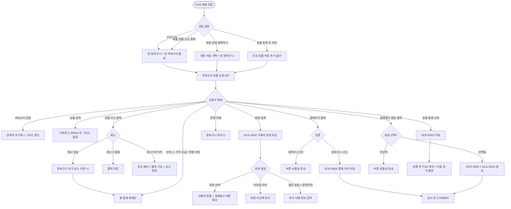
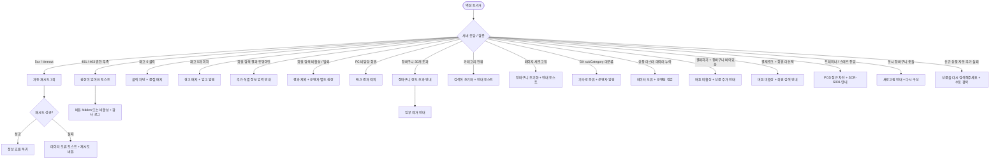

# SCR-S002 POS 판매 페이지

## 1. 화면 메타 정보

이 문서는 POS 판매 페이지에 대한 자기완결형 요구사항 정의서입니다. 다른 문서를 함께 보지 않아도 이 문서 한 장만으로 POS 판매 페이지에 들어가는 모든 영역, 모든 버튼, 모든 모달, 모든 권한, 모든 예외 처리, 그리고 이 화면을 지탱하는 운영 정책까지 전부 이해하고 구현할 수 있도록 작성합니다.

| 항목 | 값 |
|---|---|
| 작성일 | 2026-05-22 |
| 버전 | v1.0 |
| 상태 | 최신 통합본 반영 (정합화 완료) |
| 도메인 | D03 매출관리 |
| 화면 ID | SCR-S002 |
| 화면명 | POS 판매 |
| 화면 유형 | 워크플로우 진입 화면 (Cart Builder) |
| 라우트 (URL) | `/pos` |
| 플랫폼 | 데스크톱(기본), 태블릿(카운터용) |
| 우선순위 | P0 (출시 필수) |
| 기능코드 | SAL-EXT-05 (POS 판매 / 현장 판매) |
| 계약코드 | SAL-EXT-05 |
| 계약 상태 | 계약 범위 본기능 |
| 부모 기능 prefix | SAL |
| Lv1 코드 | SAL-EXT-05 |
| Lv2 / Lv3 세분화 | SAL-EXT-05-01 ~ SAL-EXT-05-08 (카테고리 탭, 상품 검색, 상품 카드 그리드, 장바구니 패널, 구매자 선택, 결제 진입, 상품 등록 단축, 재고/품절 처리) |
| 연계 화면 | SCR-S001 매출현황, SCR-S003 결제처리, SCR-P002 상품등록, SCR-P003 상품상세, SCR-M004 회원상세, SCR-097 감사로그 |
| 호출 다이얼로그 | DLG-S002 구매자검색, DLG-S016 결제링크발송(SCR-S003 경유) |

## 2. 화면 개요와 목적

POS 판매 페이지는 센터 현장에서 직원이 직접 상품을 선택하고 구매자를 지정해 결제 등록 화면으로 넘기는 현장 판매 화면입니다. 카운터에서 회원이 방문했을 때 이용권·PT·GX 등 다양한 상품을 빠르게 장바구니에 담고, 현금가·카드가를 선택한 뒤 결제 처리 화면(SCR-S003)으로 이동합니다.

이 화면이 다루는 운영 흐름은 다음과 같이 다양합니다. 카운터 매니저는 신규 회원 등록 시 1년 회원권 + 락카 묶음을 장바구니에 담고 회원을 검색해 결제 진입을 합니다. FC는 상담 후 PT 패키지 결제를 위해 PT 12회 + 멤버십을 담아 회원을 검색하고 외부 POS 결제 완료 후 영수증 첨부 등록을 진행합니다. 회원이 카드 미소지로 비대면 결제를 원하면 결제링크 발송 버튼으로 SCR-S003 + DLG-S016 흐름에 진입합니다. 비회원이 1회성으로 음료·운동복을 구매할 때는 회원 미선택 상태로 결제 진입이 가능하고, 포인트 사용 결제는 회원 검색이 필수입니다.

여기서 중요한 정합화 원칙이 하나 있습니다. 이 화면은 회원/상품 선택과 장바구니 구성을 담당하며, 실제 결제는 인포데스크(FC)가 외부 POS 또는 현금 수납으로 완료한 뒤 SCR-S003에서 영수증 파일을 첨부해 등록합니다. CRM은 카드 PG 승인을 직접 호출하지 않으며, 비대면 결제는 결제링크 발송 경로(PAY-06)로 별도 분기됩니다.

POS 현장의 빠른 응대를 위해 디바운스 300ms·실시간 검색·동일 상품 재클릭 시 수량 +1 같은 카운터 직원의 동작 흐름에 최적화되어 있으며, 본사 통합 모드는 적용되지 않고 항상 단일 지점에서 동작합니다.

## 3. 진입 경로와 인접 화면

POS 판매 페이지에 진입하는 경로는 다음과 같습니다.

첫 번째 경로는 사이드바입니다. 좌측 사이드바의 "매출관리" 메뉴 아래 "POS 판매" 항목을 클릭하면 빈 장바구니 상태로 진입합니다. URL은 `/pos`이며, 카테고리 탭은 첫 번째 탭(이용권 또는 회원권)이 기본 활성화됩니다.

두 번째 경로는 매출 현황 화면(SCR-S001)의 우측 상단 "신규 결제(POS)" 버튼입니다. 매출 현황을 보다가 신규 결제를 처리해야 할 때 즉시 진입하며, 회원 컨텍스트가 따로 전달되지는 않습니다.

세 번째 경로는 회원 상세 화면(SCR-M004)의 "결제하기" 또는 "신규 결제" 버튼입니다. 이 경우 해당 회원이 자동으로 구매자로 선택된 상태로 POS 판매 화면이 열려, 운영자가 따로 회원을 검색하지 않아도 됩니다.

네 번째 경로는 상품 등록(SCR-P002)에서 신규 상품을 등록한 뒤 "POS로 돌아가기" 버튼을 눌렀을 때입니다. 신규 등록한 상품이 자동으로 장바구니에 추가되는 옵션이 제공됩니다.

이 화면에서 빠져나가는 인접 화면으로는, "결제하기" 또는 "결제링크 발송" 버튼으로 진입하는 결제 처리(SCR-S003), 상품 등록 단축 버튼으로 진입하는 상품 등록(SCR-P002), 그리고 모든 장바구니 구성·구매자 변경·결제 진입 이벤트가 기록되는 감사 로그(SCR-097)가 있습니다.

장바구니는 동일 카운터 단말에서만 유지되며 페이지 새로고침 시 의도적으로 초기화됩니다. 이는 직원 교체 시 이전 장바구니가 잘못 결제되지 않도록 하는 안전 정책입니다.

## 4. 레이아웃과 UI 구성

POS 판매 페이지는 좌·우 2단 구성을 기본으로 합니다. 좌측은 상품 선택 영역(약 65%), 우측은 구매자·장바구니·결제 진입 영역(약 35%)으로 나뉘며, 카운터의 가로폭이 좁은 태블릿에서는 우측 패널이 슬라이드 인 방식으로 변경됩니다.

가장 위에는 페이지 헤더가 있습니다. 헤더 좌측에는 "POS 판매"라는 페이지 타이틀과 함께 현재 지점명이 표시됩니다. 본사 통합 모드는 POS에서는 적용되지 않으므로 통합 토글이 표시되지 않습니다. 헤더 우측에는 "상품 등록" 단축 버튼이 있어 매니저+ 권한자가 신규 상품을 즉시 등록할 수 있도록 합니다.

좌측 상품 선택 영역의 최상단에는 카테고리 탭이 있습니다. 카테고리는 회원권 / 수강권 / 락커 / 운동복 / 일반의 5개 탭으로 펼쳐지며, 각 탭 우측에는 해당 카테고리의 상품 수가 작은 배지로 표시됩니다. 레거시 센터에서는 이용권 / PT / GX / 기타의 4탭 매핑으로도 동작 가능하며, GX 카테고리는 2단계 세부 분류(요가·필라테스·스피닝·줌바·에어로빅·GX 기타)를 가집니다. 락커·운동복을 사용하지 않는 센터에서는 해당 탭이 숨겨집니다.

카테고리 탭 아래에는 상단 도구 바가 있습니다. 상품 타입 안내 텍스트, 상품 생성 버튼, 상품 삭제 버튼(매니저+ 권한), 타입별 필터, 정렬 드롭다운(이름순/생성순/수정순), 상품명 검색 입력창이 한 줄로 배치됩니다. 상품명 검색은 디바운스 300ms가 적용되어 실시간으로 카드 그리드가 좁혀집니다. 카테고리를 전환하면 검색어가 자동 초기화됩니다.

상단 도구 바 아래에는 상품 카드 그리드가 있습니다. 각 카드에는 상품 유형 배지(회원권·수강권·락커·운동복·일반), 상품명, 기간 또는 횟수, 현금가, 카드가가 표시됩니다. 카드 클릭은 장바구니 추가 액션이며, 동일 상품을 재클릭하면 장바구니 내 수량이 +1로 누적됩니다. 재고가 0인 상품은 카드 전체가 흐리게(투명도 낮춤) 표시되고 "품절" 배지가 붙으며 클릭이 차단됩니다. 재고가 5개 이하인 상품은 "재고 부족 ({개수}개)" 경고 배지가 표시되지만 클릭은 가능합니다. 현재 카테고리에 상품이 없으면 중앙에 "상품을 추가해주세요" 문구와 상품 생성 CTA가 표시되어, 매니저+ 권한자가 즉시 SCR-P002로 진입할 수 있습니다.

우측 영역의 최상단에는 구매 회원 패널이 있습니다. 회원 검색 버튼을 누르면 DLG-S002 구매자 검색 모달이 열리고, 이름 또는 전화번호로 회원을 검색해 선택합니다. 선택된 회원은 이름과 전화번호가 표시되며 우측 X 버튼으로 해제할 수 있습니다. 비회원으로 진행하는 경우 이 패널은 빈 상태로 두고 비회원 결제가 가능합니다. 포인트 사용 결제는 회원 선택이 필수이며, 회원 미선택 상태에서 SCR-S003에서 포인트 사용을 입력하면 차단됩니다.

구매 회원 패널 아래에는 장바구니 패널이 있습니다. 담긴 상품 목록이 카드형으로 위에서 아래로 쌓이며, 각 항목에는 상품명, 수량 조절 버튼(-/+), 현금/카드 가격 유형 전환 토글, 개별 삭제 버튼이 표시됩니다. 장바구니 헤더에는 "전체 삭제" 버튼과 "일괄 변경" 버튼이 있는데, 일괄 변경은 여러 항목을 묶어 가격 정책·판매 담당자·판매 메모를 한 번에 바꿀 수 있도록 합니다. 장바구니가 비어 있으면 장바구니 아이콘과 "상품을 추가해주세요" 안내가 표시됩니다. 장바구니 한도는 단일 장바구니 최대 30개 항목이며, 초과 시 "장바구니 한도 초과" 경고가 표시됩니다.

장바구니 패널 아래에는 귀속 요약 바가 있습니다. 상품 정책 기준의 결제지점·이용지점·매출 귀속 지점·정산 지점·인센티브 귀속자 기본값이 요약 표시되며, 법인/홈&오피스/주말/통합 회원권이 포함되면 경고 배지가 함께 노출됩니다. 이 다지점 회원권은 SCR-S003에서 별도 지점 귀속 설정을 거쳐야 결제 등록이 완료됩니다.

귀속 요약 바 아래에는 총 합계 영역이 있습니다. 장바구니 하단에 총 결제 금액이 크게 표시되고, 현금가와 카드가가 별도로 안내됩니다. 그 아래에 "결제하기" 버튼과 "결제링크 발송" 버튼이 나란히 배치됩니다. 결제하기 버튼은 장바구니에 상품이 1건 이상 있을 때 활성화되어 SCR-S003 결제 처리 화면으로 이동시키며, 결제링크 발송 버튼은 회원이 선택된 상태에서만 활성화되어 SCR-S003 + DLG-S016 발송 경로로 진입시킵니다.

페이지의 양쪽 모두에서 "이전으로 돌아가기" 버튼은 없으며, 사이드바를 통해 다른 메뉴로 이동합니다. 장바구니에 상품이 있는 상태에서 페이지를 떠나면 의도적으로 장바구니가 초기화되어, 다른 직원이 이어받지 않도록 보호합니다.

## 5. 탭 구성과 탭별 동작

이 화면은 단일 단계의 카테고리 탭만 가집니다. 회원권 / 수강권 / 락커 / 운동복 / 일반의 5개 탭(또는 레거시 매핑 시 이용권 / PT / GX / 기타의 4탭)으로 펼쳐지며, 어느 탭을 누르든 장바구니 상태와 구매 회원 선택 상태는 그대로 유지되고 좌측 상품 그리드만 새 카테고리로 갱신됩니다.

GX 카테고리는 2단계 세부 분류(`category=GX` + `subCategory`)를 가집니다. 운영자가 GX 탭을 선택하면 요가·필라테스·스피닝·줌바·에어로빅·GX 기타 6종 중 하나로 추가 필터링이 가능합니다. 상품 마스터에서 GX 상품은 subCategory를 필수로 가져야 하며, 누락된 상품은 "기타"로 분류되고 운영자에게 알림이 발송됩니다.

카테고리 전환 시 상품명 검색어는 자동으로 초기화됩니다. 이는 다른 카테고리에 동일한 검색어를 적용하지 않도록 보호하는 정책이며, 운영자가 의도적으로 같은 검색어를 유지하고 싶으면 검색을 다시 입력해야 합니다. 카테고리 전환 안내 토스트가 잠시 표시되어 검색어 초기화를 사용자에게 알립니다.

센터 설정에서 락커·운동복 미사용으로 체크된 경우, 해당 카테고리 탭은 아예 보이지 않습니다. 이는 락커·운동복을 운영하지 않는 센터에서 불필요한 탭을 보이지 않게 하기 위한 정책입니다.

## 6. 버튼·아이콘·링크 액션 전체 정의

이 화면에 등장하는 모든 클릭 가능한 요소를 빠짐없이 정의합니다.

카테고리 탭은 누르면 즉시 상품 카드 그리드가 새 카테고리로 갱신됩니다. 장바구니와 구매 회원 선택은 유지되며, 검색어는 자동 초기화됩니다.

상단 도구 바의 정렬 드롭다운은 이름순/생성순/수정순 중 선택하며 즉시 그리드 정렬이 변경됩니다. 상품명 검색은 디바운스 300ms 후 자동 실행되며, 검색어를 지우면 카테고리 내 전체 상품이 다시 표시됩니다. 상품 생성 버튼과 상품 삭제 버튼은 매니저+ 권한자에게만 보입니다. 상품 생성 버튼은 SCR-P002로 이동시키며, 신규 상품 등록 후 POS로 복귀하면 자동 추가 옵션이 제공됩니다. 상품 삭제 버튼은 선택된 상품을 마스터에서 삭제하는 액션으로, 확인 모달이 한 번 더 호출됩니다.

상품 카드를 클릭하면 장바구니에 추가됩니다. 동일 상품 카드를 다시 클릭하면 수량이 +1로 누적됩니다. 재고 0인 카드는 클릭이 차단되며, 재고 5개 이하인 카드는 경고 배지가 표시되지만 클릭은 가능합니다.

빈 카테고리의 "상품 추가하기" CTA는 SCR-P002로 진입시키며, 매니저+ 권한자가 즉시 신규 상품을 등록할 수 있습니다. FC·트레이너·스태프는 이 CTA가 보이지 않습니다.

구매 회원 패널의 "회원 검색" 버튼은 DLG-S002 구매자 검색 모달을 엽니다. 선택된 회원의 X 버튼은 회원 선택을 해제하며, 해제 시 결제링크 발송 버튼이 자동으로 비활성화됩니다.

장바구니 패널의 -/+ 버튼은 수량을 조절합니다. -1로 줄어 0이 되면 해당 항목이 장바구니에서 자동 제거됩니다. 현금/카드 가격 유형 전환 토글은 해당 항목의 가격을 즉시 재계산하며, 합계도 함께 갱신됩니다. 개별 삭제 X 버튼은 해당 항목만 장바구니에서 제거하고, 전체 삭제 버튼은 장바구니를 완전히 비웁니다.

일괄 변경 버튼은 여러 항목을 묶어 가격 정책, 판매 담당자, 판매 메모를 한 번에 변경합니다. 일괄 변경 모달에서 여러 항목을 선택한 뒤 변경할 속성과 값을 입력하면 선택된 모든 항목이 동시에 갱신됩니다.

총 합계 영역의 "결제하기" 버튼은 SCR-S003 결제 처리 화면으로 이동시키며, 장바구니와 구매 회원 정보가 결제 처리 화면으로 전달됩니다. 장바구니가 비어 있으면 비활성화되며, 트레이너·스태프 권한은 클릭 시 권한 안내 토스트가 표시됩니다.

"결제링크 발송" 버튼은 회원이 선택된 상태에서만 활성화됩니다. 누르면 SCR-S003 결제 처리 화면으로 이동하면서 수납 방식이 자동으로 "결제링크 발송"으로 설정되고, 거기서 DLG-S016 결제링크 발송 모달이 호출됩니다. 회원이 선택되지 않은 상태에서는 버튼이 비활성화되고 "회원을 먼저 선택해주세요" 안내가 표시됩니다.

페이지 헤더의 "상품 등록" 단축 버튼은 SCR-P002로 이동시키며, 매니저+ 권한자에게만 표시됩니다.

모든 버튼은 클릭 후 응답이 돌아오기 전까지 자동으로 비활성화되어 더블클릭이나 연타로 인한 중복 요청이 차단됩니다.

## 7. 호출되는 모달 동작

이 화면에서 호출되는 모달은 한 가지이며, 어떤 트리거로 열리고, 어떤 입력을 받고, 확인/취소를 누르면 부모 화면에서 어떤 변화가 일어나는지를 풀어 씁니다.

### 7-1. DLG-S002 구매자 검색 모달

구매자 검색 모달은 POS 판매 진행 시 구매 회원을 빠르게 찾아 연결하는 모달입니다. POS 판매 화면에서 구매 회원 패널의 "회원 검색" 버튼을 누르거나, 결제 진행 중 구매자를 변경하려고 할 때 열립니다.

모달 상단에는 "구매자 검색"이라는 제목이 표시되고, 그 아래에 검색 입력창이 있습니다. 검색은 이름, 연락처(전화번호), 회원번호 중 하나로 입력할 수 있으며, 300ms 디바운스 후 자동으로 검색 결과가 갱신됩니다. 검색 버튼을 별도로 누르지 않아도 입력만으로 결과가 표시되며, 별도 검색 버튼도 함께 제공되어 사용자 선호에 따라 사용 가능합니다.

검색 결과 목록에는 각 회원의 이름, 연락처, 회원 등급, 마지막 방문일이 한 행으로 표시됩니다. 결과가 2명 이상이면 동명이인 식별을 위해 전화번호 끝자리 또는 생년월일을 추가로 입력할 수 있는 보조 필드가 표시됩니다. 비활성/탈퇴 회원은 검색 결과에서 자동 제외되며, 본사 권한자만 별도 권한으로 비활성 회원을 조회할 수 있습니다. FC 권한자가 검색하면 RLS에 의해 본인 담당 회원만 결과에 노출됩니다.

회원을 선택하면 POS 화면에 구매자로 연결되고 모달이 닫힙니다. 검색 결과가 없으면 "검색 결과가 없습니다"라는 안내가 표시되고, 비회원 처리 버튼으로 회원 미선택 상태로 결제를 진행하거나 신규 회원 등록 화면으로 안내됩니다.

모달 하단에는 "비회원 처리" 버튼과 "닫기" 버튼이 있습니다. 비회원 처리 버튼은 회원 연결 없이 비회원으로 결제를 진행하도록 하며, 닫기 버튼은 검색을 취소하고 POS 화면으로 복귀합니다. ESC 키 또는 배경 클릭으로도 닫을 수 있습니다.

## 8. 토스트와 확인 팝업과 알럿

POS 판매 페이지에서 발생하는 모든 알림성 UI는 다음과 같은 패턴으로 동작합니다.

성공 토스트는 우측 상단에 녹색 계열로 5초 동안 표시되며, "장바구니에 상품을 추가했어요", "회원을 선택했어요", "신규 상품이 등록되었어요" 같은 짧은 문구로 결과를 알려줍니다.

실패 토스트는 우측 상단에 빨강 계열로 표시되며, "상품을 불러오지 못했어요", "권한이 없어요", "장바구니 한도 초과", "재고가 부족합니다" 같은 문구와 함께 "다시 시도" 보조 액션 버튼이 따라옵니다.

카테고리 전환 안내 토스트는 화면 중앙 하단에 회색 계열로 잠시 표시되며, "검색어가 초기화되었습니다"라는 메시지로 사용자에게 검색어 초기화를 알립니다.

장바구니 새로고침 초기화 안내는 페이지를 새로고침했거나 다른 화면으로 이동했다 돌아왔을 때 표시되며, "장바구니가 초기화되었습니다. 다시 구성해주세요"라는 안내로 의도적 초기화를 사용자에게 알립니다.

권한 알럿은 트레이너·스태프가 직접 URL로 진입하거나 결제하기를 시도했을 때 표시됩니다. "POS 화면에 접근할 권한이 없습니다" 또는 "매출 조회 화면으로 이동해주세요"라는 안내와 함께 3초 카운트다운 후 SCR-S001로 자동 이동됩니다.

## 9. 데이터 흐름과 외부 연동

이 화면은 여러 데이터 소스에 의존합니다. 화면 단위로 어떤 데이터가 어디서 오고 어디로 가는지를 모두 풀어 씁니다.

화면 진입 시점에는 카테고리별 상품 조회 API(`GET /api/products?category=`)가 호출됩니다. 응답으로는 상품 배열과 각 상품의 재고 정보가 함께 내려옵니다. 상품 검색 시에는 `GET /api/products?search=` API가 호출되며 디바운스 300ms 후 자동 실행됩니다. 상품의 재고는 `GET /api/products/:id/stock`으로 별도 조회하거나, 카테고리 조회 응답에 포함되어 내려옵니다.

회원 검색은 `GET /api/members?search=`로 수행됩니다. FC 권한자가 호출하면 RLS에 의해 본인 담당 회원만 결과에 포함되며, 비활성/탈퇴 회원은 결과에서 제외됩니다.

장바구니는 클라이언트 상태로만 관리되며, 백엔드에 저장되지 않습니다. `POST /api/cart/items` API는 장바구니 항목 추가를 백엔드에 동기화할 수 있지만, 기본은 클라이언트 상태로만 유지되어 페이지 새로고침 시 초기화됩니다. 장바구니 동시성은 동일 카운터 단말에서만 보장되며, 다른 단말에서 동시에 결제 진입이 일어나도 서로 영향을 주지 않습니다.

상품 재고는 결제 완료 등록 시(SCR-S003) 자동 감소하며, 결제링크 webhook 완료 시에도 자동 감소합니다. 재고가 5개 이하로 떨어지면 운영자에게 입고 알림이 발송되며, 재고가 0이 되면 자동으로 "품절" 배지가 적용됩니다. 재고 자동 감소는 `POST /api/products/:id/stock-decrease` API로 처리되며, 결제 트랜잭션의 일부로 함께 커밋됩니다.

카테고리 자동 분류는 상품 마스터의 `category` 필드 기반입니다. 신규 상품 등록 시 카테고리를 지정하지 않으면 "기타"로 분류되고 운영자에게 알림이 발송됩니다. GX 카테고리는 추가로 `subCategory`를 가져야 하며, 누락 시 GX 세부 종목 분포(SAL-03)에서 "기타"로 분류됩니다.

장바구니 구성·구매자 변경·결제 진입은 모두 SCR-097 감사 로그에 비동기로 INSERT됩니다. 기록 필드는 `actor_id`, `cart`, `member_id`, `result`, `timestamp`이며, 결제 진입 시점에 일괄 INSERT되어 운영 행위의 추적성을 보장합니다.

본사 통합 모드는 POS에서 적용되지 않습니다. POS는 항상 단일 지점의 현장 판매를 다루므로, 통합 토글이 표시되지 않고 모든 데이터는 현재 지점 기준으로만 동작합니다. 본사 슈퍼관리자가 POS에 진입해도 자신이 선택한 지점 컨텍스트로만 작업합니다.

NFR-19 알림 센터는 비정상 결제 패턴(짧은 시간 내 동일 회원 다중 결제 등) 감지 시 운영자에게 알림을 발송합니다. SCR-094 KPI 시스템은 결제 진입 시점에 일별 POS 진입 KPI를 누적합니다.

화면에서 호출하는 주요 API 엔드포인트는 다음과 같습니다. 카테고리 상품 조회 `GET /api/products?category=`, 상품 검색 `GET /api/products?search=`, 재고 조회 `GET /api/products/:id/stock`, 회원 검색 `GET /api/members?search=`, 장바구니 동기화(옵션) `POST /api/cart/items`.

## 10. 화면 상태와 예외 처리

POS 판매 페이지는 다음 상태들을 가질 수 있고, 각 상태마다 사용자에게 보이는 모습이 달라집니다.

로딩 중 상태에서는 상품 카드 그리드 자리에 카드 모양의 스켈레톤이 표시되어 데이터를 불러오고 있음을 알려줍니다. 우측 패널의 구매 회원과 장바구니는 미리 렌더되지만, 결제하기 버튼은 비활성 상태로 표시됩니다.

상품 정상 표시 상태는 카테고리에 상품이 한 개 이상 있을 때 카드 그리드가 채워진 상태입니다. 모든 클릭 가능한 영역이 권한에 맞게 활성/비활성으로 동작합니다.

상품 없음 상태는 해당 카테고리에 등록된 상품이 없을 때 표시됩니다. 중앙에 "상품을 추가해주세요" 문구와 상품 생성 CTA 버튼이 표시되며, 매니저+ 권한자만 CTA가 보입니다.

품절 상품 상태는 재고가 0인 상품 카드에 적용됩니다. 카드가 흐리게 표시되고 "품절" 배지가 붙으며 클릭이 차단됩니다.

재고 부족 상태는 재고가 5개 이하인 상품 카드에 적용됩니다. "재고 부족 ({개수}개)" 경고 배지가 표시되지만 클릭은 가능하며, 운영팀에 입고 알림이 자동 발송됩니다.

장바구니 비어있음 상태에서는 우측 장바구니 패널에 빈 상태 안내가 표시되고, 결제하기 버튼이 비활성화됩니다. 결제링크 발송 버튼도 동시에 비활성화됩니다.

장바구니 구성 중 상태는 한 개 이상의 상품이 담겨 있는 상태입니다. 목록과 합계가 표시되고, 결제하기 버튼이 활성화됩니다. 회원이 선택되어 있으면 결제링크 발송 버튼도 활성화됩니다.

구매자 미선택 상태는 회원이 선택되지 않은 상태로, 비회원 결제가 가능합니다. 결제링크 발송 버튼은 비활성화됩니다.

구매자 선택됨 상태에서는 회원 이름과 전화번호가 표시되고 X 버튼으로 해제 가능합니다. 결제링크 발송 버튼도 함께 활성화됩니다.

예외 회원권 포함 상태는 법인/홈&오피스/주말/통합 회원권이 장바구니에 담긴 상태로, 귀속 요약 바에 경고 배지와 정책 검토 메시지가 표시됩니다.

빈 카테고리 상태는 현재 카테고리에 상품이 없을 때 중앙 빈 상태 프롬프트와 상품 생성 CTA를 표시합니다.

검색 결과 동명이인 상태는 회원 검색 결과가 2명 이상일 때 추가 식별 정보 요청을 표시합니다.

권한 미달 상태에서는 트레이너·스태프가 진입했을 때 POS 접근이 차단되고 매출 조회 안내가 표시됩니다.

예외 케이스별 처리는 다음과 같이 정의됩니다.

상품 없음일 때는 빈 상태 안내와 카테고리 변경 권유가 표시됩니다. 검색 결과 0건이면 "검색 결과가 없어요" 안내와 검색어 변경 권유가 표시됩니다. 품절 상품 클릭은 흐림+클릭 차단으로 처리되며 "품절" 배지가 안내합니다. 재고 5개 이하는 "재고 부족" 경고가 표시되고 운영팀에 입고 알림이 발송됩니다.

회원 검색 0건이면 "검색 결과가 없어요" 안내와 비회원 진행 안내가 표시됩니다. 동명이인 2명 이상이면 추가 식별 입력 안내가 표시됩니다. 비활성/탈퇴 회원은 검색 결과에서 자동 제외됩니다.

장바구니 비어있음이면 결제하기 버튼이 비활성화되고 상품 추가 안내가 표시됩니다. 포인트 사용 회원 미선택은 SCR-S003 단계에서 차단되어 회원 검색 안내가 표시됩니다. 결제링크 회원 미선택이면 버튼이 비활성화되고 회원 검색 안내가 표시됩니다.

장바구니가 30개를 초과하면 "장바구니 한도 초과" 안내와 일부 제거 안내가 표시됩니다. 트레이너 권한자가 POS에 진입하면 접근 차단과 매출 조회 화면 안내가 표시됩니다.

신규 상품 자동 추가에 실패하면 "상품을 다시 검색해주세요" 안내와 수동 검색 권유가 표시됩니다. 카테고리 전환 시 검색어 초기화 안내 토스트가 표시됩니다. 장바구니 새로고침 초기화 안내 토스트는 의도적 초기화를 사용자에게 알립니다.

결제 총액 불일치는 SCR-S003에서 정정 안내가 표시되며, 영수증 미첨부는 SCR-S003에서 차단됩니다. GX 세부 종목 미분류는 "기타"로 분류되고 운영자 알림이 발송됩니다.

FC 비담당 회원 검색은 RLS에 의해 결과에서 제외됩니다. 상품 마스터 데이터 누락이면 "데이터 오류" 토스트가 표시되고 운영팀 점검이 안내됩니다. 동시 장바구니 충돌이 발생하면 새로고침 안내가 표시됩니다.

## 11. 권한별 처리

이 화면은 권한에 따라 진입 가능 여부, 보이는 영역, 가능한 액션이 모두 달라집니다.

슈퍼관리자(superAdmin)와 본사 최고관리자(primary)는 모든 기능을 사용할 수 있습니다. 화면 진입에 제약이 없고, 상품 선택, 장바구니 구성, 구매자 지정, 영수증 첨부 결제 등록 진입, 결제링크 발송 진입, 상품 등록 단축까지 모두 가능합니다. 단 본사 통합 모드는 POS에서 적용되지 않으므로 통합 토글은 표시되지 않습니다.

센터장(owner)과 매니저(manager)는 자기 지점의 POS를 모두 사용할 수 있습니다. 상품 선택, 장바구니 구성, 구매자 지정, 영수증 첨부 결제 등록 진입, 결제링크 발송 진입, 상품 등록 단축 진입까지 가능합니다. 상품 등록 단축은 매니저+ 권한자만 가능합니다.

FC(피트니스 코치, fc)는 담당 회원의 결제 등록만 가능합니다. 상품 선택과 장바구니 구성은 가능하지만, 회원 검색은 RLS에 의해 본인 담당 회원만 결과에 노출됩니다. 외부 POS 결제 후 영수증 첨부 결제 등록 진입과 결제링크 발송은 가능하지만, 상품 등록 단축 버튼은 보이지 않습니다.

트레이너(trainer)와 스태프(staff)는 POS 화면 접근이 차단되거나 조회 전용입니다. 직접 URL로 진입을 시도하면 권한 알럿이 표시되고 SCR-S001 매출 현황으로 자동 이동됩니다.

읽기 전용(readonly)은 POS 화면에 접근할 수 없습니다.

권한 외에도 운영 모드에 따라 일부 영역이 추가로 보이거나 숨겨집니다. 락커·운동복 미사용 센터에서는 해당 카테고리 탭이 숨겨집니다. 상품 등록·삭제 버튼은 매니저+ 권한자에게만 표시됩니다.

권한이 부족해서 액션이 차단된 경우의 사용자 경험은 단계별로 일관됩니다. 첫째, 사이드바·헤더 같은 1차 진입점에서는 메뉴 자체가 숨겨집니다. 둘째, 화면 내부의 버튼은 권한이 부족하면 아예 보이지 않거나(상품 등록·결제하기) 비활성화 상태로 표시됩니다. 셋째, 클릭 가능하지만 권한이 모자란 경우에는 백엔드 응답이 403이 되어 "권한이 없어요" 토스트가 표시되고 변경이 적용되지 않습니다. 모든 권한 차단 이벤트는 감사 로그에 기록됩니다.

## 12. 메인 흐름

POS 판매 페이지의 핵심 동작 흐름을 다이어그램으로 표현합니다.

## 13. 에러와 예외 흐름

에러와 예외 상황에서의 분기를 별도 흐름으로 표현합니다.

## 14. 핵심 디자인 요청사항

이 화면이 운영자에게 잘 작동하려면 다음 디자인 원칙이 시각적으로 명확히 드러나야 합니다.

카테고리 탭은 가로로 펼쳐지며 활성 탭은 강조 색상과 하단 인디케이터로 즉시 구분됩니다. 각 탭 우측의 상품 수 배지는 작은 회색 라운드 배지로 표시하고, 카테고리 전환 시 부드러운 슬라이드 전환 애니메이션을 적용해 사용자가 변화를 인지하기 쉽도록 합니다.

상품 카드는 균일한 그리드(데스크톱 4열, 태블릿 3열, 모바일 2열)로 배치되며, 카드 호버 시 약간의 그림자 변화로 클릭 가능함을 알려야 합니다. 상품 유형 배지(회원권·수강권·락커·운동복·일반)는 카드 좌측 상단에 작은 컬러 배지로 표시하고, 재고 부족 배지는 우측 상단에 빨강·주황 톤으로 표시합니다. 품절 카드는 전체 투명도를 0.4 정도로 낮추고 회색 "품절" 라벨을 중앙에 오버레이로 표시해 클릭 불가가 명확히 보이도록 합니다.

상품 카드의 가격 표시는 현금가와 카드가가 동시에 보이도록 두 줄로 배치하며, 현재 선택된 가격 유형(예: 카드가)이 더 굵게 강조됩니다. 장바구니에 추가된 상품의 카드는 상단에 작은 체크 아이콘이 표시되어 이미 담겨 있음을 알립니다.

우측 패널은 좌측 상품 영역보다 약간 어두운 배경 톤으로 분리되어, 카운터 직원이 시각적으로 분리된 두 작업 공간을 인지할 수 있어야 합니다. 구매 회원 영역은 패널 최상단에 카드형으로 배치되고, 선택된 회원이 있으면 회원 이름이 강조 색상으로 표시됩니다.

장바구니 항목은 카드형으로 위에서 아래로 쌓이며, 각 항목의 -/+ 버튼은 충분히 큰 클릭 영역을 가지고 카운터 직원의 빠른 입력을 보장합니다. 수량 표시는 -/+ 버튼 사이에 큰 폰트로 배치되고, 합계는 장바구니 하단에 페이지 전체에서 가장 큰 폰트로 강조됩니다.

결제하기 버튼은 화면 우측 하단에 큰 직사각형으로 배치되며 강조 색상(주황 또는 녹색 계열)으로 표시됩니다. 결제링크 발송 버튼은 결제하기 버튼 옆에 보조 컬러로 배치되어, 비대면 결제 경로가 명확히 구분되도록 합니다. 두 버튼 모두 활성/비활성 상태가 컬러와 투명도로 즉시 구분되어야 합니다.

귀속 요약 바는 장바구니 하단에 작은 회색 텍스트로 표시되되, 다지점 회원권 경고는 노랑 또는 주황 톤으로 강조 표시되어 운영자가 정책 검토가 필요함을 즉시 인지할 수 있어야 합니다.

DLG-S002 구매자 검색 모달은 카운터 단말의 짧은 시야를 고려해 가로로 넓은 다이얼로그로 표시되며, 검색 결과 목록은 한 행에 회원의 핵심 정보(이름·연락처·등급·마지막 방문일)가 한눈에 들어오도록 컴팩트하게 배치됩니다.

태블릿 카운터 모드에서는 우측 패널이 슬라이드 인 방식으로 변경되어, 좌측 상품 영역의 가로폭을 최대한 확보합니다. 장바구니에 항목이 추가되면 우측 패널이 자동으로 펼쳐져 사용자가 결제 진입까지 매끄럽게 이동할 수 있도록 합니다.

진행 스피너와 로딩 스켈레톤은 매출관리 전체에서 동일한 톤으로 통일됩니다.

## 15. 운영 정책 (이 화면에 연결된 부분)

이 화면은 단순한 UI가 아니라 현장 판매의 운영 정책이 그대로 반영된 도구입니다. 다른 문서를 보지 않아도 이 화면을 구현·운영하는 사람이 알아야 할 정책을 모두 풀어 씁니다.

CRM 직접 PG 제외 정책이 가장 중요합니다. 현장 판매의 카드·현금 결제 승인은 외부 POS 단말 또는 현장 수납으로 완료하며, CRM은 PG 승인 요청을 직접 보내지 않습니다. POS 화면에서는 회원/상품 선택과 장바구니 구성만 담당하고, 실제 결제는 SCR-S003에서 영수증 파일을 첨부해 등록합니다. 비대면 결제는 결제링크 발송 경로(PAY-06)로 별도 분기됩니다.

포인트 사용 결제는 회원 선택이 필수입니다. POS에서 비회원 결제는 가능하지만, 포인트 사용을 입력하려면 회원이 반드시 선택되어 있어야 하며, SCR-S003 결제 등록 단계에서 회원 미선택 상태로 포인트를 입력하면 차단됩니다.

비회원 결제는 비회원 거래로 기록됩니다. 비회원 거래는 회원 카드에 결제 이력이 남지 않고, 영수증 첨부와 세금계산서 발행은 별도 처리됩니다. 비회원 결제에는 포인트 사용·이용권 부여가 불가능합니다.

재고 정책은 다음과 같습니다. 재고 0인 상품은 클릭이 차단되며 "품절" 배지가 표시됩니다. 재고 5개 이하인 상품은 "재고 부족" 경고 배지가 표시되지만 판매는 가능하며, 운영팀에 입고 알림이 자동 발송됩니다. 재고는 결제 완료 등록 시(SCR-S003) 또는 결제링크 webhook 완료 시 자동 감소합니다.

장바구니 한도는 단일 장바구니 최대 30개 항목입니다. 이 한도는 카운터 한 회의 결제에서 처리할 수 있는 합리적 상한선이며, 30개 초과 시 일부 제거를 안내합니다.

장바구니 동시성은 동일 카운터 단말에서만 유지됩니다. 페이지 새로고침이나 다른 화면 이동 시 의도적으로 초기화되어, 직원 교체나 시간 경과로 인한 잘못된 결제를 방지합니다. 이는 카운터 운영 안전을 위한 정책입니다.

본사 통합 모드는 POS에서 적용되지 않습니다. POS는 항상 현재 지점의 현장 판매를 다루며, 본사 슈퍼관리자가 POS에 진입해도 단일 지점 기준으로만 작업합니다. 이는 현장 판매의 단순성과 매출 귀속 명확성을 위한 정책입니다.

GX 세부 종목 분류는 상품 마스터의 2단계 분류(`category=GX` + `subCategory`)를 기준으로 합니다. GX 카테고리 상품은 subCategory를 필수로 가져야 하며, 누락된 상품은 "기타"로 분류되고 운영자에게 알림이 발송됩니다. 이 분류는 SAL-03 매출 통계의 GX 세부 종목 분포(요가·필라테스·스피닝·줌바·에어로빅·GX 기타)와 동일 기준을 사용합니다.

회원 동명이인 식별은 검색 결과가 2명 이상일 때 추가 식별 정보(전화번호 끝자리·생년월일)를 입력받아 정확한 회원을 선택하도록 합니다. 잘못된 회원 선택은 결제 후 환불·이력 정정 등 후속 작업을 유발하므로, 검색 단계에서의 정확성이 중요합니다.

비활성·탈퇴 회원은 검색 결과에서 자동 제외됩니다. 본사 권한자만 별도 권한으로 비활성 회원을 조회할 수 있으며, 이는 탈퇴한 회원에게 잘못 결제하는 사고를 방지하는 정책입니다.

FC RLS 정책은 FC가 회원 검색 시 본인 담당 회원만 결과에 포함되도록 보장합니다. 다른 FC의 담당 회원이나 미배정 회원은 검색되지 않으며, 이는 회원 데이터의 격리와 영업 책임 명확화를 위한 정책입니다.

권한별 가능 범위는 다음과 같습니다. 매니저 이상은 모든 기능, FC는 본인 담당 회원 결제 등록과 결제링크 발송까지, 트레이너·스태프는 POS 접근 차단입니다. 상품 등록 단축은 매니저+ 권한자만 가능합니다.

상품 카테고리 자동 분류는 상품 마스터의 `category` 필드 기반입니다. 신규 상품 등록 시 카테고리를 지정하지 않으면 "기타"로 분류되고 운영자에게 알림이 발송됩니다. 카테고리 변경은 운영팀이 상품 마스터에서 수행합니다.

감사 로그는 장바구니 구성·구매자 변경·결제 진입을 모두 SCR-097에 기록합니다. 기록 필드는 `actor_id`, `cart`, `member_id`, `result`, `timestamp`이며, 결제 진입 시점에 일괄 INSERT됩니다. 이는 카운터 운영의 추적성을 보장하기 위한 정책입니다.

이상의 모든 정책은 이 화면을 구현하고 운영하는 사람이 별도 문서 없이 이 한 장만 보면 이해할 수 있도록 풀어 적었습니다. 정책이 바뀌면 이 문서가 함께 갱신되어야 하며, 코드 변경과 정책 변경은 항상 짝지어 진행됩니다.
