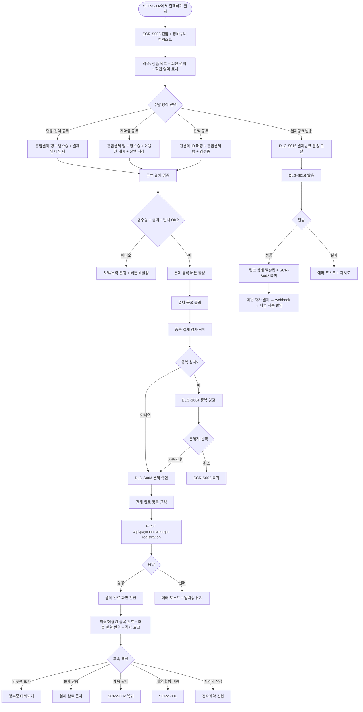

# SCR-S003 결제 처리 페이지

## 1. 화면 메타 정보

이 문서는 결제 처리 페이지에 대한 자기완결형 요구사항 정의서입니다. 다른 문서를 함께 보지 않아도 이 문서 한 장만으로 결제 처리 페이지에 들어가는 모든 영역, 모든 버튼, 모든 모달, 모든 권한, 모든 예외 처리, 그리고 이 화면을 지탱하는 운영 정책까지 전부 이해하고 구현할 수 있도록 작성합니다.

| 항목 | 값 |
|---|---|
| 작성일 | 2026-05-22 |
| 버전 | v1.0 |
| 상태 | 최신 통합본 반영 (정합화 완료) |
| 도메인 | D03 매출관리 |
| 화면 ID | SCR-S003 |
| 화면명 | 결제 처리 |
| 화면 유형 | 트랜잭션 등록 화면 (Transaction Form) |
| 라우트 (URL) | `/pos/payment` |
| 플랫폼 | 데스크톱(기본), 태블릿(카운터용) |
| 우선순위 | P0 (출시 필수) |
| 기능코드 | PAY-01 (결제 처리 / 영수증 첨부 등록 + 결제링크), PAY-06 (결제링크 발송) |
| 계약코드 | PAY-01, PAY-06 |
| 계약 상태 | 계약 범위 본기능 |
| 부모 기능 prefix | PAY |
| Lv1 코드 | PAY-01 |
| Lv2 / Lv3 세분화 | PAY-01-01 ~ PAY-01-12 (결제 상품 목록, 회원 검색, 할인 입력, 수납 방식, 현장 결제 등록 정보, 이용권 개시 옵션, 금액 일치 검증, 결제링크 발송, 결제 확인 모달, 중복 결제 경고, 결제 완료 화면, 초기화/이전) |
| 연계 화면 | SCR-S002 POS판매, SCR-S001 매출현황, SCR-M004 회원상세, SCR-S008 미수금관리, SCR-S009 할부결제관리, SCR-S010 세금계산서발행, SCR-097 감사로그 |
| 호출 다이얼로그 | DLG-S003 결제확인, DLG-S004 중복결제경고, DLG-S016 결제링크발송 |

## 2. 화면 개요와 목적

결제 처리 페이지는 POS 판매 화면(SCR-S002)에서 구성한 장바구니를 결제완료 상태로 확정하는 트랜잭션 화면입니다. 이 화면의 가장 중요한 정합화 원칙은 다음과 같습니다. 현장 판매에서는 CRM이 카드 PG 승인을 직접 수행하지 않습니다. 인포데스크(FC)가 외부 POS 단말 또는 현금/계좌이체 수납으로 실제 결제를 먼저 완료하고, CRM에는 혼합결제 행, 포인트 사용액, 결제일시, 영수증 파일, VAN/POS 결과, 지점 귀속 필드를 등록합니다. 등록이 성공하면 별도 매니저 승인 없이 결제완료와 회원/이용권 등록 완료가 즉시 반영됩니다. 비대면 고객을 위한 PAY-06 결제링크 발송은 별도 분기로 유지됩니다.

이 화면이 다루는 운영 흐름은 다양합니다. 카운터 매니저는 1년 회원권 결제를 외부 POS로 완료한 뒤 영수증을 첨부해 등록하고, FC는 신규 회원 PT 패키지를 카드/현금/계좌이체 결제와 포인트 사용을 혼합한 뒤 영수증 첨부와 등록을 동시에 처리합니다. 계약금만 받고 다음 달 잔액을 받을 때는 당일 결제가격과 잔액 처리 방식(수기 분할 미수금 또는 정기 할부)을 선택합니다. 비대면 결제는 DLG-S016 결제링크 발송으로 SMS/카톡 링크를 보내고 회원이 직접 결제하면 webhook으로 매출이 자동 반영됩니다.

영수증 파일 첨부는 현장 판매 결제 등록의 필수 조건입니다. 첨부가 없으면 결제 완료 등록 버튼은 활성화되지 않습니다. 또한 혼합결제 행 합계와 포인트 사용액의 합이 장바구니 최종 합계와 정확히 일치해야 결제 등록이 가능합니다. 일치하지 않으면 차액이 빨강으로 표시되고 버튼이 비활성화됩니다.

이 화면은 회원 등급 자동 할인과 PRD-04 할인 정책 자동 매칭, 다지점 회원권 귀속 필드, 5년 매출 보관, 감사 로그 추적성 같은 운영 정책이 모두 녹아 있는 핵심 트랜잭션 화면입니다.

## 3. 진입 경로와 인접 화면

결제 처리 페이지에 진입하는 경로는 다음과 같습니다.

첫 번째 경로는 POS 판매 화면(SCR-S002)의 "결제하기" 버튼입니다. 장바구니가 1건 이상 구성된 상태에서 누르면 결제 처리 화면으로 이동하면서 장바구니와 구매 회원 정보가 컨텍스트로 전달됩니다. 이때 수납 방식은 기본 "현장 전액 등록"이 선택됩니다.

두 번째 경로는 POS 판매 화면의 "결제링크 발송" 버튼입니다. 회원이 선택된 상태에서 이 버튼을 누르면 결제 처리 화면으로 이동하면서 수납 방식이 자동으로 "결제링크 발송"으로 설정되고, 화면 우측에 DLG-S016 결제링크 발송 모달이 호출됩니다.

세 번째 경로는 미수금 관리(SCR-S008)에서 잔액 결제 진입입니다. 미수금 행의 액션에서 "잔액 결제" 버튼을 누르면 결제 처리 화면이 잔액 등록 모드로 열리며, 원결제 ID가 자동 매핑된 상태로 영수증 첨부와 결제 등록을 진행할 수 있습니다.

네 번째 경로는 할부 관리(SCR-S009)에서 할부 회차 납입 진입입니다. 다만 단일 회차 납입은 보통 DLG-S008 납입 처리 모달로 처리되며, 결제 처리 화면은 신규 할부 등록(DLG-S009)이나 계약금 + 잔액 분할의 케이스에서 사용됩니다.

이 화면에서 빠져나가는 인접 화면으로는, 결제 완료 후 "매출 현황 이동" 버튼으로 진입하는 매출 현황(SCR-S001), 영수증 파일 미리보기로 진입하는 영수증 뷰어, 회원 카드 즉시 활성화 결과를 확인하는 회원 상세(SCR-M004), 잔액이 미수금으로 등록되는 경우 SCR-S008 미수금 관리, 잔액이 정기 할부로 등록되는 경우 SCR-S009 할부 관리, 법인 회원 결제 후 세금계산서 발행 가능 큐로 진입하는 SCR-S010 세금계산서, 그리고 모든 결제 등록 시도·성공·실패·취소가 기록되는 감사 로그(SCR-097)가 있습니다.

이전으로 돌아가기 버튼은 SCR-S002 POS 판매 화면으로 복귀시키며, 결제 진행 중 작성한 정보는 사라집니다. 초기화 버튼은 결제 상태를 리셋해 처음부터 다시 입력할 수 있게 합니다.

## 4. 레이아웃과 UI 구성

결제 처리 페이지는 좌·우 2단 구성을 기본으로 합니다. 좌측은 결제 상품 목록과 회원 정보(약 40%), 우측은 결제 등록 정보 입력 영역(약 60%)으로 나뉘며, 카운터 단말에서 한눈에 정보를 확인하고 입력할 수 있도록 설계됩니다.

가장 위에는 페이지 헤더가 있습니다. 헤더 좌측에는 "결제 처리"라는 페이지 타이틀과 함께 현재 진행 중인 결제의 임시 ID 또는 진행 단계 표시가 있습니다. 헤더 우측에는 "초기화" 버튼과 "이전으로 돌아가기" 버튼이 있습니다. 초기화 버튼은 현재 입력된 모든 결제 정보를 리셋하며, 이전 버튼은 SCR-S002로 복귀합니다.

좌측 패널의 최상단에는 결제 상품 목록이 있습니다. POS에서 담아온 상품명·수량·소계가 표 형태로 표시되고, 하단에 장바구니 최종 합계가 큰 폰트로 강조됩니다. 이 영역은 읽기 전용이며, 상품을 수정하려면 SCR-S002로 돌아가야 합니다.

상품 목록 아래에는 회원 검색 영역이 있습니다. 포인트 사용이나 회원/이용권 등록이 포함된 결제에서는 회원 지정이 필수이며, 이름 또는 전화번호로 검색해 회원을 선택하면 보유 포인트가 표시됩니다. 선택된 회원은 X 버튼으로 해제할 수 있고, 회원 검색 영역 옆에는 회원 등급 자동 할인과 PRD-04 자동 적용 정책 매칭 결과가 표시됩니다. 회원 등급, 매칭된 정책명, 적용 조건(등급/세그먼트/수동), 할인율 또는 할인 금액, 자동 적용 여부가 한 행씩 표시되며, 운영자가 자동 할인을 변경하거나 제거하려면 변경 사유를 필수로 입력해야 합니다.

회원 검색 아래에는 할인 입력 영역이 있습니다. 할인 항목(정가 / 할인 항목 / 할인 금액)을 입력하면 장바구니 최종 합계와 잔액이 즉시 재계산됩니다. 자동 적용된 등급/정책 할인을 수동으로 변경하면 변경 사유 입력이 필수이며, 변경 이력은 SCR-097 감사 로그에 원정책과 변경값으로 기록됩니다.

우측 패널의 최상단에는 수납 방식 선택 영역이 있습니다. 현장 전액 등록 / 계약금 등록 / 잔액 등록 / 결제링크 발송의 4가지 라디오 버튼이 가로로 배치되고, 선택에 따라 아래 영역의 입력 필드가 동적으로 달라집니다. 현장 전액 등록은 외부 POS/현금 결제가 끝난 전체 금액을 등록하는 모드, 계약금 등록은 당일 결제가격과 포인트 사용액을 등록하고 잔액을 미수금 또는 할부로 분기하는 모드, 잔액 등록은 기존 계약의 남은 잔액에 대한 현장 결제 영수증을 등록하는 모드, 결제링크 발송은 금액 확정 후 고객 직접 결제 링크를 발송하는 모드입니다.

수납 방식 아래에는 현장 결제 등록 정보 영역이 있습니다. 이 영역은 현장 전액 등록, 계약금 등록, 잔액 등록일 때 활성화되며, 결제링크 발송 모드에서는 숨겨집니다. 영역에는 혼합결제 행 그리드가 있는데, 카드/현금/계좌이체를 1개 이상 1행으로 추가할 수 있고 동일 수단의 다중 행도 허용됩니다. 각 행에는 결제수단 선택, 금액, 승인번호(카드), 입금자명·이체확인번호(계좌이체), 승인시각, 영수증 파일, 메모 입력 필드가 있습니다.

혼합결제 행 그리드 아래에는 포인트 사용 영역이 있습니다. 회원이 선택되어 있고 포인트가 0보다 크면 포인트 사용 토글이 활성화되며, 사용액 입력 시 보유 포인트 이내로 검증됩니다. 비회원 결제에서는 포인트 입력 필드 자체가 hidden 처리됩니다.

포인트 사용 영역 아래에는 결제일시 입력 필드가 있습니다. 영수증 기준 결제 완료 시각을 운영자가 직접 입력하며, 기본값은 현재 시각이지만 과거 시점의 영수증을 등록할 때는 영수증 발행 시각으로 변경할 수 있습니다.

결제일시 아래에는 영수증 파일 첨부 영역이 있습니다. 이미지 또는 PDF 파일을 드래그&드롭 또는 파일 선택으로 첨부하며, 첨부가 없으면 결제 완료 등록 버튼이 활성화되지 않습니다. 여러 결제수단 행 각각에 영수증을 첨부할 수도 있고, 단일 통합 영수증을 첨부할 수도 있습니다.

영수증 영역 아래에는 FC 메모 영역과 VAN/POS 결과 박스가 있습니다. FC 메모는 현장 확인 내용·특이사항을 자유 입력하는 텍스트 박스이며, VAN/POS 결과 박스에는 승인번호·단말 ID·승인 결과·응답메시지·외부 거래번호·영수증 매칭 상태가 표시됩니다. 수기 입력 또는 연동 조회 결과를 모두 저장할 수 있습니다.

VAN/POS 박스 아래에는 지점 귀속 설정 영역이 있습니다. 결제지점·이용지점·매출 귀속 지점·정산 지점·인센티브 귀속자가 한 줄씩 표시되며, 상품 기본값을 자동 채우되 운영자가 조정할 수 있습니다. 법인/홈&오피스/주말/통합 회원권이 장바구니에 포함되면 이 영역이 강조 표시됩니다.

수납 방식이 계약금 등록일 때는 이용권 개시 옵션 영역이 추가로 표시됩니다. 즉시 개시 / 완납 후 개시 라디오 버튼이며, 즉시 개시를 선택하면 INSTALLMENT 상태에서도 이용권을 개시할 수 있습니다. 그 옆에 잔액 처리 방식 선택(수기 분할 미수금 / 정기 할부)이 있어, 잔액을 어디로 라우팅할지 결정합니다.

수납 방식이 결제링크 발송일 때는 우측 영역이 결제링크 발송 진입 영역으로 전환됩니다. 회원 연락처와 만료일시(발송 시점 + 7일) 확인 후 [결제링크 발송] 버튼을 누르면 DLG-S016 모달이 열려 채널 선택과 발송이 이루어집니다.

결제 등록 정보 영역 하단에는 결제 금액 요약이 한 줄로 표시됩니다. 정가 / 할인 / 당일 등록 금액(수납액) / 잔액 / 결제 경로가 각각 표시되며, 금액 일치 검증 결과가 옆에 표시됩니다. `혼합결제 행 합계 + 포인트 사용액 = 장바구니 최종 합계`가 일치하면 녹색 체크, 불일치하면 빨강 차액과 함께 결제 등록 버튼이 비활성화됩니다.

화면 가장 아래에는 [결제 등록] 버튼이 있습니다. 영수증 첨부 + 금액 일치 + 결제일시 입력 + 필수 회원/포인트 검증을 모두 통과하면 활성화됩니다. 누르면 DLG-S003 결제 확인 모달이 열립니다. 결제링크 발송 모드에서는 [결제 등록] 대신 [결제링크 발송] 버튼이 표시됩니다.

결제 등록이 성공하면 화면이 결제 완료 화면으로 전환됩니다. 큰 체크 아이콘과 "결제가 완료되었습니다" 메시지, 회원/이용권 등록 완료 안내, 그리고 후속 액션 버튼 4개(영수증 파일 보기 / 문자 발송 / 계속 판매하기 / 매출 현황으로 이동)가 표시됩니다. 또한 전자계약 후속 선택 영역이 표시되어, 계약서 미작성 / 계약서 작성 중에서 선택할 수 있습니다. 계약서 작성 선택 시 강습 / 개인락커 / 양도 / 회원권 / 일일이용 유형 중 맞는 계약서를 골라 진행합니다.

## 5. 탭 구성과 탭별 동작

이 화면은 탭이 없습니다. 단일 트랜잭션 화면이며, 수납 방식 라디오 버튼이 탭과 비슷한 역할로 입력 필드를 동적으로 전환합니다.

수납 방식 라디오는 현장 전액 등록 / 계약금 등록 / 잔액 등록 / 결제링크 발송의 4가지로, 어느 라디오를 누르느냐에 따라 우측 영역의 입력 필드가 다음과 같이 달라집니다.

현장 전액 등록 모드에서는 혼합결제 행 그리드, 포인트 사용, 결제일시, 영수증 파일, FC 메모, VAN/POS 결과, 지점 귀속 설정이 모두 표시됩니다. 이용권 개시 옵션은 표시되지 않으며, 결제 완료 즉시 이용권이 활성화됩니다.

계약금 등록 모드에서는 현장 전액 등록과 동일한 입력 필드에 더해 이용권 개시 옵션(즉시 / 완납 후)과 잔액 처리 방식 선택(수기 분할 미수금 / 정기 할부)이 추가로 표시됩니다. 당일 결제가격이 0원이면 결제 등록이 차단되며, 계약금은 총액의 10% 이상이어야 합니다.

잔액 등록 모드에서는 원결제 ID 매핑이 필수이며, 입력 필드는 현장 전액 등록과 유사하지만 잔액 한도가 자동 적용됩니다. 입금액이 잔액을 초과하면 차단됩니다.

결제링크 발송 모드에서는 우측 영역이 결제링크 발송 진입 영역으로 전환되어, 회원 연락처와 만료일시(7일 고정) 확인 후 [결제링크 발송] 버튼이 표시됩니다. 혼합결제 행과 영수증 첨부 영역은 hidden 처리됩니다.

수납 방식을 전환할 때 이미 입력한 정보는 가능한 경우 유지됩니다. 예를 들어 현장 전액 등록에서 계약금 등록으로 전환하면 혼합결제 행과 영수증은 유지되고 이용권 개시 옵션만 추가 입력하면 됩니다. 다만 결제링크 발송으로 전환하면 모든 영수증 정보가 hidden 처리되어 자동으로 제외됩니다.

## 6. 버튼·아이콘·링크 액션 전체 정의

이 화면에 등장하는 모든 클릭 가능한 요소를 빠짐없이 정의합니다.

페이지 헤더의 초기화 버튼은 현재 입력된 결제 정보를 모두 리셋하며, 확인 모달이 한 번 더 호출됩니다. 이전으로 돌아가기 버튼은 SCR-S002 POS 판매 화면으로 복귀합니다.

회원 검색 영역의 회원 검색 입력은 디바운스 300ms 후 자동 검색을 수행하며, 검색 결과 목록에서 회원을 선택하면 보유 포인트와 등급이 표시됩니다. 회원 옆 X 버튼은 선택을 해제합니다.

할인 입력 영역의 할인 항목 입력은 자동 매칭된 등급/정책 할인을 수동 변경할 때 사용되며, 변경 시 변경 사유 입력 필드가 추가로 활성화됩니다.

수납 방식 라디오 버튼 4개는 누르면 즉시 우측 입력 영역이 동적으로 갱신됩니다. 이미 입력한 정보는 호환 가능한 한도에서 유지됩니다.

혼합결제 행 그리드의 [+ 행 추가] 버튼은 새 결제수단 행을 추가하며, 각 행의 X 버튼은 해당 행을 삭제합니다. 결제수단 드롭다운(카드/현금/계좌이체)을 변경하면 우측 입력 필드가 동적으로 달라져, 카드는 승인번호와 단말 ID 입력 필드, 계좌이체는 입금자명과 이체확인번호 입력 필드가 노출됩니다.

영수증 파일 첨부 영역은 드래그&드롭 또는 파일 선택 다이얼로그로 파일을 첨부할 수 있으며, 이미지(JPG/PNG)와 PDF만 허용됩니다. 첨부된 파일은 미리보기 썸네일이 표시되고, X 버튼으로 제거할 수 있습니다.

포인트 사용 토글은 회원이 선택되어 있을 때만 활성화되며, 사용액 입력 필드는 보유 포인트 이내로 검증됩니다.

[결제 등록] 버튼은 영수증 첨부 + 금액 일치 + 결제일시 입력 + 필수 회원/포인트 검증을 모두 통과하면 활성화됩니다. 누르면 DLG-S003 결제 확인 모달이 열립니다. 중복 결제 감지가 발동하면 DLG-S003 대신 DLG-S004 중복 결제 경고 모달이 먼저 열립니다.

[결제링크 발송] 버튼은 수납 방식이 결제링크 발송일 때 표시되며, 회원 연락처와 만료일시 확인 후 DLG-S016 결제링크 발송 모달을 엽니다.

결제 완료 화면의 후속 액션 버튼 4개는 다음과 같이 동작합니다. 영수증 파일 보기 버튼은 첨부된 영수증 파일을 새 창 또는 모달로 미리보기합니다. 문자 발송 버튼은 회원에게 결제 완료 안내 문자를 발송합니다. 계속 판매하기 버튼은 결제 화면을 초기화하고 SCR-S002로 복귀합니다. 매출 현황으로 이동 버튼은 SCR-S001로 이동합니다.

전자계약 후속 선택의 계약서 작성 버튼은 선택한 계약서 유형에 따라 적절한 전자계약 화면으로 진입시킵니다. 계약서 미작성은 결제만 완료하고 계약서 단계를 생략합니다.

모든 버튼은 클릭 후 응답이 돌아오기 전까지 자동으로 비활성화되어 더블클릭이나 연타로 인한 중복 요청이 차단됩니다. 결제 등록 처리 중에는 버튼 텍스트가 "등록 중..."으로 변경되고 모든 입력 필드가 잠깁니다.

## 7. 호출되는 모달 동작

이 화면에서 호출되는 모달은 세 가지이며, 각각 어떤 트리거로 열리고, 어떤 입력을 받고, 확인/취소를 누르면 부모 화면에서 어떤 변화가 일어나는지를 풀어 씁니다.

### 7-1. DLG-S003 결제 확인 모달

결제 확인 모달은 현장 결제 등록을 최종 확정하기 전 구매자·상품·금액·포인트 사용액·결제일시·영수증 첨부 상태를 한 번 더 검토하는 모달입니다. [결제 등록] 버튼을 누르면 열립니다.

모달 상단에는 구매자 정보(이름·연락처)가 표시되고, 그 아래에 상품 목록(상품명·수량·단가), 정가/할인/할인 내역, 최종 결제 금액(크게 강조), 당일 등록 금액/잔액, 결제 경로(POS / LINK / MANUAL), 링크 만료일시(LINK인 경우), 결제 수단, 결제가격(수단별 합계), 포인트 사용, 결제일시, 영수증 파일명, FC 메모가 순서대로 표시됩니다.

직원은 장바구니 합계와 `결제가격 + 포인트 사용액` 일치 여부, 영수증 첨부 상태를 마지막으로 확인합니다. 동일 회원·상품·금액의 결제가 5분 이내 다시 등록되는 경우 DLG-S004 중복 결제 경고로 분기됩니다. 이상이 없으면 [결제 완료 등록] 버튼을 눌러 결제완료와 회원/이용권 등록 완료를 즉시 반영합니다. 처리 중에는 버튼이 "등록 중..."으로 변경되고 비활성화됩니다.

성공 시 모달이 닫히고 부모 화면이 결제 완료 화면으로 전환됩니다. 실패 시 실패 사유 토스트가 표시되고 입력값은 유지되어 운영자가 정정 후 재시도할 수 있습니다. [취소] 버튼은 모달을 닫고 결제 입력 화면으로 복귀합니다.

### 7-2. DLG-S004 중복 결제 경고 모달

중복 결제 경고 모달은 동일 회원에 대해 동일 상품이 5분 이내 재등록될 경우 직원에게 경고를 표시하는 모달입니다. DLG-S003 결제 확인 후 [결제 완료 등록]을 누르는 시점에 시스템이 중복 이력을 감지하면 자동으로 열립니다.

모달 상단에는 "동일 회원에게 동일 상품이 최근 결제된 이력이 있습니다"라는 경고 메시지가 빨강 강조로 표시됩니다. 그 아래에 기존 결제의 날짜·상품명·금액이 표시되어 직원이 중복 여부를 판단할 수 있게 합니다.

[계속 진행] 버튼을 누르면 운영자의 의도적 재구매로 간주하고 결제 완료 등록을 그대로 진행합니다. [취소] 버튼을 누르면 결제를 중단하고 SCR-S002 POS 화면으로 복귀합니다. 중복 결제 경고 발동 자체와 운영자의 진행/취소 선택은 SCR-097 감사 로그에 기록됩니다.

중복 결제 감지 윈도우는 기본 5분이며, 운영 정책으로 조정 가능합니다. 매니저 이상은 승인 후 진행할 수 있으며, FC는 매니저에게 승인 요청을 보내는 식으로 추가 검증 흐름이 적용될 수 있습니다.

### 7-3. DLG-S016 결제링크 발송 모달

결제링크 발송 모달은 수납 방식이 "결제링크 발송"일 때 [결제링크 발송] 버튼을 누르면 열리는 모달입니다. 회원 정보, 결제 요약, 발송 채널(SMS/카카오톡), 만료일시(발송 시점 + 7일 고정), 내부 메모를 입력하고 [발송] 버튼으로 링크를 발송합니다.

활성 링크가 이미 있으면 모달 상단에 안내가 표시되고, 같은 링크 재발송 또는 강제 만료 후 새 링크 생성 옵션이 노출됩니다. 카카오톡 미연동 회원은 SMS로 자동 폴백되며, 연락처가 무효하면 발송이 차단됩니다.

발송 성공 시 부모 화면의 결제 상태가 "발송됨"으로 갱신되고, 회원이 SMS/카톡 링크를 클릭해 결제하면 webhook으로 매출이 자동 반영됩니다. 발송 후에는 상품·할인·최종 금액 수정이 불가능하며, 변경이 필요하면 기존 링크를 강제 만료하고 새 링크를 발송해야 합니다.

발송 한도는 동일 회원 동일 원결제 기준 일별 5회입니다. 한도 초과 시 "발송 횟수 한도 초과" 안내가 표시되고 다음 날 재시도가 안내됩니다. 비정상 발송(일별 50건 이상)이 감지되면 본사 슈퍼관리자에게 알림이 발송됩니다.

## 8. 토스트와 확인 팝업과 알럿

결제 처리 페이지에서 발생하는 모든 알림성 UI는 다음과 같은 패턴으로 동작합니다.

성공 토스트는 우측 상단에 녹색 계열로 5초 동안 표시되며, "결제가 완료되었어요", "결제링크가 발송되었어요", "영수증을 첨부했어요" 같은 짧은 문구로 결과를 알려줍니다. 결제 완료 토스트는 클릭하면 영수증 미리보기 또는 매출 현황으로 이동할 수 있는 보조 액션이 제공됩니다.

실패 토스트는 우측 상단에 빨강 계열로 표시되며, "결제 등록에 실패했어요", "영수증 업로드에 실패했어요", "포인트 잔액이 부족합니다", "권한이 없어요" 같은 문구와 함께 "다시 시도" 보조 액션 버튼이 따라옵니다. 네트워크 오류는 1회까지 자동 재시도된 다음 사용자 액션을 기다립니다.

인라인 에러 메시지는 입력 필드 아래에 빨강 텍스트로 표시되며, "영수증 파일을 첨부해주세요", "결제 총액이 일치하지 않습니다", "포인트 사용은 회원 선택이 필요해요", "결제일시를 입력해주세요" 같은 문구로 실시간 검증 결과를 안내합니다.

확인 팝업은 초기화 버튼이나 이전으로 돌아가기 버튼을 누를 때 "변경 사항이 사라집니다. 계속하시겠습니까?"라는 yes/no 확인이 뜹니다. 결제 정보가 비어 있으면 확인 없이 즉시 처리됩니다.

알럿은 권한 없는 계정(트레이너·스태프)이 직접 URL로 접근했을 때 페이지 본문이 가려지고 "결제 처리 화면에 접근할 권한이 없습니다"라는 메시지와 함께 3초 카운트다운 후 SCR-S001로 자동 이동됩니다.

영업시간 외 처리 시도 시 "영업시간 외 처리는 본사 정책으로 차단되었습니다"라는 안내가 표시되며, 사유 입력 후 슈퍼관리자 승인 요청이 발송될 수 있습니다.

비정상 결제 패턴(5분 이내 중복·100만원+ 큰 금액·FC 한도 초과 등)이 감지되면 본사 슈퍼관리자에게 알림이 발송되고 운영자에게는 추가 확인 안내가 표시됩니다.

## 9. 데이터 흐름과 외부 연동

이 화면은 여러 데이터 소스와 외부 연동에 의존합니다. 화면 단위로 어떤 데이터가 어디서 오고 어디로 가는지를 모두 풀어 씁니다.

화면 진입 시점에는 POS 판매 화면에서 전달된 장바구니와 구매 회원 정보가 컨텍스트로 자동 로드됩니다. 회원이 선택되어 있으면 보유 포인트가 `GET /api/members/:id/points`로 조회되고, MBR-EXT-03 등급 혜택과 PRD-04 자동 할인 정책이 `GET /api/discounts/auto-match?memberId=&productIds=`로 매칭되어 할인 입력 영역에 표시됩니다.

영수증 파일 업로드는 `POST /api/payment-receipts/upload`로 처리됩니다. 이미지(JPG/PNG)와 PDF만 허용되며, 업로드 성공 시 파일 ID가 반환되어 결제 레코드와 연결됩니다. 영수증 파일은 `payment_receipts` 테이블에 메타데이터와 함께 저장되며, 매출 상세와 감사 로그에서 조회 가능합니다.

결제 완료 등록은 `POST /api/payments/receipt-registration` API로 처리됩니다. 요청에는 장바구니 상품, 회원 ID, 혼합결제 행, 포인트 사용액, 결제일시, 영수증 파일 ID, VAN/POS 결과, 지점 귀속 필드, 수납 방식, 이용권 개시 옵션, 잔액 처리 방식, 할인 정보가 모두 포함됩니다. 트랜잭션 내에서 결제 INSERT, 회원/이용권 활성화, 포인트 차감, 재고 감소, 감사 로그 INSERT가 함께 커밋됩니다.

중복 결제 감지는 `POST /api/payments/check-duplicate` API로 결제 등록 직전에 호출됩니다. 동일 회원·동일 상품·동일 금액의 결제가 5분 이내 있으면 중복으로 판정되어 DLG-S004가 호출됩니다.

결제링크 생성은 `POST /api/payment-links` API로 처리되며, 회원 연락처와 만료일시(7일 고정), 채널(SMS/카카오톡), 내부 메모가 함께 전송됩니다. 발송된 링크는 회원앱 MA-140에서 비편집 모드로 표시되며, 회원이 결제하면 PG webhook이 `POST /api/payments/webhook`으로 결제 완료를 알려줍니다. webhook은 HMAC 서명 검증과 idempotency-key로 위변조와 중복 처리를 차단합니다.

결제 취소는 `POST /api/payments/:id/cancel` API로 처리되지만, SCR-S003에서는 직접 호출되지 않고 SAL-EXT-04 결제 취소/부분 환불 화면(SCR-S012)에서 처리됩니다. SCR-S003은 결제 등록 후 즉시 취소 시도 시 SCR-S012로 안내합니다.

PAY-01 결제 완료 webhook은 SCR-S001 매출 현황·SCR-M004 회원 카드에 5초 이내 자동 반영됩니다. SAL-04 선수익금은 회원권/PT 결제 등록 시 총액이 등록되고 일별 인식 배치(매일 03:00)로 처리됩니다. SAL-EXT-02 세금계산서는 법인/사업자 회원 결제 등록 시 발행 가능 큐에 등록되고 알림이 발송됩니다. PAY-03 미수금은 계약금 등록 + 잔액 발생 + 수기 분할 선택 시 자동 INSERT되며, SAL-EXT-01 할부는 분납 회차 입력 시 할부 계약과 회차 일정이 자동 생성됩니다.

PRD-04 할인 설정과 MBR-EXT-03 등급 관리는 회원·상품 선택 후 할인 영역 표시 시 자동 매칭됩니다. 운영자가 자동 적용값을 변경하면 SCR-097 감사 로그에 원정책·변경값·사유가 기록됩니다.

VAN/POS 결과 저장은 카드 결제 행 입력 시 `approval_no`, `terminal_id`, `external_transaction_id`, `approved_at`, `van_result_code`, `van_result_message`를 함께 저장합니다. 계좌이체 행은 `depositor_name`, `transfer_ref`, `transferred_at`, `bank_name`을 저장합니다.

NFR-19 알림 센터는 결제 등록 실패, 비정상 패턴, 발송 한도 초과 등의 이벤트에서 운영자에게 알림을 발송합니다. SCR-094 KPI는 결제 완료 등록 시 일별 매출 KPI를 누적합니다.

감사 로그는 결제 등록 시도·성공·실패·취소·할인 변경·중복 경고 발동을 모두 SCR-097에 비동기로 INSERT합니다. 기록 필드는 `payment_id`, `actor_id`, `amount`, `method`, `receipt_file_id`, `result`, `before`, `after`, `timestamp`이며, 5초 안에 감사 로그 화면에서 조회 가능해야 합니다.

화면에서 호출하는 주요 API 엔드포인트는 다음과 같습니다. 영수증 업로드 `POST /api/payment-receipts/upload`, 중복 결제 검사 `POST /api/payments/check-duplicate`, 결제 완료 등록 `POST /api/payments/receipt-registration`, 결제링크 생성 `POST /api/payment-links`, 결제링크 webhook 콜백 `POST /api/payments/webhook`, 결제 취소 `POST /api/payments/:id/cancel`, 회원 포인트 조회 `GET /api/members/:id/points`, 자동 할인 매칭 `GET /api/discounts/auto-match`.

## 10. 화면 상태와 예외 처리

결제 처리 페이지는 다음 상태들을 가질 수 있고, 각 상태마다 사용자에게 보이는 모습이 달라집니다.

결제 대기 상태는 필수값(영수증·금액 일치·결제일시·회원 등)이 충족되지 않은 상태로, 결제 등록 버튼이 비활성화됩니다. 어떤 항목이 미충족인지 인라인 에러 메시지로 안내됩니다.

결제 등록 준비 완료 상태는 모든 필수값이 충족되고 금액이 일치한 상태로, 결제 등록 버튼이 활성화됩니다. 사용자가 누르면 DLG-S003 결제 확인 모달이 열립니다.

포인트 부족 상태는 보유 포인트가 사용액보다 적을 때로, 부족액이 빨강으로 표시되고 결제 등록 버튼이 비활성화됩니다.

결제 총액 불일치 상태는 `혼합결제 행 합계 + 포인트 사용액`이 장바구니 합계와 다를 때로, 차액(부족/초과)이 빨강으로 표시되고 버튼이 비활성화됩니다.

계약금 등록 중 상태는 수납 방식이 계약금 등록일 때로, 당일 등록 금액과 잔액이 동시에 표시되며 잔액 처리 방식과 이용권 개시 옵션이 확정되어야 다음 단계로 진행됩니다.

VAN/POS 결과 미매칭 상태는 카드 결제 행이 있지만 승인번호나 외부 거래결과가 누락된 상태로, 저장은 가능하지만 경고 배지가 표시됩니다.

귀속 정책 검토 필요 상태는 법인/홈&오피스/주말/통합 회원권이 포함되었을 때로, 지점 귀속 설정 영역이 강조 표시됩니다.

결제링크 발송 준비 완료 상태는 회원 연락처와 고정 금액, 만료일시가 모두 유효할 때로, 발송 버튼이 활성화됩니다.

결제 등록 중 상태는 결제 완료 등록 버튼 클릭 후 서버 처리 중으로, 버튼이 "등록 중..."으로 변경되고 모든 입력이 잠깁니다.

중복 결제 경고 상태는 DLG-S004가 열린 상태로, 운영자가 계속 진행 또는 취소를 선택해야 합니다.

결제 완료 상태는 결제 등록 성공 후 완료 화면으로 전환된 상태로, 체크 아이콘과 후속 액션 버튼이 표시되며 회원/이용권 등록도 함께 완료됩니다.

예외 케이스별 처리는 다음과 같이 정의됩니다.

영수증 파일 미첨부 시 "영수증 파일을 첨부해주세요" 인라인 안내와 결제 등록 버튼 비활성으로 처리됩니다. 결제 총액 불일치 시 차액 빨강과 버튼 비활성으로 처리되며, 혼합결제 행/포인트 사용액 정정이 안내됩니다.

포인트 사용 회원 미선택 시 "포인트 사용은 회원 선택이 필요해요" 안내와 회원 검색 영역 강조로 처리됩니다. 포인트 보유 부족 시 부족액 빨강과 결제 차단으로 처리되며, 사용액 정정이 안내됩니다.

동일 회원·금액 5분 이내 재결제 시 DLG-S004 중복 경고가 표시되며, 계속 진행 또는 취소를 선택합니다. 영수증 파일 형식 오류 시 "이미지 또는 PDF만 첨부할 수 있어요" 안내와 파일 재첨부가 안내됩니다.

결제링크 발송 실패(연락처 무효) 시 "연락처를 확인해주세요" 인라인 안내와 회원 정보 수정이 안내됩니다. 결제링크 발송 채널 미사용(카카오 미연동) 시 "다른 채널을 사용해주세요" 안내와 SMS 자동 추천이 표시됩니다.

문자 발송 실패 시 "문자 발송에 실패했어요" 토스트와 재발송 옵션이 표시됩니다. 회원 비활성/탈퇴 시 "결제 가능한 회원이 아닙니다" 안내와 회원 상태 확인이 안내됩니다.

0원 결제 시도 시 "최종 결제 금액이 0원입니다" 안내와 무료 등록 플로우 안내가 표시됩니다. 계약금이 총액 10% 미만이면 "계약금은 총액의 10% 이상이어야 해요" 안내와 정정이 안내됩니다.

카드 승인정보 누락 시 "승인번호를 확인해주세요" 경고 배지가 표시되지만 저장은 가능하며, 추후 보완이 가능합니다. 동시성 충돌(포인트 잔액 락) 시 "잠시 후 다시 시도해주세요" 안내와 자동 재시도가 일어납니다.

FC 결제 한도(1000만원) 초과 시 "결제 한도를 초과했어요" 안내와 매니저 승인 요청이 안내됩니다. 트레이너 권한자가 결제 처리 화면 진입을 시도하면 차단되고 매출 조회 화면이 안내됩니다.

비회원 포인트 사용 시도 시 포인트 입력이 hidden 처리됩니다. 결제일시 누락 시 "결제일시를 입력해주세요" 안내가 표시됩니다. 영업시간 외 처리 시 본사 정책으로 차단되고 슈퍼관리자 승인 요청이 안내됩니다.

## 11. 권한별 처리

이 화면은 권한에 따라 진입 가능 여부, 보이는 영역, 가능한 액션이 모두 달라집니다.

슈퍼관리자(superAdmin)와 본사 최고관리자(primary)는 모든 기능을 사용할 수 있습니다. 현장 영수증 기반 결제 등록, 할인 입력 자동 변경, 계약금/잔액 등록, 결제링크 발송, 영수증 파일 조회, 문자 발송, 위약금 면제, 영업시간 외 강제 처리 승인까지 가능합니다. 결제 한도는 무제한입니다.

센터장(owner)과 매니저(manager)는 자기 지점의 결제를 모두 등록할 수 있습니다. 현장 영수증 기반 결제 등록, 할인 입력, 계약금/잔액 등록, 결제링크 발송, 영수증 파일 조회, 문자 발송까지 가능합니다. 결제 한도는 무제한이며, 위약금 면제는 센터장 이상만 가능합니다.

FC(피트니스 코치, fc)는 담당 회원의 결제 등록만 가능합니다. 외부 POS/현금/계좌이체 결제 후 영수증 첨부 등록, 포인트 사용 입력, 계약금/잔액 등록, 할부 계획 등록, 결제링크 발송까지 가능합니다. 단 1회 등록 최대 1000만원 한도가 적용되며, 초과 시 매니저 승인 요청이 발송됩니다. 회원 검색은 RLS에 의해 본인 담당 회원만 결과에 포함됩니다.

트레이너(trainer)와 스태프(staff)는 결제 처리 화면 접근이 차단됩니다. 직접 URL로 진입 시 SCR-S001 매출 조회 화면으로 자동 이동됩니다.

읽기 전용(readonly)은 결제 처리 화면에 접근할 수 없습니다.

권한 외에도 운영 모드에 따라 일부 영역이 추가로 보이거나 숨겨집니다. 본사 통합 모드는 SCR-S003에서 적용되지 않으며, 결제는 항상 현재 지점 기준으로 등록됩니다. 다지점 회원권(법인·홈&오피스·주말·통합)은 지점 귀속 필드를 별도 입력해 단일 지점으로 축약되지 않습니다.

권한이 부족해서 액션이 차단된 경우의 사용자 경험은 단계별로 일관됩니다. 첫째, SCR-S002 POS 판매 화면에서 결제하기 버튼 자체가 권한별로 비활성화되거나 hidden 처리됩니다. 둘째, SCR-S003에 진입했더라도 권한이 부족한 액션(위약금 면제·영업시간 외 강제 처리)은 토글이 hidden 처리됩니다. 셋째, 결제 등록 API 응답이 403이 되면 "권한이 없어요" 토스트가 표시되고 변경이 적용되지 않습니다. 모든 권한 차단 이벤트는 감사 로그에 기록됩니다.

## 12. 메인 흐름

결제 처리 페이지의 핵심 동작 흐름을 다이어그램으로 표현합니다.



## 13. 에러와 예외 흐름

에러와 예외 상황에서의 분기를 별도 흐름으로 표현합니다.

```mermaid
flowchart TD
    A([결제 등록 시도]) --> B{검증}
    B -->|영수증 미첨부| C["영수증 파일을 첨부해주세요" 인라인]
    B -->|금액 불일치| D[차액 빨강 + 버튼 비활성]
    B -->|포인트 회원 미선택| E["회원 선택이 필요해요" + 영역 강조]
    B -->|포인트 보유 부족| F[부족액 빨강 + 결제 차단]
    B -->|결제일시 누락| G["결제일시를 입력해주세요"]
    B -->|0원 결제| H["최종 결제 금액이 0원입니다" + 무료 등록 안내]
    B -->|계약금 10% 미만| I["계약금은 총액의 10% 이상이어야 해요"]
    B -->|영수증 형식 오류| J["이미지 또는 PDF만 첨부할 수 있어요"]
    B -->|FC 한도 초과 (1000만원+)| K["결제 한도를 초과했어요" + 매니저 승인 요청]
    B -->|회원 비활성/탈퇴| L["결제 가능한 회원이 아닙니다"]
    B -->|영업시간 외| M[차단 + 슈퍼관리자 승인 요청]
    A --> N{서버 응답}
    N -->|중복 감지| O[DLG-S004 중복 경고]
    O --> P{운영자 선택}
    P -->|계속 진행| Q[결제 등록 진행]
    P -->|취소| R[SCR-S002 복귀]
    N -->|동시성 충돌 (포인트 락)| S["잠시 후 다시 시도" + 자동 재시도]
    N -->|영수증 업로드 실패| T["업로드에 실패했어요" + 재시도]
    N -->|결제 저장 실패| U["결제 등록에 실패했어요" + 재시도]
    N -->|결제링크 연락처 무효| V["연락처를 확인해주세요"]
    N -->|결제링크 카카오 미연동| W["다른 채널을 사용해주세요" + SMS 폴백]
    N -->|결제링크 발송 한도 (일별 5회+)| X[발송 차단 + 다음 날 안내]
    N -->|webhook 서명 검증 실패| Y[webhook 차단 + 보안 알림]
    N -->|webhook 중복 수신| Z[idempotency 차단]
    N -->|문자 발송 실패| AA["문자 발송에 실패했어요" + 재발송]
    N -->|법인 회원 결제| AB["세금계산서 발행 가능" 알림 + SAL-EXT-02 진입 가능]
    N -->|비정상 패턴 (100만원+ / 5분 내 중복)| AC[본사 슈퍼관리자 알림]
```

## 14. 핵심 디자인 요청사항

이 화면이 운영자에게 잘 작동하려면 다음 디자인 원칙이 시각적으로 명확히 드러나야 합니다.

좌·우 2단 레이아웃은 명확한 분리 라인으로 구분되며, 좌측은 읽기 전용 컨텍스트(상품·회원·할인), 우측은 입력·검증 영역(수납 방식·혼합결제·영수증·금액 일치)으로 시각적 역할이 분리되어야 합니다. 좌측은 약간 어두운 톤, 우측은 밝은 톤으로 배경을 분리해 입력 집중도를 높입니다.

장바구니 최종 합계는 좌측 패널 하단에 페이지에서 가장 큰 폰트로 강조됩니다. 결제 등록 정보 입력 중에도 항상 이 합계가 보이도록 sticky 처리하며, 결제 금액 요약(우측 하단)에서 일치 검증 결과가 즉시 비교 가능하도록 합니다.

수납 방식 라디오 버튼은 가로로 4개 카드형 토글로 배치하고, 활성 카드는 강조 색상으로 표시됩니다. 카드 안에는 수납 방식 아이콘과 짧은 설명(예: "외부 POS 결제 완료 후 영수증 등록")이 함께 표시되어 운영자가 직관적으로 선택할 수 있습니다.

혼합결제 행 그리드는 행마다 결제수단 컬러 인디케이터(카드 파랑·현금 초록·계좌이체 보라)가 좌측에 표시되어 한눈에 결제수단을 구분할 수 있어야 합니다. [+ 행 추가] 버튼은 그리드 하단에 작은 보조 색상으로 배치되고, X 삭제 버튼은 각 행 우측에 컴팩트하게 배치됩니다.

영수증 파일 첨부 영역은 점선 테두리 박스로 명확히 표시되며, 드래그&드롭 안내 텍스트와 파일 선택 버튼이 함께 표시됩니다. 첨부된 파일은 썸네일과 파일명, 크기가 카드형으로 표시되어 운영자가 첨부 상태를 즉시 확인할 수 있습니다.

금액 일치 검증 결과는 결제 금액 요약 옆에 큰 아이콘으로 표시됩니다. 일치하면 녹색 체크 아이콘과 "금액이 일치합니다" 메시지, 불일치하면 빨강 X 아이콘과 차액(부족 또는 초과)이 빨강 큰 폰트로 표시됩니다. 차액이 0원이 되도록 입력값을 조정하는 것이 운영자의 핵심 작업입니다.

[결제 등록] 버튼은 화면 우측 하단에 페이지 전체에서 가장 큰 컬러 버튼으로 배치됩니다. 비활성 상태에서는 회색 톤으로 표시되어 검증 실패를 즉시 알리며, 활성 상태에서는 강조 색상으로 표시됩니다. 처리 중에는 버튼 안에 작은 스피너와 "등록 중..." 텍스트가 함께 표시됩니다.

결제 완료 화면은 부모 화면 전체를 덮는 풀스크린 성공 화면으로 디자인됩니다. 중앙에 큰 체크 아이콘(녹색)과 "결제가 완료되었습니다" 메시지, 그 아래에 후속 액션 버튼 4개가 가로로 배치됩니다. 회원/이용권 등록 완료 상태도 함께 안내되어 운영자가 결제 트랜잭션의 전체 결과를 한눈에 확인할 수 있습니다.

DLG-S003 결제 확인 모달과 DLG-S004 중복 결제 경고 모달은 부모 화면을 어둡게 처리하고 중앙에 표시되며, ESC 또는 배경 클릭으로는 닫히지 않습니다(트랜잭션 보호). 명시적인 [취소] 또는 [확인] 버튼만 사용 가능합니다.

DLG-S016 결제링크 발송 모달은 발송 채널 선택을 카드형 토글(SMS·카카오톡)로 표시하고, 만료일시는 큰 글씨로 표시해 운영자가 7일 정책을 명확히 인지할 수 있도록 합니다.

진행 스피너와 로딩 스켈레톤은 매출관리 전체에서 동일한 톤으로 통일됩니다.

## 15. 운영 정책 (이 화면에 연결된 부분)

이 화면은 단순한 UI가 아니라 결제 운영의 핵심 정책이 그대로 반영된 도구입니다. 다른 문서를 보지 않아도 이 화면을 구현·운영하는 사람이 알아야 할 정책을 모두 풀어 씁니다.

영수증 첨부 필수 정책이 가장 중요합니다. 현장 결제 등록은 영수증 파일 첨부가 없으면 완료할 수 없습니다. 외부 POS 결제 또는 현금 수납이 완료된 증빙으로서 영수증은 회계·세무·고객 분쟁 대응의 핵심 자료이며, 미첨부 상태에서는 결제 등록 버튼이 활성화되지 않습니다.

현장 결제 총액 일치 정책은 `혼합결제 행 합계 + 포인트 사용액 = 장바구니 최종 합계`가 정확히 일치해야 결제 등록을 허용합니다. 불일치 시 차액을 빨강으로 표시하고 버튼을 비활성화합니다. 이는 회계 정합성과 매출 차감 자동화의 정확성을 위한 정책입니다.

CRM 직접 PG 제외 정책은 현장 판매의 카드/현금 결제 승인을 외부 POS 또는 현장 수납에서 완료하며, CRM은 PG 승인 요청을 직접 보내지 않음을 의미합니다. 비대면 결제는 결제링크(PAY-06) 경로로 별도 분기됩니다.

결제 완료 즉시 반영 정책은 결제 완료 등록 시 SCR-S001 매출 현황과 SCR-M004 회원 카드의 이용권에 5초 이내 즉시 반영되도록 합니다. 회원/이용권 동시 완료 정책은 현장 결제 등록 성공이 결제완료와 회원/이용권 등록 완료를 동시에 의미함을 명시합니다.

포인트 사용 회원 필수 정책은 포인트 사용 시 회원 선택을 필수로 하고 보유 부족 시 결제를 차단합니다. 포인트 잔액 동시성은 row-level lock으로 보장됩니다.

중복 결제 감지 윈도우는 동일 회원·동일 금액·동일 상품의 결제가 5분 이내 재등록될 때 DLG-S004 경고를 발동합니다. 운영자의 의도적 재구매를 막지 않으면서도 실수로 인한 이중 결제를 방지하는 정책입니다.

계약금 등록 정책은 이용권 개시 시점(즉시 / 완납 후)을 명시하도록 강제하며, 미선택 시 결제를 차단합니다. 계약금은 총액의 10% 이상이어야 하며 정책에 따라 변경 가능합니다. 잔액은 수기 분할 미수금(PAY-03) 또는 정기 할부(SAL-EXT-01) 중 하나로 반드시 라우팅됩니다.

결제링크 정책은 발송 시점 + 7일 만료, 활성 링크 1개 제한, 발송 후 수정 불가, 일별 5회 발송 한도, 만료 후 재사용 차단, HMAC 서명 검증과 idempotency-key 보안을 모두 포함합니다.

할인 정책은 총 100%까지 가능하며, 무료 등록은 별도 권한자 승인이 필요합니다. 자동 할인 매칭은 MBR-EXT-03 등급 혜택과 PRD-04 자동 적용 조건을 결제 화면에 표시하며, 운영자가 수동 변경하면 변경 사유 입력과 감사 로그 기록이 필수입니다.

0원 현장 등록은 차단됩니다. 혼합결제 행 합계 + 포인트 사용액이 0원이면 결제 등록이 차단되고, 별도 무료 등록 플로우로 분기됩니다.

혼합결제 허용 범위는 카드/현금/계좌이체를 3개 수단까지 동시 입력 가능하며, 동일 수단의 다중 행도 허용합니다. 각 결제수단 행의 승인정보(`approval_no`, `terminal_id`, `external_transaction_id`, `approved_at`, `van_result_code`, `van_result_message`)와 계좌이체 증빙(`depositor_name`, `transfer_ref`, `transferred_at`, `bank_name`)은 선택 저장됩니다.

귀속 필드 분리 저장 정책은 모든 결제에 `paymentBranchId`, `usageBranchId`, `salesAttributionBranchId`, `settlementBranchId`, `incentiveOwnerId`를 함께 저장하도록 강제합니다. 다지점 회원권(법인/홈&오피스/주말/통합)은 단일 지점으로 축약하지 않습니다.

권한별 결제 한도는 FC가 1회 등록 최대 1000만원, 매니저는 무제한입니다. 한도 초과 시 매니저 승인 요청이 발송되며, 정책 토글로 한도 변경이 가능합니다.

결제 취소/환불은 외부 POS 결제 취소가 현장 POS에서 선처리된 후 CRM에서는 SAL-EXT-04 결제취소/부분환불로 기록합니다. 즉 SCR-S003에서는 결제 취소를 직접 처리하지 않으며, SCR-S012로 안내합니다.

부분 환불 기준 데이터 보존 정책은 원결제의 혼합결제 행이 환불 완료 후에도 immutable로 보존되며, SAL-EXT-04에서 행별 잔여 환불 가능액 계산의 기준이 되도록 보장합니다.

법인 회원 결제는 SAL-EXT-02 세금계산서 발행 가능 큐에 자동 등록되며, 사업자 정보가 자동 채워집니다. 마이너스 세금계산서는 환불 시 SAL-EXT-02에서 자동 발행됩니다.

영업시간 외 처리는 본사 정책으로 차단되며, 슈퍼관리자 강제 처리 승인이 필요합니다. 비정상 결제 패턴(대량 환불·중복 등록 등)은 본사 슈퍼관리자에게 알림이 발송됩니다.

감사 로그는 결제 등록 시도·성공·실패·취소·할인 변경·중복 경고 발동을 모두 SCR-097에 기록합니다. 기록 필드는 `payment_id`, `actor_id`, `amount`, `method`, `receipt_file_id`, `result`, `before`, `after`, `timestamp`이며, 5초 안에 감사 로그 화면에서 조회 가능해야 합니다.

영수증 보관 정책은 영수증 파일을 결제 기록과 연결해 보관하며, 매출 상세와 감사 로그에서 조회 가능하도록 합니다. 매출 데이터 보관은 5년이며, 5년 경과 후에는 PII 마스킹 배치가 회원명·연락처를 익명화합니다.

webhook 보안은 HMAC 서명 검증과 idempotency-key로 보장됩니다. 결제 webhook, 결제링크 webhook, 환불 webhook 모두 동일한 보안 정책을 적용합니다.

이상의 모든 정책은 이 화면을 구현하고 운영하는 사람이 별도 문서 없이 이 한 장만 보면 이해할 수 있도록 풀어 적었습니다. 정책이 바뀌면 이 문서가 함께 갱신되어야 하며, 코드 변경과 정책 변경은 항상 짝지어 진행됩니다.
