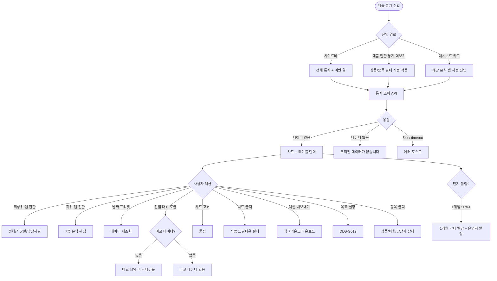

# SCR-S004 매출 통계 페이지

## 1. 화면 메타 정보

이 문서는 매출 통계 페이지에 대한 자기완결형 요구사항 정의서입니다. 다른 문서를 함께 보지 않아도 이 문서 한 장만으로 매출 통계 페이지에 들어가는 모든 영역, 모든 버튼, 모든 모달, 모든 권한, 모든 예외 처리, 그리고 이 화면을 지탱하는 운영 정책까지 전부 이해하고 구현할 수 있도록 작성합니다.

| 항목 | 값 |
|---|---|
| 작성일 | 2026-05-22 |
| 버전 | v1.0 |
| 상태 | 최신 통합본 반영 (정합화 완료) |
| 도메인 | D03 매출관리 |
| 화면 ID | SCR-S004 |
| 화면명 | 매출 통계 |
| 화면 유형 | 분석 화면 (Analytics Dashboard) |
| 라우트 (URL) | `/sales/stats` |
| 플랫폼 | 데스크톱(기본), 태블릿 |
| 우선순위 | P0 (출시 필수) |
| 기능코드 | SAL-03 (매출 통계 / 다관점 분석) |
| 계약코드 | SAL-03 |
| 계약 상태 | 계약 범위 본기능 |
| 부모 기능 prefix | SAL |
| Lv1 코드 | SAL-03 |
| Lv2 / Lv3 세분화 | SAL-03-01 ~ SAL-03-11 (최상위 탭, 날짜 필터, 하위 탭 7종, 전월 대비 토글, 총 매출 표시, 집계 테이블, 개월별 5버킷, GX 세부 종목, 법인권, 담당자별 신규/재등록, 골프프로별 매출) |
| 연계 화면 | SCR-S001 매출현황, SCR-S005 통계관리, SCR-S006 선수익금조회, SCR-094 KPI, SCR-099 리포트, SCR-097 감사로그 |
| 호출 다이얼로그 | DLG-S012 목표매출설정 |

## 2. 화면 개요와 목적

매출 통계 페이지는 다양한 관점(상품별·상품유형별·결제수단별·종목별·개월별 판매 비율·GX 세부 종목·법인권·직군별·담당자별)으로 매출 데이터를 시각적으로 분석하는 통계 화면입니다. 매출 현황(SCR-S001)이 거래 단위 조회 허브라면, 매출 통계는 BI 분석과 운영 전략 수립을 위한 차트와 표 중심의 화면입니다.

운영 맥락은 다양합니다. 센터장은 월간 운영 회의에서 상품별·결제수단별·담당자별 탭으로 회의 자료를 구성하고, 본사 슈퍼관리자는 통합 모드 + 지점 필터로 지점별 매출 믹스를 비교합니다. 마케팅 담당자는 개월별 비율(1·3·6·12·기타)로 단기/장기 쏠림을 분석하고, GX 매니저는 GX종목별 분포(요가·필라테스·스피닝·줌바·에어로빅·GX 기타)로 인기 클래스를 파악합니다. B2B 영업 담당자는 법인권 탭으로 B2B 매출 규모와 단가를 점검하고, FC는 담당자별 탭에서 본인 신규/재등록 매출과 평균 단가를 확인합니다.

이 화면은 차트와 표 중심으로 데이터를 가공·집계해 보여주며, 매시간 배치 갱신과 실시간 5분 캐시 혼합으로 처리됩니다. 1개월 비중이 50%를 초과하면 단기 쏠림 신호로 운영자에게 알림이 발송되며, 약정 강화·장기 상품 프로모션 검토가 자동 안내됩니다.

## 3. 진입 경로와 인접 화면

매출 통계 페이지에 진입하는 경로는 다음과 같습니다.

첫 번째 경로는 사이드바입니다. 좌측 사이드바의 "매출관리" 메뉴 아래 "매출 통계" 항목을 클릭하면 진입합니다. URL은 `/sales/stats`이며, 최상위 탭은 "전체 통계", 날짜 필터는 "이번 달"이 기본 활성화됩니다.

두 번째 경로는 매출 현황(SCR-S001)에서 분석 탭 옆의 "통계 더 보기" 링크 또는 거래 행의 상품·종목 우클릭에서 "통계로 보기"를 선택했을 때입니다. 해당 상품·종목으로 자동 필터된 상태로 진입합니다.

세 번째 경로는 대시보드(SCR-101)의 매출 분석 카드 클릭입니다. "이번 달 매출 추이" 카드를 누르면 기간별 매출 탭, "상품 매출 TOP10" 카드를 누르면 상품별 탭으로 자동 진입합니다.

이 화면에서 빠져나가는 인접 화면으로는, 매출 현황(SCR-S001), 통계 관리(SCR-S005), 선수익금 조회(SCR-S006), KPI 대시보드(SCR-094), 외부 리포트 화면(SCR-099), 그리고 모든 통계 조회·엑셀 다운로드가 기록되는 감사 로그(SCR-097)가 있습니다.

## 4. 레이아웃과 UI 구성

매출 통계 페이지는 위에서 아래로 차곡차곡 쌓이는 세로형 단일 컬럼 레이아웃을 기본으로 합니다.

가장 위에는 페이지 헤더가 있습니다. 헤더 좌측에는 "매출 통계"라는 페이지 타이틀과 함께 현재 조회 중인 지점 컨텍스트 배지가 따라옵니다. 헤더 우측에는 "엑셀 내보내기" 버튼이 있어 매니저+ 권한자가 현재 차트·표 데이터를 엑셀 파일로 다운로드할 수 있습니다.

페이지 헤더 바로 아래에는 최상위 탭 3개가 있습니다. 전체 통계 / 직군별 / 담당자별로 펼쳐지며, 각 탭에 따라 아래 영역이 동적으로 달라집니다. 전체 통계 탭은 7종의 하위 탭과 차트가 표시되고, 직군별 탭은 운영진/FC/트레이너 등 직군별 매출 분포를, 담당자별 탭은 담당자별 총매출·신규·재등록·기타·판매 건수·평균 단가를 표시합니다.

최상위 탭 아래에는 날짜 필터가 있습니다. 5개 프리셋 버튼(이번 달 / 지난 달 / 최근 3개월 / 최근 6개월 / 올해)이 토글 그룹으로 묶여 있고, 우측에 시작일~종료일 직접 입력 필드와 [조회] 버튼이 있습니다. 직접 입력은 프리셋과 배타적이지 않고, 직접 날짜를 입력하면 프리셋 선택이 자동 해제됩니다.

날짜 필터 아래에는 전월 대비 토글이 있습니다. ON 시 현재 기간 통계 옆에 전월 동기 비교(증감액·증감률)가 추가 표시되며, 증가는 초록·감소는 빨강으로 강조됩니다.

전월 대비 토글 아래에는 총 매출 표시 영역이 있습니다. 현재 필터 기준의 총 매출액이 페이지 전체에서 가장 큰 폰트로 강조 표시됩니다.

총 매출 아래에는 하위 탭 7개가 있습니다. 상품별 / 상품타입별 / 결제수단별 / 종목별 / 개월별 / GX종목별 / 법인권으로 펼쳐지며, 각 탭에 따라 차트 유형이 달라집니다. 상품별·종목별은 가로 막대 차트(상위 10), 상품타입별·결제수단별은 도넛 차트, 개월별은 1/3/6/12/기타 5버킷 비율 막대, GX종목별은 6종 분포 차트, 법인권은 가로 막대 또는 요약 테이블입니다.

하위 탭의 차트 영역 아래에는 집계 테이블이 있습니다. 항목명 / 판매 건수 / 매출액 / 비율(%) 컬럼이 표시되며, 담당자별 탭에서는 신규 매출 / 재등록 매출 / 기타 매출 / 평균 단가 컬럼이 추가됩니다. 상위 10 외의 항목은 "기타"로 통합되어 표시됩니다.

페이지 가장 아래에는 골프프로별 매출 영역이 있습니다(골프 카테고리 운영 센터에 한정). `[매출종합] 골프매출` 탭 K열 등록강사 기준 프로별 합계가 테이블로 표시되며, 신규/재등록 분리는 동일 기준을 사용합니다.

차트는 호버 시 수치·비율·증감률 툴팁이 표시되고, 클릭 시 자동 필터가 적용되어 드릴다운됩니다.

## 5. 탭 구성과 탭별 동작

이 화면은 탭이 두 단계로 중첩되어 있습니다. 1차는 최상위 탭(전체 통계 / 직군별 / 담당자별), 2차는 전체 통계 탭의 하위 탭(상품별 / 상품타입별 / 결제수단별 / 종목별 / 개월별 / GX종목별 / 법인권)입니다.

최상위 탭(1차)은 전체 통계·직군별·담당자별의 3개입니다. 전체 통계는 7종 하위 탭과 차트, 직군별은 운영진·FC·트레이너 같은 직군별 매출 분포 도넛 차트와 테이블, 담당자별은 신규/재등록/기타/평균 단가 컬럼이 추가된 담당자별 테이블을 보여줍니다. FC가 담당자별 탭에 진입하면 본인 행만 RLS로 노출됩니다.

하위 탭(2차)은 전체 통계 탭에서만 표시되며, 7개 분석 관점을 제공합니다. 상품별 탭은 가로 막대 차트로 상위 10개 상품의 매출 합계를 보여주고, 상품타입별 탭은 도넛 차트로 회원권·수강권·락커·운동복·일반의 비율을 보여줍니다. 결제수단별 탭은 도넛 차트로 카드·현금·포인트·복합의 비율을 보여주며, 합산 검증 결과가 함께 표시됩니다. 종목별 탭은 GX·PT·골프 같은 종목별 매출 가로 막대를, 개월별 탭은 1·3·6·12·기타 5버킷 비율 막대를 보여줍니다. GX종목별 탭은 요가·필라테스·스피닝·줌바·에어로빅·GX 기타 6종 분포, 법인권 탭은 `[월매출]` E열 구분=법인권 거래 합계 가로 막대 또는 요약 테이블입니다.

탭 전환 시 다른 필터·날짜·전월 대비 토글 상태는 모두 유지되며, 차트만 새 탭으로 갱신됩니다.

## 6. 버튼·아이콘·링크 액션 전체 정의

이 화면에 등장하는 모든 클릭 가능한 요소를 빠짐없이 정의합니다.

최상위 탭과 하위 탭은 누르면 즉시 차트와 테이블이 갱신됩니다. 다른 필터 상태는 유지됩니다.

날짜 프리셋 5개 버튼은 토글로 작동하며 한 번에 하나만 활성화됩니다. 활성 프리셋은 강조 색상으로 표시되고, 다시 누르면 비활성화되어 직접 입력 모드로 전환됩니다. 직접 입력 필드는 두 날짜가 모두 채워지면 [조회] 버튼을 눌러야 데이터가 갱신됩니다.

전월 대비 토글은 ON/OFF 두 상태로 작동하며, ON 시 비교 요약 바와 추가 테이블이 표시됩니다. 데이터 없음 시 "비교 데이터 없음" 안내가 노출되고 토글 OFF가 권장됩니다.

차트 호버는 툴팁을 표시하고, 차트 클릭은 자동 드릴다운 필터 적용입니다. 예를 들어 상품별 막대 차트에서 특정 상품 막대를 클릭하면 해당 상품으로 필터가 적용되어 매출 현황(SCR-S001)으로 이동하거나 같은 화면 안에서 상세 분포를 보여줍니다.

집계 테이블의 항목명은 클릭 가능합니다. 상품명 클릭은 상품 상세(SCR-P003)로, 담당자명 클릭은 담당자 프로필 또는 KPI 상세로, 골프프로명 클릭은 골프프로 프로필로 이동시킵니다.

페이지 헤더의 [엑셀 내보내기] 버튼은 현재 필터·탭이 적용된 차트·표 데이터를 엑셀로 다운로드합니다. 매니저+ 권한자에게만 표시되며, 30,000건 초과 시 백그라운드 다운로드로 분기됩니다.

모든 버튼은 클릭 후 응답이 돌아오기 전까지 자동으로 비활성화됩니다.

## 7. 호출되는 모달 동작

이 화면에서 호출되는 모달은 한 가지이며, DLG-S012 목표 매출 설정 모달과 동일합니다.

### 7-1. DLG-S012 목표 매출 설정 모달

매출 통계 페이지에서는 페이지 헤더 또는 총 매출 표시 영역 옆 "목표 설정" 링크를 누르면 DLG-S012 목표 매출 설정 모달이 열립니다. 이 모달은 SCR-S001 매출 현황과 SCR-S011 매출 예측에서도 호출되며, 모두 같은 목표 데이터를 공유합니다.

모달 상단에는 "목표 매출 설정"이라는 제목과 함께 설정 기간 단위 선택(월/분기/연간), 그 아래에 목표 금액 입력 필드, 적용 시점 선택(즉시 / 다음 기간부터), 이전 기간 실적 참고값이 표시됩니다. 매니저+ 권한자만 이 모달에 진입할 수 있으며 FC·트레이너·스태프는 차단됩니다. 1억원 이상의 목표는 본사 슈퍼관리자 승인 큐로 전송됩니다.

저장 버튼을 누르면 목표가 저장되고 매출 통계의 달성률 게이지(매출 예측 화면과 공유)가 즉시 갱신되며, 변경 이력은 SCR-097 감사 로그에 actor·period·before·after로 기록됩니다.

## 8. 토스트와 확인 팝업과 알럿

매출 통계 페이지에서 발생하는 모든 알림성 UI는 다음과 같은 패턴으로 동작합니다.

성공 토스트는 우측 상단에 녹색 계열로 5초 동안 표시되며, "엑셀 다운로드가 시작되었어요", "목표 매출을 저장했어요" 같은 짧은 문구로 결과를 알려줍니다.

실패 토스트는 우측 상단에 빨강 계열로 표시되며, "데이터를 불러올 수 없습니다", "권한이 없어요", "비교 데이터 없음" 같은 문구와 함께 "다시 시도" 보조 액션 버튼이 따라옵니다.

단기 쏠림 경고 알럿은 1개월 비중이 50%를 초과하면 개월별 탭의 1개월 막대가 빨강으로 강조되고, 화면 상단에 "1개월 단기 쏠림 신호 발생. 약정 강화 검토 권장" 안내가 표시됩니다. 동시에 NFR-19 알림 센터로 운영자 알림이 발송됩니다.

매핑 누락 안내는 GX 세부 종목 미분류, 개월별 5버킷 매핑 누락, 법인권 분류 누락 등의 경우 "기타"로 분류되었음을 안내하고 운영자 알림을 발송합니다.

본사 통합 모드 진입 시 데이터 합산 중 안내 토스트가 잠시 표시되며, 로딩이 지연되면 진행률 표시가 노출됩니다.

권한 알럿은 트레이너·스태프 등이 처리(엑셀·목표 설정) 시도 시 차단되고 조회만 가능함을 안내합니다.

## 9. 데이터 흐름과 외부 연동

이 화면은 여러 데이터 소스와 외부 연동에 의존합니다.

화면 진입 시점에는 통계 조회 API(`GET /api/sales/stats?period=&type=&group=`)가 호출됩니다. 요청에는 최상위 탭, 하위 탭, 날짜 범위, 전월 대비 토글, 지점 필터(통합 모드)가 모두 쿼리 파라미터로 들어갑니다. 응답으로는 차트 데이터, 집계 테이블 데이터, 총 매출, 전월 대비 데이터가 함께 내려옵니다.

전월 대비 비교는 `GET /api/sales/stats/compare`로 별도 호출되어 동일 기간의 전년도 또는 전월 실적이 함께 내려옵니다. 데이터 없음 시 "비교 데이터 없음" 응답이 반환됩니다.

담당자별 집계는 `GET /api/sales/stats/by-staff`로, 상품별 집계는 `GET /api/sales/stats/by-product`로, GX 세부 종목 분포는 `GET /api/sales/stats/gx`로 별도 호출됩니다.

차트 데이터는 매시간 배치로 갱신되며, 실시간 데이터는 5분 캐시를 사용합니다. PAY-01 결제 webhook 또는 SAL-EXT-04 환불 webhook이 도착하면 5분 캐시가 무효화되어 다음 조회에서 최신 데이터가 반영됩니다.

매출유형 자동 분류(신규/재등록/휴면복귀/종목추가/업그레이드)는 SCR-S001 매출 현황과 동일한 D+1 배치를 사용합니다. 개월별 5버킷(1·3·6·12·기타)은 `[주간월간보고]` 주차별 V5:Z5를 원천으로 사용하며, 매출 원장에 `durationMonths` 값이 있으면 우선 적용됩니다.

GX 세부 종목 분포는 상품 마스터의 2단계 분류(`category=LESSON_PASS`이고 `lessonType=GX`이며 `subCategory`)를 기준으로 6종(요가·필라테스·스피닝·줌바·에어로빅·GX 기타) 분포를 계산합니다. subCategory 미분류 상품은 "기타"로 분류되고 운영자 알림이 발송됩니다.

법인권 매출은 `[월매출]` E열 `구분`이 `법인권`인 거래의 매출액 합계로 산출되며, 환불 건은 집계에서 제외됩니다. B2B 계약·갱신 주기 관리를 위해 일반 회원권/B2C 매출과 별도 집계됩니다.

담당자별 신규/재등록 분리는 `[매출종합]` E열 `구분/유형`과 F열 `결제금액`을 기준으로 산출됩니다. 회원권·락카 매출은 K열 `담당자`, 강습·골프 매출은 K열 `등록강사`를 판매 귀속 담당자로 사용합니다. 트레이너별 신규/재등록 매출의 공식 원천은 `[매출종합]` 거래 단위이며, `[강습업무보고]` J열 `주간신규`·K열 `주간재등록`은 검산/KPI 운영 보조 원천으로만 사용됩니다.

골프프로별 매출은 `[매출종합] 골프매출` 탭 K열 등록강사별 F열 결제금액 합계로 산출됩니다.

단기 쏠림 자동 알림은 1개월 비중이 50%를 초과하면 NFR-19 알림 센터로 운영자에게 발송됩니다. 차트 인터랙션(드릴다운)은 차트 클릭 시 자동 필터를 적용해 SCR-S001 매출 현황으로 이동하거나 같은 화면 안에서 상세 분포를 보여줍니다.

매출 데이터 보관은 5년이며, 5년 경과 후 PII 마스킹 배치(매월 1회)가 회원명·연락처를 익명화합니다. 매출 금액은 마스킹 후에도 보존됩니다.

감사 로그는 통계 조회·엑셀 다운로드를 SCR-097에 비동기로 기록합니다. 기록 필드는 `actor_id`, `query`, `count`, `timestamp`입니다.

화면에서 호출하는 주요 API 엔드포인트는 다음과 같습니다. 통계 조회 `GET /api/sales/stats`, 전월 대비 비교 `GET /api/sales/stats/compare`, 담당자별 집계 `GET /api/sales/stats/by-staff`, 상품별 집계 `GET /api/sales/stats/by-product`, GX 세부 종목 분포 `GET /api/sales/stats/gx`.

## 10. 화면 상태와 예외 처리

매출 통계 페이지는 다음 상태들을 가질 수 있습니다.

로딩 중 상태에서는 차트 영역에 스피너, 테이블에 로딩 상태가 표시됩니다.

정상 표시 상태는 데이터가 있을 때 차트와 테이블이 함께 표시되는 가장 일반적인 상태입니다.

데이터 없음 상태는 선택 기간에 데이터가 없을 때 "조회된 데이터가 없습니다" 안내와 기간 변경 권유가 표시됩니다.

전월 대비 ON 상태에서는 비교 요약 바와 테이블이 추가로 표시됩니다.

전월 대비 데이터 없음 상태에서는 "비교 데이터 없음" 안내와 토글 OFF 권장이 표시됩니다.

단기 쏠림 경고 상태는 1개월 비중이 50%를 초과한 상태로, 1개월 막대가 빨강 강조되고 운영자 알림이 발송됩니다.

본사 통합 모드 상태에서는 모든 차트가 전 지점 합산으로 표시되고 지점별 드릴다운이 활성화됩니다. 권한 미달이면 통합 토글이 hidden 처리됩니다.

매핑 누락 상태는 개월별 5버킷, GX subCategory, 법인권 분류 중 하나가 누락되었을 때로, 누락 항목이 "기타"로 분류되고 운영자 알림이 발송됩니다.

오류 상태는 서버 5xx 또는 네트워크 타임아웃 시로, 토스트와 재시도 버튼이 표시됩니다.

예외 케이스별 처리는 다음과 같이 정의됩니다. 데이터 없음 시 빈 차트 안내, 전월 대비 데이터 없음 시 비교 표시 차단, 매핑 누락 시 "기타" 분류 및 알림, 담당자 퇴사 시 "퇴사" 라벨 및 집계 유지, 단기 쏠림 시 빨강 강조 및 알림, 통합 모드 권한 미달 시 토글 hidden, FC 비담당 매출 RLS 미노출, 차트 로딩 실패 시 토스트와 재시도, 외부 시트 매핑 오류 시 "데이터 동기화 중" 표시와 운영팀 점검 알림, 5년 경과 데이터 익명화 표시, 매시간 배치 지연 시 "동기화 중" 표시, 상위 10 외 "기타" 분류, GX 미분류 알림, 골프 매출 분리 누락 시 일반 매출 포함 및 운영팀 분류, 차트 호버 툴팁 누락 시 데이터만 표시, 차트 드릴다운 실패 시 토스트와 수동 필터, 분석 결과 공유 권한 부족 시 공유 버튼 hidden, 동시 조회 부하 시 큐 대기 등이 있습니다.

## 11. 권한별 처리

슈퍼관리자(superAdmin)와 본사 최고관리자(primary)는 모든 탭·차트·필터, 본사 통합 모드, 엑셀 내보내기, 목표 매출 설정, 분석 결과 공유까지 모두 사용 가능합니다.

센터장(owner)과 매니저(manager)는 자기 지점의 모든 탭·차트·필터, 엑셀 내보내기, 목표 매출 설정이 가능합니다. 본사 통합 모드는 표시되지 않습니다.

FC(피트니스 코치, fc)는 조회·필터만 가능하며, 담당자별 탭에서는 본인 행만 RLS로 노출됩니다. 엑셀 내보내기, 목표 매출 설정 버튼은 보이지 않습니다.

트레이너(trainer)와 스태프(staff)는 조회만 가능하며 처리 액션이 차단됩니다.

읽기 전용(readonly)은 화면 자체에 접근할 수 없습니다.

권한 외에도 운영 모드에 따라 일부 영역이 보이거나 숨겨집니다. 골프 카테고리 미운영 센터에서는 골프프로별 매출 영역이 숨겨지고, GX 카테고리 미운영 센터에서는 GX종목별 탭이 숨겨집니다.

권한 차단 시 버튼 hidden 또는 비활성, 403 응답 시 "권한이 없어요" 토스트, 모든 권한 차단 이벤트는 감사 로그에 기록됩니다.

## 12. 메인 흐름



## 13. 에러와 예외 흐름

```mermaid
flowchart TD
    A([액션 트리거]) --> B{서버 응답}
    B -->|5xx / timeout| C[자동 재시도 1회]
    C --> D{재시도 성공?}
    D -->|성공| E[정상 흐름 복귀]
    D -->|실패| F[다시 시도 버튼]
    B -->|401 / 403 권한 부족| G["권한이 없어요" 토스트]
    B -->|데이터 없음| H["조회된 데이터가 없습니다"]
    B -->|전월 대비 데이터 없음| I["비교 데이터 없음" + 토글 OFF 권장]
    B -->|개월별 매핑 누락| J["기타" 분류 + 운영자 알림]
    B -->|GX subCategory 미분류| K["기타" 분류 + 운영자 알림]
    B -->|법인권 분류 누락| L["기타" 분류 + 운영자 알림]
    B -->|담당자 퇴사| M[담당자명 + "퇴사" 라벨 + 집계 유지]
    B -->|단기 쏠림 1개월 50%+| N[1개월 막대 빨강 + 알림 + 약정 강화 안내]
    B -->|통합 모드 권한 미달| O[통합 토글 hidden]
    B -->|FC 비담당 매출| P[RLS 미노출]
    B -->|차트 로딩 실패| Q[토스트 + 재시도]
    B -->|외부 시트 매핑 오류| R["데이터 동기화 중" + 운영팀 점검]
    B -->|5년 경과 데이터| S[익명화 표시 + 매출 금액 보존]
    B -->|매시간 배치 지연| T["동기화 중" + 5분 후 재시도]
    B -->|차트 드릴다운 실패| U[토스트 + 수동 필터]
    B -->|골프 매출 분리 누락| V[일반 매출 포함 + 운영팀 분류]
    B -->|동시 조회 부하| W[큐 대기 + 5초 후 재시도]
```

## 14. 핵심 디자인 요청사항

이 화면의 핵심은 차트의 가독성과 인사이트 전달력입니다. 가로 막대 차트(상품별·종목별·법인권)는 막대 길이가 상대적 매출 규모를 즉시 보여줄 수 있도록 충분한 가로 폭을 확보하며, 도넛 차트(상품타입별·결제수단별)는 가운데 총 매출 또는 비율 텍스트를 함께 표시해 한눈에 핵심 수치를 파악할 수 있어야 합니다.

개월별 5버킷 막대 차트는 1·3·6·12·기타 순서로 좌에서 우로 배치하고, 1개월 막대가 50%를 초과하면 자동으로 빨강 강조됩니다. 막대 위에 비중 % 라벨이 함께 표시되어 운영자가 정확한 수치를 즉시 확인할 수 있습니다.

GX종목별 차트는 6종을 동일한 컬러 톤 그라데이션으로 표시하고, 가장 큰 비중의 종목은 가장 진한 색상으로 강조됩니다. 색맹 사용자를 위해 종목명 라벨이 항상 함께 표시됩니다.

전월 대비 비교 영역은 현재 기간 차트 옆에 작은 비교 카드로 배치되며, 증감액과 증감률이 함께 표시됩니다. 증가는 녹색 화살표(↑), 감소는 빨강 화살표(↓)와 함께 표시되어 추세를 즉시 인지할 수 있습니다.

차트 호버 툴팁은 마우스 커서 근처에 부드럽게 표시되며, 수치·비율·증감률·전기 대비 비교가 함께 들어갑니다. 차트 클릭 시 부드러운 슬라이드 전환으로 드릴다운 결과를 보여줍니다.

총 매출 표시는 페이지 전체에서 가장 큰 폰트로, 천 단위 콤마를 적용해 가독성을 확보합니다. 통합 모드에서는 "전 지점 합산" 주석이 작은 회색 글씨로 옆에 표시됩니다.

집계 테이블은 행 호버 시 강조 색상으로 표시되고, 항목명을 클릭하면 커서가 변경되어 상품 상세·담당자 프로필 진입이 가능함을 알립니다.

DLG-S012 목표 매출 설정 모달은 차트와 별도의 컨텍스트로 표시되며, 모달 안에서는 이전 기간 실적 참고값이 차트로 표시되어 운영자가 합리적 목표를 설정할 수 있도록 돕습니다.

진행 스피너와 로딩 스켈레톤은 매출관리 전체에서 동일한 톤으로 통일됩니다.

## 15. 운영 정책 (이 화면에 연결된 부분)

이 화면은 단순한 차트 모음이 아니라 BI 분석의 정책 결정이 그대로 반영된 도구입니다.

개월별 5버킷 고정 정책은 1·3·6·12·기타 5버킷으로 매출을 분류하며, 매출 원장에 `durationMonths` 값이 있으면 우선 적용됩니다. 외부 시트 매핑은 `[주간월간보고]` 주차별 V5:Z5를 원천으로 사용합니다.

단기 쏠림 신호 정책은 1개월 비중이 50%를 초과하면 NFR-19 알림 센터로 운영자에게 자동 알림을 발송합니다. 약정 강화·장기 상품 프로모션 검토가 자동 안내됩니다. 이는 락인 약화 조기 감지를 위한 자동화 정책입니다.

GX 세부 종목 분류 정책은 상품 마스터의 2단계 분류(`category=LESSON_PASS`이고 `lessonType=GX`이며 `subCategory`)를 기준으로 6종(요가·필라테스·스피닝·줌바·에어로빅·GX 기타) 분포를 계산합니다. GX 상품은 subCategory를 필수로 가져야 하며, 누락 시 "기타"로 분류되고 운영자 알림이 발송됩니다.

법인권 분류 정책은 `[월매출]` E열 `구분`이 `법인권`인 거래의 매출액 합계로 산출됩니다. 환불 건은 집계에서 제외되며, B2B 계약·갱신 주기 관리를 위해 일반 회원권/B2C 매출과 별도 집계됩니다.

담당자별 분리 기준 정책은 회원권·락카 매출은 K열 `담당자`, 강습·골프 매출은 K열 `등록강사`를 판매 귀속 담당자로 사용합니다. 트레이너별 신규/재등록 매출의 공식 원천은 `[매출종합]` 거래 단위이며, `[강습업무보고]` J/K열은 검산 보조 원천입니다.

골프 매출 분리 정책은 `[매출종합] 골프매출` 탭 K열 등록강사 기준으로 프로별 합계를 산출합니다. 골프프로별 매출은 일반 매출과 별도 집계되어 인사 평가 자료로 활용됩니다.

상위 10 외 통합 정책은 차트의 상위 10개를 초과하는 항목을 "기타"로 통합 표시합니다. 상세 조회는 집계 테이블에서 전체를 노출하며, 엑셀 다운로드는 모든 항목을 포함합니다.

전월 대비 비교 정책은 동일 기간 대비, 증가는 초록·감소는 빨강으로 강조합니다. 데이터 없음 시 "비교 데이터 없음"이 표시되고 토글 OFF가 권장됩니다.

본사 통합 모드 정책은 본사 슈퍼관리자에게만 활성화되며, 전 지점 합산과 지점별 드릴다운을 제공합니다. 일반 지점 사용자는 자기 지점 매출만 RLS로 조회 가능합니다.

데이터 갱신 정책은 매시간 배치 갱신과 실시간 5분 캐시 혼합입니다. 결제 webhook 또는 환불 webhook이 도착하면 5분 캐시가 무효화됩니다. 매시간 배치 지연 시 "동기화 중" 표시가 노출되고 5분 후 재시도가 안내됩니다.

권한별 가시성 정책은 매니저+ 모든 탭·차트·필터·엑셀·목표 설정 가능, FC는 본인 매출만 RLS 노출, 트레이너·스태프는 조회만, readonly는 접근 차단입니다.

퇴사 담당자 처리 정책은 담당자가 퇴사하면 담당자명에 "퇴사" 라벨을 붙이고 매출 집계는 그대로 유지합니다. 이는 인사 변경에도 매출 데이터의 연속성을 보장하는 정책입니다.

매출 보관 정책은 5년이며, 5년 경과 후 PII 마스킹 배치(매월 1회)가 회원명·연락처를 익명화합니다. 매출 금액·상품 정보는 마스킹 후에도 보존됩니다.

감사 로그 정책은 통계 조회·엑셀 다운로드를 SCR-097에 비동기로 기록합니다. 기록 필드는 `actor_id`, `query`, `count`, `timestamp`입니다.

분석 결과 공유 권한 정책은 매니저+ 권한자만 외부 공유가 가능합니다. 차트 캡처·엑셀 다운로드·URL 공유 모두 매니저 이상의 권한이 필요합니다.

차트 인터랙션 정책은 차트 클릭 시 자동 드릴다운 필터를 적용해 SCR-S001 매출 현황으로 이동하거나 같은 화면에서 상세 분포를 보여줍니다. 호버 툴팁은 수치·비율·증감률·전기 대비 비교를 함께 표시합니다.

이상의 모든 정책은 이 화면을 구현하고 운영하는 사람이 별도 문서 없이 이 한 장만 보면 이해할 수 있도록 풀어 적었습니다. 정책이 바뀌면 이 문서가 함께 갱신되어야 하며, 코드 변경과 정책 변경은 항상 짝지어 진행됩니다.
