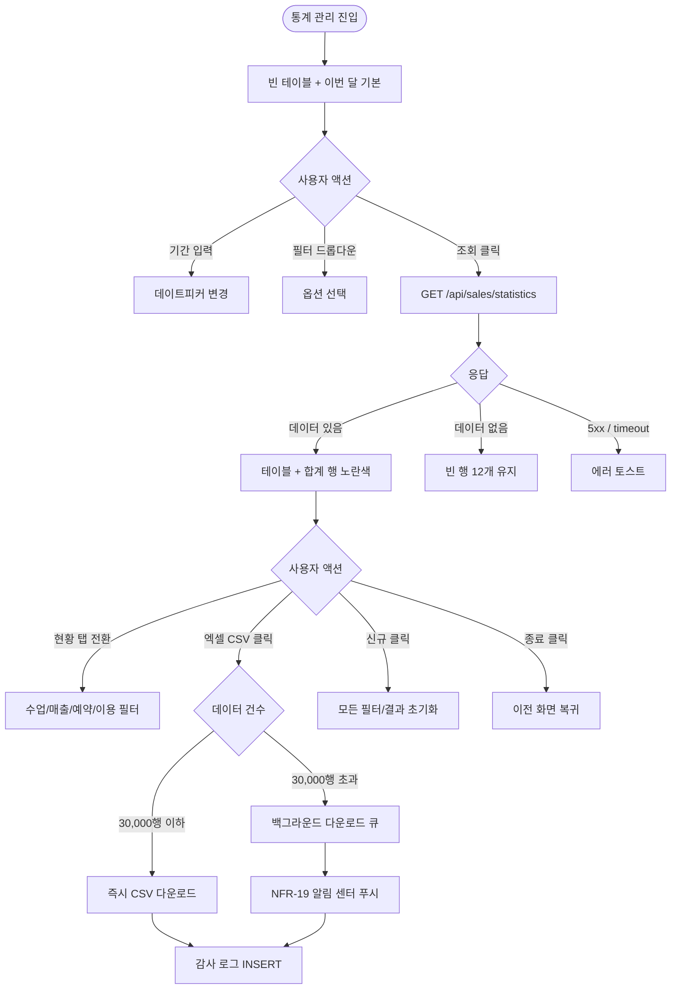
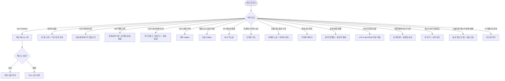

# SCR-S005 통계 관리 페이지

## 1. 화면 메타 정보

이 문서는 통계 관리 페이지에 대한 자기완결형 요구사항 정의서입니다. 다른 문서를 함께 보지 않아도 이 문서 한 장만으로 통계 관리 페이지에 들어가는 모든 영역, 모든 버튼, 모든 모달, 모든 권한, 모든 예외 처리, 그리고 이 화면을 지탱하는 운영 정책까지 전부 이해하고 구현할 수 있도록 작성합니다.

| 항목 | 값 |
|---|---|
| 작성일 | 2026-05-22 |
| 버전 | v1.0 |
| 상태 | 최신 통합본 반영 (정합화 완료) |
| 도메인 | D03 매출관리 |
| 화면 ID | SCR-S005 |
| 화면명 | 통계 관리 |
| 화면 유형 | 보고서 화면 (CSV Report) |
| 라우트 (URL) | `/sales/statistics-management` |
| 플랫폼 | 데스크톱(기본), 태블릿 |
| 우선순위 | P0 (출시 필수) |
| 기능코드 | SAL-05 (통계 관리 / CSV 보고서) |
| 계약코드 | SAL-05 |
| 계약 상태 | 계약 범위 본기능 |
| 부모 기능 prefix | SAL |
| Lv1 코드 | SAL-05 |
| Lv2 / Lv3 세분화 | SAL-05-01 ~ SAL-05-07 (기간 입력, 필터 드롭다운 4종, 현황 탭 4종, 통계 테이블 17 컬럼, VAT 제외 매핑, 합계 행, 액션 버튼) |
| 연계 화면 | SCR-S001 매출현황, SCR-S004 매출통계, SCR-094 KPI, SCR-097 감사로그 |
| 호출 다이얼로그 | (없음 — CSV 다운로드는 백그라운드 작업) |

## 2. 화면 개요와 목적

통계 관리 페이지는 수업·매출·예약·이용 현황을 하나의 화면에서 통합 조회하고, 원하는 기간·유형·담당자·구분·회원 상태로 필터링해 CSV 파일로 내려받는 통계 보고서 화면입니다. 매출현황의 `받을금액`은 VAT 제외 순매출로 명확히 정의해 재무 보고와 수익성 분석에 활용합니다. 레거시 업무 시스템 스타일로 설계되어 PC 기반 센터 관리 프로그램에 익숙한 운영자도 빠르게 활용할 수 있도록 [조회]/[신규]/[엑셀(CSV)]/[종료] 4개 버튼 패턴을 채택합니다.

운영 맥락은 다양합니다. 회계 담당자는 월말 마감 시 매출현황 탭에서 VAT 제외 순매출 합계를 확인해 회계 시스템에 입력하고, 본사 슈퍼관리자는 통합 모드 + 4탭으로 전사 운영 실적 보고서를 작성합니다. 센터장은 월간 운영 보고서를 4탭 통합 + CSV 다운로드로 만들고, 트레이너는 본인 수업 현황을 수업현황 탭에서 점검합니다. 마케팅 팀은 이용현황 탭으로 활성 회원 수·재방문률을 분석하고, 본사 인사는 담당자 필터 + 매출 집계로 인사 평가 자료를 작성합니다.

이 화면은 차트 없이 표 + CSV 중심으로 회계·세무·인사 평가 등 정형 보고 자료에 최적화되어 있습니다. CSV는 UTF-8 with BOM 인코딩으로 Excel 한글 호환을 보장하며, 30,000행 초과 시 백그라운드 다운로드로 자동 분기됩니다. SAL-05-07 액션 버튼(조회/신규/CSV/종료)은 통계 관리 화면의 조회·초기화·CSV·복귀 조작만 의미하며, 급여·매출 입력 같은 업무 입력 액션과 연결되지 않습니다.

## 3. 진입 경로와 인접 화면

통계 관리 페이지에 진입하는 경로는 다음과 같습니다.

첫 번째 경로는 사이드바입니다. 좌측 사이드바의 "매출관리" 메뉴 아래 "통계 관리" 항목을 클릭하면 진입합니다. URL은 `/sales/statistics-management`이며, 기간은 이번 달이 기본 설정되고 테이블은 빈 상태로 시작합니다.

두 번째 경로는 매출 통계(SCR-S004)에서 "CSV 보고서 보기" 링크를 누르거나, 매출 현황(SCR-S001)에서 회계 마감 자료가 필요할 때 통계 관리로 이동합니다.

세 번째 경로는 매출 보고서 일일 자동 생성 알림 클릭입니다. 매일 04:00 합계 검증 배치 결과나 매월 1일 자동 보고서 생성 알림에서 통계 관리로 진입합니다.

이 화면에서 빠져나가는 인접 화면으로는, 매출 현황(SCR-S001), 매출 통계(SCR-S004), KPI 대시보드(SCR-094), 그리고 모든 CSV 다운로드가 기록되는 감사 로그(SCR-097)가 있습니다. [종료] 버튼은 이전 화면(사이드바 또는 대시보드)으로 복귀합니다.

## 4. 레이아웃과 UI 구성

통계 관리 페이지는 레거시 ERP 스타일의 위에서 아래로 쌓이는 단일 컬럼 레이아웃을 기본으로 합니다.

가장 위에는 페이지 헤더가 있습니다. 헤더 좌측에는 "통계 관리"라는 페이지 타이틀과 함께 현재 조회 중인 지점 컨텍스트 배지가 따라옵니다. 헤더 우측에는 4개의 액션 버튼이 일렬로 배치됩니다. [조회] / [신규] / [엑셀(CSV)] / [종료] 순서입니다. 조회 버튼은 설정한 기간과 필터로 데이터를 불러오고, 신규 버튼은 모든 필터·결과를 초기화하며, 엑셀 버튼은 현재 결과를 CSV 파일로 다운로드하고, 종료 버튼은 이전 화면으로 복귀합니다.

페이지 헤더 아래에는 기간 입력 영역이 있습니다. 시작일~종료일 두 개의 데이트피커가 가로로 배치되며, 기본값은 이번 달 1일~말일입니다. 직접 입력으로 조회 범위를 자유롭게 설정할 수 있습니다.

기간 입력 아래에는 필터 드롭다운 4종이 있습니다. 수업 유형 / 담당자 / 구분 / 회원 상태 드롭다운이 가로로 나란히 배치되며, 각 드롭다운의 선택지는 현재 조회된 데이터에서 동적으로 생성됩니다. 데이터가 갱신되면 옵션 캐시도 함께 무효화되어 새 데이터의 옵션이 표시됩니다.

드롭다운 아래에는 현황 탭 4개가 있습니다. 수업현황 / 매출현황 / 예약현황 / 이용현황 탭으로 펼쳐지며, 동일 조회 데이터에서 해당 유형의 행만 걸러 보여줍니다. 탭 전환 시 [조회]를 다시 누를 필요는 없고, 현재 데이터에서 즉시 필터링됩니다.

탭 아래에는 통계 테이블이 있습니다. 17개 컬럼이 고정으로 표시되며 좌측부터 일자 / 담당자 / 회원명 / 성별 / 휴대폰 / 구분 / 판매금액 / 할인금액 / 받을금액(VAT 제외 순매출) / 카드 / 현금 / 상품권 / 포인트 / 미수발생 / 미수입금 / 받은금액 / 비고 순서입니다. 컬럼 헤더는 sticky 처리되어 스크롤해도 항상 보입니다. 17 컬럼 외의 항목은 비고 컬럼에 추가됩니다.

테이블 하단에는 합계 행이 노란색 배경으로 표시됩니다. 전체 건수와 각 금액 컬럼(판매·할인·받을금액·카드·현금·상품권·포인트·미수발생·미수입금·받은금액)의 합계가 굵은 글씨로 표시되며, 인쇄 시에도 노란색이 유지됩니다. 데이터가 없을 때는 빈 행 12개로 테이블 공간이 유지되어 레거시 ERP의 시각적 일관성을 보장합니다.

본사 통합 모드에서는 테이블에 "지점" 컬럼이 추가로 표시되어 18 컬럼이 됩니다. 이 컬럼은 본사 권한자가 통합 모드를 켰을 때만 노출되며, 일반 지점 사용자에게는 보이지 않습니다.

## 5. 탭 구성과 탭별 동작

이 화면은 현황 탭 4개를 가집니다. 수업현황 / 매출현황 / 예약현황 / 이용현황으로 펼쳐지며, 동일한 조회 데이터에서 유형 필터로 분기합니다.

수업현황 탭은 수업 유형 행만 표시합니다. PT·GX·골프 등 수업 카테고리의 등록·진행 기록이 노출되며, 트레이너는 본인 수업 행만 RLS로 노출됩니다.

매출현황 탭은 매출 행만 표시합니다. 회계 마감의 핵심 탭이며, 받을금액(VAT 제외 순매출)이 가장 중요한 지표입니다. 합계 행에서 받을금액 합계가 회계 시스템 입력값이 됩니다.

예약현황 탭은 예약 행만 표시합니다. 수업 예약·시설 예약 등 예약 기록이 노출되며, 노쇼·취소 여부가 비고 컬럼에 표시됩니다.

이용현황 탭은 이용 행만 표시합니다. 출석·시설 이용 기록이 노출되며, 마케팅 분석에서 활성 회원 수·재방문률 계산에 사용됩니다.

탭 전환 시 [조회]를 다시 누르지 않아도 현재 조회 데이터에서 즉시 필터링됩니다. 다른 필터(기간·드롭다운)는 그대로 유지되며, 탭만 바뀝니다.

## 6. 버튼·아이콘·링크 액션 전체 정의

이 화면에 등장하는 모든 클릭 가능한 요소를 빠짐없이 정의합니다.

기간 입력 데이트피커는 시작일과 종료일을 각각 선택합니다. 두 날짜가 모두 설정되어도 [조회] 버튼을 누르기 전에는 데이터가 변경되지 않습니다.

필터 드롭다운 4개(수업 유형 / 담당자 / 구분 / 회원 상태)는 누르면 옵션 목록이 펼쳐지고, 옵션을 선택해도 [조회]를 누르기 전에는 데이터가 변경되지 않습니다. "전체" 옵션이 기본값이며, 옵션이 없을 때는 "전체"만 표시됩니다.

[조회] 버튼은 현재 기간과 필터로 백엔드 데이터를 불러옵니다. 로딩 중에는 버튼이 비활성화되고 합계 행에 "조회중"이 표시됩니다.

[신규] 버튼은 모든 필터와 조회 결과를 초기화합니다. 기간은 이번 달 기본값으로 복원되고, 드롭다운은 "전체"로 리셋되며, 테이블은 빈 행 12개로 돌아갑니다.

[엑셀(CSV)] 버튼은 현재 필터·탭이 적용된 데이터를 CSV 파일로 다운로드합니다. 파일명은 `{탭명}_{시작일}_{종료일}.csv` 규칙(예: `매출현황_2026-05-01_2026-05-31.csv`)이며, 인코딩은 UTF-8 with BOM, 콤마 구분, 텍스트 큰따옴표 감쌈, 줄바꿈 LF입니다. 30,000행 초과 시 백그라운드 다운로드로 자동 분기됩니다. 권한이 없는 계정에서는 이 버튼이 hidden 처리됩니다.

[종료] 버튼은 이전 화면(사이드바 또는 대시보드)으로 복귀합니다.

현황 탭 4개는 누르면 동일 조회 데이터에서 즉시 필터링되어 표시됩니다.

테이블 행은 클릭해도 모달이나 상세 화면으로 이동하지 않습니다. 이 화면은 보고서 조회·다운로드에 특화되어 있으며, 거래 상세를 보려면 매출 현황(SCR-S001)으로 이동해 DLG-S001 매출 상세를 사용해야 합니다.

모든 버튼은 클릭 후 응답이 돌아오기 전까지 자동으로 비활성화됩니다.

## 7. 호출되는 모달 동작

이 화면에서는 모달이 호출되지 않습니다. 보고서 조회와 CSV 다운로드 중심의 화면이며, 백그라운드 다운로드 진행 상황은 토스트와 알림 센터로 안내됩니다.

CSV 다운로드 30,000행 초과 시 "백그라운드 다운로드가 시작되었습니다" 토스트가 표시되고, 완료 시 알림 센터(NFR-19)로 다운로드 링크가 푸시됩니다. 사용자가 페이지를 떠나도 작업은 계속됩니다.

## 8. 토스트와 확인 팝업과 알럿

통계 관리 페이지에서 발생하는 모든 알림성 UI는 다음과 같은 패턴으로 동작합니다.

성공 토스트는 우측 상단에 녹색 계열로 5초 동안 표시되며, "조회가 완료되었어요", "CSV 다운로드가 시작되었어요" 같은 짧은 문구로 결과를 알려줍니다.

실패 토스트는 우측 상단에 빨강 계열로 표시되며, "데이터를 불러오지 못했어요", "내보낼 데이터가 없습니다", "권한이 없어요", "합계가 일치하지 않습니다" 같은 문구와 함께 "다시 시도" 또는 "조건 변경" 보조 액션이 따라옵니다.

VAT 매핑 누락 알림은 `[월매출]` I열 매핑이 실패해 받을금액이 0원으로 표시되는 경우, 합계 행 옆에 경고 아이콘과 함께 "VAT 매핑이 누락되었습니다. 운영팀에 점검 요청" 안내가 표시되며 운영자 알림이 발송됩니다.

합계 검증 실패 알림은 매일 04:00 합계 검증 배치가 합계 행과 컬럼별 합산이 불일치를 감지하면 합계 행이 빨강으로 강조되고 운영자 알림이 발송됩니다.

권한 알럿은 트레이너·스태프가 처리 액션을 시도하면 차단되고 조회만 가능함을 안내합니다.

CSV 인코딩 오류(Excel 한글 깨짐) 시 자동으로 UTF-8 with BOM이 적용되며, 다운로드 후 한글이 정상 표시됩니다.

## 9. 데이터 흐름과 외부 연동

이 화면은 여러 데이터 소스와 외부 연동에 의존합니다.

화면 진입 시점에는 빈 테이블이 렌더되고 [조회] 버튼을 눌러야 통계 조회 API(`GET /api/sales/statistics?period=&filters=`)가 호출됩니다. 요청에는 기간, 4종 필터, 지점(통합 모드)이 쿼리 파라미터로 들어갑니다. 응답으로는 행 배열과 합계 데이터, 드롭다운 옵션 후보가 함께 내려옵니다.

드롭다운 옵션은 `GET /api/sales/statistics/dropdown-options`로 별도 호출되거나 조회 응답에 포함되어 내려옵니다. 데이터 갱신 시 옵션 캐시가 무효화되어 새 옵션이 표시됩니다.

VAT 제외 매핑은 `[월매출]` I열 `ARRAYFORMULA` 산출값을 `받을금액`에 매핑합니다. VAT 매핑이 실패하면 받을금액이 0원으로 표시되고 운영자 알림이 발송됩니다. VAT 포함 결제액만 존재하는 경우에는 공급가액 기준으로 환산한 값이 받을금액에 반영됩니다.

CSV 다운로드는 `GET /api/sales/statistics/export`로 처리됩니다. 30,000행 초과 시 백그라운드 큐로 분기되며, 완료 시 NFR-19 알림 센터로 다운로드 링크가 푸시됩니다.

합계 검증 배치는 매일 04:00에 실행됩니다. 합계 행이 컬럼별 합산과 일치하는지 검증하고, 불일치 시 합계 행이 빨강 강조되고 운영자 알림이 발송됩니다.

외부 시트 매핑은 PAY-01 결제 webhook과 SAL-EXT-04 환불 webhook에서 매출 INSERT 시점에 동기화됩니다. 시트 매핑이 실패하면 "데이터 동기화 중" 표시가 노출됩니다.

본사 통합 모드는 본사 슈퍼관리자에게만 활성화되며, 전 지점 매출이 합산되고 "지점" 컬럼이 18번째 컬럼으로 추가됩니다.

매출 데이터 보관은 5년이며, 5년 경과 후 PII 마스킹 배치(매월 1회)가 회원명·연락처·휴대폰을 익명화합니다. 매출 금액·할인·VAT 데이터는 보존됩니다.

권한별 RLS는 FC가 담당 회원만, 매니저+ 가 자기 지점 전체, 본사 권한자가 전 지점을 조회하도록 제어합니다. 트레이너·스태프는 매출 조회만 가능하며 처리 액션이 차단됩니다.

감사 로그는 통계 조회와 CSV 다운로드를 SCR-097에 비동기로 기록합니다. 기록 필드는 `actor_id`, `period`, `tab`, `count`, `timestamp`입니다.

화면에서 호출하는 주요 API 엔드포인트는 다음과 같습니다. 통계 조회 `GET /api/sales/statistics`, CSV 다운로드 `GET /api/sales/statistics/export`, 드롭다운 옵션 `GET /api/sales/statistics/dropdown-options`.

## 10. 화면 상태와 예외 처리

통계 관리 페이지는 다음 상태들을 가질 수 있습니다.

초기 상태는 이번 달 기간이 기본 설정되어 있고 조회 결과가 없는 빈 테이블이 표시되는 상태입니다.

로딩 중 상태는 [조회] 버튼을 누른 후 데이터를 불러오는 중으로, 테이블 영역에 로딩 표시가 나타나고 합계 행에 "조회중"이 표시됩니다.

정상 표시 상태는 데이터가 있을 때 테이블 행과 합계 행이 함께 표시되는 가장 일반적인 상태입니다.

데이터 없음 상태는 조건에 맞는 데이터가 없을 때 빈 행 12개로 테이블 공간이 유지되는 상태입니다. 레거시 ERP의 시각적 일관성을 위한 정책이며, 일반적인 "검색 결과 없음" 안내와는 다릅니다.

CSV 내보내기 불가 상태는 내보낼 데이터가 0건일 때 "내보낼 데이터가 없습니다" 알림이 표시되는 상태입니다.

CSV 다운로드 중 상태는 30,000행 초과 다운로드가 백그라운드로 진행되는 상태로, 토스트 진행률이 표시됩니다.

권한 미달 상태는 트레이너·스태프 등이 CSV 다운로드를 시도했을 때 버튼이 hidden 처리되는 상태입니다.

통합 모드 상태는 본사 슈퍼관리자가 통합 모드를 켰을 때로, "지점" 컬럼이 18번째 컬럼으로 추가됩니다.

매핑 오류 상태는 VAT 매핑이 누락되어 받을금액이 0원으로 표시되는 상태로, 운영자 알림이 발송됩니다.

예외 케이스별 처리는 다음과 같이 정의됩니다. 데이터 없음 시 빈 행 12개와 기간 변경 안내, CSV 다운로드 데이터 0건 시 "내보낼 데이터가 없습니다" 안내, VAT 매핑 누락 시 받을금액 0원 표시와 운영자 알림, CSV 30,000행 초과 시 백그라운드 다운로드와 완료 알림, CSV 권한 부족 시 버튼 hidden, 본사 통합 모드 권한 미달 시 토글 hidden, FC 비담당 매출 RLS 미노출, 트레이너 처리 시도 시 조회만 가능, 드롭다운 옵션 누락 시 "전체"만 노출, 매출 5년 경과 시 익명화 데이터 표시, 합계 검증 실패 시 합계 행 빨강과 운영자 알림, CSV 인코딩 오류 시 UTF-8 with BOM 자동 적용, 4탭 데이터 분기 누락 시 빈 테이블, [신규] 초기화 실패 시 토스트와 새로고침, [종료] 복귀 실패 시 토스트와 사이드바 이동, 동시 CSV 다운로드 시 큐 대기, 드롭다운 캐시 무효화 실패 시 새로고침, 17 컬럼 외 항목 비고 추가, 빈 행 12개 렌더링 실패 시 일반 빈 상태, 동시 조회 부하 시 큐 대기 등이 있습니다.

## 11. 권한별 처리

슈퍼관리자(superAdmin)와 본사 최고관리자(primary)는 기간 조회, 모든 필터, 탭 전환, CSV 내보내기, 본사 통합 모드 모두 사용 가능합니다.

센터장(owner)과 매니저(manager)는 자기 지점의 기간 조회, 모든 필터, 탭 전환, CSV 내보내기가 가능합니다. 본사 통합 모드는 표시되지 않습니다.

FC(피트니스 코치, fc)는 담당 회원 결제만 RLS로 조회 가능하며, 기간 조회·필터·탭 전환까지 가능합니다. CSV 내보내기 버튼은 보이지 않습니다.

트레이너(trainer)와 스태프(staff)는 조회만 가능합니다. CSV 내보내기, 처리 액션이 차단됩니다.

읽기 전용(readonly)은 화면 자체에 접근할 수 없습니다.

권한 차단 시 버튼 hidden 또는 비활성, 403 응답 시 "권한이 없어요" 토스트, 모든 권한 차단 이벤트는 감사 로그에 기록됩니다.

## 12. 메인 흐름

## 13. 에러와 예외 흐름

## 14. 핵심 디자인 요청사항

이 화면은 레거시 ERP 스타일을 유지해야 합니다. PC 기반 센터 관리 프로그램에 익숙한 운영자가 즉시 사용할 수 있도록 [조회]/[신규]/[엑셀]/[종료] 4개 버튼이 페이지 헤더 우측에 일관된 순서로 배치됩니다.

기간 입력은 두 개의 데이트피커가 가로로 배치되고, 시작일~종료일 라벨이 명확히 분리됩니다. 데이트피커는 한국식 날짜 포맷(YYYY-MM-DD)으로 표시됩니다.

필터 드롭다운 4종은 동일한 너비로 가로로 배치되어 시각적 정렬을 유지합니다. 옵션이 동적 생성되므로 옵션 개수가 다를 수 있지만, 드롭다운 너비는 일관됩니다.

현황 탭은 가로로 펼쳐진 라디오 그룹 또는 세그먼트 컨트롤로 표시되며, 활성 탭은 강조 색상으로 구분됩니다. 탭 전환 애니메이션은 즉시 적용되어 사용자가 빠르게 4탭을 비교할 수 있도록 합니다.

통계 테이블은 17 컬럼이 모두 보이도록 가로 스크롤이 가능하며, 컬럼 헤더는 sticky 처리됩니다. 받을금액(VAT 제외) 컬럼은 다른 금액 컬럼보다 약간 강조된 폰트 두께로 표시되어 회계 마감의 핵심 지표임을 시각적으로 알립니다.

합계 행은 노란색 배경(예: `#FFF9C4`)에 굵은 글씨로 표시되며, 인쇄 시에도 노란색이 유지되도록 인쇄 CSS가 적용됩니다. 합계 검증 실패 시 합계 행이 빨강으로 강조됩니다.

빈 행 12개 유지는 데이터 없음 상태에서 테이블 공간이 비어 보이지 않도록 하기 위한 정책입니다. 빈 행은 회색 점선 또는 옅은 회색 배경으로 표시되어 데이터가 있는 행과 시각적으로 구분됩니다.

본사 통합 모드에서 "지점" 컬럼이 추가되면 테이블 가로 스크롤이 더 길어지므로, 통합 모드 진입 시 컬럼 추가 안내 토스트가 잠시 표시됩니다.

CSV 다운로드 진행 토스트는 우측 하단에 진행률 게이지와 함께 표시되며, 백그라운드 다운로드는 토스트가 사라진 뒤에도 알림 센터에서 완료 결과를 확인할 수 있습니다.

진행 스피너와 로딩 스켈레톤은 매출관리 전체에서 동일한 톤으로 통일됩니다.

## 15. 운영 정책 (이 화면에 연결된 부분)

이 화면은 회계·세무·인사 평가의 정형 보고 자료 작성에 특화된 도구입니다.

VAT 제외 정의 정책은 받을금액을 부가세 제외 순매출 기준으로 명시합니다. 원천 데이터는 `[월매출]` I열 `ARRAYFORMULA` 산출값을 매핑하며, VAT 매핑 실패 시 0원으로 표시되고 운영자 알림이 발송됩니다. VAT 포함 결제액만 존재하면 공급가액 기준으로 환산되어 받을금액에 반영됩니다.

CSV 인코딩 정책은 UTF-8 with BOM을 기본으로 합니다. Excel 한글 호환을 위해 BOM이 자동 추가되며, 콤마 구분·텍스트 큰따옴표 감쌈·줄바꿈 LF 규칙이 적용됩니다. CSV 파일명은 `{탭명}_{시작일}_{종료일}.csv` 규칙입니다.

드롭다운 동적 생성 정책은 수업 유형·담당자·구분·회원 상태 4종 필터의 선택지를 현재 조회 데이터 기반으로 자동 생성합니다. 데이터가 변경되면 옵션 캐시가 자동 무효화되어 새 옵션이 표시됩니다.

합계 행 시각화 정책은 노란색 배경에 굵은 글씨로 합계 행을 표시하며, 인쇄 시에도 색상이 유지됩니다. 합계 검증 배치(매일 04:00)가 합계와 컬럼별 합산을 검증하고 불일치 시 운영자 알림이 발송됩니다.

빈 행 공간 유지 정책은 데이터가 없을 때도 빈 행 12개로 테이블 공간을 유지합니다. 이는 레거시 ERP 스타일의 시각적 일관성을 위한 정책입니다.

CSV 다운로드 한도 정책은 30,000행을 기준으로 합니다. 30,000행 이하는 즉시 다운로드, 초과 시 백그라운드 큐로 분기되어 완료 시 알림 센터로 푸시됩니다. 동시 다운로드는 순차 처리됩니다.

17 컬럼 고정 정책은 일자/담당자/회원명/성별/휴대폰/구분/판매금액/할인금액/받을금액(VAT 제외)/카드/현금/상품권/포인트/미수발생/미수입금/받은금액/비고의 17개 컬럼을 고정으로 표시합니다. 17 컬럼 외 항목은 비고 컬럼에 추가됩니다. 본사 통합 모드에서는 "지점" 컬럼이 추가되어 18 컬럼이 됩니다.

4탭 동일 데이터 정책은 동일한 조회 데이터에서 유형 필터로 4탭(수업/매출/예약/이용)을 분기합니다. 탭 전환 시 [조회]를 다시 누를 필요는 없습니다.

레거시 ERP 스타일 정책은 [조회]/[신규]/[엑셀(CSV)]/[종료] 4개 버튼 패턴을 유지합니다. SAL-05-07 액션 버튼은 통계 관리 화면의 조회·초기화·CSV·복귀 조작만 의미하며, 급여·매출 입력 같은 업무 입력 액션과 연결되지 않습니다.

본사 통합 모드 정책은 본사 슈퍼관리자에게만 활성화되며, 전 지점 매출이 합산되고 "지점" 컬럼이 추가됩니다.

권한별 가시성 정책은 매니저+ 모든 기능 가능, FC는 담당 회원만 RLS 조회, 트레이너·스태프는 조회만, readonly는 접근 차단입니다.

세무 신고 호환 정책은 VAT 제외·VAT 포함·할인 분리를 보장해 부가세 신고 자료에 직접 활용 가능하도록 합니다. 받을금액 합계가 부가세 신고의 매출 기준이 됩니다.

데이터 보관 5년 정책은 회계·세무 신고 기간을 고려한 것이며, 5년 경과 후 PII 마스킹 배치가 회원명·연락처·휴대폰을 익명화합니다. 매출·할인·VAT 데이터는 보존됩니다.

감사 로그 정책은 통계 조회와 CSV 다운로드를 SCR-097에 비동기로 기록합니다. 기록 필드는 `actor_id`, `period`, `tab`, `count`, `timestamp`이며, 5초 안에 감사 로그 화면에서 조회 가능해야 합니다.

[종료] 복귀 정책은 이전 화면(사이드바 또는 대시보드)으로 복귀합니다. 복귀 실패 시 토스트와 사이드바 이동이 안내됩니다.

이상의 모든 정책은 이 화면을 구현하고 운영하는 사람이 별도 문서 없이 이 한 장만 보면 이해할 수 있도록 풀어 적었습니다. 정책이 바뀌면 이 문서가 함께 갱신되어야 하며, 코드 변경과 정책 변경은 항상 짝지어 진행됩니다.
