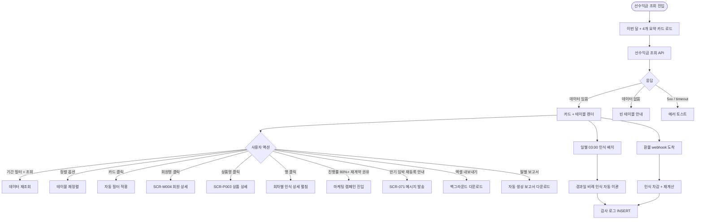

# SCR-S006 선수익금 조회 페이지

## 1. 화면 메타 정보

이 문서는 선수익금 조회 페이지에 대한 자기완결형 요구사항 정의서입니다. 다른 문서를 함께 보지 않아도 이 문서 한 장만으로 선수익금 조회 페이지에 들어가는 모든 영역, 모든 버튼, 모든 모달, 모든 권한, 모든 예외 처리, 그리고 이 화면을 지탱하는 운영 정책까지 전부 이해하고 구현할 수 있도록 작성합니다.

| 항목 | 값 |
|---|---|
| 작성일 | 2026-05-22 |
| 버전 | v1.0 |
| 상태 | 최신 통합본 반영 (정합화 완료) |
| 도메인 | D03 매출관리 |
| 화면 ID | SCR-S006 |
| 화면명 | 선수익금 조회 |
| 화면 유형 | 회계 분석 화면 (Deferred Revenue) |
| 라우트 (URL) | `/deferred-revenue` |
| 플랫폼 | 데스크톱(기본), 태블릿 |
| 우선순위 | P0 (출시 필수) |
| 기능코드 | SAL-04 (선수익금 조회) |
| 계약코드 | SAL-04 |
| 계약 상태 | 계약 범위 본기능 |
| 부모 기능 prefix | SAL |
| Lv1 코드 | SAL-04 |
| Lv2 / Lv3 세분화 | SAL-04-01 ~ SAL-04-04 (요약 지표 4종, 기간 필터, 선수익금 목록 테이블, 서비스일수 판정) |
| 연계 화면 | SCR-S001 매출현황, SCR-S004 매출통계, SCR-S007 환불관리, SCR-S005 통계관리, SCR-097 감사로그 |
| 호출 다이얼로그 | (없음) |

## 2. 화면 개요와 목적

선수익금 조회 페이지는 회원이 선납한 금액 중 아직 서비스가 제공되지 않은 금액(선수익금)의 현황을 조회하는 회계 화면입니다. 회원권 6개월·12개월처럼 장기 계약은 결제 시점에 전액이 수납되지만, 회계상 매출 인식은 서비스 제공일에 비례해 일별로 점진적으로 이루어집니다. 이 화면은 총 선수익금·이미 인식된 금액·아직 인식되지 않은 잔여 금액·이번 달 인식 예정 금액을 파악하고 계약별 진행률을 확인하는 회계 관점의 분석 도구입니다.

운영 맥락은 다양합니다. 회계 담당자는 월말 매출 인식 마감 시 이번 달 인식 예정 카드와 일별 인식 배치 결과로 매출 인식 회계 처리를 진행하고, 본사 슈퍼관리자는 통합 모드에서 지점별 선수익 잔여와 인식 추세를 모니터링합니다. Owner(지점장)은 진행률 80%+ 계약을 우선 주목해 재계약 권유나 추가 결제 유도를 진행하고, 세무 담당자는 잔여 선수익금을 회계상 부채로 인식해 부가세 신고와 법인세 처리에 활용합니다. CFO는 총 선수익금 vs 매출 인식 비율로 현금 유동성과 매출 안정성을 분석하고, 마케팅 팀은 종료일 임박 계약을 재등록 캠페인 대상으로 활용합니다.

회계상 매출 인식 기준은 GAAP/K-IFRS의 발생주의 원칙에 따라 서비스 제공일에 비례하여 인식합니다. 일별 인식 배치(매일 03:00)가 경과일에 따라 선수익금을 매출 인식으로 자동 이관하며, 환불 건은 계산에서 제외됩니다.

## 3. 진입 경로와 인접 화면

선수익금 조회 페이지에 진입하는 경로는 다음과 같습니다.

첫 번째 경로는 사이드바입니다. 좌측 사이드바의 "매출관리" 메뉴 아래 "선수익금 조회" 항목을 클릭하면 진입합니다. URL은 `/deferred-revenue`이며, 기간 필터는 이번 달이 기본 설정됩니다.

두 번째 경로는 대시보드(SCR-101)의 선수익금 카드 클릭입니다. "잔여 선수익금" 카드를 누르면 잔여 큰 계약 정렬로, "이번 달 인식 예정" 카드를 누르면 종료일 임박 정렬로 자동 진입합니다.

세 번째 경로는 매출 통계(SCR-S004)의 개월별 5버킷 분석에서 "선수익 인식 보기" 링크를 누르거나, 환불 관리(SCR-S007)에서 환불 발생 시 "선수익금 영향 확인" 링크를 누를 때입니다.

이 화면에서 빠져나가는 인접 화면으로는, 회원명 클릭으로 진입하는 회원 상세(SCR-M004), 매출 현황(SCR-S001), 매출 통계(SCR-S004), 환불 관리(SCR-S007), 그리고 모든 인식·환불 차감·휴면 갱신 이벤트가 기록되는 감사 로그(SCR-097)가 있습니다.

## 4. 레이아웃과 UI 구성

선수익금 조회 페이지는 위에서 아래로 차곡차곡 쌓이는 세로형 단일 컬럼 레이아웃을 기본으로 합니다.

가장 위에는 페이지 헤더가 있습니다. 헤더 좌측에는 "선수익금 조회"라는 페이지 타이틀과 함께 현재 조회 중인 지점 컨텍스트 배지가 따라옵니다. 헤더 우측에는 "엑셀 내보내기" 버튼과 "월별 선수익 보고서 다운로드" 버튼이 있어 매니저+ 권한자가 회계 자료를 즉시 다운로드할 수 있습니다.

페이지 헤더 바로 아래에는 요약 지표 카드 4개가 가로로 배치됩니다. 첫 번째 카드는 "총 선수익금"으로 현재 시점의 모든 선수익금 합계를 표시합니다. 두 번째 카드는 "인식 완료 금액"으로 매출로 이관된 누적 금액을 초록 강조로 표시합니다. 세 번째 카드는 "잔여 선수익금"으로 아직 인식되지 않은 금액을 포인트 컬러(주황 또는 보라)로 굵게 표시합니다. 네 번째 카드는 "이번 달 인식 예정"으로 이번 달 안에 매출로 인식될 예정 금액의 합계를 표시합니다. 본사 통합 모드에서는 4개 카드 모두 전 지점 합산으로 표시되고 카드 하단에 "전 지점 합산" 주석이 붙습니다.

요약 카드 바로 아래에는 기간 필터 영역이 있습니다. 시작일~종료일 데이트피커와 [조회] 버튼이 가로로 배치되며, 기본값은 이번 달 1일~말일입니다. 직접 입력으로 조회 범위를 자유롭게 설정할 수 있고, 기간을 변경하면 이번 달 인식 예정 카드와 테이블이 함께 갱신됩니다.

기간 필터 아래에는 선수익금 목록 테이블이 있습니다. 컬럼은 좌측부터 회원명 / 상품명 / 총액 / 인식 완료 / 잔여 / 시작일 / 종료일 / 진행률 순서입니다. 인식 완료 금액은 초록색으로 강조되고, 잔여 금액은 주요 색상으로 굵게 표시됩니다. 진행률 컬럼에는 프로그레스 바와 % 숫자가 함께 표시되며, 진행률 0~50%는 초록, 50~80%는 주황, 80~100%는 빨강으로 색상이 변합니다.

테이블 행을 클릭하면 해당 계약의 회원 상세(SCR-M004)로 이동하거나, 같은 화면에서 회차별 인식 상세가 펼쳐집니다. 종료일이 D-7 이내인 계약에는 "D-N" 라벨이 행 옆에 빨강으로 표시되어 만기 임박을 강조합니다. 본사 통합 모드에서는 테이블에 "지점" 컬럼이 추가됩니다.

테이블 우측 상단에는 정렬 옵션 드롭다운이 있어 잔여 큰 순/종료일 가까운 순/진행률 높은 순 중 선택할 수 있습니다. 정렬 옵션을 바꾸면 테이블이 즉시 재정렬됩니다.

페이지 가장 아래에는 페이지네이션 영역이 있습니다. 페이지당 표시 건수(20·50·100), 페이지 번호 이동, 총 건수 표시가 배치됩니다.

## 5. 탭 구성과 탭별 동작

이 화면은 탭이 없습니다. 단일 분석 화면이며, 기간 필터와 정렬 옵션으로 데이터를 조절합니다.

기간 필터 변경 시 요약 카드와 테이블이 동시에 갱신됩니다. 정렬 옵션 변경 시 테이블만 재정렬되고 카드 합계는 변경되지 않습니다.

## 6. 버튼·아이콘·링크 액션 전체 정의

이 화면에 등장하는 모든 클릭 가능한 요소를 빠짐없이 정의합니다.

요약 지표 카드 4개는 클릭 가능합니다. 총 선수익금 카드를 누르면 모든 계약이 표시되고, 인식 완료 카드를 누르면 진행률 100% 계약만 필터링됩니다. 잔여 선수익금 카드는 진행률이 100% 미만인 계약만 표시하고, 이번 달 인식 예정 카드는 이번 달 안에 종료일이 있는 계약 또는 일별 인식 배치 대상 계약만 표시합니다.

기간 필터의 [조회] 버튼은 설정한 기간으로 데이터를 다시 불러옵니다. 데이트피커는 시작일과 종료일을 각각 선택하며, 두 날짜가 모두 설정되어야 [조회]가 활성화됩니다.

정렬 옵션 드롭다운은 잔여 큰 순/종료일 가까운 순/진행률 높은 순/회원명 가나다 순 중 선택합니다. 즉시 재정렬됩니다.

테이블의 회원명 클릭은 회원 상세(SCR-M004)로 이동시킵니다. 상품명 클릭은 상품 상세(SCR-P003)로 이동시킵니다. 행 전체 클릭은 회차별 인식 상세 펼침으로 동작합니다.

진행률 80%+ 빨강 강조 행 옆에는 "재계약 권유" 보조 액션 버튼이 표시되어, 마케팅 캠페인 진입이나 회원 상세 진입을 빠르게 수행할 수 있습니다.

D-7 이내 만기 임박 행 옆에는 "재등록 안내 발송" 보조 액션 버튼이 표시되어, SCR-071 메시지 발송 화면으로 자동 진입할 수 있습니다.

페이지 헤더의 [엑셀 내보내기] 버튼은 현재 기간·정렬이 적용된 선수익금 목록을 엑셀로 다운로드합니다. [월별 선수익 보고서 다운로드] 버튼은 자동 생성된 월별 보고서(매월 1일 05:00 생성)를 다운로드합니다.

페이지네이션의 페이지당 건수 드롭다운(20·50·100), 페이지 번호 이동 컨트롤은 일반적인 페이지네이션 동작을 수행합니다.

모든 버튼은 클릭 후 응답이 돌아오기 전까지 자동으로 비활성화됩니다.

## 7. 호출되는 모달 동작

이 화면에서는 모달이 호출되지 않습니다. 분석 조회·다운로드 중심의 화면이며, 회원 상세나 상품 상세는 별도 페이지로 이동합니다.

회차별 인식 상세 펼침은 행 클릭 시 인라인으로 표시되며, 모달이 아니라 행 아래 펼침 영역으로 동작합니다.

## 8. 토스트와 확인 팝업과 알럿

선수익금 조회 페이지에서 발생하는 모든 알림성 UI는 다음과 같은 패턴으로 동작합니다.

성공 토스트는 우측 상단에 녹색 계열로 5초 동안 표시되며, "엑셀 다운로드가 시작되었어요", "월별 보고서를 다운로드했어요" 같은 짧은 문구로 결과를 알려줍니다.

실패 토스트는 우측 상단에 빨강 계열로 표시되며, "데이터를 불러올 수 없습니다", "권한이 없어요", "재계산 중입니다" 같은 문구와 함께 "다시 시도" 보조 액션 버튼이 따라옵니다.

일별 인식 배치 실패 알림은 매일 03:00 크론 실패 시 운영자에게 발송되며, "선수익 인식 배치가 실패했습니다. 다음 배치에서 누적 처리됩니다" 안내가 표시됩니다.

인식 정확도 검증 실패 알림은 매월 1일 04:00 검증 배치가 누적 합계와 총액 불일치를 감지하면 운영자에게 발송됩니다. "인식 정확도 검증 실패. 운영자 점검 필요" 안내가 표시되며, 감사 로그 검토가 안내됩니다.

만기 임박 알림은 종료일 D-7 이내 계약이 발생하면 회원과 운영자에게 NFR-19 알림 센터로 발송됩니다.

환불 차감 실패 알림은 SAL-EXT-04 환불 webhook 도착 후 선수익금 차감이 실패하면 운영자에게 발송되어 수동 차감이 안내됩니다.

권한 알럿은 트레이너·스태프 등이 처리(엑셀·통합 모드) 시도 시 차단되고 조회만 가능함을 안내합니다.

## 9. 데이터 흐름과 외부 연동

이 화면은 여러 데이터 소스와 외부 연동에 의존합니다.

화면 진입 시점에는 선수익금 조회 API(`GET /api/deferred-revenue?period=`)가 호출됩니다. 응답으로는 선수익 배열, 4개 요약 카드 합계, 페이지 정보가 함께 내려옵니다. 본사 통합 모드에서는 `branchId=all`로 전달되어 전 지점이 합산됩니다.

계약별 상세는 `GET /api/deferred-revenue/:id`로 호출되며, 회차별 인식 상세 펼침에 사용됩니다.

일별 인식 배치는 매일 03:00에 실행되는 크론입니다. 경과일에 따라 선수익금이 매출 인식으로 자동 이관되며, 인식 공식은 `선수익금 인식 = 총액 × (경과일 / 총 서비스일수)`입니다. 배치 실패 시 다음 배치에서 누적 처리되고 운영자 알림이 발송됩니다. 배치 트리거 API는 `POST /api/deferred-revenue/recognize`이며 수동 트리거도 가능합니다.

서비스일수 정의는 1개월=30일, 3개월=90일, 6개월=180일, 12개월=365일을 기본값으로 사용합니다. 기타 기간은 상품 마스터의 실제 서비스일수 또는 계약 종료일을 우선 사용하며, 값이 없으면 상품 유형별 기본값으로 계산됩니다. 5버킷 매핑 원천은 `[주간월간보고]` 주차별 V5:Z5이며, 매출 원장에 `durationMonths`가 있으면 우선 적용됩니다. 5버킷 매핑이 누락되면 "기타"로 분류되고 운영자 알림이 발송됩니다.

PAY-01 결제 webhook은 회원권/PT 결제 등록 시 선수익금을 자동 등록합니다. SAL-EXT-04 환불 webhook은 환불 완료 시 선수익금 인식을 차감하고 재계산을 수행합니다. 환불 건은 인식 계산에서 자동 제외됩니다.

회원권 휴면 이벤트는 휴면 처리 시 서비스일수에 잔여일을 누적합니다. 회원권 연장 이벤트는 종료일을 갱신해 인식 기간을 동적으로 조정합니다. 두 이벤트 모두 인식 진행률이 자동으로 재계산됩니다.

진행률 100% 도달 시 잔여 0원으로 자동 만기 처리되며, 만기 임박 알림(NFR-19)은 종료일 D-7 시점에 회원과 운영자에게 발송됩니다.

인식 정확도 검증 배치는 매월 1일 04:00에 실행됩니다. 누적 합계가 총액과 일치하는지 검증하고, 불일치 시 운영자 알림이 발송됩니다.

월별 선수익 보고서는 매월 1일 05:00에 자동 생성되며, 운영자가 다운로드할 수 있습니다. 보고서는 회계 시스템 입력에 활용됩니다.

회계 시스템 연동은 API 또는 CSV 다운로드를 통해 이루어지며, 월말 마감 시 매출 인식이 자동으로 회계 시스템에 입력됩니다.

엑셀 내보내기는 `GET /api/deferred-revenue/export`로 처리되며, 30,000건 초과 시 백그라운드 다운로드로 분기됩니다.

다지점 RLS는 지점별 선수익을 격리하며, 본사 통합 모드만 전 지점에 접근 가능합니다. FC는 담당 회원만 RLS로 조회 가능하고, 트레이너·스태프는 조회만 가능합니다.

선수익 데이터 보관은 5년이며, 5년 경과 후 PII 마스킹 배치(매월 1회)가 회원명·연락처를 익명화합니다. 인식 데이터는 보존됩니다.

감사 로그는 인식·환불 차감·휴면 갱신·연장 갱신·만기 자동 처리를 모두 SCR-097에 비동기로 기록합니다. 기록 필드는 `actor_id`(시스템 또는 사용자), `deferred_id`, `amount`, `event`(인식/차감/갱신/만기), `timestamp`입니다.

화면에서 호출하는 주요 API 엔드포인트는 다음과 같습니다. 선수익금 조회 `GET /api/deferred-revenue`, 상세 조회 `GET /api/deferred-revenue/:id`, 배치 트리거 `POST /api/deferred-revenue/recognize`, 엑셀 내보내기 `GET /api/deferred-revenue/export`, 월별 보고서 `GET /api/deferred-revenue/report`.

## 10. 화면 상태와 예외 처리

선수익금 조회 페이지는 다음 상태들을 가질 수 있습니다.

로딩 중 상태에서는 카드와 테이블 영역에 스켈레톤이 표시됩니다.

정상 표시 상태는 데이터가 있을 때 지표 카드와 테이블이 함께 표시되는 일반적인 상태입니다.

데이터 없음 상태는 해당 기간에 선수익금 계약이 없을 때 빈 테이블 안내가 표시됩니다.

진행률 80%+ 강조 상태에서는 해당 행의 진행률 바가 빨강으로 강조되고 "재계약 권유" 보조 액션이 표시됩니다.

만기 임박 상태에서는 종료일이 D-7 이내인 계약 행에 "D-N" 라벨이 빨강으로 표시되고 "재등록 안내 발송" 보조 액션이 표시됩니다.

환불 차감 상태는 SAL-EXT-04 환불 webhook이 도착해 인식이 차감되고 잔여가 재계산되는 상태입니다. "재계산 중" 표시가 잠시 노출됩니다.

휴면·연장 상태는 회원권 휴면/연장 이벤트로 서비스일수가 갱신되는 상태입니다. 행 옆에 "서비스일수 갱신" 안내가 표시됩니다.

본사 통합 모드 상태에서는 모든 카드 합계가 전 지점 합산으로 표시되고 "지점" 컬럼이 추가됩니다.

일별 배치 실패 상태는 매일 03:00 크론 실패 시 운영자 알림이 발송되고 다음 배치에서 누적 처리됨을 안내하는 상태입니다.

권한 미달 상태에서는 통합 모드 토글, 엑셀 버튼 등이 hidden 처리됩니다.

오류 상태는 서버 5xx 또는 네트워크 타임아웃 시 토스트가 표시되는 상태입니다.

예외 케이스별 처리는 다음과 같이 정의됩니다. 데이터 없음 시 빈 테이블 안내와 기간 변경 안내, 환불 자동 차감 실패 시 운영자 알림과 수동 차감 안내, 일별 배치 실패 시 운영자 알림과 누적 처리, 5버킷 매핑 누락 시 "기타" 분류와 운영자 알림, `durationMonths` 누락 시 5버킷 fallback, 종료일 미정 시 "기타" 분류와 운영자 종료일 입력 안내, 휴면·연장 갱신 실패 시 운영자 알림과 수동 갱신, 진행률 100% 자동 만기 실패 시 운영자 알림과 수동 처리, 인식 정확도 검증 실패 시 누적 ≠ 총액 표시와 운영자 점검 안내, 통합 모드 권한 미달 시 토글 hidden, 트레이너 처리 시도 시 조회만 가능, FC 비담당 회원 RLS 미노출, 5년 경과 데이터 익명화 표시, 회계 시스템 연동 실패 시 수동 입력 안내, 진행률 색상 분기 누락 시 기본 색상, 만기 임박 라벨 누락 시 라벨 hidden, 환불 후 인식 재계산 지연 시 "재계산 중" 표시와 5초 후 갱신, 동시 조회 부하 시 큐 대기, 무기한 상품 매출 인식 시 "기타" 인식 보류와 운영자 분류, 다지점 RLS 누수 시 보안 이벤트 즉시 차단 등이 있습니다.

## 11. 권한별 처리

superAdmin와 primary는 기간 필터, 전체 조회, 본사 통합 모드, 엑셀 내보내기, 월별 보고서 다운로드까지 모두 가능합니다.

Owner(지점장)과 매니저(manager)는 자기 지점의 기간 필터, 조회, 엑셀 내보내기, 월별 보고서 다운로드가 가능합니다. 본사 통합 모드는 표시되지 않습니다.

FC(피트니스 코치, fc)는 담당 회원만 RLS로 조회 가능하며 엑셀 내보내기·월별 보고서 다운로드는 차단됩니다.

트레이너(trainer)와 스태프(staff)는 조회만 가능합니다.

읽기 전용(readonly)은 화면 자체에 접근할 수 없습니다.

권한 차단 시 버튼 hidden 또는 비활성, 403 응답 시 "권한이 없어요" 토스트, 모든 권한 차단 이벤트는 감사 로그에 기록됩니다.

## 12. 메인 흐름



## 13. 에러와 예외 흐름

```mermaid
flowchart TD
    A([액션 트리거]) --> B{서버 응답 / 배치}
    B -->|5xx / timeout| C[자동 재시도 1회]
    C --> D{재시도 성공?}
    D -->|성공| E[정상 흐름 복귀]
    D -->|실패| F[다시 시도 버튼]
    B -->|데이터 없음| G[빈 테이블 + 기간 변경 안내]
    B -->|환불 자동 차감 실패| H[운영자 알림 + 수동 차감]
    B -->|일별 배치 실패| I[운영자 알림 + 누적 처리]
    B -->|5버킷 매핑 누락| J["기타" 분류 + 운영자 알림]
    B -->|durationMonths 누락| K[5버킷 fallback]
    B -->|종료일 미정 (무기한)| L["기타" 분류 + 운영자 종료일 입력]
    B -->|휴면·연장 갱신 실패| M[운영자 알림 + 수동 갱신]
    B -->|진행률 100% 자동 만기 실패| N[운영자 알림 + 수동 처리]
    B -->|인식 정확도 검증 실패| O[누적 ≠ 총액 + 운영자 점검]
    B -->|통합 모드 권한 미달| P[토글 hidden]
    B -->|FC 비담당 회원| Q[RLS 미노출]
    B -->|5년 경과 데이터| R[익명화 표시 + 인식 데이터 보존]
    B -->|회계 시스템 연동 실패| S[수동 입력 안내]
    B -->|환불 후 재계산 지연| T["재계산 중" + 5초 후 갱신]
    B -->|동시 조회 부하| U[큐 대기 + 5초 후 재시도]
    B -->|무기한 상품 인식| V["기타" 인식 보류 + 운영자 분류]
    B -->|다지점 RLS 누수| W[보안 이벤트 즉시 차단]
```

## 14. 핵심 디자인 요청사항

이 화면의 핵심은 회계 관점의 명확한 시각화입니다. 요약 지표 카드 4개는 한눈에 비교 가능한 동일 크기 그리드로 배치되며, 각 카드의 색상이 회계 의미를 즉시 전달합니다. 총 선수익금은 중립 색상, 인식 완료는 초록(매출 인식 = 자산화), 잔여 선수익금은 포인트 컬러(부채 = 회계 부담), 이번 달 인식 예정은 강조 색상으로 표시됩니다.

진행률 프로그레스 바는 0~50% 초록, 50~80% 주황, 80~100% 빨강의 단계적 색상 변화를 표시합니다. 색맹 사용자를 위해 % 숫자가 항상 함께 표시되며, 진행률 80%+ 행은 행 전체에 약한 빨강 배경을 추가해 운영자가 즉시 인지할 수 있도록 합니다.

만기 임박 "D-N" 라벨은 종료일 컬럼 옆에 빨강 배지로 표시되며, D-Day일 때는 더 진한 빨강과 깜빡임 애니메이션이 적용되어 즉시 주목을 끕니다. "재계약 권유"와 "재등록 안내 발송" 보조 액션은 행 호버 시 우측에 부드럽게 나타납니다.

테이블 컬럼 중 인식 완료는 초록 강조, 잔여는 굵은 포인트 컬러로 표시되어 회계 의미가 시각적으로 즉시 전달됩니다. 금액 컬럼은 천 단위 콤마와 우측 정렬을 적용합니다.

회차별 인식 상세 펼침은 행 아래 인라인 영역으로 표시되며, 작은 회차별 프로그레스 바와 인식 일자가 일별 또는 월별로 정렬되어 보입니다.

본사 통합 모드에서 "지점" 컬럼이 추가되면 컬럼 추가 안내 토스트가 잠시 표시되고, 가로 스크롤이 부드럽게 적용됩니다.

월별 선수익 보고서 다운로드 버튼은 페이지 헤더에 작은 회계 보고서 아이콘과 함께 표시되어, 매월 1일 자동 생성된 보고서를 즉시 다운로드할 수 있음을 시각적으로 안내합니다.

진행 스피너와 로딩 스켈레톤은 매출관리 전체에서 동일한 톤으로 통일됩니다.

## 15. 운영 정책 (이 화면에 연결된 부분)

이 화면은 GAAP/K-IFRS의 발생주의 매출 인식 정책이 그대로 반영된 회계 분석 도구입니다.

서비스일수 정의 정책은 1개월=30일, 3개월=90일, 6개월=180일, 12개월=365일을 기본값으로 사용합니다. 기타 기간은 상품 마스터의 실제 서비스일수 또는 계약 종료일을 우선 사용합니다.

5버킷 동기화 정책은 SAL-03 매출 통계의 1/3/6/12/기타 5버킷 기준과 동일합니다. 매출 통계와 선수익금 조회가 같은 기준을 사용해 회계 일관성을 보장합니다.

매출 원장 `durationMonths` 우선 정책은 매출 원장에 `durationMonths` 값이 있으면 우선 적용하고, 없으면 5버킷 fallback을 적용합니다.

인식 공식 정책은 `선수익금 인식 = 총액 × (경과일 / 총 서비스일수)`입니다. 일별 인식 배치(매일 03:00)가 자동으로 경과일에 비례한 매출 인식을 수행합니다.

환불 건 계산 제외 정책은 SAL-EXT-04 환불 webhook 도착 시 환불 건을 인식 계산에서 자동 차감합니다. 환불 후 잔여 선수익금이 재계산되며, 환불 차감 실패 시 운영자에게 수동 차감이 안내됩니다.

휴면·연장 시 서비스일수 갱신 정책은 회원권 휴면 시 잔여일을 누적하고 연장 시 종료일을 갱신해 인식 기간을 동적으로 조정합니다. 진행률이 자동 재계산됩니다.

본사 통합 모드 정책은 본사 슈퍼관리자에게만 활성화되며, 전 지점 합산과 "지점" 컬럼 추가를 제공합니다.

권한별 가시성 정책은 매니저+ 자기 지점 전체 조회 가능, FC는 담당 회원만 RLS 조회, 트레이너·스태프는 조회만, readonly는 접근 차단입니다.

진행률 색상 정책은 0~50% 초록, 50~80% 주황, 80~100% 빨강의 단계적 색상 변화를 적용합니다. 색상은 운영자에게 재계약 권유 우선순위를 시각적으로 안내합니다.

만기 임박 라벨 정책은 종료일이 D-7 이내인 계약에 "D-N" 빨강 라벨을 표시합니다. 만기 임박 알림(NFR-19)도 회원과 운영자에게 발송됩니다.

다지점 RLS 정책은 지점별 선수익을 격리하며, 본사 통합 모드만 전 지점에 접근 가능하도록 합니다.

회계 인식 기준 정책은 GAAP/K-IFRS 발생주의 원칙을 따르며, 서비스 제공일에 비례한 매출 인식을 수행합니다.

무기한 상품 처리 정책은 종료일 미정 시 "기타"로 분류되고 운영자에게 종료일 입력이 안내됩니다. 인식 계산이 보류되며, 운영자가 종료일을 입력하면 인식이 재개됩니다.

만기 자동 처리 정책은 진행률 100% 도달 시 잔여를 0원으로 처리하고 자동 만기로 전환합니다. 자동 만기 실패 시 운영자에게 수동 처리가 안내됩니다.

인식 정확도 검증 정책은 매월 1일 04:00 검증 배치를 통해 누적 합계 = 총액임을 검증합니다. 불일치 시 운영자에게 점검 알림이 발송됩니다.

데이터 보관 5년 정책은 회계·세무 신고 기간을 고려한 것이며, 5년 경과 후 PII 마스킹 배치(매월 1회)가 회원명·연락처를 익명화합니다. 인식 데이터는 보존됩니다.

감사 로그 정책은 인식·환불 차감·휴면 갱신·연장 갱신·만기 자동 처리를 모두 SCR-097에 비동기로 기록합니다. 기록 필드는 `actor_id`, `deferred_id`, `amount`, `event`, `timestamp`입니다.

회계 시스템 연동 정책은 API 또는 CSV 다운로드를 통해 매출 인식을 회계 시스템에 자동 입력합니다. 연동 실패 시 수동 입력이 안내됩니다.

월별 선수익 보고서 정책은 매월 1일 05:00에 자동 생성됩니다. 운영자가 다운로드할 수 있으며, 회계 시스템 입력에 활용됩니다.

이상의 모든 정책은 이 화면을 구현하고 운영하는 사람이 별도 문서 없이 이 한 장만 보면 이해할 수 있도록 풀어 적었습니다. 정책이 바뀌면 이 문서가 함께 갱신되어야 하며, 코드 변경과 정책 변경은 항상 짝지어 진행됩니다.
