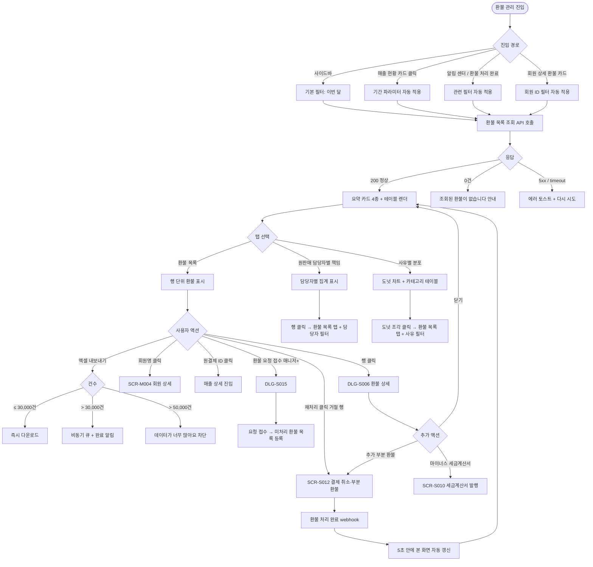

# SCR-S007 환불 관리 페이지

## 1. 화면 메타 정보

이 문서는 환불 관리 페이지에 대한 자기완결형 요구사항 정의서입니다. 다른 문서를 함께 보지 않아도 이 문서 한 장만으로 환불 관리 페이지에 들어가는 모든 영역, 모든 버튼, 모든 모달, 모든 권한, 모든 예외 처리, 그리고 이 화면을 지탱하는 운영 정책까지 전부 이해하고 구현할 수 있도록 작성합니다.

| 항목 | 값 |
|---|---|
| 작성일 | 2026-05-22 |
| 버전 | v1.0 |
| 상태 | 최신 통합본 반영 (정합화 완료) |
| 도메인 | D03 매출관리 |
| 화면 ID | SCR-S007 |
| 화면명 | 환불 관리 |
| 화면 유형 | 조회·분석 화면 (Analytics Screen) |
| 라우트 (URL) | `/refunds` |
| 플랫폼 | 데스크톱(기본), 태블릿, 모바일(요약 카드 + 카드형 리스트) |
| 우선순위 | P0 (출시 필수) |
| 기능코드 | PAY-02 (환불 관리) |
| 계약코드 | PAY-02 |
| 계약 상태 | 계약 범위 본기능 |
| 부모 기능 prefix | PAY |
| Lv1 코드 | PAY-02 |
| Lv2 / Lv3 세분화 | PAY-02-01 ~ PAY-02-08 (요약 지표 4종, 위약금 합계, 날짜 필터, 환불 목록 테이블, 환불 처리 호출, 환불 상세 호출, 원판매 담당자별 책임 탭, 엑셀 내보내기) |
| 연계 화면 | SCR-S001 매출현황, SCR-S012 결제취소·부분환불, SCR-S010 세금계산서발행, SCR-097 감사 로그, SCR-074 포인트, SCR-M004 회원 상세 |
| 호출 다이얼로그 | DLG-S006 환불상세, DLG-S013 환불처리, DLG-S014 환불상세결과, DLG-S015 환불요청 |

## 2. 화면 개요와 목적

환불 관리 페이지는 센터에서 처리된 모든 환불 내역을 조회·분석하고, 환불 정책이 운영 현장에서 어떻게 적용되고 있는지를 점검하는 매출관리 도메인의 핵심 분석 화면입니다. 이 화면은 환불을 직접 처리하는 화면이 아니라, 이미 처리된 환불을 모아서 보고 패턴을 읽고 책임 소재를 식별하는 화면입니다. 실제 환불 처리(전체 취소·부분 환불·위약금 면제 등)는 결제 취소·부분 환불 화면(SCR-S012)에서 수행되며, 그 결과가 5초 이내에 본 화면의 목록과 요약 지표에 자동으로 반영됩니다.

이 화면이 다루는 운영 흐름은 다섯 가지로 정리됩니다. 첫째, 센터장은 월말마다 진입해 이번 달 환불 총액·건수·평균 환불액·위약금 합계를 한눈에 보며 비정상 증가 여부를 판단합니다. 둘째, 본사 슈퍼관리자는 통합 모드로 진입해 지점별 환불률을 비교하면서 환불률 5%를 초과한 지점을 식별하고 운영 점검을 지시합니다. 셋째, 매니저는 회원명 검색으로 반복 환불 회원(동일 회원 3회 이상 환불)을 찾아 마케팅·CS 대응을 결정합니다. 넷째, FC는 원판매 담당자별 환불 책임 탭에서 본인의 환불률을 확인해 영업 품질을 자가 점검합니다. 다섯째, 회계 담당자는 월말 마감을 위해 환불 총액과 위약금 합계를 엑셀로 내려받아 VAT 정산과 매출 차감 회계 처리에 사용합니다.

따라서 이 화면은 단순한 환불 목록 테이블이 아니라, 위약금 정책 세트·결제 경로(현장 영수증 vs 결제링크)·원판매 담당자 책임·지점 환불률 임계값·법인 마이너스 세금계산서·익명화까지 모두 반영된 분석 허브로 동작해야 합니다.

## 3. 진입 경로와 인접 화면

환불 관리 페이지에 진입하는 경로는 다음과 같이 다섯 가지가 있고, 각 경로마다 진입 직후 화면의 초기 상태가 조금씩 달라집니다.

첫 번째 경로는 사이드바입니다. 좌측 사이드바의 "매출관리" 메뉴 아래 "환불 관리" 항목을 누르면 진입합니다. URL은 `/refunds`이며, 화면은 기본 필터 상태(기간: 이번 달, 정렬: 환불일 내림차순, 페이지 1)로 시작합니다.

두 번째 경로는 매출 현황(SCR-S001)의 환불액 카드 클릭입니다. 매출 현황에서 "이번 달 환불액" 또는 "위약금 합계" 카드를 누르면 이 화면으로 이동하면서 같은 기간이 URL 쿼리 파라미터로 자동 적용된 상태로 열립니다. 예를 들어 매출 현황에서 5월 환불액 카드를 누르면 `/refunds?from=2026-05-01&to=2026-05-31`처럼 5월 한 달치 환불만 보이는 상태로 진입합니다.

세 번째 경로는 알림 센터(NFR-19)의 환불 관련 알림 클릭입니다. "지점 월 환불률 5% 초과" 알림이나 "반복 환불 회원 3회 이상 감지" 알림을 누르면, 알림에 포함된 회원 ID 또는 지점 ID가 필터로 자동 적용된 상태로 진입합니다.

네 번째 경로는 결제 취소·부분 환불 화면(SCR-S012)에서 환불 처리가 완료된 직후의 "환불 관리로 이동" CTA입니다. DLG-S014 환불 상세 결과 모달에서 [확인]을 누르면 자동으로 이 화면으로 이동하면서, 방금 처리된 환불 건이 목록 최상단에 하이라이트된 상태로 보입니다.

다섯 번째 경로는 회원 상세(SCR-M004)의 환불 이력 카드 클릭입니다. 특정 회원의 환불 이력 카드를 누르면, 회원 ID가 필터로 자동 적용되어 그 회원의 환불 내역만 보이도록 진입합니다.

이 화면에서 다시 빠져나가는 인접 화면으로는, 행 클릭으로 열리는 환불 상세 다이얼로그(DLG-S006), 원결제 ID 클릭으로 진입하는 매출 상세 또는 매출 현황(SCR-S001), 환불 처리가 필요한 건의 [환불 처리] 진입점인 결제 취소·부분 환불 화면(SCR-S012), 환불 요청 접수 다이얼로그(DLG-S015), 법인 회원 환불 시 마이너스 세금계산서 발행을 위한 세금계산서 발행 화면(SCR-S010), 모든 환불 조회·처리·취소 이벤트가 기록되는 감사 로그(SCR-097)가 있습니다.

## 4. 레이아웃과 UI 구성

환불 관리 페이지는 위에서 아래로 차곡차곡 쌓이는 세로형 단일 컬럼 레이아웃을 기본으로 합니다. 데스크톱에서는 전체 폭을 활용하고, 태블릿에서는 요약 카드가 2 × 2 그리드로 줄바꿈되며, 모바일에서는 카드가 가로 스크롤되고 테이블이 카드형 리스트로 자동 전환됩니다.

가장 위에는 페이지 헤더가 있습니다. 헤더 좌측에는 "환불 관리"라는 페이지 타이틀과 함께, 현재 조회 중인 지점이 "전체 지점(통합)"인지 특정 지점인지를 알려주는 지점 컨텍스트 배지가 따라옵니다. 헤더 우측에는 본사 권한자에게만 보이는 "통합 모드" 토글과 "엑셀 내보내기" 버튼이 배치됩니다. 통합 모드 토글이 켜지면 전 지점 환불이 합산되어 표시되며, 테이블에 "결제 지점"·"이용 지점"·"매출 귀속 지점"·"정산 지점" 컬럼이 추가됩니다.

페이지 헤더 바로 아래에는 요약 지표 카드 4개가 가로로 배치됩니다. 첫 번째 카드는 "이번 달 환불 총액"으로 조회 기간 내 모든 실환불액의 합계를 표시하며, 카드 우측에 전월 대비 증감률이 작은 화살표와 함께 노출됩니다. 두 번째 카드는 "환불 건수"로 조회 기간 내 환불 처리 행의 수를 표시합니다. 세 번째 카드는 "평균 환불액"으로 환불 총액 ÷ 환불 건수로 계산되며, 평균이 50만원을 초과하면 카드 우측에 작은 주의 라벨이 붙어 고액 환불 비중이 높음을 알려줍니다. 네 번째 카드는 "위약금 합계"로 조회 기간 내 환불 건에서 공제된 위약금 총액을 표시하며, 이 값은 환불 총액과 별도 집계입니다. 카드 4개는 모두 클릭 가능하며 카드 클릭 시 해당 지표에 대응하는 필터(예: 위약금 카드 클릭 시 "위약금 > 0인 환불만")가 자동 적용됩니다. 본사 통합 모드에서는 카드 아래 작은 글씨로 "전 지점 합산"이라는 주석이 붙고, 지점 환불률이 5%를 초과한 지점이 있으면 환불 총액 카드 테두리가 빨강으로 강조됩니다.

요약 카드 바로 아래에는 날짜 필터 바가 있습니다. 좌측에는 "이번 달", "지난 달", "최근 3개월" 프리셋 버튼이 토글 그룹으로 배치되고, 그 우측에는 시작일과 종료일을 직접 입력하는 날짜 피커 두 개가 나란히 놓이며, 가장 오른쪽에 [조회] 버튼이 있습니다. 프리셋 버튼을 누르면 시작일·종료일이 자동으로 채워지고 즉시 재조회가 일어나며, 날짜 피커를 직접 변경한 경우에는 [조회] 버튼을 눌러야 재조회가 일어납니다. 날짜 범위는 최대 365일까지 허용되며, 그보다 긴 범위는 "최대 1년까지 조회 가능합니다"라는 인라인 메시지로 차단됩니다.

날짜 필터 아래에는 보조 필터 바가 있습니다. 회원명 검색창(디바운스 300ms, 최소 2자), 환불 사유 카테고리 드롭다운(전체·단순 변심·결제 오류·회원 요청·서비스 불만·기타), 환불 상태 드롭다운(전체·완료·처리중·거절), 결제 경로 토글(현장 영수증 등록 vs 결제링크), 위약금 면제 여부 토글이 배치됩니다. 적용된 필터는 검색 바 아래에 칩 형태로 표시되며, 각 칩의 X 버튼으로 개별 해제가 가능하고 "전체 해제" 링크로 한 번에 초기화됩니다. 본사 통합 모드에서는 보조 필터 바에 지점 다중 선택 드롭다운이 추가로 노출됩니다.

보조 필터 바 아래에는 탭 영역이 있습니다. 1차 탭은 "환불 목록 / 원판매 담당자별 환불 책임 / 사유별 분포"의 세 가지로 분기되며, 어떤 탭을 선택하든 상단의 요약 카드와 필터 상태는 그대로 유지됩니다. 환불 목록 탭이 기본이며, 원판매 담당자별 환불 책임 탭은 처리자와 별도로 원매출 판매 귀속 담당자별 환불 건수·환불 금액·위약금 합계·환불률을 보여주는 분석 탭이고, 사유별 분포 탭은 환불 사유 카테고리별 비율을 도넛 차트로 보여주는 진단 탭입니다.

환불 목록 탭이 활성화되어 있을 때의 테이블은 좌측부터 다음 컬럼이 배치됩니다. No(번호), 환불일, 회원명(클릭 시 회원 상세로 이동), 상품명, 환불금액(빨강 강조), 차감금, 위약금, 실환불액, 환불방법(원결제수단 환불·계좌 이체·포인트 회복 등), 결제경로(현장 영수증 vs 결제링크), 원결제ID(클릭 시 매출 상세로 이동), 처리자, 원판매 담당자, 사유(작은 보조 텍스트로 카테고리 + 추가 의견 일부), 상태 배지(완료 초록 / 처리중 노랑 / 거절 빨강), 액션(상세·재처리). 본사 통합 모드에서는 결제 지점·이용 지점·매출 귀속 지점·정산 지점·인센티브 귀속자 컬럼이 추가로 노출됩니다. 환불금액 컬럼은 항상 마이너스 부호 없이 빨강 굵은 글씨로 표시되어 일반 매출과 시각적으로 구분됩니다. 사유 컬럼은 카테고리 라벨 + 추가 의견의 앞 20자까지만 보이며, 행 호버 시 전체 의견이 툴팁으로 표시됩니다.

테이블 우측 상단에는 정렬 옵션(환불일 내림차순·환불금액 내림차순·위약금 내림차순)과 페이지당 건수 드롭다운(20·50·100)이 배치됩니다. 행을 클릭하면 환불 상세 다이얼로그(DLG-S006)가 열리며, 상태가 "거절"인 행을 클릭하면 거절 사유와 함께 "재처리" 버튼이 노출되어 SCR-S012로 진입할 수 있습니다.

원판매 담당자별 환불 책임 탭이 활성화되어 있을 때는 테이블의 행 단위가 담당자로 바뀝니다. 컬럼은 담당자명(퇴사자는 "퇴사" 라벨 추가), 담당 직군(FC·트레이너·매니저), 원매출 건수, 환불 건수, 환불 금액, 위약금 합계, 환불률(환불 건수 ÷ 원매출 건수 × 100), 환불 사유 분포 미니바 차트로 구성됩니다. 환불률이 5%를 초과한 담당자는 행 배경이 옅은 빨강으로 강조됩니다. 행을 클릭하면 그 담당자의 환불 건만 보이도록 환불 목록 탭으로 자동 전환되면서 담당자 필터가 적용됩니다.

사유별 분포 탭이 활성화되어 있을 때는 화면 좌측에 사유 카테고리별 도넛 차트가, 우측에 카테고리별 환불 건수·환불 금액·평균 환불액 테이블이 나란히 배치됩니다. 도넛 차트의 한 조각을 클릭하면 그 사유의 환불 건만 보이도록 환불 목록 탭으로 자동 전환되며, 같은 사유의 환불이 운영 정책 개선 신호(예: 단순 변심 비율 50% 초과)에 해당하면 도넛 차트 아래에 노란 안내 박스가 표시됩니다.

페이지 가장 아래에는 페이지네이션 영역이 있습니다. 좌측에 페이지당 건수 드롭다운, 가운데에 페이지 이동 컨트롤, 우측에 "총 N건"이 표시됩니다. 모든 필터·정렬·페이지 상태는 URL 쿼리 파라미터로 보존되어, 북마크와 공유 URL로 같은 화면을 재현할 수 있습니다.

## 5. 탭 구성과 탭별 동작

이 화면은 1차 탭이 세 개 있습니다. 환불 목록 / 원판매 담당자별 환불 책임 / 사유별 분포. 어느 탭을 누르든 상단 요약 카드와 날짜 필터·보조 필터는 그대로 유지되고, 탭이 바뀌면서 데이터 fetch만 새로 일어납니다. 탭 전환 시 페이지는 1페이지로 리셋되지만, 검색어·날짜·필터 칩은 유지됩니다.

환불 목록 탭은 환불 건을 행 단위로 보여주는 가장 기본적인 탭입니다. 한 행은 한 건의 환불(전체 취소 또는 부분 환불)이며, 같은 원결제에 부분 환불이 두 번 일어났다면 두 행으로 분리되어 표시됩니다. 각 행에는 환불 처리 시점의 위약금 정책 세트가 스냅샷으로 보존되어 있어, 정책이 바뀌어도 과거 환불의 위약금 계산은 그대로 보존됩니다.

원판매 담당자별 환불 책임 탭은 환불 처리자가 아닌 원매출 판매 귀속 담당자 기준으로 집계하는 탭입니다. 같은 환불 한 건이라도, 그 환불의 원매출이 어떤 담당자에게 귀속되어 있었는지를 키로 묶어 분석합니다. 환불 행과 원매출 행을 연결하는 키는 원거래ID(또는 카드 승인번호)이며, 키가 없는 환불 행은 회원명 + 종목 + 등록일 + 금액 조합으로 자동 확정하지 않고 별도의 "다중 후보 검수 대상" 라벨로 표시되어 운영자가 수기로 매칭하도록 합니다. 퇴사한 담당자도 환불률 집계에서 제외되지 않고, 이름 옆에 "퇴사" 라벨이 붙은 채로 그대로 표시됩니다.

사유별 분포 탭은 환불 사유 카테고리(단순 변심·결제 오류·회원 요청·서비스 불만·기타) 5종의 비율을 시각화하는 진단 탭입니다. 단순 변심 비율이 50%를 넘으면 약관 안내 강화 신호, 서비스 불만 비율이 20%를 넘으면 시설·강사 점검 신호, 결제 오류 비율이 10%를 넘으면 POS 또는 결제링크 점검 신호로 해석되며, 각 신호에 해당하는 안내 박스가 도넛 차트 아래에 자동으로 표시됩니다.

탭 간 이동은 URL 쿼리 파라미터 `view=list|by-staff|by-reason`으로 표현되며, 새로고침이나 북마크 진입 시 같은 탭이 유지됩니다.

## 6. 버튼·아이콘·링크 액션 전체 정의

이 화면에 등장하는 모든 클릭 가능한 요소를 빠짐없이 정의합니다.

요약 지표 카드 4개는 모두 클릭 가능합니다. 이번 달 환불 총액 카드를 누르면 다른 필터는 유지하고 기간만 "이번 달"로 강제 적용됩니다. 환불 건수 카드는 별도 필터를 추가하지 않고 카드 영역을 강조만 합니다. 평균 환불액 카드는 환불금액 정렬을 내림차순으로 자동 전환합니다. 위약금 합계 카드는 위약금 > 0인 환불 행만 표시되도록 보조 필터를 추가합니다. 카드 클릭 시 페이지는 1페이지로 리셋되지만 탭 선택과 검색어는 유지됩니다.

날짜 필터의 프리셋 버튼(이번 달·지난 달·최근 3개월)은 클릭 즉시 시작일·종료일이 자동 채워지면서 재조회가 일어납니다. 날짜 피커를 직접 변경한 경우에는 [조회] 버튼을 눌러야 재조회가 일어나며, 시작일이 종료일보다 늦으면 [조회] 버튼이 비활성화되고 인라인 메시지로 안내됩니다.

회원명 검색창은 입력 후 300ms 디바운스가 적용되며, 최소 2자 이상 입력되어야 검색이 시작됩니다. 검색어가 적용되면 검색 바 아래에 회원명 칩이 표시되고, 칩의 X 버튼으로 제거할 수 있습니다.

보조 필터 바의 모든 드롭다운과 토글은 변경 즉시 재조회를 트리거하며, 적용된 필터는 즉시 칩으로 표시됩니다. "전체 해제" 링크는 보조 필터 칩만 초기화하고 날짜 필터는 유지합니다.

테이블의 회원명을 클릭하면 회원 상세 페이지(SCR-M004)로 이동합니다. 원결제 ID를 클릭하면 매출 현황(SCR-S001)의 매출 상세로 이동하거나 매출 상세 다이얼로그(DLG-S001)가 열립니다. 처리자명과 원판매 담당자명을 클릭하면 그 사람의 환불 책임 탭으로 이동하면서 담당자 필터가 자동 적용됩니다.

행 액션의 [상세] 버튼을 누르면 환불 상세 다이얼로그(DLG-S006)가 열립니다. 상태가 "거절"인 행에 노출되는 [재처리] 버튼을 누르면 결제 취소·부분 환불 화면(SCR-S012)으로 이동하면서 해당 원결제 ID가 검색 파라미터로 전달됩니다. 행 자체를 클릭해도 환불 상세 다이얼로그가 열립니다.

원판매 담당자별 환불 책임 탭의 행 클릭은 환불 목록 탭으로 자동 전환되면서 담당자 필터를 적용합니다. 환불률이 5%를 초과한 담당자 행의 우측에 있는 작은 아이콘을 누르면 본사 슈퍼관리자에게 운영 점검 알림이 발송됩니다. 이 액션은 owner 이상에게만 노출됩니다.

사유별 분포 탭의 도넛 차트 조각 클릭은 환불 목록 탭으로 자동 전환되면서 사유 카테고리 필터를 적용합니다.

헤더의 [통합 모드 토글]은 본사 권한자(슈퍼관리자·본사 최고관리자)에게만 보이며, 켜면 전 지점 환불이 합산 조회되고 테이블에 5개 귀속 지점 컬럼이 추가됩니다. [엑셀 내보내기] 버튼은 현재 적용된 모든 필터·정렬·탭을 그대로 반영해 엑셀 파일을 백그라운드로 생성하며, 데이터가 30,000건을 초과하면 비동기 백그라운드 다운로드 큐에 등록되고 완료 시 알림 센터(NFR-19)로 다운로드 링크가 푸시됩니다.

본 화면에서 [환불 처리] 같은 액션 버튼은 행 단위로는 제공되지 않으며, 환불 처리 자체는 결제 취소·부분 환불 화면(SCR-S012)에서 수행됩니다. 다만 환불 요청만 별도로 접수하는 경우에는 페이지 헤더 우측에 [+ 환불 요청 접수] 버튼이 노출되어 DLG-S015가 열립니다. 이 버튼은 매니저 이상에게만 보입니다.

모든 버튼은 클릭 후 응답이 돌아오기 전까지 자동으로 비활성화되어 중복 요청이 차단됩니다. 비동기 작업(엑셀 다운로드·운영 점검 알림 발송)은 토스트로 즉시 접수 안내를 띄우고 완료는 알림 센터에서 확인합니다.

## 7. 호출되는 모달 동작

이 화면에서 호출되는 모달은 네 가지이며, 각각 어떤 트리거로 열리고 어떤 입력을 받고 확인/취소를 누르면 부모 화면에서 어떤 변화가 일어나는지가 모두 달라집니다.

### 7-1. DLG-S006 환불 상세 다이얼로그

환불 상세 다이얼로그는 이미 처리된 환불 한 건의 모든 내역을 한 화면에서 확인하기 위한 조회 전용 모달입니다. 환불 목록 테이블의 행을 클릭하거나 [상세] 버튼을 누르면 열립니다. 모달 상단에는 환불 번호와 환불일·처리 시각이 표시되고, 그 아래에 결제 정보 카드(원결제일·원결제금액·결제수단·결제경로·결제자·상품명)와 환불 내역 카드(원결제금액·기사용 차감금·위약금·기환불 누계·이번 환불 가능액·최종 환불액)가 좌우로 나란히 배치됩니다.

환불 내역 카드 아래에는 환불 사유(카테고리 + 자유 입력)와 처리자·처리 일시·처리 메모가 표시되고, 혼합결제 환불 분해표(카드·현금·계좌이체·포인트별 원수납액·기환불액·이번 환불 배분액·잔여 환불 가능액)가 그 아래에 정리됩니다. 모달 가장 아래에는 처리 이력 타임라인이 있어, 이 환불 건이 요청 → 승인 대기 → 완료 또는 거절로 이어진 단계와 각 단계의 actor·시각이 시계열로 표시됩니다.

이 모달은 조회 전용이므로 닫기 버튼만 있으며, 권한이 있는 사용자(센터장·매니저·슈퍼관리자)에게는 우측 하단에 [재처리] 또는 [추가 부분 환불] 버튼이 노출됩니다. [재처리]는 상태가 "거절"일 때만 보이며 SCR-S012로 이동시키고, [추가 부분 환불]은 잔여 환불 가능액이 0보다 클 때만 보이며 같은 SCR-S012로 이동시키되 추가 부분 환불 모드로 진입합니다. 법인 회원의 환불을 보고 있을 때는 [마이너스 세금계산서 발행] 버튼이 노출되어 세금계산서 발행 화면(SCR-S010)으로 이동할 수 있습니다.

### 7-2. DLG-S013 환불 처리 다이얼로그

환불 처리 다이얼로그는 환불 요청을 검토한 뒤 실제 환불 금액·사유·수단을 확정하고 처리를 완료하는 모달입니다. 환불 관리 화면에서는 두 경로로 진입합니다. 첫 번째는 DLG-S015 환불 요청 모달에서 [환불 처리] 버튼을 눌러 진입하는 경로이고, 두 번째는 환불 목록의 미처리 건에서 행 액션의 [처리]를 눌러 진입하는 경로입니다. 두 경로 모두 결제 취소·부분 환불 화면(SCR-S012)의 환불 계산 규칙을 그대로 따릅니다.

모달 상단에는 원 매출 정보(매출 번호·결제일·상품명·결제 금액)가 읽기 전용으로 표시되고, 그 아래에 환불 계산 요약 카드(기사용 차감금·위약금·기환불 누계·이번 환불 가능액)가 배치됩니다. 클라이언트 정책 미확정 항목은 담당자가 수기로 조정할 수 있으며, 조정 시 조정 사유 입력이 필수입니다. 그 아래에 환불 유형 선택(전체 환불·부분 환불), 환불 금액 입력, 환불 사유 선택(프리셋 5종 + 자유 입력), 환불 수단 선택(원결제 수단 환불·현금·계좌이체·포인트)이 차례로 나옵니다.

확인 버튼을 누르면 모달이 처리 중 상태로 전환되고, 최종 환불액이 환불 가능액을 초과하지 않는지·조정 사유가 빠지지 않았는지·idempotency 키가 중복되지 않는지를 검증한 후 처리가 진행됩니다. 처리에 성공하면 모달이 닫히고 DLG-S014 환불 상세 결과 모달이 자동으로 열립니다. 처리에 실패하면 실패 사유 토스트가 뜨고 입력값은 그대로 유지됩니다. 취소 버튼은 변경 없이 모달을 닫습니다. 위약금 면제 토글은 슈퍼관리자·센터장에게만 노출되며, 면제 시 면제 사유 입력이 필수입니다.

### 7-3. DLG-S014 환불 상세 결과 다이얼로그

환불 상세 결과 다이얼로그는 환불 처리가 성공적으로 완료된 직후 자동으로 표시되는 결과 확인 모달입니다. DLG-S013에서 처리가 완료되거나 SCR-S012에서 환불 처리가 완료되면 그 직후 자동으로 열립니다. 모달 상단에는 "환불 처리가 완료되었습니다"라는 성공 메시지가 표시되고, 그 아래에 환불 번호·환불 금액(크게 강조)·환불 수단·처리 일시·처리 담당자·원 매출 정보가 카드 형태로 정리됩니다.

법인 회원의 환불이라면 카드 아래에 "마이너스 세금계산서 발행이 필요합니다"라는 안내가 표시되고 [세금계산서 발행] CTA 버튼이 노출됩니다. 클릭 시 SCR-S010 세금계산서 발행 화면으로 이동합니다. [확인] 버튼을 누르면 모달이 닫히면서 부모 화면(환불 관리)의 환불 목록이 재조회되어 방금 처리된 환불이 목록 최상단에 노란 하이라이트와 함께 표시됩니다.

### 7-4. DLG-S015 환불 요청 다이얼로그

환불 요청 다이얼로그는 회원 또는 직원이 환불을 요청하는 첫 단계 접수 모달입니다. 환불 관리 화면의 헤더 [+ 환불 요청 접수] 버튼이나 회원 상세에서 환불 요청 액션을 누르면 열립니다. 모달에는 환불 대상 매출(매출 번호·결제일·상품명·결제 금액), 요청자 구분(회원 vs 직원), 환불 요청 금액(전체 vs 부분), 환불 요청 사유(프리셋 + 자유 입력), 추가 요청 사항이 입력 영역으로 배치됩니다.

[요청 접수] 버튼을 누르면 요청이 SCR-S007의 미처리 환불 목록에 "처리중(노랑)" 상태로 등록되고, 담당자에게 알림 센터(NFR-19) 알림이 발송됩니다. [취소] 버튼은 변경 없이 모달을 닫습니다. 이 모달 자체는 실제 환불 처리를 수행하지 않으며, 후속 처리는 DLG-S013 또는 SCR-S012에서 이루어집니다.

## 8. 토스트와 확인 팝업과 알럿

환불 관리 페이지에서 발생하는 모든 알림성 UI는 다음과 같은 패턴으로 동작합니다.

성공 토스트는 우측 상단에 녹색 계열로 5초간 표시되며, "환불 요청을 접수했어요", "엑셀 다운로드가 시작되었어요", "운영 점검 알림을 발송했어요" 같은 짧은 문구로 결과를 알립니다. 환불 처리 자체의 성공 토스트는 이 화면이 아니라 SCR-S012에서 발생하며, 본 화면은 그 결과를 5초 안에 webhook 또는 폴링으로 자동 반영합니다.

실패 토스트는 빨강 계열로 표시되며, "데이터를 불러오지 못했어요", "권한이 없어요", "기간이 너무 길어요", "다운로드 한도를 초과했어요" 같은 문구와 함께 "다시 시도" 또는 "기간 좁히기" 같은 보조 액션 버튼이 따라옵니다. 자동 재시도가 가능한 네트워크 오류는 1회까지 자동으로 다시 시도된 후 사용자 액션을 기다립니다.

부분 결과 알림은 엑셀 다운로드처럼 비동기 작업이 완료되었을 때 알림 센터(NFR-19)로 전달되며, 사용자는 페이지를 떠나도 완료 알림을 받을 수 있습니다. 5만 건 초과 엑셀 다운로드는 "데이터가 너무 많아요. 필터를 좁혀주세요"라는 즉시 차단 메시지로 응답되고 작업이 시작되지 않습니다.

확인 팝업은 별도 다이얼로그가 아닌 단순한 yes/no 형태로, [+ 환불 요청 접수] 모달 입력 도중 닫기를 시도할 때 "입력 내용이 사라집니다. 닫으시겠습니까?"라는 yes/no 확인이 뜹니다. "전체 해제" 링크로 보조 필터를 초기화할 때는 별도 확인 없이 즉시 초기화됩니다.

알럿은 시스템 메시지에 가까운 차단형 안내로, 권한 없는 계정이 직접 URL로 접근했을 때 페이지 본문이 모두 사라지고 "이 화면에 접근할 권한이 없습니다. 3초 후 대시보드로 이동합니다"라는 메시지가 표시된 후 자동 이동합니다. 본사 통합 모드에서 RLS가 누락된 환불 행이 감지되면 보안상 빈 목록이 표시되며 슈퍼관리자에게만 디버그 콘솔과 알림 센터를 통해 누락 사실이 전달됩니다.

지점 월 환불률 5% 초과나 반복 환불 회원 3회 이상 감지처럼 운영 임계값을 넘은 신호는 인라인 경고 박스(요약 카드 하단 또는 사유별 분포 탭 안내 박스) 형태로 화면에 그대로 머무릅니다.

## 9. 데이터 흐름과 외부 연동

이 화면은 여러 데이터 소스와 외부 연동에 의존합니다. 화면 단위로 어떤 데이터가 어디서 오고 어디로 가는지를 모두 풀어 씁니다.

화면 진입 시점에는 환불 목록 조회 API(`GET /api/refunds`)가 호출됩니다. 요청에는 활성 탭, 날짜 범위(from·to), 회원명 검색어, 사유 카테고리, 환불 상태, 결제 경로, 위약금 면제 토글, 정렬, 페이지 번호, 페이지당 건수가 쿼리 파라미터로 들어갑니다. 본사 통합 모드일 때는 `branchId`가 빠지거나 `all`로 전달되어 전체 지점 환불이 합산 조회됩니다. 응답으로는 환불 배열, 총 건수, 페이지 정보, 그리고 4개 요약 카드의 값이 함께 내려옵니다. 요약 카드는 동일 필터를 적용하되 페이지네이션은 무시한 전체 합계입니다.

원판매 담당자별 환불 책임 탭이 활성화되면 별도의 집계 API(`GET /api/refunds/by-staff`)가 호출됩니다. 이 API는 원거래ID 또는 카드 승인번호로 환불 행과 원매출 행을 join 한 결과를 담당자 기준으로 그루핑해 반환합니다. 환불 행에 키가 없는 경우는 응답에 "다중 후보 검수 대상" 라벨로 포함됩니다.

엑셀 내보내기는 백그라운드 작업으로 분리됩니다. 사용자가 [엑셀 내보내기] 버튼을 누르면 즉시 "다운로드를 시작했어요" 토스트가 뜨고, 30,000건을 초과하면 비동기 큐(`GET /api/refunds/export`)에 등록되어 백그라운드에서 파일 생성이 진행됩니다. 완료된 파일의 링크는 알림 센터(NFR-19)에 푸시되고, 사용자가 알림을 눌러 파일을 내려받습니다. 본사 통합 모드 엑셀에는 5개 귀속 지점 컬럼이 추가됩니다.

환불 처리 결과는 SCR-S012(`POST /api/payments/:id/cancel` 또는 `POST /api/payments/:id/partial-refund`)에서 발생하며, 결과는 webhook(`POST /api/payments/refund-webhook`)으로 본 화면에 전달되어 5초 안에 목록·요약 카드가 자동 갱신됩니다. 결제링크 카드 환불은 PG 환불 응답이 비동기로 도착하므로, 처리 직후에는 상태가 "처리중(노랑)"으로 표시되고 webhook 수신 후 "완료(초록)"로 전환됩니다. PG 환불이 거절되면 상태가 "거절(빨강)"로 표시되며 운영자에게 알림이 발송됩니다.

위약금 정책 세트는 정책 관리 화면(별도 도메인)에서 관리되며, 환불 처리 시점에 적용 정책 세트 ID가 환불 레코드에 스냅샷으로 저장됩니다. 본 화면에서는 행마다 그 스냅샷이 그대로 표시되므로, 정책이 바뀌어도 과거 환불의 위약금 계산은 그대로 보존됩니다.

법인 회원의 환불은 SAL-EXT-02 세금계산서 발행과 연계되어 환불 완료 webhook 수신 시 마이너스 세금계산서 발행 알림이 발생합니다. 알림은 알림 센터로 전달되며, 본 화면의 DLG-S006이나 DLG-S014에서도 [세금계산서 발행] CTA로 SCR-S010 진입이 가능합니다.

선수익금(SAL-04)은 환불 완료 webhook 수신 시 인식 차감 처리됩니다. 즉 회원권·PT 같은 선수익 대상 상품의 환불은 SAL-04의 인식 잔액에서 자동 차감됩니다. 포인트 환불은 즉시 회원 잔액으로 회복되며, row-level lock으로 동시성이 보장됩니다.

KPI 배치(`매일 04:00`)는 지점 일별 환불률을 집계해 SCR-094 KPI 화면과 본사 슈퍼관리자 알림에 사용합니다. 지점 월 환불률이 5%를 초과하면 본사 슈퍼관리자에게 알림이 발송되며, 본 화면의 환불 총액 카드 테두리가 빨강으로 강조됩니다. 반복 환불 회원(동일 회원 3회 이상)은 회원명 옆에 작은 "주의" 라벨이 붙어 운영자가 즉시 식별할 수 있습니다.

환불 이력은 회계·세무 신고 기간을 고려해 5년간 보관되며, 5년이 경과한 환불은 월 1회 배치로 PII가 마스킹됩니다. 다만 환불 금액 합산은 보존되어 통계와 회계 마감이 영향을 받지 않도록 합니다. 모든 조회·처리·취소·재처리 이벤트는 감사 로그(SCR-097)에 actor·refund_id·amount·reason·timestamp로 append-only 기록되며, 5초 안에 감사 로그 화면에서 조회 가능해야 합니다.

화면에서 호출하는 주요 API 엔드포인트는 다음과 같습니다. 환불 목록 조회 `GET /api/refunds`, 원판매 담당자별 집계 `GET /api/refunds/by-staff`, 환불 단건 조회 `GET /api/refunds/:id`, 환불 요청 접수 `POST /api/refunds`, 엑셀 내보내기 작업 등록 `GET /api/refunds/export`, 환불 처리 결과 webhook 수신 `POST /api/payments/refund-webhook`.

## 10. 화면 상태와 예외 처리

환불 관리 페이지는 다음 상태들을 가질 수 있고, 각 상태마다 사용자에게 보이는 모습이 달라집니다.

로딩 중 상태에서는 테이블 자리에 행 모양의 스켈레톤이 표시되고, 요약 카드 자리에도 숫자 대신 스켈레톤이 노출됩니다. 헤더의 토글과 필터 바는 미리 렌더되지만 상호작용은 잠시 막혀 있습니다.

정상 목록 상태는 200 응답과 함께 환불 한 건 이상이 있을 때 표시되는 가장 일반적인 상태입니다. 테이블에 환불 행이 채워지고, 카드에는 실제 수치가 표시되며, 권한에 맞는 버튼이 활성화됩니다.

검색 결과 없음 상태는 필터·검색을 적용한 결과가 0건일 때입니다. 테이블 자리에 "조회된 환불이 없습니다"라는 안내와 함께 "필터 초기화" 버튼이 표시되어 한 번에 모든 보조 필터를 풀 수 있습니다.

전체 환불 없음 상태는 어떤 필터도 적용되지 않은 상태에서 환불 자체가 0건인 경우입니다. 신규 개업한 지점에서 흔히 보이며, "조회 기간 동안 처리된 환불이 없습니다"라는 안내가 표시됩니다.

처리중 환불 있음 상태는 결제링크 PG 환불 응답을 기다리는 행이 한 건 이상 있을 때입니다. 해당 행은 "처리중(노랑)" 배지로 표시되며, 본 화면은 30초 간격으로 자동 폴링해 상태를 업데이트합니다. webhook이 도착하면 즉시 "완료" 또는 "거절"로 전환됩니다.

거절 환불 있음 상태는 PG 환불이 거절되었거나 현장 환불 증빙이 누락된 환불이 한 건 이상 있을 때입니다. 해당 행은 "거절(빨강)" 배지와 거절 사유 툴팁이 표시되고, 운영자에게 NFR-19 알림이 발송됩니다. 행에는 [재처리] 버튼이 노출됩니다.

오류 상태는 서버에서 5xx 응답이 오거나 네트워크 타임아웃이 발생했을 때입니다. 화면 중앙에 큰 에러 아이콘과 "데이터를 불러오지 못했어요" 메시지, [다시 시도] 버튼이 표시됩니다. 자동 재시도가 1회까지 백그라운드에서 일어나고, 그래도 실패하면 사용자의 액션을 기다립니다.

접근 불가 상태는 권한 없는 계정이 URL로 직접 접근했을 때입니다. 페이지 본문이 가려지고 "이 화면에 접근할 권한이 없습니다"라는 메시지와 함께 3초 카운트다운이 진행되어 대시보드로 자동 이동합니다.

본사 통합 모드 상태는 통합 토글이 켜진 상태로, 전 지점 환불이 합산되고 테이블에 5개 귀속 지점 컬럼이 추가됩니다. 통합 모드는 본사 권한자에게만 열립니다.

원판매 담당자별 환불 책임 탭 활성 상태에서는 테이블 행 단위가 담당자로 바뀌며, 환불률 5% 초과 담당자가 강조됩니다. 사유별 분포 탭 활성 상태에서는 도넛 차트와 카테고리 테이블이 좌우로 나란히 표시됩니다.

예외 케이스별 처리는 다음과 같이 정의됩니다. 네트워크 오류는 자동 재시도 1회 후 사용자 액션을 기다리고, 권한 없는 계정은 접근 제한 화면으로 차단되며, 위약금 정책이 미설정된 환불은 위약금 0%가 적용되고 경고 라벨이 붙습니다. 위약금 면제 권한이 없는 계정에서는 면제 토글이 화면에 보이지 않습니다. 외부 환불 증빙이 누락된 현장 환불은 "거절" 배지와 증빙 보완 안내가 표시되고, PG 환불 거절은 행에 거절 사유가 함께 노출됩니다. 미결제 결제링크의 환불 시도는 환불이 아닌 링크 취소(SCR-S016)로 분기되며, 부분 환불 누적 한도 초과는 "원결제 금액을 초과합니다" 안내로 차단됩니다. 본사 통합 모드 권한이 없으면 통합 토글이 화면에 보이지 않습니다. 퇴사 담당자는 이름에 "퇴사" 라벨이 붙은 채로 집계에 그대로 포함됩니다. 엑셀 다운로드 한도 초과(5만 건)는 즉시 차단되고, 30,000건 초과는 백그라운드 다운로드로 전환됩니다. 동일 환불 건에 대한 동시 편집은 row-level lock으로 직렬화되며 충돌 시 "잠시 후 다시 시도해주세요" 토스트가 표시됩니다. 5년이 경과한 환불은 PII가 마스킹된 채로 표시되고, 본사 권한자가 사유를 입력하면 일시 해제됩니다. 반복 환불 회원 3회 이상은 회원명 옆 "주의" 라벨로 표시되고, 지점 월 환불률 5% 초과는 환불 총액 카드 테두리 강조로 표시됩니다. 법인 회원 환불은 "마이너스 세금계산서 발행 필요" 안내가 행 또는 모달에 함께 표시됩니다. 현장 환불 시 회원 환불 계좌 정보가 누락되면 "환불 계좌가 필요합니다" 안내가 노출됩니다. 환불 처리 중 결제링크 PG 응답이 60초를 초과하면 자동 폴링이 시작되고 운영자에게 진행 안내가 표시됩니다.

## 11. 권한별 처리

이 화면은 권한에 따라 진입 가능 여부, 보이는 영역, 가능한 액션이 모두 달라집니다.

슈퍼관리자(superAdmin)와 본사 최고관리자(primary)는 모든 기능을 사용할 수 있습니다. 화면 진입에 제약이 없고, 본사 통합 모드 토글이 노출되며, 통합 모드에서는 전 지점 환불이 합산 조회되고 5개 귀속 지점 컬럼이 추가됩니다. 엑셀 내보내기·환불 요청 접수·재처리 진입·운영 점검 알림 발송·PII 일시 해제·위약금 면제까지 모두 가능합니다. 위약금 정책 세트 변경은 정책 관리 도메인에서 진행되지만, 본 화면의 환불 행에 적용된 정책 세트는 슈퍼관리자만 변경 이력을 조회할 수 있습니다.

센터장(owner)은 자기 지점의 환불 전체를 조회할 수 있습니다. 본사 통합 모드 토글은 표시되지 않거나 비활성화되며, 자기 지점에 한정해 작업합니다. 엑셀 내보내기·환불 요청 접수·재처리 진입·환불 처리(DLG-S013에서 위약금 면제 포함)·SCR-S012로의 진입까지 가능합니다. 본사 모드 전용 기능(통합 다운로드·PII 일시 해제)은 사용할 수 없습니다.

매니저(manager)는 자기 지점의 환불 전체를 조회할 수 있고, 엑셀 내보내기·환불 요청 접수·재처리 진입·환불 처리까지 수행할 수 있습니다. 다만 위약금 면제 권한은 없으며, DLG-S013의 위약금 면제 토글이 화면에 보이지 않습니다.

FC(피트니스 코치, fc)는 자기가 담당하는 회원의 환불만 조회할 수 있습니다. 화면 진입 시 자동으로 담당 회원 필터가 적용되며, 다른 회원의 환불은 RLS로 차단되어 보이지 않습니다. 환불 처리(SCR-S012로의 진입)는 가능하되 위약금 면제는 차단됩니다. 엑셀 내보내기는 본인 담당 범위에 한해 가능합니다.

트레이너(trainer)와 스태프(staff)는 환불 조회만 가능합니다. 환불 요청 접수·환불 처리·엑셀 내보내기는 모두 차단됩니다. 회원명과 원결제 ID 링크는 클릭 가능하지만, 환불 상세 다이얼로그에서 [재처리]나 [추가 부분 환불] 같은 액션 버튼은 보이지 않습니다.

프런트(front)는 조회만 가능하며, 환불 요청 접수는 차단됩니다. 회원 카운터 상황에서 환불 요청을 받았을 때는 매니저에게 권한 이관을 요청하도록 가이드됩니다.

읽기 전용(readonly)은 이 화면 자체에 접근할 수 없습니다. 사이드바에 환불 관리 메뉴가 보이지 않고, 직접 URL로 접근하면 접근 제한 화면이 표시되며 대시보드로 자동 이동됩니다.

권한 외에도 운영 모드에 따라 일부 영역이 추가로 보이거나 숨겨집니다. 통합 운영 모드(브랜드 단위)가 활성화된 경우 본사 권한자에 한해 통합 토글이 표시되고, 통합 모드에서만 5개 귀속 지점 컬럼이 노출됩니다. 위약금 정책이 미설정된 센터에서는 위약금 합계 카드가 비활성 색상으로 표시되며, 클릭 시 정책 설정 안내가 표시됩니다. 법인 결제를 받지 않는 센터에서는 [마이너스 세금계산서 발행] 안내가 표시되지 않습니다.

권한이 부족해 액션이 차단된 경우의 사용자 경험은 단계별로 일관됩니다. 첫째, 사이드바·헤더 같은 1차 진입점에서는 메뉴 자체가 숨겨집니다. 둘째, 화면 내부의 버튼은 권한이 부족하면 아예 보이지 않거나(엑셀·환불 요청 접수) 비활성화 상태로 표시됩니다(위약금 면제 토글). 셋째, 클릭 가능하지만 권한이 모자란 경우에는 백엔드 응답이 403이 되어 "권한이 없어요" 토스트가 표시되고 변경이 적용되지 않습니다. 모든 권한 차단 이벤트는 감사 로그에 기록되어, 사후에 권한 우회 시도를 추적할 수 있게 합니다.

## 12. 메인 흐름

환불 관리 페이지의 핵심 동작 흐름을 다이어그램으로 표현합니다. 사용자가 화면에 진입한 시점부터 환불 분석과 후속 액션까지 이르는 가장 일반적인 정상 흐름입니다.



## 13. 에러와 예외 흐름

에러와 예외 상황에서의 분기를 별도 흐름으로 표현합니다.

```mermaid
flowchart TD
    A([액션 트리거]) --> B{서버 응답}
    B -->|5xx / timeout| C[자동 재시도 1회]
    C --> D{재시도 성공?}
    D -->|성공| E[정상 흐름 복귀]
    D -->|실패| F["다시 시도" 버튼 + 사용자 대기]
    B -->|401 / 403 권한 부족| G["권한이 없어요" 토스트]
    G --> H[버튼 비활성화 + 감사 로그]
    B -->|409 lock 충돌| I["다른 운영자가 편집했어요" 안내]
    I --> J[새로고침 후 재시도]
    B -->|결제링크 PG 응답 지연 60초+| K[자동 폴링 + 처리중 유지]
    K --> L{webhook 수신}
    L -->|완료| M[상태 완료 갱신]
    L -->|거절| N[상태 거절 + 운영자 알림]
    B -->|현장 환불 증빙 누락| O["거절" 배지 + 증빙 보완 안내]
    O --> P[운영자가 외부 POS 영수증 첨부 후 재처리]
    B -->|미결제 결제링크 환불 시도| Q["환불 아닌 링크 취소로 처리"]
    Q --> R[SCR-S016 안내]
    B -->|부분 환불 누적 한도 초과| S["원결제 금액을 초과합니다"]
    S --> T[정정 안내]
    B -->|위약금 면제 권한 부족| U[면제 토글 hidden]
    U --> V[센터장 요청 안내]
    B -->|반복 환불 회원 3회+| W[회원명 옆 "주의" 라벨]
    W --> X[운영자 알림 + CS 대응 검토]
    B -->|지점 월 환불률 5% 초과| Y[환불 총액 카드 빨강 강조]
    Y --> Z[본사 슈퍼관리자 알림]
    B -->|법인 회원 환불| AA["마이너스 세금계산서 발행 필요"]
    AA --> AB[SCR-S010 진입 CTA]
    B -->|엑셀 5만 건 초과| AC["데이터가 너무 많아요" 차단]
    B -->|엑셀 3만 건 초과| AD[비동기 백그라운드 다운로드 + 완료 알림]
    B -->|RLS 누락 / 보안| AE[빈 목록 + 슈퍼관리자 디버그 알림]
    B -->|5년 경과 환불| AF[PII 마스킹 표시]
    AF --> AG{본사 권한자 + 사유?}
    AG -->|예| AH[일시 마스킹 해제]
    AG -->|아니오| AI[마스킹 유지]
```

## 14. 핵심 디자인 요청사항

이 화면이 운영자에게 잘 작동하려면 다음 디자인 원칙이 시각적으로 명확히 드러나야 합니다. 색상 토큰·간격·폰트 같은 일반적 디자인 시스템 규칙은 별도로 다루고, 여기서는 환불 관리 화면에 고유한 디자인 요청만 적습니다.

환불금액은 항상 빨강 굵은 글씨로 표시되어 일반 매출과 시각적으로 명확히 구분되어야 합니다. 마이너스 부호는 붙이지 않으며, 숫자 자체의 색상으로 환불임을 알립니다. 위약금과 차감금은 동일 톤이되 채도를 한 단계 낮춰, 환불금액의 보조 정보임을 표현합니다. 실환불액은 검정 또는 진한 회색으로 표시되어 "고객에게 실제 지급된 금액"임을 강조합니다.

상태 배지는 색상과 라벨이 동시에 인식되어야 합니다. 완료는 초록 계열, 처리중은 노랑 계열, 거절은 빨강 계열로 강하게 구분되며, 색맹 운영자를 고려해 텍스트 라벨이 색상과 함께 항상 표시됩니다. 처리중 배지에는 작은 펄스 애니메이션이 추가되어 "지금 외부 응답을 기다리는 중"이라는 느낌을 줍니다.

요약 카드 4개는 동일 크기·동일 그리드로 배치되며, 카드 안의 숫자는 가장 큰 폰트로, 라벨은 그 아래 작은 글씨로 표시됩니다. 위약금 합계 카드는 다른 세 카드와 달리 좌측에 작은 방패 아이콘이 붙어 "공제 위약금"임을 시각적으로 표현합니다. 카드 호버 시 약간의 그림자와 색상 변화로 클릭 가능함을 알립니다. 지점 월 환불률 5% 초과 시 환불 총액 카드 테두리가 빨강 굵은 선으로 강조됩니다.

원판매 담당자별 환불 책임 탭의 환불률 5% 초과 행은 행 배경이 옅은 빨강 톤으로 강조되며, 환불 사유 분포 미니바 차트는 카테고리별로 통일된 색상(단순 변심·결제 오류·회원 요청·서비스 불만·기타)을 사용합니다.

사유별 분포 탭의 도넛 차트는 카테고리 5종에 일관된 색상을 적용하며, 단순 변심 50% 초과·서비스 불만 20% 초과·결제 오류 10% 초과 같은 운영 임계값을 넘은 경우에는 도넛 차트 아래에 노란 안내 박스가 표시됩니다.

테이블 가독성이 가장 중요하므로, 행 간격은 충분히 넓게, 폰트 크기는 일반 텍스트보다 약간 크게, 회원명은 좌측 정렬, 금액(환불금액·차감금·위약금·실환불액)은 우측 정렬, 상태 배지는 중앙 정렬로 통일합니다. 본사 통합 모드에서 추가되는 5개 귀속 지점 컬럼은 같은 톤으로 묶어 시각적으로 그룹임을 표현합니다.

모바일에서는 테이블이 카드형 리스트로 자동 전환되어, 한 카드의 상단에 회원명·상품명·환불일이, 가운데에 환불금액·실환불액·위약금이, 하단에 상태 배지·결제 경로 아이콘·사유 카테고리 칩이 배치됩니다. 카드 탭은 환불 상세 모달을 풀스크린으로 띄웁니다.

진행 스피너와 로딩 스켈레톤은 동일한 톤으로 통일하며, 비동기 작업(엑셀 다운로드·운영 점검 알림 발송)은 토스트 + 알림 센터의 패턴으로 일관되게 처리됩니다.

## 15. 운영 정책 (이 화면에 연결된 부분)

이 화면은 단순한 UI가 아니라 환불·위약금·법인 결제·다지점 귀속·개인정보 보호 등 매출 관리 도메인의 정책 결정이 그대로 반영된 도구입니다. 다른 문서를 보지 않아도 이 화면을 구현·운영하는 사람이 알아야 할 정책을 모두 풀어 씁니다.

위약금 정책은 기본 정책 세트가 다음과 같이 운영됩니다. 결제 후 7일 이내 환불은 위약금 0%, 8일~30일 이내 환불은 30%, 30일 초과 환불은 50%입니다. 위약금 정책 세트가 변경되면 신규 환불부터 새 정책이 적용되고, 기존 환불 이력은 원정책 스냅샷이 그대로 보존됩니다. 본 화면의 환불 행에는 적용된 정책 세트 ID가 환불 처리 시점에 스냅샷으로 함께 저장되어, 정책 변경 이후에도 과거 환불의 위약금 계산이 변하지 않습니다. 위약금 면제는 슈퍼관리자·센터장만 가능하며, 면제 시 면제 사유 입력이 필수이고 감사 로그에 기록됩니다.

환불 가능 윈도우와 결제 경로별 처리 정책은 다음과 같이 운영됩니다. 현장 영수증 첨부 등록 건은 CRM이 직접 PG 취소를 호출하지 않으며, 외부 POS 또는 현금 환불을 먼저 완료한 뒤 CRM에 환불 금액·환불일시·증빙 메모를 기록합니다. 결제링크 카드 결제 건은 PG 환불을 호출하고 영업일 기준 3~5일 안에 webhook으로 결과가 전달됩니다. 현금·계좌이체 결제는 계좌 이체로 환불되며 회원 환불 계좌 정보가 필수이고, 포인트 결제는 즉시 회원 포인트 잔액으로 회복됩니다. 미결제 결제링크는 환불이 아니라 링크 취소(SCR-S016)로 분기됩니다.

환불 사유 4종과 자유 입력은 단순 변심·결제 오류·회원 요청·서비스 불만의 4개 프리셋 카테고리에 자유 입력을 더한 5종으로 운영됩니다. 단순 변심 비율이 50%를 초과하면 약관 안내 강화 신호, 서비스 불만 비율이 20%를 초과하면 시설·강사 점검 신호, 결제 오류 비율이 10%를 초과하면 POS·결제링크 점검 신호로 해석되며, 사유별 분포 탭에 안내 박스가 자동으로 표시됩니다.

원판매 담당자별 환불 책임은 환불 처리자가 아니라 원매출 판매 귀속 담당자 기준으로 집계합니다. 환불 행과 원매출 행의 공식 연결 키는 원거래ID 또는 카드 승인번호이며, 키가 없는 환불 행은 회원명 + 종목 + 등록일 + 금액 조합으로 자동 확정하지 않고 다중 후보 검수 대상으로 분리합니다. 퇴사한 담당자도 환불률 집계에서 제외하지 않고 "퇴사" 라벨과 함께 그대로 표시합니다. 환불률이 5%를 초과한 담당자는 영업 품질 점검 대상으로 본사 슈퍼관리자에게 운영 점검 알림이 발송될 수 있습니다.

다지점 귀속 정책은 환불 보고서가 원결제의 paymentBranchId(결제 지점)·usageBranchId(이용 지점)·salesAttributionBranchId(매출 귀속 지점)·settlementBranchId(정산 지점)·incentiveOwnerId(인센티브 귀속자)를 상속해 조회·차감하는 방식으로 운영됩니다. 환불 처리 과정에서 조정된 값이 있으면 환불 레코드에 저장된 값이 우선 표시됩니다. 본사 통합 모드에서는 이 5개 컬럼이 테이블에 추가로 노출되어 다지점 운영자가 어느 지점에 차감이 일어나는지 즉시 확인할 수 있습니다.

법인 회원 환불은 마이너스 세금계산서 발행이 함께 진행되어야 합니다. 본 화면의 환불 행이 법인 회원의 결제에서 발생한 경우 환불 상세 다이얼로그와 환불 상세 결과 모달에서 "마이너스 세금계산서 발행 필요" 안내가 표시되며, [세금계산서 발행] CTA로 SCR-S010으로 이동할 수 있습니다. 마이너스 세금계산서는 SAL-EXT-04 환불 webhook을 받아 SAL-EXT-02에서 자동 발행되도록 구성되어 있으나, 자동 발행 실패 시 본 화면의 CTA로 수동 발행이 가능합니다.

반복 환불 회원 알림과 지점 환불률 임계값은 운영 품질 신호로 활용됩니다. 동일 회원이 3회 이상 환불을 받으면 회원명 옆에 "주의" 라벨이 자동으로 붙어 운영자가 마케팅·CS 대응을 검토하도록 합니다. 지점 월 환불률이 5%를 초과하면 본사 슈퍼관리자에게 알림이 발송되고, 본 화면 환불 총액 카드의 테두리가 빨강으로 강조됩니다. 이 알림은 매일 04:00 KPI 배치가 일별 환불률을 집계할 때 함께 검사합니다.

환불 이력 보관과 익명화는 회계·세무 신고 기간(5년)에 맞춰 운영됩니다. 환불 이력은 5년간 모두 보관되며, 5년이 경과한 환불은 월 1회 배치로 PII가 마스킹됩니다. 다만 환불 금액·위약금·집계 수치는 보존되어 회계 마감과 통계가 영향을 받지 않습니다. 본사 권한자가 사유를 입력하면 일시 마스킹 해제가 가능합니다.

엑셀 내보내기 정책은 데이터 유출 위험과 처리 부하를 함께 통제합니다. 30,000건 이하는 즉시 다운로드, 30,000건 초과는 비동기 백그라운드 다운로드로 전환, 50,000건 초과는 즉시 차단됩니다. 본사 통합 모드 다운로드는 본사 권한자만 허용되고, 일반 지점 사용자는 자기 지점에 한정해 다운로드할 수 있습니다. 트레이너·스태프·프런트는 다운로드 자체가 차단됩니다.

감사 로그 정책은 모든 조회·처리·취소·재처리·요청 접수·운영 점검 알림 발송 이벤트를 actor_id·refund_id·action·before·after·reason·timestamp로 append-only 기록하며, 5초 안에 SCR-097 감사 로그 화면에서 조회 가능해야 합니다. 이는 환불 행위의 추적성과 책임 소재 확정을 보장하는 기본 정책이며, 권한 차단 이벤트도 함께 기록되어 우회 시도가 사후에 추적됩니다.

KPI 측정 기준은 이 화면의 요약 카드와 직접 연결됩니다. 환불률은 환불 건수 ÷ 같은 기간 매출 건수 × 100으로 계산하며, 지점 단위·담당자 단위·전사 단위로 각각 측정됩니다. 평균 환불액은 환불 총액 ÷ 환불 건수로 계산하며 평균이 50만원을 초과하면 고액 환불 비중 점검 신호로 사용됩니다. 위약금 회수율은 위약금 합계 ÷ 환불 총액으로 계산해 약관과 위약금 정책이 운영 현장에서 얼마나 잘 적용되고 있는지를 측정합니다.

이상의 모든 정책은 이 화면을 구현하고 운영하는 사람이 별도 문서 없이 이 한 장만 보면 이해할 수 있도록 풀어 적었습니다. 정책이 바뀌면 이 문서가 함께 갱신되어야 하며, 코드 변경과 정책 변경은 항상 짝지어 진행됩니다.
